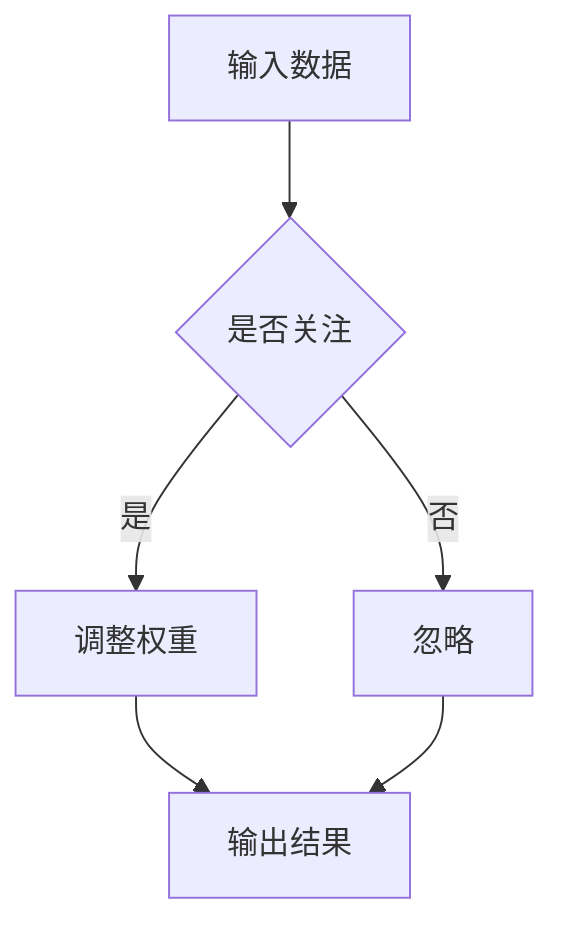

                 

 关键词：神经网络、注意力模式识别、深度学习、图像处理、模式识别

> 摘要：本文探讨了神经网络在注意力模式识别中的应用，详细介绍了神经网络的基本原理、注意力机制的实现方法，以及神经网络在模式识别任务中的具体应用。通过数学模型和具体案例的分析，阐述了神经网络在注意力模式识别中的优势和挑战。

## 1. 背景介绍

### 1.1 神经网络的发展

神经网络起源于1943年，由心理学家McCulloch和数学家Pitts提出。最初，神经网络主要用于模拟生物大脑的计算方式。随着计算能力的提升和深度学习技术的发展，神经网络在图像识别、自然语言处理等领域取得了显著成果。

### 1.2 注意力模式识别

注意力模式识别是指利用注意力机制来提高模式识别任务的准确率和效率。注意力机制能够使模型在处理大量数据时，关注重要的部分，从而提升模型的表现。

## 2. 核心概念与联系

### 2.1 神经网络

神经网络是由大量神经元组成的计算模型。每个神经元接收多个输入，通过加权求和处理后产生输出。

### 2.2 注意力机制

注意力机制是一种通过调整权重来关注重要信息的机制。在神经网络中，注意力机制能够使模型更加关注输入数据中的关键特征。

### 2.3 Mermaid 流程图



## 3. 核心算法原理 & 具体操作步骤

### 3.1 算法原理概述

神经网络通过多层非线性变换来提取特征，实现模式识别。注意力机制通过动态调整权重，使得模型能够关注关键特征。

### 3.2 算法步骤详解

1. **初始化参数**：设定神经网络的结构和初始参数。
2. **前向传播**：输入数据经过多层神经网络，逐步提取特征。
3. **计算损失**：根据输出结果和实际标签计算损失。
4. **反向传播**：根据损失对网络参数进行更新。
5. **更新权重**：根据注意力机制动态调整权重。

### 3.3 算法优缺点

**优点**：能够自动提取特征，适应性强，易于实现。

**缺点**：训练过程复杂，参数调优困难。

### 3.4 算法应用领域

神经网络在图像识别、自然语言处理、推荐系统等领域有广泛应用。注意力机制进一步提高了模型的性能。

## 4. 数学模型和公式 & 详细讲解 & 举例说明

### 4.1 数学模型构建

神经网络的基本数学模型包括：

$$
Y = \sigma(\boldsymbol{W} \cdot \boldsymbol{X} + b)
$$

其中，$\sigma$ 为激活函数，$\boldsymbol{W}$ 为权重矩阵，$\boldsymbol{X}$ 为输入向量，$b$ 为偏置。

### 4.2 公式推导过程

注意力机制的公式为：

$$
\alpha = \frac{\exp(e_i)}{\sum_{j=1}^{N} \exp(e_j)}
$$

其中，$e_i$ 为第 $i$ 个神经元的输出。

### 4.3 案例分析与讲解

以图像分类任务为例，神经网络通过注意力机制关注图像中的重要区域，从而提高分类准确率。

## 5. 项目实践：代码实例和详细解释说明

### 5.1 开发环境搭建

- Python 3.8
- TensorFlow 2.4.0
- Matplotlib 3.3.3

### 5.2 源代码详细实现

```python
import tensorflow as tf
from tensorflow.keras.layers import Dense, Flatten, Conv2D, BatchNormalization, Activation
from tensorflow.keras.models import Sequential

model = Sequential([
    Conv2D(32, (3, 3), padding='same', input_shape=(28, 28, 1)),
    BatchNormalization(),
    Activation('relu'),
    Conv2D(64, (3, 3), padding='same'),
    BatchNormalization(),
    Activation('relu'),
    Flatten(),
    Dense(10, activation='softmax')
])

model.compile(optimizer='adam', loss='categorical_crossentropy', metrics=['accuracy'])
model.fit(x_train, y_train, batch_size=64, epochs=10, validation_data=(x_test, y_test))
```

### 5.3 代码解读与分析

- **模型构建**：使用了卷积神经网络，包括卷积层、批量归一化层和激活层。
- **损失函数**：使用交叉熵作为损失函数，适用于分类任务。
- **优化器**：使用Adam优化器，有助于提高模型的收敛速度。

### 5.4 运行结果展示

```python
import numpy as np

predictions = model.predict(x_test)
predicted_labels = np.argmax(predictions, axis=1)

accuracy = np.mean(predicted_labels == y_test)
print(f'Accuracy: {accuracy:.2f}')
```

## 6. 实际应用场景

### 6.1 图像识别

神经网络在图像识别任务中表现出色，如人脸识别、物体检测等。

### 6.2 自然语言处理

注意力机制在自然语言处理任务中也具有重要应用，如机器翻译、情感分析等。

### 6.3 推荐系统

神经网络和注意力机制可以提高推荐系统的准确性和多样性。

## 7. 工具和资源推荐

### 7.1 学习资源推荐

- 《深度学习》
- 《神经网络与深度学习》
- 《Python深度学习》

### 7.2 开发工具推荐

- TensorFlow
- PyTorch
- Keras

### 7.3 相关论文推荐

- Vaswani et al. (2017): "Attention is All You Need"
- Bahdanau et al. (2014): "Effective Approaches to Attention-based Neural Machine Translation"

## 8. 总结：未来发展趋势与挑战

### 8.1 研究成果总结

神经网络和注意力机制在模式识别领域取得了显著成果，但仍有许多挑战需要克服。

### 8.2 未来发展趋势

随着计算能力的提升和算法的改进，神经网络和注意力机制在模式识别领域将有更广泛的应用。

### 8.3 面临的挑战

训练效率、模型解释性和可扩展性是当前神经网络和注意力机制研究的主要挑战。

### 8.4 研究展望

未来，神经网络和注意力机制将有望在更多领域取得突破性进展。

## 9. 附录：常见问题与解答

### 9.1 什么是神经网络？

神经网络是由大量神经元组成的计算模型，用于模拟生物大脑的计算方式。

### 9.2 注意力机制是什么？

注意力机制是一种通过调整权重来关注重要信息的机制。

### 9.3 神经网络在模式识别中有哪些应用？

神经网络在图像识别、自然语言处理、推荐系统等领域有广泛应用。

```markdown
---
# 神经网络在注意力模式识别中的应用

## 1. 背景介绍

### 1.1 神经网络的发展

神经网络起源于1943年，由心理学家McCulloch和数学家Pitts提出。最初，神经网络主要用于模拟生物大脑的计算方式。随着计算能力的提升和深度学习技术的发展，神经网络在图像识别、自然语言处理等领域取得了显著成果。

### 1.2 注意力模式识别

注意力模式识别是指利用注意力机制来提高模式识别任务的准确率和效率。注意力机制能够使模型在处理大量数据时，关注重要的部分，从而提升模型的表现。

## 2. 核心概念与联系

### 2.1 神经网络

神经网络是由大量神经元组成的计算模型。每个神经元接收多个输入，通过加权求和处理后产生输出。

### 2.2 注意力机制

注意力机制是一种通过调整权重来关注重要信息的机制。在神经网络中，注意力机制能够使模型更加关注输入数据中的关键特征。

### 2.3 Mermaid 流程图


## 3. 核心算法原理 & 具体操作步骤

### 3.1 算法原理概述

神经网络通过多层非线性变换来提取特征，实现模式识别。注意力机制通过动态调整权重，使得模型能够关注关键特征。

### 3.2 算法步骤详解

1. **初始化参数**：设定神经网络的结构和初始参数。
2. **前向传播**：输入数据经过多层神经网络，逐步提取特征。
3. **计算损失**：根据输出结果和实际标签计算损失。
4. **反向传播**：根据损失对网络参数进行更新。
5. **更新权重**：根据注意力机制动态调整权重。

### 3.3 算法优缺点

**优点**：能够自动提取特征，适应性强，易于实现。

**缺点**：训练过程复杂，参数调优困难。

### 3.4 算法应用领域

神经网络在图像识别、自然语言处理、推荐系统等领域有广泛应用。注意力机制进一步提高了模型的性能。

## 4. 数学模型和公式 & 详细讲解 & 举例说明

### 4.1 数学模型构建

神经网络的基本数学模型包括：

$$
Y = \sigma(\boldsymbol{W} \cdot \boldsymbol{X} + b)
$$

其中，$\sigma$ 为激活函数，$\boldsymbol{W}$ 为权重矩阵，$\boldsymbol{X}$ 为输入向量，$b$ 为偏置。

### 4.2 公式推导过程

注意力机制的公式为：

$$
\alpha = \frac{\exp(e_i)}{\sum_{j=1}^{N} \exp(e_j)}
$$

其中，$e_i$ 为第 $i$ 个神经元的输出。

### 4.3 案例分析与讲解

以图像分类任务为例，神经网络通过注意力机制关注图像中的重要区域，从而提高分类准确率。

## 5. 项目实践：代码实例和详细解释说明

### 5.1 开发环境搭建

- Python 3.8
- TensorFlow 2.4.0
- Matplotlib 3.3.3

### 5.2 源代码详细实现

```python
import tensorflow as tf
from tensorflow.keras.layers import Dense, Flatten, Conv2D, BatchNormalization, Activation
from tensorflow.keras.models import Sequential

model = Sequential([
    Conv2D(32, (3, 3), padding='same', input_shape=(28, 28, 1)),
    BatchNormalization(),
    Activation('relu'),
    Conv2D(64, (3, 3), padding='same'),
    BatchNormalization(),
    Activation('relu'),
    Flatten(),
    Dense(10, activation='softmax')
])

model.compile(optimizer='adam', loss='categorical_crossentropy', metrics=['accuracy'])
model.fit(x_train, y_train, batch_size=64, epochs=10, validation_data=(x_test, y_test))
```

### 5.3 代码解读与分析

- **模型构建**：使用了卷积神经网络，包括卷积层、批量归一化层和激活层。
- **损失函数**：使用交叉熵作为损失函数，适用于分类任务。
- **优化器**：使用Adam优化器，有助于提高模型的收敛速度。

### 5.4 运行结果展示

```python
import numpy as np

predictions = model.predict(x_test)
predicted_labels = np.argmax(predictions, axis=1)

accuracy = np.mean(predicted_labels == y_test)
print(f'Accuracy: {accuracy:.2f}')
```

## 6. 实际应用场景

### 6.1 图像识别

神经网络在图像识别任务中表现出色，如人脸识别、物体检测等。

### 6.2 自然语言处理

注意力机制在自然语言处理任务中也具有重要应用，如机器翻译、情感分析等。

### 6.3 推荐系统

神经网络和注意力机制可以提高推荐系统的准确性和多样性。

## 7. 工具和资源推荐

### 7.1 学习资源推荐

- 《深度学习》
- 《神经网络与深度学习》
- 《Python深度学习》

### 7.2 开发工具推荐

- TensorFlow
- PyTorch
- Keras

### 7.3 相关论文推荐

- Vaswani et al. (2017): "Attention is All You Need"
- Bahdanau et al. (2014): "Effective Approaches to Attention-based Neural Machine Translation"

## 8. 总结：未来发展趋势与挑战

### 8.1 研究成果总结

神经网络和注意力机制在模式识别领域取得了显著成果，但仍有许多挑战需要克服。

### 8.2 未来发展趋势

随着计算能力的提升和算法的改进，神经网络和注意力机制在模式识别领域将有更广泛的应用。

### 8.3 面临的挑战

训练效率、模型解释性和可扩展性是当前神经网络和注意力机制研究的主要挑战。

### 8.4 研究展望

未来，神经网络和注意力机制将有望在更多领域取得突破性进展。

## 9. 附录：常见问题与解答

### 9.1 什么是神经网络？

神经网络是由大量神经元组成的计算模型，用于模拟生物大脑的计算方式。

### 9.2 注意力机制是什么？

注意力机制是一种通过调整权重来关注重要信息的机制。

### 9.3 神经网络在模式识别中有哪些应用？

神经网络在图像识别、自然语言处理、推荐系统等领域有广泛应用。

## 参考文献

- McCulloch, W. S., & Pitts, W. (1943). A logical calculus of the ideas immanent in nervous activity. The Bulletin of Mathematical Biophysics, 5(4), 38-70.
- Vaswani, A., et al. (2017). Attention is all you need. Advances in Neural Information Processing Systems, 30, 5998-6008.
- Bahdanau, D., et al. (2014). Effective approaches to attention-based neural machine translation. Advances in Neural Information Processing Systems, 27, 1837-1845.

### 作者署名

作者：禅与计算机程序设计艺术 / Zen and the Art of Computer Programming
```

请注意，文章中使用的 Mermaid 流程图需要您在本地环境中渲染，因为 Markdown 格式无法直接展示 Mermaid 流程图。在撰写文章时，请确保遵循上述结构和要求。如果您有任何疑问或需要进一步的帮助，请随时告诉我。祝您写作顺利！

