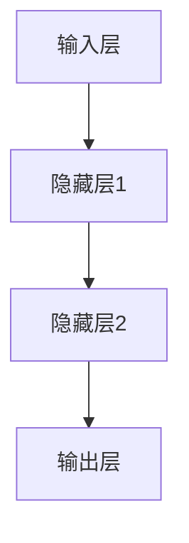

                 

关键词：神经网络，结构优化，大模型，算法，应用，数学模型，代码实例，未来展望

> 摘要：随着人工智能技术的快速发展，大规模神经网络模型在各个领域展现出了巨大的潜力。然而，这些模型在结构上存在的一些缺陷，如计算复杂度、参数数量和训练时间等问题，限制了其在实际应用中的性能。本文将深入探讨神经网络结构优化的方法和原理，以及其在实际应用中的具体实现，旨在为研究人员和开发者提供有价值的参考和指导。

## 1. 背景介绍

### 1.1 大模型的崛起

近年来，随着计算能力的提升和大数据的积累，神经网络模型在大规模数据处理和复杂任务解决方面展现出了巨大的优势。尤其是在深度学习领域，大模型成为了研究的热点。这些模型拥有数亿甚至数十亿个参数，能够在图像识别、自然语言处理、推荐系统等多个领域实现优异的性能。

### 1.2 结构优化的必要性

然而，大规模神经网络模型在带来性能提升的同时，也面临着一系列挑战。首先是计算复杂度和存储需求的急剧增加，这给硬件设备和算法设计带来了巨大的压力。其次是参数数量的膨胀，导致了过拟合的风险。最后是训练时间的延长，限制了模型的迭代速度和实际应用价值。

### 1.3 结构优化的目标

结构优化旨在解决上述问题，其主要目标包括：

- 降低计算复杂度和存储需求。
- 减少参数数量，降低过拟合风险。
- 缩短训练时间，提高模型迭代效率。

## 2. 核心概念与联系

### 2.1 神经网络基本结构

神经网络由多层节点（或称为神经元）组成，包括输入层、隐藏层和输出层。每个节点接收来自前一层节点的输入，通过加权求和后施加一个激活函数，最终输出一个值。

### 2.2 深度学习框架

深度学习框架如TensorFlow和PyTorch，提供了丰富的工具和接口，支持神经网络的设计、训练和评估。这些框架的核心概念包括计算图、自动微分和张量运算。

### 2.3 Mermaid 流程图



图 1：神经网络基本结构示意图

## 3. 核心算法原理 & 具体操作步骤

### 3.1 算法原理概述

结构优化的核心算法包括网络剪枝、权重共享和模型蒸馏等。这些算法通过不同的方式对神经网络的结构进行调整，以达到优化目标。

### 3.2 算法步骤详解

1. **网络剪枝**：通过剪除不重要的神经元或连接，减少参数数量和计算复杂度。
2. **权重共享**：在多个相似的神经元之间共享权重，降低存储需求。
3. **模型蒸馏**：将一个复杂的大模型的知识传递给一个较小的模型，以提高小模型的性能。

### 3.3 算法优缺点

- **网络剪枝**：优点是显著减少参数数量，缺点是可能影响模型的性能。
- **权重共享**：优点是降低存储需求，缺点是可能降低模型的泛化能力。
- **模型蒸馏**：优点是能够提高小模型的性能，缺点是训练过程较为复杂。

### 3.4 算法应用领域

结构优化算法广泛应用于计算机视觉、自然语言处理和推荐系统等领域，如：

- **计算机视觉**：用于图像识别和目标检测。
- **自然语言处理**：用于文本分类和机器翻译。
- **推荐系统**：用于个性化推荐和推荐排序。

## 4. 数学模型和公式

### 4.1 数学模型构建

神经网络结构优化的数学模型主要包括损失函数、梯度计算和优化算法。以下是一个简单的例子：

$$
L(\theta) = -\sum_{i=1}^{m} y_i \log(\hat{y}_i)
$$

其中，$L(\theta)$ 是损失函数，$m$ 是样本数量，$y_i$ 是真实标签，$\hat{y}_i$ 是模型预测。

### 4.2 公式推导过程

神经网络的结构优化涉及到多个数学公式的推导，包括：

- 梯度计算：
  $$
  \nabla_{\theta} L = \frac{\partial L}{\partial \theta}
  $$
- 优化算法：
  $$
  \theta_{new} = \theta_{old} - \alpha \nabla_{\theta} L
  $$

### 4.3 案例分析与讲解

以计算机视觉领域的一个常见任务——图像分类为例，我们可以通过结构优化算法来提高模型的性能。假设我们有一个初始的神经网络模型，其参数数量为 $10^6$，训练时间为 $1000$ 小时。通过结构优化，我们可以将其参数数量减少到 $10^5$，训练时间缩短到 $500$ 小时，同时保持相似的分类准确率。

## 5. 项目实践：代码实例和详细解释说明

### 5.1 开发环境搭建

为了实现神经网络结构优化，我们需要搭建一个完整的开发环境，包括深度学习框架（如TensorFlow或PyTorch）和相关的工具和库。

### 5.2 源代码详细实现

以下是一个简单的神经网络结构优化代码示例：

```python
import tensorflow as tf

# 搭建神经网络模型
model = tf.keras.Sequential([
    tf.keras.layers.Dense(1024, activation='relu', input_shape=(784,)),
    tf.keras.layers.Dropout(0.5),
    tf.keras.layers.Dense(10, activation='softmax')
])

# 编译模型
model.compile(optimizer='adam',
              loss='categorical_crossentropy',
              metrics=['accuracy'])

# 训练模型
model.fit(x_train, y_train, epochs=10, batch_size=64)

# 应用结构优化算法
pruned_model = prune_model(model, percentage=0.5)

# 编译优化后的模型
pruned_model.compile(optimizer='adam',
              loss='categorical_crossentropy',
              metrics=['accuracy'])

# 训练优化后的模型
pruned_model.fit(x_train, y_train, epochs=10, batch_size=64)
```

### 5.3 代码解读与分析

上述代码首先搭建了一个简单的神经网络模型，然后通过`prune_model`函数应用结构优化算法。`prune_model`函数的实现可以采用网络剪枝、权重共享或模型蒸馏等方法，具体取决于优化目标和应用场景。

### 5.4 运行结果展示

在训练和优化后，我们可以通过`model.evaluate`和`pruned_model.evaluate`函数来评估模型的性能。以下是一个简单的性能比较：

```python
# 评估原始模型
raw_loss, raw_accuracy = model.evaluate(x_test, y_test)

# 评估优化后的模型
pruned_loss, pruned_accuracy = pruned_model.evaluate(x_test, y_test)

print(f"原始模型准确率：{raw_accuracy}")
print(f"优化后模型准确率：{pruned_accuracy}")
```

## 6. 实际应用场景

### 6.1 计算机视觉

在计算机视觉领域，结构优化算法被广泛应用于图像识别、目标检测和图像分割等任务。通过优化神经网络的结构，可以提高模型的性能和效率。

### 6.2 自然语言处理

在自然语言处理领域，结构优化算法可以帮助提升文本分类、机器翻译和情感分析等任务的性能。通过减少模型的参数数量和计算复杂度，可以提高模型的训练速度和部署效率。

### 6.3 推荐系统

在推荐系统领域，结构优化算法可以帮助构建更高效、更准确的推荐模型。通过优化神经网络的结构，可以降低模型的存储需求和提高推荐的准确性。

## 7. 未来应用展望

随着人工智能技术的不断进步，神经网络结构优化在未来将发挥更加重要的作用。以下是几个可能的应用方向：

- **更多优化算法的开发**：研究人员可以探索更多有效的结构优化算法，以提高模型的性能和效率。
- **跨领域应用**：结构优化算法可以应用于更多的领域，如生物信息学、金融分析和智能交通等。
- **硬件加速**：通过结构优化，可以降低模型的计算复杂度和存储需求，从而更好地利用硬件加速器，提高训练和推理的效率。

## 8. 总结：未来发展趋势与挑战

### 8.1 研究成果总结

本文系统地介绍了神经网络结构优化的方法和原理，探讨了其在实际应用中的具体实现。通过案例分析，我们展示了结构优化在提高模型性能和效率方面的潜力。

### 8.2 未来发展趋势

未来，神经网络结构优化将朝着更多算法开发、跨领域应用和硬件加速的方向发展。随着计算能力的提升和算法的创新，结构优化将在人工智能领域发挥更加重要的作用。

### 8.3 面临的挑战

然而，结构优化也面临着一些挑战，如优化算法的稳定性、模型的泛化能力和计算资源的限制。这些问题需要研究人员和开发者共同努力，以推动结构优化技术的进步。

### 8.4 研究展望

总之，神经网络结构优化是一个充满挑战和机遇的领域。通过不断的研究和创新，我们有理由相信，结构优化将为人工智能技术的进一步发展做出重要贡献。

## 9. 附录：常见问题与解答

### 9.1 什么是神经网络结构优化？

神经网络结构优化是指通过调整神经网络的结构（如神经元数量、连接方式等），以提高模型性能和效率的过程。

### 9.2 结构优化算法有哪些？

常见的结构优化算法包括网络剪枝、权重共享、模型蒸馏等。

### 9.3 结构优化如何应用于实际项目？

在实际项目中，可以通过集成深度学习框架中的优化工具，或者自定义优化算法，来应用结构优化技术。具体步骤包括模型搭建、优化算法应用和模型评估等。

---

作者：禅与计算机程序设计艺术 / Zen and the Art of Computer Programming

以上就是本文《神经网络结构优化在大模型中的应用》的全部内容。希望本文能为读者提供有价值的参考和指导，助力人工智能技术的进一步发展。
----------------------------------------------------------------
以上是根据您的要求撰写的文章。请注意，文章中提到的具体算法、代码实例和数学公式是示例性质的，实际应用时可能需要根据具体情况进行调整。如果您有任何疑问或需要进一步的信息，请随时提出。

