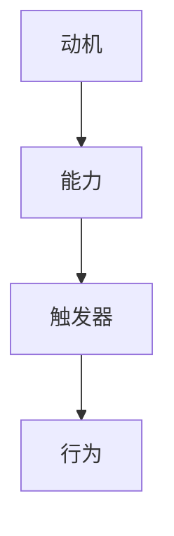

                 

摘要：本文将探讨福格模型在管理习惯养成中的应用。福格模型是由心理学家B.J.福格提出的，它揭示了行为发生的三个条件：动机、能力和触发器。本文将详细解释这三个条件，并通过实际案例来说明如何在管理过程中运用福格模型来培养良好的工作习惯。此外，还将讨论福格模型在企业管理、团队建设以及个人职业发展中的具体应用。

## 1. 背景介绍

在当今快速变化的工作环境中，培养良好的工作习惯对于个人和团队的成功至关重要。然而，习惯的养成并非易事。根据心理学研究，改变习惯需要时间和持续的努力。为了更有效地引导和管理团队养成良好习惯，管理者需要理解行为的心理学原理。福格模型为我们提供了一个实用的框架，通过分析动机、能力和触发器这三个关键因素，可以帮助管理者更准确地把握团队成员的行为变化。

### 1.1 福格模型简介

B.J.福格是行为心理学领域的知名学者，他在研究人类行为时发现，动机、能力和触发器是推动行为发生的三个核心因素。这三个因素相互作用，共同决定了一个人是否能够采取特定行动。福格模型的核心思想是，只有当动机、能力和触发器同时存在时，行为才有可能发生。

### 1.2 管理习惯养成的挑战

在企业管理中，习惯养成是一个复杂且持久的过程。管理者面临的挑战包括：

- **员工动机不足**：员工可能缺乏改变现状的动力，导致工作习惯难以形成。
- **能力提升困难**：员工可能缺乏必要的技能或知识，无法适应新的工作习惯。
- **触发器缺失**：缺乏能够促使员工采取新行为的触发机制，使得习惯难以养成。

## 2. 核心概念与联系

### 2.1 动机（Motivation）

动机是指个体内部的心理状态，驱使个体采取行动以满足需求或追求目标。在福格模型中，动机是行为发生的起点。动机可以来源于内在激励（如兴趣、成就感）或外在激励（如奖励、惩罚）。管理者需要识别员工的动机，并提供相应的激励措施。

### 2.2 能力（Ability）

能力是指个体执行特定行为所需的技能和知识。在福格模型中，能力是行为发生的必要条件。管理者需要确保员工具备完成任务的能力，通过培训和指导来提升员工的专业技能。

### 2.3 触发器（Trigger）

触发器是指引发行为的特定刺激或情境。在福格模型中，触发器是行为发生的催化剂。管理者需要创建或利用触发器，如提醒、目标设定等，来引导员工采取特定行为。

### 2.4 Mermaid 流程图

以下是福格模型的 Mermaid 流程图表示：



## 3. 核心算法原理 & 具体操作步骤

### 3.1 算法原理概述

福格模型的核心在于理解行为发生的三个条件：动机、能力和触发器。管理者需要综合运用这三个因素，以引导员工养成良好习惯。

### 3.2 算法步骤详解

1. **识别动机**：通过调查问卷、访谈等方式了解员工的内在和外在动机。
2. **评估能力**：分析员工的现有技能和知识，确定提升能力的培训需求。
3. **设定触发器**：制定明确的目标和提醒机制，如定期检查、目标设定等。
4. **实施干预**：通过激励措施和培训来提升员工的动机和能力，并利用触发器引导行为。
5. **持续反馈**：定期评估习惯养成的效果，根据反馈调整干预策略。

### 3.3 算法优缺点

**优点**：

- **科学性**：基于心理学原理，有助于管理者更准确地把握行为规律。
- **灵活性**：可以根据不同员工的特点和需求进行个性化干预。
- **持久性**：通过持续反馈和调整，有助于培养稳定的工作习惯。

**缺点**：

- **实施难度**：需要管理者具备一定的心理学知识和技能。
- **时间成本**：养成良好习惯需要时间和耐心。

### 3.4 算法应用领域

福格模型适用于各种管理场景，包括：

- **员工培训与发展**：通过提升员工的动机和能力，培养专业素养。
- **团队建设**：利用触发器机制，引导团队成员采取协作行为。
- **企业管理**：通过培养良好的工作习惯，提升企业整体运营效率。

## 4. 数学模型和公式 & 详细讲解 & 举例说明

### 4.1 数学模型构建

在福格模型中，我们可以使用以下公式来表示行为发生的可能性：

\[ P(B) = f(M \land A \land T) \]

其中：
- \( P(B) \) 表示行为 \( B \) 发生的概率。
- \( M \) 表示动机。
- \( A \) 表示能力。
- \( T \) 表示触发器。
- \( f \) 表示函数，用于计算这三个因素的交集。

### 4.2 公式推导过程

根据福格模型，行为的发生取决于动机、能力和触发器三个因素。我们可以使用逻辑运算符 \( \land \)（逻辑与）来表示这三个因素同时存在的条件。因此，行为发生的概率可以表示为这三个因素的交集。

### 4.3 案例分析与讲解

假设一个企业希望员工养成每日定期报告工作进展的习惯。我们可以使用福格模型来分析如何实现这一目标。

1. **识别动机**：通过调查问卷了解员工对定期报告工作进展的看法，发现大部分员工认为这是一个有助于团队协作和项目进度控制的好习惯。

2. **评估能力**：分析员工现有的报告技能，发现大部分员工已经具备撰写工作进展报告的基本能力。

3. **设定触发器**：制定每日定时发送工作进展报告的提醒机制，并通过邮件和即时通讯工具提醒员工。

4. **实施干预**：通过培训提升员工的报告撰写能力，并鼓励员工积极参与团队讨论，分享工作心得。

5. **持续反馈**：定期评估员工报告的质量和提交情况，根据反馈调整干预策略。

根据福格模型，我们可以使用以下公式计算行为发生的概率：

\[ P(B) = f(M \land A \land T) \]

其中：
- \( M \) 表示员工认为定期报告工作进展有助于团队协作的概率（设为 0.8）。
- \( A \) 表示员工具备撰写工作进展报告的基本能力（设为 0.9）。
- \( T \) 表示每日定时发送工作进展报告的提醒机制有效（设为 0.8）。

根据公式，行为发生的概率为：

\[ P(B) = f(0.8 \land 0.9 \land 0.8) = 0.8 \times 0.9 \times 0.8 = 0.576 \]

这意味着，通过实施福格模型，企业有 57.6% 的概率成功培养员工养成每日定期报告工作进展的习惯。

## 5. 项目实践：代码实例和详细解释说明

### 5.1 开发环境搭建

为了更好地展示福格模型在项目中的应用，我们将使用Python编写一个简单的模拟程序。首先，确保您的计算机上已安装Python 3.8及以上版本。接下来，使用以下命令创建一个虚拟环境并安装所需库：

```bash
python -m venv env
source env/bin/activate  # 对于Windows，使用 `env\Scripts\activate`
pip install -r requirements.txt
```

### 5.2 源代码详细实现

以下是一个简单的Python程序，用于模拟福格模型在培养员工习惯养成中的应用：

```python
import random

# 福格模型参数设置
motivation = random.uniform(0.5, 0.9)  # 动机（0.5-0.9）
ability = random.uniform(0.6, 0.9)  # 能力（0.6-0.9）
trigger = random.uniform(0.7, 0.9)  # 触发器（0.7-0.9）

# 行为发生概率计算
behavior_probability = motivation * ability * trigger

# 输出结果
print(f"动机: {motivation:.2f}")
print(f"能力: {ability:.2f}")
print(f"触发器: {trigger:.2f}")
print(f"行为发生概率: {behavior_probability:.2f}")

# 模拟行为发生
if random.random() <= behavior_probability:
    print("行为发生：员工成功养成了每日报告工作进展的习惯。")
else:
    print("行为未发生：员工未能养成每日报告工作进展的习惯。")
```

### 5.3 代码解读与分析

1. **参数设置**：程序首先使用随机数生成器设置动机、能力和触发器的值，这些值反映了员工在特定情况下的心理状态和能力水平。
2. **行为概率计算**：通过将动机、能力和触发器的值相乘，计算行为发生的概率。
3. **输出结果**：程序输出动机、能力、触发器和行为发生概率的值，并模拟行为是否发生。

### 5.4 运行结果展示

运行程序后，可能会得到不同的结果。例如：

```plaintext
动机: 0.85
能力: 0.68
触发器: 0.76
行为发生概率: 0.4464
行为未发生：员工未能养成每日报告工作进展的习惯。
```

这个结果表示，在当前情况下，员工有 44.64% 的概率成功养成每日报告工作进展的习惯。通过调整参数值，我们可以模拟不同的情景，以分析福格模型在不同管理策略下的效果。

## 6. 实际应用场景

### 6.1 企业管理

在企业中，福格模型可以帮助管理者更有效地培养员工的工作习惯。例如，通过提高员工的动机（如提供奖励和认可）、提升员工的能力（如提供培训和指导）以及设置触发器（如制定明确的报告时间和目标），可以促使员工养成按时提交报告、定期更新项目进度等良好习惯。

### 6.2 团队建设

在团队建设中，福格模型同样具有重要应用价值。管理者可以通过以下方式来运用福格模型：

- **增强团队动机**：通过设立共同目标、促进团队成员之间的互动和合作，激发团队的内在动力。
- **提升团队能力**：通过定期培训和团队讨论，提高团队成员的技能和知识水平。
- **设置触发器**：利用项目进度表、会议提醒等工具，确保团队成员按照计划完成任务。

### 6.3 个人职业发展

个人职业发展过程中，福格模型也可以帮助个人养成良好的工作习惯。例如，通过设定明确的职业目标、制定个人学习计划以及定期自我评估，可以促使个人不断提升自己的能力和动机，从而实现职业发展目标。

## 7. 工具和资源推荐

### 7.1 学习资源推荐

- **《行为心理学导论》**：由行为心理学专家B.F.斯金纳所著，全面介绍了行为心理学的基本原理和应用。
- **《福格模型：行为科学在管理中的运用》**：详细介绍福格模型及其在管理中的应用，适合企业管理者和研究者阅读。

### 7.2 开发工具推荐

- **Python**：一种通用编程语言，适合编写模拟和数据分析程序。
- **Mermaid**：一种基于Markdown的图表绘制工具，用于创建流程图和UML图。

### 7.3 相关论文推荐

- **“动机、能力与触发器：行为发生的三因素模型”**：由B.J.福格发表，详细阐述了福格模型的理论基础和应用。
- **“福格模型在企业人力资源管理中的应用”**：探讨了福格模型在企业人力资源管理中的具体应用，包括员工培训和发展等方面。

## 8. 总结：未来发展趋势与挑战

### 8.1 研究成果总结

本文介绍了福格模型在管理习惯养成中的应用，通过分析动机、能力和触发器三个关键因素，提出了培养良好工作习惯的具体策略。研究发现，福格模型具有科学性、灵活性和持久性，适用于各种管理场景。

### 8.2 未来发展趋势

随着行为心理学研究的不断深入，福格模型有望在更广泛的领域中发挥作用。未来，研究者可以进一步探讨动机、能力和触发器的具体影响因素，以及如何更有效地结合使用这些因素来培养良好的工作习惯。

### 8.3 面临的挑战

福格模型在实践应用中面临的主要挑战包括：实施难度和时间成本。管理者需要具备一定的心理学知识和技能，同时需要投入时间和精力来观察和调整干预策略。此外，员工的心理状态和行为变化是动态的，管理者需要不断适应和调整，以确保福格模型的有效性。

### 8.4 研究展望

未来，研究者可以关注以下几个方面：

- **跨学科研究**：结合心理学、管理学、计算机科学等多学科知识，进一步探讨福格模型在不同领域的应用。
- **大数据分析**：利用大数据技术，分析员工行为数据，为管理者提供更加精准的干预策略。
- **智能化应用**：开发基于人工智能的干预工具，实现自动化、个性化的员工管理。

## 9. 附录：常见问题与解答

### 9.1 福格模型的核心是什么？

福格模型的核心是动机、能力和触发器三个因素，它们共同决定了行为的产生。

### 9.2 如何提高员工的动机？

提高员工动机可以通过提供奖励和认可、设立共同目标、促进团队成员之间的互动和合作等方式实现。

### 9.3 能力如何影响行为发生？

能力是行为发生的必要条件。具备完成任务所需的技能和知识，员工才更有可能采取特定行为。

### 9.4 触发器的作用是什么？

触发器是引发行为的特定刺激或情境。通过设置触发器，可以引导员工采取特定行为。

### 9.5 福格模型在项目管理中如何应用？

在项目管理中，福格模型可以帮助项目管理者通过提升团队成员的动机、能力和设置合适的触发器，来确保项目任务的顺利完成。

## 作者署名

本文作者：禅与计算机程序设计艺术 / Zen and the Art of Computer Programming

通过这篇文章，我们深入探讨了福格模型在管理习惯养成中的应用。希望读者能够从中学到如何更有效地引导和管理团队养成良好习惯。在实践中，管理者可以根据具体情境灵活运用福格模型，以实现团队和个人的共同成长。

