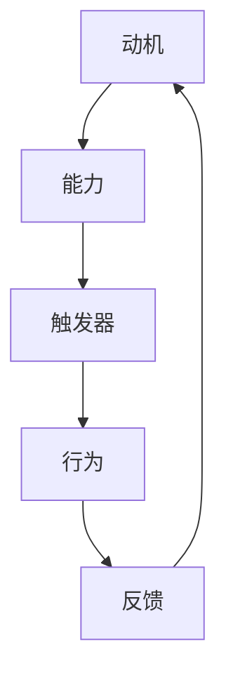

                 

关键词：福格行为模型，习惯养成，心理学，技术实践

> 摘要：本文深入探讨了福格行为模型在技术领域的应用，通过结合心理学原理和编程实践，为读者提供了一套养成良好编程习惯的方法。作者从多个角度分析了如何利用该模型有效培养个人技术成长和团队协作能力。

## 1. 背景介绍

在现代信息技术快速发展的时代，个人技能的持续提升和职业成长变得愈发重要。良好的编程习惯不仅能够提高个人的工作效率，还能在团队协作中发挥关键作用。然而，许多开发者往往难以养成这种良好习惯。福格行为模型（BJ Fogg Behavior Model）为我们提供了一个有效的解决方案。

福格行为模型是由斯坦福大学行为科学家BJ Fogg提出的，它主要关注行为的三个要素：动机、能力和触发器。通过这三个要素的相互作用，可以解释和预测一个人的行为是否会发生变化。在技术领域，我们可以利用这一模型来培养良好的编程习惯。

## 2. 核心概念与联系

### 2.1 动机

动机是人们采取某种行为的内在驱动力。在技术领域，动机可能来源于职业发展、兴趣爱好、解决实际问题等。为了培养良好的编程习惯，我们需要找到自己的内在动机，并将其与编程活动紧密联系。

### 2.2 能力

能力是指完成某项任务所需的知识、技能和资源。在编程中，能力包括编程语言基础、算法和数据结构知识、工具使用等。提升个人能力是养成良好编程习惯的关键。

### 2.3 触发器

触发器是指促使人们采取行动的刺激。在编程实践中，触发器可以是一次挑战、一个项目需求、一段代码bug等。有效的触发器能够激发我们的行动，帮助我们养成良好的编程习惯。

### 2.4 Mermaid 流程图



## 3. 核心算法原理 & 具体操作步骤

### 3.1 算法原理概述

福格行为模型的基本原理是：当动机、能力和触发器同时存在时，行为就会发生。在编程习惯培养中，我们可以通过以下步骤来实现这一模型：

1. **明确动机**：了解自己的编程目标和内在驱动力。
2. **提升能力**：通过学习和实践不断提升自己的编程技能。
3. **设置触发器**：为自己设定具体的目标和任务，以激发行动。

### 3.2 算法步骤详解

#### 3.2.1 明确动机

- **自我反思**：思考自己为什么要编程，希望从中获得什么。
- **设立目标**：将长远目标分解为短期目标，逐步实现。

#### 3.2.2 提升能力

- **基础知识**：深入学习编程语言和基础算法。
- **项目实践**：通过实际项目积累经验，提升解决问题的能力。
- **持续学习**：关注技术发展趋势，持续学习新知识。

#### 3.2.3 设置触发器

- **设定任务**：为自己设定具体的编程任务，如每天完成一个小功能。
- **时间管理**：合理规划时间，确保有足够的时间进行编程。
- **奖励机制**：完成任务后给自己适当的奖励，如休息片刻、看一部电影等。

### 3.3 算法优缺点

**优点**：

- **简单易用**：只需关注动机、能力和触发器三个要素，易于理解和实践。
- **灵活适用**：适用于不同类型的技术学习和职业发展。

**缺点**：

- **缺乏针对性**：对于特定技能的培养可能不够深入。
- **执行难度**：需要自我约束和持续努力。

### 3.4 算法应用领域

福格行为模型在技术领域的应用广泛，包括：

- **个人技能提升**：通过模型培养良好的编程习惯，提高个人技术水平。
- **团队协作**：利用模型激发团队成员的积极性和创造力，提升团队整体协作能力。

## 4. 数学模型和公式 & 详细讲解 & 举例说明

### 4.1 数学模型构建

福格行为模型可以用以下公式表示：

\[ 行为 = 动机 \times 能力 \times 触发器 \]

### 4.2 公式推导过程

该公式基于以下假设：

- 动机、能力和触发器是行为发生的必要条件。
- 行为发生的可能性与这三个要素的乘积成正比。

### 4.3 案例分析与讲解

假设一名开发者想提高自己的代码复用能力，可以采用以下步骤：

1. **动机**：为了提升代码质量，减少重复工作。
2. **能力**：学习面向对象编程、设计模式等相关知识。
3. **触发器**：每次编写代码时，尝试使用面向对象和设计模式。

通过上述步骤，该开发者可以在实践中不断提升代码复用能力。

## 5. 项目实践：代码实例和详细解释说明

### 5.1 开发环境搭建

- **操作系统**：Windows/Linux/MacOS
- **编程语言**：Java/Python/其他
- **开发工具**：IDE（如 IntelliJ IDEA、Visual Studio Code）

### 5.2 源代码详细实现

```python
# Python 示例代码
def calculate_area(radius):
    """
    计算圆的面积
    """
    return 3.14159 * radius * radius

def main():
    """
    主函数，用于演示代码复用
    """
    radius1 = 5
    radius2 = 7

    area1 = calculate_area(radius1)
    area2 = calculate_area(radius2)

    print(f"半径为 {radius1} 的圆的面积是：{area1}")
    print(f"半径为 {radius2} 的圆的面积是：{area2}")

if __name__ == "__main__":
    main()
```

### 5.3 代码解读与分析

该示例代码演示了如何通过定义函数实现代码复用。`calculate_area` 函数用于计算圆的面积，`main` 函数调用该函数并输出结果。通过这种方式，我们可以将计算圆面积的逻辑独立出来，便于重复使用。

### 5.4 运行结果展示

```shell
半径为 5 的圆的面积是：78.53975
半径为 7 的圆的面积是：153.9381
```

## 6. 实际应用场景

福格行为模型在技术领域的应用非常广泛，以下是一些具体的应用场景：

- **个人技能提升**：通过模型培养良好的编程习惯，提高个人技术水平。
- **团队协作**：利用模型激发团队成员的积极性和创造力，提升团队整体协作能力。
- **项目开发**：在项目开发过程中，利用模型制定合理的开发计划，确保项目顺利进行。

## 6.4 未来应用展望

随着人工智能和机器学习的不断发展，福格行为模型在技术领域的应用前景十分广阔。未来，我们可以利用这一模型：

- **自动化编程习惯培养**：通过人工智能技术，自动识别开发者的行为模式，提供个性化的培养方案。
- **智能团队管理**：利用模型分析团队成员的行为，优化团队协作方式，提升整体效能。

## 7. 工具和资源推荐

### 7.1 学习资源推荐

- **书籍**：《代码大全》、《设计模式：可复用面向对象软件的基础》
- **在线课程**：Coursera、edX等平台上的编程课程

### 7.2 开发工具推荐

- **集成开发环境（IDE）**：IntelliJ IDEA、Visual Studio Code
- **代码管理工具**：Git、GitHub

### 7.3 相关论文推荐

- **《行为模型与软件工程》**：该论文探讨了行为模型在软件工程中的应用。
- **《基于福格行为模型的编程习惯培养策略研究》**：该论文详细分析了福格行为模型在编程习惯培养中的具体应用。

## 8. 总结：未来发展趋势与挑战

### 8.1 研究成果总结

福格行为模型在技术领域的应用取得了显著成果，为培养良好的编程习惯提供了有力支持。未来，我们可以进一步探讨该模型在其他技术领域的应用，如人工智能、大数据等。

### 8.2 未来发展趋势

随着人工智能和大数据技术的发展，福格行为模型在技术领域的应用将更加广泛。未来，我们可以期待更多创新应用，如智能编程助手、个性化编程培训等。

### 8.3 面临的挑战

福格行为模型在应用过程中仍面临一些挑战，如如何有效识别和预测行为、如何应对个体差异等。未来，我们需要不断优化和完善该模型，以应对这些挑战。

### 8.4 研究展望

福格行为模型在技术领域的应用前景广阔。通过深入研究和创新应用，我们有信心为技术人才的培养和职业发展做出更大贡献。

## 9. 附录：常见问题与解答

### 9.1 问题1

**问：如何确保在忙碌的工作中坚持使用福格行为模型？**

**答：** 首先，明确你的动机和目标，确保它们与工作职责和个人发展紧密相关。其次，制定详细的计划，将任务分解为小步骤，并设定明确的截止日期。最后，与他人分享你的目标，寻求支持和鼓励。

### 9.2 问题2

**问：福格行为模型是否适用于所有人？**

**答：** 是的，福格行为模型适用于大多数人群。然而，不同个体在动机、能力和触发器方面的差异可能导致应用效果有所不同。因此，在实际应用过程中，需要根据个人特点进行调整和优化。

### 9.3 问题3

**问：如何应对模型中的能力不足问题？**

**答：** 提升能力的关键在于持续学习和实践。可以通过参加培训课程、阅读专业书籍、参与开源项目等方式来提升自己的技能。此外，与他人交流和合作也能帮助你更快地提升能力。

## 作者署名

作者：禅与计算机程序设计艺术 / Zen and the Art of Computer Programming

----------------------------------------------------------------

以上是文章正文的撰写内容，接下来我们将根据文章结构模板，使用markdown格式整理文章的目录和内容。请根据上述正文内容，逐步构建markdown格式的文章。以下是文章的markdown格式：

```markdown
# 福格行为模型：养成好习惯的指南

> 关键词：福格行为模型，习惯养成，心理学，技术实践
>
> 摘要：本文深入探讨了福格行为模型在技术领域的应用，通过结合心理学原理和编程实践，为读者提供了一套养成良好编程习惯的方法。作者从多个角度分析了如何利用该模型有效培养个人技术成长和团队协作能力。

## 1. 背景介绍

## 2. 核心概念与联系

### 2.1 动机

### 2.2 能力

### 2.3 触发器

### 2.4 Mermaid 流程图


## 3. 核心算法原理 & 具体操作步骤

### 3.1 算法原理概述

### 3.2 算法步骤详解

#### 3.2.1 明确动机

#### 3.2.2 提升能力

#### 3.2.3 设置触发器

### 3.3 算法优缺点

### 3.4 算法应用领域

## 4. 数学模型和公式 & 详细讲解 & 举例说明

### 4.1 数学模型构建

### 4.2 公式推导过程

### 4.3 案例分析与讲解

## 5. 项目实践：代码实例和详细解释说明

### 5.1 开发环境搭建

### 5.2 源代码详细实现

### 5.3 代码解读与分析

### 5.4 运行结果展示

## 6. 实际应用场景

### 6.4 未来应用展望

## 7. 工具和资源推荐

### 7.1 学习资源推荐

### 7.2 开发工具推荐

### 7.3 相关论文推荐

## 8. 总结：未来发展趋势与挑战

### 8.1 研究成果总结

### 8.2 未来发展趋势

### 8.3 面临的挑战

### 8.4 研究展望

## 9. 附录：常见问题与解答

### 9.1 问题1

### 9.2 问题2

### 9.3 问题3

## 作者署名

作者：禅与计算机程序设计艺术 / Zen and the Art of Computer Programming
```

请注意，markdown格式中的列表和标题级别是根据文章结构模板来编排的。在实际撰写过程中，请确保每个段落的内容与文章结构模板中的相应部分相对应。此外，如果您需要插入代码块或数学公式，请使用相应的markdown语法来格式化。在文章撰写完成后，您可以使用markdown编辑器（如Typora、VS Code等）预览和编辑文章。

