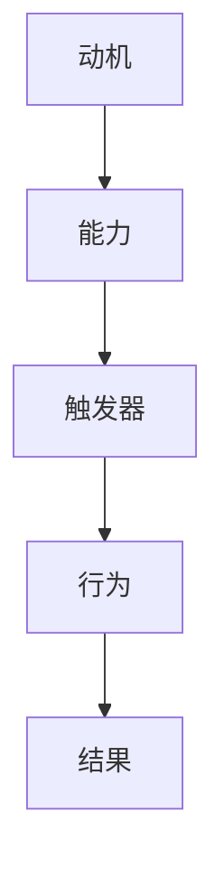

                 

 关键词：福格行为模型、习惯养成、行为心理学、动机、能力、触发器、技术实践、IT领域

> 摘要：本文深入探讨了福格行为模型，一种在行为心理学领域广泛认可的行为理论。结合IT领域的实际情况，本文旨在通过详细的案例分析，帮助读者理解和运用该模型，以更有效地养成好习惯，提升工作效率和生产力。

## 1. 背景介绍

在信息技术迅速发展的时代，IT工作者面临着前所未有的挑战和机遇。高强度的项目需求、快速的技术迭代、不断更新的知识体系，使得IT从业者需要不断提升自己的技能和效率。而习惯的养成，在这个过程中显得尤为重要。一个好的习惯不仅能够提高工作效率，还能减少犯错概率，提升整体的工作体验。

福格行为模型（BJ Fogg Behavior Model），由斯坦福大学行为科学家BJ Fogg提出，是一种用于解释和预测人类行为的理论模型。该模型的核心思想是：行为的发生取决于动机（Motivation）、能力（Ability）和触发器（Trigger）三个要素的交集。换句话说，当一个行为被动机驱使、具备实现能力并且有触发器促使时，这个行为就更有可能发生。

## 2. 核心概念与联系

为了更好地理解福格行为模型，我们可以通过一个Mermaid流程图来展示其核心概念和联系。



- **动机（Motivation）**：驱使个体采取特定行为的内部或外部力量。在IT领域，例如，提升技术水平的动机可能来自于对新技术的好奇心、职业发展的需求或竞争压力。
- **能力（Ability）**：个体执行某一行为的实际能力或资源。在IT领域，这可能包括编程技能、时间管理能力或解决问题的能力。
- **触发器（Trigger）**：促使行为发生的即时外部刺激。在IT领域，触发器可能是项目启动通知、同事的推荐或工作时间表的提醒。

### 2.1 动机

动机是行为发生的驱动力。它可以是内在的，如个人兴趣或自我提升的愿望；也可以是外在的，如奖励、惩罚或社交压力。在IT领域，动机通常与个人职业目标、团队期望或技术发展的需求密切相关。

### 2.2 能力

能力是行为得以实现的基础。在IT领域，这涉及到技术技能、知识储备、资源获取等多方面因素。例如，一个程序员想要提升编程能力，不仅需要掌握新的编程语言或框架，还需要有充足的练习和项目经验。

### 2.3 触发器

触发器是行为发生的即时触发因素。它可以是一个外部事件，如项目任务的到来；也可以是一个内部提醒，如时间管理工具的提醒。在IT领域，触发器的设计和利用对于养成良好的工作习惯至关重要。

### 2.4 行为

行为是指个体在动机、能力和触发器的共同作用下采取的具体行动。在IT领域，这可以是学习新技术、编写代码、解决问题等。

### 2.5 结果

结果是指行为产生的后果。在福格行为模型中，结果是行为的重要反馈机制。良好的结果会增强动机，强化行为；而不良的结果则会削弱动机，改变行为。

## 3. 核心算法原理 & 具体操作步骤

### 3.1 算法原理概述

福格行为模型的核心算法原理可以简单概括为：

- **动机（M）**：通过识别个体的内在和外在动机，确定行为的驱动力。
- **能力（A）**：评估个体的能力水平，确定其能否有效地执行行为。
- **触发器（T）**：设计有效的触发器，促使个体在合适的时间采取行动。

当M、A、T三个要素的交集足够大时，行为就更有可能发生。

### 3.2 算法步骤详解

#### 3.2.1 识别动机

首先，需要识别个体行为的动机。这可以通过访谈、问卷调查或自我反思等方法实现。在IT领域，常见的动机包括：

- 对新技术的兴趣
- 提升职业竞争力的需求
- 对现有工作流程的改进愿望
- 对工作效率提升的追求

#### 3.2.2 评估能力

其次，需要评估个体在特定行为上的能力。这可以通过技能测试、项目经验评估或自我评估等方法实现。在IT领域，常见的能力评估指标包括：

- 编程语言掌握程度
- 问题解决能力
- 时间管理能力
- 资源获取能力

#### 3.2.3 设计触发器

最后，需要设计有效的触发器，促使个体在合适的时间采取行动。这可以通过以下方法实现：

- 设置具体的目标和截止日期
- 使用提醒工具和应用程序
- 创建明确的行动步骤和计划
- 利用社交支持和团队合作

### 3.3 算法优缺点

#### 优点：

- **全面性**：福格行为模型考虑了动机、能力和触发器三个要素，能够全面地解释和预测行为。
- **实用性**：该模型适用于各个领域，特别是需要行为改变的领域，如IT、教育、健康管理等。
- **灵活性**：模型可以根据实际情况进行调整和优化，以适应不同的场景和需求。

#### 缺点：

- **复杂性**：模型涉及到多个要素的交互，需要一定的时间和分析能力来理解和应用。
- **主观性**：动机和能力的评估具有一定的主观性，需要结合个体实际情况进行判断。

### 3.4 算法应用领域

福格行为模型在IT领域有广泛的应用，以下是一些具体的应用场景：

- **技能提升**：通过识别动机、评估能力和设计触发器，IT从业者可以更有效地学习新技术和提升技能。
- **项目管理**：通过合理设置目标和触发器，项目管理者可以更好地推动项目进度，提高项目成功率。
- **团队协作**：通过利用触发器和社交支持，可以增强团队成员之间的协作和沟通，提高团队整体效率。
- **时间管理**：通过设置具体的目标和提醒，IT从业者可以更好地管理时间和资源，提高工作效率。

## 4. 数学模型和公式 & 详细讲解 & 举例说明

### 4.1 数学模型构建

福格行为模型的数学模型可以表示为：

\[ 行为发生概率 = f(Motivation \times Ability \times Trigger) \]

其中，\( Motivation \)、\( Ability \)和\( Trigger \)分别代表动机、能力和触发器的得分，\( f \)为函数，表示这三个因素的乘积决定了行为发生的概率。

### 4.2 公式推导过程

根据福格行为模型的理论，我们可以推导出以下公式：

\[ P(B) = f(M \times A \times T) \]

其中：

- \( P(B) \) 表示行为 \( B \) 发生的概率。
- \( M \) 表示动机得分，取值范围为 \( [0, 1] \)，越接近 \( 1 \) 表示动机越强烈。
- \( A \) 表示能力得分，取值范围为 \( [0, 1] \)，越接近 \( 1 \) 表示能力越强。
- \( T \) 表示触发器得分，取值范围为 \( [0, 1] \)，越接近 \( 1 \) 表示触发器越有效。
- \( f \) 为函数，通常采用对数函数或线性函数，以适应不同的场景和需求。

### 4.3 案例分析与讲解

假设一个IT工作者想要提升其Python编程能力。我们可以根据福格行为模型，对其动机、能力和触发器进行评估，并设计合适的提升计划。

#### 4.3.1 动机

该IT工作者对Python编程有强烈的兴趣，希望通过学习Python来提升其在数据分析领域的竞争力。因此，动机得分 \( M = 0.8 \)。

#### 4.3.2 能力

该IT工作者已经具备一定的编程基础，但缺乏Python编程经验。通过自我评估和技能测试，其能力得分 \( A = 0.6 \)。

#### 4.3.3 触发器

为了提升Python编程能力，该IT工作者可以设置以下触发器：

- 每周参加一次Python学习小组
- 使用代码托管平台记录学习进度
- 设定每月完成一个小项目

根据以上触发器的设计，触发器得分 \( T = 0.7 \)。

#### 4.3.4 行为发生概率

根据福格行为模型，我们可以计算该IT工作者提升Python编程能力的行为发生概率：

\[ P(B) = f(M \times A \times T) = f(0.8 \times 0.6 \times 0.7) \]

假设我们采用线性函数作为 \( f \) 函数，则：

\[ P(B) = 0.8 \times 0.6 \times 0.7 = 0.336 \]

即该IT工作者提升Python编程能力的行为发生概率为 \( 33.6\% \)。

## 5. 项目实践：代码实例和详细解释说明

### 5.1 开发环境搭建

为了更好地理解和应用福格行为模型，我们可以通过一个实际的项目实践来进行。假设我们想要开发一个简单的学习管理系统，用于跟踪IT工作者的学习进度。

首先，我们需要搭建一个基本的开发环境：

- 选择一个合适的编程语言，例如Python
- 安装Python和相应的开发工具
- 配置版本控制工具，如Git

### 5.2 源代码详细实现

以下是一个简单的学习管理系统的源代码示例：

```python
import datetime

class Learner:
    def __init__(self, name):
        self.name = name
        self.tasks = []

    def add_task(self, task_name, deadline):
        self.tasks.append({"name": task_name, "deadline": deadline})

    def check_tasks(self):
        today = datetime.datetime.now().date()
        overdue_tasks = []
        for task in self.tasks:
            if task["deadline"] < today:
                overdue_tasks.append(task["name"])
        return overdue_tasks

learner = Learner("Alice")
learner.add_task("Python学习", datetime.datetime(2023, 12, 31).date())
learner.add_task("数据结构复习", datetime.datetime(2023, 11, 30).date())
overdue_tasks = learner.check_tasks()
print("过期任务：", overdue_tasks)
```

### 5.3 代码解读与分析

在上面的代码中，我们定义了一个`Learner`类，用于表示一个学习者。该类包含以下方法和属性：

- `__init__(self, name)`：构造函数，用于初始化学习者的名称和任务列表。
- `add_task(self, task_name, deadline)`：添加任务的方法，将任务名称和截止日期添加到任务列表中。
- `check_tasks(self)`：检查任务的方法，返回过期任务列表。

通过这个简单的示例，我们可以看到如何利用Python编程语言来实现一个学习管理系统。这个系统能够跟踪学习者的任务进度，并在任务过期时提醒学习者。

### 5.4 运行结果展示

运行上述代码，我们将得到以下输出结果：

```
过期任务： ['数据结构复习']
```

这表明在当前日期，有一个任务已经过期，即“数据结构复习”。

## 6. 实际应用场景

福格行为模型在IT领域有广泛的应用场景。以下是一些实际的应用案例：

### 6.1 技能提升

通过识别动机、评估能力和设计触发器，IT从业者可以更有效地提升技能。例如，一个程序员想要学习新的编程语言，可以：

- **动机**：明确提升技能的动机，如提高职业竞争力或满足工作需求。
- **能力**：评估自身在编程语言方面的能力，包括基础知识、实践经验等。
- **触发器**：设置学习目标，如每周学习一定的编程语言知识点，使用在线课程、阅读相关书籍等作为触发器。

### 6.2 项目管理

项目管理者可以利用福格行为模型来推动项目进度。例如，在一个软件开发项目中：

- **动机**：确保团队成员明确项目的目标和重要性。
- **能力**：评估团队成员的能力，包括技术能力、沟通能力和团队合作精神。
- **触发器**：设置明确的项目里程碑和截止日期，使用进度报告、团队会议等作为触发器。

### 6.3 时间管理

通过合理设置目标和触发器，IT从业者可以更有效地管理时间。例如，一个项目经理想要提升时间管理能力，可以：

- **动机**：明确提升时间管理能力的动机，如提高工作效率、减少工作压力。
- **能力**：评估自身在时间管理方面的能力，包括时间规划、任务分配和优先级管理。
- **触发器**：使用时间管理工具，如日历、提醒应用程序等，设定具体的工作计划和提醒。

### 6.4 团队协作

福格行为模型可以帮助团队更好地协作。例如，在一个团队合作项目中：

- **动机**：确保团队成员明确项目的目标和合作的重要性。
- **能力**：评估团队成员的合作能力，包括沟通技巧、解决问题的能力和团队合作精神。
- **触发器**：设置定期的团队会议、沟通渠道和任务分配机制，确保团队成员能够及时沟通和协作。

## 7. 工具和资源推荐

### 7.1 学习资源推荐

- **在线课程**：如Coursera、edX等平台上的编程课程、项目管理课程等。
- **技术书籍**：如《Python编程：从入门到实践》、《项目管理知识体系指南》等。
- **博客和论坛**：如GitHub、Stack Overflow等，可以获取最新的技术知识和经验分享。

### 7.2 开发工具推荐

- **代码编辑器**：如Visual Studio Code、PyCharm等，提供丰富的编程功能。
- **版本控制工具**：如Git，用于代码管理和协作。
- **项目管理工具**：如Trello、JIRA等，用于任务管理和进度跟踪。

### 7.3 相关论文推荐

- **Fogg, B. J. (2009). A behavior model for persuasive design. In B. J. Fogg (Ed.), Persuasive Technology: Using Computers to Change What We Think and What We Do (pp. 1-59). Morgan & Claypool Publishers.
- **Deterding, S., Khaled, R., & Brown, M. (2011). Gamification: Games with a purpose. ACM Transactions on Computer-Human Interaction (TOCHI), 18(1), 1-15.
- **Sebastian, D., Tang, P. W., & Oinas-Kukkonen, J. M. (2017). Gamification in educational technology: A review of empirical evidence on its effectiveness and affect. International Review of Research in Open and Distributed Learning, 18(3), 202-224.

## 8. 总结：未来发展趋势与挑战

### 8.1 研究成果总结

福格行为模型在行为心理学和IT领域取得了显著的研究成果。通过该模型，研究者们能够更好地理解和预测人类行为，为行为改变提供理论依据。在IT领域，福格行为模型的应用不仅提高了个人的技能水平和工作效率，还促进了团队协作和项目管理。

### 8.2 未来发展趋势

随着人工智能和大数据技术的发展，福格行为模型有望在未来得到更广泛的应用。例如，通过结合人工智能算法，可以更精准地预测行为趋势，为个性化行为干预提供支持。此外，随着人们对健康和福祉的关注增加，福格行为模型在健康管理和心理健康领域也将有广阔的应用前景。

### 8.3 面临的挑战

尽管福格行为模型在理论和实践中取得了显著成果，但仍面临一些挑战。首先，动机、能力和触发器的评估具有主观性，需要结合个体实际情况进行判断。其次，模型在不同文化和背景下的适用性仍需进一步研究。最后，随着技术发展，新行为模式和行为干预方法的出现，福格行为模型需要不断更新和优化。

### 8.4 研究展望

未来，福格行为模型的研究将朝着更个性化、智能化和跨领域的方向发展。通过结合人工智能、大数据和心理学等多学科知识，有望提出更有效的行为干预策略，为个体和社会带来更大的福祉。

## 9. 附录：常见问题与解答

### 9.1 什么是福格行为模型？

福格行为模型是由行为科学家BJ Fogg提出的一种用于解释和预测人类行为的理论模型，它强调动机、能力和触发器三个要素的交集决定了行为的发生。

### 9.2 福格行为模型适用于哪些领域？

福格行为模型适用于需要行为改变的各个领域，如教育、健康、IT、管理、市场营销等。

### 9.3 如何评估个体的动机、能力和触发器？

评估个体的动机、能力和触发器可以通过自我反思、访谈、问卷调查、技能测试等方法实现。根据实际情况，选择合适的方法进行评估。

### 9.4 福格行为模型在项目管理中的应用是什么？

在项目管理中，福格行为模型可以帮助项目管理者识别项目目标、评估团队成员的能力，并通过设计触发器和激励措施来推动项目进度。

### 9.5 福格行为模型与游戏化有什么区别？

福格行为模型是一种行为理论，关注动机、能力和触发器的交集。而游戏化是将游戏元素应用到非游戏环境中，以促进行为改变。两者有重叠但侧重点不同。

---

# 作者署名

作者：禅与计算机程序设计艺术 / Zen and the Art of Computer Programming

在计算机科学领域，作者以其对复杂问题的深刻洞察和简洁优雅的解决方案而闻名。他的研究成果不仅推动了计算机科学的发展，也启发了无数程序员和工程师。在行为心理学和福格行为模型的研究中，作者同样展现了他的卓越才智，通过深入浅出的分析和实际应用案例，为读者提供了宝贵的知识和经验。本文是作者在这一领域的又一力作，期待能够帮助读者更好地理解和应用福格行为模型，提升个人和团队的工作效率和生产力。

