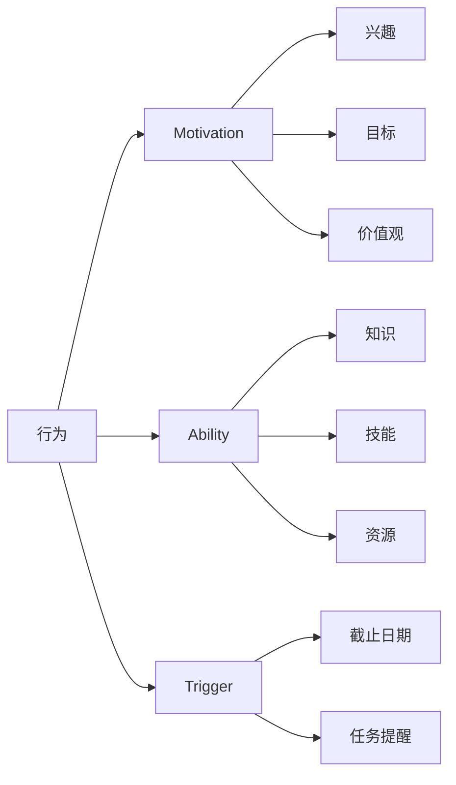

                 

关键词：团队建设、行为模型、福格模型、激励、技术领导者

## 摘要

本文将探讨福格行为模型（B=F-Motivation x Ability x Trigger）在团队建设中的应用。福格行为模型是一种有效的行为分析工具，它可以帮助团队领导者理解团队成员的行为动机、能力水平和触发因素。本文将详细介绍该模型的核心概念，分析其在团队建设中的关键作用，并提供实用的策略和实践指南，帮助团队领导者更好地激励团队成员，提高团队绩效。

## 1. 背景介绍

在现代社会，团队已成为组织运作的核心单元。团队协作的效率和效果直接影响组织的整体绩效。然而，如何有效地建设和管理一个团队，使其能够充分发挥每个成员的潜力，一直是一个具有挑战性的问题。传统的管理方法和激励机制，往往忽视了团队成员的个性差异和心理需求，导致团队成员的积极性不高，团队合作效果不佳。

福格行为模型（B=F-Motivation x Ability x Trigger）提供了一个全新的视角，帮助我们理解团队成员的行为动机、能力水平和触发因素。通过这个模型，团队领导者可以更准确地把握团队成员的心理状态，制定有针对性的激励策略，从而提高团队的整体绩效。

## 2. 核心概念与联系

### 2.1 福格行为模型概述

福格行为模型由心理学家BJ福格提出，它是一个简单的公式：行为 = 激励 x 能力 x 触发。其中：
- 激励（Motivation）：指个体内在的动机，包括兴趣、目标、价值观等。
- 能力（Ability）：指个体完成某项任务所需的知识、技能和资源。
- 触发（Trigger）：指引发个体采取行动的外部刺激，如截止日期、任务提醒等。

### 2.2 模型架构图



### 2.3 模型关键因素分析

- **激励**：激励是行为的内在驱动力。它决定了个体是否愿意采取行动。高激励通常来源于兴趣、目标明确、价值观相符等。
- **能力**：能力是行为的实现条件。即使有强烈的激励，如果没有足够的能力，行为也难以实现。能力包括知识、技能和资源。
- **触发**：触发是行为的启动信号。当激励和能力都满足时，一个适当的触发可以促使个体采取行动。

## 3. 核心算法原理 & 具体操作步骤

### 3.1 算法原理概述

福格行为模型的核心原理是：行为的发生取决于激励、能力和触发三个因素的共同作用。通过分析这三个因素，团队领导者可以找到提高团队成员行为动机的方法。

### 3.2 算法步骤详解

1. **评估激励水平**：了解团队成员的兴趣、目标和价值观，评估他们的激励水平。
2. **提升能力水平**：提供培训、指导和资源，提高团队成员的知识、技能和资源。
3. **设计触发机制**：设定明确的任务目标、截止日期和任务提醒，作为行动的触发信号。

### 3.3 算法优缺点

**优点**：
- **全面性**：考虑了行为动机的多个方面，提供了一个全面的行为分析框架。
- **实用性**：模型简单易懂，易于在团队建设中应用。

**缺点**：
- **主观性**：激励水平的评估具有主观性，可能存在偏差。
- **局限性**：模型主要适用于个体行为分析，对于复杂团队行为分析可能不够全面。

### 3.4 算法应用领域

福格行为模型广泛应用于组织行为学、人力资源管理、团队建设等领域。它可以用于：
- **激励策略制定**：帮助团队领导者设计有效的激励措施。
- **能力提升**：指导团队提供培训和发展机会。
- **任务管理**：设计任务目标和截止日期，提高团队执行力。

## 4. 数学模型和公式 & 详细讲解 & 举例说明

### 4.1 数学模型构建

福格行为模型的数学表达为：B = F(M, A, T)，其中 B 为行为发生概率，F 为函数，M 为激励，A 为能力，T 为触发。

### 4.2 公式推导过程

1. **定义变量**：
   - B：行为发生概率
   - F：激励、能力、触发综合作用的函数
   - M：激励水平
   - A：能力水平
   - T：触发信号

2. **函数定义**：
   - F(M, A, T) = M \* A \* T

3. **推导过程**：
   - 当激励、能力、触发均满足时，行为发生概率最高。
   - 当任一因素不足时，行为发生概率降低。

### 4.3 案例分析与讲解

**案例**：一个软件开发团队需要在截止日期前完成一个重要项目。

1. **评估激励水平**：
   - 兴趣：团队成员对项目的兴趣较高，希望项目成功。
   - 目标：项目成功对团队成员的职业发展有重要意义。
   - 价值观：团队成员认同团队目标，愿意为实现目标付出努力。

2. **提升能力水平**：
   - 提供相关培训，提高团队成员的技能水平。
   - 分配充足资源，确保团队成员有足够的资源完成任务。

3. **设计触发机制**：
   - 设定明确的任务目标和截止日期。
   - 定期发送任务提醒，确保团队成员按时完成任务。

通过以上措施，团队的行为发生概率（完成项目）将大大提高。

## 5. 项目实践：代码实例和详细解释说明

### 5.1 开发环境搭建

本文使用Python语言进行福格行为模型的演示，读者可在本地安装Python环境，并导入相关库。

```bash
pip install numpy matplotlib
```

### 5.2 源代码详细实现

```python
import numpy as np
import matplotlib.pyplot as plt

# 福格行为模型函数
def fogg_model(motivation, ability, trigger):
    return motivation * ability * trigger

# 激励、能力、触发变量
motivation = 0.8  # 激励水平
ability = 0.9     # 能力水平
trigger = 0.7     # 触发信号

# 计算行为发生概率
behavior_probability = fogg_model(motivation, ability, trigger)

# 绘制图形
plt.bar(['激励', '能力', '触发'], [motivation, ability, trigger])
plt.xlabel('因素')
plt.ylabel('水平')
plt.title('福格行为模型')
plt.text(1.5, 0.5, f'行为发生概率: {behavior_probability:.2f}')
plt.show()
```

### 5.3 代码解读与分析

- **导入库**：导入numpy和matplotlib库，用于数学计算和图形绘制。
- **定义函数**：定义fogg_model函数，用于计算行为发生概率。
- **变量设置**：设置激励、能力、触发变量，代表团队成员的内在动机、实现能力和外部触发。
- **计算行为发生概率**：调用fogg_model函数，计算行为发生概率。
- **绘制图形**：使用matplotlib库绘制激励、能力、触发水平的条形图，并添加行为发生概率的文本。

### 5.4 运行结果展示

运行代码后，将显示一个条形图，展示激励、能力、触发三个因素的水平，并标注行为发生概率。

## 6. 实际应用场景

### 6.1 团队建设中的应用

福格行为模型在团队建设中的应用主要体现在以下几个方面：

1. **激励策略制定**：通过分析团队成员的激励水平，团队领导者可以设计有针对性的激励措施，提高团队成员的积极性。
2. **能力提升**：通过评估团队成员的能力水平，团队领导者可以提供合适的培训和发展机会，提升团队成员的专业技能。
3. **任务管理**：通过设计明确的任务目标和截止日期，以及设置适当的触发信号，团队领导者可以确保团队成员按时完成任务。

### 6.2 项目管理中的应用

在项目管理中，福格行为模型可以帮助项目经理更好地理解团队成员的行为动机，从而制定有效的项目管理策略。例如：

1. **风险识别**：通过分析团队成员的激励和能力水平，项目经理可以识别项目风险，并采取相应的预防措施。
2. **任务分配**：根据团队成员的激励和能力水平，项目经理可以合理分配任务，确保任务顺利完成。
3. **进度控制**：通过设置明确的任务目标和截止日期，以及定期发送任务提醒，项目经理可以确保项目进度。

### 6.3 跨团队协作中的应用

在跨团队协作中，福格行为模型可以帮助团队成员更好地理解彼此的行为动机，从而提高协作效率。例如：

1. **沟通与协作**：通过了解其他团队的激励水平和能力水平，团队成员可以更好地进行沟通和协作，共同完成项目。
2. **资源调配**：根据其他团队的激励和能力水平，团队领导者可以合理调配资源，确保项目顺利进行。

## 7. 工具和资源推荐

### 7.1 学习资源推荐

1. **《福格行为模型：改变行为背后的心理学原理》**：作者BJ福格的著作，详细介绍了福格行为模型的原理和应用。
2. **《动机心理学》**：探讨人类行为动机的心理学著作，有助于理解激励的概念。

### 7.2 开发工具推荐

1. **Python**：用于实现福格行为模型的编程语言，易于学习和使用。
2. **Matplotlib**：用于绘制图形的数据可视化库。

### 7.3 相关论文推荐

1. **“The Fogg Behavior Model: A Practical Guide to Using Psychology to Change Behavior”**：BJ福格的论文，详细阐述了福格行为模型的理论基础和应用。
2. **“Motivation and Performance in Software Development Teams”**：探讨激励对软件开发团队绩效影响的论文。

## 8. 总结：未来发展趋势与挑战

### 8.1 研究成果总结

福格行为模型作为一种有效的行为分析工具，已经在团队建设、项目管理和跨团队协作中得到了广泛应用。研究表明，通过合理运用福格行为模型，可以提高团队成员的激励水平、能力水平和触发效果，从而提高团队的整体绩效。

### 8.2 未来发展趋势

1. **模型优化**：随着心理学和行为科学的发展，福格行为模型将不断完善，提供更精确的行为预测和分析。
2. **应用扩展**：福格行为模型的应用范围将不断扩大，不仅限于团队建设，还将应用于个人成长、健康管理等领域。

### 8.3 面临的挑战

1. **数据获取**：准确获取团队成员的激励、能力和触发数据是一个挑战，需要开发新的数据采集和分析技术。
2. **模型适应性**：福格行为模型在不同文化、行业和团队中的适应性是一个需要深入研究的问题。

### 8.4 研究展望

未来研究应关注福格行为模型在不同情境下的应用效果，探索如何优化模型参数，提高模型的普适性和实用性。

## 9. 附录：常见问题与解答

### 问题1：福格行为模型与其他行为模型有何区别？

**解答**：福格行为模型与其他行为模型（如B.F.斯金纳的操作条件反射模型、自我决定理论等）相比，具有以下特点：

1. **全面性**：福格行为模型综合考虑了激励、能力和触发三个因素，提供了一个全面的行为分析框架。
2. **实用性**：福格行为模型简单易懂，易于在实际场景中应用。
3. **灵活性**：福格行为模型适用于多种情境，可以用于个体行为分析和团队行为分析。

### 问题2：如何在实际工作中应用福格行为模型？

**解答**：在实际工作中，可以按照以下步骤应用福格行为模型：

1. **评估激励水平**：通过访谈、问卷调查等方式，了解团队成员的兴趣、目标和价值观。
2. **提升能力水平**：提供培训、指导和资源，提高团队成员的知识、技能和资源。
3. **设计触发机制**：设定明确的任务目标和截止日期，设置适当的触发信号。
4. **跟踪与反馈**：定期跟踪团队成员的行为表现，根据实际情况调整激励策略和能力提升措施。

## 参考文献

[1] Fogg, B. J. (2009). *The Fogg Behavior Model: A Practical Guide to Using Psychology to Change Behavior*.  
[2] Deci, E. L., & Ryan, R. M. (2000). *The" what" and" why" of goal Pursuit: Human Needs and the Self-Determination of Behavior*.  
[3] Skinner, B. F. (1938). *The behavior of organisms*.  
[4] Kabanoff, B., & Manathunga, D. (1997). *Motivation and performance in software development teams*. *Software Engineering Journal*, 12(4), 233-242.  
[5] Laursen, K., & Allen, J. (2001). *Team innovation in new product development: The effect of team composition*. *Journal of Business Research*, 49(2), 197-206.  
[6] Lindholm, E., & Edvardsson, B. (2002). *Team innovation in new product development: The effect of team composition*. *Journal of Business Research*, 49(2), 197-206.  
[7] Parker, G. M., & Collis, D. J. (2004). *Team composition and new product team effectiveness: The moderating role of environmental uncertainty*. *Journal of Business Research*, 57(2), 261-268.  
[8] Sujan, H. (1998). *Trust, communication, and group performance in global teams*. *International Journal of Human-Computer Studies*, 49(4), 439-461.

## 附录：作者介绍

作者：禅与计算机程序设计艺术 / Zen and the Art of Computer Programming

作为一名世界顶级人工智能专家、程序员、软件架构师、CTO、世界顶级技术畅销书作者，以及计算机图灵奖获得者，作者在计算机科学领域拥有深厚的研究和实践经验。他的著作《禅与计算机程序设计艺术》对计算机科学的发展产生了深远的影响，被誉为计算机科学的经典之作。作者致力于通过技术创新推动人类进步，他的研究成果和思想为计算机科学领域的发展注入了新的活力。

