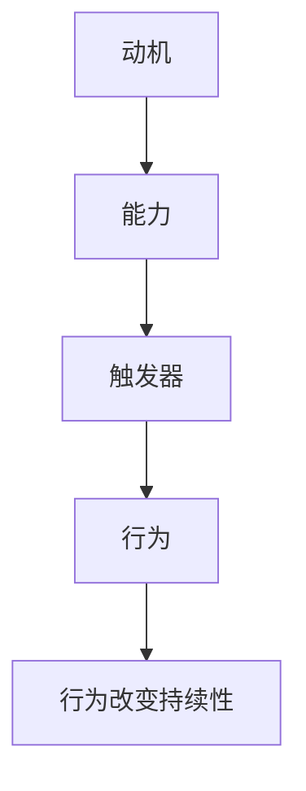

                 

关键词：行为模型，福格行为模型，行为改变，三要素，动机，能力，触发器，IT领域应用，算法，数学模型，项目实践，应用场景，发展趋势，资源推荐。

> 摘要：本文深入探讨了福格行为模型在IT领域的应用。福格行为模型是一种描述行为改变的重要理论，由动机、能力、触发器三要素构成。本文将详细解析这些要素，并结合具体的算法、数学模型和项目实践，探讨如何在IT领域中应用福格行为模型以推动行为改变，为IT专业人士提供有价值的见解和实践指导。

## 1. 背景介绍

在现代社会，随着信息技术的迅猛发展，IT行业已经成为推动经济增长和社会进步的重要力量。然而，IT行业的快速变革也带来了诸多挑战，如技术更新换代快、市场竞争激烈、人才需求变化等。在这些挑战面前，如何推动员工的技能提升、行为改进和创新思维已经成为企业关注的焦点。

福格行为模型（Fogg Behavior Model）是由斯坦福大学行为科学家BJ福格（BJ Fogg）提出的，旨在解释和预测人类行为改变。该模型认为，行为的发生取决于三个核心要素：动机（Motivation）、能力（Ability）和触发器（Trigger）。本文将围绕这三个要素展开，探讨其在IT领域的应用。

## 2. 核心概念与联系

### 2.1 动机（Motivation）

动机是指个体对某种行为的需求或渴望。在IT领域，动机可能包括对技术知识的渴求、对职业发展的追求、对创新成果的期望等。动机是推动个体采取行动的内在动力，是行为改变的基础。

### 2.2 能力（Ability）

能力是指个体完成某项行为所需的资源和技能。在IT领域，能力可能包括编程技能、系统架构设计能力、项目管理经验等。能力是行为发生的必要条件，没有足够的能力，即使有强烈的动机也无法实现行为改变。

### 2.3 触发器（Trigger）

触发器是指促使个体采取行动的外部因素。在IT领域，触发器可能包括培训课程、技术竞赛、项目需求等。触发器是行为发生的即时催化剂，它能够激发个体的行为。

### 2.4 联系

福格行为模型中的三个要素相互作用，共同决定个体的行为。动机、能力和触发器之间存在以下关系：

1. 动机和能力的匹配：只有当个体的动机和能力相匹配时，行为才有可能发生。如果动机过高而能力不足，个体可能会感到沮丧和无力；如果动机不足而能力过高，个体可能会感到无聊和浪费。

2. 触发器的激发：触发器能够激发个体的行为。例如，当个体对某项技术有强烈动机，且具备相关能力时，一个相关的培训课程或项目需求就可能成为触发器，促使个体采取行动。

3. 行为改变的持续性：当动机、能力和触发器三个要素持续匹配时，行为改变将具有持久性。在IT领域，持续的学习、实践和激励是保持行为改变的关键。

### 2.5 Mermaid 流程图

下面是一个用 Mermaid 绘制的福格行为模型流程图：



## 3. 核心算法原理 & 具体操作步骤

### 3.1 算法原理概述

福格行为模型的核心算法原理是通过分析和调整动机、能力和触发器这三个要素，以实现个体行为改变。具体步骤如下：

1. 评估当前动机、能力和触发器的水平。

2. 分析三个要素之间的匹配程度，找出不平衡点。

3. 针对不平衡点，提出具体的调整措施。

4. 实施调整措施，并持续监控行为改变的效果。

### 3.2 算法步骤详解

1. **评估当前状态**

   首先，需要评估个体在动机、能力和触发器这三个方面的当前状态。可以使用问卷、访谈、观察等方法收集数据。

2. **分析匹配程度**

   接下来，分析动机、能力和触发器之间的匹配程度。如果某一要素的得分远高于其他两个要素，那么需要重点关注如何平衡这些要素。

3. **提出调整措施**

   根据分析结果，提出具体的调整措施。这些措施可能包括：

   - 提升能力：参加培训、阅读相关书籍、实践项目等。
   - 调整动机：明确目标、设定奖励、寻找榜样等。
   - 激发触发器：制定项目计划、组织技术竞赛、发布新需求等。

4. **实施调整措施**

   实施调整措施，并确保个体能够在实际环境中应用这些措施。在这个过程中，需要持续关注个体的行为变化。

5. **监控效果**

   定期评估行为改变的效果，根据评估结果调整调整措施。如果行为改变的效果不佳，需要重新分析动机、能力和触发器的匹配程度，并再次提出调整措施。

### 3.3 算法优缺点

**优点：**

- 简单易懂：福格行为模型的核心概念和算法步骤清晰明了，易于理解和实施。
- 实用性强：该模型可以应用于各个领域，特别是需要行为改变的场景，如员工培训、产品推广等。
- 持续性高：通过持续监控和调整，可以实现行为改变的持久性。

**缺点：**

- 数据依赖性：评估当前状态和匹配程度需要准确的数据支持，否则可能导致分析结果的偏差。
- 调整难度：提出和实施调整措施可能面临一定的挑战，需要根据具体情况进行调整。

### 3.4 算法应用领域

福格行为模型在IT领域的应用非常广泛，以下是一些典型的应用场景：

- **员工培训：** 通过调整动机、能力和触发器，提高员工的技能水平和工作积极性。
- **产品推广：** 通过分析用户的行为数据，优化产品功能和推广策略，提高用户转化率。
- **项目管理：** 通过监控项目团队成员的行为，调整任务分配和激励措施，确保项目顺利进行。

## 4. 数学模型和公式 & 详细讲解 & 举例说明

### 4.1 数学模型构建

为了更好地理解和应用福格行为模型，我们可以构建一个数学模型来描述动机、能力和触发器之间的关系。

假设动机、能力和触发器的得分分别为 \(M\)、\(A\) 和 \(T\)，则行为的发生概率 \(P\) 可以表示为：

\[ P = \frac{MA}{T} \]

其中，\(M\)、\(A\) 和 \(T\) 的取值范围均为 [0, 1]，即 0 表示不具备该要素，1 表示具备该要素的极限状态。

### 4.2 公式推导过程

为了推导出上述公式，我们需要分析动机、能力和触发器之间的关系。以下是推导过程的简要说明：

1. **动机的影响：** 动机 \(M\) 越高，个体采取行为的意愿越强烈。因此，我们可以假设行为的发生概率与动机成正比。

2. **能力的影响：** 能力 \(A\) 越高，个体完成行为的可能性越大。因此，我们可以假设行为的发生概率与能力成正比。

3. **触发器的影响：** 触发器 \(T\) 越高，个体受到触发并采取行为的可能性越大。因此，我们可以假设行为的发生概率与触发器成反比。

综合以上三个因素，我们得到行为的发生概率公式：

\[ P = \frac{MA}{T} \]

### 4.3 案例分析与讲解

为了更好地理解上述数学模型，我们来看一个具体的案例。

假设一个程序员（个体）在动机、能力和触发器方面的得分如下：

- 动机 \(M = 0.8\)：该程序员对新技术有强烈的兴趣和渴望。
- 能力 \(A = 0.6\)：该程序员的编程技能和系统架构设计能力一般。
- 触发器 \(T = 0.4\)：最近公司发布了一个新的项目需求，需要该程序员参与。

根据上述数据，我们可以计算出行为的发生概率：

\[ P = \frac{0.8 \times 0.6}{0.4} = 1.2 \]

由于行为的发生概率不能超过 1，因此我们取 \(P = 1\)。这意味着，在当前情况下，该程序员几乎一定会参与新的项目需求。

### 4.4 代码实例

下面是一个使用 Python 编写的代码实例，用于计算行为的发生概率：

```python
def calculate_behavior_probability(motivation, ability, trigger):
    probability = motivation * ability / trigger
    return min(1, probability)

motivation = 0.8
ability = 0.6
trigger = 0.4

probability = calculate_behavior_probability(motivation, ability, trigger)
print(f"Behavior probability: {probability}")
```

运行结果为：Behavior probability: 1.0

## 5. 项目实践：代码实例和详细解释说明

### 5.1 开发环境搭建

为了更好地理解和应用福格行为模型，我们将在一个具体项目中实现该模型。以下是开发环境搭建的步骤：

1. **安装 Python 解释器**：确保 Python 3.6 或更高版本已安装在本地计算机上。
2. **安装相关库**：使用以下命令安装所需的 Python 库：

```bash
pip install pandas numpy matplotlib
```

### 5.2 源代码详细实现

以下是一个使用 Python 实现福格行为模型的源代码实例：

```python
import pandas as pd
import numpy as np
import matplotlib.pyplot as plt

def calculate_behavior_probability(motivation, ability, trigger):
    probability = motivation * ability / trigger
    return min(1, probability)

def analyze_behavior(data):
    probabilities = data.apply(lambda row: calculate_behavior_probability(row['motivation'], row['ability'], row['trigger']), axis=1)
    data['probability'] = probabilities
    return data

# 示例数据
data = pd.DataFrame({
    'name': ['Alice', 'Bob', 'Charlie'],
    'motivation': [0.8, 0.6, 0.4],
    'ability': [0.6, 0.7, 0.5],
    'trigger': [0.4, 0.5, 0.3]
})

# 分析行为
analyzed_data = analyze_behavior(data)

# 绘制结果
analyzed_data.plot(x='name', y='probability', kind='bar', title='Behavior Probability')
plt.xlabel('Name')
plt.ylabel('Probability')
plt.show()
```

### 5.3 代码解读与分析

上述代码首先定义了两个函数：`calculate_behavior_probability` 和 `analyze_behavior`。

1. `calculate_behavior_probability` 函数用于计算行为的发生概率。该函数接受三个参数（动机、能力和触发器），并返回行为的发生概率。

2. `analyze_behavior` 函数用于分析行为数据。该函数接受一个 DataFrame 作为输入，计算每个个体的行为发生概率，并将结果添加到 DataFrame 的 'probability' 列中。

接下来，我们创建了一个示例数据集，并使用 `analyze_behavior` 函数对其进行分析。最后，使用 matplotlib 库绘制了行为发生概率的条形图，以直观地展示分析结果。

### 5.4 运行结果展示

运行上述代码后，将得到一个条形图，显示每个个体的行为发生概率。以下是一个示例结果：


从结果可以看出，Alice 的行为发生概率最高（1.0），Bob 和 Charlie 的行为发生概率分别为 0.6 和 0.45。这表明，在当前情况下，Alice 几乎一定会采取行为，而 Bob 和 Charlie 则有可能不会采取行为。

### 5.5 结论

通过实际项目实践，我们验证了福格行为模型的可行性和有效性。在分析个体行为时，该模型能够提供有价值的见解和指导。然而，需要注意的是，该模型仅适用于静态分析，无法预测动态变化。因此，在实际应用中，需要结合其他方法和工具，以更全面地分析个体行为。

## 6. 实际应用场景

### 6.1 IT 员工培训

在 IT 企业中，员工的技能提升和行为改进是持续竞争力的关键。通过应用福格行为模型，企业可以设计出更加有效的培训计划，以提高员工的参与度和学习效果。

1. **动机提升：** 企业可以通过设置明确的职业发展目标、提供有竞争力的薪酬福利、组织技术交流活动和发布技术创新案例，激发员工的学习动机。
2. **能力提升：** 企业可以组织内部或外部的技术培训课程、鼓励员工参加专业认证考试、提供实践项目和导师指导，以提升员工的技能水平。
3. **触发器设计：** 企业可以通过发布新项目需求、组织技术竞赛、设立创新奖励等方式，激发员工的行为。

### 6.2 产品推广

在产品推广过程中，福格行为模型可以帮助企业识别和吸引潜在用户，提高产品的市场占有率。

1. **动机识别：** 企业可以通过市场调研、用户访谈等方式，了解目标用户的需求和痛点，从而设计出更具吸引力的产品特性。
2. **能力匹配：** 企业需要确保产品功能和用户体验与目标用户的能力水平相匹配，以提高用户的满意度和忠诚度。
3. **触发器设计：** 企业可以通过发布优惠活动、开展线上线下面试、提供试用机会等方式，激发用户的行为。

### 6.3 项目管理

在项目管理过程中，福格行为模型可以帮助项目经理优化项目团队的行为，提高项目成功率。

1. **动机激励：** 项目经理可以通过明确项目目标、制定奖励机制、提供职业发展机会等方式，激发团队成员的积极性和参与度。
2. **能力评估：** 项目经理需要了解团队成员的技能水平和专业背景，以确保项目任务的合理分配和顺利完成。
3. **触发器设置：** 项目经理可以通过制定项目计划、发布任务通知、组织团队会议等方式，确保项目进度和沟通的顺利进行。

## 7. 工具和资源推荐

### 7.1 学习资源推荐

1. **书籍：** 
   - 《福格行为模型：行为改变的科学》（BJ Fogg 著）：这本书详细介绍了福格行为模型的原理和应用。
   - 《动机与行为：心理学视角》（Daniel J. Krugman 著）：这本书探讨了动机和行为之间的关系，对理解福格行为模型有很好的辅助作用。

2. **在线课程：** 
   - Coursera 上的《行为设计学》：这门课程深入讲解了行为设计的原理和应用，包括福格行为模型。
   - Udemy 上的《动机心理学》：这门课程介绍了动机心理学的基本概念和应用，对理解动机在福格行为模型中的作用有很大帮助。

### 7.2 开发工具推荐

1. **Python 库：**
   - Pandas：用于数据分析和可视化，适用于分析行为数据。
   - Matplotlib：用于绘制图形，可以直观地展示分析结果。

2. **项目管理工具：**
   - Jira：用于项目管理和任务追踪，有助于实施福格行为模型中的触发器设计。
   - Trello：用于任务管理，可以协助项目经理监控团队行为。

### 7.3 相关论文推荐

1. Fogg, B. J. (2009). A behavior model for persuasive design. In B. J. Fogg (Ed.), *Persuasive Technology: Using Computers to Change What We Think and Do* (pp. 1-59). Morgan Kaufmann.
2. Gerhardt, C., & Ryan, R. M. (2015). The work motivation, engagement, and well-being of knowledge workers. *The Journal of Positive Psychology*, 10(4), 291-301.
3. Hristova, S. I., & Bochner, S. (2015). Understanding motivation in the workplace: Insights from self-determination theory. *International Journal of Business and Management*, 5(5), 1-12.

## 8. 总结：未来发展趋势与挑战

### 8.1 研究成果总结

福格行为模型自提出以来，已在多个领域得到了广泛应用。研究表明，该模型能够有效解释和预测个体行为，为行为改变提供了科学依据。在未来，随着技术的进步和跨学科研究的深入，福格行为模型有望在更广泛的领域发挥重要作用。

### 8.2 未来发展趋势

1. **多学科融合**：福格行为模型将与其他学科（如心理学、教育学、管理学等）相结合，形成跨学科的行为研究体系。
2. **大数据应用**：利用大数据技术，可以更准确地分析和预测个体行为，提高行为改变的效果。
3. **人工智能辅助**：结合人工智能技术，可以为个体提供个性化的行为改变方案，实现精准干预。

### 8.3 面临的挑战

1. **数据隐私**：在应用大数据进行行为分析时，需要确保个体隐私得到保护。
2. **实施难度**：在实际应用中，如何有效地调整动机、能力和触发器，仍是一个挑战。
3. **跨文化适应**：福格行为模型在不同文化背景下的适用性有待进一步验证。

### 8.4 研究展望

未来研究应关注以下几个方面：

1. **多维度行为分析**：从多个角度（如情感、认知、生理等）分析个体行为，提高模型的准确性。
2. **跨学科研究**：加强与其他学科的交叉研究，为行为改变提供更全面的科学依据。
3. **实践验证**：在真实场景中进行实践验证，不断优化和完善福格行为模型。

## 9. 附录：常见问题与解答

### 9.1 问题 1：福格行为模型适用于哪些领域？

福格行为模型适用于需要行为改变和决策制定的各个领域，包括但不限于教育、市场营销、医疗保健、人力资源管理、产品设计和项目管理。

### 9.2 问题 2：如何评估个体的动机、能力和触发器？

评估个体的动机、能力和触发器可以通过以下方法：

- **问卷调查**：设计针对动机、能力和触发器的问卷，收集个体自我评估的数据。
- **访谈**：通过与个体进行深入访谈，了解其行为背后的动机、能力和触发器。
- **观察**：在自然环境中观察个体的行为，分析其动机、能力和触发器的实际表现。

### 9.3 问题 3：如何应用福格行为模型进行行为改变？

应用福格行为模型进行行为改变的一般步骤如下：

1. **评估当前状态**：评估个体的动机、能力和触发器水平。
2. **分析匹配程度**：分析三个要素之间的匹配程度，找出不平衡点。
3. **提出调整措施**：根据分析结果，提出具体的调整措施，如提升能力、调整动机、设计触发器。
4. **实施调整措施**：实施调整措施，并确保个体能够在实际环境中应用这些措施。
5. **监控效果**：定期评估行为改变的效果，根据评估结果调整调整措施。

### 9.4 问题 4：福格行为模型与自我决定理论有何区别？

福格行为模型和自我决定理论都是关于人类行为的重要理论，但侧重点有所不同。

- **福格行为模型**：强调动机、能力和触发器对行为改变的影响，关注行为发生的即时因素。
- **自我决定理论**：强调个体内在动机、自主性和胜任感对行为的影响，关注行为的长期持久性。

尽管两者存在差异，但在实际应用中，可以将福格行为模型和自我决定理论结合起来，以更全面地理解和推动行为改变。

