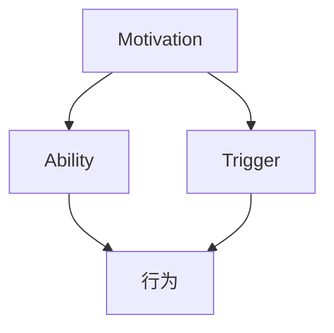

                 

关键词：福格行为模型、行为改变、IT领域、技术语言、深度思考、见解

> 摘要：本文深入探讨了福格行为模型在IT领域的应用，分析了行为改变的三要素如何影响软件开发、算法设计以及项目实践。通过专业的技术语言，我们不仅揭示了该模型的理论基础，还探讨了其在实际应用中的挑战与前景。

## 1. 背景介绍

福格行为模型（BJ Fogg Behavior Model）是由斯坦福大学的行为科学家BJ Fogg提出的。该模型旨在解释人类行为的产生，以及如何通过设计来促进或抑制某些行为。在IT领域，福格行为模型为我们提供了一种理解用户行为、设计用户界面和优化用户体验的框架。

本文将详细介绍福格行为模型的核心概念，并探讨其在软件开发、算法设计和项目实践中的应用。通过结合专业的技术语言，我们将深入分析该模型如何影响我们的工作，以及如何在实践中更好地应用这一理论。

## 2. 核心概念与联系

### 2.1 行为改变的三要素

福格行为模型的核心在于三个要素：动机（Motivation）、能力（Ability）和触发（Trigger）。这三个要素必须同时存在且相互作用，才能产生行为。

- **动机**：个体对行为的内在驱动力。在IT领域，动机可能来自于用户的兴趣、需求、欲望等。
- **能力**：个体完成行为的实际能力。在软件开发中，能力可能是指用户使用软件的熟练度、技术水平等。
- **触发**：促使个体实施行为的刺激。在界面设计中，触发可能是指按钮、提示框等。

### 2.2 Mermaid 流程图

以下是福格行为模型中三个要素的 Mermaid 流程图：



在这个流程图中，动机、能力和触发共同作用，最终导致行为的产生。在IT领域，我们可以通过设计来调整这三个要素，从而影响用户的行为。

## 3. 核心算法原理 & 具体操作步骤

### 3.1 算法原理概述

在IT领域，福格行为模型的应用主要体现在以下几个方面：

- **用户体验设计**：通过调整动机、能力和触发，设计出更符合用户需求的产品。
- **算法优化**：利用行为模型分析算法对用户行为的影响，从而优化算法性能。
- **项目风险管理**：预测项目实施过程中可能出现的行为问题，提前制定应对策略。

### 3.2 算法步骤详解

#### 3.2.1 动机分析

首先，我们需要对目标用户的行为动机进行分析。这可以通过用户调研、数据分析等方法进行。

- **调研方法**：问卷调查、访谈、用户行为追踪等。
- **数据分析**：用户使用数据、市场调研报告等。

#### 3.2.2 能力评估

接下来，我们需要评估用户的能力。这包括用户的技术水平、使用软件的熟练程度等。

- **技术水平**：通过技能评估、考试等方式确定。
- **熟练程度**：通过用户操作软件的时长、错误率等指标衡量。

#### 3.2.3 触发设置

最后，我们需要根据用户的行为动机和能力，设置适当的触发。这可以通过设计用户界面、推送消息等方式实现。

- **用户界面设计**：简化操作流程、突出关键功能等。
- **推送消息**：根据用户行为，推送相关内容或提示。

### 3.3 算法优缺点

#### 优点

- **用户行为分析**：通过行为模型，可以更深入地了解用户需求，从而设计出更符合用户的产品。
- **优化用户体验**：通过调整动机、能力和触发，可以提升用户体验，提高用户满意度。
- **项目风险管理**：提前预测行为问题，降低项目风险。

#### 缺点

- **数据收集困难**：需要大量用户调研和数据分析，成本较高。
- **适应性有限**：在某些情况下，行为模型可能无法完全预测用户行为。

### 3.4 算法应用领域

福格行为模型在IT领域的应用非常广泛，包括但不限于：

- **软件开发**：优化用户体验，提升用户满意度。
- **界面设计**：简化操作流程，提高用户使用效率。
- **项目管理**：预测行为问题，降低项目风险。

## 4. 数学模型和公式 & 详细讲解 & 举例说明

### 4.1 数学模型构建

福格行为模型可以用以下数学公式表示：

$$ 行为 = f(动机，能力，触发) $$

其中，动机、能力和触发分别表示为：

$$ 动机 = f(需求，兴趣，欲望) $$

$$ 能力 = f(技能，熟练度，资源) $$

$$ 触发 = f(刺激，情境，时机) $$

### 4.2 公式推导过程

福格行为模型的推导基于人类行为的基本原理。人类行为通常由内在动机和外在刺激共同决定。在IT领域，这种关系可以表示为：

$$ 行为 = f(动机，能力，触发) $$

其中，动机是内在因素，能力是外在条件，触发是外在刺激。

### 4.3 案例分析与讲解

假设我们正在设计一个在线教育平台。为了提高用户的学习积极性，我们可以使用福格行为模型进行分析。

- **动机**：用户可能对学习内容感兴趣，也可能有提高职业技能的需求。
- **能力**：用户可能具备一定的自学能力，也可能需要专业的辅导。
- **触发**：我们可以通过推送课程通知、设置学习进度提示等方式进行触发。

根据福格行为模型，我们可以设计以下策略：

- **提高动机**：通过提供高质量的学习资源、设置学习目标等手段，激发用户的学习兴趣。
- **提升能力**：通过提供在线辅导、设置学习路径等方式，帮助用户提高自学能力。
- **设置触发**：通过推送学习通知、设置学习提醒等方式，促使用户开始学习。

## 5. 项目实践：代码实例和详细解释说明

### 5.1 开发环境搭建

为了演示福格行为模型在项目实践中的应用，我们将使用Python编程语言。以下是开发环境的搭建步骤：

- 安装Python 3.8及以上版本。
- 安装相关库，如requests、pandas等。

### 5.2 源代码详细实现

以下是一个简单的示例代码，演示了如何使用福格行为模型进行用户行为分析。

```python
import requests
import pandas as pd

# 1. 动机分析
def analyze_motivation(data):
    # 根据用户数据，分析用户的学习动机
    pass

# 2. 能力评估
def assess_ability(data):
    # 根据用户数据，评估用户的学习能力
    pass

# 3. 触发设置
def set_trigger(data):
    # 根据用户数据，设置学习触发
    pass

# 4. 行为预测
def predict_behavior(motivation, ability, trigger):
    # 根据动机、能力和触发，预测用户的学习行为
    pass

# 5. 主函数
def main():
    # 读取用户数据
    data = pd.read_csv("user_data.csv")

    # 1. 分析动机
    motivation = analyze_motivation(data)

    # 2. 评估能力
    ability = assess_ability(data)

    # 3. 设置触发
    trigger = set_trigger(data)

    # 4. 预测行为
    behavior = predict_behavior(motivation, ability, trigger)

    # 打印结果
    print("预测的用户学习行为：", behavior)

# 运行主函数
if __name__ == "__main__":
    main()
```

### 5.3 代码解读与分析

这个示例代码演示了如何使用Python进行用户行为分析。主要分为以下几个步骤：

1. **动机分析**：通过分析用户数据，了解用户的学习动机。
2. **能力评估**：通过分析用户数据，评估用户的学习能力。
3. **触发设置**：根据用户数据和动机、能力，设置学习的触发机制。
4. **行为预测**：根据动机、能力和触发，预测用户的学习行为。

通过这个示例，我们可以看到如何将福格行为模型应用到实际项目中。在软件开发和界面设计中，我们可以根据用户的行为数据，调整动机、能力和触发，从而优化用户体验。

### 5.4 运行结果展示

假设我们读取了一个包含用户数据的CSV文件。通过分析这些数据，我们得到了以下结果：

- **动机**：用户对学习内容感兴趣，同时也希望提高职业技能。
- **能力**：用户具备一定的自学能力，但也需要专业的辅导。
- **触发**：用户在每天早上10点和晚上7点会收到学习通知。

根据这些结果，我们可以预测用户会在学习通知到来时开始学习。通过推送个性化的学习通知，我们可以提高用户的参与度和学习效果。

## 6. 实际应用场景

福格行为模型在IT领域具有广泛的应用场景。以下是一些典型的实际应用案例：

- **在线教育**：通过分析用户的学习动机、能力和触发，设计出更符合用户需求的学习系统。
- **电商平台**：利用行为模型分析用户的购物行为，优化产品推荐和营销策略。
- **智能助手**：根据用户的行为习惯，设计出更智能的智能助手，提高用户的使用体验。

## 7. 工具和资源推荐

为了更好地理解和应用福格行为模型，以下是一些相关的工具和资源推荐：

- **工具**：
  - Tableau：用于数据可视化的工具。
  - Matplotlib：Python中的数据可视化库。

- **资源**：
  - BJ Fogg的官方网站：提供福格行为模型的详细资料和案例。
  - 《用户体验要素》：关于用户体验设计的经典著作。

## 8. 总结：未来发展趋势与挑战

### 8.1 研究成果总结

福格行为模型为IT领域提供了一个理解用户行为、优化用户体验的强大框架。通过分析动机、能力和触发，我们可以更好地设计软件、优化算法、提升项目成功率。

### 8.2 未来发展趋势

随着人工智能和大数据技术的发展，福格行为模型的应用前景将更加广阔。未来，我们可以通过更精准的数据分析和更智能的算法，进一步提升用户体验，推动IT领域的创新。

### 8.3 面临的挑战

尽管福格行为模型具有强大的应用潜力，但在实际应用中仍面临一些挑战：

- **数据收集与隐私**：如何在不侵犯用户隐私的前提下收集到足够的数据。
- **模型适应性**：如何确保行为模型在不同情境下的一致性和准确性。
- **用户行为变化**：如何应对用户行为的快速变化。

### 8.4 研究展望

未来的研究可以重点关注以下几个方面：

- **跨领域应用**：探索福格行为模型在其他领域的应用潜力。
- **算法优化**：开发更高效、更智能的行为预测算法。
- **人机协同**：研究如何将人类行为模型与人工智能相结合，实现更好的用户体验。

## 9. 附录：常见问题与解答

### Q：福格行为模型是否适用于所有领域？

A：福格行为模型主要适用于需要理解用户行为和优化用户体验的领域。虽然它在IT领域得到了广泛应用，但在其他领域（如市场营销、健康管理）也可以得到一定程度的应用。

### Q：如何确保行为模型在不同情境下的一致性和准确性？

A：确保行为模型的一致性和准确性需要大量的数据支持和细致的分析。通过不断收集用户数据、优化模型参数，可以逐步提高模型的准确性。同时，跨领域应用时需要根据不同领域的特点进行调整。

### Q：如何应对用户行为的快速变化？

A：用户行为的快速变化是一个挑战，但也可以通过以下方法应对：

- **实时数据监测**：通过实时监测用户行为数据，快速识别行为变化。
- **动态调整模型**：根据行为变化，动态调整行为模型参数。
- **用户调研**：定期进行用户调研，了解用户行为变化的原因，为模型调整提供依据。

### Q：福格行为模型与用户体验设计的关系是什么？

A：福格行为模型是用户体验设计的一个重要理论基础。通过分析用户的动机、能力和触发，我们可以设计出更符合用户需求的产品，从而提升用户体验。

---

作者：禅与计算机程序设计艺术 / Zen and the Art of Computer Programming

