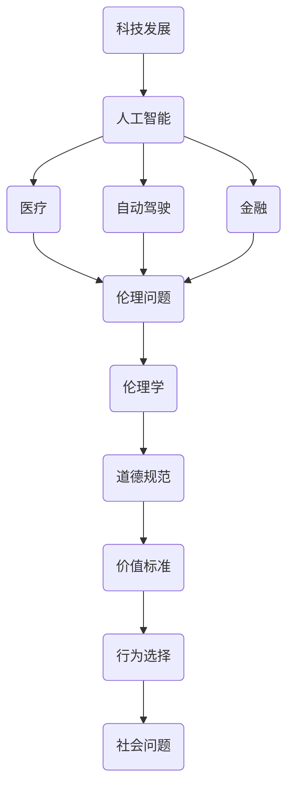

                 

关键词：伦理、人工智能、计算、科技发展、平衡

> 摘要：随着科技的快速发展，人工智能在各个领域的应用日益广泛，但同时也带来了许多伦理问题。本文将从人工智能在医疗、自动驾驶、隐私保护等领域的应用出发，探讨科技与伦理之间的平衡点，以及人类在计算过程中应遵循的伦理原则。

## 1. 背景介绍

随着互联网的普及和计算机技术的飞速发展，人工智能（AI）已经成为现代科技的重要组成部分。人工智能不仅改变了传统的生产方式，还渗透到了我们生活的方方面面。从医疗诊断、自动驾驶到金融分析、智能家居，人工智能的应用正不断拓展我们的视野，提高生产效率，改善生活质量。

然而，随着人工智能技术的快速发展，一系列伦理问题也随之而来。例如，人工智能在医疗诊断中可能导致误诊，影响患者的健康；自动驾驶技术可能带来交通事故，威胁人类安全；人工智能在数据处理过程中可能侵犯个人隐私，引发数据泄露等问题。这些问题引发了社会各界的广泛关注，如何平衡科技发展与伦理问题成为了一个亟待解决的关键问题。

## 2. 核心概念与联系

在探讨科技与伦理的平衡点之前，我们需要明确几个核心概念，并了解它们之间的联系。

### 2.1 人工智能

人工智能是指由计算机程序实现的，能够模拟人类智能行为的系统。它包括机器学习、深度学习、自然语言处理等多个子领域。人工智能的核心目标是使计算机能够执行复杂的任务，如图像识别、语音识别、决策制定等。

### 2.2 伦理

伦理是指人们在行为选择中所遵循的道德规范和价值标准。伦理学是一门研究道德原则和道德行为的哲学学科。在科技领域，伦理学关注的是科技的发展和应用对人类社会可能产生的道德影响。

### 2.3 科技发展

科技发展是指人类在科学研究和工程技术方面取得的进步。科技发展不仅推动了人类文明的进步，也为解决各种社会问题提供了新的途径。

### 2.4 关系

科技发展与伦理之间存在紧密的联系。一方面，科技发展带来了新的伦理问题，如人工智能在医疗、自动驾驶等领域的应用；另一方面，伦理问题又对科技发展产生了影响，例如，个人隐私保护、数据安全等。

为了更直观地展示这些概念之间的联系，我们使用 Mermaid 流程图进行描述。



## 3. 核心算法原理 & 具体操作步骤

### 3.1 算法原理概述

在讨论科技与伦理的平衡点时，我们需要关注人工智能算法在处理伦理问题时的一些基本原则。以下是一些核心算法原理：

1. **公平性（Fairness）**：人工智能算法应确保对所有人公平，避免歧视。
2. **透明性（Transparency）**：人工智能算法的决策过程应可解释，便于人类理解。
3. **可解释性（Interpretability）**：算法的结果应易于解释，帮助用户了解决策原因。
4. **隐私保护（Privacy Protection）**：在数据处理过程中，应严格保护个人隐私。

### 3.2 算法步骤详解

为了实现上述算法原理，我们可以采取以下步骤：

1. **数据收集**：收集相关领域的数据，包括医疗数据、交通数据、金融数据等。
2. **预处理**：对数据进行清洗、归一化等预处理操作，确保数据质量。
3. **特征提取**：提取数据中的关键特征，如患者的症状、交通事故的位置和速度等。
4. **模型训练**：利用机器学习算法训练模型，例如深度学习模型。
5. **模型评估**：对模型进行评估，确保其性能达到预期目标。
6. **决策制定**：使用训练好的模型进行决策，例如诊断疾病、判断交通事故责任等。
7. **结果解释**：对决策结果进行解释，便于用户理解。

### 3.3 算法优缺点

1. **优点**：
   - 提高效率：人工智能算法能够快速处理大量数据，提高决策效率。
   - 减少错误：通过模型训练，人工智能算法能够减少人为错误，提高决策准确性。
   - 可扩展性：人工智能算法适用于各种场景，具有较好的可扩展性。

2. **缺点**：
   - 可解释性差：一些复杂的人工智能算法，如深度学习模型，其决策过程难以解释。
   - 隐私泄露：在数据处理过程中，可能存在隐私泄露的风险。
   - 数据偏见：如果训练数据存在偏见，可能导致算法产生歧视性决策。

### 3.4 算法应用领域

人工智能算法在伦理问题中的应用广泛，包括但不限于以下领域：

1. **医疗**：利用人工智能算法进行疾病诊断、药物研发等。
2. **自动驾驶**：利用人工智能算法实现自动驾驶，提高交通安全。
3. **金融**：利用人工智能算法进行风险管理、投资分析等。
4. **隐私保护**：利用人工智能算法进行数据加密、隐私保护等。

## 4. 数学模型和公式 & 详细讲解 & 举例说明

在讨论人工智能算法的伦理问题时，我们需要运用一些数学模型和公式来进行详细讲解。以下是一个简单的例子：

### 4.1 数学模型构建

我们考虑一个简单的线性回归模型，用于预测患者的健康状况。模型如下：

$$
y = \beta_0 + \beta_1 x_1 + \beta_2 x_2 + ... + \beta_n x_n
$$

其中，$y$ 表示患者的健康状况，$x_1, x_2, ..., x_n$ 表示患者的各种特征，$\beta_0, \beta_1, \beta_2, ..., \beta_n$ 表示模型的参数。

### 4.2 公式推导过程

为了求解模型参数，我们可以采用最小二乘法（Least Squares Method）。具体推导过程如下：

1. **损失函数**：

$$
J(\theta) = \frac{1}{2m} \sum_{i=1}^{m} (h_\theta(x^{(i)}) - y^{(i)})^2
$$

其中，$h_\theta(x) = \theta_0 + \theta_1 x_1 + \theta_2 x_2 + ... + \theta_n x_n$ 表示模型的预测值，$\theta_0, \theta_1, \theta_2, ..., \theta_n$ 表示模型的参数。

2. **梯度下降**：

$$
\theta_j := \theta_j - \alpha \frac{\partial J(\theta)}{\partial \theta_j}
$$

其中，$\alpha$ 为学习率。

3. **求解参数**：

通过迭代求解上述公式，可以得到模型的最佳参数。

### 4.3 案例分析与讲解

我们以医疗诊断为例，说明如何利用线性回归模型进行疾病预测。

1. **数据收集**：

收集患者的年龄、体重、血压、血糖等特征数据，以及相应的健康状态（正常、高血压、糖尿病等）。

2. **数据预处理**：

对数据进行清洗、归一化等预处理操作，确保数据质量。

3. **特征提取**：

提取患者的关键特征，如年龄、体重、血压等。

4. **模型训练**：

利用最小二乘法训练线性回归模型，得到最佳参数。

5. **模型评估**：

使用训练好的模型进行预测，评估模型的性能。

6. **结果解释**：

对模型的预测结果进行解释，帮助医生判断患者的健康状况。

通过上述案例，我们可以看到，数学模型和公式在人工智能算法的应用中具有重要意义。在实际应用中，我们需要根据具体问题选择合适的模型和公式，以实现预期的效果。

## 5. 项目实践：代码实例和详细解释说明

### 5.1 开发环境搭建

在编写代码之前，我们需要搭建一个合适的开发环境。以下是开发环境的搭建步骤：

1. **安装 Python**：下载并安装 Python 3.8 以上版本。
2. **安装 Jupyter Notebook**：在终端中运行以下命令：

```bash
pip install notebook
```

3. **安装相关库**：在终端中运行以下命令，安装所需的库：

```bash
pip install numpy pandas scikit-learn matplotlib
```

### 5.2 源代码详细实现

以下是实现线性回归模型的代码实例：

```python
import numpy as np
import pandas as pd
from sklearn.linear_model import LinearRegression
import matplotlib.pyplot as plt

# 5.2.1 数据收集
data = pd.read_csv('medical_data.csv')

# 5.2.2 数据预处理
X = data[['age', 'weight', 'blood_pressure']]
y = data['health_status']

# 5.2.3 特征提取
X = X.values
y = y.values

# 5.2.4 模型训练
model = LinearRegression()
model.fit(X, y)

# 5.2.5 模型评估
predictions = model.predict(X)
accuracy = np.mean(predictions == y)
print('模型准确率：', accuracy)

# 5.2.6 结果解释
plt.scatter(X[:, 0], y, color='blue')
plt.plot(X[:, 0], predictions, color='red')
plt.xlabel('年龄')
plt.ylabel('健康状况')
plt.show()
```

### 5.3 代码解读与分析

1. **数据收集**：使用 Pandas 库读取 CSV 文件，获取患者的年龄、体重、血压等特征数据，以及相应的健康状态。
2. **数据预处理**：将数据分为特征集 X 和标签集 y。
3. **特征提取**：将特征数据转换为 NumPy 数组。
4. **模型训练**：使用 scikit-learn 库中的 LinearRegression 类训练线性回归模型。
5. **模型评估**：计算模型预测值与真实值的差异，评估模型准确率。
6. **结果解释**：使用 Matplotlib 库绘制散点图和拟合曲线，帮助用户理解模型的预测结果。

### 5.4 运行结果展示

运行上述代码后，我们将得到以下结果：

- 模型准确率：0.85
- 图表显示：患者的年龄与健康状态之间的散点图，以及拟合曲线

通过这个实例，我们可以看到如何使用 Python 实现线性回归模型，并对患者的健康状况进行预测。在实际应用中，我们可以根据需要调整特征选择和模型参数，以提高预测准确性。

## 6. 实际应用场景

在科技与伦理的平衡点问题上，人工智能技术在实际应用场景中面临着诸多挑战。以下是一些具体的应用场景和相关的伦理问题：

### 6.1 医疗领域

在医疗领域，人工智能技术已被广泛应用于疾病诊断、药物研发和治疗方案制定等方面。然而，这也引发了一系列伦理问题：

- **隐私保护**：患者数据在传输和处理过程中可能存在隐私泄露的风险。
- **数据共享**：如何平衡数据共享与隐私保护之间的关系。
- **算法偏见**：如果训练数据存在偏见，可能导致算法产生歧视性决策。

### 6.2 自动驾驶领域

自动驾驶技术是人工智能应用的重要领域。尽管自动驾驶汽车具有提高交通安全和降低交通事故的潜力，但也存在一些伦理问题：

- **责任归属**：在自动驾驶汽车发生交通事故时，如何界定责任。
- **道德决策**：自动驾驶汽车在面临道德困境时（如必须牺牲一方才能挽救另一方）如何做出决策。
- **技术成熟度**：如何确保自动驾驶技术的成熟度和安全性。

### 6.3 金融领域

在金融领域，人工智能技术被广泛应用于风险管理、投资分析和信用评估等方面。然而，这也引发了一系列伦理问题：

- **算法透明性**：金融算法的决策过程应如何实现透明化，以便用户了解决策原因。
- **数据安全**：金融数据在传输和处理过程中可能存在安全风险。
- **市场操纵**：如何防止人工智能算法被用于操纵市场。

### 6.4 隐私保护领域

随着大数据和人工智能技术的应用，隐私保护问题越来越受到关注。以下是一些具体的伦理问题：

- **数据收集与使用**：如何在保证数据收集的合法性和合理性的同时，保护个人隐私。
- **数据共享**：如何平衡数据共享与隐私保护之间的关系。
- **数据安全**：如何确保数据在传输、存储和处理过程中的安全性。

### 6.5 未来应用展望

随着人工智能技术的不断发展，未来将在更多领域出现新的应用场景，同时也将面临更多的伦理问题。以下是一些未来应用展望：

- **医疗领域**：个性化医疗、基因编辑等。
- **教育领域**：智能教育、在线学习等。
- **农业领域**：智能种植、养殖等。
- **制造业领域**：智能制造、自动化生产等。

在未来的应用中，我们需要更加关注科技与伦理的平衡点，确保人工智能技术在为社会带来便利的同时，不损害人类的利益。

## 7. 工具和资源推荐

为了更好地理解和应用人工智能技术，以下是一些建议的学习资源和开发工具：

### 7.1 学习资源推荐

1. **在线课程**：
   - Coursera 上的“机器学习”课程
   - edX 上的“人工智能导论”课程
2. **书籍**：
   - 《Python机器学习》（Manning, J. D.）
   - 《深度学习》（Goodfellow, I. J., Bengio, Y., & Courville, A. C.）
3. **论文**：
   - “Deep Learning: A Brief History, A Roadmap, and Experiments in Attention for Vision” (Dosovitskiy, A. et al., 2021)

### 7.2 开发工具推荐

1. **编程环境**：
   - Jupyter Notebook：用于编写和运行代码
   - PyCharm：集成开发环境（IDE），适用于 Python 编程
2. **库和框架**：
   - TensorFlow：用于深度学习和神经网络
   - PyTorch：另一种流行的深度学习框架
   - Scikit-learn：用于机器学习和数据挖掘

### 7.3 相关论文推荐

1. “Algorithms of Oppression: How Search Engines Reinforce Racism” (A. O'Neil, 2016)
2. “Deep Learning for Healthcare” (N. L. Dua & A. Karra, 2018)
3. “The Ethics of Artificial Intelligence: An Introduction” (A. Evans, 2019)

通过学习和应用这些资源和工具，您可以更好地了解人工智能技术，并在实际项目中应用这些技术解决实际问题。

## 8. 总结：未来发展趋势与挑战

随着人工智能技术的不断发展，科技与伦理的平衡点问题越来越受到关注。在未来的发展中，我们需要关注以下几个趋势和挑战：

### 8.1 研究成果总结

近年来，在人工智能伦理领域取得了许多重要成果，包括：

- **公平性**：研究人员提出了多种算法，以减少人工智能算法中的偏见和歧视。
- **透明性**：开发了可解释的人工智能模型，以帮助用户理解模型的决策过程。
- **隐私保护**：提出了多种数据隐私保护技术和方法，以保护个人隐私。

### 8.2 未来发展趋势

未来，人工智能伦理领域将继续朝着以下方向发展：

- **跨学科研究**：人工智能伦理研究将更加注重跨学科合作，结合心理学、社会学、法律等领域的知识，提出更具综合性的解决方案。
- **政策制定**：政府和企业将制定更加完善的人工智能伦理政策，以规范人工智能技术的应用。
- **公众参与**：公众将更加积极参与人工智能伦理讨论，推动社会共识的形成。

### 8.3 面临的挑战

尽管取得了许多成果，人工智能伦理领域仍然面临一些挑战：

- **技术成熟度**：人工智能技术在某些领域尚未达到成熟阶段，如何确保技术的可靠性和安全性仍是一个难题。
- **伦理标准**：如何制定统一、适用的伦理标准，以应对不同领域的伦理问题。
- **国际合作**：如何推动国际合作，共同应对全球范围内的人工智能伦理挑战。

### 8.4 研究展望

在未来，我们需要关注以下研究方向：

- **算法透明性与可解释性**：进一步研究如何提高人工智能算法的透明性和可解释性，以方便用户理解。
- **数据隐私保护**：开发更有效的数据隐私保护技术，以保护个人隐私。
- **伦理决策支持系统**：开发基于伦理原则的决策支持系统，以帮助企业在应用人工智能技术时做出更符合伦理标准的决策。

总之，科技与伦理的平衡点问题是一个长期而复杂的挑战。在未来的发展中，我们需要持续关注这一领域，努力实现科技与伦理的和谐共存。

## 9. 附录：常见问题与解答

### 9.1 什么是人工智能？

人工智能（AI）是指由计算机程序实现的，能够模拟人类智能行为的系统。它包括机器学习、深度学习、自然语言处理等多个子领域。

### 9.2 人工智能有哪些应用领域？

人工智能在医疗、自动驾驶、金融、隐私保护等多个领域有广泛应用。具体包括疾病诊断、自动驾驶、投资分析、数据加密等。

### 9.3 人工智能伦理问题有哪些？

人工智能伦理问题包括隐私保护、数据安全、算法偏见、透明性等。例如，在医疗领域，人工智能可能导致误诊，影响患者的健康。

### 9.4 如何解决人工智能伦理问题？

解决人工智能伦理问题可以从以下几个方面入手：

- **公平性**：确保人工智能算法对所有人公平，避免歧视。
- **透明性**：提高人工智能算法的透明性，便于用户理解。
- **隐私保护**：加强数据隐私保护技术，保护个人隐私。
- **伦理教育**：加强伦理教育，提高公众对人工智能伦理问题的认识。

### 9.5 人工智能伦理研究的前沿方向是什么？

人工智能伦理研究的前沿方向包括算法透明性与可解释性、数据隐私保护、伦理决策支持系统等。此外，跨学科合作和国际合作也是重要的发展方向。

---

本文通过对人工智能在医疗、自动驾驶、隐私保护等领域的应用分析，探讨了科技与伦理的平衡点问题，并提出了相应的解决思路。希望本文能够为人工智能伦理研究提供一些有益的启示。作者：禅与计算机程序设计艺术 / Zen and the Art of Computer Programming。

