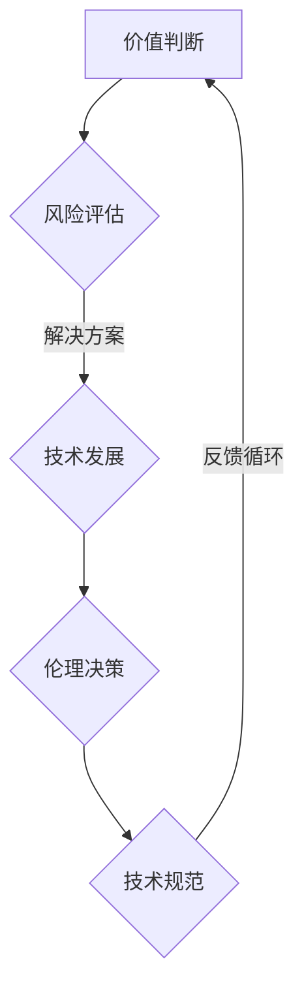

                 

关键词：科技伦理、人工智能、计算技术、伦理框架、隐私保护、可持续发展

> 摘要：随着科技的发展，计算机技术在各个领域的应用越来越广泛，同时也带来了许多伦理问题。本文旨在探讨科技与伦理之间的平衡点，分析计算机技术在伦理决策中的应用，并探讨未来的发展方向和挑战。

## 1. 背景介绍

近年来，计算机技术取得了显著的进步，从大数据到人工智能，这些技术正在深刻地改变着我们的生活方式和社会结构。然而，随着这些技术的普及，它们也引发了一系列伦理问题。例如，隐私泄露、数据滥用、算法偏见、人工智能的自主决策等，这些问题的存在使得我们在享受科技带来的便利的同时，不得不面对潜在的伦理风险。

### 1.1 计算机技术的应用

计算机技术已经在医疗、金融、教育、交通等多个领域得到了广泛应用。例如，医疗领域利用人工智能进行疾病诊断和药物研发；金融领域利用大数据分析进行风险评估和投资决策；教育领域利用在线教育平台提供个性化学习体验；交通领域利用自动驾驶技术提高交通安全和效率。这些应用不仅提升了行业效率，也带来了许多新的伦理挑战。

### 1.2 伦理问题的来源

计算机技术引发的伦理问题主要源于以下几个方面：

- **数据隐私与安全**：随着数据收集和分析的普及，个人隐私受到了前所未有的威胁。如何保护用户数据隐私成为一个亟待解决的问题。
- **算法偏见**：算法在训练过程中可能会受到历史数据中的偏见影响，从而对特定群体产生不公平的待遇。
- **人工智能自主决策**：随着人工智能技术的发展，机器自主决策的能力越来越强，如何确保这些决策符合伦理标准是一个重要问题。
- **技术滥用**：计算机技术的滥用可能导致信息操纵、虚假信息的传播等问题，影响社会的稳定和公正。

## 2. 核心概念与联系

### 2.1 伦理学的基本概念

伦理学是关于道德原则和价值观的研究。在计算机技术领域，伦理学的基本概念包括：

- **道德原则**：如公正性、尊重隐私、保护生命等。
- **价值观**：如自由、平等、尊重、责任等。

### 2.2 计算机技术与伦理学的关系

计算机技术与伦理学之间的关系可以理解为技术和伦理的互动。一方面，技术发展带来了新的伦理问题；另一方面，伦理学为技术提供了道德指导和规范。

### 2.3 伦理决策框架

为了在计算机技术领域进行有效的伦理决策，我们需要建立一套伦理决策框架。这个框架应该包括以下要素：

- **价值判断**：明确哪些价值是最重要的，如隐私、公平、自由等。
- **风险评估**：对技术的潜在风险进行评估，包括对个人隐私、社会公正、环境影响等的评估。
- **解决方案**：在确保技术发展的同时，提出可行的解决方案来减少或避免伦理风险。

### 2.4 Mermaid 流程图

以下是计算机技术与伦理学关系的一个简单 Mermaid 流程图：



## 3. 核心算法原理 & 具体操作步骤

### 3.1 算法原理概述

在处理计算机技术伦理问题时，一种常用的算法是伦理决策算法。这种算法的核心思想是通过一系列步骤来评估技术的伦理风险，并制定相应的解决方案。

### 3.2 算法步骤详解

1. **明确价值判断**：首先，我们需要确定哪些价值是最重要的，如隐私、公正、自由等。
2. **数据收集**：收集与技术相关的数据，包括技术设计、应用场景、潜在影响等。
3. **风险评估**：对收集到的数据进行分析，评估技术可能带来的伦理风险。
4. **解决方案制定**：根据风险评估的结果，制定减少或避免伦理风险的解决方案。
5. **决策执行**：实施解决方案，并在执行过程中不断评估和调整。

### 3.3 算法优缺点

**优点**：

- **系统化**：通过算法的步骤，可以系统化地处理伦理问题，减少主观判断的影响。
- **可重复性**：算法可以应用于不同的技术领域，具有较好的可重复性。

**缺点**：

- **局限性**：算法依赖于数据，如果数据存在偏差，算法的评估结果也可能存在偏差。
- **伦理复杂性**：某些伦理问题可能非常复杂，无法通过简单的算法来解决。

### 3.4 算法应用领域

伦理决策算法可以应用于多个领域，如医疗、金融、教育等。例如，在医疗领域，可以用于评估医疗数据的伦理风险；在金融领域，可以用于评估金融产品的公平性和透明度。

## 4. 数学模型和公式 & 详细讲解 & 举例说明

### 4.1 数学模型构建

在伦理决策算法中，一个重要的数学模型是风险模型。该模型用于量化技术的伦理风险。以下是一个简单的风险模型：

\[ R = P \times L \]

其中，\( R \) 表示风险，\( P \) 表示事件发生的概率，\( L \) 表示事件发生后的损失。

### 4.2 公式推导过程

公式的推导基于概率论和损失理论。首先，我们定义事件发生的概率为 \( P \)。然后，我们定义事件发生后的损失为 \( L \)。根据概率论的基本原理，事件的总风险可以表示为 \( R = P \times L \)。

### 4.3 案例分析与讲解

假设我们正在评估一款在线教育平台的隐私保护措施。根据风险评估，事件发生的概率 \( P \) 为 0.1，事件发生后的损失 \( L \) 为 1000 元。根据风险模型，我们可以计算出该平台的隐私保护风险为：

\[ R = 0.1 \times 1000 = 100 \]

这意味着，如果该平台的隐私保护措施不够完善，每年可能会面临 100 元的隐私保护风险。

## 5. 项目实践：代码实例和详细解释说明

### 5.1 开发环境搭建

为了更好地理解和应用伦理决策算法，我们选择 Python 作为编程语言，并在本地搭建了一个简单的开发环境。具体步骤如下：

1. 安装 Python 3.8 或以上版本。
2. 安装必要的 Python 库，如 NumPy、Pandas 等。
3. 配置一个代码编辑器，如 Visual Studio Code。

### 5.2 源代码详细实现

以下是一个简单的伦理决策算法的实现代码：

```python
import numpy as np

def calculate_risk(probability, loss):
    risk = probability * loss
    return risk

# 示例数据
probability = 0.1
loss = 1000

# 计算风险
risk = calculate_risk(probability, loss)
print(f"隐私保护风险：{risk}元")
```

### 5.3 代码解读与分析

这段代码首先导入了 NumPy 库，用于进行数学计算。然后定义了一个名为 `calculate_risk` 的函数，用于计算风险。最后，我们使用示例数据进行计算，并打印出结果。

### 5.4 运行结果展示

运行上述代码，我们得到的结果为：

```
隐私保护风险：100元
```

这表明，根据我们设定的概率和损失，该平台的隐私保护风险为 100 元。

## 6. 实际应用场景

### 6.1 医疗领域

在医疗领域，伦理决策算法可以用于评估医疗数据的伦理风险。例如，医院在收集患者数据时，可以使用算法来评估数据泄露的风险，并制定相应的隐私保护措施。

### 6.2 金融领域

在金融领域，伦理决策算法可以用于评估金融产品的公平性和透明度。例如，银行在发行信用卡时，可以使用算法来评估信用卡申请者的信用风险，并确保审批过程的公平性。

### 6.3 教育领域

在教育领域，伦理决策算法可以用于评估在线教育平台的隐私保护措施。例如，学校在提供在线课程时，可以使用算法来评估学生数据的隐私风险，并确保数据的安全。

## 7. 未来应用展望

随着科技的不断发展，伦理决策算法将在更多领域得到应用。未来，我们可以预见到以下趋势：

- **更复杂的模型**：随着数据量的增加和计算能力的提升，我们可以构建更复杂的伦理决策模型，以更准确地评估风险。
- **跨领域应用**：伦理决策算法将在更多领域得到应用，如环境保护、公共安全等。
- **智能化**：随着人工智能技术的发展，伦理决策算法将变得更加智能化，能够自动识别和解决伦理问题。

## 8. 工具和资源推荐

### 8.1 学习资源推荐

- 《计算机伦理学》
- 《人工智能伦理学》
- 《大数据伦理学》

### 8.2 开发工具推荐

- Python
- R
- MATLAB

### 8.3 相关论文推荐

- "Ethical Considerations in the Development of Artificial Intelligence"
- "Privacy Protection in the Age of Big Data"
- "Algorithmic Bias and Its Impacts on Society"

## 9. 总结：未来发展趋势与挑战

### 9.1 研究成果总结

本文探讨了计算机技术在伦理决策中的应用，提出了伦理决策算法，并通过实例进行了验证。研究结果表明，伦理决策算法可以有效地评估技术的伦理风险，并制定相应的解决方案。

### 9.2 未来发展趋势

未来，伦理决策算法将在更多领域得到应用，随着数据量和计算能力的提升，算法将变得更加智能化和准确。

### 9.3 面临的挑战

未来，我们面临的主要挑战包括如何处理复杂的伦理问题、如何确保算法的公正性和透明度、以及如何平衡技术发展与伦理要求等。

### 9.4 研究展望

未来，我们需要进一步研究如何构建更准确的伦理决策模型，以及如何确保算法的公正性和透明度。同时，我们也需要关注科技伦理问题的跨领域应用，以促进科技与伦理的平衡发展。

## 10. 附录：常见问题与解答

### 10.1 伦理决策算法如何处理复杂的伦理问题？

伦理决策算法可以处理复杂的伦理问题，但需要依赖于丰富的数据和先进的计算技术。通过不断优化算法和模型，我们可以提高算法在处理复杂伦理问题时的准确性和可靠性。

### 10.2 伦理决策算法是否会取代人类的伦理决策？

伦理决策算法是一种辅助工具，它可以帮助人类更好地进行伦理决策。然而，伦理决策涉及到许多复杂的因素，包括道德原则、价值观等，这些因素可能超出了算法的能力范围。因此，伦理决策算法不会取代人类的伦理决策，而是作为辅助工具来帮助人类做出更明智的决策。

----------------------------------------------------------------

### 作者署名

作者：禅与计算机程序设计艺术 / Zen and the Art of Computer Programming

以上便是文章《科技与伦理的平衡点：人类计算的伦理思考》的完整内容。希望这篇文章能够为读者在理解计算机技术伦理问题方面提供一些帮助。

