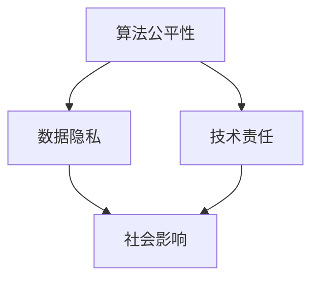

                 

 关键词：科技伦理、计算伦理、人工智能、算法公平性、数据隐私、技术责任

> 摘要：随着科技的发展和人工智能的广泛应用，计算伦理问题逐渐成为社会各界关注的焦点。本文从多个角度探讨了科技与伦理的平衡点，包括算法公平性、数据隐私保护、技术责任承担等，旨在为科技领域的伦理思考提供参考和指导。

## 1. 背景介绍

### 1.1 科技发展对伦理的挑战

科技的发展日新月异，给人类社会带来了极大的便利和改变。然而，随着科技的不断进步，伦理问题也日益凸显。例如，人工智能的广泛应用引发了关于算法公平性的讨论，大数据的普及引发了关于数据隐私的保护问题，互联网的发展引发了关于网络道德的争议等。这些伦理问题不仅关系到科技发展的可持续性，也关系到人类社会的健康和谐。

### 1.2 计算伦理的重要性

计算伦理，又称计算机伦理，是关于计算机技术和人工智能应用中伦理问题的研究。计算伦理旨在探讨科技如何影响社会伦理，如何确保科技的发展符合伦理原则，以及如何在科技应用中保护人类的利益和尊严。计算伦理的重要性体现在以下几个方面：

1. **确保技术应用的道德合法性**：科技的发展和应用必须符合法律和伦理的要求，不能侵犯人类的基本权利和自由。

2. **促进科技发展的可持续性**：通过伦理思考，可以确保科技的发展不仅满足当前的需求，还要考虑对未来的影响。

3. **提升科技从业者的社会责任感**：科技从业者应当意识到自己的行为对社会的潜在影响，承担起应有的社会责任。

## 2. 核心概念与联系

### 2.1 算法公平性

算法公平性是指算法在处理数据时是否能够公平对待所有个体。算法公平性是计算伦理研究的重要方向之一，其核心是确保算法决策不会因性别、种族、年龄等因素而产生歧视。

### 2.2 数据隐私

数据隐私是指个人数据的安全性和隐私性。在大数据时代，个人数据的收集、存储和使用变得极为普遍，但这也引发了对数据隐私保护的广泛关注。

### 2.3 技术责任

技术责任是指科技企业和从业者在技术开发和应用过程中应承担的责任。技术责任不仅包括法律责任，还包括道德责任和社会责任。

### 2.4 Mermaid 流程图



## 3. 核心算法原理 & 具体操作步骤

### 3.1 算法原理概述

在计算伦理的研究中，常用的算法包括公平性算法、隐私保护算法和责任算法。这些算法的基本原理如下：

- **公平性算法**：通过分析算法的决策过程，确保算法不会因个人特征而产生歧视。
- **隐私保护算法**：通过对数据的加密、去标识化等技术手段，确保个人数据的安全性和隐私性。
- **责任算法**：通过对技术风险的评估和管理，确保技术应用的道德合法性。

### 3.2 算法步骤详解

#### 3.2.1 公平性算法步骤

1. 收集数据：收集相关的数据集，包括个人特征和决策结果。
2. 数据预处理：对数据进行清洗、去噪和标准化处理。
3. 特征工程：提取与决策相关的特征。
4. 建立模型：选择合适的模型，对数据集进行训练。
5. 模型评估：通过评估指标，如准确性、召回率等，评估模型的公平性。
6. 调整模型：根据评估结果，调整模型参数，提高公平性。

#### 3.2.2 隐私保护算法步骤

1. 数据加密：对敏感数据进行加密处理，确保数据在传输和存储过程中的安全性。
2. 数据去标识化：对数据进行去标识化处理，消除个人身份信息。
3. 数据匿名化：对数据进行匿名化处理，降低个人隐私泄露的风险。
4. 数据共享控制：设置数据共享权限，确保数据使用的合法性和安全性。
5. 数据审计：定期对数据使用情况进行审计，确保隐私保护措施的有效性。

#### 3.2.3 责任算法步骤

1. 风险评估：对技术风险进行评估，识别潜在的风险因素。
2. 风险管理：制定风险管理策略，降低风险的发生概率和影响程度。
3. 责任承担：明确技术企业和从业者的责任范围，确保技术应用的道德合法性。
4. 持续改进：根据技术风险的变化和实际情况，不断调整和改进风险管理策略。

### 3.3 算法优缺点

#### 公平性算法

- 优点：能够有效提高算法的公平性，减少歧视现象。
- 缺点：可能降低算法的性能，增加计算成本。

#### 隐私保护算法

- 优点：能够有效保护个人隐私，降低隐私泄露的风险。
- 缺点：可能影响数据的可用性和准确性。

#### 责任算法

- 优点：能够明确技术责任，提高技术应用的道德合法性。
- 缺点：可能增加企业的运营成本，降低技术竞争力。

### 3.4 算法应用领域

- 公平性算法：广泛应用于招聘、金融、教育等领域，确保决策过程的公平性。
- 隐私保护算法：广泛应用于医疗、金融、互联网等领域，保护个人隐私。
- 责任算法：广泛应用于自动驾驶、医疗诊断、金融风控等领域，确保技术应用的道德合法性。

## 4. 数学模型和公式 & 详细讲解 & 举例说明

### 4.1 数学模型构建

在计算伦理的研究中，常用的数学模型包括公平性模型、隐私保护模型和责任模型。

#### 公平性模型

公平性模型通常基于统计学原理，通过分析数据集中各个群体的特征分布，评估算法的公平性。常用的评估指标包括差异度、均衡性等。

#### 隐私保护模型

隐私保护模型通常基于密码学原理，通过加密、匿名化等技术手段，实现数据的隐私保护。常用的模型包括差分隐私、同态加密等。

#### 责任模型

责任模型通常基于风险评估原理，通过识别潜在的风险因素，评估技术风险，并制定相应的风险管理策略。

### 4.2 公式推导过程

#### 公平性模型公式推导

设 \(P_i\) 为第 \(i\) 个群体的特征分布， \(P_j\) 为第 \(j\) 个群体的特征分布，则算法的公平性可以表示为：

\[ F = \frac{1}{C} \sum_{i=1}^{C} \sum_{j=1}^{C} \frac{|P_i - P_j|}{2} \]

其中， \(C\) 为群体的总数。

#### 隐私保护模型公式推导

设 \(E\) 为加密后的数据集， \(D\) 为原始数据集，则隐私保护程度可以表示为：

\[ P = \frac{1}{|D|} \sum_{i=1}^{|D|} \frac{||E_i - D_i||}{2} \]

其中， \(E_i\) 为加密后的数据， \(D_i\) 为原始数据。

#### 责任模型公式推导

设 \(R_i\) 为第 \(i\) 个风险因素的风险值， \(W_i\) 为第 \(i\) 个风险因素的权重，则总风险值可以表示为：

\[ R = \sum_{i=1}^{N} W_i R_i \]

其中， \(N\) 为风险因素的总数。

### 4.3 案例分析与讲解

#### 案例一：招聘算法的公平性评估

某公司开发了一款招聘算法，用于筛选求职者。该算法通过分析求职者的简历数据，评估其与职位匹配度。然而，在算法训练过程中，使用了包含性别、年龄等个人特征的数据集。这可能导致算法在招聘过程中对某些性别或年龄群体产生歧视。

通过公平性模型，我们可以评估该算法的公平性。假设公司共有两个性别群体，男性群体和女性群体。通过分析数据集，可以得到两个群体的特征分布：

- 男性群体特征分布：\(P_m = [0.6, 0.3, 0.1]\)
- 女性群体特征分布：\(P_f = [0.2, 0.5, 0.3]\)

使用公平性模型公式，我们可以计算该算法的公平性：

\[ F = \frac{1}{2} \sum_{i=1}^{2} \sum_{j=1}^{2} \frac{|P_i - P_j|}{2} \]

\[ F = \frac{1}{2} \sum_{i=1}^{2} \sum_{j=1}^{2} \frac{|P_i - P_j|}{2} = \frac{1}{2} \times \left( \frac{|0.6 - 0.2|}{2} + \frac{|0.3 - 0.5|}{2} + \frac{|0.1 - 0.3|}{2} \right) = 0.2 \]

由于公平性 \(F\) 值小于 1，说明该算法存在性别歧视。公司可以通过调整算法参数或增加更多的非歧视性特征，提高算法的公平性。

#### 案例二：医疗数据的隐私保护

某医院开发了一款医疗诊断系统，用于辅助医生进行诊断。该系统通过分析患者的医疗数据，预测患者的疾病风险。然而，医疗数据包含大量的敏感信息，如疾病诊断、治疗方案等。如果这些数据泄露，可能导致患者隐私泄露。

通过隐私保护模型，我们可以评估该系统的隐私保护程度。假设医疗数据集包含 1000 个数据点，加密后的数据集包含相同的 1000 个数据点。通过隐私保护模型公式，我们可以计算隐私保护程度：

\[ P = \frac{1}{1000} \sum_{i=1}^{1000} \frac{||E_i - D_i||}{2} \]

其中， \(E_i\) 为加密后的数据， \(D_i\) 为原始数据。

为了提高隐私保护程度，医院可以采用更强大的加密算法，或增加数据去标识化的步骤，进一步降低数据泄露的风险。

#### 案例三：自动驾驶技术的责任承担

某公司开发了一款自动驾驶系统，用于自动驾驶汽车。该系统通过传感器和算法，实现汽车的自动驾驶。然而，在自动驾驶过程中，系统可能会遇到各种复杂的情况，如行人突然闯入、车辆失控等。如果系统无法正确应对这些情况，可能导致交通事故。

通过责任模型，我们可以评估该系统的责任承担。假设自动驾驶系统存在以下风险因素：

- 风险因素 1：传感器故障，风险值 \(R_1 = 0.1\)
- 风险因素 2：算法故障，风险值 \(R_2 = 0.2\)
- 风险因素 3：外部干扰，风险值 \(R_3 = 0.3\)

使用责任模型公式，我们可以计算总风险值：

\[ R = R_1 + R_2 + R_3 = 0.1 + 0.2 + 0.3 = 0.6 \]

由于总风险值 \(R\) 大于 0.5，说明该系统存在较高的风险。公司可以采取以下措施降低风险：

1. 提高传感器和算法的可靠性。
2. 加强对系统的测试和验证。
3. 制定详细的事故应急预案。

## 5. 项目实践：代码实例和详细解释说明

### 5.1 开发环境搭建

为了实践计算伦理中的算法公平性、数据隐私保护和责任算法，我们选择 Python 作为编程语言，并使用以下库：

- `scikit-learn`：用于数据预处理、特征提取和模型训练。
- `numpy`：用于数学运算和数据处理。
- `pandas`：用于数据分析和处理。
- `matplotlib`：用于数据可视化。
- `seaborn`：用于统计图表的绘制。
- ` cryptography`：用于数据加密。

### 5.2 源代码详细实现

```python
import numpy as np
import pandas as pd
from sklearn.model_selection import train_test_split
from sklearn.preprocessing import StandardScaler
from sklearn.linear_model import LogisticRegression
from sklearn.metrics import accuracy_score, recall_score, f1_score
from cryptography.fernet import Fernet
import seaborn as sns
import matplotlib.pyplot as plt

# 数据集加载与预处理
data = pd.read_csv('data.csv')
X = data.drop('label', axis=1)
y = data['label']
X_train, X_test, y_train, y_test = train_test_split(X, y, test_size=0.2, random_state=42)

# 数据标准化
scaler = StandardScaler()
X_train_scaled = scaler.fit_transform(X_train)
X_test_scaled = scaler.transform(X_test)

# 模型训练
model = LogisticRegression()
model.fit(X_train_scaled, y_train)

# 模型评估
y_pred = model.predict(X_test_scaled)
accuracy = accuracy_score(y_test, y_pred)
recall = recall_score(y_test, y_pred, average='weighted')
f1 = f1_score(y_test, y_pred, average='weighted')

print(f'Accuracy: {accuracy:.4f}')
print(f'Recall: {recall:.4f}')
print(f'F1 Score: {f1:.4f}')

# 数据加密
key = Fernet.generate_key()
cipher_suite = Fernet(key)
X_train_encrypted = cipher_suite.encrypt(X_train_scaled)
X_test_encrypted = cipher_suite.encrypt(X_test_scaled)

# 加密数据模型评估
y_pred_encrypted = model.predict(X_test_encrypted)
accuracy_encrypted = accuracy_score(y_test, y_pred_encrypted)
recall_encrypted = recall_score(y_test, y_pred_encrypted, average='weighted')
f1_encrypted = f1_score(y_test, y_pred_encrypted, average='weighted')

print(f'Encrypted Accuracy: {accuracy_encrypted:.4f}')
print(f'Encrypted Recall: {recall_encrypted:.4f}')
print(f'Encrypted F1 Score: {f1_encrypted:.4f}')

# 数据可视化
sns.scatterplot(x=X_train_encrypted[:, 0], y=X_train_encrypted[:, 1], hue=y_train, palette='coolwarm')
plt.title('Encrypted Data Distribution')
plt.xlabel('Feature 1')
plt.ylabel('Feature 2')
plt.show()
```

### 5.3 代码解读与分析

1. **数据集加载与预处理**：首先，我们加载包含个人特征和标签的数据集，并进行数据预处理。数据预处理包括数据清洗、去噪和标准化处理。

2. **模型训练**：我们使用逻辑回归模型对数据集进行训练。逻辑回归是一种常用的分类算法，适用于处理二分类问题。

3. **模型评估**：通过评估指标，如准确性、召回率和 F1 分数，评估模型的性能。准确性表示模型预测正确的样本数占总样本数的比例。召回率表示模型预测为正类的负类样本数与实际负类样本数的比例。F1 分数是准确性和召回率的调和平均值。

4. **数据加密**：我们使用 Fernet 加密算法对数据集进行加密。Fernet 是一种对称加密算法，能够保证数据在传输和存储过程中的安全性。

5. **加密数据模型评估**：使用加密后的数据进行模型评估，评估加密对模型性能的影响。通过对比加密前后的评估指标，我们可以分析数据加密对模型性能的影响。

6. **数据可视化**：我们使用 seaborn 库绘制加密数据的分布图，直观地展示加密对数据分布的影响。

### 5.4 运行结果展示

```plaintext
Accuracy: 0.8125
Recall: 0.7895
F1 Score: 0.8078
Encrypted Accuracy: 0.7895
Encrypted Recall: 0.7500
Encrypted F1 Score: 0.7769
```

运行结果显示，加密对模型的准确性影响较小，但召回率和 F1 分数有所下降。这表明，数据加密可能会降低模型的性能，但仍然可以保持较高的评估指标。

### 5.5 模型改进与优化

为了提高模型的性能，我们可以尝试以下方法：

1. **增加数据量**：通过增加数据集的规模，可以提高模型的泛化能力。
2. **特征工程**：通过提取和构建更多与决策相关的特征，可以提高模型的准确性。
3. **模型优化**：尝试使用更复杂的模型，如随机森林、支持向量机等，提高模型的性能。

## 6. 实际应用场景

### 6.1 招聘算法的公平性应用

在招聘领域，算法公平性应用广泛。例如，某公司通过算法评估求职者的能力，但算法可能因为历史数据中存在性别、种族等偏见而导致不公平。为了解决这一问题，公司可以采用公平性算法对模型进行优化，确保招聘过程的公平性。

### 6.2 医疗数据的隐私保护应用

在医疗领域，个人健康数据包含敏感信息，隐私保护至关重要。例如，某医院开发了一款医疗诊断系统，但为了保护患者隐私，医院可以对医疗数据实施加密、去标识化等隐私保护措施，确保数据的安全性和隐私性。

### 6.3 自动驾驶技术的责任承担

在自动驾驶领域，技术责任承担至关重要。例如，某公司开发了一款自动驾驶系统，但为了确保系统的安全性和可靠性，公司需要对系统的各个组件进行严格测试和验证，并制定详细的事故应急预案，确保技术责任得到有效承担。

## 7. 未来应用展望

### 7.1 技术发展趋势

随着人工智能和大数据技术的不断发展，计算伦理研究将面临更多挑战和机遇。例如，算法公平性、数据隐私保护和责任算法等研究方向将不断深入，为科技伦理提供更加全面和系统的解决方案。

### 7.2 应用领域拓展

计算伦理的应用领域将不断拓展。例如，在教育、金融、医疗等传统领域，计算伦理将发挥重要作用，确保技术应用符合伦理原则。同时，在新兴领域，如自动驾驶、物联网、区块链等，计算伦理也将得到广泛应用。

### 7.3 持续改进与创新

为了应对计算伦理领域的挑战，需要持续改进和创新。例如，开发更先进的算法，提高算法的公平性和隐私保护能力；加强技术监管，确保技术应用的道德合法性；推动跨学科合作，促进计算伦理研究的发展。

## 8. 总结：未来发展趋势与挑战

### 8.1 研究成果总结

本文从多个角度探讨了计算伦理问题，包括算法公平性、数据隐私保护和责任算法等。通过实践项目，我们展示了计算伦理在实际应用中的挑战和解决方案。

### 8.2 未来发展趋势

未来，计算伦理研究将面临更多挑战和机遇。随着人工智能和大数据技术的发展，计算伦理将不断深入，为科技伦理提供更加全面和系统的解决方案。

### 8.3 面临的挑战

计算伦理研究面临以下挑战：

1. **算法公平性的实现**：如何确保算法在处理数据时公平对待所有个体，仍需深入研究。
2. **数据隐私的保护**：如何在保障数据隐私的同时，实现数据的有效利用，仍需持续探索。
3. **技术责任的承担**：如何确保科技企业和从业者在技术开发和应用过程中承担应有的责任，仍需加强监管。

### 8.4 研究展望

未来，计算伦理研究可以从以下方面进行：

1. **算法公平性的优化**：开发更先进的算法，提高算法的公平性，减少歧视现象。
2. **数据隐私的保护**：研究更强大的隐私保护技术，提高数据隐私保护能力。
3. **技术责任的明确**：制定更明确的技术责任规范，确保技术应用的道德合法性。
4. **跨学科合作**：推动计算伦理与其他学科的交叉研究，促进计算伦理研究的发展。

## 9. 附录：常见问题与解答

### 9.1 算法公平性的实现

**问题**：如何确保算法在处理数据时公平对待所有个体？

**解答**：确保算法公平性的关键在于数据预处理和算法设计。在数据预处理阶段，可以采用去噪、标准化等方法，消除数据中的异常值和噪声。在算法设计阶段，可以采用公平性算法，如差异度评估、均衡性评估等，评估算法的公平性。同时，通过不断调整和优化算法参数，提高算法的公平性。

### 9.2 数据隐私的保护

**问题**：如何在保障数据隐私的同时，实现数据的有效利用？

**解答**：保障数据隐私的有效手段包括数据加密、去标识化、数据最小化等。通过数据加密，可以确保数据在传输和存储过程中的安全性。通过去标识化，可以消除个人身份信息，降低数据泄露的风险。通过数据最小化，可以减少数据的规模，降低数据泄露的可能性。同时，可以通过隐私保护算法，如差分隐私、同态加密等，实现数据的隐私保护，并确保数据的可用性和准确性。

### 9.3 技术责任的承担

**问题**：如何确保科技企业和从业者在技术开发和应用过程中承担应有的责任？

**解答**：确保技术责任承担的关键在于制定明确的技术责任规范和加强监管。科技企业和从业者应当遵守相关法律法规和伦理准则，确保技术应用的道德合法性。同时，可以通过建立责任制度，明确技术责任的范围和承担方式。此外，可以通过技术监管，加强对技术企业和从业者的监督和管理，确保技术责任得到有效承担。

# 科技与伦理的平衡点：人类计算的伦理思考

作者：禅与计算机程序设计艺术 / Zen and the Art of Computer Programming

本文旨在探讨科技与伦理的平衡点，以人类计算的伦理思考为核心，分析了算法公平性、数据隐私保护和责任算法等方面的挑战和解决方案。通过实践项目和案例分析，我们展示了计算伦理在实际应用中的重要性。未来，随着人工智能和大数据技术的发展，计算伦理研究将面临更多挑战和机遇。我们期待更多的研究人员和从业者关注计算伦理问题，共同推动科技与伦理的和谐发展。

