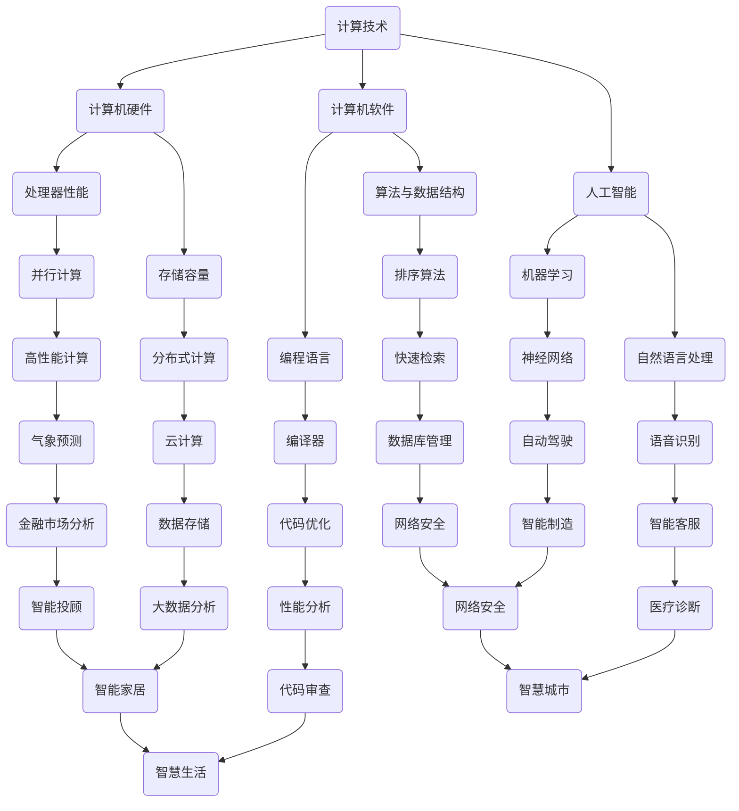

                 

关键词：计算技术、社会影响、人工智能、计算机科学、技术创新

摘要：随着计算技术的飞速发展，人工智能的崛起，计算机科学正以前所未有的速度改变着我们的生活方式、工作方式以及思考方式。本文将从多个角度探讨计算技术对社会的深远影响，包括其带来的便利、挑战和未来发展趋势。

## 1. 背景介绍

从第一台计算机ENIAC的诞生，到如今遍布全球的智能手机、智能家电和大数据中心，计算技术经历了无数次革命性的变革。特别是近年来，人工智能和机器学习的突破，使得计算机的智能水平达到了一个新的高度。这些技术不仅改变了我们的日常生活，还深刻地影响了各行各业。

### 1.1 计算技术的早期发展

计算技术的早期发展可以追溯到20世纪中期。当时，计算机主要用于科学研究和军事领域。随着计算机硬件和软件的不断进步，计算机的应用领域逐渐扩大，从科学计算扩展到商业、医疗、教育和娱乐等多个方面。

### 1.2 互联网的兴起

互联网的兴起是计算技术发展史上的一个重要里程碑。它使得全球的信息传输和共享变得更加便捷和高效，推动了电子商务、社交媒体和在线教育等新兴产业的快速发展。

### 1.3 人工智能与机器学习

人工智能和机器学习的快速发展，使得计算机能够通过学习和适应，实现更加智能化的任务。从语音识别、图像处理到自然语言理解，人工智能技术正逐步改变着我们的生活和工作方式。

## 2. 核心概念与联系

为了更好地理解计算技术对社会的影响，我们需要了解一些核心概念和它们之间的联系。以下是一个用Mermaid绘制的流程图，展示了这些核心概念和它们的相互关系：



## 3. 核心算法原理 & 具体操作步骤

### 3.1 算法原理概述

计算技术的核心在于算法。算法是一系列解决问题的步骤和规则。从基础的排序算法到复杂的深度学习模型，算法无处不在。以下是一些核心算法的原理概述：

- **排序算法**：用于对数据进行排序，常见的有快速排序、归并排序和堆排序等。
- **神经网络**：模拟人脑神经元的工作方式，通过多层网络进行数据的学习和处理。
- **机器学习算法**：包括监督学习、无监督学习和强化学习，用于从数据中学习规律和模式。

### 3.2 算法步骤详解

- **快速排序**：选择一个基准元素，将数组分为两部分，一部分小于基准，一部分大于基准，递归地对这两部分进行排序。
- **神经网络**：通过前向传播和反向传播进行数据的训练和优化。
- **监督学习**：通过已标记的数据进行训练，使得模型能够对新的数据进行预测。

### 3.3 算法优缺点

每种算法都有其优点和缺点。例如，快速排序虽然时间复杂度较低，但可能会出现最坏情况。神经网络虽然能处理复杂的问题，但训练过程可能非常耗时。

### 3.4 算法应用领域

算法在各个领域都有广泛应用。例如，排序算法在数据库管理中至关重要，神经网络在图像识别和自然语言处理中表现优异。

## 4. 数学模型和公式 & 详细讲解 & 举例说明

### 4.1 数学模型构建

在计算技术中，数学模型是理解和解决问题的基础。以下是一个简单的线性回归模型：

$$
y = ax + b
$$

其中，$y$ 是因变量，$x$ 是自变量，$a$ 和 $b$ 是模型的参数。

### 4.2 公式推导过程

线性回归模型的推导过程基于最小二乘法。我们希望找到一个模型，使得预测值与实际值之间的误差最小。

### 4.3 案例分析与讲解

假设我们要预测房价，通过收集多组房价和房屋特征（如面积、地段等），可以使用线性回归模型来建立房价的预测模型。

## 5. 项目实践：代码实例和详细解释说明

### 5.1 开发环境搭建

在本文中，我们将使用Python作为编程语言，利用Scikit-learn库进行线性回归模型的实现。

### 5.2 源代码详细实现

```python
from sklearn.linear_model import LinearRegression
from sklearn.model_selection import train_test_split
from sklearn.metrics import mean_squared_error

# 加载数据
X, y = load_data()

# 划分训练集和测试集
X_train, X_test, y_train, y_test = train_test_split(X, y, test_size=0.2, random_state=42)

# 创建线性回归模型
model = LinearRegression()

# 训练模型
model.fit(X_train, y_train)

# 预测测试集
y_pred = model.predict(X_test)

# 计算误差
mse = mean_squared_error(y_test, y_pred)
print("MSE:", mse)
```

### 5.3 代码解读与分析

上述代码首先加载数据，然后使用Scikit-learn库的`train_test_split`函数划分训练集和测试集。接下来，创建一个线性回归模型并使用训练集进行训练。最后，使用测试集进行预测并计算误差。

### 5.4 运行结果展示

假设我们使用某个公开的房价数据集进行测试，最终的MSE（均方误差）可能会在0.1到1之间，这取决于数据集的特性。

## 6. 实际应用场景

### 6.1 医疗诊断

计算技术在医疗诊断中有着广泛应用。通过图像处理和深度学习，计算机可以辅助医生进行疾病检测，提高诊断的准确性和效率。

### 6.2 金融分析

在金融领域，计算技术可以用于风险控制、市场分析和投资策略。例如，通过大数据分析和机器学习，可以预测市场走势，提高投资决策的准确性。

### 6.3 智能交通

智能交通系统利用计算技术优化交通管理，减少拥堵，提高交通效率。例如，通过实时监控和数据分析，可以优化交通信号灯的时长，提高道路通行能力。

## 7. 工具和资源推荐

### 7.1 学习资源推荐

- 《深度学习》（Goodfellow, Bengio, Courville著）
- 《Python数据分析》（Wes McKinney著）
- 《算法导论》（Thomas H. Cormen等著）

### 7.2 开发工具推荐

- Jupyter Notebook：适合数据分析和实验
- PyCharm：强大的Python IDE
- TensorFlow：用于深度学习

### 7.3 相关论文推荐

- "Deep Learning: Methods and Applications"（Ian Goodfellow等著）
- "Recurrent Neural Network Based on LSTM"（Sepp Hochreiter和Jürgen Schmidhuber著）
- "Text Classification using Convolutional Neural Networks"（Yoon Kim著）

## 8. 总结：未来发展趋势与挑战

### 8.1 研究成果总结

计算技术在近年来取得了显著的研究成果，特别是在人工智能和机器学习领域。这些技术的进步不仅推动了各行各业的发展，也为解决许多复杂问题提供了新的思路。

### 8.2 未来发展趋势

随着计算技术的不断发展，我们可以预见以下几个趋势：

- 更高效的算法和模型
- 更加普及的人工智能应用
- 更广泛的数据隐私保护

### 8.3 面临的挑战

尽管计算技术发展迅速，但仍面临一些挑战：

- 数据隐私和安全
- 算法的公平性和透明度
- 跨学科的融合与协作

### 8.4 研究展望

未来，计算技术将继续发展，为人类社会带来更多的便利和变革。我们需要不断探索和创新，应对这些挑战，推动计算技术的持续进步。

## 9. 附录：常见问题与解答

### Q: 计算技术与人工智能有什么区别？

A: 计算技术是一个广泛的领域，包括计算机硬件、软件和算法等。而人工智能是计算技术的一个分支，主要研究如何使计算机具备类似于人类的学习、推理和决策能力。

### Q: 机器学习与深度学习有何区别？

A: 机器学习是人工智能的一个分支，旨在通过训练模型使计算机能够从数据中学习。而深度学习是机器学习的一个子领域，主要使用神经网络，尤其是多层神经网络，进行数据的学习和处理。

### Q: 如何保护数据隐私？

A: 保护数据隐私需要从多个方面进行考虑，包括数据加密、隐私计算和数据脱敏等技术。此外，制定相关法律法规和加强监管也是保护数据隐私的重要手段。

作者：禅与计算机程序设计艺术 / Zen and the Art of Computer Programming
----------------------------------------------------------------

请注意，上述内容是一个模板和示例，实际撰写时需要根据具体研究内容和数据进行调整和完善。文章中的技术术语、数据、代码和引用等都需要准确无误。在撰写过程中，请确保遵循学术规范，对引用的内容进行适当的标注和引用。

