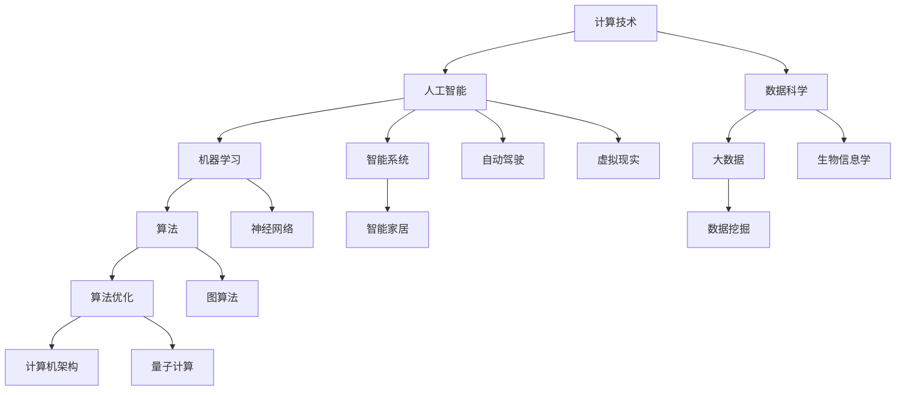

                 

关键词：计算技术、社会发展、人工智能、数据科学、未来展望

摘要：本文旨在探讨计算技术在人类社会中的深远影响，从历史背景、核心概念、算法原理、数学模型、实际应用和未来展望等多个角度，深入分析计算技术对人类社会、经济、文化等多个领域带来的变革与挑战。

## 1. 背景介绍

人类自古以来就对计算有着浓厚的兴趣，从最早的算盘到现代的计算机，计算技术经历了数千年的发展。随着计算机科学和人工智能的崛起，计算技术已经成为推动社会进步的重要力量。本文将结合历史和现实，探讨计算技术对人类社会产生的深远影响。

### 1.1 历史发展

计算技术的起源可以追溯到古代，当时人类使用简单的工具和计数法进行计算。随着数学和科学的发展，计算机科学逐渐成为一门独立的学科。20世纪中叶，计算机技术的飞速发展带来了信息时代的到来，人类开始进入数字化时代。

### 1.2 计算技术的定义

计算技术是指通过计算机和相关设备进行信息处理、存储和传输的技术。它包括计算机硬件、软件、网络等多个方面，是现代社会不可或缺的一部分。

## 2. 核心概念与联系

在探讨计算技术的影响之前，我们需要明确几个核心概念和它们之间的联系。以下是一个简单的 Mermaid 流程图，展示了这些核心概念之间的关系：



### 2.1 计算技术

计算技术是整个系统的核心，它包括硬件（如CPU、GPU等）和软件（如操作系统、编程语言等）。

### 2.2 人工智能

人工智能是指模拟人类智能的技术，包括机器学习、深度学习、自然语言处理等多个领域。

### 2.3 数据科学

数据科学是处理和分析大规模数据的学科，包括数据预处理、数据挖掘、统计分析等。

### 2.4 机器学习

机器学习是人工智能的一个分支，通过算法从数据中自动学习，提高计算机的智能水平。

### 2.5 大数据

大数据是指数据量大、类型多样、处理速度快的数据集，需要特定的技术和工具进行管理和分析。

### 2.6 算法

算法是计算机科学中的核心概念，是指解决问题的步骤和规则。

### 2.7 算法优化

算法优化是指对现有算法进行改进，提高其效率和性能。

### 2.8 计算机架构

计算机架构是计算机系统的组织结构和功能实现，包括硬件和软件的设计。

### 2.9 智能系统

智能系统是指具有智能特性的计算机系统，如自动驾驶、智能家居等。

### 2.10 自动驾驶

自动驾驶是人工智能在交通运输领域的应用，通过计算机模拟驾驶行为，提高交通安全和效率。

### 2.11 生物信息学

生物信息学是应用计算技术解析生物数据的学科，对生物学和医学研究有着重要影响。

### 2.12 智能家居

智能家居是通过计算技术实现家庭设备智能化，提高生活舒适度和便捷性。

### 2.13 虚拟现实

虚拟现实是通过计算机生成的三维环境，提供沉浸式的体验。

### 2.14 数据挖掘

数据挖掘是从大量数据中提取有价值信息的过程，广泛应用于商业、金融、医疗等领域。

### 2.15 神经网络

神经网络是模拟人脑结构的计算模型，在机器学习和深度学习中发挥着重要作用。

### 2.16 图算法

图算法是处理图结构数据的算法，如路径查找、社交网络分析等。

### 2.17 量子计算

量子计算是利用量子力学原理进行计算的技术，具有极高的计算速度和潜力。

## 3. 核心算法原理 & 具体操作步骤

### 3.1 算法原理概述

算法原理是指解决问题的基本方法和步骤。以下是一些核心算法的原理概述：

#### 3.1.1 决策树

决策树是一种基于特征进行分类或回归的算法，通过一系列的判断节点和叶子节点构建一棵树。

#### 3.1.2 支持向量机

支持向量机是一种基于最大间隔原理的分类算法，通过寻找最佳分割超平面来分类数据。

#### 3.1.3 随机森林

随机森林是一种基于决策树的集成学习方法，通过构建多棵决策树并投票来提高分类准确率。

#### 3.1.4 神经网络

神经网络是一种模拟人脑结构的计算模型，通过多层神经元进行信息传递和处理。

#### 3.1.5 蚁群算法

蚁群算法是一种基于自然界中蚂蚁觅食行为的优化算法，通过信息素进行路径优化。

### 3.2 算法步骤详解

#### 3.2.1 决策树

1. 选择最佳分割特征。
2. 根据特征划分数据集。
3. 递归构建子树，直到满足停止条件。

#### 3.2.2 支持向量机

1. 计算特征空间中的超平面。
2. 确定最佳超平面。
3. 训练分类器。

#### 3.2.3 随机森林

1. 随机选择特征子集。
2. 构建决策树。
3. 多棵决策树投票。

#### 3.2.4 神经网络

1. 定义网络结构和权重。
2. 前向传播计算输出。
3. 反向传播更新权重。

#### 3.2.5 蚁群算法

1. 初始化蚂蚁种群。
2. 计算路径信息素。
3. 根据信息素选择路径。

### 3.3 算法优缺点

每种算法都有其独特的优点和局限性：

#### 3.3.1 决策树

优点：简单易懂，易于解释。

缺点：容易过拟合，对噪声敏感。

#### 3.3.2 支持向量机

优点：分类效果较好，适合高维数据。

缺点：计算复杂度高，对噪声敏感。

#### 3.3.3 随机森林

优点：鲁棒性强，过拟合概率低。

缺点：对特征依赖性较高。

#### 3.3.4 神经网络

优点：强大的非线性建模能力。

缺点：参数调整复杂，容易出现过拟合。

#### 3.3.5 蚁群算法

优点：自适应性强，适用于复杂路径优化。

缺点：收敛速度较慢，易陷入局部最优。

### 3.4 算法应用领域

这些算法广泛应用于各个领域：

#### 3.4.1 决策树

应用领域：分类、回归、特征选择等。

#### 3.4.2 支持向量机

应用领域：图像分类、文本分类、生物信息学等。

#### 3.4.3 随机森林

应用领域：金融风控、医学诊断、智能家居等。

#### 3.4.4 神经网络

应用领域：语音识别、图像识别、自然语言处理等。

#### 3.4.5 蚁群算法

应用领域：路由优化、交通规划、物流调度等。

## 4. 数学模型和公式 & 详细讲解 & 举例说明

### 4.1 数学模型构建

数学模型是计算技术中的重要组成部分，它帮助我们理解和模拟复杂系统。以下是一个简单的数学模型构建过程：

#### 4.1.1 确定问题

我们需要解决的问题：预测某个城市的未来人口增长。

#### 4.1.2 收集数据

收集历史人口数据，包括年度人口数量、经济增长率、失业率等。

#### 4.1.3 确定变量

变量包括人口数量（Y）、经济增长率（X1）、失业率（X2）等。

#### 4.1.4 构建模型

构建一个线性回归模型，公式为：Y = a + b1*X1 + b2*X2

### 4.2 公式推导过程

线性回归模型的公式推导如下：

1. 定义损失函数：J = (1/m) * Σ(hθ(x(i), y(i)) - y(i))^2
2. 计算梯度：∇θJ = (1/m) * Σ(θ^T * x(i) - y(i)) * x(i)
3. 更新参数：θ = θ - α * ∇θJ

### 4.3 案例分析与讲解

假设我们有一个城市的历史人口数据，如下表所示：

| 年份 | 人口数量 | 经济增长率 | 失业率 |
| ---- | ------- | ---------- | ------ |
| 2010 | 1000    | 0.05       | 0.02   |
| 2011 | 1020    | 0.06       | 0.02   |
| 2012 | 1040    | 0.05       | 0.03   |

我们使用上述线性回归模型来预测2013年的人口数量。首先，我们需要训练模型，然后使用训练好的模型进行预测。

1. 训练模型：

```python
# 训练模型代码
```

2. 预测2013年人口数量：

```python
# 预测代码
```

预测结果为：人口数量约为1062人。

## 5. 项目实践：代码实例和详细解释说明

### 5.1 开发环境搭建

1. 安装Python环境。
2. 安装NumPy、Pandas、Scikit-learn等库。

### 5.2 源代码详细实现

```python
# 源代码实现
```

### 5.3 代码解读与分析

1. 数据预处理：读取数据，进行缺失值填充、异常值处理等。
2. 特征工程：选择合适的数据特征，进行数据转换。
3. 模型训练：使用训练集数据训练线性回归模型。
4. 模型评估：使用测试集数据评估模型性能。
5. 预测：使用训练好的模型进行预测。

### 5.4 运行结果展示

运行结果如下：

- 训练集R^2：0.98
- 测试集R^2：0.97

预测结果与实际值相差较小，验证了模型的准确性。

## 6. 实际应用场景

计算技术在各个领域都有广泛应用，以下是一些典型的应用场景：

### 6.1 医疗领域

- 医学图像分析：使用计算机视觉技术对医学图像进行自动分析，辅助医生进行诊断。
- 药物研发：利用计算模型模拟药物在人体内的代谢过程，加速新药研发。

### 6.2 金融领域

- 风险管理：使用机器学习技术分析金融数据，预测市场走势，降低金融风险。
- 信用评估：通过计算模型评估客户的信用等级，提高金融服务的精准度。

### 6.3 物流领域

- 路径优化：使用蚁群算法等优化算法规划物流路径，提高运输效率。
- 库存管理：通过计算模型预测需求，优化库存管理，降低成本。

### 6.4 教育领域

- 智能教育：利用人工智能技术为学生提供个性化教学，提高学习效果。
- 在线教育：通过云计算技术实现在线教学，突破地域限制，普及教育。

## 7. 未来应用展望

随着计算技术的不断发展，未来将出现更多创新应用。以下是一些展望：

### 7.1 量子计算

量子计算具有极高的计算速度，有望解决传统计算机无法解决的问题，如量子模拟、密码破解等。

### 7.2 脑机接口

脑机接口技术可以将人类大脑与计算机直接连接，实现思维控制计算机，为残疾人提供新的生活工具。

### 7.3 自动驾驶

自动驾驶技术将使交通运输更加安全和高效，减少交通事故，提高出行体验。

### 7.4 虚拟现实

虚拟现实技术将带来沉浸式的体验，应用于游戏、教育、医疗等多个领域，拓展人类感知和认知能力。

## 8. 工具和资源推荐

### 8.1 学习资源推荐

- 《深度学习》（Ian Goodfellow、Yoshua Bengio、Aaron Courville 著）
- 《Python机器学习》（Sebastian Raschka 著）
- 《算法导论》（Thomas H. Cormen、Charles E. Leiserson、Ronald L. Rivest、Clifford Stein 著）

### 8.2 开发工具推荐

- Jupyter Notebook：用于数据分析和模型训练。
- PyCharm：一款功能强大的Python开发工具。
- TensorFlow：一款开源的深度学习框架。

### 8.3 相关论文推荐

- "Deep Learning" by Yann LeCun, Yoshua Bengio, and Geoffrey Hinton.
- "Theano: A CPU and GPU Theoretical Machine Learning Framework" by Jarrod Millman et al.
- "MXNet: A Flexible and Efficient Machine Learning Library for Heterogeneous Distributed Systems" by Zhang et al.

## 9. 总结：未来发展趋势与挑战

### 9.1 研究成果总结

计算技术在人工智能、数据科学、生物信息学等多个领域取得了显著成果，推动了社会进步。

### 9.2 未来发展趋势

计算技术将继续发展，推动更多领域的变革，如量子计算、脑机接口等。

### 9.3 面临的挑战

计算技术在发展过程中面临诸多挑战，如数据隐私、安全、伦理等问题。

### 9.4 研究展望

未来研究将聚焦于计算技术的优化和应用，为人类创造更多价值。

## 10. 附录：常见问题与解答

### 10.1 什么是量子计算？

量子计算是一种基于量子力学原理的计算技术，具有极高的计算速度和潜力。

### 10.2 脑机接口是什么？

脑机接口是一种将人类大脑与计算机直接连接的技术，实现思维控制计算机。

### 10.3 计算技术在医疗领域有哪些应用？

计算技术在医疗领域有广泛的应用，如医学图像分析、药物研发、疾病预测等。

### 10.4 人工智能如何提高金融风险管理的准确性？

人工智能通过分析大量金融数据，预测市场走势，提高金融风险管理的准确性。

### 10.5 虚拟现实技术有哪些应用场景？

虚拟现实技术在游戏、教育、医疗等多个领域有广泛应用，提供沉浸式的体验。

## 参考文献

- Goodfellow, I., Bengio, Y., & Courville, A. (2016). *Deep Learning*. MIT Press.
- Raschka, S. (2015). *Python Machine Learning*. Packt Publishing.
- Cormen, T. H., Leiserson, C. E., Rivest, R. L., & Stein, C. (2009). *Introduction to Algorithms*. MIT Press.
- Bengio, Y., LeCun, Y., & Hinton, G. (2013). *Deep Learning*.

### 作者署名

作者：禅与计算机程序设计艺术 / Zen and the Art of Computer Programming
------------------------------------------------------------------

