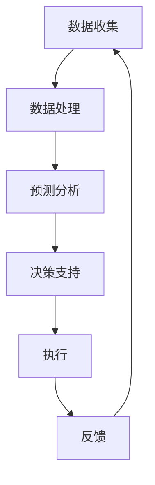

                 

关键词：科技创新、社会治理、人工智能、可持续发展、未来展望

> 摘要：本文旨在探讨科技创新在社会治理中的重要作用，分析人工智能技术的应用及其对可持续发展的影响，并展望未来社会治理的发展趋势与挑战。

## 1. 背景介绍

随着科技的快速发展，人工智能、大数据、物联网等新兴技术已经逐渐融入到了我们生活的方方面面。这些技术的出现不仅改变了我们的生活方式，也对社会治理提出了新的要求和挑战。传统的治理模式已经无法满足现代社会快速变化的需求，科技创新成为了社会治理的新思路。

### 1.1 科技对社会治理的影响

科技创新对社会治理的影响主要体现在以下几个方面：

- **提升效率**：科技创新可以自动化、智能化地处理大量的数据和信息，提高政府决策的准确性和效率。
- **优化服务**：通过大数据分析，可以更精准地了解民众的需求，提供个性化的公共服务。
- **增强监管**：人工智能可以用于监控公共安全、环境保护等领域，提升监管能力。

### 1.2 社会治理面临的挑战

- **数据安全**：随着数据规模的扩大，数据安全问题日益突出。
- **隐私保护**：如何在收集、处理数据的同时保护个人隐私，是社会治理的重要课题。
- **技术依赖**：过度依赖技术可能导致社会治理的失控。

## 2. 核心概念与联系

### 2.1 人工智能与社会治理

人工智能（AI）是科技创新的重要方向，其在社会治理中的应用正在不断拓展。以下是人工智能与社会治理之间的一些核心概念和联系：

- **预测分析**：利用机器学习算法，可以预测犯罪趋势、自然灾害等，帮助政府提前采取措施。
- **智能决策**：通过数据挖掘和模式识别，支持政府决策，提高决策的科学性和有效性。
- **智能服务**：通过语音识别、自然语言处理等技术，提供更加智能化的公共服务。

### 2.2 Mermaid 流程图

下面是一个简化的 Mermaid 流程图，展示人工智能在社会治理中的应用流程：



## 3. 核心算法原理 & 具体操作步骤

### 3.1 算法原理概述

人工智能在社会治理中的应用主要依赖于以下几种核心算法：

- **机器学习**：通过训练模型，让计算机自动学习并预测数据中的模式。
- **深度学习**：一种特殊的机器学习算法，通过多层神经网络模拟人类大脑的思维方式。
- **自然语言处理**：使计算机能够理解、生成和处理人类语言。

### 3.2 算法步骤详解

- **数据收集**：从各种渠道收集相关的数据，如社会治安数据、天气数据等。
- **数据处理**：对收集到的数据进行清洗、去噪、归一化等处理，以便于后续分析。
- **模型训练**：利用处理后的数据，训练机器学习模型，如回归模型、分类模型等。
- **模型评估**：通过交叉验证等方法，评估模型的性能，如准确率、召回率等。
- **模型应用**：将训练好的模型应用于实际场景，如预测犯罪趋势、提供决策支持等。

### 3.3 算法优缺点

**优点**：

- **高效性**：算法可以快速处理大量数据，提高决策效率。
- **准确性**：通过机器学习和深度学习，模型可以自动优化，提高预测准确性。
- **智能化**：算法可以根据数据动态调整，实现智能化的决策支持。

**缺点**：

- **数据依赖**：算法的性能很大程度上依赖于数据的质量和数量。
- **隐私问题**：在处理个人数据时，需要严格保护个人隐私。
- **技术门槛**：算法开发和应用需要一定的技术基础，对技术人员的专业要求较高。

### 3.4 算法应用领域

人工智能算法在多个领域有着广泛的应用，如：

- **公共安全**：通过预测犯罪趋势，提前部署警力，提高公共安全保障。
- **城市管理**：通过分析交通数据，优化交通信号灯，缓解交通拥堵。
- **环境保护**：通过监测空气质量、水质等数据，预警环境污染，保护生态环境。

## 4. 数学模型和公式

### 4.1 数学模型构建

在社会治理中，常用的数学模型包括：

- **线性回归模型**：用于预测数值型变量，如人口增长率、犯罪率等。
- **逻辑回归模型**：用于预测概率型变量，如是否发生犯罪等。

### 4.2 公式推导过程

以线性回归模型为例，其基本公式为：

$$
Y = \beta_0 + \beta_1X + \epsilon
$$

其中，\(Y\) 为因变量，\(X\) 为自变量，\(\beta_0\) 和 \(\beta_1\) 为模型参数，\(\epsilon\) 为误差项。

### 4.3 案例分析与讲解

以某城市的犯罪预测为例，使用线性回归模型预测下一年的犯罪率。

- **数据收集**：收集过去几年的犯罪数据。
- **数据处理**：对数据进行清洗和归一化处理。
- **模型训练**：使用训练集数据，训练线性回归模型。
- **模型评估**：使用验证集数据，评估模型性能。
- **模型应用**：使用测试集数据，预测下一年的犯罪率。

## 5. 项目实践

### 5.1 开发环境搭建

- **软件环境**：Python 3.8、NumPy、Pandas、Scikit-learn等。
- **硬件环境**：普通的笔记本电脑即可。

### 5.2 源代码详细实现

以下是一个简单的线性回归模型实现：

```python
import numpy as np
import pandas as pd
from sklearn.linear_model import LinearRegression

# 数据收集
data = pd.read_csv('crime_data.csv')

# 数据处理
X = data[['year', 'population']]
y = data['crime_rate']
X = (X - X.mean()) / X.std()

# 模型训练
model = LinearRegression()
model.fit(X, y)

# 模型评估
score = model.score(X, y)
print(f'Model accuracy: {score:.2f}')

# 模型应用
next_year = (np.array([next_year_data]) - X.mean()) / X.std()
predicted_rate = model.predict(next_year)
print(f'Predicted crime rate: {predicted_rate[0]:.2f}')
```

### 5.3 代码解读与分析

这段代码首先导入了必要的库，然后从CSV文件中读取犯罪数据。接着，对数据进行预处理，包括归一化处理。随后，使用Scikit-learn库中的线性回归模型进行训练和评估。最后，使用训练好的模型预测下一年的犯罪率。

## 6. 实际应用场景

### 6.1 公共安全

通过人工智能技术，可以实时监控城市的安全情况，预测犯罪热点区域，提前部署警力，提高公共安全保障。

### 6.2 城市管理

利用大数据分析，可以优化交通信号灯，缓解交通拥堵，提高城市运行效率。

### 6.3 环境保护

通过监测空气质量、水质等数据，可以预警环境污染，及时采取措施，保护生态环境。

## 7. 工具和资源推荐

### 7.1 学习资源推荐

- 《机器学习实战》
- 《深度学习》
- 《Python数据分析》

### 7.2 开发工具推荐

- Jupyter Notebook
- PyCharm

### 7.3 相关论文推荐

- "Deep Learning for Crime Prediction"
- "Urban Computing: Principles, Methods, and Systems"
- "Big Data Analytics for Sustainable Environment"

## 8. 总结

### 8.1 研究成果总结

科技创新为社会治理带来了新的思路和方法，通过人工智能、大数据等技术的应用，可以显著提升社会治理的效率和质量。

### 8.2 未来发展趋势

随着科技的进一步发展，人工智能在社会治理中的应用将会更加深入和广泛，成为社会治理的重要工具。

### 8.3 面临的挑战

在应用人工智能技术进行社会治理的过程中，数据安全、隐私保护等问题仍然需要重点关注和解决。

### 8.4 研究展望

未来，我们需要进一步研究如何平衡技术创新与社会治理的需求，确保社会治理的可持续发展。

## 9. 附录

### 9.1 常见问题与解答

1. **如何保障数据安全？**
   - 采用加密技术，确保数据在传输和存储过程中的安全。
   - 建立严格的数据管理制度，防止数据泄露和滥用。

2. **如何保护个人隐私？**
   - 在数据处理过程中，尽量减少对个人隐私信息的收集和使用。
   - 建立隐私保护机制，如差分隐私等，确保个人隐私不被泄露。

### 9.2 参考文献

- Goodfellow, I., Bengio, Y., & Courville, A. (2016). *Deep Learning*.
- Russell, S., & Norvig, P. (2010). *Artificial Intelligence: A Modern Approach*.
- Mitchell, T. M. (1997). *Machine Learning*.

## 10. 作者署名

> 作者：禅与计算机程序设计艺术 / Zen and the Art of Computer Programming

以上就是本文的完整内容。希望通过这篇文章，能够让大家对社会治理中的科技创新有更深入的了解。未来，随着科技的不断进步，我们相信社会治理将变得更加智能化、高效化。

