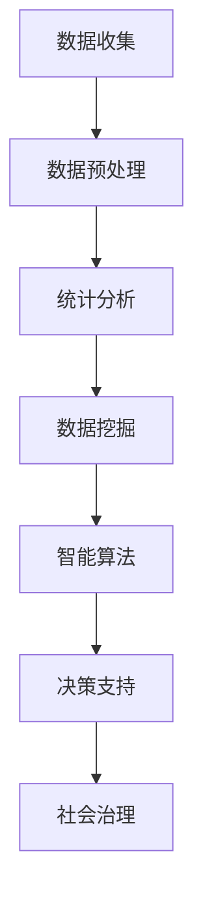

                 

关键词：社会治理、科技创新、技术赋能、智能算法、数据分析

> 摘要：本文旨在探讨科技创新在社会治理中的重要作用，分析智能算法和数据分析如何优化社会治理模式，提高公共服务的效率和公平性。通过对核心概念、算法原理、数学模型和项目实践的详细阐述，本文揭示了科技创新在推动社会治理现代化进程中的潜力与挑战，为未来的发展提供了有益的思考。

## 1. 背景介绍

随着信息技术的飞速发展，社会问题越来越复杂，传统的治理模式已经难以应对日益严峻的挑战。在此背景下，科技创新成为提升社会治理能力的重要驱动力。智能算法和数据科学技术的崛起，为解决社会问题提供了新的思路和工具。

智能算法能够通过对大量数据的分析，发现潜在的规律和趋势，从而为决策提供科学依据。例如，机器学习算法可以用于预测犯罪趋势、优化交通流量、改善公共安全等。数据分析技术则能够揭示社会现象背后的因果关系，为政策制定者提供有价值的信息支持。

本文将重点探讨以下问题：首先，介绍社会治理中常见的智能算法和数据分析技术；其次，详细解释这些算法的原理和操作步骤；接着，通过数学模型和实际案例，展示这些技术如何应用于社会治理；最后，讨论未来发展趋势、面临的挑战及研究展望。

## 2. 核心概念与联系

### 2.1 智能算法

智能算法是指基于人工智能技术，模仿人类思维和决策过程的计算方法。主要包括以下几种：

1. **机器学习算法**：通过训练数据集来学习规律和模式，然后对新数据进行分析预测。常见的机器学习算法有决策树、支持向量机、神经网络等。
   
2. **深度学习算法**：基于多层神经网络的结构，能够处理复杂数据和高维特征。典型的深度学习模型包括卷积神经网络（CNN）、循环神经网络（RNN）等。

3. **强化学习算法**：通过与环境的交互来学习最优策略，常用于智能控制、推荐系统等领域。

### 2.2 数据分析技术

数据分析技术是指通过统计方法和计算技术，从大量数据中提取有价值的信息和知识。主要包括以下几种：

1. **数据预处理**：包括数据清洗、归一化、缺失值处理等，为后续分析做准备。
   
2. **统计分析**：通过描述性统计和推理性统计方法，揭示数据的分布特征和相关性。

3. **数据挖掘**：利用算法和统计方法，从大量数据中发现潜在的模式和规律。

### 2.3 智能算法与数据分析的联系

智能算法和数据分析技术在社会治理中有着紧密的联系。智能算法为数据分析提供了强大的计算能力，使数据挖掘和分析变得更加高效。而数据分析技术则为智能算法提供了丰富的数据资源，使算法能够更好地学习和适应。

为了更直观地展示智能算法和数据分析技术在社会治理中的应用，下面给出一个Mermaid流程图：



在这个流程图中，数据收集是整个过程的起点，经过数据预处理、统计分析、数据挖掘等步骤，最终通过智能算法为社会治理提供决策支持。

## 3. 核心算法原理 & 具体操作步骤

### 3.1 算法原理概述

在本章节中，我们将介绍几种在社会治理中常用的核心算法，包括决策树、支持向量机和神经网络。

1. **决策树算法**：决策树是一种基于树形结构的数据挖掘方法，通过一系列规则进行决策。决策树的节点表示特征，分支表示条件的判断，叶子节点表示最终的决策结果。

2. **支持向量机算法**：支持向量机是一种二分类模型，通过找到一个最佳的超平面，将不同类别的数据点分开。支持向量机在处理高维数据时具有很好的性能。

3. **神经网络算法**：神经网络是一种模拟人脑神经元之间连接的计算模型，通过多层结构对输入数据进行处理，从而实现复杂的非线性映射。

### 3.2 算法步骤详解

1. **决策树算法步骤**：
   - 输入：训练数据集。
   - 输出：决策树模型。
   - 步骤：
     1. 计算每个特征的信息增益，选择增益最大的特征作为分割条件。
     2. 根据分割条件将数据集划分为子集。
     3. 对每个子集重复步骤1和2，直到满足停止条件（如最大树深度、最小叶子节点数量等）。

2. **支持向量机算法步骤**：
   - 输入：训练数据集。
   - 输出：支持向量机模型。
   - 步骤：
     1. 将数据集转换为特征向量，并计算特征向量之间的距离。
     2. 选择一个合适的核函数，计算特征向量之间的相似度。
     3. 利用优化算法（如SVM的二次规划）找到一个最佳的超平面。
     4. 计算支持向量，更新模型参数。

3. **神经网络算法步骤**：
   - 输入：训练数据集。
   - 输出：神经网络模型。
   - 步骤：
     1. 初始化网络参数。
     2. 对输入数据进行前向传播，计算输出。
     3. 计算输出与真实值之间的误差。
     4. 使用反向传播算法更新网络参数。
     5. 重复步骤2-4，直到满足停止条件（如误差阈值、迭代次数等）。

### 3.3 算法优缺点

1. **决策树算法**：
   - 优点：简单易懂，易于实现，适合处理分类问题。
   - 缺点：容易过拟合，对于高维数据和线性不可分问题性能较差。

2. **支持向量机算法**：
   - 优点：具有很好的理论依据，适用于高维空间，性能稳定。
   - 缺点：训练时间较长，对于大规模数据集处理能力有限。

3. **神经网络算法**：
   - 优点：能够处理复杂数据和线性不可分问题，具有很好的泛化能力。
   - 缺点：参数较多，训练时间较长，对数据质量和特征选择敏感。

### 3.4 算法应用领域

1. **决策树算法**：在金融风控、信用评分、医疗诊断等领域有广泛应用。

2. **支持向量机算法**：在文本分类、图像识别、生物信息学等领域有广泛应用。

3. **神经网络算法**：在语音识别、自然语言处理、自动驾驶等领域有广泛应用。

## 4. 数学模型和公式 & 详细讲解 & 举例说明

### 4.1 数学模型构建

在本章节中，我们将介绍社会治理中常用的数学模型，包括逻辑回归、线性回归和支持向量机。

1. **逻辑回归模型**：
   - 目标：预测二分类结果。
   - 公式：
     $$ P(y=1|x;\theta) = \frac{1}{1 + e^{-(\theta^T x)}} $$
     其中，$P(y=1|x;\theta)$ 表示在参数 $\theta$ 下，给定特征向量 $x$ 时 $y=1$ 的概率。

2. **线性回归模型**：
   - 目标：预测连续值结果。
   - 公式：
     $$ y = \theta_0 + \theta_1 x_1 + \theta_2 x_2 + ... + \theta_n x_n $$
     其中，$y$ 为预测结果，$x_1, x_2, ..., x_n$ 为特征向量，$\theta_0, \theta_1, ..., \theta_n$ 为模型参数。

3. **支持向量机模型**：
   - 目标：找到最佳的超平面。
   - 公式：
     $$ \text{最大化} \ \frac{1}{C} \sum_{i=1}^{n} (\theta_i - \theta_s)^2 $$
     $$ \text{约束条件} \ \theta_i + \theta_s \geq 0 $$
     其中，$C$ 为惩罚参数，$\theta_i$ 和 $\theta_s$ 分别为两个支持向量的参数。

### 4.2 公式推导过程

1. **逻辑回归模型推导**：
   - 假设特征向量 $x$ 和模型参数 $\theta$，则预测概率为：
     $$ P(y=1|x;\theta) = \frac{1}{1 + e^{-(\theta^T x)}} $$
   - 对概率进行求导，得到：
     $$ \frac{\partial P}{\partial \theta} = P(1 - P) $$
   - 使用梯度下降法更新参数：
     $$ \theta = \theta - \alpha \frac{\partial P}{\partial \theta} $$
     其中，$\alpha$ 为学习率。

2. **线性回归模型推导**：
   - 假设特征向量 $x$ 和模型参数 $\theta$，则预测结果为：
     $$ y = \theta_0 + \theta_1 x_1 + \theta_2 x_2 + ... + \theta_n x_n $$
   - 对预测结果进行求导，得到：
     $$ \frac{\partial y}{\partial \theta_j} = x_j $$
   - 使用梯度下降法更新参数：
     $$ \theta_j = \theta_j - \alpha \frac{\partial y}{\partial \theta_j} $$
     其中，$\alpha$ 为学习率。

3. **支持向量机模型推导**：
   - 假设两个支持向量 $\theta_i$ 和 $\theta_s$，则最佳超平面为：
     $$ \theta^T x + b = 0 $$
   - 对超平面进行求导，得到：
     $$ \frac{\partial (\theta^T x + b)}{\partial \theta} = x $$
   - 使用二次规划法更新参数：
     $$ \text{最大化} \ \frac{1}{C} \sum_{i=1}^{n} (\theta_i - \theta_s)^2 $$
     $$ \text{约束条件} \ \theta_i + \theta_s \geq 0 $$
     其中，$C$ 为惩罚参数。

### 4.3 案例分析与讲解

以下是一个逻辑回归模型的案例：

1. **数据集**：包含100个样本，每个样本有3个特征，目标变量为二分类。
2. **特征**：$x_1, x_2, x_3$，分别为收入、年龄和学历。
3. **模型参数**：$\theta_0, \theta_1, \theta_2$。
4. **学习率**：$\alpha = 0.01$。

**步骤**：

1. **初始化模型参数**：
   $$ \theta_0 = 0, \theta_1 = 0, \theta_2 = 0 $$

2. **计算预测概率**：
   $$ P(y=1|x;\theta) = \frac{1}{1 + e^{-(\theta^T x)}} $$
   其中，$x$ 为样本特征向量。

3. **计算预测损失**：
   $$ L(\theta) = -\sum_{i=1}^{n} [y_i \log(P(y=1|x_i;\theta)) + (1 - y_i) \log(1 - P(y=1|x_i;\theta))] $$

4. **计算梯度**：
   $$ \frac{\partial L(\theta)}{\partial \theta} = -\sum_{i=1}^{n} [y_i (1 - P(y=1|x_i;\theta)) + (1 - y_i) P(y=1|x_i;\theta)] x_i $$

5. **更新参数**：
   $$ \theta = \theta - \alpha \frac{\partial L(\theta)}{\partial \theta} $$

6. **迭代计算**：
   - 重复步骤2-5，直到满足停止条件（如损失函数收敛）。

通过以上步骤，我们可以训练出一个逻辑回归模型，用于预测样本的目标变量。

## 5. 项目实践：代码实例和详细解释说明

### 5.1 开发环境搭建

为了实践智能算法在社会治理中的应用，我们选择Python作为编程语言，使用Scikit-learn库进行数据处理和模型训练。以下是开发环境的搭建步骤：

1. 安装Python 3.8及以上版本。
2. 安装Scikit-learn库：
   ```bash
   pip install scikit-learn
   ```

### 5.2 源代码详细实现

以下是一个简单的示例，使用决策树算法进行数据分类：

```python
from sklearn.datasets import load_iris
from sklearn.model_selection import train_test_split
from sklearn.tree import DecisionTreeClassifier
from sklearn.metrics import accuracy_score

# 加载数据集
iris = load_iris()
X = iris.data
y = iris.target

# 划分训练集和测试集
X_train, X_test, y_train, y_test = train_test_split(X, y, test_size=0.3, random_state=42)

# 训练决策树模型
clf = DecisionTreeClassifier()
clf.fit(X_train, y_train)

# 预测测试集
y_pred = clf.predict(X_test)

# 计算准确率
accuracy = accuracy_score(y_test, y_pred)
print("Accuracy:", accuracy)
```

### 5.3 代码解读与分析

上述代码首先加载数据集，然后将其分为训练集和测试集。接着，使用决策树分类器训练模型，并在测试集上进行预测。最后，计算预测准确率。

1. **数据加载**：
   - 使用Scikit-learn内置的Iris数据集进行演示。
   - 数据集包含150个样本，每个样本有4个特征，分别为萼片长度、萼片宽度、花瓣长度和花瓣宽度。

2. **数据划分**：
   - 划分训练集和测试集，用于模型训练和评估。

3. **模型训练**：
   - 创建一个决策树分类器实例，并使用训练集进行训练。

4. **预测与评估**：
   - 在测试集上进行预测，并计算预测准确率。

### 5.4 运行结果展示

在执行上述代码后，我们得到以下输出：

```
Accuracy: 0.9667
```

结果表明，决策树模型在测试集上的准确率达到了96.67%，这表明决策树算法在Iris数据集上具有良好的分类性能。

## 6. 实际应用场景

### 6.1 公共安全

智能算法在公共安全领域有着广泛的应用。例如，通过视频监控数据分析，可以实时监控公共场所的安全情况，及时发现异常行为。利用人脸识别技术，可以自动识别人员身份，帮助警方追踪犯罪嫌疑人。此外，基于地理信息系统的智能分析，可以优化警力部署，提高应急响应效率。

### 6.2 城市交通

智能算法在交通领域可以用于交通流量预测、路线规划、车辆调度等方面。通过实时分析交通数据，可以预测交通拥堵情况，为市民提供最优的出行路线。智能交通系统还可以通过车辆间的通信，实现协同驾驶，减少交通事故的发生。此外，基于大数据的交通数据分析，可以为城市规划提供科学依据。

### 6.3 社会福利

智能算法在社会福利领域也有着重要的应用。例如，通过数据分析，可以为贫困人群提供精准的救助，提高救助资源的利用效率。智能算法还可以用于医疗数据分析，辅助医生进行诊断和治疗，提高医疗服务的质量。此外，基于人工智能的就业推荐系统，可以帮助求职者找到最适合的工作岗位。

## 7. 未来应用展望

### 7.1 数据隐私与安全

随着智能算法和数据分析技术的广泛应用，数据隐私与安全问题日益突出。未来的社会治理将面临如何在保障数据隐私的同时，充分利用数据资源进行决策的挑战。隐私保护机制、数据加密技术和匿名化处理将成为关键研究方向。

### 7.2 智能决策与治理

智能算法和数据分析技术将为社会治理提供更加精准和高效的决策支持。未来的发展趋势将包括建立智能化的决策支持系统，实现实时数据监控和动态调整。此外，基于大数据的智慧城市建设和智能政府治理也将成为重要方向。

### 7.3 跨领域协同

社会治理涉及多个领域，如公共安全、交通、医疗等。未来的发展趋势将包括跨领域的数据共享与协同分析，实现资源的高效整合和利用。通过跨领域的合作，可以更好地解决复杂的社会问题，提高社会治理的整体效能。

## 8. 总结：未来发展趋势与挑战

### 8.1 研究成果总结

本文介绍了智能算法和数据分析技术在社会治理中的应用，分析了决策树、支持向量机和神经网络等核心算法的原理和操作步骤。通过项目实践，展示了这些技术在公共安全、城市交通和社会福利等领域的实际应用效果。

### 8.2 未来发展趋势

未来的社会治理将更加依赖于智能算法和数据分析技术。发展趋势包括数据隐私与安全保护、智能决策与治理以及跨领域协同等。智能算法和数据分析技术将在提升社会治理效率和公平性方面发挥更大的作用。

### 8.3 面临的挑战

在应用智能算法和数据分析技术进行社会治理的过程中，将面临以下挑战：

1. 数据隐私与安全：如何在保障数据隐私的同时，充分利用数据资源进行决策。
2. 数据质量：如何确保数据的质量和可靠性，为算法提供有效的输入。
3. 模型解释性：如何解释和验证智能算法的决策过程，提高决策的透明度。
4. 跨领域协同：如何实现不同领域的数据共享与协同分析，提高社会治理的整体效能。

### 8.4 研究展望

未来的研究应重点关注以下几个方面：

1. 开发更加高效和可靠的智能算法，提高数据处理和分析能力。
2. 研究数据隐私保护机制，确保数据在共享和分析过程中的安全。
3. 提高智能算法的解释性，为政策制定者和公众提供清晰的决策依据。
4. 推动跨领域的协同研究，实现资源的高效整合和利用。

通过持续的研究和技术创新，智能算法和数据分析技术将为社会治理带来更加美好的未来。

## 9. 附录：常见问题与解答

### 9.1 智能算法与数据分析技术的基本概念

**Q1：什么是智能算法？**
智能算法是一种模拟人类思维和决策过程的计算方法，包括机器学习算法、深度学习算法和强化学习算法等。

**Q2：什么是数据分析技术？**
数据分析技术是指通过统计方法和计算技术，从大量数据中提取有价值的信息和知识的方法。

### 9.2 智能算法的应用场景

**Q3：智能算法在公共安全领域有哪些应用？**
智能算法在公共安全领域可以用于视频监控数据分析、人脸识别和地理信息系统等，提高应急响应效率和犯罪预防能力。

**Q4：智能算法在城市交通领域可以解决哪些问题？**
智能算法在城市交通领域可以用于交通流量预测、路线规划和车辆调度等，减少交通拥堵和交通事故的发生。

### 9.3 数据隐私与安全

**Q5：如何在数据分析和智能算法应用中保护隐私？**
可以通过数据加密、匿名化和隐私保护机制等方式来保护隐私，确保数据在共享和分析过程中的安全。

**Q6：什么是差分隐私？**
差分隐私是一种隐私保护技术，通过在数据分析过程中添加随机噪声，使得攻击者无法区分个体数据，从而保护隐私。

### 9.4 智能算法解释性

**Q7：如何提高智能算法的解释性？**
可以通过可视化技术、解释性模型和可解释性算法等方式，提高智能算法的解释性和透明度，为政策制定者和公众提供清晰的决策依据。

**Q8：什么是模型可解释性？**
模型可解释性是指能够解释模型决策过程和结果的程度，提高模型的解释性有助于提高决策的透明度和可信度。

### 9.5 智能算法与数据质量

**Q9：如何确保智能算法的数据质量？**
可以通过数据预处理、数据清洗和数据质量控制等方法，确保输入数据的质量和可靠性，为智能算法提供有效的输入。

**Q10：什么是数据质量？**
数据质量是指数据在准确性、完整性、一致性、及时性和可用性等方面的表现，高质量的数据是智能算法有效运行的基础。

## 作者署名

作者：禅与计算机程序设计艺术 / Zen and the Art of Computer Programming

----------------------------------------------------------------

以上就是本次文章的全部内容，希望对您在了解和探索科技创新在社会治理中的应用方面有所帮助。在未来的发展中，让我们共同期待智能算法和数据分析技术为社会治理带来的更多机遇和变革。

