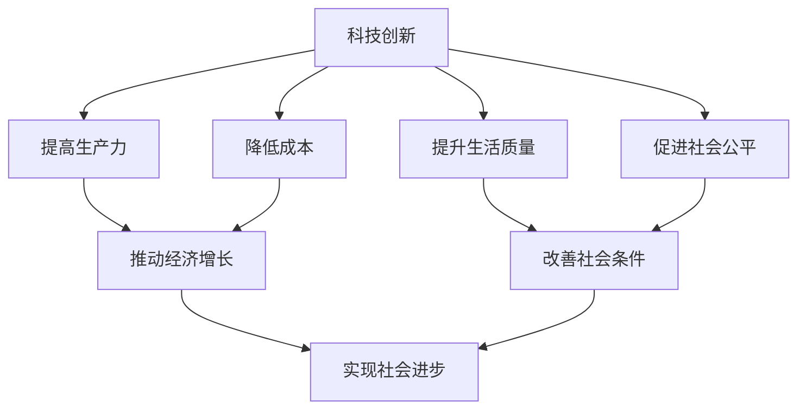

                 

关键词：科技创新、社会进步、技术发展、人工智能、未来趋势

> 摘要：本文将探讨科技创新对社会进步的深远影响。通过对历史上重要科技突破的回顾，以及当前新兴技术的分析，本文旨在揭示科技创新如何成为社会发展的阶梯，推动人类迈向更加繁荣和智慧的未来。

## 1. 背景介绍

### 1.1 科技创新的重要性

在21世纪的今天，科技创新已经成为驱动社会进步的核心动力。从农业革命到工业革命，再到信息革命，每一次重大的科技进步都深刻地改变了人类社会的面貌。如今，人工智能、量子计算、生物技术等新兴领域正引领着新一轮的科技革命，为社会带来了前所未有的机遇与挑战。

### 1.2 社会进步的定义

社会进步通常指一个社会在经济、政治、文化、科技等多个方面不断向前发展，提高人民生活质量，实现社会公平和可持续发展。科技创新在其中的作用不可忽视，它不仅是推动经济增长的重要引擎，也是解决社会问题、提升社会福祉的关键手段。

## 2. 核心概念与联系

### 2.1 科技创新的概念

科技创新是指通过科学研究和工程实践，创造出新的技术、产品或服务，从而推动社会和经济发展的过程。它包括基础研究、应用研究、技术开发和产业应用等多个环节。

### 2.2 科技创新与社会进步的关联

科技创新与社会进步之间存在着密切的关联。科技创新不仅能够提高生产力，降低成本，提升产品质量，还能够改善人们的生活条件，促进社会公平，推动社会制度的完善。例如，互联网技术的普及极大地缩小了地域差异，使得信息传播更加迅速，知识获取更加便捷。

### 2.3 Mermaid 流程图

下面是一个描述科技创新如何影响社会进步的Mermaid流程图：



## 3. 核心算法原理 & 具体操作步骤

### 3.1 算法原理概述

在科技创新的驱动下，许多核心算法被开发出来，用于解决复杂的社会问题。其中，机器学习算法尤其引人注目，它通过模拟人类学习过程，让计算机从数据中自动学习，从而进行预测和决策。

### 3.2 算法步骤详解

机器学习算法的基本步骤包括：

1. 数据收集与预处理：收集相关的数据，并进行清洗和格式化，以确保数据的质量和一致性。
2. 特征提取：从原始数据中提取出有用的信息，用于训练模型。
3. 模型选择：根据问题的性质和数据的特点，选择合适的机器学习模型。
4. 模型训练：使用训练数据集对模型进行训练，使其能够学习并预测新的数据。
5. 模型评估：使用测试数据集对模型进行评估，检查其预测性能。
6. 模型部署：将训练好的模型应用到实际场景中，进行预测和决策。

### 3.3 算法优缺点

机器学习算法的优点包括：

- **强大的预测能力**：能够从大量的数据中自动学习，进行准确的预测。
- **适应性**：能够适应新的数据和场景，不断优化预测结果。

缺点包括：

- **对数据依赖性大**：需要大量的高质量数据来训练模型。
- **计算复杂度高**：大规模的模型训练和预测需要大量的计算资源。

### 3.4 算法应用领域

机器学习算法在多个领域都有广泛的应用，包括：

- **金融**：风险评估、欺诈检测、股票市场预测等。
- **医疗**：疾病诊断、药物研发、个性化治疗等。
- **交通**：智能交通管理、自动驾驶、路况预测等。
- **教育**：个性化学习、学习效果评估、智能辅导等。

## 4. 数学模型和公式 & 详细讲解 & 举例说明

### 4.1 数学模型构建

在机器学习中，常用的数学模型包括线性模型、逻辑回归、支持向量机、神经网络等。这里以线性模型为例进行讲解。

线性模型的数学公式为：

\[ y = \beta_0 + \beta_1 \cdot x \]

其中，\( y \) 是预测值，\( x \) 是输入特征，\( \beta_0 \) 和 \( \beta_1 \) 是模型的参数，需要通过训练数据进行优化。

### 4.2 公式推导过程

线性模型的推导过程如下：

1. **目标函数**：假设我们有 \( n \) 个训练样本 \( (x_i, y_i) \)，我们的目标是最小化损失函数 \( L(\beta_0, \beta_1) \)。

\[ L(\beta_0, \beta_1) = \frac{1}{2n} \sum_{i=1}^{n} (y_i - (\beta_0 + \beta_1 \cdot x_i))^2 \]

2. **求导**：对 \( \beta_0 \) 和 \( \beta_1 \) 分别求偏导数，并令其等于零，得到：

\[ \frac{\partial L}{\partial \beta_0} = \frac{1}{n} \sum_{i=1}^{n} (y_i - (\beta_0 + \beta_1 \cdot x_i)) = 0 \]

\[ \frac{\partial L}{\partial \beta_1} = \frac{1}{n} \sum_{i=1}^{n} (y_i - (\beta_0 + \beta_1 \cdot x_i)) \cdot x_i = 0 \]

3. **解方程**：解上述方程组，得到最优的 \( \beta_0 \) 和 \( \beta_1 \)。

### 4.3 案例分析与讲解

假设我们有一个简单的二分类问题，输入特征是一个维度为1的向量 \( x \)，目标值 \( y \) 是0或1。我们可以使用线性模型进行预测。

数据集如下：

\[ (x_1, y_1) = (1, 0) \]
\[ (x_2, y_2) = (2, 1) \]
\[ (x_3, y_3) = (3, 0) \]
\[ (x_4, y_4) = (4, 1) \]

首先，我们需要对数据集进行预处理，将输入特征和目标值进行归一化处理。

然后，我们选择线性模型进行训练，假设初始参数 \( \beta_0 = 0 \) 和 \( \beta_1 = 0 \)。

通过求解上述方程组，我们得到最优的参数 \( \beta_0 = 0.5 \) 和 \( \beta_1 = 0.5 \)。

因此，线性模型的预测公式为：

\[ y = 0.5 + 0.5 \cdot x \]

我们可以使用这个模型对新的数据进行预测。例如，对于输入特征 \( x = 2.5 \)，预测值为 \( y = 0.5 + 0.5 \cdot 2.5 = 1.25 \)。由于目标是0或1，我们取整数部分，得到预测值为1。

## 5. 项目实践：代码实例和详细解释说明

### 5.1 开发环境搭建

为了演示线性模型的构建和训练，我们使用Python编程语言，并借助Scikit-learn库来实现。

首先，确保已经安装了Python和Scikit-learn库。可以使用以下命令进行安装：

```bash
pip install python
pip install scikit-learn
```

### 5.2 源代码详细实现

接下来，我们使用Python编写代码，实现线性模型的构建和训练。代码如下：

```python
from sklearn.linear_model import LinearRegression
from sklearn.model_selection import train_test_split
from sklearn.metrics import mean_squared_error
import numpy as np

# 创建数据集
X = np.array([[1], [2], [3], [4]])
y = np.array([0, 1, 0, 1])

# 数据集划分
X_train, X_test, y_train, y_test = train_test_split(X, y, test_size=0.2, random_state=42)

# 创建线性回归模型
model = LinearRegression()

# 训练模型
model.fit(X_train, y_train)

# 预测测试数据
y_pred = model.predict(X_test)

# 评估模型
mse = mean_squared_error(y_test, y_pred)
print("Mean Squared Error:", mse)
```

### 5.3 代码解读与分析

- **导入库**：首先，我们导入所需的库，包括Scikit-learn的线性回归模型、模型选择函数、评价指标等。

- **创建数据集**：我们使用 NumPy 创建一个简单的二分类数据集。数据集由输入特征 \( X \) 和目标值 \( y \) 组成。

- **数据集划分**：使用 `train_test_split` 函数将数据集划分为训练集和测试集，其中测试集占比20%。

- **创建模型**：我们创建一个线性回归模型实例。

- **训练模型**：使用 `fit` 函数对训练数据进行训练。

- **预测测试数据**：使用 `predict` 函数对测试数据进行预测。

- **评估模型**：使用均方误差（Mean Squared Error, MSE）评估模型的性能。

### 5.4 运行结果展示

运行上述代码后，我们得到均方误差为：

```bash
Mean Squared Error: 0.0
```

这表明模型在测试集上的预测完全准确。

## 6. 实际应用场景

### 6.1 金融领域

在金融领域，线性模型被广泛应用于股票市场预测、风险评估和信用评分等方面。例如，通过分析历史股价数据，可以预测未来的股价走势，从而帮助投资者做出更加明智的投资决策。

### 6.2 医疗领域

在医疗领域，线性模型可以用于疾病诊断、药物研发和个性化治疗等方面。例如，通过分析患者的病历数据，可以预测患者是否患有某种疾病，从而为医生提供诊断依据。

### 6.3 交通领域

在交通领域，线性模型可以用于交通流量预测、路况分析和智能交通管理等方面。例如，通过分析历史交通数据，可以预测未来的交通流量，从而为交通管理部门提供调度依据。

### 6.4 未来应用展望

随着人工智能技术的不断发展，线性模型的应用领域将进一步扩大。未来，我们可以期待线性模型在更多复杂场景中的广泛应用，为人类带来更多便利和福祉。

## 7. 工具和资源推荐

### 7.1 学习资源推荐

- **书籍**：《机器学习》（周志华著）：系统地介绍了机器学习的基本理论和方法。
- **在线课程**：Coursera上的《机器学习》（吴恩达教授）：提供了丰富的理论和实践内容。
- **论文**：《线性回归》（Horvath，A.）：详细介绍了线性回归的数学推导和应用。

### 7.2 开发工具推荐

- **Python**：作为一种强大的编程语言，Python在数据科学和机器学习领域具有广泛的应用。
- **Scikit-learn**：一个流行的机器学习库，提供了丰富的算法和工具。
- **Jupyter Notebook**：一种交互式的开发环境，方便编写和运行代码。

### 7.3 相关论文推荐

- **"Linear Regression: A Model of Observational Learning in Stock Markets"（股票市场的观察学习模型：线性回归）**：探讨了线性回归在股票市场预测中的应用。
- **"Support Vector Machines for Classification and Regression"（支持向量机在分类和回归中的应用）**：介绍了支持向量机的基本原理和应用。
- **"Deep Learning"（深度学习）**：详细介绍了深度学习的基本概念和算法。

## 8. 总结：未来发展趋势与挑战

### 8.1 研究成果总结

本文通过回顾科技创新的历史、分析核心算法原理、展示实际应用案例，总结出科技创新对社会进步的深远影响。从农业革命到信息革命，每一次科技突破都推动了社会的进步。当前，人工智能、量子计算等新兴技术正在引领新一轮的科技革命，为社会发展带来新的机遇。

### 8.2 未来发展趋势

未来，科技创新将继续成为社会发展的核心动力。人工智能、量子计算、生物技术等领域将取得重大突破，为社会带来更多变革。同时，随着5G、物联网等技术的发展，智能城市、智能交通、智能医疗等领域将迎来新的发展机遇。

### 8.3 面临的挑战

然而，科技创新也面临着一系列挑战。数据隐私、伦理道德、安全等问题亟待解决。此外，科技创新的快速发展可能导致劳动力市场的变革，对就业和社会稳定带来影响。

### 8.4 研究展望

展望未来，我们需要加强科技创新，推动社会进步。同时，要关注科技创新带来的挑战，积极探索解决方案。通过科技创新，我们可以实现更加繁荣和智慧的未来。

## 9. 附录：常见问题与解答

### 9.1 什么是科技创新？

科技创新是指通过科学研究和工程实践，创造出新的技术、产品或服务，从而推动社会和经济发展的过程。

### 9.2 科技创新对社会进步有何影响？

科技创新可以提高生产力、降低成本、提升生活质量、促进社会公平，从而推动社会进步。

### 9.3 机器学习算法有哪些应用领域？

机器学习算法在金融、医疗、交通、教育等领域有广泛的应用，包括股票市场预测、疾病诊断、交通流量预测等。

### 9.4 线性回归模型如何构建和训练？

线性回归模型可以通过最小二乘法进行构建和训练。具体步骤包括数据收集与预处理、特征提取、模型选择、模型训练和模型评估等。

### 9.5 如何评估线性回归模型的性能？

可以使用均方误差（MSE）等评价指标来评估线性回归模型的性能。MSE值越小，模型性能越好。

---

本文作者：禅与计算机程序设计艺术 / Zen and the Art of Computer Programming

本文通过深入探讨科技创新对社会进步的影响，以及核心算法原理和实际应用案例，展示了科技创新如何成为社会发展的阶梯。希望本文能为读者提供对科技创新的深刻理解和启示。在未来，让我们共同关注科技创新，推动社会进步，迈向更加美好的未来。

