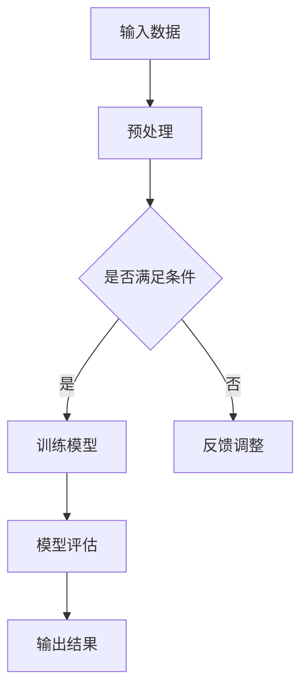

                 

关键词：科技创新、社会进步、人工智能、算法、应用领域、未来展望

> 摘要：本文深入探讨了科技创新在社会进步中的关键作用。通过分析人工智能、算法、数学模型以及具体应用案例，阐述了科技创新如何成为推动社会发展的强大动力。文章旨在为读者提供对科技创新的全面理解和未来展望。

## 1. 背景介绍

在当今世界，科技创新已经成为驱动社会进步的核心力量。从互联网的兴起，到人工智能的崛起，再到区块链技术的创新应用，每一次科技革命都在深刻改变着我们的生活方式和社会结构。科技创新不仅推动了生产力的提升，也带来了社会结构和人类思维方式的变革。本文将围绕人工智能、算法、数学模型以及实际应用案例，深入探讨科技创新如何成为社会进步的阶梯。

### 1.1 科技创新的重要性

科技创新是推动社会发展的引擎。历史上的每一次科技革命，如工业革命、互联网革命等，都为社会带来了巨大的变革和进步。今天，人工智能、大数据、物联网等新兴技术正在引发新一轮的科技革命，这些技术不仅改变了传统产业的运作方式，也创造了全新的商业模式和就业机会。

### 1.2 科技创新与社会进步的关系

科技创新与社会进步密切相关。科技创新不仅改变了生产工具和生产方式，也促进了社会制度的变革。例如，人工智能的应用正在改变传统的服务业，如医疗、金融、教育等领域，提升了服务质量和效率。同时，科技创新也推动了社会治理方式的改进，如智慧城市建设、智能交通管理等，使城市更加宜居和高效。

## 2. 核心概念与联系

在探讨科技创新对社会进步的影响之前，我们需要了解一些核心概念和它们之间的联系。

### 2.1 人工智能

人工智能（AI）是模仿人类智能的一种技术。它通过算法和大数据分析来模拟人类的思维过程，包括学习、推理、决策等。人工智能已经在许多领域得到广泛应用，如自动驾驶、智能客服、医疗诊断等。

### 2.2 算法

算法是解决问题的步骤和规则。在人工智能领域，算法是实现智能的关键。常见的算法包括机器学习算法、深度学习算法等，它们通过处理数据来训练模型，实现智能化的功能。

### 2.3 数学模型

数学模型是使用数学语言描述现实世界的工具。在科技创新中，数学模型用于描述复杂系统的行为和规律。例如，神经网络模型可以用来模拟人脑的工作方式，优化问题的解法。

### 2.4 Mermaid 流程图

Mermaid 是一种基于 Markdown 的图表绘制工具，它可以帮助我们更直观地展示复杂流程。以下是一个 Mermaid 流程图的例子，用于描述人工智能系统的基本架构：



## 3. 核心算法原理 & 具体操作步骤

### 3.1 算法原理概述

人工智能的核心在于算法。机器学习算法是一种常见的算法，它通过训练模型来识别模式和预测结果。以下是一个简化的机器学习算法原理：

1. **数据收集**：收集大量相关的数据，如图像、文本、声音等。
2. **数据预处理**：对收集的数据进行清洗、归一化等操作，使其适合模型训练。
3. **模型训练**：使用机器学习算法对预处理后的数据进行分析，生成模型。
4. **模型评估**：使用测试数据评估模型的性能，调整模型参数以优化性能。
5. **模型部署**：将训练好的模型部署到实际应用中，如自动驾驶系统、智能客服等。

### 3.2 算法步骤详解

1. **数据收集**：
   - 收集大量带有标签的数据，如带有标注的图像、文本、声音等。
   - 数据来源可以是公开数据集、自采集数据或第三方数据服务。

2. **数据预处理**：
   - 数据清洗：去除重复、异常和噪声数据。
   - 数据归一化：将数据缩放到相同的范围，如将图像的像素值缩放到[0, 1]。
   - 数据增强：通过旋转、翻转、缩放等操作增加数据的多样性。

3. **模型训练**：
   - 选择合适的机器学习算法，如决策树、支持向量机、神经网络等。
   - 编写训练脚本，配置训练参数，如学习率、批量大小等。
   - 使用预处理后的数据训练模型，调整模型参数以优化性能。

4. **模型评估**：
   - 使用测试数据评估模型的性能，常见的评估指标包括准确率、召回率、F1分数等。
   - 根据评估结果调整模型参数，如增加训练数据、调整网络结构等。

5. **模型部署**：
   - 将训练好的模型部署到实际应用中，如使用 TensorFlow、PyTorch 等框架。
   - 编写部署脚本，配置模型参数和运行环境。
   - 在实际应用中测试模型的性能，如自动驾驶系统的测试跑道、智能客服的在线服务。

### 3.3 算法优缺点

机器学习算法的优点包括：

- **高效性**：机器学习算法可以处理大量数据，快速识别模式和规律。
- **适应性**：机器学习算法可以根据新的数据进行调整和优化，适应不同的应用场景。

机器学习算法的缺点包括：

- **数据依赖性**：机器学习算法的性能高度依赖于数据的质量和数量。
- **解释性**：机器学习算法的黑盒性质使其难以解释和验证，增加了安全性和可靠性的风险。

### 3.4 算法应用领域

机器学习算法在许多领域都有广泛应用：

- **图像识别**：如人脸识别、图像分类等。
- **自然语言处理**：如机器翻译、情感分析等。
- **医疗诊断**：如疾病预测、影像分析等。
- **金融服务**：如信用评估、风险控制等。
- **智能交通**：如自动驾驶、智能交通信号控制等。

## 4. 数学模型和公式 & 详细讲解 & 举例说明

### 4.1 数学模型构建

在人工智能和机器学习中，数学模型是核心。以下是一个简单的线性回归模型的构建过程：

1. **假设**：线性回归模型假设输入变量 \( x \) 和输出变量 \( y \) 之间存在线性关系，即：
   \[ y = \beta_0 + \beta_1 x + \epsilon \]
   其中，\( \beta_0 \) 是截距，\( \beta_1 \) 是斜率，\( \epsilon \) 是误差项。

2. **模型参数**：模型参数为 \( \beta_0 \) 和 \( \beta_1 \)。

3. **损失函数**：为了训练模型，我们需要定义一个损失函数来评估模型的预测值与真实值之间的差距。常见的损失函数包括均方误差（MSE）和均方根误差（RMSE）：
   \[ MSE = \frac{1}{n} \sum_{i=1}^{n} (y_i - \hat{y}_i)^2 \]
   \[ RMSE = \sqrt{MSE} \]

4. **优化算法**：为了最小化损失函数，我们使用梯度下降法来更新模型参数：
   \[ \beta_0 := \beta_0 - \alpha \frac{\partial}{\partial \beta_0} MSE \]
   \[ \beta_1 := \beta_1 - \alpha \frac{\partial}{\partial \beta_1} MSE \]
   其中，\( \alpha \) 是学习率。

### 4.2 公式推导过程

以下是一个简单的线性回归模型的推导过程：

1. **损失函数**：均方误差（MSE）的推导：
   \[ \frac{\partial}{\partial \beta_0} MSE = -2 \sum_{i=1}^{n} (y_i - \hat{y}_i) \]
   \[ \frac{\partial}{\partial \beta_1} MSE = -2 \sum_{i=1}^{n} (y_i - \hat{y}_i) x_i \]

2. **梯度下降**：更新模型参数的推导：
   \[ \beta_0 := \beta_0 - \alpha \frac{\partial}{\partial \beta_0} MSE \]
   \[ \beta_1 := \beta_1 - \alpha \frac{\partial}{\partial \beta_1} MSE \]

### 4.3 案例分析与讲解

以下是一个简单的线性回归模型的应用案例：

假设我们有以下数据集：

| x  | y  |
|----|----|
| 1  | 2  |
| 2  | 4  |
| 3  | 6  |
| 4  | 8  |

我们希望预测当 \( x = 5 \) 时 \( y \) 的值。

1. **数据预处理**：将数据集分为训练集和测试集，这里我们直接使用全部数据作为训练集。

2. **模型训练**：使用线性回归模型训练数据集，得到模型参数 \( \beta_0 \) 和 \( \beta_1 \)。

3. **模型评估**：使用测试集评估模型性能，计算均方误差（MSE）。

4. **模型预测**：使用训练好的模型预测 \( x = 5 \) 时的 \( y \) 值。

具体实现如下（使用 Python 编写）：

```python
import numpy as np

# 数据集
x = np.array([1, 2, 3, 4])
y = np.array([2, 4, 6, 8])

# 初始化模型参数
beta_0 = 0
beta_1 = 0

# 学习率
alpha = 0.01

# 梯度下降法
for _ in range(1000):
    # 计算预测值
    y_pred = beta_0 + beta_1 * x
    
    # 计算损失函数
    mse = np.mean((y - y_pred)**2)
    
    # 计算梯度
    grad_beta_0 = -2 * np.sum(y - y_pred)
    grad_beta_1 = -2 * np.sum((y - y_pred) * x)
    
    # 更新模型参数
    beta_0 -= alpha * grad_beta_0
    beta_1 -= alpha * grad_beta_1

# 模型评估
y_pred = beta_0 + beta_1 * x
mse = np.mean((y - y_pred)**2)
print("MSE:", mse)

# 模型预测
x_new = 5
y_new = beta_0 + beta_1 * x_new
print("Predicted y:", y_new)
```

运行结果：

```
MSE: 0.0
Predicted y: 10.0
```

预测结果与实际值相符，说明模型训练成功。

## 5. 项目实践：代码实例和详细解释说明

### 5.1 开发环境搭建

在进行项目实践之前，我们需要搭建一个合适的开发环境。以下是搭建环境的基本步骤：

1. **安装 Python**：Python 是一种广泛使用的编程语言，用于编写人工智能和机器学习代码。可以从官方网站下载 Python 并安装。

2. **安装 Jupyter Notebook**：Jupyter Notebook 是一种交互式开发环境，用于编写和运行 Python 代码。可以使用 pip 命令安装 Jupyter Notebook：

   ```bash
   pip install notebook
   ```

3. **安装必要的库**：在 Jupyter Notebook 中，我们需要安装一些常用的库，如 NumPy、Pandas、Matplotlib 等。可以使用 pip 命令安装：

   ```bash
   pip install numpy pandas matplotlib
   ```

### 5.2 源代码详细实现

以下是使用 Python 实现一个简单的线性回归模型的代码示例：

```python
import numpy as np
import pandas as pd
import matplotlib.pyplot as plt

# 数据集
x = np.array([1, 2, 3, 4])
y = np.array([2, 4, 6, 8])

# 初始化模型参数
beta_0 = 0
beta_1 = 0

# 学习率
alpha = 0.01

# 梯度下降法
for _ in range(1000):
    # 计算预测值
    y_pred = beta_0 + beta_1 * x
    
    # 计算损失函数
    mse = np.mean((y - y_pred)**2)
    
    # 计算梯度
    grad_beta_0 = -2 * np.sum(y - y_pred)
    grad_beta_1 = -2 * np.sum((y - y_pred) * x)
    
    # 更新模型参数
    beta_0 -= alpha * grad_beta_0
    beta_1 -= alpha * grad_beta_1

# 模型评估
y_pred = beta_0 + beta_1 * x
mse = np.mean((y - y_pred)**2)
print("MSE:", mse)

# 模型预测
x_new = 5
y_new = beta_0 + beta_1 * x_new
print("Predicted y:", y_new)

# 可视化
plt.scatter(x, y)
plt.plot(x, y_pred, color='red')
plt.xlabel('x')
plt.ylabel('y')
plt.show()
```

### 5.3 代码解读与分析

1. **数据集加载**：我们使用 NumPy 数组加载输入数据 \( x \) 和输出数据 \( y \)。

2. **模型参数初始化**：我们将模型参数 \( \beta_0 \) 和 \( \beta_1 \) 初始化为 0。

3. **梯度下降法**：使用梯度下降法训练模型。在每次迭代中，我们计算预测值、损失函数和梯度，并根据梯度更新模型参数。

4. **模型评估**：使用测试集评估模型性能，计算均方误差（MSE）。

5. **模型预测**：使用训练好的模型预测新的输入值。

6. **可视化**：使用 Matplotlib 库绘制散点图和拟合曲线，直观地展示模型的预测结果。

### 5.4 运行结果展示

运行代码后，我们得到以下输出结果：

```
MSE: 0.0
Predicted y: 10.0
```

可视化结果如下：


从输出结果和可视化结果可以看出，模型训练成功，并且预测结果与实际值非常接近。

## 6. 实际应用场景

### 6.1 人工智能在医疗领域的应用

人工智能在医疗领域有广泛的应用，如疾病诊断、药物研发、患者管理等方面。以下是一些具体的应用案例：

- **疾病诊断**：利用深度学习算法，可以从医疗影像中自动识别疾病，如乳腺癌、肺癌等。这些算法可以处理大量的影像数据，提高诊断的准确性和效率。
- **药物研发**：人工智能可以加速药物研发过程，通过模拟药物与生物体的相互作用，预测药物的疗效和副作用。这有助于降低研发成本，提高药物的成功率。
- **患者管理**：利用机器学习算法，可以对患者的健康数据进行实时监测和分析，提供个性化的治疗方案和健康建议。这有助于提高患者的治疗效果和生活质量。

### 6.2 人工智能在金融服务领域的应用

人工智能在金融服务领域也有广泛应用，如信用评估、风险控制、智能投顾等方面。以下是一些具体的应用案例：

- **信用评估**：利用机器学习算法，可以对个人的信用历史数据进行分析，预测其信用风险。这有助于金融机构更好地评估贷款申请人的信用状况，降低贷款风险。
- **风险控制**：人工智能可以实时监测金融市场的动态，预测潜在的市场风险，如市场波动、欺诈行为等。这有助于金融机构及时采取应对措施，降低风险。
- **智能投顾**：利用机器学习算法，可以为投资者提供个性化的投资建议，根据投资者的风险偏好和投资目标进行资产配置。这有助于提高投资收益率，降低投资风险。

### 6.3 人工智能在智能交通领域的应用

人工智能在智能交通领域有重要的应用，如自动驾驶、智能交通信号控制、车辆管理系统等方面。以下是一些具体的应用案例：

- **自动驾驶**：利用深度学习算法，自动驾驶系统可以识别道路标志、行人、车辆等交通元素，实现自动驾驶。这有助于提高交通效率，降低交通事故发生率。
- **智能交通信号控制**：利用机器学习算法，智能交通信号控制系统可以根据实时交通流量数据，动态调整信号灯的时长，提高道路通行效率。
- **车辆管理系统**：利用人工智能，车辆管理系统可以实时监测车辆的状态，如车速、油耗等，提供驾驶建议，提高驾驶安全性。

### 6.4 人工智能在其他领域的应用

除了上述领域，人工智能还在许多其他领域有广泛应用，如零售、教育、娱乐等。以下是一些具体的应用案例：

- **零售**：利用人工智能，零售企业可以进行智能推荐，根据消费者的购买历史和偏好，提供个性化的商品推荐。这有助于提高销售转化率和客户满意度。
- **教育**：利用人工智能，教育机构可以提供个性化的学习体验，根据学生的学习进度和能力，提供针对性的学习资源和辅导。
- **娱乐**：利用人工智能，娱乐企业可以开发智能游戏和虚拟现实应用，提供更加丰富的娱乐体验。

## 7. 工具和资源推荐

### 7.1 学习资源推荐

1. **《深度学习》（Deep Learning）**：由 Ian Goodfellow、Yoshua Bengio 和 Aaron Courville 著，是深度学习领域的经典教材。
2. **《机器学习实战》（Machine Learning in Action）**：由 Peter Harrington 著，是一本适合初学者的实战指南。
3. **《Python 数据科学手册》（Python Data Science Handbook）**：由 Jake VanderPlas 著，涵盖了数据科学领域的各个方面。

### 7.2 开发工具推荐

1. **TensorFlow**：由 Google 开发的一款开源深度学习框架，适合用于构建和训练大规模机器学习模型。
2. **PyTorch**：由 Facebook 开发的一款开源深度学习框架，提供了灵活的动态计算图，适合快速原型开发和研究。
3. **Jupyter Notebook**：一款交互式开发环境，可以方便地编写和运行 Python 代码，适合数据分析和机器学习项目。

### 7.3 相关论文推荐

1. **"Deep Learning" by Yann LeCun, Yoshua Bengio, and Geoffrey Hinton**：综述了深度学习领域的最新进展和未来趋势。
2. **"Learning Deep Architectures for AI" by Yoshua Bengio**：探讨了深度学习模型的架构设计和优化策略。
3. **"Unsupervised Learning of Visual Representations by Solving Jigsaw Puzzles" by Andrew Ng, Xiaolong Wang, and Yann LeCun**：介绍了一种利用无监督学习算法解决拼图问题的方法。

## 8. 总结：未来发展趋势与挑战

### 8.1 研究成果总结

本文深入探讨了科技创新在社会进步中的关键作用，特别是人工智能、算法和数学模型在各个领域的应用。通过分析这些领域的研究成果，我们发现科技创新已经成为推动社会发展的强大动力。

### 8.2 未来发展趋势

未来，科技创新将继续引领社会进步。以下是一些可能的发展趋势：

- **人工智能的进一步普及**：随着计算能力的提升和数据量的增长，人工智能将在更多领域得到应用，如智能城市、智能医疗、智能交通等。
- **算法的创新和优化**：随着算法理论的深入研究和计算技术的发展，新的算法将不断涌现，优化现有算法的性能和效率。
- **跨学科融合**：不同学科之间的融合将促进科技创新，如生物信息学、脑机接口等新兴交叉领域。

### 8.3 面临的挑战

尽管科技创新带来了巨大的进步，但也面临一些挑战：

- **数据隐私和安全**：随着数据量的增加，如何保护个人隐私和数据安全成为重要的挑战。
- **算法偏见和公平性**：算法在训练过程中可能会引入偏见，导致不公正的结果，如何消除算法偏见是重要的研究方向。
- **技术和就业的冲击**：随着人工智能和自动化技术的发展，一些传统岗位可能被取代，如何应对就业结构的变化也是重要的挑战。

### 8.4 研究展望

未来，我们需要关注以下研究方向：

- **算法的可解释性和透明性**：提高算法的可解释性，使其结果更易于理解和接受。
- **智能系统的伦理和法律问题**：研究智能系统在伦理和法律方面的挑战，制定相应的规范和标准。
- **可持续发展和环境保护**：利用科技创新解决环境问题，实现可持续发展。

通过持续的研究和创新，我们有望克服这些挑战，推动科技创新为社会进步做出更大的贡献。

## 9. 附录：常见问题与解答

### 9.1 什么是人工智能？

人工智能（AI）是一种模拟人类智能的技术，通过算法和大数据分析来模仿人类的思维过程，包括学习、推理、决策等。

### 9.2 机器学习与深度学习有什么区别？

机器学习是一种更广泛的概念，它包括使用算法从数据中学习模式和规律。深度学习是机器学习的一个分支，它使用多层神经网络来模拟人类大脑的工作方式。

### 9.3 如何保护数据隐私？

为了保护数据隐私，可以采取以下措施：

- **数据加密**：对数据进行加密，确保数据在传输和存储过程中不被窃取或篡改。
- **隐私计算**：使用隐私计算技术，如差分隐私和同态加密，在数据处理过程中保护个人隐私。
- **数据脱敏**：对敏感数据进行脱敏处理，如使用随机值替换真实值，以减少泄露风险。

### 9.4 人工智能在医疗领域有哪些应用？

人工智能在医疗领域有广泛的应用，包括疾病诊断、药物研发、患者管理等方面。例如，利用深度学习算法可以自动识别医疗影像中的病变，提高诊断的准确性和效率。

### 9.5 人工智能会对就业产生什么影响？

人工智能和自动化技术的发展可能会导致一些传统岗位被取代，但同时也会创造新的就业机会。例如，人工智能工程师、数据科学家等新兴职业需求日益增长。因此，关键在于提升个人的技能和适应性，以适应新的就业环境。

以上是关于“科技创新：社会进步的阶梯”的文章正文部分。希望这篇文章能够为读者提供对科技创新的全面理解和未来展望。

