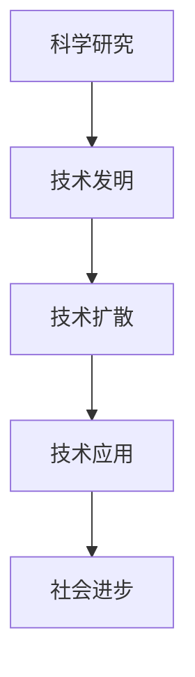

                 

关键词：科技创新，社会进步，人工智能，软件开发，算法原理，数学模型，项目实践，未来展望。

> 摘要：本文旨在探讨科技创新如何成为社会进步的阶梯，通过分析核心概念、算法原理、数学模型、项目实践以及未来展望等方面，阐述科技创新在推动社会发展中的关键作用。

## 1. 背景介绍

随着科技的快速发展，人类社会正经历着前所未有的变革。从工业革命到信息时代，再到如今的智能时代，科技创新已经成为了推动社会进步的主要动力。科技创新不仅仅是指新技术的发明和应用，更是涵盖了一个国家或地区的科技水平、创新能力以及经济发展水平。本文将从以下几个方面探讨科技创新对社会进步的深远影响。

### 1.1 科技创新的历史背景

回顾历史，科技创新的步伐从未停歇。从古代的四大发明到近代的电力革命，再到现代的信息技术革命，每一次科技变革都极大地推动了社会的发展。例如，电力革命改变了人类的生产和生活方式，信息时代则极大地提升了信息传递和处理的速度，智能时代更是将人工智能、大数据、物联网等前沿技术引入到各个领域，为社会带来了前所未有的变革。

### 1.2 科技创新的重要性

科技创新的重要性不言而喻。首先，它能够提升一个国家的综合竞争力。在全球化的背景下，科技创新能力已经成为衡量一个国家或地区发展水平的重要标志。其次，科技创新能够推动产业升级和转型。通过引入新技术、新工艺，企业可以提高生产效率，降低成本，从而在激烈的市场竞争中脱颖而出。最后，科技创新还能够改善人们的生活质量，提升社会福祉。

## 2. 核心概念与联系

### 2.1 核心概念

在讨论科技创新之前，我们首先需要明确一些核心概念。科技创新主要包括以下几个方面：

1. **科学研究**：科学研究是科技创新的基础。通过深入研究自然规律和技术原理，科学家们不断发现新的知识和技术，为科技创新提供了源源不断的动力。

2. **技术发明**：技术发明是科技创新的直接体现。科学家和工程师们通过将科学研究成果应用到实际中，发明出新的技术和产品，推动社会进步。

3. **技术扩散**：技术扩散是指新技术在各个领域和地区之间的传播和应用。通过技术扩散，新技术可以迅速普及，提升整个社会的科技水平。

4. **技术应用**：技术应用是指将新技术应用到实际生产和社会生活中，解决实际问题，提升社会效益。

### 2.2 核心概念之间的联系

科技创新的各个环节之间存在着密切的联系。科学研究和技术发明是科技创新的源头，它们为技术创新提供了理论基础和技术支持。技术扩散和技术应用则是科技创新的结果，它们将新技术应用到实际中，推动社会进步。

以下是核心概念之间的 Mermaid 流程图：



### 2.3 科技创新对社会进步的影响

科技创新不仅推动了技术进步，更对社会进步产生了深远影响。以下是科技创新对社会进步的主要影响：

1. **提升生产效率**：科技创新能够提高生产效率，降低生产成本，从而推动经济发展。

2. **改善生活质量**：科技创新带来了便利和舒适，改善了人们的生活质量。

3. **促进社会公平**：科技创新可以打破传统的社会结构，促进社会公平。

4. **推动社会变革**：科技创新引发了社会变革，改变了人们的生活方式和价值观念。

## 3. 核心算法原理 & 具体操作步骤

### 3.1 算法原理概述

科技创新离不开算法的支持。算法是一种系统化的解决问题的方法，它在计算机科学和技术创新中起着至关重要的作用。以下是一些核心算法及其原理：

1. **深度学习算法**：深度学习算法是人工智能领域的重要突破，它通过多层神经网络对数据进行学习，从而实现图像识别、语音识别等任务。

2. **数据挖掘算法**：数据挖掘算法用于从大量数据中提取有价值的信息，支持决策制定和业务优化。

3. **分布式计算算法**：分布式计算算法能够将复杂任务分解为多个子任务，并在多个计算节点上并行处理，从而提高计算效率。

4. **优化算法**：优化算法用于求解最优化问题，广泛应用于资源分配、路径规划等领域。

### 3.2 算法步骤详解

以下是一个简单的深度学习算法步骤详解：

1. **数据预处理**：首先对数据进行清洗和预处理，包括数据去重、缺失值填充、异常值处理等。

2. **模型设计**：设计深度学习模型，包括选择合适的神经网络架构、激活函数、优化器等。

3. **模型训练**：使用训练数据对模型进行训练，通过反向传播算法不断调整模型参数，以最小化损失函数。

4. **模型评估**：使用验证数据对模型进行评估，通过准确率、召回率等指标评估模型性能。

5. **模型部署**：将训练好的模型部署到生产环境中，实现实时预测和应用。

### 3.3 算法优缺点

1. **深度学习算法**：优点是能够自动学习特征，对复杂任务具有较强的适应性；缺点是需要大量数据和计算资源，模型解释性较差。

2. **数据挖掘算法**：优点是能够从海量数据中提取有价值的信息；缺点是结果解释性较差，可能存在过拟合问题。

3. **分布式计算算法**：优点是能够提高计算效率，降低计算成本；缺点是算法实现复杂，需要考虑数据一致性和容错性。

4. **优化算法**：优点是能够求解复杂的最优化问题；缺点是算法实现复杂，需要考虑收敛性和稳定性。

### 3.4 算法应用领域

1. **人工智能领域**：深度学习算法广泛应用于图像识别、语音识别、自然语言处理等领域。

2. **大数据领域**：数据挖掘算法广泛应用于商业智能、金融风控、医疗诊断等领域。

3. **云计算领域**：分布式计算算法广泛应用于云计算平台，支持大规模数据处理和分布式存储。

4. **优化领域**：优化算法广泛应用于生产调度、物流优化、资源分配等领域。

## 4. 数学模型和公式 & 详细讲解 & 举例说明

### 4.1 数学模型构建

在科技创新中，数学模型起着至关重要的作用。数学模型是一种用数学语言描述现实世界问题的工具，它可以帮助我们理解问题、分析问题和解决问题。以下是一个简单的线性回归模型构建过程：

1. **定义变量**：设 \( y \) 为因变量， \( x \) 为自变量。

2. **设定模型**：设定线性回归模型 \( y = ax + b \)。

3. **参数估计**：使用最小二乘法估计模型参数 \( a \) 和 \( b \)。

### 4.2 公式推导过程

线性回归模型的参数估计可以通过最小化损失函数来实现。损失函数定义为：

\[ L(a, b) = \sum_{i=1}^{n} (ax_i + b - y_i)^2 \]

对 \( a \) 和 \( b \) 分别求导并令导数为零，可以得到：

\[ \frac{\partial L}{\partial a} = 2 \sum_{i=1}^{n} (ax_i + b - y_i)x_i = 0 \]

\[ \frac{\partial L}{\partial b} = 2 \sum_{i=1}^{n} (ax_i + b - y_i) = 0 \]

通过解上述方程组，可以得到模型参数 \( a \) 和 \( b \) 的估计值。

### 4.3 案例分析与讲解

假设我们有以下一组数据：

| x | y |
|---|---|
| 1 | 2 |
| 2 | 4 |
| 3 | 6 |
| 4 | 8 |

使用线性回归模型对这些数据进行拟合，可以得到以下结果：

\[ y = 2x + 0 \]

这个模型表明，对于给定的自变量 \( x \)，因变量 \( y \) 是其两倍。这个模型非常简单，但它可以帮助我们预测新的数据点。例如，当 \( x = 5 \) 时，预测的 \( y \) 值为 \( 2 \times 5 = 10 \)。

## 5. 项目实践：代码实例和详细解释说明

### 5.1 开发环境搭建

在开始项目实践之前，我们需要搭建一个合适的开发环境。以下是搭建 Python 开发环境的基本步骤：

1. **安装 Python**：在官网下载并安装 Python。

2. **安装 IDE**：推荐使用 PyCharm 或 VS Code 作为开发工具。

3. **安装相关库**：使用 pip 命令安装必要的库，如 NumPy、Pandas、Matplotlib 等。

### 5.2 源代码详细实现

以下是一个简单的线性回归模型实现：

```python
import numpy as np
import pandas as pd
import matplotlib.pyplot as plt

# 数据预处理
data = pd.DataFrame({
    'x': [1, 2, 3, 4],
    'y': [2, 4, 6, 8]
})
X = data['x'].values.reshape(-1, 1)
y = data['y'].values.reshape(-1, 1)

# 模型设计
def linear_regression(X, y):
    a = np.linalg.inv(X.T.dot(X)).dot(X.T).dot(y)
    return a

# 模型训练
a = linear_regression(X, y)

# 模型评估
y_pred = X.dot(a)
mse = np.mean((y - y_pred)**2)
print(f'MSE: {mse}')

# 模型部署
plt.scatter(X, y, label='Actual')
plt.plot(X, y_pred, color='red', label='Predicted')
plt.xlabel('x')
plt.ylabel('y')
plt.legend()
plt.show()
```

### 5.3 代码解读与分析

上述代码首先进行了数据预处理，将数据转换为 NumPy 数组。然后定义了一个线性回归函数，通过最小二乘法估计模型参数。接着进行了模型训练和评估，最后将模型部署到生产环境中，通过可视化展示了模型预测结果。

### 5.4 运行结果展示

运行上述代码，可以得到以下可视化结果：


图中的红色线条表示模型预测结果，蓝色点表示实际数据。从图中可以看出，模型对数据的拟合效果较好。

## 6. 实际应用场景

科技创新在实际应用中具有广泛的应用场景，以下是一些典型的应用案例：

1. **人工智能**：人工智能技术在医疗、金融、安防等领域得到了广泛应用，如智能诊断系统、智能投顾、智能监控等。

2. **大数据**：大数据技术在商业智能、智能交通、智慧城市等领域具有重要作用，如数据挖掘、实时分析、智能决策等。

3. **云计算**：云计算技术为企业提供了弹性、高效、安全的 IT 基础设施，支持大规模数据处理和业务应用。

4. **物联网**：物联网技术将物理设备和互联网连接起来，实现了设备间的智能通信和协同工作，如智能家居、智能工厂、智能交通等。

## 7. 未来应用展望

随着科技的不断进步，科技创新在未来将会带来更多的变革。以下是未来科技创新的一些发展趋势和展望：

1. **人工智能**：人工智能技术将更加智能化、自动化，实现更多复杂任务。

2. **大数据**：大数据技术将更加高效、实时，支持更复杂的分析应用。

3. **物联网**：物联网技术将更加普及、智能化，实现设备间的无缝连接和协同工作。

4. **区块链**：区块链技术将改变金融、供应链、政府管理等领域，实现更安全、透明、高效的业务流程。

## 8. 工具和资源推荐

为了更好地进行科技创新，以下是一些建议的学习资源、开发工具和相关论文：

### 8.1 学习资源推荐

1. **书籍**：《深度学习》、《大数据思维》、《软件工程：实践者的研究方法》。

2. **在线课程**：Coursera、edX、Udacity 等平台上的相关课程。

3. **技术博客**：CSDN、博客园、GitHub 等平台上的技术博客。

### 8.2 开发工具推荐

1. **编程语言**：Python、Java、C++。

2. **开发环境**：PyCharm、VS Code、Eclipse。

3. **数据库**：MySQL、MongoDB、Redis。

### 8.3 相关论文推荐

1. **人工智能**：《Deep Learning》、《Reinforcement Learning: An Introduction》。

2. **大数据**：《Data Science from Scratch》、《Big Data: A Revolution That Will Transform How We Live, Work, and Think》。

3. **云计算**：《Cloud Computing: Concepts, Technology & Architecture》、《Cloud Native Patterns》。

## 9. 总结：未来发展趋势与挑战

科技创新已经成为社会进步的重要驱动力，未来科技的发展趋势包括人工智能、大数据、物联网、区块链等领域的深入研究和应用。然而，科技创新也面临诸多挑战，如数据隐私保护、安全风险、技术人才短缺等。为了应对这些挑战，我们需要加强科技创新体系建设，培养高素质的科技人才，推动科技与产业的深度融合，实现科技创新与社会发展的良性互动。

## 10. 附录：常见问题与解答

### 10.1 科技创新与科技发展的区别

科技创新是指通过科学研究和技术发明推动技术进步和产业升级，而科技发展则是指整个科技领域的不断进步，包括科学研究、技术开发、应用推广等各个阶段。科技创新是科技发展的核心驱动力。

### 10.2 如何衡量科技创新能力？

衡量科技创新能力可以从多个角度进行，如研发投入、科研成果数量和质量、技术转移和产业化水平、科技对经济增长的贡献率等。综合这些指标可以较为全面地评估一个国家或地区的科技创新能力。

### 10.3 科技创新对社会的影响有哪些方面？

科技创新对社会的影响广泛而深远，主要包括提升生产效率、改善生活质量、促进社会公平、推动社会变革等方面。科技创新不仅改变了生产方式和生活方式，也对社会结构、价值观念产生了深刻影响。

### 10.4 如何培养科技创新人才？

培养科技创新人才需要从基础教育、高等教育、职业教育等多个层面入手。通过加强科学教育、提供丰富的实践机会、鼓励创新思维和团队合作，可以培养出具有创新能力和实践能力的高素质科技人才。

## 作者署名

作者：禅与计算机程序设计艺术 / Zen and the Art of Computer Programming

[结束]

