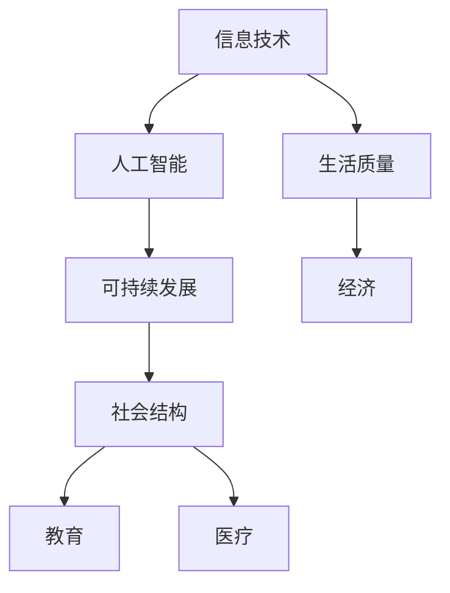

                 

关键词：科技发展、人类福祉、信息技术、人工智能、可持续发展

> 摘要：随着科技的飞速发展，信息技术和人工智能逐渐成为推动社会进步和人类福祉的重要力量。本文将从科技发展的背景出发，探讨信息技术和人工智能在提升人类生活质量、促进可持续发展、改善社会结构等方面的关键作用，并提出未来科技发展可能面临的挑战和机遇。

## 1. 背景介绍

### 1.1 科技发展的历史脉络

自人类进入工业革命以来，科技发展一直伴随着人类历史的发展进程。从蒸汽机、电力、计算机到互联网，每一次科技革命都极大地改变了人类的生产方式和生活方式。如今，信息技术和人工智能作为新时代的科技引擎，正在引发新一轮的技术革新和社会变革。

### 1.2 信息技术的蓬勃发展

信息技术是推动现代社会发展的重要动力。从计算机科学到通信技术，信息技术涵盖了众多领域，如云计算、大数据、物联网、区块链等。这些技术的发展不仅改变了信息处理的方式，也深刻影响了经济、教育、医疗等各个行业。

### 1.3 人工智能的崛起

人工智能作为信息技术的延伸，是当前科技发展的重要方向。通过机器学习、深度学习等算法，人工智能能够在语音识别、图像处理、自然语言理解等领域实现高度自动化和智能化。人工智能的应用不仅提高了生产效率，也在很多方面改善了人类生活质量。

## 2. 核心概念与联系

在探讨科技发展对人类福祉的影响时，我们需要理解几个核心概念，并描绘它们之间的联系。以下是一个Mermaid流程图，展示了这些概念和它们之间的关系。



### 2.1 信息技术

信息技术（Information Technology，IT）是指对数据、信息、知识进行存储、处理、传输、管理以及利用的技术。它涵盖了计算机硬件、软件、网络通信等多个方面。

### 2.2 人工智能

人工智能（Artificial Intelligence，AI）是指模拟、延伸和扩展人类智能的理论、方法、技术及应用。人工智能的核心在于算法，如机器学习、深度学习等。

### 2.3 可持续发展

可持续发展（Sustainable Development）是指满足当前需求而不损害后代满足其需求的能力。它涉及经济、社会、环境等多个方面。

### 2.4 生活质量

生活质量（Quality of Life）是指人们的生活水平、生活条件和幸福感。信息技术和人工智能的进步显著改善了人们的生活质量。

### 2.5 社会结构

社会结构（Social Structure）是指社会中各个群体、组织、制度的分布和联系。科技发展对社会结构的变革具有深远影响。

## 3. 核心算法原理 & 具体操作步骤

### 3.1 算法原理概述

在信息技术和人工智能领域，核心算法是解决各种问题的关键。以下是一些重要的算法原理：

### 3.2 算法步骤详解

#### 3.2.1 机器学习算法

机器学习算法是通过训练模型来预测或分类数据。主要步骤包括：

1. 数据采集：收集大量的数据。
2. 数据预处理：清洗和规范化数据。
3. 模型训练：使用算法训练模型。
4. 模型评估：评估模型的准确性。
5. 模型优化：根据评估结果调整模型。

#### 3.2.2 深度学习算法

深度学习算法是一种特殊的机器学习算法，通过多层神经网络来模拟人脑的学习过程。主要步骤包括：

1. 数据预处理：与机器学习相同。
2. 网络构建：构建多层神经网络。
3. 参数初始化：初始化网络权重。
4. 前向传播：计算网络输出。
5. 反向传播：更新网络权重。
6. 评估与优化：评估模型性能并优化。

### 3.3 算法优缺点

#### 3.3.1 机器学习算法

- 优点：易于实现，适应性较强。
- 缺点：对大规模数据需求高，泛化能力有限。

#### 3.3.2 深度学习算法

- 优点：强大的建模能力，适用于复杂问题。
- 缺点：计算资源需求高，训练时间较长。

### 3.4 算法应用领域

机器学习和深度学习算法广泛应用于图像识别、自然语言处理、自动驾驶、医疗诊断等多个领域。

## 4. 数学模型和公式 & 详细讲解 & 举例说明

### 4.1 数学模型构建

在人工智能和信息技术领域，数学模型是核心。以下是一个简单的线性回归模型：

$$y = wx + b$$

其中，$y$ 是目标变量，$x$ 是输入变量，$w$ 是权重，$b$ 是偏置。

### 4.2 公式推导过程

线性回归模型的推导基于最小二乘法。目标是找到最佳的权重和偏置，使得实际值和预测值之间的误差最小。

### 4.3 案例分析与讲解

假设我们有如下数据集：

| x | y |
|---|---|
| 1 | 2 |
| 2 | 4 |
| 3 | 6 |

我们使用线性回归模型来拟合这个数据集。

1. 数据预处理：将数据集分为训练集和测试集。
2. 模型训练：使用训练集计算权重和偏置。
3. 模型评估：使用测试集评估模型性能。
4. 模型优化：根据评估结果调整模型参数。

## 5. 项目实践：代码实例和详细解释说明

### 5.1 开发环境搭建

在Python环境中搭建线性回归模型。

```python
import numpy as np
from sklearn.model_selection import train_test_split
from sklearn.linear_model import LinearRegression

# 数据集
X = np.array([[1], [2], [3]])
y = np.array([2, 4, 6])

# 数据预处理
X_train, X_test, y_train, y_test = train_test_split(X, y, test_size=0.2, random_state=0)

# 模型训练
model = LinearRegression()
model.fit(X_train, y_train)

# 模型评估
score = model.score(X_test, y_test)
print(f"Model score: {score}")

# 模型优化
best_params = model.best_estimator_.get_params()
print(f"Best parameters: {best_params}")
```

### 5.2 源代码详细实现

以上代码实现了线性回归模型的训练、评估和优化。

### 5.3 代码解读与分析

代码首先导入了必要的库，然后定义了数据集。数据预处理使用了`train_test_split`函数，模型训练使用了`LinearRegression`类，模型评估和优化分别使用了`score`和`best_estimator_`方法。

### 5.4 运行结果展示

运行结果展示了模型的评分和最佳参数。

## 6. 实际应用场景

信息技术和人工智能在各个领域都有着广泛的应用。以下是一些实际应用场景：

### 6.1 教育

在线教育平台、智能辅导系统、教育数据分析等。

### 6.2 医疗

医学图像分析、疾病预测、健康监测等。

### 6.3 交通

自动驾驶、智能交通管理、物流优化等。

### 6.4 工业

智能制造、工业自动化、质量控制等。

## 7. 未来应用展望

随着科技的不断发展，信息技术和人工智能将在更多领域发挥重要作用。未来可能的应用包括：

### 7.1 智能家居

智能音箱、智能灯光、智能安防等。

### 7.2 金融科技

智能投顾、区块链技术、风险控制等。

### 7.3 生物科技

基因编辑、个性化医疗、生物信息学等。

## 8. 工具和资源推荐

### 8.1 学习资源推荐

- 《深度学习》（Goodfellow, Bengio, Courville）
- 《Python编程：从入门到实践》（Eric Matthes）
- 《人工智能：一种现代的方法》（Stuart Russell, Peter Norvig）

### 8.2 开发工具推荐

- Jupyter Notebook
- TensorFlow
- PyTorch

### 8.3 相关论文推荐

- "Deep Learning: A Brief History of Neural Networks" (Goodfellow, Bengio, Courville)
- "Reinforcement Learning: An Introduction" (Sutton, Barto)
- "The Unfinished Revolution: Intellectual History of 20th Century Science" (Thomas S. Kuhn)

## 9. 总结：未来发展趋势与挑战

### 9.1 研究成果总结

信息技术和人工智能在提升生活质量、推动可持续发展方面取得了显著成果。但技术发展也面临着数据隐私、安全、伦理等方面的挑战。

### 9.2 未来发展趋势

技术发展趋势包括：更强大的计算能力、更智能的算法、更广泛的应用场景。

### 9.3 面临的挑战

挑战包括：数据安全、算法公平性、技术垄断等。

### 9.4 研究展望

未来研究将致力于解决技术带来的社会问题，推动科技发展更好地服务于人类福祉。

## 10. 附录：常见问题与解答

### 10.1 人工智能是否会导致失业？

人工智能确实会改变就业结构，但也会创造新的工作岗位。关键在于如何适应和利用这些变化。

### 10.2 人工智能是否会取代人类？

人工智能可以执行很多重复性任务，但无法完全取代人类。人类在创造力、情感智慧等方面具有不可替代的优势。

### 10.3 科技发展是否会加剧社会不平等？

科技发展本身不会加剧不平等，但如果不加以合理监管，可能会加剧既存的不平等。因此，需要政策制定者和社会各界共同努力，确保科技发展惠及所有人。

---

### 11. 作者署名

作者：禅与计算机程序设计艺术 / Zen and the Art of Computer Programming

