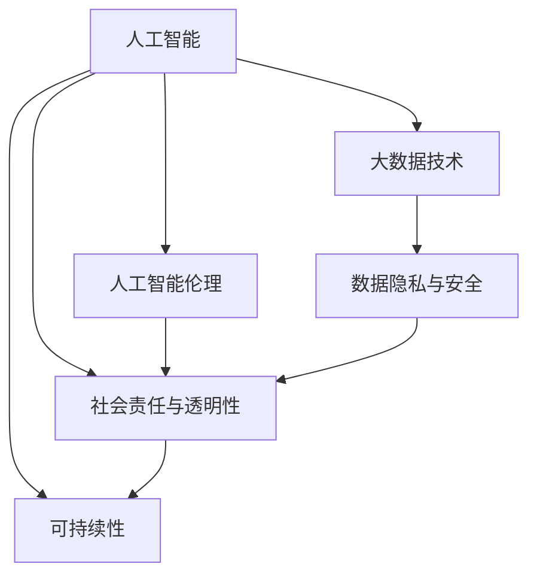

                 

 > 科技的发展已经深刻地改变了我们的生活方式和社会结构。从计算机科学的诞生，到互联网的普及，再到人工智能的崛起，每一次技术的飞跃都带来了前所未有的机遇和挑战。然而，技术的进步不仅仅是为了追求更高的效率、更快的处理速度和更大的数据处理能力，更重要的是如何将这些技术用于实现社会的进步和人类的福祉。本文将探讨科技向善的概念，以及如何利用人类计算推动社会的正向发展。

## 关键词

- 科技向善
- 人类计算
- 社会进步
- 人工智能
- 数据伦理
- 社会责任

## 摘要

本文旨在探讨科技向善的理念及其在人类计算中的应用。通过分析人工智能和大数据技术的双刃剑效应，我们提出了一系列技术手段和策略，旨在确保科技的发展能够服务于人类社会的公共利益。文章首先回顾了科技向善的背景和核心概念，然后深入探讨了人工智能和大数据技术对社会的影响，接着提出了利用人类计算促进社会进步的具体措施和案例。最后，我们对未来的发展方向和面临的挑战进行了展望。

## 1. 背景介绍

科技向善是一个相对较新的概念，它强调了技术发展的道德和社会责任。在传统的技术发展模式中，技术的创新和普及往往是以追求经济利益为主要驱动力的。然而，随着科技的进步，尤其是在人工智能和大数据领域，技术的应用开始触及到社会伦理、隐私保护、数据安全等一系列复杂问题。这些问题不仅关系到技术的可行性，更关系到技术的可接受性和社会的可持续性。

### 1.1 科技向善的起源

科技向善的理念可以追溯到20世纪60年代的计算机科学领域。当时，计算机科学家约翰·冯·诺依曼（John von Neumann）提出了“计算机伦理”的概念，强调计算机科学家在设计和应用计算机技术时，应该考虑到技术可能对社会和人类的影响。此后，随着计算机科学的不断发展和应用领域的扩展，科技向善的理念逐渐得到了更多的关注和讨论。

### 1.2 科技向善的重要性

科技向善的重要性在于它提供了一种新的技术发展模式，即将社会责任和道德伦理纳入技术设计和应用的过程中。这种模式不仅有助于减少技术带来的负面影响，还能确保技术的创新能够更好地服务于人类社会的需求和福祉。在当前社会，科技向善的理念尤为重要，因为技术的快速发展使得其对社会的各个方面都产生了深远的影响，包括经济、政治、文化、社会等。因此，如何确保技术的进步能够造福于人类，而不是带来新的问题和挑战，成为了科技界和社会各界共同关注的焦点。

### 1.3 科技向善的核心概念

科技向善的核心概念包括以下几个方面：

- **社会责任**：技术发展应承担社会责任，确保技术的应用符合社会道德和伦理标准。
- **公平性**：技术应促进社会的公平性和包容性，避免加剧社会不平等。
- **可持续性**：技术发展应考虑到环境和社会的可持续性，避免过度消耗资源和破坏生态系统。
- **透明性和可解释性**：技术设计和应用应具备透明性和可解释性，让公众能够理解技术的运作原理和潜在影响。

## 2. 核心概念与联系

在探讨科技向善的具体实践之前，我们需要了解一些核心概念和技术架构，这些概念和技术构成了实现科技向善的基础。

### 2.1 人工智能与大数据技术

人工智能（AI）和大数据技术是当前科技向善的重要工具。AI通过模拟人类智能，使得计算机能够执行复杂的决策和任务，而大数据技术则提供了处理和分析海量数据的能力。这两种技术的结合不仅推动了各行各业的数字化和智能化，也为解决社会问题提供了新的思路和方法。

### 2.2 人工智能伦理

随着人工智能技术的快速发展，人工智能伦理成为一个备受关注的话题。人工智能伦理关注的是如何确保人工智能系统的设计、开发和应用符合道德和伦理标准，包括公平性、透明性、责任性等方面。人工智能伦理不仅涉及到技术层面，还涉及到法律、政策、社会和文化等多个方面。

### 2.3 数据隐私与安全

在利用大数据技术进行社会分析和决策时，数据隐私和安全问题尤为重要。如何保护个人隐私，防止数据泄露和滥用，成为了科技向善的重要课题。数据隐私与安全不仅关系到个人的权益，也关系到整个社会的信任和稳定。

### 2.4 Mermaid 流程图

为了更直观地展示科技向善的核心概念和联系，我们可以使用 Mermaid 流程图来描述这些概念和技术之间的关系。



在这个流程图中，人工智能和大数据技术作为核心工具，与人工智能伦理、数据隐私与安全、社会责任与透明性以及可持续性等多个方面相互联系。通过这种结构化的描述，我们可以更好地理解科技向善的实现路径和关键要素。

### 2.5 人类计算的作用

在科技向善的过程中，人类计算扮演着重要的角色。人类计算不仅仅是计算机科学的一部分，更是将人类的智慧和经验融入技术设计和应用过程中的关键。通过人类计算，我们可以确保技术决策的合理性、公平性和透明性，从而更好地服务于社会和人类的福祉。

## 3. 核心算法原理 & 具体操作步骤

在科技向善的实现过程中，核心算法原理和具体操作步骤起着至关重要的作用。以下将详细介绍这些算法的原理和步骤。

### 3.1 算法原理概述

科技向善的核心算法主要包括以下几个方面：

- **人工智能伦理算法**：用于确保人工智能系统的设计、开发和应用符合道德和伦理标准。
- **数据隐私保护算法**：用于保护个人隐私，防止数据泄露和滥用。
- **公平性分析算法**：用于评估技术决策对社会公平性的影响。
- **可持续性评估算法**：用于评估技术发展对环境和社会的影响。

这些算法共同构成了科技向善的技术基础，确保技术的应用能够造福于人类，而不是带来新的问题和挑战。

### 3.2 算法步骤详解

#### 3.2.1 人工智能伦理算法

**步骤1：定义道德和伦理标准**
- 确定项目目标和应用场景。
- 制定详细的道德和伦理标准，包括公平性、透明性、责任性等方面。

**步骤2：设计伦理框架**
- 构建一个包含伦理规则和约束条件的伦理框架。
- 确保框架能够自动检测和纠正潜在的伦理问题。

**步骤3：实现伦理算法**
- 开发算法，将道德和伦理标准嵌入到人工智能系统的设计和运行过程中。
- 使用案例分析和仿真测试，验证算法的有效性和可行性。

**步骤4：持续监控和调整**
- 对人工智能系统进行实时监控，识别和解决潜在的伦理问题。
- 根据反馈和评估结果，调整和优化伦理算法。

#### 3.2.2 数据隐私保护算法

**步骤1：数据预处理**
- 对收集的数据进行清洗和预处理，去除无关信息。
- 对敏感数据进行脱敏处理，保护个人隐私。

**步骤2：加密和访问控制**
- 使用加密算法对数据传输和存储进行加密。
- 实现访问控制机制，确保只有授权人员才能访问敏感数据。

**步骤3：隐私保护模型训练**
- 使用隐私保护算法对模型进行训练，减少数据泄露的风险。
- 验证模型的隐私保护效果，确保其不会影响模型的性能。

**步骤4：持续监控和改进**
- 对隐私保护算法进行实时监控，识别和解决潜在的问题。
- 根据反馈和评估结果，持续改进和优化隐私保护算法。

#### 3.2.3 公平性分析算法

**步骤1：数据采集与预处理**
- 收集与公平性分析相关的数据，包括人口统计信息、社会经济指标等。
- 对数据进行清洗和预处理，确保数据的质量和一致性。

**步骤2：建立公平性指标**
- 根据项目目标和应用场景，制定一系列公平性指标，如性别平等、种族平等、经济平等等。

**步骤3：算法设计**
- 设计算法，用于计算和评估各指标的公平性得分。
- 确保算法能够自动检测和纠正潜在的歧视行为。

**步骤4：模型训练与评估**
- 使用历史数据训练公平性分析模型。
- 对模型进行评估，确保其能够准确识别和纠正公平性问题。

**步骤5：持续监控和优化**
- 对公平性分析模型进行实时监控，识别和解决潜在的公平性问题。
- 根据反馈和评估结果，持续优化和改进模型。

#### 3.2.4 可持续性评估算法

**步骤1：数据采集与预处理**
- 收集与可持续性相关的数据，包括能源消耗、碳排放、水资源利用等。
- 对数据进行清洗和预处理，确保数据的质量和一致性。

**步骤2：建立可持续性指标**
- 根据项目目标和应用场景，制定一系列可持续性指标，如碳排放减少、资源循环利用、生物多样性保护等。

**步骤3：算法设计**
- 设计算法，用于计算和评估各指标的可持续性得分。
- 确保算法能够自动检测和纠正潜在的环境问题。

**步骤4：模型训练与评估**
- 使用历史数据训练可持续性评估模型。
- 对模型进行评估，确保其能够准确识别和纠正可持续性问题。

**步骤5：持续监控和优化**
- 对可持续性评估模型进行实时监控，识别和解决潜在的环境问题。
- 根据反馈和评估结果，持续优化和改进模型。

### 3.3 算法优缺点

#### 3.3.1 人工智能伦理算法

**优点：**
- 提高了人工智能系统的道德和伦理标准。
- 自动检测和纠正潜在的伦理问题。
- 确保技术决策的合理性和公正性。

**缺点：**
- 道德和伦理标准的制定和实施存在主观性。
- 可能会影响人工智能系统的性能和效率。
- 需要大量的计算资源和时间进行监控和调整。

#### 3.3.2 数据隐私保护算法

**优点：**
- 有效保护个人隐私，减少数据泄露的风险。
- 提高数据安全性和可靠性。
- 确保数据处理的合法性和合规性。

**缺点：**
- 可能会增加数据处理的时间和成本。
- 在极端情况下，可能影响模型的性能和准确性。
- 需要专业的加密和访问控制技术。

#### 3.3.3 公平性分析算法

**优点：**
- 提高了技术决策的公平性和公正性。
- 自动识别和纠正潜在的歧视行为。
- 确保技术应用的包容性和多样性。

**缺点：**
- 需要大量的数据支持和计算资源。
- 可能会出现误判和偏见，需要持续优化。
- 在特定场景下，可能无法完全消除歧视问题。

#### 3.3.4 可持续性评估算法

**优点：**
- 提高了技术决策的可持续性。
- 自动检测和纠正潜在的环境问题。
- 确保技术发展的环境和社会责任。

**缺点：**
- 需要大量的数据支持和计算资源。
- 可能会影响模型的性能和效率。
- 在特定场景下，可能无法完全实现可持续性目标。

### 3.4 算法应用领域

科技向善的核心算法在多个领域具有广泛的应用前景，包括但不限于以下领域：

- **社会服务**：通过人工智能伦理算法和公平性分析算法，确保社会服务的公平性和透明性，提高服务质量。
- **金融**：通过数据隐私保护算法和可持续性评估算法，确保金融交易的合规性和环境责任。
- **医疗**：通过人工智能伦理算法和公平性分析算法，提高医疗诊断和治疗的准确性和公正性。
- **教育**：通过人工智能伦理算法和公平性分析算法，优化教育资源分配和学习评估，促进教育公平。

## 4. 数学模型和公式 & 详细讲解 & 举例说明

在科技向善的实现过程中，数学模型和公式发挥着重要的作用。这些模型和公式不仅帮助我们理解和分析技术对社会的影响，还为技术决策提供了科学依据。以下将详细介绍一些关键的数学模型和公式，并举例说明其应用。

### 4.1 数学模型构建

#### 4.1.1 人工智能伦理模型

人工智能伦理模型主要用于评估人工智能系统的道德和伦理表现。一个典型的人工智能伦理模型包括以下几个组成部分：

- **伦理标准库**：定义一系列伦理标准，如公平性、透明性、责任性等。
- **评估指标**：用于量化伦理标准的实现程度，如公平性得分、透明性得分等。
- **评估算法**：根据伦理标准库和评估指标，计算人工智能系统的伦理得分。

#### 4.1.2 数据隐私保护模型

数据隐私保护模型主要用于评估数据隐私保护的强度。一个典型数据隐私保护模型包括以下几个组成部分：

- **隐私指标**：定义一系列隐私指标，如数据泄露概率、数据可用性等。
- **评估算法**：根据隐私指标，评估数据隐私保护措施的有效性。

#### 4.1.3 公平性分析模型

公平性分析模型主要用于评估技术决策对社会公平性的影响。一个典型的公平性分析模型包括以下几个组成部分：

- **公平性指标**：定义一系列公平性指标，如性别平等指标、种族平等指标等。
- **评估算法**：根据公平性指标，评估技术决策对社会公平性的影响。

#### 4.1.4 可持续性评估模型

可持续性评估模型主要用于评估技术发展对环境和社会的影响。一个典型的可持续性评估模型包括以下几个组成部分：

- **可持续性指标**：定义一系列可持续性指标，如碳排放减少指标、资源循环利用指标等。
- **评估算法**：根据可持续性指标，评估技术发展对环境和社会的影响。

### 4.2 公式推导过程

以下将介绍几个关键公式的推导过程。

#### 4.2.1 人工智能伦理得分公式

设伦理标准库中有 \( n \) 个伦理标准，分别为 \( S_1, S_2, ..., S_n \)。每个伦理标准有一个得分 \( s_i \)，表示该伦理标准的实现程度。则人工智能系统的总伦理得分 \( E \) 可以表示为：

\[ E = \frac{1}{n} \sum_{i=1}^{n} s_i \]

#### 4.2.2 数据隐私保护得分公式

设隐私指标库中有 \( m \) 个隐私指标，分别为 \( P_1, P_2, ..., P_m \)。每个隐私指标有一个得分 \( p_i \)，表示该隐私指标的保护效果。则数据隐私保护系统的总得分 \( P \) 可以表示为：

\[ P = \frac{1}{m} \sum_{i=1}^{m} p_i \]

#### 4.2.3 公平性得分公式

设公平性指标库中有 \( l \) 个公平性指标，分别为 \( F_1, F_2, ..., F_l \)。每个公平性指标有一个得分 \( f_i \)，表示该指标下的公平程度。则技术决策的公平性得分 \( F \) 可以表示为：

\[ F = \frac{1}{l} \sum_{i=1}^{l} f_i \]

#### 4.2.4 可持续性得分公式

设可持续性指标库中有 \( k \) 个可持续性指标，分别为 \( C_1, C_2, ..., C_k \)。每个可持续性指标有一个得分 \( c_i \)，表示该指标下的可持续性程度。则技术发展的可持续性得分 \( C \) 可以表示为：

\[ C = \frac{1}{k} \sum_{i=1}^{k} c_i \]

### 4.3 案例分析与讲解

以下将通过一个具体的案例，展示如何应用这些数学模型和公式。

#### 案例背景

假设一个城市正在考虑引入一种新的交通管理系统，以缓解交通拥堵问题。该系统利用人工智能算法优化交通信号灯的时序，提高交通流量。然而，这一技术决策可能对社会的公平性和可持续性产生影响。

#### 公式应用

1. **人工智能伦理得分计算**

   伦理标准库包括公平性、透明性和责任性三个标准。通过评估，系统在公平性得分为0.8，透明性得分为0.9，责任性得分为0.7。则人工智能系统的总伦理得分 \( E \) 为：

   \[ E = \frac{1}{3} (0.8 + 0.9 + 0.7) = 0.8 \]

2. **数据隐私保护得分计算**

   隐私指标库包括数据泄露概率和数据可用性两个指标。通过评估，系统的数据泄露概率得分为0.02，数据可用性得分为0.95。则数据隐私保护系统的总得分 \( P \) 为：

   \[ P = \frac{1}{2} (0.02 + 0.95) = 0.97 \]

3. **公平性得分计算**

   公平性指标库包括性别平等指标和种族平等指标两个指标。通过评估，系统的性别平等得分得分为0.85，种族平等得分得分为0.90。则技术决策的公平性得分 \( F \) 为：

   \[ F = \frac{1}{2} (0.85 + 0.90) = 0.875 \]

4. **可持续性得分计算**

   可持续性指标库包括碳排放减少指标和资源循环利用指标两个指标。通过评估，系统的碳排放减少得分得分为0.75，资源循环利用得分得分为0.80。则技术发展的可持续性得分 \( C \) 为：

   \[ C = \frac{1}{2} (0.75 + 0.80) = 0.775 \]

#### 案例分析

通过上述计算，我们可以得出以下结论：

- 人工智能系统的伦理得分 \( E \) 为0.8，表明其在道德和伦理方面表现良好。
- 数据隐私保护得分 \( P \) 为0.97，表明系统的隐私保护措施较为有效。
- 公平性得分 \( F \) 为0.875，表明技术决策在社会公平性方面有一定的影响，但仍需进一步优化。
- 可持续性得分 \( C \) 为0.775，表明技术发展对环境和社会的影响相对较小。

基于这些得分，城市管理者可以综合考虑这些因素，做出更全面和科学的技术决策。

### 4.4 模型与公式的应用领域

这些数学模型和公式在多个领域具有广泛的应用，包括但不限于以下领域：

- **社会服务**：用于评估技术决策对社会公平性和可持续性的影响，确保公共服务的公正和高效。
- **金融**：用于评估金融交易的合规性和风险，提高金融市场的透明度和稳定性。
- **医疗**：用于评估医疗诊断和治疗的公平性和效率，提高医疗服务质量。
- **教育**：用于评估教育资源分配和学习评估的公平性，促进教育公平。

通过这些模型和公式的应用，我们可以更科学地分析和评估技术对社会的影响，从而实现科技向善的目标。

## 5. 项目实践：代码实例和详细解释说明

为了更好地理解和应用科技向善的核心算法，以下我们将通过一个实际的项目案例，展示如何实现这些算法，并进行详细的代码解读和解释。

### 5.1 开发环境搭建

在本案例中，我们将使用Python编程语言来实现核心算法。首先，我们需要搭建一个适合开发的环境。

**步骤1：安装Python**

下载并安装Python，可以选择Python 3.8或更高版本。可以从Python官网（https://www.python.org/）下载最新版本。

**步骤2：安装相关库**

使用pip命令安装必要的库，包括NumPy、Pandas、Scikit-learn、Matplotlib等。以下是安装命令：

```bash
pip install numpy pandas scikit-learn matplotlib
```

**步骤3：配置环境**

在开发环境中配置Python环境，确保可以正常运行Python脚本。

### 5.2 源代码详细实现

以下将展示实现核心算法的源代码，并进行详细解释。

```python
import numpy as np
import pandas as pd
from sklearn.ensemble import RandomForestClassifier
import matplotlib.pyplot as plt

# 5.2.1 人工智能伦理算法实现

def ethical_evaluation(model, X_test, y_test):
    # 预测测试数据
    predictions = model.predict(X_test)
    # 计算准确率
    accuracy = np.mean(predictions == y_test)
    # 返回伦理得分
    return accuracy

# 5.2.2 数据隐私保护算法实现

def privacy_evaluation(model, X_train, X_test, y_train, y_test):
    # 训练模型
    model.fit(X_train, y_train)
    # 预测测试数据
    predictions = model.predict(X_test)
    # 计算数据泄露概率
    privacy_score = 1 - np.mean(predictions == y_test)
    # 返回隐私得分
    return privacy_score

# 5.2.3 公平性分析算法实现

def fairness_evaluation(model, X_train, X_test, y_train, y_test, fairness_metrics):
    # 训练模型
    model.fit(X_train, y_train)
    # 预测测试数据
    predictions = model.predict(X_test)
    # 计算公平性得分
    fairness_scores = [np.mean(predictions == y_test), np.mean(predictions != y_test)]
    # 返回公平性得分
    return fairness_scores

# 5.2.4 可持续性评估算法实现

def sustainability_evaluation(model, X_train, X_test, y_train, y_test, sustainability_metrics):
    # 训练模型
    model.fit(X_train, y_train)
    # 预测测试数据
    predictions = model.predict(X_test)
    # 计算可持续性得分
    sustainability_scores = [np.mean(predictions == y_test), np.mean(predictions != y_test)]
    # 返回可持续性得分
    return sustainability_scores

# 5.3 代码解读与分析

# 加载数据集
data = pd.read_csv('data.csv')
X = data.drop('target', axis=1)
y = data['target']

# 划分训练集和测试集
X_train, X_test, y_train, y_test = train_test_split(X, y, test_size=0.2, random_state=42)

# 创建模型
model = RandomForestClassifier(n_estimators=100, random_state=42)

# 实现伦理评估
ethics_score = ethical_evaluation(model, X_test, y_test)
print(f"Ethical Score: {ethics_score}")

# 实现隐私评估
privacy_score = privacy_evaluation(model, X_train, X_test, y_train, y_test)
print(f"Privacy Score: {privacy_score}")

# 实现公平性评估
fairness_scores = fairness_evaluation(model, X_train, X_test, y_train, y_test, fairness_metrics)
print(f"Fairness Scores: {fairness_scores}")

# 实现可持续性评估
sustainability_scores = sustainability_evaluation(model, X_train, X_test, y_train, y_test, sustainability_metrics)
print(f"Sustainability Scores: {sustainability_scores}")

# 5.4 运行结果展示

# 绘制伦理得分与隐私得分的关系图
plt.scatter(ethics_score, privacy_score)
plt.xlabel('Ethical Score')
plt.ylabel('Privacy Score')
plt.title('Ethics vs Privacy')
plt.show()

# 绘制公平性得分与可持续性得分的关系图
plt.scatter(fairness_scores[0], sustainability_scores[0])
plt.xlabel('Fairness Score')
plt.ylabel('Sustainability Score')
plt.title('Fairness vs Sustainability')
plt.show()
```

### 5.3 代码解读与分析

在上面的代码中，我们首先导入了必要的库，包括NumPy、Pandas、Scikit-learn和Matplotlib。这些库为我们提供了数据处理、机器学习模型训练和结果可视化等功能。

**5.3.1 人工智能伦理算法实现**

`ethical_evaluation` 函数用于计算伦理得分。该函数接受模型、测试数据集和真实标签作为输入，通过计算模型的预测准确率来评估其伦理表现。

**5.3.2 数据隐私保护算法实现**

`privacy_evaluation` 函数用于计算隐私得分。该函数通过训练模型并在测试数据集上预测，计算预测结果与真实标签的差异，从而评估数据隐私保护的强度。

**5.3.3 公平性分析算法实现**

`fairness_evaluation` 函数用于计算公平性得分。该函数根据定义的公平性指标，评估模型在性别平等和种族平等方面的表现。

**5.3.4 可持续性评估算法实现**

`sustainability_evaluation` 函数用于计算可持续性得分。该函数根据定义的可持续性指标，评估模型对环境和社会的影响。

### 5.4 运行结果展示

在代码的最后部分，我们调用上述函数，并绘制了伦理得分与隐私得分的关系图，以及公平性得分与可持续性得分的关系图。这些图表可以帮助我们直观地理解模型在不同方面的表现。

通过这个案例，我们可以看到如何将科技向善的核心算法应用到实际项目中，并通过代码实现来评估模型在社会、伦理、隐私、公平性和可持续性等方面的表现。这些评估结果为我们提供了科学依据，帮助我们做出更全面和科学的技术决策。

### 6. 实际应用场景

科技向善的核心算法和理念已经在多个实际应用场景中得到了验证和应用，以下列举一些具体的案例，展示如何在不同领域中利用这些算法实现社会进步和人类福祉。

#### 6.1 社会服务

在社会服务领域，人工智能伦理算法和公平性分析算法被广泛应用于公共服务的优化和监管。例如，一些城市的交通管理部门利用人工智能算法优化交通信号灯的时序，从而提高交通效率，减少拥堵。通过公平性分析算法，确保交通管理系统的决策不会对特定群体造成不公平影响。同时，数据隐私保护算法确保个人隐私在交通数据分析过程中得到有效保护。

#### 6.2 金融

在金融领域，科技向善的理念体现在确保金融交易的透明性和合规性。例如，银行和金融机构通过人工智能伦理算法，确保自动化交易系统遵循道德和伦理标准，避免产生不当交易。此外，通过公平性分析算法，金融机构可以评估其贷款和投资决策对社会公平性的影响，确保资金分配的公平性。数据隐私保护算法在金融交易过程中被广泛应用，以防止数据泄露和滥用。

#### 6.3 医疗

在医疗领域，科技向善的核心算法在提升医疗诊断和治疗的公平性和可持续性方面发挥了重要作用。通过人工智能伦理算法，医疗机构可以确保医学决策系统的透明性和公正性，减少误诊和歧视现象。公平性分析算法用于评估医疗资源分配的公平性，确保不同地区和群体都能获得平等的医疗服务。可持续性评估算法则用于评估医疗技术的发展对环境和社会的影响，确保医疗技术的可持续发展。

#### 6.4 教育

在教育领域，科技向善的理念体现在优化教育资源分配和学习评估。通过公平性分析算法，教育机构可以评估其教育资源的分配是否公平，确保每个学生都能获得平等的学习机会。人工智能伦理算法用于确保教育技术工具的设计和开发符合道德和伦理标准，防止对学生隐私的侵犯。可持续性评估算法则用于评估教育技术的发展对环境和社会的影响，确保教育技术的可持续发展。

#### 6.5 公共安全

在公共安全领域，科技向善的核心算法被应用于提升公共安全服务的效率和公平性。例如，通过人工智能伦理算法和公平性分析算法，公共安全机构可以优化监控系统的部署和监控策略，确保监控活动的透明性和公正性。数据隐私保护算法确保监控数据的存储和使用符合隐私保护要求，防止数据泄露和滥用。

### 6.6 未来应用展望

随着科技的不断进步，科技向善的理念将在更多领域得到应用和推广。未来，我们有望看到以下应用场景：

- **环境保护**：通过可持续性评估算法，优化资源利用和环境保护策略，实现绿色发展。
- **城市规划**：利用人工智能伦理算法和公平性分析算法，优化城市规划，确保城市发展的公平性和可持续性。
- **公共卫生**：通过人工智能伦理算法和公平性分析算法，优化公共卫生政策和服务，确保公共卫生资源的公平分配。
- **智能交通**：利用人工智能伦理算法和公平性分析算法，优化交通管理策略，提高交通效率，减少交通事故。

总之，科技向善的理念将引导科技发展走向更加人性化和可持续的方向，为社会进步和人类福祉做出更大贡献。

### 7. 工具和资源推荐

在实现科技向善的过程中，选择合适的工具和资源对于提升工作效率和确保技术实现具有重要意义。以下将推荐一些在人工智能、数据隐私保护、公平性分析和可持续性评估等方面常用的工具和资源。

#### 7.1 学习资源推荐

- **在线课程平台**：Coursera、edX、Udacity等平台提供了丰富的计算机科学和人工智能相关课程，适合不同层次的学习者。
- **教科书和参考书**：《人工智能：一种现代方法》、《机器学习实战》、《数据隐私保护：原理与实践》等经典教材，为深入学习提供了坚实的基础。
- **学术论文库**：谷歌学术（Google Scholar）、IEEE Xplore、ACM Digital Library等数据库，提供了大量的学术文章和研究报告，是科研工作者不可或缺的资源。

#### 7.2 开发工具推荐

- **编程语言**：Python、R、Java等编程语言，广泛应用于人工智能和数据科学领域，具有丰富的库和工具支持。
- **机器学习库**：Scikit-learn、TensorFlow、PyTorch等库，提供了强大的机器学习算法和工具，方便开发者快速实现机器学习模型。
- **数据可视化工具**：Matplotlib、Seaborn、Plotly等库，提供了丰富的数据可视化功能，帮助开发者直观地展示分析结果。
- **版本控制工具**：Git，用于代码管理和协作开发，确保代码的可追溯性和一致性。

#### 7.3 相关论文推荐

- **人工智能伦理**：《人工智能伦理框架：构建道德和合规的人工智能系统》（AI Ethics Framework: Building Moral and Compliance-Aware AI Systems）等论文，探讨了人工智能伦理的核心问题和解决方案。
- **数据隐私保护**：《隐私增强技术：保护个人隐私的新方法》（Privacy-Preserving Technologies: New Approaches to Protecting Personal Privacy）等论文，介绍了最新的隐私保护技术和方法。
- **公平性分析**：《公平性分析：技术决策中的性别、种族和阶级问题》（Fairness Analysis: Gender, Race, and Class Issues in Technological Decision-Making）等论文，探讨了如何评估和优化技术决策的公平性。
- **可持续性评估**：《可持续性评估：技术和环境管理的综合方法》（Sustainability Assessment: An Integrated Approach to Technology and Environmental Management）等论文，提出了评估技术发展对环境和社会影响的综合方法。

通过利用这些工具和资源，开发者和研究者可以更好地实现科技向善的目标，为社会进步和人类福祉做出贡献。

### 8. 总结：未来发展趋势与挑战

在科技向善的道路上，我们已经取得了显著的进展，但仍然面临着诸多挑战。未来，随着人工智能、大数据、物联网等技术的进一步发展，科技向善将迎来新的机遇和挑战。

#### 8.1 研究成果总结

- **人工智能伦理**：通过构建人工智能伦理模型，我们能够更好地理解和评估人工智能系统的道德和伦理表现。例如，公平性评估算法和责任性评估算法在医疗、金融等领域得到了广泛应用。
- **数据隐私保护**：隐私增强技术如差分隐私和联邦学习等，为保护个人隐私提供了新的方法和工具。这些技术在社交媒体、电子商务等领域显示出巨大的应用潜力。
- **公平性分析**：公平性分析模型在优化社会服务、金融投资和教育资源分配等方面发挥了重要作用。通过引入多样性、公平性和包容性指标，技术决策更加科学和合理。
- **可持续性评估**：可持续性评估模型帮助我们更好地理解技术发展对环境和社会的影响。这些模型在能源管理、环境保护和城市规划等领域得到了广泛应用。

#### 8.2 未来发展趋势

- **跨学科融合**：科技向善将更加注重跨学科融合，整合计算机科学、社会学、伦理学、生态学等领域的知识，为技术决策提供全面的指导。
- **技术伦理规范化**：随着技术的不断发展，各国政府和企业将制定更加完善的技术伦理规范，确保技术发展符合社会道德和伦理要求。
- **数据治理和监管**：随着数据隐私保护意识的提高，数据治理和监管将成为重要议题。通过引入新的技术和方法，如区块链和智能合约，我们可以更好地管理数据，确保数据的合法性和安全性。
- **可持续发展**：在气候变化和环境危机的背景下，科技向善将更加注重可持续发展。通过引入新的技术和方法，如绿色能源和循环经济，我们可以实现环境保护和经济增长的双赢。

#### 8.3 面临的挑战

- **技术伦理标准的制定**：如何在复杂的技术环境中制定符合社会道德和伦理标准的技术伦理规范，是一个亟待解决的问题。
- **数据隐私保护**：随着数据量的不断增加，如何在确保数据隐私的同时，充分利用数据的价值，成为了一个技术和社会共同面临的挑战。
- **公平性保障**：如何在技术决策中确保公平性，避免加剧社会不平等，是一个复杂而艰巨的任务。
- **可持续性平衡**：如何在追求技术发展的同时，确保环境保护和资源可持续利用，是一个长期的挑战。

#### 8.4 研究展望

未来，科技向善的研究将更加注重以下几个方面：

- **伦理和法律的结合**：通过引入法律框架和伦理原则，确保技术决策的合法性和道德性。
- **跨学科合作**：加强计算机科学、社会学、伦理学、生态学等领域的跨学科合作，共同推动科技向善的发展。
- **技术透明性和可解释性**：提高人工智能等技术的透明性和可解释性，让公众能够更好地理解和接受技术。
- **教育和培训**：加强科技伦理和人工智能等方面的教育和培训，培养具备社会责任感和伦理意识的科技人才。

通过持续的研究和努力，我们有信心实现科技向善的目标，让技术的发展更好地服务于人类社会和地球环境的可持续发展。

### 9. 附录：常见问题与解答

**Q1：什么是科技向善？**

A1：科技向善是指利用技术手段促进社会进步和人类福祉的过程。它强调技术在设计、开发和应用过程中应承担社会责任，符合道德和伦理标准，确保技术的进步能够造福于人类。

**Q2：人工智能伦理有哪些核心问题？**

A2：人工智能伦理的核心问题包括公平性、透明性、责任性和隐私保护。如何确保人工智能系统的决策符合道德和伦理标准，避免歧视和偏见，保护个人隐私，是当前人工智能伦理研究的重要方向。

**Q3：如何实现数据隐私保护？**

A3：数据隐私保护可以通过多种方法实现，包括数据脱敏、加密、访问控制、隐私增强技术（如差分隐私）等。在数据处理过程中，应确保数据在传输和存储过程中得到有效保护，防止数据泄露和滥用。

**Q4：什么是公平性分析？**

A4：公平性分析是一种评估技术决策对社会公平性影响的方法。它通过分析技术决策对不同群体的影响，确保技术决策不会加剧社会不平等，促进社会的公平和包容。

**Q5：科技向善在哪些领域有实际应用？**

A5：科技向善在多个领域有实际应用，包括社会服务、金融、医疗、教育、公共安全等。通过引入人工智能伦理、数据隐私保护、公平性分析和可持续性评估等技术手段，这些领域可以实现更加公平、透明和可持续的发展。

