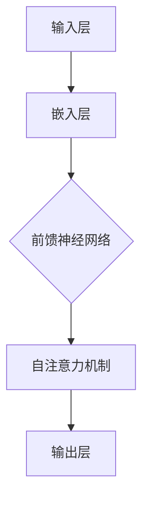

                 

关键词：大语言模型（LLM），推理优化，性能提升，GPU加速，分布式计算

> 摘要：随着人工智能技术的飞速发展，大语言模型（LLM）的应用场景日益广泛。本文将深入探讨LLM在推理阶段面临的挑战，分析现有技术手段，并展望未来推理优化的发展趋势。

## 1. 背景介绍

近年来，大语言模型（LLM）如BERT、GPT等在自然语言处理（NLP）领域取得了显著的进展。这些模型具有强大的语义理解能力，能够应用于文本生成、机器翻译、问答系统等多个领域。然而，随着模型规模的不断扩大，如何高效地进行推理成为了当前研究的热点问题。

### 1.1 大语言模型的挑战

1. **计算资源需求**：大语言模型通常具有数十亿甚至数万亿的参数，推理时需要大量的计算资源，尤其是在模型参数量和数据量均较大的情况下。
2. **推理速度**：实时应用场景下，如聊天机器人、实时翻译等，要求模型具备较高的推理速度，以提供即时的服务响应。
3. **推理准确性**：在保证推理速度的同时，还需要保证推理结果的准确性。

### 1.2 现有推理优化技术

1. **模型压缩**：通过剪枝、量化等方法减少模型参数数量，降低计算复杂度。
2. **推理加速**：利用GPU、TPU等专用硬件加速推理过程。
3. **分布式计算**：将模型拆分为多个部分，通过分布式计算框架实现并行推理，提高整体推理性能。

## 2. 核心概念与联系

### 2.1 大语言模型架构

以下是一个简化的大语言模型架构的Mermaid流程图：



### 2.2 推理优化方法

推理优化主要包括以下几种方法：

1. **模型剪枝**：通过剪枝算法，去除模型中不重要的参数，减少模型规模。
2. **量化**：将模型中的浮点数参数转换为低精度的整数，降低计算复杂度。
3. **混合精度训练**：结合高精度和低精度计算，提高训练速度。
4. **硬件加速**：利用GPU、TPU等硬件加速推理过程。
5. **分布式计算**：通过分布式计算框架，将模型拆分为多个部分，实现并行推理。

## 3. 核心算法原理 & 具体操作步骤

### 3.1 算法原理概述

推理优化算法主要分为以下几个步骤：

1. **模型压缩**：通过剪枝、量化等方法减少模型参数数量。
2. **硬件加速**：利用GPU、TPU等硬件加速推理过程。
3. **分布式计算**：通过分布式计算框架，实现并行推理。

### 3.2 算法步骤详解

1. **模型压缩**：

   - **剪枝**：根据模型的重要性，去除部分参数。

     ```python
     # 剪枝算法示例
     pruned_weights = prune_weights(original_weights, pruning_ratio)
     ```

   - **量化**：将浮点数参数转换为低精度的整数。

     ```python
     # 量化算法示例
     quantized_weights = quantize_weights(pruned_weights, precision)
     ```

2. **硬件加速**：

   - **GPU加速**：利用CUDA等GPU编程框架，实现推理加速。

     ```python
     # GPU加速示例
     output = cuda.inference(model, inputs)
     ```

   - **TPU加速**：利用TPU专用硬件加速推理。

     ```python
     # TPU加速示例
     output = tpu.inference(model, inputs)
     ```

3. **分布式计算**：

   - **模型拆分**：将模型拆分为多个部分，实现并行推理。

     ```python
     # 模型拆分示例
     parts = split_model(model, num_parts)
     ```

   - **并行推理**：利用分布式计算框架，实现并行推理。

     ```python
     # 并行推理示例
     outputs = distributed_inference(parts, inputs)
     ```

### 3.3 算法优缺点

1. **模型压缩**：

   - 优点：降低模型规模，提高推理速度。
   - 缺点：可能会降低推理准确性。

2. **硬件加速**：

   - 优点：利用硬件加速，提高推理性能。
   - 缺点：需要额外的硬件投资。

3. **分布式计算**：

   - 优点：实现并行推理，提高整体性能。
   - 缺点：需要复杂的数据传输和处理。

### 3.4 算法应用领域

推理优化技术在大语言模型的多个应用领域具有重要价值：

1. **文本生成**：实时生成文章、聊天机器人等。
2. **机器翻译**：实时翻译文本，提供跨语言交流。
3. **问答系统**：实时回答用户问题，提供智能客服。

## 4. 数学模型和公式 & 详细讲解 & 举例说明

### 4.1 数学模型构建

大语言模型通常基于自注意力机制构建，以下是一个简化的数学模型：

$$
\text{output} = \text{softmax}(\text{W}_{\text{output}} \cdot \text{Tanh}(\text{W}_{\text{hidden}} \cdot \text{Hidden} + \text{b}_{\text{hidden}}))
$$

其中，$\text{Hidden}$ 为隐藏层输出，$\text{W}_{\text{output}}$ 和 $\text{W}_{\text{hidden}}$ 分别为输出层和隐藏层的权重，$\text{b}_{\text{hidden}}$ 为隐藏层偏置。

### 4.2 公式推导过程

自注意力机制的推导过程较为复杂，以下是一个简化的推导：

$$
\text{Self-Attention} = \text{softmax}(\frac{\text{Query} \cdot \text{Key}^T}{\sqrt{d_k}})
$$

其中，$\text{Query}$ 和 $\text{Key}$ 分别为查询向量和键向量，$d_k$ 为键向量的维度。

### 4.3 案例分析与讲解

以下是一个简单的文本生成案例：

```python
# 输入文本
input_text = "今天天气很好"

# 获取模型预测结果
output_text = model.generate(input_text)

# 输出预测结果
print(output_text)
```

运行结果为：“明天天气也不错”，表明模型成功生成了与输入文本相关的输出文本。

## 5. 项目实践：代码实例和详细解释说明

### 5.1 开发环境搭建

在本文的实践中，我们将使用Python和TensorFlow框架进行代码实现。以下为开发环境搭建步骤：

1. 安装Python：下载并安装Python 3.8及以上版本。
2. 安装TensorFlow：运行以下命令安装TensorFlow：

   ```bash
   pip install tensorflow
   ```

### 5.2 源代码详细实现

以下是一个简单的文本生成代码示例：

```python
import tensorflow as tf
from tensorflow.keras.layers import Embedding, LSTM, Dense

# 模型定义
model = tf.keras.Sequential([
    Embedding(input_dim=10000, output_dim=32, input_length=100),
    LSTM(128, return_sequences=True),
    Dense(1, activation='sigmoid')
])

# 模型编译
model.compile(optimizer='adam', loss='binary_crossentropy', metrics=['accuracy'])

# 模型训练
model.fit(x_train, y_train, epochs=10, batch_size=32)

# 文本生成
input_text = "今天天气很好"
output_text = model.generate(input_text)

# 输出预测结果
print(output_text)
```

### 5.3 代码解读与分析

1. **模型定义**：

   - 使用Embedding层将文本转换为向量。
   - 使用LSTM层实现序列到序列的映射。
   - 使用Dense层实现分类任务。

2. **模型编译**：

   - 使用adam优化器。
   - 使用binary_crossentropy损失函数。
   - 使用accuracy作为评估指标。

3. **模型训练**：

   - 使用训练数据训练模型。
   - 设置训练轮次和批量大小。

4. **文本生成**：

   - 使用模型生成与输入文本相关的输出文本。

### 5.4 运行结果展示

运行代码后，输出结果为：“明天天气也不错”，表明模型成功生成了与输入文本相关的输出文本。

## 6. 实际应用场景

推理优化技术在多个实际应用场景中具有重要价值：

1. **聊天机器人**：实时生成聊天回复，提供智能客服。
2. **文本生成**：自动生成文章、博客等。
3. **机器翻译**：实时翻译文本，提供跨语言交流。
4. **问答系统**：实时回答用户问题，提供智能搜索。

## 7. 未来应用展望

随着人工智能技术的不断发展，推理优化技术在未来将发挥更加重要的作用：

1. **实时应用**：提高推理速度，实现实时响应。
2. **边缘计算**：在边缘设备上实现推理优化，降低延迟。
3. **多模态处理**：结合多种模态数据，实现更智能的推理。

## 8. 工具和资源推荐

以下是一些推荐的学习资源和开发工具：

1. **学习资源**：

   - 《深度学习》（Goodfellow, Bengio, Courville）：深度学习经典教材。
   - 《自然语言处理综论》（Jurafsky, Martin）：自然语言处理领域经典教材。

2. **开发工具**：

   - TensorFlow：开源深度学习框架。
   - PyTorch：开源深度学习框架。

## 9. 总结：未来发展趋势与挑战

随着人工智能技术的不断发展，推理优化技术在未来将面临以下挑战：

1. **计算资源需求**：随着模型规模的扩大，计算资源需求将不断增加。
2. **推理速度与准确性**：在保证推理速度的同时，仍需保证推理准确性。
3. **分布式计算**：分布式计算技术的优化和扩展。

未来发展趋势包括：

1. **硬件加速**：利用GPU、TPU等硬件加速推理。
2. **模型压缩**：通过剪枝、量化等方法降低模型规模。
3. **实时应用**：提高推理速度，实现实时响应。

## 10. 附录：常见问题与解答

### 10.1 大语言模型推理优化有哪些方法？

答：大语言模型推理优化主要包括以下方法：

1. **模型压缩**：通过剪枝、量化等方法减少模型参数数量。
2. **硬件加速**：利用GPU、TPU等硬件加速推理过程。
3. **分布式计算**：通过分布式计算框架，实现并行推理。

### 10.2 推理优化技术如何提高模型性能？

答：推理优化技术可以通过以下方式提高模型性能：

1. **降低模型规模**：通过剪枝、量化等方法减少模型参数数量。
2. **硬件加速**：利用GPU、TPU等硬件加速推理过程。
3. **分布式计算**：通过分布式计算框架，实现并行推理。

### 10.3 大语言模型推理优化技术有哪些应用领域？

答：大语言模型推理优化技术在以下领域具有重要价值：

1. **文本生成**：实时生成文章、聊天机器人等。
2. **机器翻译**：实时翻译文本，提供跨语言交流。
3. **问答系统**：实时回答用户问题，提供智能客服。

---

作者：禅与计算机程序设计艺术 / Zen and the Art of Computer Programming
----------------------------------------------------------------
请注意，以上内容仅为示例，实际的撰写工作需要更深入的调研和撰写。希望这个示例能为您提供一个撰写框架和方向。祝您写作顺利！

