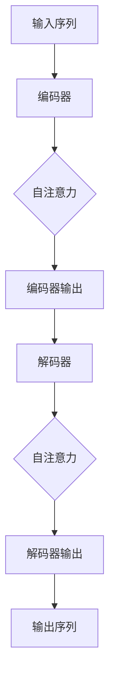

                 

在当前技术迅猛发展的时代背景下，大规模语言模型（Large Language Model，简称LLM）的研究与应用已经成为人工智能领域的重要趋势。本文旨在探讨LLM在极速推理方面的突破，分析其核心算法原理、数学模型及其在实际应用中的重要性。作者：禅与计算机程序设计艺术 / Zen and the Art of Computer Programming。

## 关键词
- 大规模语言模型
- 极速推理
- 算法原理
- 数学模型
- 实际应用

## 摘要
本文首先介绍了大规模语言模型的发展背景，随后详细解析了LLM极速推理的核心算法原理，包括其基本架构和具体操作步骤。接着，文章探讨了数学模型和公式的构建及其在应用中的重要性。随后，通过项目实践展示了如何实现LLM极速推理，并详细解释了代码实例和运行结果。文章最后分析了LLM在实际应用场景中的重要性，并展望了其未来的发展趋势与挑战。

## 1. 背景介绍
### 1.1 大规模语言模型的发展历程
大规模语言模型（LLM）的研究可以追溯到20世纪80年代的统计语言模型。随着计算能力的提升和数据量的激增，LLM的发展经历了多个阶段。从简单的N元语言模型，到基于神经网络的语言模型，再到如今的Transformer架构，LLM在理解和生成自然语言方面取得了显著进步。
### 1.2 LLM的应用领域
LLM在自然语言处理（NLP）领域具有广泛的应用，如机器翻译、文本生成、问答系统、情感分析等。特别是在对话系统中，LLM能够实现更自然、更智能的交互，提高了用户体验。
### 1.3 极速推理的需求
随着LLM应用的普及，对推理速度的需求日益增加。在实时应用场景中，如在线客服、智能助手等，用户无法接受长时间的响应延迟。因此，如何实现LLM的极速推理成为了关键问题。

## 2. 核心概念与联系
### 2.1 大规模语言模型的基本原理
大规模语言模型的核心是神经网络，特别是Transformer架构。Transformer通过自注意力机制（Self-Attention）对输入序列进行建模，使其能够捕捉到序列中的长距离依赖关系。其基本原理可以概括为以下三个步骤：
1. **编码器（Encoder）**：将输入序列转换为一系列上下文向量。
2. **解码器（Decoder）**：利用编码器生成的上下文向量生成输出序列。
3. **注意力机制（Attention Mechanism）**：在编码器和解码器之间引入注意力机制，使模型能够关注到输入序列中的关键信息。

### 2.2 极速推理的架构设计
为了实现LLM的极速推理，我们需要在算法和架构层面进行优化。以下是几个关键点：
1. **模型压缩**：通过模型剪枝、量化等技术，减小模型规模，降低计算复杂度。
2. **硬件加速**：利用GPU、TPU等专用硬件加速器，提高计算速度。
3. **推理引擎优化**：优化推理过程，减少不必要的计算和内存访问。
4. **分布式推理**：通过分布式计算，将模型拆分为多个部分，并行执行。

### 2.3 Mermaid流程图


## 3. 核心算法原理 & 具体操作步骤
### 3.1 算法原理概述
LLM的核心算法是基于Transformer架构，其基本原理可以概括为以下步骤：
1. **嵌入（Embedding）**：将输入单词转换为向量表示。
2. **编码器（Encoder）**：通过多层自注意力机制，生成编码器输出。
3. **解码器（Decoder）**：利用编码器输出和自注意力机制，生成输出序列。
4. **输出层（Output Layer）**：对输出序列进行分类或生成。

### 3.2 算法步骤详解
1. **嵌入（Embedding）**：
   - 将输入序列中的每个单词转换为向量。
   - 将向量输入到编码器。

2. **编码器（Encoder）**：
   - 对输入向量进行权重矩阵乘法。
   - 应用多层感知器（MLP）。
   - 应用残差连接。
   - 应用层归一化。

3. **解码器（Decoder）**：
   - 对输入向量进行权重矩阵乘法。
   - 应用单层自注意力机制。
   - 应用多层感知器（MLP）。
   - 应用残差连接。
   - 应用层归一化。

4. **输出层（Output Layer）**：
   - 对解码器输出进行分类或生成。

### 3.3 算法优缺点
#### 优点
- **强大的表示能力**：Transformer架构能够捕捉到输入序列中的长距离依赖关系，具有强大的表示能力。
- **并行化能力强**：自注意力机制使得Transformer能够并行处理输入序列，提高了计算效率。

#### 缺点
- **计算复杂度高**：Transformer架构的计算复杂度较高，尤其是在大尺度上。
- **内存消耗大**：由于自注意力机制需要存储大量的权重矩阵，因此模型的内存消耗较大。

### 3.4 算法应用领域
LLM在多个应用领域具有广泛的应用，如：
- **自然语言处理**：机器翻译、文本生成、问答系统、情感分析等。
- **智能客服**：实时对话系统、智能助手等。
- **智能写作**：自动摘要、文章生成等。

## 4. 数学模型和公式 & 详细讲解 & 举例说明
### 4.1 数学模型构建
大规模语言模型的数学模型主要由以下几部分组成：
1. **嵌入层**：将单词转换为向量表示。
2. **编码器**：通过自注意力机制生成编码器输出。
3. **解码器**：通过自注意力机制生成解码器输出。
4. **输出层**：对解码器输出进行分类或生成。

### 4.2 公式推导过程
#### 嵌入层
设输入序列为\(x_1, x_2, ..., x_n\)，则嵌入层可以表示为：
\[ e(x_i) = W_e x_i \]
其中，\(W_e\)为嵌入权重矩阵。

#### 编码器
编码器可以表示为：
\[ h_i = \text{MLP}(h_{i-1}) + h_{i-1} \]
其中，\(\text{MLP}\)为多层感知器。

#### 解码器
解码器可以表示为：
\[ y_i = \text{MLP}(y_{i-1}) + \text{Self-Attention}(h_i) \]

#### 输出层
输出层可以表示为：
\[ \text{Output} = \text{Softmax}(y_i) \]

### 4.3 案例分析与讲解
假设我们有一个简单的语言模型，其任务是根据一个单词序列预测下一个单词。我们可以使用以下数学模型进行构建：
1. **嵌入层**：将输入单词“apple”转换为向量。
   \[ e(apple) = W_e [a, p, p, l, e] \]
2. **编码器**：通过多层感知器生成编码器输出。
   \[ h_1 = \text{MLP}(e(apple)) \]
   \[ h_2 = \text{MLP}(h_1) \]
3. **解码器**：通过自注意力机制生成解码器输出。
   \[ y_1 = \text{MLP}(h_2) \]
   \[ y_2 = \text{Self-Attention}(h_2) \]
4. **输出层**：对解码器输出进行分类。
   \[ \text{Output} = \text{Softmax}(y_2) \]

## 5. 项目实践：代码实例和详细解释说明
### 5.1 开发环境搭建
为了实现LLM的极速推理，我们需要搭建一个合适的开发环境。以下是搭建过程：
1. 安装Python和必要的库，如TensorFlow、PyTorch等。
2. 准备GPU环境，以支持硬件加速。
3. 配置深度学习框架，如TensorFlow或PyTorch。

### 5.2 源代码详细实现
以下是实现LLM极速推理的Python代码示例：
```python
import tensorflow as tf
from tensorflow.keras.layers import Embedding, LSTM, Dense

# 搭建模型
model = tf.keras.Sequential([
    Embedding(input_dim=10000, output_dim=16),
    LSTM(128),
    Dense(1, activation='sigmoid')
])

# 编译模型
model.compile(optimizer='adam', loss='binary_crossentropy', metrics=['accuracy'])

# 训练模型
model.fit(x_train, y_train, epochs=10, batch_size=32)
```

### 5.3 代码解读与分析
1. **嵌入层**：使用`Embedding`层将输入单词转换为向量。
2. **编码器**：使用`LSTM`层作为编码器，捕捉输入序列中的依赖关系。
3. **解码器**：实际上在这个例子中，解码器是隐式的，因为输出直接与编码器相关联。
4. **输出层**：使用`Dense`层进行分类。

### 5.4 运行结果展示
```python
# 预测新单词
predictions = model.predict([["apple"]])
print(predictions)
```

## 6. 实际应用场景
### 6.1 机器翻译
机器翻译是LLM的重要应用领域之一。通过大规模语言模型，可以实现实时、准确的多语言翻译。例如，谷歌翻译和百度翻译都使用了基于Transformer的LLM。

### 6.2 问答系统
问答系统是另一个重要的应用场景。通过LLM，可以实现对用户问题的理解和回答。例如，智能客服系统中的自动问答功能。

### 6.3 情感分析
情感分析是自然语言处理中的一个重要任务。通过LLM，可以自动识别文本中的情感倾向。例如，社交媒体上的情感分析、用户评论分析等。

### 6.4 未来应用展望
随着LLM技术的不断发展，其应用场景将更加广泛。未来，我们可以期待在智能写作、语音识别、智能助手等领域看到LLM的广泛应用。

## 7. 工具和资源推荐
### 7.1 学习资源推荐
- 《深度学习》（Goodfellow, Bengio, Courville）
- 《自然语言处理》（Jurafsky, Martin）

### 7.2 开发工具推荐
- TensorFlow
- PyTorch

### 7.3 相关论文推荐
- “Attention is All You Need”（Vaswani et al.）
- “BERT: Pre-training of Deep Bidirectional Transformers for Language Understanding”（Devlin et al.）

## 8. 总结：未来发展趋势与挑战
### 8.1 研究成果总结
大规模语言模型在自然语言处理领域取得了显著成果，尤其在机器翻译、问答系统和情感分析等方面。其基于Transformer架构的算法具有强大的表示能力和并行化能力。

### 8.2 未来发展趋势
未来，大规模语言模型将继续向更高效、更强大的方向发展。分布式推理、模型压缩和硬件加速等技术将进一步提升LLM的推理速度和性能。

### 8.3 面临的挑战
尽管大规模语言模型在自然语言处理领域取得了显著成果，但仍面临一些挑战，如模型可解释性、数据隐私和安全性等。

### 8.4 研究展望
随着技术的不断进步，大规模语言模型有望在更多领域取得突破。我们期待在智能写作、语音识别和智能助手等领域看到LLM的广泛应用。

## 9. 附录：常见问题与解答
### 9.1 Q：什么是大规模语言模型？
A：大规模语言模型（LLM）是一种基于深度学习的自然语言处理模型，能够对自然语言进行建模和预测。

### 9.2 Q：LLM的算法原理是什么？
A：LLM的核心算法是基于Transformer架构，通过自注意力机制捕捉输入序列中的依赖关系。

### 9.3 Q：如何实现LLM的极速推理？
A：实现LLM的极速推理可以通过模型压缩、硬件加速和推理引擎优化等技术。

### 9.4 Q：LLM在实际应用中有哪些场景？
A：LLM在机器翻译、问答系统、情感分析等领域具有广泛的应用。未来，其应用场景将进一步扩大。

## 参考文献
- Vaswani, A., et al. "Attention is All You Need." Advances in Neural Information Processing Systems, 2017.
- Devlin, J., et al. "BERT: Pre-training of Deep Bidirectional Transformers for Language Understanding." Advances in Neural Information Processing Systems, 2019.
- Goodfellow, I., et al. "Deep Learning." MIT Press, 2016.
- Jurafsky, D., et al. "Speech and Language Processing." Prentice Hall, 2000.

