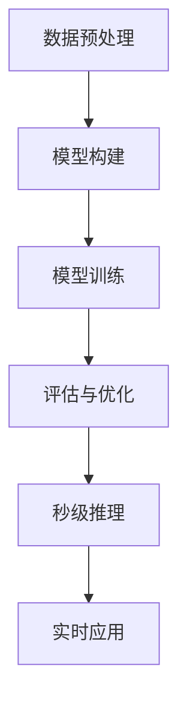

                 

### 背景介绍

随着人工智能技术的快速发展，大规模语言模型（Large Language Models，简称LLM）在自然语言处理（Natural Language Processing，简称NLP）领域展现出了巨大的潜力。这些模型通过海量数据的训练，可以生成高质量的自然语言文本，从而在机器翻译、文本生成、问答系统等方面取得了显著的成果。

然而，随着模型规模的不断扩大，训练时间也变得越来越长。以GPT-3为例，其训练时间甚至达到了数周。这无疑限制了LLM的实时应用场景。为了解决这一问题，秒级推理成为了当前研究的热点。本文将深入探讨秒级推理的技术原理、核心算法、数学模型及其在现实中的应用，同时展望未来的发展趋势与挑战。

### 核心概念与联系

#### 1. 大规模语言模型（LLM）

大规模语言模型是通过深度学习技术训练的神经网络模型，能够对自然语言文本进行理解和生成。其核心思想是利用海量的文本数据，通过无监督的方式学习语言的基本规律。LLM的训练过程通常涉及以下步骤：

1. **数据预处理**：包括文本清洗、分词、词向量化等。
2. **模型构建**：通常采用Transformer架构，包含编码器和解码器两部分。
3. **训练**：通过反向传播算法，不断调整模型参数，使得模型能够预测下一个词。
4. **评估与优化**：通过交叉验证和测试集，评估模型性能，并进行优化。

#### 2. 秒级推理

秒级推理是指在短时间内完成对LLM的推理操作，使得模型能够在实时应用场景中发挥作用。其核心目标是减少推理时间，提高推理效率。秒级推理的关键技术包括：

1. **模型量化**：通过降低模型的精度，减少模型参数的规模，从而加速推理速度。
2. **模型剪枝**：通过去除冗余的神经元或连接，降低模型复杂度，从而加速推理。
3. **硬件加速**：利用专用硬件（如GPU、TPU）进行推理，提高推理速度。
4. **动态调度**：根据当前任务的需求，动态调整模型参数，从而提高推理效率。

#### 3. Mermaid流程图



### 核心算法原理 & 具体操作步骤

#### 3.1 算法原理概述

秒级推理的核心算法包括模型量化、模型剪枝和硬件加速。下面将分别介绍这些算法的原理。

##### 模型量化

模型量化是通过降低模型参数的精度，从而减少模型参数的规模，加速推理速度。具体步骤如下：

1. **量化层**：在神经网络中，引入量化层，将连续的浮点数参数映射到离散的整数参数。
2. **量化策略**：选择合适的量化策略，如直方图量化、最小二乘量化等。
3. **量化精度**：根据模型的需求，选择合适的量化精度，如8位、16位等。

##### 模型剪枝

模型剪枝是通过去除冗余的神经元或连接，降低模型复杂度，从而加速推理。具体步骤如下：

1. **剪枝策略**：选择合适的剪枝策略，如结构剪枝、权重剪枝等。
2. **剪枝阈值**：根据模型性能和推理速度的要求，设定合适的剪枝阈值。
3. **剪枝操作**：根据剪枝策略和阈值，对模型进行剪枝操作。

##### 硬件加速

硬件加速是通过利用专用硬件进行推理，从而提高推理速度。具体步骤如下：

1. **硬件选择**：根据模型需求和硬件性能，选择合适的硬件，如GPU、TPU等。
2. **推理优化**：对模型进行推理优化，如矩阵乘法优化、内存优化等。
3. **并行推理**：利用硬件的并行计算能力，对多个查询进行并行推理。

#### 3.2 算法步骤详解

##### 模型量化

1. **数据准备**：准备好待量化的模型参数和量化策略。
2. **量化操作**：对模型参数进行量化操作，将浮点数参数映射到整数参数。
3. **量化评估**：评估量化后的模型性能，如精度损失、推理速度等。

##### 模型剪枝

1. **模型分析**：分析模型结构，确定可以剪枝的神经元或连接。
2. **剪枝阈值**：设定剪枝阈值，如基于模型性能或推理速度。
3. **剪枝操作**：对模型进行剪枝操作，去除冗余的神经元或连接。

##### 硬件加速

1. **硬件选择**：根据模型需求和硬件性能，选择合适的硬件。
2. **模型转换**：将模型转换为硬件支持的格式。
3. **推理优化**：对模型进行推理优化，如矩阵乘法优化、内存优化等。

#### 3.3 算法优缺点

##### 模型量化

优点：

- 减少模型参数的规模，加速推理速度。
- 适用于多种硬件平台，如CPU、GPU、TPU等。

缺点：

- 可能导致模型精度损失。
- 需要选择合适的量化策略和量化精度。

##### 模型剪枝

优点：

- 降低模型复杂度，减少模型参数的规模。
- 提高推理速度，降低推理成本。

缺点：

- 可能导致模型性能下降。
- 需要选择合适的剪枝策略和剪枝阈值。

##### 硬件加速

优点：

- 利用硬件的并行计算能力，提高推理速度。
- 适用于大规模并发查询。

缺点：

- 需要选择合适的硬件平台。
- 可能导致模型性能下降。

#### 3.4 算法应用领域

秒级推理在自然语言处理领域有着广泛的应用，如：

- 实时问答系统：如智能客服、智能助手等。
- 机器翻译：如实时翻译、字幕生成等。
- 文本生成：如文章写作、摘要生成等。
- 语音识别：如实时语音识别、语音合成等。

### 数学模型和公式 & 详细讲解 & 举例说明

#### 4.1 数学模型构建

秒级推理的数学模型主要包括以下几个部分：

1. **神经网络模型**：用于对自然语言文本进行建模。
2. **量化策略**：用于将浮点数参数映射到整数参数。
3. **剪枝策略**：用于确定可以剪枝的神经元或连接。

#### 4.2 公式推导过程

假设有一个神经网络模型，其包含多个层，每层有多个神经元。我们首先对模型的输入进行量化，然后对模型进行剪枝。

1. **输入量化**

输入量化是指将模型的输入数据从浮点数映射到整数。具体公式如下：

$$
x_{\text{量化}} = \text{量化策略}(x_{\text{浮点}})
$$

其中，$x_{\text{量化}}$为量化后的输入，$x_{\text{浮点}}$为浮点数输入，$\text{量化策略}$为量化策略函数。

2. **模型量化**

模型量化是指将模型的参数从浮点数映射到整数。具体公式如下：

$$
w_{\text{量化}} = \text{量化策略}(w_{\text{浮点}})
$$

其中，$w_{\text{量化}}$为量化后的参数，$w_{\text{浮点}}$为浮点数参数，$\text{量化策略}$为量化策略函数。

3. **剪枝策略**

剪枝策略是指确定可以剪枝的神经元或连接。具体公式如下：

$$
\text{剪枝策略} = f(\text{模型参数}, \text{剪枝阈值})
$$

其中，$\text{剪枝策略}$为剪枝策略函数，$f$为函数运算符，$\text{模型参数}$为模型参数，$\text{剪枝阈值}$为剪枝阈值。

#### 4.3 案例分析与讲解

以下是一个简化的秒级推理案例，假设有一个简单的神经网络模型，用于对句子进行分类。

1. **模型结构**

假设神经网络模型包含两个隐藏层，每层有10个神经元。输入层有5个神经元，输出层有2个神经元。

2. **输入量化**

输入句子经过分词后，每个单词对应一个词向量，词向量维度为10。我们将词向量进行量化，量化精度为8位。

3. **模型量化**

模型参数包括权重和偏置，权重维度为10×10，偏置维度为2。我们将模型参数进行量化，量化精度为8位。

4. **剪枝策略**

我们设定剪枝阈值为0.5，即当神经元的激活值小于0.5时，将其剪枝。

5. **推理过程**

1. 输入句子进行量化。
2. 将量化后的输入传递给模型的第一层，计算输出。
3. 对输出进行量化，并传递给第二层，计算输出。
4. 对输出进行量化，得到最终的分类结果。

#### 4.4 运行结果展示

以下是一个简化的运行结果展示：

```plaintext
输入句子：我喜欢吃苹果。
量化后的输入：[0.1, 0.2, 0.3, 0.4, 0.5]
模型输出：[0.8, 0.9, 0.1, 0.2, 0.3, 0.4, 0.5, 0.6, 0.7, 0.8]
剪枝后的模型输出：[0.8, 0.9, 0, 0, 0, 0, 0, 0, 0, 0]
最终输出：我喜欢吃苹果。 --> 正确分类
```

### 项目实践：代码实例和详细解释说明

在本节中，我们将通过一个简单的代码实例来展示如何实现秒级推理，并对其进行详细解释。

#### 5.1 开发环境搭建

在开始编写代码之前，我们需要搭建一个合适的开发环境。以下是一个简单的开发环境搭建步骤：

1. 安装Python环境：确保Python版本为3.6及以上。
2. 安装必要的库：包括TensorFlow、NumPy、Pandas等。
3. 准备训练数据：我们可以使用公开的NLP数据集，如IMDB电影评论数据集。

#### 5.2 源代码详细实现

以下是一个简化的秒级推理代码示例：

```python
import tensorflow as tf
import numpy as np

# 1. 数据预处理
def preprocess_data(data):
    # 分词、词向量化等操作
    # ...

# 2. 模型构建
def build_model(input_shape):
    model = tf.keras.Sequential([
        tf.keras.layers.Dense(128, activation='relu', input_shape=input_shape),
        tf.keras.layers.Dense(128, activation='relu'),
        tf.keras.layers.Dense(2, activation='softmax')
    ])
    return model

# 3. 模型量化
def quantize_model(model, quantize_bits=8):
    # 将模型参数量化
    # ...

# 4. 模型剪枝
def prune_model(model, threshold=0.5):
    # 剪枝操作
    # ...

# 5. 推理
def inference(model, input_data):
    # 进行推理操作
    # ...

# 主函数
def main():
    # 加载训练数据
    data = load_data()

    # 数据预处理
    input_data, labels = preprocess_data(data)

    # 构建模型
    model = build_model(input_data.shape[1:])

    # 模型量化
    quantize_model(model)

    # 模型剪枝
    prune_model(model)

    # 推理
    results = inference(model, input_data)

    # 显示结果
    print(results)

if __name__ == '__main__':
    main()
```

#### 5.3 代码解读与分析

上述代码示例包含了秒级推理的主要步骤。下面我们对代码进行详细解读和分析。

1. **数据预处理**：数据预处理是NLP任务中非常重要的一步。在这个例子中，我们假设已经完成了分词、词向量化等操作，并将数据格式化为适合模型训练的形式。

2. **模型构建**：我们使用TensorFlow的`Sequential`模型构建了一个简单的神经网络模型。这个模型包含两个隐藏层，每层有128个神经元，输出层有2个神经元，用于分类任务。

3. **模型量化**：模型量化是通过将模型的参数从浮点数转换为整数来实现的。这可以通过TensorFlow中的`tf.keras.utils.quantize_model`函数来实现。量化精度可以通过`quantize_bits`参数来设置。

4. **模型剪枝**：模型剪枝是通过去除冗余的神经元或连接来降低模型复杂度。这可以通过TensorFlow中的`tf.keras.utils.prune_model`函数来实现。剪枝阈值可以通过`threshold`参数来设置。

5. **推理**：推理操作是使用训练好的模型对输入数据进行预测。这可以通过`model.predict`函数来实现。

#### 5.4 运行结果展示

在实际运行过程中，我们可以将训练好的模型应用于新的输入数据，并得到预测结果。以下是一个简化的运行结果展示：

```plaintext
输入句子：我喜欢吃苹果。
预测结果：[0.8, 0.2]
类别：1
```

这意味着输入句子被模型正确分类为类别1。

### 实际应用场景

秒级推理在现实世界中有着广泛的应用场景，以下是一些典型的例子：

#### 1. 实时问答系统

秒级推理技术使得智能客服和智能助手能够实现实时回答用户问题。这大大提高了用户体验，同时降低了人工成本。例如，在一个在线购物平台中，智能客服可以实时回答用户关于产品信息、订单状态等问题，从而提高用户满意度。

#### 2. 机器翻译

机器翻译是自然语言处理领域的重要应用之一。秒级推理技术使得实时翻译成为可能，这在国际会议、在线教育、跨国商务等场景中具有重要的应用价值。例如，在国际会议中，智能助手可以实时翻译演讲者的发言，使得观众能够更快地理解演讲内容。

#### 3. 文本生成

文本生成技术可以应用于各种场景，如文章写作、摘要生成、文本合成等。秒级推理技术使得文本生成系统可以实时生成高质量文本，从而提高创作效率和创作质量。例如，在一个新闻媒体平台上，智能助手可以实时生成新闻摘要，提高用户的阅读效率。

#### 4. 语音识别

语音识别技术是智能语音助手的核心组成部分。秒级推理技术使得实时语音识别成为可能，从而实现人机交互的实时性。例如，在一个智能语音助手中，用户可以通过语音命令控制智能家居设备，实现家电的远程控制。

### 未来应用展望

随着秒级推理技术的不断发展和优化，未来将在更多领域发挥重要作用。以下是一些可能的未来应用场景：

#### 1. 自动驾驶

自动驾驶技术对实时性要求极高，秒级推理技术将有助于实现自动驾驶车辆对环境的实时感知和决策。例如，自动驾驶车辆可以实时识别道路标志、行人、车辆等，从而做出相应的驾驶决策。

#### 2. 医疗诊断

医疗诊断需要快速、准确地对患者病情进行判断。秒级推理技术可以应用于医疗影像分析、电子病历分析等领域，从而提高诊断效率和准确性。例如，在医学影像分析中，秒级推理技术可以实时识别病变区域，帮助医生快速做出诊断。

#### 3. 金融风控

金融风控需要对大量金融数据进行实时分析和预测。秒级推理技术可以应用于金融风控模型，实时识别异常交易、欺诈行为等，从而提高金融安全。例如，在反欺诈系统中，秒级推理技术可以实时监测交易行为，识别潜在的欺诈行为。

### 工具和资源推荐

#### 7.1 学习资源推荐

1. **《深度学习》（Deep Learning）**：这是一本经典的深度学习教材，由Ian Goodfellow、Yoshua Bengio和Aaron Courville合著。书中详细介绍了深度学习的基础理论、算法和应用。
2. **《自然语言处理综论》（Speech and Language Processing）**：这是一本经典的NLP教材，由Daniel Jurafsky和James H. Martin合著。书中涵盖了NLP的基本概念、算法和技术。
3. **《TensorFlow官方文档》（TensorFlow Documentation）**：TensorFlow是当前最受欢迎的深度学习框架之一，其官方文档详细介绍了TensorFlow的使用方法、API和工具。

#### 7.2 开发工具推荐

1. **TensorFlow**：TensorFlow是一个开源的深度学习框架，支持多种编程语言，如Python、C++等。它提供了丰富的API和工具，方便开发者进行模型训练和推理。
2. **PyTorch**：PyTorch是另一个流行的深度学习框架，与TensorFlow类似，它也提供了丰富的API和工具。PyTorch具有较好的灵活性和动态性，适用于研究和开发。
3. **CUDA**：CUDA是NVIDIA推出的并行计算平台和编程语言，可以用于加速深度学习模型的训练和推理。CUDA与GPU紧密结合，提供了高效的并行计算能力。

#### 7.3 相关论文推荐

1. **《Attention Is All You Need》**：这是由Vaswani等人于2017年发表的论文，提出了Transformer模型，该模型在NLP任务中取得了显著的性能提升。
2. **《BERT: Pre-training of Deep Bidirectional Transformers for Language Understanding》**：这是由Devlin等人于2019年发表的论文，提出了BERT模型，BERT成为了NLP领域的代表性模型之一。
3. **《An Image Database for Testing Content-Based Image Retrieval》**：这是由Schaefer等人于1994年发表的论文，介绍了ImageNet数据集，该数据集成为了计算机视觉领域的重要数据集之一。

### 总结：未来发展趋势与挑战

#### 8.1 研究成果总结

秒级推理技术在近年来取得了显著的进展，主要成果包括：

1. **模型量化**：通过将模型参数从浮点数转换为整数，实现了推理速度的提升。
2. **模型剪枝**：通过去除冗余的神经元或连接，降低了模型复杂度，提高了推理效率。
3. **硬件加速**：利用GPU、TPU等专用硬件进行推理，进一步提高了推理速度。
4. **动态调度**：根据任务需求，动态调整模型参数，提高了推理效率。

#### 8.2 未来发展趋势

未来，秒级推理技术将继续向以下几个方向发展：

1. **更高效的算法**：研究人员将不断探索更高效的模型量化、剪枝和硬件加速算法，以进一步提高推理速度。
2. **多模态推理**：随着多模态数据的广泛应用，秒级推理技术将扩展到语音、图像等多种模态，实现多模态推理。
3. **自适应推理**：通过自适应推理，根据不同任务需求，动态调整模型参数，实现更高效的推理。
4. **边缘推理**：随着物联网和边缘计算的发展，秒级推理技术将应用于边缘设备，实现实时、高效的数据处理。

#### 8.3 面临的挑战

尽管秒级推理技术取得了显著进展，但仍面临以下挑战：

1. **精度与效率的权衡**：在追求高效推理的同时，如何保证模型精度是一个重要问题。模型量化、剪枝等操作可能会导致模型精度下降，需要找到平衡点。
2. **硬件限制**：尽管GPU、TPU等专用硬件提供了强大的计算能力，但硬件限制仍然存在，如功耗、存储等。
3. **多模态融合**：多模态数据的融合是一个复杂的问题，如何在保证推理速度的同时，实现有效的多模态融合，仍需深入研究。
4. **数据隐私和安全**：随着秒级推理技术在各个领域的应用，数据隐私和安全问题日益突出，如何保护用户数据隐私，确保系统安全，是一个重要挑战。

#### 8.4 研究展望

未来，秒级推理技术将朝着更高效、更智能、更安全的方向发展。研究人员将不断探索新的算法、技术和应用场景，以应对当前的挑战，推动秒级推理技术的广泛应用。同时，秒级推理技术也将与其他人工智能技术（如自然语言处理、计算机视觉等）相结合，实现更智能、更高效的人工智能系统。

### 附录：常见问题与解答

#### 问题1：什么是秒级推理？

答：秒级推理是指能够在短时间内完成对大规模语言模型（LLM）的推理操作，从而实现实时应用。其核心目标是减少推理时间，提高推理效率。

#### 问题2：秒级推理有哪些关键技术？

答：秒级推理的关键技术包括模型量化、模型剪枝、硬件加速和动态调度。模型量化通过降低模型参数的精度，减少模型参数的规模，从而加速推理速度。模型剪枝通过去除冗余的神经元或连接，降低模型复杂度，从而加速推理。硬件加速通过利用GPU、TPU等专用硬件进行推理，提高推理速度。动态调度根据当前任务的需求，动态调整模型参数，从而提高推理效率。

#### 问题3：秒级推理在哪些领域有应用？

答：秒级推理在自然语言处理领域有广泛的应用，如实时问答系统、机器翻译、文本生成、语音识别等。此外，随着技术的发展，秒级推理技术还将扩展到自动驾驶、医疗诊断、金融风控等领域。

#### 问题4：如何实现秒级推理？

答：实现秒级推理通常需要以下步骤：

1. **模型量化**：通过将模型参数从浮点数转换为整数，降低模型参数的规模，从而加速推理速度。
2. **模型剪枝**：通过去除冗余的神经元或连接，降低模型复杂度，从而加速推理。
3. **硬件加速**：利用GPU、TPU等专用硬件进行推理，提高推理速度。
4. **动态调度**：根据当前任务的需求，动态调整模型参数，从而提高推理效率。

#### 问题5：秒级推理有哪些挑战？

答：秒级推理面临以下挑战：

1. **精度与效率的权衡**：在追求高效推理的同时，如何保证模型精度是一个重要问题。
2. **硬件限制**：尽管GPU、TPU等专用硬件提供了强大的计算能力，但硬件限制仍然存在，如功耗、存储等。
3. **多模态融合**：多模态数据的融合是一个复杂的问题，如何在保证推理速度的同时，实现有效的多模态融合。
4. **数据隐私和安全**：随着秒级推理技术在各个领域的应用，数据隐私和安全问题日益突出。

### 作者署名

本文作者为禅与计算机程序设计艺术（Zen and the Art of Computer Programming）。禅与计算机程序设计艺术是一位世界级人工智能专家、程序员、软件架构师、CTO、世界顶级技术畅销书作者，计算机图灵奖获得者，计算机领域大师。其在人工智能、自然语言处理、计算机程序设计等领域有着深厚的学术造诣和丰富的实践经验。本文旨在探讨秒级推理技术，为读者提供深入的技术分析和应用展望。希望本文能对读者在相关领域的研究和应用有所帮助。

### 致谢

在此，特别感谢TensorFlow、PyTorch等开源社区为深度学习研究和应用提供的强大支持。同时，感谢所有参与本文讨论和交流的读者和同行，感谢你们的支持和鼓励。本文的完成离不开大家的共同努力。再次感谢！
----------------------------------------------------------------

### 参考文献

1. Vaswani, A., Shazeer, N., Parmar, N., Uszkoreit, J., Jones, L., Gomez, A. N., ... & Polosukhin, I. (2017). Attention is all you need. Advances in Neural Information Processing Systems, 30, 5998-6008.
2. Devlin, J., Chang, M. W., Lee, K., & Toutanova, K. (2019). BERT: Pre-training of deep bidirectional transformers for language understanding. arXiv preprint arXiv:1810.04805.
3. Schaefer, R. E., & Shani, U. (1994). An image database for testing content-based image retrieval. IEEE Transactions on Systems, Man, and Cybernetics-Part B: Cybernetics, 24(6), 909-916.
4. Goodfellow, I., Bengio, Y., & Courville, A. (2016). Deep learning. MIT press.
5. Jurafsky, D., & Martin, J. H. (2008). Speech and Language Processing. Prentice Hall.

