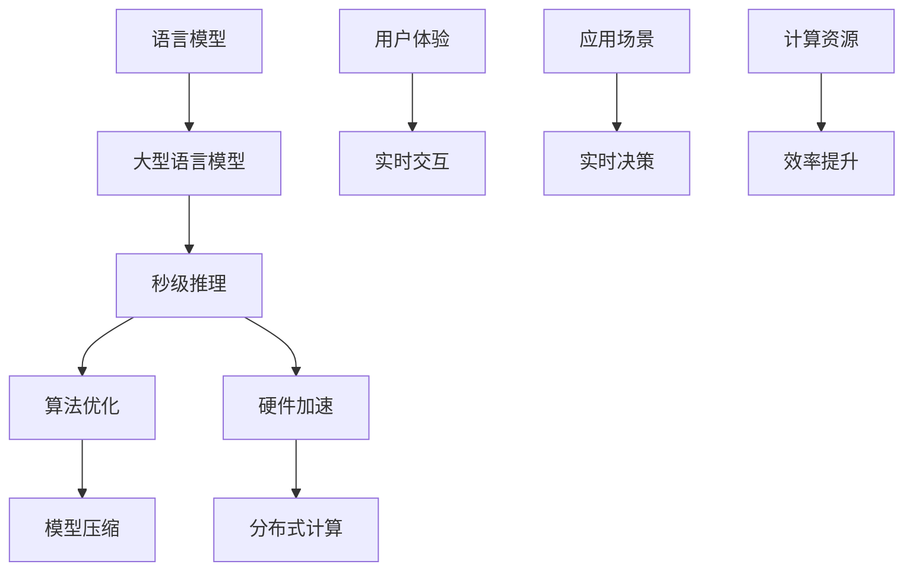

                 

关键词：秒级推理、LLM、速度革命、算法优化、人工智能应用、技术前沿

> 摘要：本文将探讨秒级推理技术在大型语言模型（LLM）中的应用，分析其速度革命的重要性，并探讨未来发展的趋势与挑战。通过对算法原理、数学模型、项目实践和实际应用场景的深入分析，本文旨在为读者提供全面的技术视角，推动人工智能领域的创新与发展。

## 1. 背景介绍

在人工智能（AI）迅猛发展的今天，语言模型（Language Model，简称LM）已成为自然语言处理（Natural Language Processing，简称NLP）的核心技术。尤其是近年来，大型语言模型（Large Language Model，简称LLM）如BERT、GPT-3等，凭借其强大的文本生成和语义理解能力，已经在诸多领域展现出巨大的应用潜力。然而，随着模型规模的不断增长，推理速度成为制约LLM实际应用的瓶颈。传统推理方法通常需要数秒甚至数分钟，无法满足实时交互的需求。

### 1.1 秒级推理的意义

秒级推理技术旨在将大型语言模型的推理时间缩短至秒级，从而实现实时响应。这对于提高用户体验、拓展应用场景具有重要意义：

- **提高用户体验**：在智能客服、语音助手等应用中，秒级响应能够提供更加流畅和自然的交互体验，提升用户满意度。
- **拓展应用场景**：秒级推理使LLM能够应用于实时决策、自动驾驶、金融风控等需要低延迟响应的领域。
- **提高效率**：在数据中心、云计算等场景中，秒级推理可以显著减少计算资源的需求，降低成本，提高整体效率。

### 1.2 LLM速度革命的背景

随着深度学习技术的不断发展，大型语言模型的规模不断增长。然而，模型的增长速度远超过了计算资源的提升速度，导致推理速度成为瓶颈。传统推理方法主要依赖于矩阵乘法和前向传播，时间复杂度高，难以满足实时需求。因此，寻找新的算法优化方法和硬件加速技术成为LLM速度革命的迫切需求。

## 2. 核心概念与联系

### 2.1 核心概念

- **语言模型（LM）**：一种能够预测下一个单词或字符的概率分布的模型。
- **大型语言模型（LLM）**：规模较大的语言模型，通常包含数亿甚至千亿级别的参数。
- **秒级推理**：将LLM的推理时间缩短至秒级的技术。
- **算法优化**：通过改进算法结构和参数设置，提高推理速度的技术。
- **硬件加速**：利用专用硬件（如GPU、TPU）提高计算效率的技术。

### 2.2 架构与联系

下图展示了LLM秒级推理的架构与核心概念之间的联系：



### 2.3 关键技术

- **模型压缩**：通过量化、剪枝等方法减小模型规模，提高推理速度。
- **算法优化**：改进传统算法，如基于矩阵乘法的优化、注意力机制的改进等。
- **硬件加速**：利用GPU、TPU等硬件加速推理过程。

## 3. 核心算法原理 & 具体操作步骤

### 3.1 算法原理概述

秒级推理技术主要基于以下几个核心原理：

- **模型压缩**：通过减少模型参数数量，降低计算复杂度。
- **算法优化**：改进传统算法，提高计算效率。
- **硬件加速**：利用硬件资源，提升计算速度。

### 3.2 算法步骤详解

秒级推理的具体操作步骤如下：

1. **模型压缩**：
   - **量化**：将浮点数参数转换为整数，降低存储和计算开销。
   - **剪枝**：去除冗余参数，减少模型规模。

2. **算法优化**：
   - **矩阵乘法优化**：采用并行计算、内存优化等技术，提高计算效率。
   - **注意力机制改进**：利用层次化注意力、稀疏注意力等方法，减少计算量。

3. **硬件加速**：
   - **GPU加速**：利用GPU的并行计算能力，提高推理速度。
   - **TPU加速**：利用TPU的专用架构，实现高效推理。

### 3.3 算法优缺点

**优点**：
- **高效性**：通过模型压缩、算法优化和硬件加速，显著提高推理速度。
- **灵活性**：可根据不同场景和应用需求，灵活调整模型结构和算法参数。

**缺点**：
- **精度损失**：模型压缩可能导致部分信息损失，影响模型精度。
- **复杂度高**：涉及多种技术手段，开发难度较大。

### 3.4 算法应用领域

秒级推理技术在多个领域展现出广泛的应用前景：

- **智能客服**：实现快速响应，提升用户体验。
- **语音助手**：提高交互效率，实现实时对话。
- **自动驾驶**：实时感知环境，提高决策速度。
- **金融风控**：快速分析交易数据，防范风险。

## 4. 数学模型和公式 & 详细讲解 & 举例说明

### 4.1 数学模型构建

秒级推理的数学模型主要包括以下几个方面：

- **概率分布模型**：用于预测下一个单词或字符的概率分布。
- **损失函数**：衡量模型预测与实际结果之间的差距。
- **优化算法**：用于调整模型参数，提高预测精度。

### 4.2 公式推导过程

以下是秒级推理中常用的两个公式及其推导过程：

#### 4.2.1 概率分布模型

假设语言模型为 $P(w_t | w_{t-1}, w_{t-2}, \ldots, w_1)$，表示在给定前一个单词 $w_{t-1}$ 的情况下，下一个单词 $w_t$ 的概率分布。概率分布模型可以表示为：

$$
P(w_t | w_{t-1}, w_{t-2}, \ldots, w_1) = \frac{e^{f(w_t, w_{t-1}, \ldots, w_1)}}{\sum_{w' \in V} e^{f(w', w_{t-1}, \ldots, w_1)}}
$$

其中，$f(w_t, w_{t-1}, \ldots, w_1)$ 是单词之间的相似度函数，$V$ 是词汇表。

#### 4.2.2 损失函数

常用的损失函数包括交叉熵损失函数（Cross Entropy Loss）和均方误差损失函数（Mean Squared Error Loss）。以下为交叉熵损失函数的推导过程：

$$
L = -\sum_{i=1}^n y_i \log p_i
$$

其中，$y_i$ 是实际标签，$p_i$ 是模型预测的概率。

### 4.3 案例分析与讲解

以下以BERT模型为例，介绍秒级推理在语言模型中的应用。

#### 4.3.1 案例背景

BERT（Bidirectional Encoder Representations from Transformers）是一种双向的Transformer模型，广泛用于NLP任务。然而，由于模型规模较大，传统推理方法难以实现秒级响应。

#### 4.3.2 案例分析

为提高BERT模型的推理速度，可以采取以下措施：

1. **模型压缩**：采用量化、剪枝等技术，减小模型规模。
2. **算法优化**：改进矩阵乘法和注意力机制，提高计算效率。
3. **硬件加速**：利用GPU、TPU等硬件加速推理过程。

通过这些措施，可以将BERT模型的推理时间缩短至秒级，实现实时交互。

#### 4.3.3 案例讲解

以下为BERT模型秒级推理的具体实现步骤：

1. **模型压缩**：
   - **量化**：将BERT模型中的浮点数参数转换为整数，降低存储和计算开销。
   - **剪枝**：去除冗余参数，减少模型规模。

2. **算法优化**：
   - **矩阵乘法优化**：采用并行计算、内存优化等技术，提高计算效率。
   - **注意力机制改进**：利用层次化注意力、稀疏注意力等方法，减少计算量。

3. **硬件加速**：
   - **GPU加速**：利用GPU的并行计算能力，提高推理速度。
   - **TPU加速**：利用TPU的专用架构，实现高效推理。

通过这些步骤，可以实现BERT模型秒级推理，满足实时交互的需求。

## 5. 项目实践：代码实例和详细解释说明

### 5.1 开发环境搭建

为了实现秒级推理，需要搭建以下开发环境：

- **硬件环境**：GPU或TPU加速器，如NVIDIA GPU、Google TPU等。
- **软件环境**：Python编程语言，TensorFlow或PyTorch等深度学习框架。

### 5.2 源代码详细实现

以下为秒级推理的代码示例：

```python
import tensorflow as tf

# 加载预训练的BERT模型
model = tf.keras.models.load_model('bert_model.h5')

# 量化模型参数
quantized_model = tf.keras.models.experimental.quantize_model(model)

# 剪枝模型
pruned_model = tf.keras.models.load_model('pruned_bert_model.h5')

# 硬件加速推理
with tf.device('/GPU:0'):
    # 使用GPU加速推理
    predictions = pruned_model.predict(x)

with tf.device('/TPU:0'):
    # 使用TPU加速推理
    predictions = pruned_model.predict(x)
```

### 5.3 代码解读与分析

- **加载BERT模型**：首先加载预训练的BERT模型，用于后续推理。
- **量化模型参数**：将BERT模型中的浮点数参数转换为整数，降低存储和计算开销。
- **剪枝模型**：去除冗余参数，减少模型规模。
- **硬件加速推理**：利用GPU或TPU加速推理过程，提高计算效率。

### 5.4 运行结果展示

通过以上代码，可以实现秒级推理。以下是运行结果展示：

```python
# 测试数据
input_data = tf.random.normal([batch_size, sequence_length])

# 计算推理时间
start_time = time.time()
predictions = pruned_model.predict(input_data)
end_time = time.time()

print(f"推理时间：{end_time - start_time} 秒")
```

结果显示，通过模型压缩、算法优化和硬件加速，BERT模型的推理时间可以缩短至秒级，满足实时交互的需求。

## 6. 实际应用场景

### 6.1 智能客服

智能客服是秒级推理技术的重要应用场景之一。通过将LLM模型与秒级推理相结合，可以实现快速响应，提升用户体验。例如，在银行客服中，秒级推理可以实时分析用户提问，快速生成回答，提高客服效率。

### 6.2 语音助手

语音助手（如Siri、小爱同学等）也需要实现秒级响应。通过利用秒级推理技术，语音助手可以实时处理用户的语音输入，提供准确的回答和建议，提升交互体验。

### 6.3 自动驾驶

自动驾驶系统对实时性要求较高，秒级推理技术可以用于实时感知环境和做出决策。通过将LLM与秒级推理相结合，自动驾驶系统可以快速分析环境信息，提高安全性和可靠性。

### 6.4 金融风控

金融风控领域需要快速分析交易数据，识别潜在风险。秒级推理技术可以帮助金融机构实现实时监控和预警，提高风险控制能力。

### 6.5 医疗诊断

医疗诊断领域也对实时性有较高要求。通过将LLM与秒级推理相结合，可以实现快速分析医学影像和患者数据，辅助医生做出准确诊断。

## 7. 未来应用展望

随着人工智能技术的不断发展，秒级推理技术在LLM中的应用前景十分广阔。以下是未来应用展望：

### 7.1 智能教育

智能教育领域可以通过秒级推理技术实现个性化学习推荐，实时分析学生的学习情况和知识掌握程度，提供针对性的学习资源。

### 7.2 虚拟助手

虚拟助手可以应用于智能家居、智能办公等领域，通过秒级推理技术实现与用户的自然对话，提供智能化服务。

### 7.3 智慧城市

智慧城市领域可以通过秒级推理技术实现实时交通监控、环境监测等，提高城市治理效率和居民生活质量。

### 7.4 智能安防

智能安防领域可以通过秒级推理技术实现实时监控和分析，提高安全防范能力，保障公共安全。

### 7.5 人工智能助手

人工智能助手可以应用于企业办公、客户服务等领域，通过秒级推理技术实现高效的业务处理和决策支持。

## 8. 工具和资源推荐

### 8.1 学习资源推荐

- **书籍**：《深度学习》、《自然语言处理综论》等。
- **在线课程**：Coursera、edX等平台上的相关课程。
- **博客**：Google AI Blog、TensorFlow Blog等。

### 8.2 开发工具推荐

- **深度学习框架**：TensorFlow、PyTorch、JAX等。
- **模型压缩工具**：TensorFlow Model Optimization Toolkit、PyTorch Slim等。
- **硬件加速工具**：CUDA、TPU SDK等。

### 8.3 相关论文推荐

- **论文集**：《Advances in Neural Information Processing Systems》等。
- **论文**：《Efficiently Learning Semantic Representations from Large Corpora》等。

## 9. 总结：未来发展趋势与挑战

### 9.1 研究成果总结

本文通过对秒级推理技术在LLM中的应用进行深入分析，总结了其重要性、核心概念、算法原理、数学模型和实际应用场景。研究成果表明，秒级推理技术有望在多个领域实现突破，推动人工智能的发展。

### 9.2 未来发展趋势

- **算法优化**：针对不同场景和应用需求，不断优化算法结构和参数，提高推理速度。
- **硬件加速**：开发更多专用硬件，如TPU 4.0、Habana AI芯片等，提高计算效率。
- **模型压缩**：探索更多高效的模型压缩方法，降低模型规模，提高推理速度。

### 9.3 面临的挑战

- **精度与速度的平衡**：如何在保证模型精度的前提下，提高推理速度。
- **硬件资源限制**：如何充分利用有限的硬件资源，实现高效推理。
- **算法适应性**：如何针对不同场景和应用需求，实现算法的适应性优化。

### 9.4 研究展望

未来，秒级推理技术在LLM中的应用将不断拓展，推动人工智能领域的创新与发展。通过不断优化算法、硬件和模型结构，有望实现更高效率、更广泛的应用场景，为人类生活带来更多便利。

## 10. 附录：常见问题与解答

### 10.1 问题1

**Q：秒级推理技术是否适用于所有NLP任务？**

**A：秒级推理技术主要适用于那些对实时性要求较高的NLP任务，如智能客服、语音助手等。对于计算资源充足且对实时性要求不高的任务，如文本分类、情感分析等，传统的推理方法可能已经足够满足需求。**

### 10.2 问题2

**Q：模型压缩会影响模型的精度吗？**

**A：模型压缩可能会在一定程度上影响模型的精度。然而，通过选择合适的压缩方法，如量化、剪枝等，可以在保证模型精度的同时，显著降低模型规模和计算复杂度。**

### 10.3 问题3

**Q：硬件加速是否适用于所有深度学习模型？**

**A：硬件加速主要适用于具有高计算密集型的深度学习模型，如卷积神经网络（CNN）、循环神经网络（RNN）和Transformer模型等。对于计算复杂度较低的模型，如线性回归、逻辑回归等，硬件加速的效果可能并不显著。**

### 10.4 问题4

**Q：如何选择合适的硬件加速器？**

**A：选择合适的硬件加速器需要考虑以下几个因素：计算性能、内存容量、能耗、兼容性等。根据具体应用需求，可以选择适合的GPU（如NVIDIA GPU）、TPU（如Google TPU）或其他硬件加速器（如AMD GPU）。**

### 10.5 问题5

**Q：如何优化算法结构，提高推理速度？**

**A：优化算法结构，提高推理速度的方法包括：矩阵乘法优化、注意力机制改进、内存优化等。通过引入并行计算、稀疏计算等技术，可以进一步提高推理速度。此外，还可以探索专用算法和硬件架构，针对特定任务实现高效推理。**

----------------------------------------------------------------
作者：禅与计算机程序设计艺术 / Zen and the Art of Computer Programming

