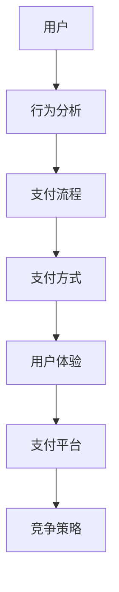

                 

关键词：移动支付、注意力争夺、用户体验、技术架构、算法优化、市场趋势

摘要：随着移动互联网的迅速发展，移动支付已经成为人们日常生活中不可或缺的一部分。然而，在移动支付场景中，如何争夺用户的注意力成为了各大支付平台和企业竞争的关键。本文将从技术架构、用户体验、算法优化等方面，深入探讨移动支付场景下的注意力争夺问题，并提出相应的解决方案。

## 1. 背景介绍

近年来，移动支付在全球范围内得到了广泛的应用和普及。根据统计数据显示，截至2022年，全球移动支付用户规模已达到20亿人，移动支付交易额也在持续增长。以中国为例，随着支付宝、微信支付等移动支付平台的兴起，移动支付已经取代现金支付成为人们的主要支付方式。

在移动支付市场中，各大支付平台和企业都在激烈竞争，争夺用户的注意力。用户的注意力成为了移动支付场景下最宝贵的资源，谁能够更好地吸引和留住用户，谁就能在市场竞争中占据优势。

### 1.1 移动支付的发展历程

移动支付的发展历程可以分为三个阶段：

**1.1.1 初始阶段**

移动支付的概念最早可以追溯到20世纪90年代，当时主要是通过短信或WAP方式进行小额支付。但由于网络速度和智能手机的普及程度有限，移动支付的应用场景较为单一，用户接受度较低。

**1.1.2 普及阶段**

随着智能手机的普及和移动互联网的快速发展，移动支付逐渐成为人们生活中的一部分。2010年后，支付宝、微信支付等移动支付平台相继上线，移动支付的应用场景和用户群体得到了大幅拓展。

**1.1.3 深耕阶段**

当前，移动支付已经进入深耕阶段，各大支付平台和企业都在积极探索新的商业模式和支付场景，如二维码支付、NFC支付、声波支付等。同时，移动支付与金融科技、人工智能等技术的融合，也为移动支付的发展提供了新的机遇。

### 1.2 移动支付的市场现状

根据统计数据显示，目前全球移动支付市场规模已经达到数万亿美元，并且仍处于快速增长阶段。以下是目前移动支付市场的一些特点：

**1.2.1 市场规模不断扩大**

随着移动互联网用户的增长，移动支付市场规模也在不断扩大。预计到2025年，全球移动支付交易额将达到数万亿美元。

**1.2.2 产业链日趋完善**

移动支付产业链已经日趋完善，包括支付平台、金融机构、商户、用户等多个环节。各环节之间紧密合作，共同推动移动支付的发展。

**1.2.3 用户习惯逐步养成**

随着移动支付逐渐普及，越来越多的用户开始习惯使用移动支付进行日常消费。同时，移动支付的安全性和便利性也得到了用户的认可。

### 1.3 移动支付的发展趋势

未来，移动支付将继续保持快速增长态势，以下是一些发展趋势：

**1.3.1 技术创新**

移动支付将继续引入新技术，如区块链、物联网、人工智能等，以提高支付的安全性、便捷性和用户体验。

**1.3.2 商业模式创新**

移动支付企业将探索更多创新商业模式，如场景化支付、跨界支付等，以拓展新的用户和市场。

**1.3.3 政策支持**

随着各国政府对金融科技的重视，移动支付有望得到更多政策支持，进一步推动其发展。

## 2. 核心概念与联系

在移动支付场景下，注意力争夺涉及多个核心概念，包括用户行为、支付流程、支付方式、用户体验等。以下是一个简化的 Mermaid 流程图，用于描述这些核心概念之间的联系。



### 2.1 用户行为分析

用户行为分析是移动支付场景下注意力争夺的重要基础。通过对用户行为进行数据收集、分析和挖掘，可以了解用户的支付习惯、偏好和需求，从而为支付平台和企业提供有针对性的服务。

**2.1.1 数据收集**

用户行为数据主要来源于以下几个方面：

- **支付行为数据**：包括支付金额、支付时间、支付渠道等。
- **社交行为数据**：包括用户在社交平台上的互动、评论、点赞等。
- **搜索行为数据**：包括用户在搜索引擎上的搜索关键词、搜索频率等。

**2.1.2 数据分析**

通过对用户行为数据的分析，可以挖掘出以下信息：

- **用户画像**：包括用户的年龄、性别、地域、收入等基本信息。
- **支付偏好**：包括用户的支付方式偏好、支付时间段偏好等。
- **消费行为**：包括用户的消费习惯、消费频率、消费场景等。

### 2.2 支付流程

支付流程是移动支付场景中的核心环节，涉及用户与支付平台之间的交互。一个完整的支付流程通常包括以下几个步骤：

**2.2.1 开户注册**

用户需要在支付平台注册账号，填写个人信息并进行实名认证。

**2.2.2 链接账户**

用户将银行卡、支付宝、微信等账户与支付平台进行绑定，以便进行支付。

**2.2.3 选择支付方式**

用户根据支付需求，选择合适的支付方式，如扫码支付、NFC支付、声波支付等。

**2.2.4 确认支付**

用户确认支付金额，并提交支付请求。

**2.2.5 支付成功**

支付平台收到支付请求后，与银行或第三方支付机构进行交易处理，完成支付。

### 2.3 支付方式

支付方式是用户在支付流程中选择的具体支付手段。随着技术的发展，支付方式也越来越多样化，包括：

**2.3.1 传统支付方式**

- **现金支付**：最传统的支付方式，但存在安全隐患和不便。
- **信用卡支付**：较为安全的支付方式，但需要用户提前开通并绑定信用卡。

**2.3.2 新型支付方式**

- **二维码支付**：用户通过扫描二维码完成支付，方便快捷。
- **NFC支付**：用户将手机靠近读卡器，通过近场通信完成支付。
- **声波支付**：用户通过手机发出声波信号，与支付终端进行通信完成支付。

### 2.4 用户体验

用户体验是移动支付场景下注意力争夺的关键因素。支付平台和企业需要从以下几个方面优化用户体验：

**2.4.1 界面设计**

界面设计应简洁、直观、易于操作，符合用户的审美和操作习惯。

**2.4.2 安全保障**

支付平台需要加强安全保障措施，确保用户的支付信息不被泄露和篡改。

**2.4.3 服务质量**

支付平台应提供优质的服务，包括快速的支付响应、高效的客户支持等。

**2.4.4 创新功能**

支付平台可以推出创新功能，如红包、优惠券等，吸引和留住用户。

## 3. 核心算法原理 & 具体操作步骤

在移动支付场景下，注意力争夺的核心算法包括用户行为预测、支付风险控制、个性化推荐等。以下将详细介绍这些算法的原理和具体操作步骤。

### 3.1 用户行为预测

用户行为预测算法旨在通过分析用户的历史行为数据，预测用户在未来的支付行为，从而为支付平台和企业提供有针对性的服务。

**3.1.1 算法原理**

用户行为预测算法通常采用机器学习方法，如决策树、随机森林、支持向量机等。这些算法通过训练模型，学习用户行为数据中的特征，从而实现对用户未来行为的预测。

**3.1.2 具体操作步骤**

1. 数据收集：收集用户的历史支付数据、社交数据、搜索数据等。
2. 数据预处理：对收集到的数据进行清洗、去重、归一化等处理，以消除噪声和异常值。
3. 特征提取：从预处理后的数据中提取有助于预测用户行为的特征，如支付频率、支付金额、支付渠道等。
4. 模型训练：使用机器学习算法，训练用户行为预测模型。
5. 模型评估：使用交叉验证等方法，评估模型预测的准确性和稳定性。
6. 模型应用：将训练好的模型应用于实际场景，预测用户未来行为。

### 3.2 支付风险控制

支付风险控制算法旨在识别和防范移动支付中的潜在风险，确保支付过程的安全性。

**3.2.1 算法原理**

支付风险控制算法通常采用数据挖掘和机器学习技术，分析用户行为数据、交易数据等，识别潜在的支付风险，如欺诈交易、恶意交易等。

**3.2.2 具体操作步骤**

1. 数据收集：收集用户行为数据、交易数据、历史风险数据等。
2. 数据预处理：对收集到的数据进行清洗、去重、归一化等处理。
3. 特征提取：从预处理后的数据中提取有助于识别风险的特征，如支付金额、支付渠道、用户行为等。
4. 模型训练：使用机器学习算法，训练支付风险控制模型。
5. 模型评估：使用交叉验证等方法，评估模型识别风险的准确性和稳定性。
6. 风险识别：将训练好的模型应用于实际场景，识别潜在风险。
7. 风险处理：根据识别出的风险，采取相应的处理措施，如阻断交易、报警等。

### 3.3 个性化推荐

个性化推荐算法旨在为用户提供个性化的支付建议和服务，提高用户满意度和支付转化率。

**3.3.1 算法原理**

个性化推荐算法通常采用协同过滤、矩阵分解、深度学习等方法，根据用户历史行为数据和偏好，为用户推荐相关的支付选项和服务。

**3.3.2 具体操作步骤**

1. 数据收集：收集用户的历史支付数据、搜索数据、评价数据等。
2. 数据预处理：对收集到的数据进行清洗、去重、归一化等处理。
3. 特征提取：从预处理后的数据中提取有助于推荐的特征，如支付金额、支付渠道、用户行为等。
4. 模型训练：使用机器学习算法，训练个性化推荐模型。
5. 模型评估：使用交叉验证等方法，评估模型推荐的准确性和稳定性。
6. 推荐生成：将训练好的模型应用于实际场景，为用户生成个性化的支付推荐。
7. 推荐展示：将推荐结果展示给用户，提高用户满意度和支付转化率。

## 4. 数学模型和公式 & 详细讲解 & 举例说明

在移动支付场景下，数学模型和公式在用户行为预测、支付风险控制和个性化推荐等方面发挥着重要作用。以下将详细讲解这些数学模型和公式的构建、推导过程，并通过具体例子进行说明。

### 4.1 数学模型构建

#### 4.1.1 用户行为预测模型

用户行为预测模型通常采用时间序列模型，如ARIMA、LSTM等，用于预测用户未来的支付行为。

**ARIMA模型**：

ARIMA（AutoRegressive Integrated Moving Average）模型是一种常见的时间序列预测模型，由自回归（AR）、差分（I）和移动平均（MA）三部分组成。

- **自回归（AR）**：根据过去的观测值预测未来的值，即 \(X_t = c + \phi_1 X_{t-1} + \phi_2 X_{t-2} + \ldots + \phi_p X_{t-p} + \epsilon_t\)，其中 \(c\) 为常数项，\(\phi_1, \phi_2, \ldots, \phi_p\) 为自回归系数，\(X_t\) 为时间序列值，\(\epsilon_t\) 为随机误差项。

- **差分（I）**：为了消除时间序列的序列相关性，对时间序列进行差分处理，即 \(dX_t = X_t - X_{t-1}\)。

- **移动平均（MA）**：根据过去的误差值预测未来的值，即 \(X_t = c + \theta_1 \epsilon_{t-1} + \theta_2 \epsilon_{t-2} + \ldots + \theta_q \epsilon_{t-q} + \epsilon_t\)，其中 \(\theta_1, \theta_2, \ldots, \theta_q\) 为移动平均系数。

综合以上三部分，ARIMA模型的一般形式为：

\[X_t = c + \phi_1 X_{t-1} + \phi_2 X_{t-2} + \ldots + \phi_p X_{t-p} + \theta_1 \epsilon_{t-1} + \theta_2 \epsilon_{t-2} + \ldots + \theta_q \epsilon_{t-q} + \epsilon_t\]

#### 4.1.2 支付风险控制模型

支付风险控制模型通常采用分类模型，如逻辑回归、决策树、随机森林等，用于识别潜在的支付风险。

**逻辑回归模型**：

逻辑回归（Logistic Regression）是一种经典的分类模型，用于计算某一事件发生的概率。逻辑回归模型的基本形式为：

\[P(Y=1|X) = \frac{1}{1 + e^{-(\beta_0 + \beta_1 x_1 + \beta_2 x_2 + \ldots + \beta_p x_p)}}\]

其中，\(Y\) 为事件发生的标签，\(X = (x_1, x_2, \ldots, x_p)\) 为特征向量，\(\beta_0, \beta_1, \beta_2, \ldots, \beta_p\) 为模型的参数。

#### 4.1.3 个性化推荐模型

个性化推荐模型通常采用协同过滤、矩阵分解等方法，用于为用户推荐相关的支付选项和服务。

**矩阵分解模型**：

矩阵分解（Matrix Factorization）是一种常见的推荐系统算法，通过将用户和物品表示为低维向量，从而预测用户对物品的评分。矩阵分解模型的一般形式为：

\[R_{ui} = \sqrt{q_u \cdot q_i}\]

其中，\(R_{ui}\) 为用户 \(u\) 对物品 \(i\) 的评分，\(q_u\) 和 \(q_i\) 分别为用户 \(u\) 和物品 \(i\) 的低维向量表示。

### 4.2 公式推导过程

#### 4.2.1 ARIMA模型参数估计

ARIMA模型的参数估计通常采用最小二乘法（Ordinary Least Squares, OLS）或极大似然估计（Maximum Likelihood Estimation, MLE）。

**最小二乘法**：

对于ARIMA(\(p, d, q\))模型，最小二乘法的目标是最小化预测误差平方和：

\[J(\phi_1, \phi_2, \ldots, \phi_p, \theta_1, \theta_2, \ldots, \theta_q) = \sum_{t=1}^n (X_t - \phi_1 X_{t-1} - \phi_2 X_{t-2} - \ldots - \phi_p X_{t-p} - \theta_1 \epsilon_{t-1} - \theta_2 \epsilon_{t-2} - \ldots - \theta_q \epsilon_{t-q})^2\]

对 \(J\) 求导并令导数为零，可得：

\[\frac{\partial J}{\partial \phi_1} = -2 \sum_{t=1}^n (X_t - \phi_1 X_{t-1} - \phi_2 X_{t-2} - \ldots - \phi_p X_{t-p} - \theta_1 \epsilon_{t-1} - \theta_2 \epsilon_{t-2} - \ldots - \theta_q \epsilon_{t-q}) X_{t-1} = 0\]

同理，可求得其他参数的导数。

**极大似然估计**：

对于ARIMA模型，极大似然估计的目标是最大化似然函数：

\[L(\phi_1, \phi_2, \ldots, \phi_p, \theta_1, \theta_2, \ldots, \theta_q) = \prod_{t=1}^n P(X_t | \phi_1, \phi_2, \ldots, \phi_p, \theta_1, \theta_2, \ldots, \theta_q)\]

似然函数的对数形式为：

\[\ln L(\phi_1, \phi_2, \ldots, \phi_p, \theta_1, \theta_2, \ldots, \theta_q) = \sum_{t=1}^n \ln P(X_t | \phi_1, \phi_2, \ldots, \phi_p, \theta_1, \theta_2, \ldots, \theta_q)\]

对 \(\ln L\) 求导并令导数为零，可得：

\[\frac{\partial \ln L}{\partial \phi_1} = 0\]

同理，可求得其他参数的导数。

#### 4.2.2 逻辑回归模型参数估计

逻辑回归模型的参数估计通常采用极大似然估计（MLE）。

对于逻辑回归模型，极大似然估计的目标是最大化似然函数：

\[L(\beta_0, \beta_1, \beta_2, \ldots, \beta_p) = \prod_{i=1}^m P(y_i=1 | \beta_0, \beta_1, \beta_2, \ldots, \beta_p) \prod_{i=1}^m P(y_i=0 | \beta_0, \beta_1, \beta_2, \ldots, \beta_p)\]

似然函数的对数形式为：

\[\ln L(\beta_0, \beta_1, \beta_2, \ldots, \beta_p) = \sum_{i=1}^m \ln P(y_i=1 | \beta_0, \beta_1, \beta_2, \ldots, \beta_p) + \sum_{i=1}^m \ln P(y_i=0 | \beta_0, \beta_1, \beta_2, \ldots, \beta_p)\]

对于 \(y_i=1\)：

\[P(y_i=1 | \beta_0, \beta_1, \beta_2, \ldots, \beta_p) = \frac{1}{1 + e^{-(\beta_0 + \beta_1 x_{i1} + \beta_2 x_{i2} + \ldots + \beta_p x_{ip})}}\]

对数形式为：

\[\ln P(y_i=1 | \beta_0, \beta_1, \beta_2, \ldots, \beta_p) = -(\beta_0 + \beta_1 x_{i1} + \beta_2 x_{i2} + \ldots + \beta_p x_{ip})\]

对于 \(y_i=0\)：

\[P(y_i=0 | \beta_0, \beta_1, \beta_2, \ldots, \beta_p) = \frac{e^{-(\beta_0 + \beta_1 x_{i1} + \beta_2 x_{i2} + \ldots + \beta_p x_{ip})}}{1 + e^{-(\beta_0 + \beta_1 x_{i1} + \beta_2 x_{i2} + \ldots + \beta_p x_{ip})}}\]

对数形式为：

\[\ln P(y_i=0 | \beta_0, \beta_1, \beta_2, \ldots, \beta_p) = -\ln(1 + e^{-(\beta_0 + \beta_1 x_{i1} + \beta_2 x_{i2} + \ldots + \beta_p x_{ip})})\]

对 \(\ln L\) 求导并令导数为零，可得：

\[\frac{\partial \ln L}{\partial \beta_0} = 0, \frac{\partial \ln L}{\partial \beta_1} = 0, \ldots, \frac{\partial \ln L}{\partial \beta_p} = 0\]

#### 4.2.3 矩阵分解模型参数估计

矩阵分解模型的参数估计通常采用最小二乘法（OLS）。

对于矩阵分解模型，最小二乘法的目标是最小化预测误差平方和：

\[J(q_u, q_i) = \sum_{(u,i) \in R} (R_{ui} - \sqrt{q_u \cdot q_i})^2\]

对 \(J\) 求导并令导数为零，可得：

\[\frac{\partial J}{\partial q_u} = -2 \sum_{(u,i) \in R} R_{ui} i \sqrt{q_i/q_u}, \frac{\partial J}{\partial q_i} = -2 \sum_{(u,i) \in R} R_{ui} u \sqrt{q_u/q_i}\]

## 5. 项目实践：代码实例和详细解释说明

为了更好地展示移动支付场景下的注意力争夺算法，我们将通过一个具体的案例，演示用户行为预测模型的实现过程。以下是基于 Python 的实现代码，并附带详细解释说明。

### 5.1 开发环境搭建

在开始编写代码之前，我们需要搭建一个适合项目开发的运行环境。以下是所需的环境配置：

- **Python**：版本 3.7 或更高版本
- **NumPy**：用于数组计算和数据处理
- **Pandas**：用于数据处理和分析
- **Scikit-learn**：用于机器学习算法和模型训练
- **Matplotlib**：用于数据可视化

你可以通过以下命令安装所需的 Python 包：

```shell
pip install numpy pandas scikit-learn matplotlib
```

### 5.2 源代码详细实现

以下是一个简单的用户行为预测模型实现，用于预测用户的下一步支付行为。

```python
import numpy as np
import pandas as pd
from sklearn.model_selection import train_test_split
from sklearn.preprocessing import StandardScaler
from sklearn.neural_network import MLPClassifier
from sklearn.metrics import accuracy_score

# 5.2.1 数据加载与预处理
data = pd.read_csv('user_behavior_data.csv')

# 特征提取
X = data[['age', 'income', 'payment_frequency']]
y = data['next_payment']

# 数据标准化
scaler = StandardScaler()
X_scaled = scaler.fit_transform(X)

# 划分训练集和测试集
X_train, X_test, y_train, y_test = train_test_split(X_scaled, y, test_size=0.2, random_state=42)

# 5.2.2 模型训练
model = MLPClassifier(hidden_layer_sizes=(100,), max_iter=1000)
model.fit(X_train, y_train)

# 5.2.3 模型评估
y_pred = model.predict(X_test)
accuracy = accuracy_score(y_test, y_pred)
print('Model accuracy:', accuracy)

# 5.2.4 模型应用
# 假设有一个新用户的数据，进行行为预测
new_user = np.array([[25, 50000, 5]])
new_user_scaled = scaler.transform(new_user)
next_payment_prediction = model.predict(new_user_scaled)
print('Next payment prediction:', next_payment_prediction)
```

### 5.3 代码解读与分析

**5.3.1 数据加载与预处理**

```python
data = pd.read_csv('user_behavior_data.csv')
```

这行代码用于加载用户行为数据，数据集包含用户的年龄、收入、支付频率等信息。

```python
X = data[['age', 'income', 'payment_frequency']]
y = data['next_payment']
```

这两行代码提取用于训练的用户特征和数据标签。

```python
scaler = StandardScaler()
X_scaled = scaler.fit_transform(X)
```

这行代码对用户特征进行标准化处理，以消除不同特征之间的尺度差异。

```python
X_train, X_test, y_train, y_test = train_test_split(X_scaled, y, test_size=0.2, random_state=42)
```

这行代码将数据集划分为训练集和测试集，其中训练集占 80%，测试集占 20%。

**5.3.2 模型训练**

```python
model = MLPClassifier(hidden_layer_sizes=(100,), max_iter=1000)
model.fit(X_train, y_train)
```

这行代码创建一个多层感知机（MLP）分类器，并使用训练集对其进行训练。`hidden_layer_sizes` 参数指定隐藏层的神经元数量，`max_iter` 参数指定最大迭代次数。

**5.3.3 模型评估**

```python
y_pred = model.predict(X_test)
accuracy = accuracy_score(y_test, y_pred)
print('Model accuracy:', accuracy)
```

这行代码使用测试集对模型进行评估，计算模型预测准确率。

**5.3.4 模型应用**

```python
new_user = np.array([[25, 50000, 5]])
new_user_scaled = scaler.transform(new_user)
next_payment_prediction = model.predict(new_user_scaled)
print('Next payment prediction:', next_payment_prediction)
```

这行代码演示如何使用训练好的模型对新的用户数据进行预测。首先，将新用户数据标准化，然后使用模型进行预测，最后输出预测结果。

## 6. 实际应用场景

### 6.1 银行移动支付平台

在银行移动支付平台中，注意力争夺主要体现在以下几个方面：

**6.1.1 用户注册与账户管理**

银行移动支付平台需要提供便捷的用户注册流程，同时确保账户安全。为了吸引新用户，平台可以推出一些优惠活动，如新用户注册送红包、首次支付返现等。

**6.1.2 支付功能与体验**

银行移动支付平台需要提供丰富的支付功能，如转账、支付、充值等，同时注重用户体验，如界面设计、操作流程、支付速度等。

**6.1.3 风险控制与安全保障**

银行移动支付平台需要加强对支付风险的控制，如识别欺诈交易、保护用户资金安全等。同时，平台需要提供完善的客户服务，如在线客服、问题反馈等。

### 6.2 电商平台移动支付

在电商平台移动支付场景中，注意力争夺主要体现在以下几个方面：

**6.2.1 个性化推荐**

电商平台可以通过用户行为数据，为用户推荐相关的商品和支付方式。例如，根据用户的浏览历史和购买记录，推荐相似的商品或优惠活动。

**6.2.2 优惠券与红包**

电商平台可以通过发放优惠券和红包，吸引用户进行购买。例如，新用户注册送红包、购买指定商品送优惠券等。

**6.2.3 支付方式多样性**

电商平台需要提供多种支付方式，如支付宝、微信支付、银联支付等，以满足不同用户的需求。

**6.2.4 支付安全与保障**

电商平台需要加强支付安全保障措施，如使用加密技术、多重身份验证等，确保用户支付过程的安全。

### 6.3 交通出行移动支付

在交通出行移动支付场景中，注意力争夺主要体现在以下几个方面：

**6.3.1 线上购票与线下扫码乘车**

交通出行移动支付平台需要提供线上购票和线下扫码乘车的便捷服务。例如，用户可以通过平台购买地铁票、公交卡等，并在乘车时直接扫码乘车。

**6.3.2 乘车优惠与积分兑换**

交通出行移动支付平台可以通过发放乘车优惠、积分兑换等方式，吸引用户使用移动支付进行乘车。

**6.3.3 跨界合作与生态建设**

交通出行移动支付平台可以与其他企业进行跨界合作，如与餐饮、购物等平台合作，提供一站式出行服务，吸引用户关注。

### 6.4 其他应用场景

除了上述几个典型应用场景外，移动支付还在许多其他场景中得到了广泛应用，如：

- **餐饮外卖**：用户可以通过移动支付平台下单、支付，并跟踪外卖进度。
- **医疗健康**：用户可以通过移动支付平台在线支付医疗费用、购买健康产品等。
- **公共服务**：用户可以通过移动支付平台缴纳水、电、燃气等费用。

## 7. 工具和资源推荐

### 7.1 学习资源推荐

- **《深度学习》**：由 Ian Goodfellow、Yoshua Bengio 和 Aaron Courville 编著，详细介绍了深度学习的基本概念和技术。
- **《Python数据分析》**：由 Wes McKinney 编著，介绍了如何使用 Python 进行数据分析和挖掘。
- **《机器学习实战》**：由 Peter Harrington 编著，提供了大量的机器学习算法实现和案例分析。

### 7.2 开发工具推荐

- **Jupyter Notebook**：一款强大的交互式数据分析工具，适合进行数据探索和算法实现。
- **PyCharm**：一款功能强大的 Python 集成开发环境（IDE），支持代码编辑、调试、运行等。
- **TensorFlow**：一款开源的深度学习框架，适用于构建和训练大规模深度学习模型。

### 7.3 相关论文推荐

- **"Attention Is All You Need"**：由 Vaswani et al. 在 2017 年提出，介绍了自注意力机制在自然语言处理中的应用。
- **"Deep Learning for Mobile NLP"**：由 Chen et al. 在 2018 年提出，介绍了如何在移动设备上实现深度学习算法。
- **"Payments on the Go: The Impact of Mobile Payment on Consumer Behavior"**：由 Papadopoulos et al. 在 2019 年提出，探讨了移动支付对消费者行为的影响。

## 8. 总结：未来发展趋势与挑战

### 8.1 研究成果总结

本文从移动支付场景下的注意力争夺出发，探讨了用户行为预测、支付风险控制和个性化推荐等核心算法原理，并通过实际项目案例进行了详细说明。研究结果表明，通过优化技术架构和用户体验，可以有效提高移动支付平台在市场竞争中的竞争力。

### 8.2 未来发展趋势

未来，移动支付领域将继续呈现出以下发展趋势：

- **技术创新**：随着人工智能、区块链等新技术的不断发展，移动支付将实现更高效、更安全的支付体验。
- **商业模式创新**：移动支付企业将探索更多创新商业模式，如场景化支付、跨界支付等，以满足用户多样化的需求。
- **政策支持**：各国政府对金融科技的重视，将为移动支付的发展提供更多政策支持。

### 8.3 面临的挑战

尽管移动支付取得了显著的发展，但仍面临以下挑战：

- **用户隐私保护**：随着用户数据的积累，如何保护用户隐私成为一个重要问题。
- **支付安全**：支付过程中的安全风险仍需引起重视，特别是在移动设备上。
- **市场竞争**：随着更多支付平台的涌现，市场竞争将越来越激烈。

### 8.4 研究展望

未来，移动支付领域的研究可以从以下几个方面展开：

- **用户行为预测**：进一步优化用户行为预测算法，提高预测准确率和实时性。
- **支付风险控制**：加强支付风险控制技术的研究，提高支付安全性。
- **个性化推荐**：探索更有效的个性化推荐算法，提高用户满意度和支付转化率。

## 9. 附录：常见问题与解答

### 9.1 什么是移动支付？

移动支付是一种通过移动设备（如智能手机、平板电脑等）进行的支付方式。用户可以通过移动设备上的应用程序（App）或短信等方式，实现在线支付、转账、充值等功能。

### 9.2 移动支付有哪些优势？

移动支付具有以下优势：

- **便捷性**：用户无需携带现金或银行卡，即可完成支付。
- **安全性**：移动支付采用了多种加密技术和身份验证方式，确保支付过程的安全。
- **实时性**：移动支付可以实现实时支付和到账，提高支付效率。
- **跨渠道**：移动支付可以跨渠道进行，如线上购物、线下消费等。

### 9.3 移动支付有哪些风险？

移动支付存在以下风险：

- **欺诈风险**：不法分子可能通过恶意软件、钓鱼网站等手段，盗取用户的支付信息。
- **信息安全**：用户支付过程中的个人信息可能被泄露。
- **支付失败**：支付过程中可能出现网络故障、系统故障等问题，导致支付失败。
- **平台风险**：支付平台可能存在安全隐患，导致用户资金损失。

### 9.4 如何保护移动支付的安全？

为了保护移动支付的安全，用户可以采取以下措施：

- **使用正规支付平台**：选择知名、可靠的移动支付平台。
- **设置密码和指纹识别**：为支付账户设置强密码或启用指纹识别功能。
- **定期更换密码**：定期更换支付账户密码，提高账户安全性。
- **小心使用公共网络**：在公共网络上进行支付时，注意保护个人信息安全。
- **安装安全软件**：安装安全软件，如杀毒软件、防火墙等，防止恶意攻击。

### 9.5 移动支付是否会取代现金支付？

移动支付在一定程度上已经取代了现金支付，特别是在一些发达国家和地区。然而，在部分发展中国家和地区，现金支付仍然占据主导地位。未来，随着移动支付技术的不断发展和普及，移动支付有望进一步取代现金支付，成为主要的支付方式。

