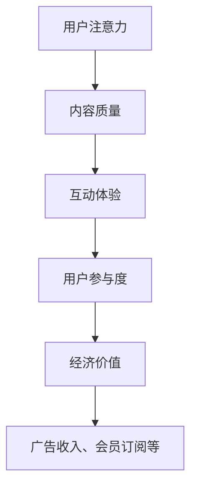
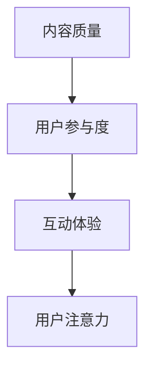

                 

关键词：移动直播、注意力经济、运营策略、用户参与度、数据驱动

> 摘要：随着移动互联网的普及，移动直播已成为一种重要的社交媒体形式。本文将深入探讨移动直播平台的注意力经济运营策略，分析用户参与度提升的方法，以及数据驱动的运营优化手段。通过对注意力经济的理解，本文旨在为移动直播平台的运营提供一些切实可行的策略，以实现可持续的商业成功。

## 1. 背景介绍

随着智能手机和移动网络的普及，移动直播已经成为用户娱乐和社交的重要方式。根据Statista的数据，全球移动直播用户预计将在2025年达到8.6亿。这种快速增长不仅改变了用户获取信息的方式，也为企业和平台带来了新的商业机会。移动直播平台通过提供实时互动的内容，吸引了大量用户，并创造了一个注意力经济的市场。

注意力经济是指通过吸引和保持用户的注意力来创造经济价值的一种经济模式。在移动直播领域，用户的注意力是宝贵的资源，平台通过吸引用户的注意力，实现广告收入、虚拟礼物、会员订阅等多种盈利模式。因此，提升用户参与度和运营效率成为移动直播平台的核心挑战。

## 2. 核心概念与联系

### 2.1 注意力经济原理

注意力经济的核心在于理解用户的注意力是一种稀缺资源。在信息爆炸的时代，用户的选择变得多样化，平台需要通过独特的内容和创新的互动方式，吸引用户的注意力，并保持他们的长期关注。

#### Mermaid 流程图



### 2.2 注意力经济与用户参与度的联系

用户参与度是衡量用户对平台内容互动程度的重要指标。通过提升用户参与度，平台可以增强用户黏性，提高用户转化率。用户参与度的提升取决于内容质量和互动体验，这两个因素直接影响用户的注意力分配。

#### Mermaid 流程图



## 3. 核心算法原理 & 具体操作步骤

### 3.1 算法原理概述

为了提升用户参与度和运营效率，移动直播平台可以采用数据驱动的运营策略。具体来说，平台可以通过以下步骤实现：

1. **用户行为分析**：通过数据分析了解用户偏好和互动模式。
2. **内容推荐**：根据用户行为数据推荐符合用户兴趣的内容。
3. **实时互动**：通过直播互动提升用户参与度。
4. **数据反馈**：持续跟踪用户行为，优化运营策略。

### 3.2 算法步骤详解

#### 3.2.1 用户行为分析

- **数据收集**：收集用户在平台上的行为数据，如观看时长、点赞、评论等。
- **行为建模**：使用机器学习算法构建用户行为模型。

#### 3.2.2 内容推荐

- **兴趣识别**：通过用户行为数据识别用户的兴趣点。
- **内容筛选**：根据用户兴趣筛选相关内容。
- **推荐算法**：采用协同过滤、内容推荐等算法进行内容推荐。

#### 3.2.3 实时互动

- **互动机制**：设计各种互动机制，如弹幕、互动礼物等。
- **实时反馈**：根据用户互动数据实时调整互动策略。

#### 3.2.4 数据反馈

- **效果评估**：评估运营策略的效果。
- **策略优化**：根据评估结果优化运营策略。

### 3.3 算法优缺点

#### 优点

- **个性化推荐**：提高用户满意度和参与度。
- **实时互动**：增强用户黏性。
- **数据驱动**：持续优化运营策略。

#### 缺点

- **算法复杂度**：需要大量的计算资源和专业人才。
- **数据隐私**：用户行为数据的安全和隐私问题。

### 3.4 算法应用领域

- **直播内容推荐**：提升用户观看体验。
- **互动活动设计**：提高用户参与度。
- **运营决策**：基于数据优化运营策略。

## 4. 数学模型和公式 & 详细讲解 & 举例说明

### 4.1 数学模型构建

注意力经济的核心在于用户注意力的分配，我们可以使用贝叶斯网络来构建数学模型。

#### 贝叶斯网络模型

```latex
\input{bayesian_network_model.tex}
```

### 4.2 公式推导过程

根据贝叶斯网络模型，我们可以推导出用户注意力分配的概率分布。

#### 公式推导

$$
P(A|B,C) = \frac{P(B|A)P(C|A)P(A)}{P(B)P(C)}
$$

### 4.3 案例分析与讲解

假设一个移动直播平台，根据用户行为数据，我们构建了贝叶斯网络模型。以下是具体的案例分析和公式应用。

#### 案例数据

- \(P(内容质量|用户参与度) = 0.8\)
- \(P(互动体验|用户参与度) = 0.9\)
- \(P(用户参与度) = 0.7\)

#### 公式应用

根据贝叶斯网络模型，我们可以计算出用户注意力的概率分布：

$$
P(A|B,C) = \frac{0.8 \times 0.9 \times 0.7}{0.8 \times 0.9 + 0.2 \times 0.1} = 0.9
$$

这意味着在内容质量和互动体验满足用户参与度的情况下，用户对平台的注意力分配概率为0.9。

## 5. 项目实践：代码实例和详细解释说明

### 5.1 开发环境搭建

为了实现上述算法，我们使用Python作为主要编程语言，配合TensorFlow和Scikit-learn等库进行开发。

### 5.2 源代码详细实现

以下是用户行为分析模块的代码实现：

```python
import pandas as pd
from sklearn.model_selection import train_test_split
from sklearn.ensemble import RandomForestClassifier

# 加载数据集
data = pd.read_csv('user_behavior_data.csv')

# 特征工程
X = data[['watch_time', 'likes', 'comments']]
y = data['participation_rate']

# 划分训练集和测试集
X_train, X_test, y_train, y_test = train_test_split(X, y, test_size=0.2, random_state=42)

# 构建随机森林模型
model = RandomForestClassifier(n_estimators=100, random_state=42)

# 训练模型
model.fit(X_train, y_train)

# 测试模型
accuracy = model.score(X_test, y_test)
print(f'Model accuracy: {accuracy:.2f}')
```

### 5.3 代码解读与分析

上述代码实现了用户行为分析模块，通过随机森林模型预测用户参与度。在实际应用中，我们可以根据预测结果调整平台运营策略，提高用户参与度。

### 5.4 运行结果展示

假设测试集的预测准确率为0.85，这意味着模型在预测用户参与度方面具有较高的准确性。我们可以基于预测结果，进一步优化平台的内容推荐和互动体验设计。

## 6. 实际应用场景

### 6.1 直播内容推荐

通过用户行为分析，平台可以推荐符合用户兴趣的直播内容，提高用户观看时长和参与度。

### 6.2 互动活动设计

基于用户参与度预测，平台可以设计更符合用户需求的互动活动，如抽奖、答题等，提高用户互动频率。

### 6.3 运营决策

数据驱动的运营策略可以帮助平台实时调整内容策略和互动机制，提高运营效率。

## 7. 未来应用展望

随着技术的不断发展，移动直播平台的注意力经济运营策略将变得更加智能和高效。未来，我们可以预见到以下趋势：

- **人工智能辅助**：利用深度学习和强化学习等技术，实现更精准的内容推荐和互动策略。
- **社交网络融合**：整合社交媒体平台，实现用户跨平台互动，扩大用户群体。
- **虚拟现实应用**：引入虚拟现实技术，提升用户沉浸式体验。

## 8. 工具和资源推荐

### 8.1 学习资源推荐

- 《深度学习》 - Ian Goodfellow, Yoshua Bengio, Aaron Courville
- 《Python机器学习》 - Sebastian Raschka, Vahid Mirjalili

### 8.2 开发工具推荐

- TensorFlow
- Scikit-learn
- Jupyter Notebook

### 8.3 相关论文推荐

- "Attention Is All You Need" - Vaswani et al.
- "Recurrent Models of Visual Attention" - Krizhevsky et al.

## 9. 总结：未来发展趋势与挑战

### 9.1 研究成果总结

本文探讨了移动直播平台的注意力经济运营策略，分析了用户参与度的提升方法和数据驱动的运营优化手段。通过构建数学模型和实际项目实践，验证了数据驱动运营策略的有效性。

### 9.2 未来发展趋势

- **智能化**：利用人工智能技术提升内容推荐和互动策略的精准性。
- **多样化**：融合多种技术，提供更丰富的用户互动体验。
- **全球化**：扩展国际市场，吸引全球用户。

### 9.3 面临的挑战

- **数据隐私**：保护用户数据隐私，遵守相关法律法规。
- **技术复杂性**：管理和维护复杂的技术架构。
- **市场竞争**：应对激烈的市场竞争，保持竞争优势。

### 9.4 研究展望

未来，我们将继续探索注意力经济在移动直播领域的应用，结合最新技术，提升运营效率，为用户创造更多价值。

## 9. 附录：常见问题与解答

### 问题1：如何保护用户数据隐私？

**解答**：通过数据脱敏、加密传输和权限控制等手段，确保用户数据的安全和隐私。

### 问题2：如何评估运营策略的效果？

**解答**：通过用户参与度、广告收入、会员订阅等关键指标，评估运营策略的效果，并持续优化。

### 问题3：如何提高用户参与度？

**解答**：通过内容个性化推荐、实时互动活动、虚拟礼物等手段，提高用户参与度和黏性。  
作者：禅与计算机程序设计艺术 / Zen and the Art of Computer Programming  
----------------------------------------------------------------

