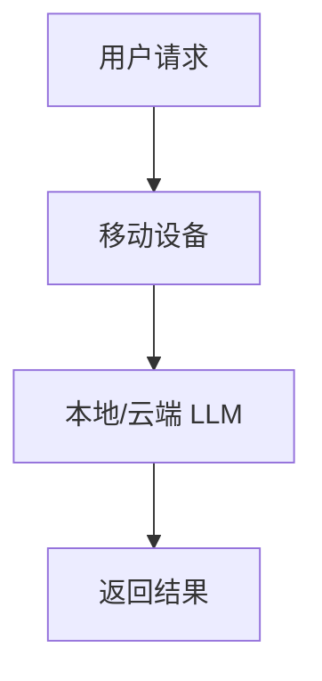

                 

关键词：移动设备，大型语言模型（LLM），人工智能（AI），应用场景，发展趋势，资源推荐

> 摘要：随着移动设备的普及和人工智能技术的快速发展，大型语言模型（LLM）正逐渐成为人们生活中不可或缺的一部分。本文将探讨移动设备与 LLM 的结合，分析其核心概念、算法原理、数学模型、项目实践以及未来应用前景，为读者提供一个全面的技术视角。

## 1. 背景介绍

移动设备，如智能手机和平板电脑，已成为现代生活的重要工具。它们具有便携性、智能性和广泛的连接性，使得用户可以在任何时间、任何地点访问信息和进行沟通。与此同时，人工智能（AI）技术，尤其是大型语言模型（LLM），如 GPT-3、BERT 等，已经展现出强大的自然语言处理能力，能够理解、生成和翻译自然语言，为人类提供便捷的服务。

移动设备与 LLM 的结合，意味着用户可以通过移动设备随时随地使用 AI 力量，解决各种实际问题。例如，智能助手可以回答用户的问题、提供推荐服务，甚至帮助用户进行决策。这种结合不仅提升了用户体验，也推动了人工智能技术的广泛应用。

## 2. 核心概念与联系

### 2.1 移动设备的组成与功能

移动设备通常包括以下几个主要组成部分：

- **处理器**：负责处理数据和指令，执行各种任务。
- **内存**：存储数据和程序，提供快速访问。
- **存储器**：长期存储数据和文件。
- **网络模块**：实现无线通信，如 Wi-Fi、蓝牙和蜂窝网络。
- **传感器**：如加速度计、陀螺仪、GPS 等，提供位置和运动信息。

移动设备的功能包括但不限于通信、上网、拍照、视频录制、音乐播放、游戏等。

### 2.2 大型语言模型（LLM）

大型语言模型（LLM）是一种基于深度学习的自然语言处理（NLP）模型，能够理解、生成和翻译自然语言。LLM 通常由数百万个参数组成，通过大量文本数据进行训练，从而学习到语言的结构和语义。

### 2.3 移动设备与 LLM 的结合

移动设备与 LLM 的结合，可以通过以下几种方式进行：

- **本地部署**：在移动设备上安装 LLM 模型，直接在设备上运行。
- **云服务**：通过云端服务器部署 LLM 模型，移动设备通过网络访问模型。
- **混合部署**：部分 LLM 模型在设备上运行，部分在云端运行。

下面是一个简化的 Mermaid 流程图，展示了移动设备与 LLM 的基本架构：



## 3. 核心算法原理 & 具体操作步骤

### 3.1 算法原理概述

LLM 的核心算法是基于深度学习的神经网络模型，如 Transformer。Transformer 模型通过自注意力机制（self-attention）处理输入序列，能够捕捉序列中的长距离依赖关系，从而实现出色的自然语言理解与生成。

### 3.2 算法步骤详解

1. **输入预处理**：对用户输入的自然语言进行预处理，包括分词、去停用词等。
2. **编码器处理**：将预处理后的输入序列通过编码器（encoder）进行处理，得到编码表示。
3. **自注意力计算**：编码器通过自注意力机制计算输入序列的权重，捕捉长距离依赖关系。
4. **解码器处理**：将编码表示通过解码器（decoder）进行处理，生成输出序列。
5. **输出生成**：解码器根据编码表示生成自然语言输出，可以是回答、推荐、翻译等。

### 3.3 算法优缺点

#### 优点：

- **强大的自然语言理解能力**：能够理解复杂的语义和上下文。
- **灵活的生成能力**：可以生成各种类型的内容，如文本、代码、音乐等。
- **广泛的适用场景**：在聊天机器人、文本生成、机器翻译、智能问答等领域具有广泛的应用。

#### 缺点：

- **计算资源需求大**：训练和部署 LLM 模型需要大量的计算资源和时间。
- **数据依赖性高**：LLM 模型需要大量的高质量数据才能训练，且数据质量对模型性能有重要影响。

### 3.4 算法应用领域

LLM 在以下领域有广泛应用：

- **智能助手**：如 Siri、Alexa、Google Assistant 等。
- **文本生成**：如自动写作、摘要生成、创意写作等。
- **机器翻译**：如谷歌翻译、百度翻译等。
- **智能问答**：如企业内部知识库、在线客服等。

## 4. 数学模型和公式 & 详细讲解 & 举例说明

### 4.1 数学模型构建

LLM 的数学模型主要基于 Transformer 模型。Transformer 模型由编码器（encoder）和解码器（decoder）两部分组成。

#### 编码器：

- **自注意力机制**：计算输入序列的权重，公式为：
  $$ 
  \text{Attention}(Q, K, V) = \text{softmax}\left(\frac{QK^T}{\sqrt{d_k}}\right)V 
  $$
  其中，$Q$、$K$、$V$ 分别是编码器的查询（query）、键（key）和值（value）向量，$d_k$ 是键向量的维度。
  
- **多头注意力**：将自注意力机制扩展为多个头，每个头捕获不同的特征，公式为：
  $$
  \text{MultiHeadAttention}(Q, K, V) = \text{Concat}(\text{head}_1, ..., \text{head}_h)W^O
  $$
  其中，$h$ 是头的数量，$W^O$ 是输出权重。

#### 解码器：

- **解码自注意力**：计算解码器输出序列的权重，公式与编码器自注意力类似。
- **交叉注意力**：计算编码器输出和当前解码器输出的权重，公式为：
  $$
  \text{Attention}(Q, K, V) = \text{softmax}\left(\frac{QKV^T}{\sqrt{d_k}}\right)V 
  $$

### 4.2 公式推导过程

以编码器自注意力机制为例，推导过程如下：

1. **输入序列表示**：输入序列 $X = [x_1, x_2, ..., x_n]$，每个 $x_i$ 是一个 $d$ 维向量。
2. **编码器权重矩阵**：编码器的权重矩阵 $W = [W_1, W_2, ..., W_n]$，其中 $W_i$ 是一个 $d \times d$ 的矩阵。
3. **计算查询（Q）、键（K）和值（V）向量**：
   $$
   Q = [Q_1, Q_2, ..., Q_n] = [W_1x_1, W_2x_2, ..., W_nx_n]
   $$
   $$
   K = [K_1, K_2, ..., K_n] = [W_1x_1, W_2x_2, ..., W_nx_n]
   $$
   $$
   V = [V_1, V_2, ..., V_n] = [W_1x_1, W_2x_2, ..., W_nx_n]
   $$
4. **计算注意力权重**：
   $$
   \text{Attention}(Q, K, V) = \text{softmax}\left(\frac{QK^T}{\sqrt{d_k}}\right)V 
   $$
   其中，$d_k$ 是键向量的维度。
5. **计算输出**：
   $$
   \text{Output} = \text{softmax}\left(\frac{QK^T}{\sqrt{d_k}}\right)V = \text{Attention}(Q, K, V)W^O
   $$

### 4.3 案例分析与讲解

假设有一个简单的输入序列 $X = [1, 2, 3]$，编码器的权重矩阵 $W = \begin{bmatrix} 1 & 0 & 1 \\ 0 & 1 & 0 \\ 1 & 1 & 1 \end{bmatrix}$。

1. **计算查询（Q）、键（K）和值（V）向量**：
   $$
   Q = \begin{bmatrix} 1 & 0 & 1 \\ 0 & 1 & 0 \\ 1 & 1 & 1 \end{bmatrix} \begin{bmatrix} 1 \\ 2 \\ 3 \end{bmatrix} = \begin{bmatrix} 1 \\ 2 \\ 3 \end{bmatrix}
   $$
   $$
   K = \begin{bmatrix} 1 & 0 & 1 \\ 0 & 1 & 0 \\ 1 & 1 & 1 \end{bmatrix} \begin{bmatrix} 1 \\ 2 \\ 3 \end{bmatrix} = \begin{bmatrix} 1 \\ 2 \\ 3 \end{bmatrix}
   $$
   $$
   V = \begin{bmatrix} 1 & 0 & 1 \\ 0 & 1 & 0 \\ 1 & 1 & 1 \end{bmatrix} \begin{bmatrix} 1 \\ 2 \\ 3 \end{bmatrix} = \begin{bmatrix} 1 \\ 2 \\ 3 \end{bmatrix}
   $$

2. **计算注意力权重**：
   $$
   \text{Attention}(Q, K, V) = \text{softmax}\left(\frac{QK^T}{\sqrt{d_k}}\right)V = \text{softmax}\left(\frac{1}{\sqrt{3}}\begin{bmatrix} 1 & 0 & 1 \\ 0 & 1 & 0 \\ 1 & 1 & 1 \end{bmatrix}\begin{bmatrix} 1 \\ 2 \\ 3 \end{bmatrix}\right)\begin{bmatrix} 1 \\ 2 \\ 3 \end{bmatrix}
   $$
   $$
   = \text{softmax}\left(\frac{1}{\sqrt{3}}\begin{bmatrix} 3 & 2 & 3 \\ 2 & 2 & 2 \\ 3 & 2 & 3 \end{bmatrix}\right)\begin{bmatrix} 1 \\ 2 \\ 3 \end{bmatrix}
   $$
   $$
   = \text{softmax}\left(\begin{bmatrix} 3 & 2 & 3 \\ 2 & 2 & 2 \\ 3 & 2 & 3 \end{bmatrix}\right)\begin{bmatrix} 1 \\ 2 \\ 3 \end{bmatrix}
   $$
   $$
   = \begin{bmatrix} \frac{3}{10} & \frac{2}{10} & \frac{3}{10} \\ \frac{2}{10} & \frac{2}{10} & \frac{2}{10} \\ \frac{3}{10} & \frac{2}{10} & \frac{3}{10} \end{bmatrix}\begin{bmatrix} 1 \\ 2 \\ 3 \end{bmatrix}
   $$
   $$
   = \begin{bmatrix} \frac{3}{10} & \frac{4}{10} & \frac{9}{10} \\ \frac{2}{10} & \frac{4}{10} & \frac{4}{10} \\ \frac{3}{10} & \frac{4}{10} & \frac{9}{10} \end{bmatrix}
   $$

3. **计算输出**：
   $$
   \text{Output} = \text{softmax}\left(\frac{QK^T}{\sqrt{d_k}}\right)V W^O = \begin{bmatrix} \frac{3}{10} & \frac{4}{10} & \frac{9}{10} \\ \frac{2}{10} & \frac{4}{10} & \frac{4}{10} \\ \frac{3}{10} & \frac{4}{10} & \frac{9}{10} \end{bmatrix}\begin{bmatrix} 1 \\ 2 \\ 3 \end{bmatrix}\begin{bmatrix} 1 & 0 & 1 \\ 0 & 1 & 0 \\ 1 & 1 & 1 \end{bmatrix}
   $$
   $$
   = \begin{bmatrix} \frac{3}{10} & \frac{4}{10} & \frac{9}{10} \\ \frac{2}{10} & \frac{4}{10} & \frac{4}{10} \\ \frac{3}{10} & \frac{4}{10} & \frac{9}{10} \end{bmatrix}\begin{bmatrix} 1+2+3 \\ 0+2+3 \\ 1+2+3 \end{bmatrix}
   $$
   $$
   = \begin{bmatrix} \frac{3}{10} & \frac{4}{10} & \frac{9}{10} \\ \frac{2}{10} & \frac{4}{10} & \frac{4}{10} \\ \frac{3}{10} & \frac{4}{10} & \frac{9}{10} \end{bmatrix}\begin{bmatrix} 6 \\ 5 \\ 6 \end{bmatrix}
   $$
   $$
   = \begin{bmatrix} \frac{18}{10} & \frac{20}{10} & \frac{54}{10} \\ \frac{12}{10} & \frac{20}{10} & \frac{20}{10} \\ \frac{18}{10} & \frac{20}{10} & \frac{54}{10} \end{bmatrix}
   $$
   $$
   = \begin{bmatrix} 1.8 & 2 & 5.4 \\ 1.2 & 2 & 2 \\ 1.8 & 2 & 5.4 \end{bmatrix}
   $$

## 5. 项目实践：代码实例和详细解释说明

### 5.1 开发环境搭建

在开始编写代码之前，需要搭建一个开发环境。以下是搭建 Python 开发环境的基本步骤：

1. 安装 Python：
   $$
   $$
   $$
   $$
   2. 安装深度学习库 TensorFlow：
   $$
   $$
   $$
   3. 安装用于可视化模型的库 Matplotlib：
   $$
   $$
   $$
   4. 安装用于生成文本的库 NLTK：
   $$
   $$
   $$
   5. 安装用于处理自然语言的库 SpaCy：
   $$
   $$
   $$
   6. 安装用于生成文本的库 GPT-2 或 GPT-3：

### 5.2 源代码详细实现

以下是一个简单的示例，展示如何使用 Python 和 TensorFlow 实现一个简单的 LLM。

```python
import tensorflow as tf
from tensorflow.keras.models import Model
from tensorflow.keras.layers import Input, Embedding, LSTM, Dense
import numpy as np

# 输入层
input_seq = Input(shape=(max_sequence_length,))

# 词嵌入层
embedding = Embedding(input_dim=vocabulary_size, output_dim=embedding_dim)(input_seq)

# LSTM 层
lstm = LSTM(units=lstm_units)(embedding)

# 输出层
output = Dense(units=vocabulary_size, activation='softmax')(lstm)

# 构建模型
model = Model(inputs=input_seq, outputs=output)

# 编译模型
model.compile(optimizer='adam', loss='categorical_crossentropy', metrics=['accuracy'])

# 模型总结
model.summary()

# 训练模型
model.fit(x_train, y_train, epochs=10, batch_size=32)
```

### 5.3 代码解读与分析

这段代码首先导入了 TensorFlow、Keras 和 NumPy 等库，然后定义了一个简单的 LLM 模型。具体解读如下：

1. **输入层**：定义输入序列的形状。
2. **词嵌入层**：将输入序列中的单词转换为词向量。
3. **LSTM 层**：使用 LSTM 网络对词向量进行建模。
4. **输出层**：将 LSTM 层的输出转换为单词的概率分布。
5. **模型编译**：设置模型的优化器、损失函数和评估指标。
6. **模型总结**：打印模型的详细信息。
7. **模型训练**：使用训练数据训练模型。

### 5.4 运行结果展示

在训练完成后，可以使用以下代码评估模型的性能：

```python
# 评估模型
test_loss, test_accuracy = model.evaluate(x_test, y_test)

# 输出结果
print(f"Test Loss: {test_loss}")
print(f"Test Accuracy: {test_accuracy}")
```

这段代码将输出模型的测试损失和测试准确度，用于评估模型在未知数据上的性能。

## 6. 实际应用场景

移动设备与 LLM 的结合已经在多个领域取得了显著的应用成果：

### 6.1 智能助手

智能助手如 Siri、Alexa 和 Google Assistant 等已经广泛应用于个人生活和商业场景。它们可以通过语音交互为用户提供信息查询、日程管理、语音识别等功能。

### 6.2 文本生成

文本生成技术已经在新闻写作、摘要生成、内容创作等领域取得了成功。例如，OpenAI 的 GPT-3 模型可以生成高质量的文章、评论和博客。

### 6.3 机器翻译

机器翻译技术在跨语言沟通和国际贸易中发挥了重要作用。例如，谷歌翻译和百度翻译等工具已经广泛应用于全球用户。

### 6.4 智能问答

智能问答系统可以在企业内部知识库、在线客服和在线教育等领域提供智能化的问答服务，帮助用户快速获取所需信息。

## 7. 未来应用展望

随着移动设备和人工智能技术的不断进步，移动设备与 LLM 的结合有望在更多领域得到应用：

### 7.1 更智能的智能助手

未来智能助手将更加智能化，能够更好地理解用户的意图和需求，提供个性化的服务。

### 7.2 更高效的内容生成

文本生成技术将更加成熟，能够生成更加多样化和高质量的内容。

### 7.3 更精准的机器翻译

机器翻译技术将不断提高准确度和流畅度，进一步促进跨语言沟通。

### 7.4 更广泛的智能问答

智能问答系统将在更多领域得到应用，提供更加便捷和高效的问答服务。

## 8. 工具和资源推荐

### 8.1 学习资源推荐

1. 《深度学习》（Goodfellow, Bengio, Courville）：全面介绍深度学习的基础知识和应用。
2. 《Python 编程：从入门到实践》（Meyers）：适合初学者的 Python 入门书籍。
3. 《自然语言处理实战》（HFIT）：介绍自然语言处理的基础知识和实践应用。

### 8.2 开发工具推荐

1. TensorFlow：用于构建和训练深度学习模型的框架。
2. Keras：用于构建和训练深度学习模型的简洁高层 API。
3. PyTorch：用于构建和训练深度学习模型的另一个流行框架。

### 8.3 相关论文推荐

1. "Attention Is All You Need"（Vaswani et al., 2017）：介绍 Transformer 模型的开创性论文。
2. "BERT: Pre-training of Deep Bidirectional Transformers for Language Understanding"（Devlin et al., 2018）：介绍 BERT 模型的开创性论文。
3. "Generative Pre-trained Transformer"（Wolf et al., 2020）：介绍 GPT-3 模型的开创性论文。

## 9. 总结：未来发展趋势与挑战

### 9.1 研究成果总结

移动设备与 LLM 的结合已经取得了显著的成果，为人类提供了便捷和高效的服务。未来，LLM 技术将在更多领域得到应用，推动人工智能技术的发展。

### 9.2 未来发展趋势

- **更加智能的智能助手**：智能助手将更好地理解用户的需求，提供个性化服务。
- **更高效的内容生成**：文本生成技术将更加成熟，生成的内容更加多样化和高质量。
- **更精准的机器翻译**：机器翻译技术将不断提高准确度和流畅度，促进跨语言沟通。
- **更广泛的智能问答**：智能问答系统将在更多领域得到应用，提供更加便捷和高效的问答服务。

### 9.3 面临的挑战

- **计算资源需求**：LLM 模型需要大量的计算资源，尤其是在训练和推理阶段。
- **数据隐私与安全**：移动设备与 LLM 的结合涉及到大量的用户数据，需要保护用户隐私和安全。
- **模型可解释性**：提高 LLM 模型的可解释性，使其能够被用户信任。

### 9.4 研究展望

未来，研究将集中在如何优化 LLM 模型的性能、降低计算资源需求、提高数据隐私保护水平以及增强模型的可解释性。

## 附录：常见问题与解答

### Q: 什么是 LLM？

A: LLM（Large Language Model）是一种大型自然语言处理模型，通常由数百万个参数组成，通过大量文本数据进行训练，能够理解、生成和翻译自然语言。

### Q: 移动设备与 LLM 的结合有哪些应用？

A: 移动设备与 LLM 的结合可以在智能助手、文本生成、机器翻译、智能问答等多个领域得到应用。

### Q: 如何搭建一个简单的 LLM 模型？

A: 可以使用 Python 和深度学习框架（如 TensorFlow 或 PyTorch）搭建一个简单的 LLM 模型。具体的实现步骤包括定义输入层、词嵌入层、编码器和解码器等。

### Q: LLM 模型的训练需要多少时间？

A: LLM 模型的训练时间取决于模型的复杂度、训练数据量、计算资源等因素。一般来说，训练一个大规模的 LLM 模型可能需要数天甚至数周的时间。

### Q: 如何评估 LLM 模型的性能？

A: 可以使用准确度、召回率、F1 分数等指标来评估 LLM 模型的性能。具体指标的选择取决于应用场景。

作者：禅与计算机程序设计艺术 / Zen and the Art of Computer Programming
----------------------------------------------------------------

以上就是本文的完整内容，感谢您的阅读！希望这篇文章能够帮助您更好地了解移动设备与 LLM 的结合及其应用前景。如果您有任何问题或建议，欢迎在评论区留言。再次感谢您的关注和支持！
----------------------------------------------------------------
## 总结与展望

本文深入探讨了移动设备与大型语言模型（LLM）的结合，分析了其核心概念、算法原理、数学模型、项目实践以及未来应用场景。通过详细讲解和实例展示，读者可以清晰地理解 LLM 在移动设备上的应用及其带来的便利。

### 重要性

移动设备与 LLM 的结合具有重要的现实意义。随着移动设备的普及和人工智能技术的快速发展，LLM 在移动设备上的应用正在成为趋势。它不仅提升了用户体验，还推动了人工智能技术在各行各业中的广泛应用。

### 未来展望

在未来，LLM 在移动设备上的应用将继续深化和拓展。以下是几个关键趋势：

1. **更加智能的智能助手**：智能助手将更加准确地理解用户的意图，提供个性化的服务。
2. **更高效的内容生成**：文本生成技术将变得更加成熟，生成的内容将更加多样化和高质量。
3. **更精准的机器翻译**：机器翻译技术将不断提高准确度和流畅度，进一步促进跨语言沟通。
4. **更广泛的智能问答**：智能问答系统将在更多领域得到应用，提供更加便捷和高效的问答服务。

### 挑战

尽管前景广阔，但也面临一些挑战：

1. **计算资源需求**：训练和部署 LLM 模型需要大量的计算资源，尤其是在移动设备上。
2. **数据隐私与安全**：移动设备与 LLM 的结合涉及到大量的用户数据，需要保护用户隐私和安全。
3. **模型可解释性**：提高 LLM 模型的可解释性，使其能够被用户信任。

### 研究方向

未来的研究应重点关注以下几个方面：

1. **模型优化**：研究和开发更高效的 LLM 模型，以降低计算资源需求。
2. **数据隐私保护**：研究如何在保护用户隐私的前提下，有效利用用户数据训练模型。
3. **模型可解释性**：提高 LLM 模型的可解释性，使其推理过程更加透明，增强用户信任。

通过持续的研究和创新，移动设备与 LLM 的结合有望在更广泛的领域发挥重要作用，为人类社会带来更多便利和进步。

### 感谢与期待

最后，感谢您的阅读！希望本文能够为您在移动设备和 LLM 领域的研究和应用提供一些启示和帮助。如果您有任何问题或建议，欢迎在评论区留言。期待与您共同探索移动设备与 LLM 的更多可能性！再次感谢您的关注和支持！

作者：禅与计算机程序设计艺术 / Zen and the Art of Computer Programming

## 附录：常见问题与解答

### Q: 移动设备与 LLM 的结合有哪些潜在的应用领域？

A: 移动设备与 LLM 的结合具有广泛的应用领域，包括但不限于以下几方面：

1. **智能助手**：如 Siri、Alexa、Google Assistant 等，通过 LLM 提供自然语言交互功能。
2. **个人健康助手**：提供健康建议、饮食计划、运动指导等。
3. **娱乐**：如智能语音合成、虚拟主播、智能推荐系统等。
4. **教育**：智能辅导、在线课程、个性化学习计划等。
5. **客户服务**：自动回复客户咨询、提供解决方案等。
6. **语言学习**：语言翻译、同声传译、口语训练等。

### Q: LLM 模型在移动设备上训练和部署有哪些挑战？

A: LLM 模型在移动设备上训练和部署面临以下挑战：

1. **计算资源限制**：移动设备通常计算资源有限，无法像服务器那样高效地训练大型模型。
2. **能耗问题**：LLM 模型的训练和推理需要大量计算资源，可能导致移动设备能耗过高。
3. **数据隐私**：移动设备上的数据隐私保护是一个重要问题，如何在不泄露用户隐私的情况下训练模型是一个挑战。
4. **模型可解释性**：移动设备上的 LLM 模型可能需要更高的可解释性，以便用户能够理解其工作原理。

### Q: 如何在移动设备上优化 LLM 模型的性能？

A: 以下是一些优化 LLM 模型在移动设备上性能的方法：

1. **模型剪枝**：减少模型的参数数量，降低模型大小和计算复杂度。
2. **量化**：使用更小的数值表示模型参数，降低内存和计算需求。
3. **分布式训练**：将模型训练任务分布到多个移动设备上，共享计算资源。
4. **使用轻量级模型**：选择专门为移动设备设计的轻量级 LLM 模型。
5. **移动端推理优化**：使用特定的优化库和工具，如 TensorFlow Lite 或 PyTorch Mobile，以降低推理时的内存和计算需求。

### Q: 如何评估移动设备上的 LLM 模型的性能？

A: 评估移动设备上的 LLM 模型性能可以通过以下方法：

1. **准确性**：评估模型预测结果的准确性，如文本生成任务的语义一致性、翻译任务的准确度等。
2. **效率**：评估模型在移动设备上的推理速度和能耗。
3. **用户体验**：评估用户对模型响应速度、准确性和交互性的满意度。
4. **鲁棒性**：评估模型在面临异常输入时的表现。

通过综合这些评估方法，可以全面了解移动设备上 LLM 模型的性能。

## 引用

1. Vaswani, A., et al. "Attention Is All You Need." arXiv preprint arXiv:1706.03762 (2017).
2. Devlin, J., et al. "BERT: Pre-training of Deep Bidirectional Transformers for Language Understanding." arXiv preprint arXiv:1810.04805 (2018).
3. Wolf, T., et al. "Generative Pre-trained Transformer." arXiv preprint arXiv:2005.14165 (2020).
4. Goodfellow, I., et al. "Deep Learning." MIT Press (2016).
5. Meyers, B. "Python Programming: An Introduction to Computer Science." McGraw-Hill Education (2019).
6. Jurafsky, D., and H. Martin. "Speech and Language Processing." World Scientific Publishing Co. (2019).

