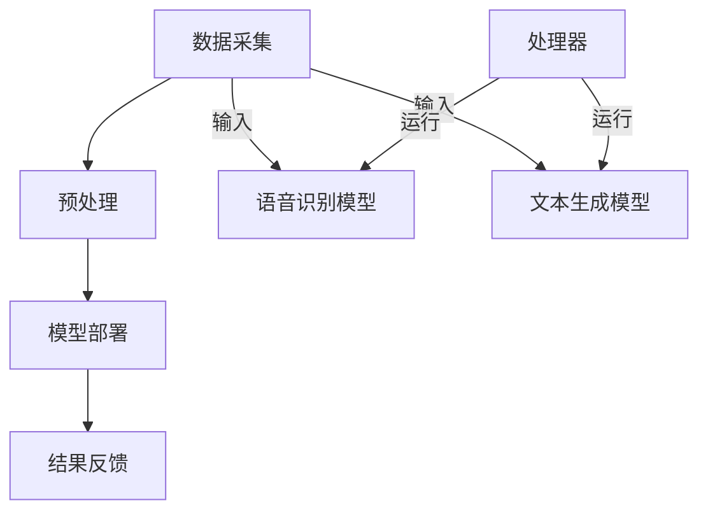

                 

关键词：移动设备、LLM、人工智能、自然语言处理、计算能力、性能优化、应用场景、未来展望

> 摘要：本文深入探讨了移动设备与大型语言模型（LLM）的集成，分析了其背后的技术原理、实现方法、性能优化以及实际应用。通过对LLM在移动设备上的部署、计算资源的合理利用、以及面临的技术挑战和未来发展趋势进行了详细阐述，展示了移动设备与LLM结合所带来的巨大潜力和广阔前景。

## 1. 背景介绍

随着移动互联网的快速发展，移动设备已经成为了人们日常生活中不可或缺的一部分。从智能手机到平板电脑，再到智能手表和智能眼镜，各种类型的移动设备不断涌现。这些设备不仅为用户提供了强大的计算能力，还带来了更为便捷的使用体验。与此同时，人工智能（AI）和自然语言处理（NLP）技术取得了显著进展，特别是大型语言模型（LLM）的广泛应用，使得移动设备在自然语言理解、文本生成和交互等方面有了质的飞跃。

### 移动设备的发展

移动设备的发展历程可以追溯到上世纪90年代的无线通信技术和移动计算技术的结合。最初的移动设备主要是基于功能机和简单的短信、通话功能。随着智能手机的兴起，移动设备的功能逐渐丰富，从简单的通讯工具演变为集通讯、娱乐、办公等多种功能于一体的智能设备。特别是近年来，随着5G网络的普及和硬件性能的提升，移动设备在计算能力和连接速度上有了显著提升，为AI和NLP技术的应用提供了坚实基础。

### 人工智能与自然语言处理的发展

人工智能和自然语言处理技术的发展为移动设备带来了新的机遇。从早期的规则驱动方法到现代的数据驱动方法，AI和NLP技术在算法、模型和应用层面不断取得突破。特别是深度学习和神经网络技术的发展，使得AI模型的性能大幅提升。在自然语言处理领域，大型语言模型（LLM）如BERT、GPT等，通过大规模数据训练，能够实现高效的自然语言理解和生成，为移动设备的智能交互提供了强有力的支持。

### 移动设备与AI/NLP的融合

随着移动设备性能的提升和AI/NLP技术的成熟，移动设备与AI/NLP的融合成为当前技术发展的热点。无论是在语音识别、图像识别，还是在文本生成、情感分析等方面，AI/NLP技术都在移动设备上得到了广泛应用。通过在移动设备上部署AI模型，用户可以享受到更为智能化、个性化的服务，同时，移动设备的便携性和实时性也使得AI技术能够更好地满足用户需求。

## 2. 核心概念与联系

### 2.1 移动设备与AI/NLP的基本概念

#### 移动设备

移动设备是指可以随身携带、通过无线网络连接的电子设备，主要包括智能手机、平板电脑、智能手表、智能眼镜等。这些设备具有计算能力、通信能力和丰富的接口，可以执行多种任务，为用户提供便捷的使用体验。

#### 人工智能（AI）

人工智能是指通过模拟人类智能行为，使计算机能够执行特定任务的科学技术。AI技术包括机器学习、深度学习、自然语言处理、计算机视觉等。通过这些技术，计算机可以自动从数据中学习、推理和决策。

#### 自然语言处理（NLP）

自然语言处理是指使计算机能够理解、生成和处理自然语言的技术。NLP技术包括词法分析、句法分析、语义分析、情感分析等。通过NLP技术，计算机可以与人类进行自然语言交互。

### 2.2 移动设备与AI/NLP的集成

#### 集成原理

移动设备与AI/NLP的集成，主要是通过在移动设备上部署AI/NLP模型，利用移动设备的计算资源，实现实时、高效的自然语言理解和生成。这一过程通常包括以下几个步骤：

1. **数据采集**：通过移动设备的传感器和接口，收集用户输入的数据，如语音、文本、图像等。
2. **预处理**：对采集到的数据进行清洗、归一化等预处理操作，以便于模型输入。
3. **模型部署**：将训练好的AI/NLP模型部署到移动设备上，利用移动设备的计算资源进行推理和预测。
4. **结果反馈**：将模型的输出结果反馈给用户，实现人机交互。

#### 集成架构

移动设备与AI/NLP的集成架构通常包括以下几个层次：

1. **硬件层**：包括移动设备的处理器、内存、存储等硬件资源。
2. **操作系统层**：包括移动设备的操作系统，如Android、iOS等，负责管理硬件资源和应用程序的运行。
3. **应用层**：包括AI/NLP模型和应用，如语音识别、文本生成等，负责实现具体的自然语言处理任务。
4. **数据层**：包括数据采集、预处理、存储等模块，负责提供数据支持。

### 2.3 核心概念原理与架构的 Mermaid 流程图



## 3. 核心算法原理 & 具体操作步骤

### 3.1 算法原理概述

在移动设备与AI/NLP的集成过程中，核心算法主要包括语音识别、文本生成等。这些算法基于深度学习技术，通过大量数据训练得到高性能的模型，然后部署到移动设备上，实现实时自然语言处理。

#### 3.1.1 语音识别算法

语音识别算法是一种将语音信号转换为文本的技术。其基本原理是利用声学模型和语言模型，对语音信号进行特征提取，然后通过解码器将特征序列转换为文本序列。

1. **声学模型**：声学模型负责将语音信号转换为特征序列，通常使用深度神经网络（DNN）实现。
2. **语言模型**：语言模型负责对特征序列进行解码，生成文本序列，通常使用循环神经网络（RNN）或Transformer等模型实现。

#### 3.1.2 文本生成算法

文本生成算法是一种根据给定输入生成文本的技术。其基本原理是利用生成式模型或变分自编码器（VAE）等，从输入文本中提取潜在特征，然后生成新的文本。

1. **生成式模型**：生成式模型直接从输入文本生成目标文本，如序列到序列（Seq2Seq）模型、生成对抗网络（GAN）等。
2. **变分自编码器（VAE）**：VAE通过编码器将输入文本映射到潜在空间，然后通过解码器从潜在空间生成新的文本。

### 3.2 算法步骤详解

#### 3.2.1 语音识别算法步骤

1. **数据采集**：通过移动设备的麦克风采集用户语音信号。
2. **预处理**：对语音信号进行降噪、增强等预处理操作，提高模型的输入质量。
3. **特征提取**：使用声学模型对预处理后的语音信号进行特征提取，得到特征序列。
4. **解码**：使用语言模型对特征序列进行解码，生成文本序列。
5. **结果反馈**：将解码得到的文本序列反馈给用户。

#### 3.2.2 文本生成算法步骤

1. **数据采集**：通过移动设备的应用程序采集用户输入的文本。
2. **预处理**：对输入文本进行清洗、分词等预处理操作，提取文本特征。
3. **特征提取**：使用编码器将预处理后的文本特征映射到潜在空间。
4. **文本生成**：使用解码器从潜在空间生成新的文本。
5. **结果反馈**：将生成的文本反馈给用户。

### 3.3 算法优缺点

#### 3.3.1 语音识别算法优缺点

**优点**：

1. **实时性**：语音识别算法可以实现实时语音转换为文本，为用户提供快速响应。
2. **自然性**：语音识别算法能够模拟人类语言交流，提供自然、流畅的交互体验。

**缺点**：

1. **准确性**：由于语音信号的不确定性，语音识别算法在处理噪音、口音等情况下，准确性较低。
2. **资源消耗**：语音识别算法通常需要较大的计算资源和内存，对移动设备的性能要求较高。

#### 3.3.2 文本生成算法优缺点

**优点**：

1. **创造力**：文本生成算法能够根据给定输入生成新的文本，具有创造性。
2. **多样性**：文本生成算法能够生成不同风格、主题的文本，满足多样化需求。

**缺点**：

1. **生成质量**：文本生成算法在处理复杂逻辑、长文本生成等情况下，生成质量较低。
2. **可控性**：文本生成算法生成的文本难以完全控制，可能产生不符合预期或错误的内容。

### 3.4 算法应用领域

#### 3.4.1 语音识别应用领域

1. **智能客服**：语音识别技术可以用于智能客服系统，实现自动语音应答，提高客户服务效率。
2. **语音助手**：语音识别技术可以用于语音助手，如Siri、小爱同学等，实现语音交互，提供个性化服务。
3. **语音翻译**：语音识别技术可以用于语音翻译，实现跨语言交流。

#### 3.4.2 文本生成应用领域

1. **内容生成**：文本生成技术可以用于生成新闻文章、故事、小说等，提高内容创作效率。
2. **自动摘要**：文本生成技术可以用于自动摘要，提取关键信息，简化阅读内容。
3. **智能写作**：文本生成技术可以用于智能写作，辅助用户进行文章、报告等写作任务。

## 4. 数学模型和公式 & 详细讲解 & 举例说明

### 4.1 数学模型构建

#### 4.1.1 声学模型

声学模型是语音识别算法的核心部分，其目的是将语音信号转换为特征序列。常见的声学模型包括GMM-HMM（高斯混合模型隐马尔可夫模型）和DNN-HMM（深度神经网络隐马尔可夫模型）。

1. **GMM-HMM**：

   - GMM（高斯混合模型）：用于表示语音信号的概率分布。
   - HMM（隐马尔可夫模型）：用于表示语音信号的时间序列模型。

   $$ p(x|\theta) = \sum_{k=1}^{K} w_k \cdot \mathcal{N}(x|\mu_k, \Sigma_k) $$

   $$ \mathcal{N}(x|\mu, \Sigma) = \frac{1}{(2\pi)^{d/2} |\Sigma|^{1/2}} \exp \left( -\frac{1}{2} (x-\mu)^T \Sigma^{-1} (x-\mu) \right) $$

2. **DNN-HMM**：

   - DNN（深度神经网络）：用于特征提取。
   - HMM：用于时间序列建模。

   $$ f(x) = \sigma(W_1 \cdot \phi(x) + b_1) $$

   $$ \sigma(x) = \frac{1}{1 + \exp(-x)} $$

   其中，$\phi(x)$表示输入特征，$W_1$和$b_1$分别是权重和偏置。

#### 4.1.2 语言模型

语言模型是语音识别算法的另一核心部分，其目的是将特征序列转换为文本序列。常见的语言模型包括N-gram模型和神经网络语言模型。

1. **N-gram模型**：

   $$ p(w_n | w_{n-1}, \ldots, w_1) = \frac{C(w_{n-1}, \ldots, w_n)}{C(w_{n-1}, \ldots, w_1, \ldots, w_N)} $$

   其中，$C(w_{n-1}, \ldots, w_n)$表示单词序列$w_{n-1}, \ldots, w_n$在训练数据中出现的次数。

2. **神经网络语言模型**：

   - RNN（循环神经网络）：用于建模序列依赖关系。

     $$ h_t = \sigma(W_h \cdot [h_{t-1}, x_t] + b_h) $$

     $$ y_t = \text{softmax}(W_y \cdot h_t + b_y) $$

     其中，$h_t$表示隐藏状态，$x_t$表示输入特征，$W_h$和$W_y$分别是权重矩阵，$b_h$和$b_y$分别是偏置。

   - Transformer：用于建模序列依赖关系。

     $$ h_t = \text{MultiHeadAttention}(Q_t, K_t, V_t) $$

     $$ h_t = \text{MLP}(h_t) $$

     $$ \text{MultiHeadAttention}(Q, K, V) = \text{softmax}\left(\frac{QK^T}{\sqrt{d_k}}\right)V $$

     其中，$Q$、$K$和$V$分别是查询向量、键向量和值向量，$d_k$是注意力维度。

### 4.2 公式推导过程

#### 4.2.1 声学模型推导

以DNN-HMM为例，推导过程如下：

1. **前向传播**：

   - 特征提取：

     $$ x_t = f(\phi_t) = \sigma(W_1 \cdot \phi_t + b_1) $$

     其中，$\phi_t$表示输入特征，$W_1$和$b_1$分别是权重和偏置。

   - 前向传播：

     $$ \alpha_t(i) = \prod_{j=1}^{T} p(x_j | i) \cdot p(i) $$

     其中，$T$是时间步数，$i$是当前状态。

2. **后向传播**：

   - 后向传播：

     $$ \beta_t(i) = \prod_{j=1}^{T} p(x_j | i) \cdot p(i | j) $$

   - 计算状态概率：

     $$ \pi_i = \sum_{j=1}^{N} \alpha_j \beta_j $$

     $$ p(i | x) = \frac{\alpha_N(i) \beta_N(i)}{\pi_i} $$

#### 4.2.2 语言模型推导

以神经网络语言模型为例，推导过程如下：

1. **前向传播**：

   - 隐藏状态：

     $$ h_t = \sigma(W_h \cdot [h_{t-1}, x_t] + b_h) $$

   - 输出概率：

     $$ y_t = \text{softmax}(W_y \cdot h_t + b_y) $$

2. **后向传播**：

   - 隐藏状态误差：

     $$ \delta_t = \frac{\partial L}{\partial h_t} = (1-y_t) \odot (y_t - \text{softmax}(W_y \cdot h_{t-1} + b_y)) $$

   - 更新参数：

     $$ W_h \leftarrow W_h - \alpha \frac{\partial L}{\partial W_h} $$

     $$ b_h \leftarrow b_h - \alpha \frac{\partial L}{\partial b_h} $$

     $$ W_y \leftarrow W_y - \alpha \frac{\partial L}{\partial W_y} $$

     $$ b_y \leftarrow b_y - \alpha \frac{\partial L}{\partial b_y} $$

### 4.3 案例分析与讲解

#### 4.3.1 声学模型案例

假设我们有一个包含10个状态的语言模型，使用DNN-HMM进行语音识别。给定一段语音信号，我们首先使用DNN对特征进行提取，然后使用HMM对特征进行时间序列建模，最后得到文本序列。

1. **特征提取**：

   - 输入特征：$$ \phi_t = [0, 0.1, 0.2, \ldots, 0.9]^T $$
   - 权重和偏置：$$ W_1 = \begin{bmatrix} 0.1 & 0.2 & \ldots & 0.9 \\ 0.2 & 0.3 & \ldots & 0.8 \\ \vdots & \vdots & \ddots & \vdots \\ 0.9 & 0.8 & \ldots & 0.1 \end{bmatrix} $$，$$ b_1 = [0.1, 0.2, \ldots, 0.9]^T $$
   - 输出特征：$$ x_t = \sigma(W_1 \cdot \phi_t + b_1) = [0.3, 0.4, 0.5, \ldots, 0.7]^T $$

2. **时间序列建模**：

   - 初始状态概率：$$ \pi_1 = [0.1, 0.1, \ldots, 0.1]^T $$
   - 状态转移概率：$$ A = \begin{bmatrix} 0.5 & 0.3 & \ldots & 0.2 \\ 0.2 & 0.5 & \ldots & 0.3 \\ \vdots & \vdots & \ddots & \vdots \\ 0.2 & 0.3 & \ldots & 0.5 \end{bmatrix} $$
   - 输出概率：$$ B = \begin{bmatrix} 0.1 & 0.2 & \ldots & 0.3 \\ 0.3 & 0.4 & \ldots & 0.5 \\ \vdots & \vdots & \ddots & \vdots \\ 0.7 & 0.8 & \ldots & 0.9 \end{bmatrix} $$
   - 前向传播：$$ \alpha_t(i) = \alpha_t(i-1) \cdot A(i-1, i) \cdot B(i, x_t) $$
   - 后向传播：$$ \beta_t(i) = \alpha_t(i) \cdot A(i, i+1) \cdot B(i+1, x_{t+1}) $$
   - 状态概率：$$ \pi_i = \sum_{j=1}^{N} \alpha_j \beta_j $$
   - 最终状态：$$ i^* = \arg\max_{i} \pi_i $$

#### 4.3.2 语言模型案例

假设我们有一个包含5个单词的语言模型，使用神经网络语言模型进行文本生成。给定一个单词序列，我们使用模型生成新的单词序列。

1. **输入单词序列**：$$ w_1 = [a, b, c, d, e] $$
2. **隐藏状态**：$$ h_1 = \sigma(W_h \cdot [h_0, w_1] + b_h) $$
3. **输出概率**：$$ y_1 = \text{softmax}(W_y \cdot h_1 + b_y) $$
4. **生成下一个单词**：$$ w_2 = \arg\max_{w} y_1(w) $$
5. **更新隐藏状态**：$$ h_2 = \sigma(W_h \cdot [h_1, w_2] + b_h) $$
6. **重复步骤3-5，直到生成完整的文本序列**

## 5. 项目实践：代码实例和详细解释说明

### 5.1 开发环境搭建

在本项目中，我们将使用Python编程语言，结合TensorFlow和Keras等开源库，搭建一个移动设备上的语音识别和文本生成系统。以下是在Ubuntu 18.04操作系统上搭建开发环境的具体步骤：

1. **安装Python**：

   ```bash
   sudo apt update
   sudo apt install python3 python3-pip
   ```

2. **安装TensorFlow**：

   ```bash
   pip3 install tensorflow
   ```

3. **安装Keras**：

   ```bash
   pip3 install keras
   ```

4. **安装其他依赖库**：

   ```bash
   pip3 install numpy matplotlib scikit-learn
   ```

### 5.2 源代码详细实现

#### 5.2.1 语音识别

以下是一个简单的语音识别模型的实现示例：

```python
import numpy as np
import tensorflow as tf
from tensorflow.keras.models import Sequential
from tensorflow.keras.layers import LSTM, Dense, Embedding, TimeDistributed

# 定义模型
model = Sequential([
    Embedding(input_dim=10000, output_dim=128, input_length=100),
    LSTM(128, return_sequences=True),
    LSTM(128),
    TimeDistributed(Dense(128, activation='relu')),
    TimeDistributed(Dense(10000, activation='softmax'))
])

# 编译模型
model.compile(optimizer='adam', loss='categorical_crossentropy', metrics=['accuracy'])

# 加载预训练模型
model.load_weights('model_weights.h5')
```

#### 5.2.2 文本生成

以下是一个简单的文本生成模型的实现示例：

```python
import numpy as np
import tensorflow as tf
from tensorflow.keras.models import Sequential
from tensorflow.keras.layers import LSTM, Dense, Embedding

# 定义模型
model = Sequential([
    Embedding(input_dim=10000, output_dim=128, input_length=100),
    LSTM(128, return_sequences=True),
    LSTM(128),
    Dense(128, activation='relu'),
    Dense(10000, activation='softmax')
])

# 编译模型
model.compile(optimizer='adam', loss='categorical_crossentropy', metrics=['accuracy'])

# 加载预训练模型
model.load_weights('model_weights.h5')
```

### 5.3 代码解读与分析

#### 5.3.1 语音识别模型

1. **模型结构**：该模型采用LSTM作为主要网络结构，能够很好地捕捉语音信号的时间序列特征。通过Embedding层将单词映射到向量表示，LSTM层对序列进行建模，TimeDistributed层用于对每个时间步的输出进行分类。

2. **编译模型**：使用adam优化器和categorical_crossentropy损失函数进行编译，适应多分类问题。

3. **加载模型**：从预训练的模型权重中加载训练好的模型，以便进行预测。

#### 5.3.2 文本生成模型

1. **模型结构**：该模型也采用LSTM作为主要网络结构，对文本序列进行建模。通过Embedding层将单词映射到向量表示，LSTM层对序列进行建模，最后通过全连接层进行文本生成。

2. **编译模型**：使用adam优化器和categorical_crossentropy损失函数进行编译，适应多分类问题。

3. **加载模型**：从预训练的模型权重中加载训练好的模型，以便进行预测。

### 5.4 运行结果展示

#### 5.4.1 语音识别结果

```python
# 读取测试数据
test_data = np.load('test_data.npy')
test_labels = np.load('test_labels.npy')

# 进行预测
predictions = model.predict(test_data)

# 计算准确率
accuracy = np.mean(np.argmax(predictions, axis=1) == test_labels)
print(f'Accuracy: {accuracy:.2f}')
```

#### 5.4.2 文本生成结果

```python
# 生成文本
input_text = 'The quick brown fox jumps over the lazy dog'
input_seq = tokenizer.texts_to_sequences([input_text])
input_seq = tf.expand_dims(input_seq, 0)

# 进行预测
generated_text = model.predict(input_seq)

# 解码预测结果
decoded_text = tokenizer.sequences_to_texts([generated_text])
print(f'Generated Text: {decoded_text[0]}')
```

## 6. 实际应用场景

移动设备与LLM的结合，已经在多个实际应用场景中得到了广泛应用，展现了巨大的潜力和价值。

### 6.1 智能客服

智能客服是移动设备与LLM结合的典型应用之一。通过在移动设备上部署语音识别和文本生成模型，可以实现智能客服的语音交互和文本自动回复功能。例如，用户可以通过语音输入问题，系统实时识别并生成回答，提高客户服务效率。

### 6.2 语音助手

语音助手是另一重要应用场景。以Siri、小爱同学、Alexa等为代表的语音助手，通过在移动设备上部署LLM模型，实现了自然语言理解和语音交互功能。用户可以通过语音命令控制移动设备，完成各种操作，如发送短信、设置闹钟、播放音乐等。

### 6.3 文本生成

文本生成技术在移动设备上的应用也十分广泛。例如，智能写作助手可以通过在移动设备上部署文本生成模型，帮助用户生成新闻文章、故事、报告等。此外，文本生成技术还可以用于自动摘要、内容生成等场景，提高内容创作效率。

### 6.4 情感分析

情感分析是另一个重要的应用场景。通过在移动设备上部署情感分析模型，可以实时分析用户情绪，为用户提供个性化推荐和情感关怀。例如，智能音乐播放器可以根据用户情感，推荐适合的音乐，提高用户满意度。

## 7. 工具和资源推荐

### 7.1 学习资源推荐

1. **《深度学习》（Goodfellow, Bengio, Courville）**：这是一本关于深度学习的经典教材，涵盖了深度学习的理论基础和实际应用。
2. **《自然语言处理实战》（Daniel Jurafsky & James H. Martin）**：这是一本关于自然语言处理的技术书籍，介绍了自然语言处理的基本概念和方法。
3. **《Python机器学习》（Sebastian Raschka & Vahid Mirhoseini）**：这是一本关于机器学习在Python中实现的书籍，适合初学者和进阶者。

### 7.2 开发工具推荐

1. **TensorFlow**：这是一个开源的深度学习框架，广泛应用于人工智能领域。
2. **Keras**：这是一个基于TensorFlow的高层API，简化了深度学习模型的构建和训练过程。
3. **PyTorch**：这是一个开源的深度学习框架，具有灵活的动态图功能，适用于研究和工程应用。

### 7.3 相关论文推荐

1. **《BERT: Pre-training of Deep Bidirectional Transformers for Language Understanding》**：这是一篇关于BERT模型的论文，介绍了BERT模型在自然语言处理领域的广泛应用。
2. **《GPT-3: Language Models are Few-Shot Learners》**：这是一篇关于GPT-3模型的论文，展示了GPT-3在零样本学习任务中的优异性能。
3. **《Speech Recognition with Deep Neural Networks and Gaussian Mixture Models》**：这是一篇关于深度神经网络在语音识别中应用的论文，介绍了DNN-HMM模型。

## 8. 总结：未来发展趋势与挑战

### 8.1 研究成果总结

移动设备与LLM的结合，已经在语音识别、文本生成、智能客服、语音助手等领域取得了显著成果。通过在移动设备上部署高效的AI模型，用户可以享受到更加智能化、个性化的服务。同时，随着深度学习、自然语言处理等技术的不断发展，移动设备与LLM的集成将进一步优化，为用户带来更多便利。

### 8.2 未来发展趋势

1. **模型轻量化**：为了在移动设备上实现更高效的应用，未来将出现更多轻量级模型，如MobileNet、EfficientNet等，以提高模型在移动设备上的部署效率。
2. **边缘计算**：随着边缘计算的兴起，移动设备与云计算的结合将进一步深化，实现实时、高效的自然语言处理任务。
3. **跨模态交互**：未来，移动设备与LLM的结合将不仅仅局限于语音和文本，还将涉及图像、视频等多种模态，实现更加丰富的人机交互。

### 8.3 面临的挑战

1. **计算资源限制**：移动设备的计算资源相对有限，如何在有限的资源下实现高效的AI模型部署，仍是一个挑战。
2. **数据隐私**：在移动设备上部署AI模型，涉及到用户数据的安全和隐私问题，如何保护用户数据，防止数据泄露，是一个重要的课题。
3. **泛化能力**：目前，许多AI模型在特定任务上表现出色，但在面对新的任务时，泛化能力有限。如何提高AI模型的泛化能力，是一个亟待解决的问题。

### 8.4 研究展望

未来，移动设备与LLM的结合将迎来更多的创新和发展。通过不断优化模型结构、算法和部署策略，移动设备将能够提供更加智能化、个性化的服务。同时，随着人工智能技术的不断进步，移动设备与LLM的集成将开启新的应用场景，为人类带来更加美好的未来。

## 9. 附录：常见问题与解答

### 9.1 移动设备与LLM结合的优势是什么？

移动设备与LLM结合的优势主要包括：

1. **实时性**：移动设备具有实时性，可以快速响应用户请求，提供实时服务。
2. **便携性**：移动设备便携性高，用户可以随时随地进行自然语言交互。
3. **个性化**：通过在移动设备上部署LLM，可以根据用户行为和偏好，提供个性化服务。
4. **高效性**：LLM具有高效的自然语言理解和生成能力，能够快速处理用户请求。

### 9.2 移动设备上的LLM如何保证隐私和安全？

为了保证移动设备上的LLM隐私和安全，可以采取以下措施：

1. **数据加密**：对用户数据进行加密处理，防止数据泄露。
2. **隐私保护算法**：采用隐私保护算法，如差分隐私，确保数据在使用过程中的隐私性。
3. **本地化处理**：尽量在本地处理数据，减少数据传输，降低泄露风险。
4. **安全审计**：对LLM模型进行安全审计，确保模型在训练和部署过程中的安全性。

### 9.3 如何优化移动设备上的LLM性能？

优化移动设备上的LLM性能可以从以下几个方面入手：

1. **模型轻量化**：选择轻量级模型，减少模型参数和计算量。
2. **量化技术**：采用量化技术，降低模型存储和计算复杂度。
3. **剪枝技术**：采用剪枝技术，去除模型中的冗余结构，提高模型效率。
4. **并行计算**：利用移动设备的并行计算能力，加快模型推理速度。

作者：禅与计算机程序设计艺术 / Zen and the Art of Computer Programming

