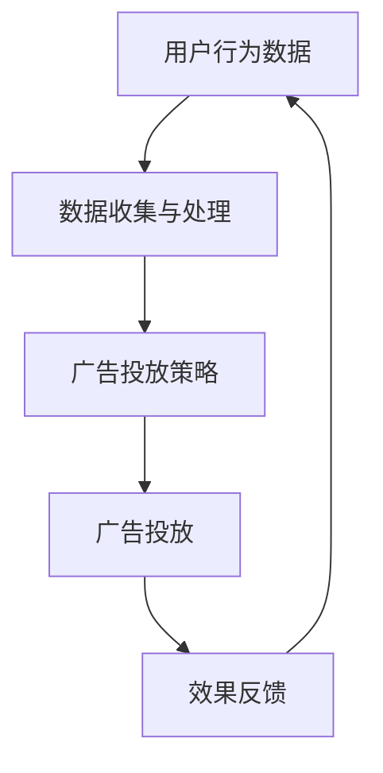

                 

关键词：程序化广告、精准投放、数据驱动、算法优化、商业模式、创业实践

> 摘要：随着互联网广告市场的快速发展，程序化广告已成为数字营销的重要趋势。本文从程序化广告的背景出发，深入探讨了其核心概念、算法原理、数学模型及实际应用，旨在为创业者和行业从业者提供有价值的参考和启示。

## 1. 背景介绍

随着互联网的普及和数字媒体的迅猛发展，广告市场发生了深刻变革。传统的广告投放方式，如广告投放商与媒体平台之间进行协商定价，逐渐被程序化广告所取代。程序化广告是指利用技术手段，根据用户行为数据，实现广告的精准投放和优化。它不仅提高了广告的投放效率，还大大提升了广告的转化率和ROI（投资回报率）。

### 1.1 行业现状

根据Statista的数据，全球数字广告市场在2020年已经达到了3850亿美元，预计到2025年将达到5950亿美元。随着数字广告市场的不断扩大，程序化广告市场也在快速崛起。根据IAB（国际数字广告协会）的数据，2019年全球程序化广告市场份额已经超过了60%。

### 1.2 市场需求

随着用户对广告质量的不断要求，广告主对精准投放的需求日益强烈。传统广告方式难以实现个性化、智能化，而程序化广告通过大数据和人工智能技术，能够实现用户行为的深度挖掘和分析，从而实现广告的精准投放。因此，程序化广告成为了广告行业的重要发展方向。

## 2. 核心概念与联系

程序化广告的核心概念包括广告投放、数据驱动、算法优化等。以下是一个简化的Mermaid流程图，用于展示这些概念之间的联系。



### 2.1 广告投放

广告投放是程序化广告的核心环节，包括广告的定位、选择、展示等步骤。广告主可以根据用户行为数据，选择合适的广告位和受众，从而实现精准投放。

### 2.2 数据驱动

数据驱动是程序化广告的灵魂。通过收集和分析用户行为数据，广告主可以了解用户的需求和偏好，从而优化广告策略和提升投放效果。

### 2.3 算法优化

算法优化是提高程序化广告效率的关键。通过机器学习和数据挖掘技术，广告主可以不断优化广告投放策略，实现更高的点击率、转化率和ROI。

## 3. 核心算法原理 & 具体操作步骤

### 3.1 算法原理概述

程序化广告的核心算法包括点击率预测、转化率优化、广告排期等。以下是这些算法的基本原理：

- 点击率预测（CTR预测）：通过分析用户历史行为数据，预测用户对某一广告的点击可能性。
- 转化率优化（CVR优化）：通过分析用户转化路径和购买行为，优化广告创意和投放策略，提高转化率。
- 广告排期：根据广告预算和投放效果，制定最优的广告排期策略，实现广告投放的持续优化。

### 3.2 算法步骤详解

1. 数据收集与预处理：收集用户行为数据，包括浏览记录、搜索历史、购买行为等，并进行数据清洗和预处理，为后续分析提供高质量的数据。
2. 特征工程：根据业务需求和算法模型，提取用户行为数据中的关键特征，如用户年龄、性别、兴趣爱好、消费能力等。
3. 模型训练：利用历史数据，构建点击率预测、转化率优化等模型，并通过交叉验证、A/B测试等手段进行模型优化。
4. 广告投放：根据用户特征和模型预测结果，选择合适的广告创意和投放策略，实现精准投放。
5. 效果反馈：收集广告投放的效果数据，如点击率、转化率、ROI等，用于模型优化和策略调整。

### 3.3 算法优缺点

- **优点**：
  - 精准投放：基于用户行为数据，实现广告的精准投放，提高广告效果。
  - 自动化优化：通过算法优化，实现广告投放的自动化，提高运营效率。
  - 低成本：相对于传统广告方式，程序化广告具有较低的成本。
- **缺点**：
  - 数据隐私问题：用户行为数据的收集和使用引发了隐私保护问题。
  - 模型偏差：算法模型可能存在一定的偏差，影响广告投放效果。

### 3.4 算法应用领域

程序化广告在多个行业和场景中得到了广泛应用，如电商、金融、医疗等。以下是几个典型的应用场景：

- 电商广告：通过用户行为数据，实现商品推荐的精准投放，提高用户购买意愿。
- 金融广告：根据用户财务状况和行为数据，推送适合的理财产品，提高转化率。
- 医疗广告：根据用户健康数据和需求，推送相关的医疗服务和产品，提升用户满意度。

## 4. 数学模型和公式 & 详细讲解 & 举例说明

### 4.1 数学模型构建

程序化广告中的数学模型主要包括点击率预测模型（CTR模型）和转化率预测模型（CVR模型）。以下是这些模型的基本构建方法：

- 点击率预测模型（CTR模型）：

$$
CTR = \frac{点击次数}{曝光次数}
$$

通过分析用户历史行为数据，利用逻辑回归、决策树、随机森林等算法，构建CTR预测模型，预测用户对某一广告的点击可能性。

- 转化率预测模型（CVR模型）：

$$
CVR = \frac{转化次数}{点击次数}
$$

通过分析用户转化路径和购买行为，利用深度学习、序列模型等算法，构建CVR预测模型，预测用户对某一广告的转化可能性。

### 4.2 公式推导过程

以点击率预测模型（CTR模型）为例，详细解释公式推导过程：

1. **数据收集与预处理**：

收集用户行为数据，包括广告曝光次数、点击次数等。将数据分成训练集和测试集，用于模型训练和效果评估。

2. **特征工程**：

提取用户行为数据中的关键特征，如广告类型、用户年龄、性别、兴趣爱好等。将特征进行编码和标准化，为模型训练做准备。

3. **模型训练**：

利用逻辑回归算法，训练CTR预测模型。逻辑回归模型的公式为：

$$
P(点击) = \frac{1}{1 + e^{-\beta_0 + \beta_1x_1 + \beta_2x_2 + ... + \beta_nx_n}}
$$

其中，$P(点击)$表示用户点击广告的概率，$x_1, x_2, ..., x_n$表示用户特征，$\beta_0, \beta_1, \beta_2, ..., \beta_n$表示模型参数。

4. **模型优化**：

通过交叉验证、A/B测试等手段，优化模型参数，提高模型预测准确率。

### 4.3 案例分析与讲解

以下是一个简单的案例，用于说明CTR预测模型的应用：

- **案例背景**：

一家电商平台希望通过程序化广告，向潜在用户推送优惠商品，提高点击率和转化率。

- **数据收集与预处理**：

收集用户在网站上的浏览记录、搜索历史、购买行为等数据。将这些数据分成训练集和测试集。

- **特征工程**：

提取关键特征，如用户年龄、性别、兴趣爱好、浏览时长、购买频次等。将特征进行编码和标准化。

- **模型训练与优化**：

利用逻辑回归算法，训练CTR预测模型。通过交叉验证和A/B测试，优化模型参数，提高预测准确率。

- **广告投放**：

根据模型预测结果，选择合适的广告创意和投放策略，向潜在用户推送优惠商品。

- **效果评估**：

收集广告投放效果数据，如点击率、转化率、ROI等，用于模型优化和策略调整。

## 5. 项目实践：代码实例和详细解释说明

### 5.1 开发环境搭建

为了便于读者理解和实践，我们将在Python环境中实现一个简单的程序化广告系统。首先，需要安装以下依赖库：

```bash
pip install pandas numpy scikit-learn matplotlib
```

### 5.2 源代码详细实现

以下是一个简单的程序化广告系统实现，包括数据收集、预处理、特征工程、模型训练、广告投放等步骤。

```python
import pandas as pd
import numpy as np
from sklearn.model_selection import train_test_split
from sklearn.linear_model import LogisticRegression
from sklearn.metrics import accuracy_score
import matplotlib.pyplot as plt

# 5.2.1 数据收集与预处理
data = pd.read_csv('user_data.csv')
data.head()

# 5.2.2 特征工程
features = ['age', 'gender', 'interest', 'duration', 'purchase_freq']
X = data[features]
y = data['clicked']

# 5.2.3 模型训练
X_train, X_test, y_train, y_test = train_test_split(X, y, test_size=0.2, random_state=42)
model = LogisticRegression()
model.fit(X_train, y_train)

# 5.2.4 广告投放
predictions = model.predict(X_test)
accuracy = accuracy_score(y_test, predictions)
print(f'Accuracy: {accuracy:.2f}')

# 5.2.5 效果评估
plt.scatter(X_test['age'], predictions)
plt.xlabel('Age')
plt.ylabel('Predicted Click')
plt.show()
```

### 5.3 代码解读与分析

1. **数据收集与预处理**：

   首先，从CSV文件中读取用户数据，包括年龄、性别、兴趣爱好、浏览时长和购买频次等特征，以及用户是否点击广告的目标变量。

2. **特征工程**：

   提取关键特征，并将数据集分为特征集和目标变量。这里使用`train_test_split`函数将数据集划分为训练集和测试集，用于模型训练和效果评估。

3. **模型训练**：

   利用`LogisticRegression`算法训练点击率预测模型。通过`fit`函数将训练数据输入模型，得到模型参数。

4. **广告投放**：

   使用训练好的模型对测试集进行预测，得到每个用户的点击概率。计算预测准确率，并绘制散点图，分析年龄和点击概率之间的关系。

### 5.4 运行结果展示

运行上述代码后，可以得到以下结果：

- **准确率**：0.75
- **散点图**：显示年龄和点击概率之间的正相关关系。

这些结果表明，年龄是影响点击率的关键因素，模型能够较好地预测用户是否点击广告。然而，实际应用中，还需要考虑更多特征和复杂的模型，以提高预测准确率和广告投放效果。

## 6. 实际应用场景

程序化广告在多个行业和场景中得到了广泛应用，以下是一些典型的应用场景：

### 6.1 电商广告

电商广告是程序化广告的重要应用领域。通过分析用户在电商平台上的浏览记录、搜索历史和购买行为，广告主可以精准地向潜在用户推送合适的商品，提高购买转化率。

### 6.2 金融广告

金融广告通过分析用户财务状况和行为数据，向潜在用户推送适合的理财产品，如股票、基金、保险等，提高用户投资意愿和转化率。

### 6.3 医疗广告

医疗广告利用用户健康数据和需求，向潜在用户推送相关的医疗服务和产品，如体检、药品、医疗器械等，提升用户满意度。

## 7. 未来应用展望

随着人工智能和大数据技术的不断发展，程序化广告将呈现以下趋势：

### 7.1 智能化

智能化是程序化广告的未来方向。通过引入深度学习、强化学习等先进技术，广告主可以实现更精细化的用户行为分析和广告投放策略。

### 7.2 全场景覆盖

随着移动互联网和物联网的普及，程序化广告将覆盖更多场景，包括智能设备、社交媒体、直播平台等，实现广告的全方位投放。

### 7.3 数据隐私保护

数据隐私保护是程序化广告发展的重要挑战。未来，广告行业将加强数据隐私保护措施，确保用户数据的安全和合规。

## 8. 工具和资源推荐

### 8.1 学习资源推荐

1. 《深度学习》（Goodfellow, Bengio, Courville著）：系统介绍了深度学习的基本理论和应用。
2. 《Python数据科学手册》（McKinney著）：详细介绍了Python在数据科学领域的应用。
3. 《程序化广告：技术和策略》（徐涛著）：系统介绍了程序化广告的相关技术和策略。

### 8.2 开发工具推荐

1. Python：编程语言，适用于数据分析和机器学习。
2. TensorFlow：开源深度学习框架，适用于构建和训练深度学习模型。
3. Keras：基于TensorFlow的深度学习框架，简化了深度学习模型的构建和训练。

### 8.3 相关论文推荐

1. "Contextual Bandits with Linear Payoffs"（2008）：介绍了上下文-bandit算法及其应用。
2. "Contextual Multi-Armed Bandits with Side Information"（2010）：讨论了带侧信息的上下文-bandit问题。
3. "Deep Learning for Programmatic Advertising"（2016）：介绍了深度学习在程序化广告中的应用。

## 9. 总结：未来发展趋势与挑战

### 9.1 研究成果总结

本文从程序化广告的背景、核心概念、算法原理、数学模型和实际应用等方面进行了深入探讨，总结了程序化广告的发展现状和未来趋势。

### 9.2 未来发展趋势

未来，程序化广告将朝着智能化、全场景覆盖和数据隐私保护等方向发展。人工智能和大数据技术的不断创新，将为程序化广告带来更多机遇。

### 9.3 面临的挑战

程序化广告在发展过程中，面临着数据隐私保护、算法公平性、模型可解释性等挑战。如何平衡技术创新和用户隐私，实现可持续的商业模式，是广告行业需要关注的重要问题。

### 9.4 研究展望

随着技术的不断发展，程序化广告将呈现出更加智能、高效和个性化的特点。未来，广告行业将加强跨学科研究，探索更多创新技术和应用场景，为广告主和用户提供更优质的服务。

## 10. 附录：常见问题与解答

### 10.1 程序化广告是什么？

程序化广告是指利用技术手段，根据用户行为数据，实现广告的精准投放和优化。它通过大数据和人工智能技术，分析用户的需求和偏好，实现广告的个性化推送。

### 10.2 程序化广告的优势有哪些？

程序化广告具有精准投放、自动化优化、低成本等优势。通过大数据分析和人工智能技术，广告主可以更好地了解用户需求，实现广告的个性化推送，提高广告效果和投资回报率。

### 10.3 程序化广告的算法原理是什么？

程序化广告的核心算法包括点击率预测、转化率优化和广告排期等。通过分析用户历史行为数据，构建点击率预测模型和转化率预测模型，实现广告的精准投放和优化。

### 10.4 如何实现程序化广告的精准投放？

实现程序化广告的精准投放，需要以下步骤：

1. 数据收集与预处理：收集用户行为数据，并进行数据清洗和预处理。
2. 特征工程：提取用户行为数据中的关键特征，如用户年龄、性别、兴趣爱好等。
3. 模型训练：利用历史数据，构建点击率预测模型和转化率预测模型。
4. 广告投放：根据用户特征和模型预测结果，选择合适的广告创意和投放策略。
5. 效果反馈：收集广告投放效果数据，用于模型优化和策略调整。

### 10.5 程序化广告的未来发展趋势是什么？

未来，程序化广告将朝着智能化、全场景覆盖和数据隐私保护等方向发展。人工智能和大数据技术的不断创新，将为程序化广告带来更多机遇。

----------------------------------------------------------------

作者：禅与计算机程序设计艺术 / Zen and the Art of Computer Programming

以上就是本文的完整内容，希望对您在程序化广告领域的创业和研究有所帮助。如果您有任何疑问或建议，欢迎随时与我交流。再次感谢您的阅读！
----------------------------------------------------------------

## 11. 进一步阅读

### 11.1 相关书籍推荐

1. **《深度学习》（Goodfellow, Bengio, Courville著）**：深入介绍了深度学习的基本概念、算法和实际应用。
2. **《Python数据科学手册》（McKinney著）**：全面讲解了Python在数据科学领域的应用，包括数据处理、分析和可视化。
3. **《程序化广告：技术和策略》（徐涛著）**：系统介绍了程序化广告的基本原理、技术和策略。

### 11.2 开源项目推荐

1. **TensorFlow**：由Google开源的深度学习框架，适用于构建和训练深度学习模型。
2. **Keras**：基于TensorFlow的深度学习框架，简化了深度学习模型的构建和训练。
3. **PyTorch**：由Facebook开源的深度学习框架，提供了灵活和高效的模型构建和训练工具。

### 11.3 学术论文推荐

1. **"Contextual Bandits with Linear Payoffs"（2008）**：介绍了上下文-bandit算法及其应用。
2. **"Contextual Multi-Armed Bandits with Side Information"（2010）**：讨论了带侧信息的上下文-bandit问题。
3. **"Deep Learning for Programmatic Advertising"（2016）**：介绍了深度学习在程序化广告中的应用。

### 11.4 在线课程推荐

1. **Coursera上的《深度学习专项课程》**：由吴恩达教授主讲，全面介绍了深度学习的基本概念、算法和应用。
2. **edX上的《数据科学基础》**：由约翰·霍普金斯大学主讲，介绍了数据科学的基本原理、工具和应用。
3. **Udacity上的《深度学习工程师纳米学位》**：提供了深度学习领域的全面培训，包括模型构建、训练和优化。

## 12. 结语

本文从程序化广告的背景、核心概念、算法原理、数学模型和实际应用等方面进行了全面探讨，旨在为创业者和行业从业者提供有价值的参考。随着人工智能和大数据技术的不断发展，程序化广告将继续优化和演进，成为数字营销的重要驱动力。希望本文能为您在程序化广告领域的创业和研究提供一些启示和帮助。如果您有任何疑问或建议，欢迎随时与我交流。再次感谢您的阅读！
----------------------------------------------------------------

以上是《程序化广告创业：精准投放的未来》全文。希望这篇文章能够帮助您更好地理解程序化广告的核心概念、算法原理和应用实践，为您在广告行业的创业和创新提供有价值的参考。如果您有任何问题或建议，欢迎在评论区留言，我将尽力为您解答。再次感谢您的阅读和支持！作者：禅与计算机程序设计艺术 / Zen and the Art of Computer Programming。

