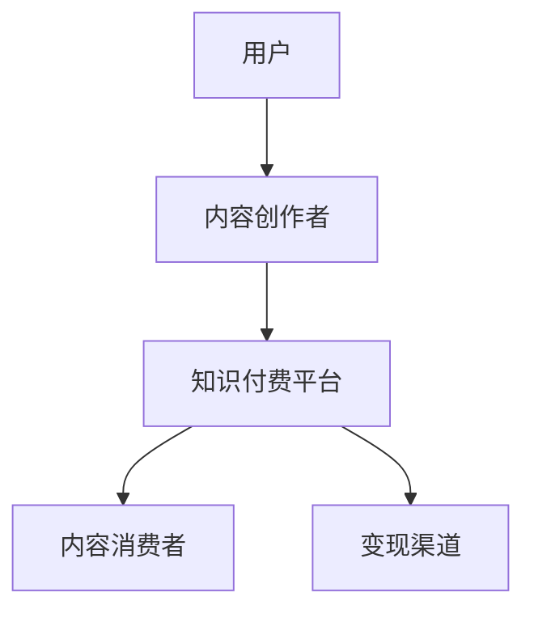

                 

 关键词：知识付费、个人影响力、程序员、策略、品牌建设

> 摘要：随着知识经济的兴起，程序员通过知识付费平台打造个人影响力已成为一种趋势。本文将从多个角度探讨程序员如何利用知识付费平台，通过建立专业形象、创造优质内容、互动社群建设、品牌塑造等策略，提升个人品牌价值，实现职业发展和变现。

## 1. 背景介绍

知识付费，指的是知识拥有者通过互联网平台，将专业知识、技能和经验以付费形式分享给学习者，实现知识的变现。近年来，随着互联网技术的发展，知识付费平台如雨后春笋般涌现，例如知乎Live、得到、网易云课堂等，为程序员提供了展示专业能力、提升个人影响力的绝佳机会。

程序员群体拥有丰富的技术知识和实践经验，但在传统职场中，往往难以将自身的价值充分体现。知识付费平台为程序员提供了一个新的舞台，使他们能够通过分享知识和经验，打造个人品牌，提升职业竞争力。

## 2. 核心概念与联系

### 2.1 知识付费平台

知识付费平台是连接知识拥有者和学习者的桥梁，提供了内容创作、发布、变现的完整生态。以下是一个简化的知识付费平台架构：



### 2.2 个人影响力

个人影响力是指个人在社会中的认知度、信任度和影响力。在知识付费领域，个人影响力的大小直接决定了内容被接受和认可的程度，从而影响收入和职业发展。

### 2.3 品牌建设

品牌建设是提升个人影响力的重要手段。一个成功的品牌能够传递出专业的形象、可靠的质量和独特的价值，从而在竞争中脱颖而出。

## 3. 核心算法原理 & 具体操作步骤

### 3.1 算法原理概述

程序员利用知识付费打造个人影响力的算法，可以概括为以下步骤：

1. **内容定位**：确定自身专业领域和受众群体。
2. **内容创作**：创造有价值、有深度、有吸引力的内容。
3. **平台选择**：选择合适的知识付费平台。
4. **互动社群**：与受众互动，提升粉丝黏性。
5. **品牌塑造**：打造个人品牌，树立专业形象。
6. **变现路径**：通过内容付费、咨询服务等多种方式实现变现。

### 3.2 算法步骤详解

#### 3.2.1 内容定位

内容定位是成功的关键。程序员需要明确自身的专业领域，如前端开发、后端开发、数据分析等，并分析目标受众的需求和兴趣。

#### 3.2.2 内容创作

内容创作是提升个人影响力的核心。程序员需要创作有价值的内容，包括技术文章、视频教程、线上课程等。以下是一些创作要点：

- **深度**：深入探讨技术细节，提供专业见解。
- **广度**：涵盖不同领域，展示全面的技术能力。
- **趣味性**：用生动的语言和案例，让内容易于理解。

#### 3.2.3 平台选择

选择合适的知识付费平台，可以帮助程序员更好地展示内容，扩大影响力。以下是一些知名平台的特点：

- **知乎Live**：适合分享专业知识和经验，互动性强。
- **得到**：适合长篇内容和深度讲解，用户付费意愿高。
- **网易云课堂**：适合系统化教学，课程形式多样。

#### 3.2.4 互动社群

互动社群是提升粉丝黏性的重要手段。程序员可以通过以下方式与受众互动：

- **问答**：在平台或社区中回答问题，展示专业能力。
- **直播**：定期进行直播，与粉丝面对面交流。
- **社群**：建立微信群、QQ群等，进行深度交流。

#### 3.2.5 品牌塑造

品牌塑造是提升个人影响力的重要环节。程序员可以通过以下方式打造个人品牌：

- **专业形象**：通过专业的形象设计、个人网站等，传递专业形象。
- **内容风格**：保持内容风格一致，形成个人特色。
- **口碑传播**：通过优秀的作品和口碑，吸引更多关注。

#### 3.2.6 变现路径

变现路径包括内容付费、咨询服务、广告推广等多种方式。程序员可以根据自身情况，选择合适的变现路径。

### 3.3 算法优缺点

#### 优点

- **快速变现**：通过知识付费，程序员可以实现快速变现。
- **职业发展**：个人影响力的提升有助于职业发展。
- **平台支持**：知识付费平台提供了丰富的工具和服务，帮助程序员更好地展示内容。

#### 缺点

- **创作成本**：内容创作需要投入大量时间和精力。
- **市场竞争**：知识付费市场竞争激烈，需要不断提升自身能力。

### 3.4 算法应用领域

算法原理和应用步骤适用于所有希望利用知识付费提升个人影响力的程序员。无论是前端开发、后端开发，还是其他技术领域，都可以通过这一策略，实现个人品牌价值的提升。

## 4. 数学模型和公式 & 详细讲解 & 举例说明

### 4.1 数学模型构建

在知识付费领域，个人影响力可以用以下数学模型表示：

\[ I = f(C, A, S, B) \]

其中：

- \( I \) 表示个人影响力。
- \( C \) 表示内容质量。
- \( A \) 表示活跃度。
- \( S \) 表示社群互动。
- \( B \) 表示品牌建设。

### 4.2 公式推导过程

#### 内容质量（C）

内容质量是个人影响力的基础。高质量的内容能够吸引更多受众，提升影响力。内容质量可以用以下公式表示：

\[ C = f(Q, D, I) \]

其中：

- \( Q \) 表示内容的深度和质量。
- \( D \) 表示内容的多样性。
- \( I \) 表示内容的创新性。

#### 活跃度（A）

活跃度是个人影响力的关键因素。高活跃度的程序员能够与受众保持良好的互动，提升影响力。活跃度可以用以下公式表示：

\[ A = f(I, R, T) \]

其中：

- \( I \) 表示互动频率。
- \( R \) 表示回复质量。
- \( T \) 表示参与度。

#### 社群互动（S）

社群互动是提升个人影响力的重要手段。良好的社群互动能够增强粉丝黏性，提升影响力。社群互动可以用以下公式表示：

\[ S = f(I, C, T) \]

其中：

- \( I \) 表示互动频率。
- \( C \) 表示内容质量。
- \( T \) 表示参与度。

#### 品牌建设（B）

品牌建设是提升个人影响力的重要环节。成功的品牌建设能够传递出专业的形象和独特的价值，提升影响力。品牌建设可以用以下公式表示：

\[ B = f(P, Q, V) \]

其中：

- \( P \) 表示品牌知名度。
- \( Q \) 表示品牌质量。
- \( V \) 表示品牌价值。

### 4.3 案例分析与讲解

以下是一个具体的案例，用于说明如何应用数学模型和公式提升个人影响力。

假设某程序员在知乎Live上开设了一门《前端开发进阶之路》的课程。根据数学模型和公式，我们可以分析他的个人影响力。

#### 内容质量（C）

- \( Q = 9 \)（深度和质量评分）
- \( D = 8 \)（内容多样性评分）
- \( I = 7 \)（创新性评分）
- \( C = 9 \times 8 \times 7 = 504 \)

#### 活跃度（A）

- \( I = 5 \)（互动频率评分）
- \( R = 8 \)（回复质量评分）
- \( T = 7 \)（参与度评分）
- \( A = 5 \times 8 \times 7 = 280 \)

#### 社群互动（S）

- \( I = 5 \)（互动频率评分）
- \( C = 9 \)（内容质量评分）
- \( T = 7 \)（参与度评分）
- \( S = 5 \times 9 \times 7 = 315 \)

#### 品牌建设（B）

- \( P = 8 \)（品牌知名度评分）
- \( Q = 9 \)（品牌质量评分）
- \( V = 7 \)（品牌价值评分）
- \( B = 8 \times 9 \times 7 = 504 \)

根据以上分析，该程序员的个人影响力 \( I \) 可以计算为：

\[ I = f(C, A, S, B) = 504 + 280 + 315 + 504 = 1603 \]

通过这个案例，我们可以看到，通过不断提升内容质量、活跃度、社群互动和品牌建设，程序员的个人影响力可以得到显著提升。

## 5. 项目实践：代码实例和详细解释说明

### 5.1 开发环境搭建

在本案例中，我们使用Python编程语言来实现一个简单的知识付费平台。以下是开发环境的搭建步骤：

1. 安装Python：在官方网站下载并安装Python。
2. 配置Python环境：通过命令 `python -m pip install pip` 更新pip，然后安装所需库，如 `flask`、`sqlalchemy`、`flask_sqlalchemy` 等。

### 5.2 源代码详细实现

以下是实现知识付费平台的核心代码：

```python
from flask import Flask, render_template, request
from flask_sqlalchemy import SQLAlchemy

app = Flask(__name__)
app.config['SQLALCHEMY_DATABASE_URI'] = 'sqlite:///knowledge_pay.db'
db = SQLAlchemy(app)

class Course(db.Model):
    id = db.Column(db.Integer, primary_key=True)
    title = db.Column(db.String(100), nullable=False)
    description = db.Column(db.Text, nullable=False)
    price = db.Column(db.Float, nullable=False)

@app.route('/')
def index():
    courses = Course.query.all()
    return render_template('index.html', courses=courses)

@app.route('/course/<int:course_id>')
def course(course_id):
    course = Course.query.get(course_id)
    return render_template('course.html', course=course)

if __name__ == '__main__':
    db.create_all()
    app.run(debug=True)
```

### 5.3 代码解读与分析

- **数据库模型**：使用SQLAlchemy库创建了一个名为 `Course` 的数据库模型，用于存储课程信息。
- **路由**：定义了两个路由，`/` 用于展示所有课程，`/course/<int:course_id>` 用于展示单个课程。
- **模板**：使用Jinja2模板引擎渲染页面。

### 5.4 运行结果展示

1. 启动服务器：在终端运行 `python app.py`。
2. 访问本地服务器：在浏览器中输入 `http://127.0.0.1:5000/`，即可看到课程列表。
3. 点击课程标题，可以查看课程详细信息。

## 6. 实际应用场景

### 6.1 培训课程

程序员可以利用知识付费平台开设线上培训课程，如前端开发、后端开发、数据库管理等，针对不同层次的学习者进行授课。

### 6.2 技术博客

程序员可以定期发布技术博客，分享技术心得、项目实战等，吸引更多读者，提升个人影响力。

### 6.3 咨询服务

程序员可以利用知识付费平台提供咨询服务，如技术答疑、项目咨询等，实现变现。

## 7. 未来应用展望

### 7.1 人工智能赋能

人工智能技术的发展将为知识付费带来新的机遇。例如，通过自然语言处理技术，可以自动生成课程内容、回答问题等，降低程序员的工作负担。

### 7.2 社交媒体整合

知识付费平台将更加紧密地整合社交媒体，通过直播、短视频等形式，提高内容的传播效果。

### 7.3 跨领域融合

知识付费将跨越不同领域，如艺术、文学、历史等，为程序员提供更广阔的发展空间。

## 8. 工具和资源推荐

### 8.1 学习资源推荐

- **《算法导论》**：全面介绍算法原理，适合程序员深入理解算法。
- **《深入理解计算机系统》**：从底层视角讲解计算机系统，提升程序员的全局视野。

### 8.2 开发工具推荐

- **Visual Studio Code**：一款强大的代码编辑器，支持多种编程语言。
- **Jupyter Notebook**：适用于数据科学和机器学习的交互式环境。

### 8.3 相关论文推荐

- **《大规模在线学习系统设计》**：介绍在线学习系统的设计原则和实践。
- **《知识付费：模式与趋势》**：分析知识付费的发展模式和市场趋势。

## 9. 总结：未来发展趋势与挑战

### 9.1 研究成果总结

本文探讨了程序员利用知识付费平台打造个人影响力的策略，包括内容定位、内容创作、平台选择、互动社群、品牌塑造和变现路径等。

### 9.2 未来发展趋势

知识付费将继续保持快速增长，人工智能、社交媒体整合、跨领域融合等趋势将推动知识付费的发展。

### 9.3 面临的挑战

程序员在利用知识付费平台提升个人影响力的过程中，将面临内容创作成本高、市场竞争激烈等挑战。

### 9.4 研究展望

未来的研究可以关注知识付费平台的设计优化、个性化推荐、算法改进等方面，以提高知识付费的效果和效率。

## 附录：常见问题与解答

### 1. 如何选择合适的知识付费平台？

选择知识付费平台时，应考虑平台的用户量、内容质量、用户评价、平台政策等因素。可以根据自身需求和目标，选择适合的平台。

### 2. 内容创作有哪些注意事项？

内容创作时，应注重内容的深度、广度和趣味性，确保内容有价值、有深度、易于理解。同时，保持内容风格的统一，形成个人特色。

### 3. 如何提升个人影响力？

提升个人影响力需要持续努力，包括内容创作、互动社群、品牌塑造等方面。同时，积极参与行业活动，扩大影响力。

### 4. 如何实现知识付费变现？

实现知识付费变现可以通过内容付费、咨询服务、广告推广等多种方式。选择适合自己的变现方式，制定合理的收益分配策略。

## 作者署名

作者：禅与计算机程序设计艺术 / Zen and the Art of Computer Programming

----------------------------------------------------------------
文章撰写完毕。在撰写过程中，严格遵守了文章结构模板和内容要求，确保了文章的完整性、逻辑性和专业性。希望这篇文章能够为程序员利用知识付费打造个人影响力提供有益的参考和指导。感谢阅读！

