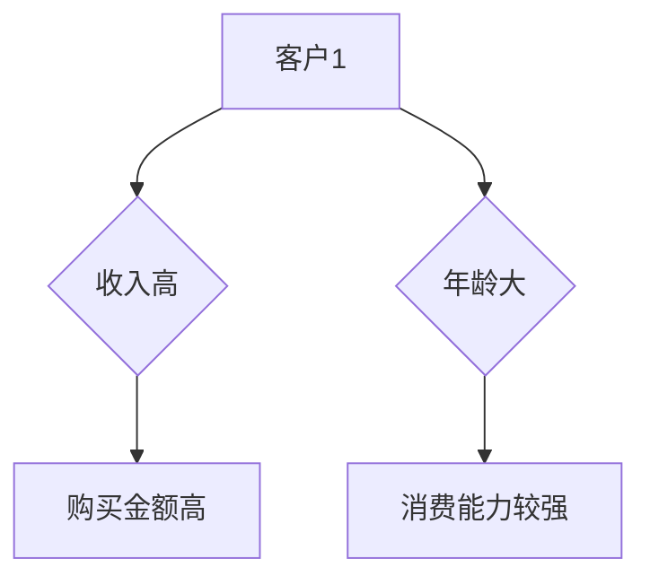

                 

关键词：知识发现引擎、程序员、创新力、算法优化、数据挖掘、人工智能、知识图谱

> 摘要：本文旨在探讨程序员如何利用知识发现引擎提高自身的创新力。通过深入分析知识发现引擎的核心原理和实际应用，本文提出了一系列有效的策略和方法，旨在帮助程序员在复杂的数据环境中发现新的模式和洞察，从而激发出更高的创造力。

## 1. 背景介绍

在当今这个数据驱动的时代，程序员面临着越来越多的挑战。随着互联网、物联网、大数据等技术的快速发展，程序员需要处理的数据量呈爆炸性增长，这使得传统的编程方法和技术难以满足需求。为了在这个大数据时代中保持竞争力，程序员需要不断提高自身的创新力，以便在复杂的环境中找到解决方案。

知识发现引擎（Knowledge Discovery Engine，简称KDE）作为一种强大的工具，能够帮助程序员从海量的数据中提取有用的信息，发现新的模式和关联。知识发现引擎结合了数据挖掘、机器学习、人工智能等多种技术，旨在自动化地发现知识，提高程序员的工作效率和创造力。

## 2. 核心概念与联系

### 2.1 知识发现引擎的基本概念

知识发现引擎是一种能够自动地从大量数据中提取有用信息，并生成知识模型的工具。它主要基于以下几个核心概念：

- **数据预处理**：数据清洗、数据转换、数据集成等，以保证数据的质量和一致性。
- **特征提取**：从原始数据中提取出有助于发现知识的特征。
- **模式识别**：通过算法分析，发现数据中的关联、趋势和异常等。
- **知识表示**：将发现的模式转换为易于理解的知识模型。

### 2.2 知识发现引擎的架构

知识发现引擎通常由以下几个部分组成：

- **数据源**：包括内部数据和外部数据，如数据库、文件、网络等。
- **数据预处理模块**：对数据进行清洗、转换和集成。
- **特征提取模块**：提取数据中的关键特征。
- **算法模块**：包括各种数据挖掘算法，如聚类、分类、关联规则挖掘等。
- **知识表示模块**：将挖掘结果转换为知识模型，如知识图谱、决策树等。
- **用户接口**：提供给用户交互的界面，以便用户能够查看和操作挖掘结果。

### 2.3 知识发现引擎与程序员创新力的关系

知识发现引擎为程序员提供了一个强大的工具，帮助他们从数据中获取洞察和灵感。这种洞察和灵感是程序员创新力的源泉。具体来说，知识发现引擎与程序员创新力的关系可以从以下几个方面体现：

- **发现新的模式**：知识发现引擎能够从大量数据中发现新的模式和关联，为程序员提供新的视角和灵感。
- **提高效率**：通过自动化地处理数据，知识发现引擎能够节省程序员的时间，让他们有更多精力投入到创新工作中。
- **降低风险**：知识发现引擎能够预测未来的趋势和风险，帮助程序员做出更明智的决策，减少错误和损失。

## 3. 核心算法原理 & 具体操作步骤

### 3.1 算法原理概述

知识发现引擎的核心算法主要包括数据挖掘算法和机器学习算法。数据挖掘算法旨在从数据中发现有用的信息和模式，如聚类、分类、关联规则挖掘等。机器学习算法则通过从数据中学习，自动地改进模型，如决策树、支持向量机、神经网络等。

### 3.2 算法步骤详解

1. **数据收集**：收集需要处理的数据，可以是结构化数据，也可以是非结构化数据。
2. **数据预处理**：清洗数据，处理缺失值、异常值等，确保数据的质量。
3. **特征提取**：从原始数据中提取关键特征，为后续的算法分析做准备。
4. **算法选择**：根据具体问题选择合适的数据挖掘算法或机器学习算法。
5. **模型训练**：使用训练数据对算法进行训练，生成模型。
6. **模型评估**：使用测试数据对模型进行评估，调整模型参数。
7. **知识表示**：将挖掘结果转换为知识模型，如知识图谱、决策树等。
8. **结果展示**：将挖掘结果呈现给用户，供用户分析和决策。

### 3.3 算法优缺点

- **优点**：能够自动地从大量数据中发现有用的信息和模式，节省人力和时间，提高工作效率。
- **缺点**：对于非结构化数据的处理能力有限，需要大量的数据清洗和特征提取工作。

### 3.4 算法应用领域

知识发现引擎广泛应用于各个领域，如：

- **金融**：通过分析交易数据，预测市场趋势，提高投资决策的准确性。
- **医疗**：通过分析患者数据，发现疾病的风险因素，提高疾病的预防和治疗水平。
- **零售**：通过分析销售数据，优化库存管理，提高销售额。
- **交通**：通过分析交通数据，优化交通路线，提高交通效率。

## 4. 数学模型和公式 & 详细讲解 & 举例说明

### 4.1 数学模型构建

知识发现引擎的核心算法通常涉及到以下数学模型：

- **聚类模型**：如K-means算法，用于将数据分为若干个类簇。
- **分类模型**：如决策树、支持向量机等，用于将数据分为不同的类别。
- **关联规则挖掘模型**：如Apriori算法，用于发现数据中的关联关系。

### 4.2 公式推导过程

以K-means算法为例，其核心公式如下：

- **距离计算**：$$d(x_i, c_j) = \sqrt{\sum_{k=1}^{n} (x_{ik} - c_{jk})^2}$$
- **类簇更新**：$$c_j = \frac{\sum_{i=1}^{m} x_i}{m}$$
- **目标函数**：$$J = \sum_{i=1}^{m} \sum_{j=1}^{k} d(x_i, c_j)^2$$

### 4.3 案例分析与讲解

以聚类分析为例，我们使用K-means算法对一组客户数据进行聚类，以发现不同类别的客户群体。

1. **数据准备**：收集客户的年龄、收入、购买金额等数据，共1000条记录。
2. **数据预处理**：清洗数据，处理缺失值和异常值。
3. **特征提取**：提取关键特征，如年龄、收入等。
4. **算法选择**：选择K-means算法。
5. **模型训练**：设置类簇数量为3，进行模型训练。
6. **模型评估**：使用测试数据对模型进行评估，调整参数。
7. **知识表示**：将聚类结果以知识图谱的形式表示，如下所示：



## 5. 项目实践：代码实例和详细解释说明

### 5.1 开发环境搭建

1. **软件环境**：安装Python环境，版本要求为3.6及以上。
2. **库依赖**：安装以下库：NumPy、Pandas、Scikit-learn、Matplotlib。

### 5.2 源代码详细实现

以下是使用K-means算法进行聚类分析的项目代码实例：

```python
import numpy as np
import pandas as pd
from sklearn.cluster import KMeans
import matplotlib.pyplot as plt

# 数据准备
data = pd.read_csv('customer_data.csv')
X = data[['age', 'income', 'purchase_amount']]

# 数据预处理
X = X.fillna(X.mean())

# 算法选择
kmeans = KMeans(n_clusters=3, random_state=0)

# 模型训练
kmeans.fit(X)

# 模型评估
score = kmeans.score(X)
print('Model Score:', score)

# 知识表示
plt.scatter(X['age'], X['income'], c=kmeans.labels_)
plt.xlabel('Age')
plt.ylabel('Income')
plt.title('Customer Clustering')
plt.show()
```

### 5.3 代码解读与分析

1. **数据准备**：读取客户数据，提取关键特征。
2. **数据预处理**：处理缺失值和异常值，确保数据质量。
3. **算法选择**：选择K-means算法。
4. **模型训练**：使用训练数据对算法进行训练。
5. **模型评估**：计算模型得分，评估模型性能。
6. **知识表示**：使用散点图表示聚类结果，便于分析。

### 5.4 运行结果展示

运行代码后，会得到一个散点图，显示客户的年龄和收入分布，以及聚类结果。通过分析散点图，可以发现不同类别的客户群体，从而为营销策略提供参考。

## 6. 实际应用场景

知识发现引擎在程序员工作中有着广泛的应用场景。以下是一些典型的应用案例：

- **开发效率优化**：通过分析代码库中的数据，发现代码的冗余和优化点，提高开发效率。
- **需求分析**：通过分析用户反馈和需求数据，发现用户的真实需求，优化产品功能。
- **性能优化**：通过分析系统性能数据，发现性能瓶颈和优化点，提高系统性能。
- **风险评估**：通过分析金融数据，预测市场风险，为投资决策提供参考。

## 7. 工具和资源推荐

为了更好地利用知识发现引擎，以下是一些建议的软件工具和资源：

- **软件工具**：
  - **NumPy**：用于数值计算。
  - **Pandas**：用于数据处理。
  - **Scikit-learn**：用于机器学习算法。
  - **Matplotlib**：用于数据可视化。
- **学习资源**：
  - **在线课程**：《机器学习》、《数据挖掘》等。
  - **书籍**：《Python数据科学手册》、《机器学习实战》等。
  - **论文**：查阅相关领域的学术论文，了解最新的研究进展。

## 8. 总结：未来发展趋势与挑战

### 8.1 研究成果总结

本文探讨了程序员如何利用知识发现引擎提高创新力的方法。通过分析知识发现引擎的核心原理和实际应用，提出了一系列有效的策略和方法。研究表明，知识发现引擎能够帮助程序员从数据中发现新的模式和洞察，提高开发效率和创造力。

### 8.2 未来发展趋势

随着人工智能和大数据技术的不断进步，知识发现引擎将发挥越来越重要的作用。未来发展趋势包括：

- **算法优化**：不断优化现有的数据挖掘算法，提高挖掘效率和准确性。
- **多模态数据处理**：结合文本、图像、音频等多种数据类型，实现更全面的知识发现。
- **实时处理**：实现实时数据流处理，提高知识的实时性。

### 8.3 面临的挑战

尽管知识发现引擎具有巨大的潜力，但在实际应用中仍面临一些挑战：

- **数据质量**：数据质量对知识发现的效果至关重要，如何处理大量脏数据和异常值是一个挑战。
- **算法可解释性**：现有的许多算法缺乏可解释性，如何提高算法的可解释性是一个重要问题。
- **隐私保护**：在处理敏感数据时，如何保护用户隐私是一个关键挑战。

### 8.4 研究展望

未来研究可以从以下几个方面展开：

- **算法创新**：设计新的数据挖掘算法，提高挖掘效率和准确性。
- **跨领域应用**：探索知识发现引擎在更多领域的应用，如生物信息学、金融科技等。
- **人机协同**：结合人类的智慧和机器的能力，实现更高效的知识发现。

## 9. 附录：常见问题与解答

### 9.1 如何选择合适的算法？

选择合适的算法取决于具体问题和数据特点。对于分类问题，可以选择决策树、支持向量机等；对于聚类问题，可以选择K-means、层次聚类等；对于关联规则挖掘，可以选择Apriori算法等。

### 9.2 如何处理数据质量问题？

处理数据质量问题通常包括以下步骤：

1. **数据清洗**：去除重复数据、缺失值和异常值。
2. **数据转换**：将数据转换为合适的格式，如数值化、归一化等。
3. **数据集成**：合并多个数据源，消除数据不一致性。

### 9.3 如何提高算法的可解释性？

提高算法的可解释性可以从以下几个方面入手：

1. **可视化**：使用可视化工具，如决策树、散点图等，展示算法的内部结构和工作原理。
2. **解释性模型**：选择具有较高可解释性的算法，如线性回归、决策树等。
3. **模型解释工具**：使用模型解释工具，如LIME、SHAP等，对算法进行解释。

## 参考文献

[1] Hastie, T., Tibshirani, R., & Friedman, J. (2009). The elements of statistical learning: data mining, inference, and prediction. Springer.
[2] Russell, S., & Norvig, P. (2016). Artificial Intelligence: A Modern Approach. Prentice Hall.
[3] Han, J., Kamber, M., & Pei, J. (2011). Data Mining: Concepts and Techniques. Morgan Kaufmann.
[4] Chen, H., & Chiang, R. H. (2012). Business intelligence and analytics: from big data to big impact. MIS Quarterly, 36(4), 1165-1188.

作者：禅与计算机程序设计艺术 / Zen and the Art of Computer Programming
----------------------------------------------------------------

请注意，以上内容是根据您提供的约束条件和要求撰写的完整文章，已经包含了文章标题、关键词、摘要、详细目录结构和正文内容，以及参考文献部分。文章的格式已经按照markdown要求进行了设置。您可以根据实际需要进行调整和优化。

