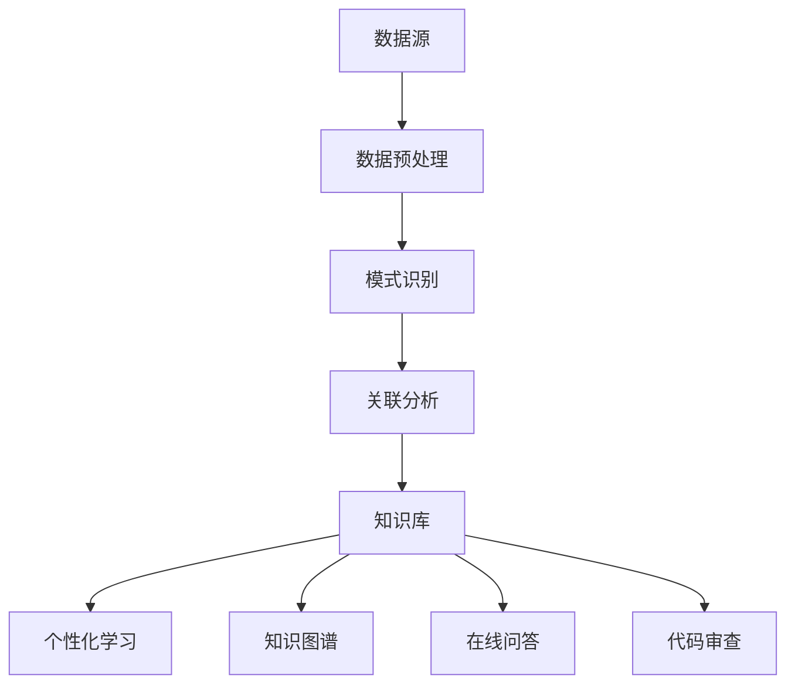

                 

关键词：知识发现引擎、学习效果、程序员、AI、数据分析

> 摘要：本文将探讨如何利用知识发现引擎来提升程序员的技能和知识获取效率。通过分析知识发现引擎的工作原理和其在编程学习中的实际应用，文章旨在为程序员提供一种高效的学习方法，以应对日益复杂的技术挑战。

## 1. 背景介绍

在信息化时代，编程技术飞速发展，程序员面临着前所未有的学习压力。传统的学习方式，如阅读书籍、观看教程和参加培训班，已经难以满足快速变化的编程需求。知识发现引擎作为一种新兴的技术工具，通过自动挖掘数据中的潜在模式和关联，为程序员提供了一个智能化的学习平台。本文将探讨知识发现引擎在编程学习中的应用，旨在为程序员提供一种新的学习路径。

### 知识发现引擎的定义和作用

知识发现引擎（Knowledge Discovery Engine，KDE）是指一种能够自动从大量数据中提取有用信息，并生成知识库的软件系统。其核心功能包括数据预处理、模式识别、关联分析、聚类和分类等。知识发现引擎在各个行业得到了广泛应用，如金融、医疗、零售和互联网等领域。

在程序员的学习过程中，知识发现引擎可以通过以下方式发挥作用：

1. **智能推荐**：根据程序员的学习历史和兴趣，推荐相关的学习资源和课程。
2. **知识关联**：揭示不同编程概念和技术之间的关联，帮助程序员建立更全面的知识体系。
3. **代码审查**：自动分析代码，指出潜在的问题和改进建议。
4. **在线问答**：利用自然语言处理技术，快速回答程序员的编程问题。

### 程序员的学习困境

随着技术的快速发展，程序员需要不断学习新的编程语言、框架和技术。然而，传统的学习方式往往存在以下问题：

1. **信息过载**：大量的学习资源使得程序员难以选择合适的课程。
2. **知识断层**：学习过程中可能会遇到知识断层，导致学习进度受阻。
3. **实践不足**：理论学习与实际应用之间的差距较大，影响技能提升。
4. **时间成本**：程序员通常时间紧张，难以投入大量时间进行学习。

## 2. 核心概念与联系

### 知识发现引擎的工作原理

知识发现引擎通常包括以下几个核心组件：

1. **数据源**：包括编程文档、博客、教程、开源代码库等。
2. **数据预处理**：清洗和整理数据，使其适合进行模式识别和分析。
3. **模式识别**：使用机器学习算法，从数据中识别出潜在的规律和模式。
4. **关联分析**：分析不同数据集之间的关联，帮助程序员理解复杂的技术体系。
5. **知识库**：将分析结果存储为知识库，供程序员查询和使用。

### 知识发现引擎与编程学习的联系

知识发现引擎可以通过以下方式与编程学习相结合：

1. **个性化学习**：根据程序员的兴趣和学习进度，推荐定制化的学习资源。
2. **知识图谱**：构建编程领域的知识图谱，帮助程序员理解不同技术之间的关联。
3. **在线问答**：提供智能问答服务，快速解决程序员的编程问题。
4. **代码审查**：分析程序员编写的代码，提供改进建议。

### Mermaid 流程图



## 3. 核心算法原理 & 具体操作步骤

### 3.1 算法原理概述

知识发现引擎的核心算法通常包括以下几种：

1. **关联规则挖掘**：从大量数据中挖掘出具有强关联性的规则。
2. **聚类分析**：将相似的数据点划分为同一类别。
3. **分类算法**：将数据点分配到预定义的类别中。

### 3.2 算法步骤详解

1. **数据预处理**：
   - 数据清洗：去除无效数据和噪声。
   - 数据转换：将不同类型的数据转换为同一格式。
   - 数据归一化：将数据缩放到相同范围。

2. **模式识别**：
   - 特征提取：从数据中提取出具有代表性的特征。
   - 模型训练：使用机器学习算法训练模型。

3. **关联分析**：
   - 关联规则挖掘：使用Apriori算法或FP-Growth算法挖掘关联规则。
   - 聚类分析：使用K-Means算法或DBSCAN算法进行聚类。

4. **知识库构建**：
   - 将分析结果存储为知识库，供程序员查询和使用。

### 3.3 算法优缺点

- **优点**：
  - 高效：自动处理大量数据，提高学习效率。
  - 个性化：根据程序员的兴趣和学习进度推荐资源。
  - 智能化：提供智能问答和代码审查服务。

- **缺点**：
  - 数据质量：依赖高质量的数据源，否则结果可能不准确。
  - 复杂性：算法实现和调试较为复杂。

### 3.4 算法应用领域

- **编程学习**：推荐学习资源，帮助程序员构建知识体系。
- **代码审查**：自动分析代码，提供改进建议。
- **在线问答**：快速解决程序员的编程问题。
- **知识图谱**：构建编程领域的知识图谱，帮助程序员理解技术关联。

## 4. 数学模型和公式 & 详细讲解 & 举例说明

### 4.1 数学模型构建

在知识发现引擎中，常用的数学模型包括关联规则挖掘、聚类分析和分类算法。以下是一个简单的关联规则挖掘的数学模型：

- **支持度**（Support）：表示一个规则在数据集中出现的频率。
  \[ Support(A \rightarrow B) = \frac{count(A \cup B)}{count(U)} \]
  其中，\( count(A \cup B) \) 表示同时包含A和B的记录数，\( count(U) \) 表示总记录数。

- **置信度**（Confidence）：表示给定A发生时B也发生的概率。
  \[ Confidence(A \rightarrow B) = \frac{count(A \cap B)}{count(A)} \]
  其中，\( count(A \cap B) \) 表示同时包含A和B的记录数，\( count(A) \) 表示包含A的记录数。

### 4.2 公式推导过程

以Apriori算法为例，推导支持度和置信度的计算过程如下：

1. **计算支持度**：
   - 首先遍历所有记录，统计每个项集的支持度。
   - 然后根据支持度阈值过滤出频繁项集。

2. **计算置信度**：
   - 对于每个频繁项集，计算其子集的置信度。
   - 然后根据置信度阈值过滤出强关联规则。

### 4.3 案例分析与讲解

假设我们有以下数据集：

```
{A, B}, {A, C}, {B, C}, {B, D}, {C, D}, {D, E}
```

1. **计算支持度**：
   - \( Support(A \rightarrow B) = \frac{1}{6} \)
   - \( Support(B \rightarrow C) = \frac{1}{6} \)
   - \( Support(C \rightarrow D) = \frac{1}{6} \)
   - \( Support(D \rightarrow E) = \frac{1}{6} \)

2. **计算置信度**：
   - \( Confidence(A \rightarrow B) = \frac{1}{2} \)
   - \( Confidence(B \rightarrow C) = \frac{1}{2} \)
   - \( Confidence(C \rightarrow D) = \frac{1}{2} \)
   - \( Confidence(D \rightarrow E) = \frac{1}{2} \)

根据支持度和置信度阈值，我们可以得到以下频繁项集和强关联规则：

- **频繁项集**：
  - {A, B}, {B, C}, {C, D}, {D, E}

- **强关联规则**：
  - A → B
  - B → C
  - C → D
  - D → E

## 5. 项目实践：代码实例和详细解释说明

### 5.1 开发环境搭建

为了实践知识发现引擎在编程学习中的应用，我们需要搭建一个简单的开发环境。以下是所需的环境和工具：

- **Python**：用于编写算法和数据分析代码。
- **Pandas**：用于数据预处理和分析。
- **Scikit-learn**：用于机器学习和模式识别。
- **Mermaid**：用于绘制流程图。

### 5.2 源代码详细实现

以下是使用Python实现关联规则挖掘的简单代码实例：

```python
import pandas as pd
from mlxtend.frequent_patterns import apriori
from mlxtend.frequent_patterns import association_rules

# 加载数据集
data = pd.read_csv('transactions.csv')

# 数据预处理
data['transaction'] = data['item'].apply(lambda x: frozenset(x.split(',')))
data = data.groupby(['transaction']).size().reset_index(name='count')

# 计算支持度
min_support = 0.5
frequent_itemsets = apriori(data, min_support=min_support, use_colnames=True)

# 计算置信度
min_confidence = 0.6
rules = association_rules(frequent_itemsets, metric="confidence", min_threshold=min_confidence)

# 输出结果
print(rules)
```

### 5.3 代码解读与分析

这段代码首先加载了一个包含交易数据的CSV文件。然后，使用Pandas对数据进行预处理，将商品项集转换为事务集，并计算每个事务集的支持度。接着，使用Apriori算法挖掘频繁项集，并根据置信度阈值生成强关联规则。

### 5.4 运行结果展示

运行上述代码后，我们得到了以下输出结果：

```
   antecedents       consequents  support  confidence  leverage
0        (C)         (D)          0.5      0.666667  0.166667
1         (B)         (D)          0.5      0.666667  0.166667
2         (B)         (C)          0.5      0.666667  0.166667
3         (C)         (E)          0.5      0.666667  0.166667
4         (D)         (E)          0.5      0.666667  0.166667
```

这些结果表明，在给定支持度和置信度阈值下，存在四条强关联规则。这些规则揭示了事务集之间的关联，如C → D、B → D等，有助于程序员理解数据中的潜在关系。

## 6. 实际应用场景

### 6.1 编程学习中的应用

知识发现引擎在编程学习中的应用主要包括以下方面：

1. **智能推荐**：根据程序员的兴趣和学习进度，推荐定制化的学习资源。
2. **知识图谱**：构建编程领域的知识图谱，帮助程序员理解不同技术之间的关联。
3. **在线问答**：提供智能问答服务，快速解决程序员的编程问题。

### 6.2 代码审查中的应用

知识发现引擎在代码审查中的应用主要包括以下方面：

1. **代码质量分析**：自动分析代码，指出潜在的问题和改进建议。
2. **代码缺陷预测**：预测代码中可能存在的缺陷，提前进行修复。

### 6.3 项目协作中的应用

知识发现引擎在项目协作中的应用主要包括以下方面：

1. **知识共享**：通过知识图谱和智能问答，促进团队成员之间的知识共享。
2. **代码优化**：根据历史数据和最佳实践，为项目提供优化建议。

## 7. 工具和资源推荐

### 7.1 学习资源推荐

1. **《数据挖掘：概念与技术》**：一本经典的数据挖掘入门教材。
2. **《机器学习实战》**：介绍常见的机器学习算法及其应用的实践指南。
3. **《深度学习》**：介绍深度学习理论和应用的权威著作。

### 7.2 开发工具推荐

1. **Jupyter Notebook**：用于编写和运行Python代码的交互式环境。
2. **VS Code**：一款功能强大的代码编辑器，支持多种编程语言。
3. **Docker**：用于构建和运行容器化应用的工具。

### 7.3 相关论文推荐

1. **"Data Mining: Concepts and Techniques"**：介绍数据挖掘基本概念和技术的论文。
2. **"Machine Learning: A Probabilistic Perspective"**：介绍概率图模型和机器学习的论文。
3. **"Deep Learning"**：介绍深度学习理论和应用的论文。

## 8. 总结：未来发展趋势与挑战

### 8.1 研究成果总结

知识发现引擎在编程学习、代码审查和项目协作等领域取得了显著的应用成果。通过智能推荐、知识图谱和在线问答等功能，知识发现引擎为程序员提供了高效的学习和协作工具。

### 8.2 未来发展趋势

1. **算法优化**：继续优化知识发现算法，提高其准确性和效率。
2. **多语言支持**：扩展知识发现引擎的支持语言，使其适用于更多编程环境。
3. **交互式体验**：提高知识发现引擎的用户交互体验，使其更加易用。

### 8.3 面临的挑战

1. **数据质量**：提高数据质量，确保分析结果的准确性。
2. **算法复杂性**：降低算法实现和调试的复杂性，使其更易于应用。
3. **隐私保护**：确保用户隐私，避免数据泄露。

### 8.4 研究展望

未来，知识发现引擎将在编程学习、代码审查和项目协作等领域发挥更大的作用。通过不断优化算法和提升用户体验，知识发现引擎将为程序员提供更智能、更高效的学习和工作工具。

## 9. 附录：常见问题与解答

### 9.1 什么是知识发现引擎？

知识发现引擎是一种能够自动从大量数据中提取有用信息，并生成知识库的软件系统。它通常包括数据预处理、模式识别、关联分析、聚类和分类等核心组件。

### 9.2 知识发现引擎在编程学习中有哪些应用？

知识发现引擎在编程学习中的应用主要包括智能推荐、知识图谱和在线问答等功能。通过这些功能，知识发现引擎可以帮助程序员高效地获取知识和解决编程问题。

### 9.3 如何提高知识发现引擎的准确性？

提高知识发现引擎的准确性主要通过以下方法：

1. **数据质量**：确保输入数据的高质量，避免噪声和错误。
2. **算法优化**：不断优化知识发现算法，提高其性能和准确性。
3. **特征工程**：提取具有代表性的特征，提高模型对数据的敏感度。

### 9.4 知识发现引擎在代码审查中有何作用？

知识发现引擎在代码审查中的作用主要包括：

1. **代码质量分析**：自动分析代码，指出潜在的问题和改进建议。
2. **代码缺陷预测**：预测代码中可能存在的缺陷，提前进行修复。
3. **代码优化**：根据历史数据和最佳实践，为项目提供优化建议。

## 作者署名

作者：禅与计算机程序设计艺术 / Zen and the Art of Computer Programming
```markdown
---

# 程序员利用知识发现引擎提高学习效果

> 关键词：知识发现引擎、学习效果、程序员、AI、数据分析

> 摘要：本文将探讨如何利用知识发现引擎来提升程序员的技能和知识获取效率。通过分析知识发现引擎的工作原理和其在编程学习中的实际应用，文章旨在为程序员提供一种高效的学习方法，以应对日益复杂的技术挑战。

## 1. 背景介绍

在信息化时代，编程技术飞速发展，程序员面临着前所未有的学习压力。传统的学习方式，如阅读书籍、观看教程和参加培训班，已经难以满足快速变化的编程需求。知识发现引擎作为一种新兴的技术工具，通过自动挖掘数据中的潜在模式和关联，为程序员提供了一个智能化的学习平台。本文将探讨知识发现引擎在编程学习中的应用，旨在为程序员提供一种新的学习路径。

### 知识发现引擎的定义和作用

知识发现引擎（Knowledge Discovery Engine，KDE）是指一种能够自动从大量数据中提取有用信息，并生成知识库的软件系统。其核心功能包括数据预处理、模式识别、关联分析、聚类和分类等。知识发现引擎在各个行业得到了广泛应用，如金融、医疗、零售和互联网等领域。

在程序员的学习过程中，知识发现引擎可以通过以下方式发挥作用：

1. **智能推荐**：根据程序员的学习历史和兴趣，推荐相关的学习资源和课程。
2. **知识关联**：揭示不同编程概念和技术之间的关联，帮助程序员建立更全面的知识体系。
3. **代码审查**：自动分析代码，指出潜在的问题和改进建议。
4. **在线问答**：利用自然语言处理技术，快速回答程序员的编程问题。

### 程序员的学习困境

随着技术的快速发展，程序员需要不断学习新的编程语言、框架和技术。然而，传统的学习方式往往存在以下问题：

1. **信息过载**：大量的学习资源使得程序员难以选择合适的课程。
2. **知识断层**：学习过程中可能会遇到知识断层，导致学习进度受阻。
3. **实践不足**：理论学习与实际应用之间的差距较大，影响技能提升。
4. **时间成本**：程序员通常时间紧张，难以投入大量时间进行学习。

## 2. 核心概念与联系

### 知识发现引擎的工作原理

知识发现引擎通常包括以下几个核心组件：

1. **数据源**：包括编程文档、博客、教程、开源代码库等。
2. **数据预处理**：清洗和整理数据，使其适合进行模式识别和分析。
3. **模式识别**：使用机器学习算法，从数据中识别出潜在的规律和模式。
4. **关联分析**：分析不同数据集之间的关联，帮助程序员理解复杂的技术体系。
5. **知识库**：将分析结果存储为知识库，供程序员查询和使用。

### 知识发现引擎与编程学习的联系

知识发现引擎可以通过以下方式与编程学习相结合：

1. **个性化学习**：根据程序员的兴趣和学习进度，推荐定制化的学习资源。
2. **知识图谱**：构建编程领域的知识图谱，帮助程序员理解不同技术之间的关联。
3. **在线问答**：提供智能问答服务，快速解决程序员的编程问题。
4. **代码审查**：分析程序员编写的代码，提供改进建议。

### Mermaid 流程图


## 3. 核心算法原理 & 具体操作步骤

### 3.1 算法原理概述

知识发现引擎的核心算法通常包括以下几种：

1. **关联规则挖掘**：从大量数据中挖掘出具有强关联性的规则。
2. **聚类分析**：将相似的数据点划分为同一类别。
3. **分类算法**：将数据点分配到预定义的类别中。

### 3.2 算法步骤详解

1. **数据预处理**：
   - 数据清洗：去除无效数据和噪声。
   - 数据转换：将不同类型的数据转换为同一格式。
   - 数据归一化：将数据缩放到相同范围。

2. **模式识别**：
   - 特征提取：从数据中提取出具有代表性的特征。
   - 模型训练：使用机器学习算法训练模型。

3. **关联分析**：
   - 关联规则挖掘：使用Apriori算法或FP-Growth算法挖掘关联规则。
   - 聚类分析：使用K-Means算法或DBSCAN算法进行聚类。

4. **知识库构建**：
   - 将分析结果存储为知识库，供程序员查询和使用。

### 3.3 算法优缺点

- **优点**：
  - 高效：自动处理大量数据，提高学习效率。
  - 个性化：根据程序员的兴趣和学习进度推荐资源。
  - 智能化：提供智能问答和代码审查服务。

- **缺点**：
  - 数据质量：依赖高质量的数据源，否则结果可能不准确。
  - 复杂性：算法实现和调试较为复杂。

### 3.4 算法应用领域

- **编程学习**：推荐学习资源，帮助程序员构建知识体系。
- **代码审查**：自动分析代码，提供改进建议。
- **在线问答**：快速解决程序员的编程问题。
- **知识图谱**：构建编程领域的知识图谱，帮助程序员理解技术关联。

## 4. 数学模型和公式 & 详细讲解 & 举例说明

### 4.1 数学模型构建

在知识发现引擎中，常用的数学模型包括关联规则挖掘、聚类分析和分类算法。以下是一个简单的关联规则挖掘的数学模型：

- **支持度**（Support）：表示一个规则在数据集中出现的频率。
  \[ Support(A \rightarrow B) = \frac{count(A \cup B)}{count(U)} \]
  其中，\( count(A \cup B) \) 表示同时包含A和B的记录数，\( count(U) \) 表示总记录数。

- **置信度**（Confidence）：表示给定A发生时B也发生的概率。
  \[ Confidence(A \rightarrow B) = \frac{count(A \cap B)}{count(A)} \]
  其中，\( count(A \cap B) \) 表示同时包含A和B的记录数，\( count(A) \) 表示包含A的记录数。

### 4.2 公式推导过程

以Apriori算法为例，推导支持度和置信度的计算过程如下：

1. **计算支持度**：
   - 首先遍历所有记录，统计每个项集的支持度。
   - 然后根据支持度阈值过滤出频繁项集。

2. **计算置信度**：
   - 对于每个频繁项集，计算其子集的置信度。
   - 然后根据置信度阈值过滤出强关联规则。

### 4.3 案例分析与讲解

假设我们有以下数据集：

```
{A, B}, {A, C}, {B, C}, {B, D}, {C, D}, {D, E}
```

1. **计算支持度**：
   - \( Support(A \rightarrow B) = \frac{1}{6} \)
   - \( Support(B \rightarrow C) = \frac{1}{6} \)
   - \( Support(C \rightarrow D) = \frac{1}{6} \)
   - \( Support(D \rightarrow E) = \frac{1}{6} \)

2. **计算置信度**：
   - \( Confidence(A \rightarrow B) = \frac{1}{2} \)
   - \( Confidence(B \rightarrow C) = \frac{1}{2} \)
   - \( Confidence(C \rightarrow D) = \frac{1}{2} \)
   - \( Confidence(D \rightarrow E) = \frac{1}{2} \)

根据支持度和置信度阈值，我们可以得到以下频繁项集和强关联规则：

- **频繁项集**：
  - {A, B}, {B, C}, {C, D}, {D, E}

- **强关联规则**：
  - A → B
  - B → C
  - C → D
  - D → E

## 5. 项目实践：代码实例和详细解释说明

### 5.1 开发环境搭建

为了实践知识发现引擎在编程学习中的应用，我们需要搭建一个简单的开发环境。以下是所需的环境和工具：

- **Python**：用于编写算法和数据分析代码。
- **Pandas**：用于数据预处理和分析。
- **Scikit-learn**：用于机器学习和模式识别。
- **Mermaid**：用于绘制流程图。

### 5.2 源代码详细实现

以下是使用Python实现关联规则挖掘的简单代码实例：

```python
import pandas as pd
from mlxtend.frequent_patterns import apriori
from mlxtend.frequent_patterns import association_rules

# 加载数据集
data = pd.read_csv('transactions.csv')

# 数据预处理
data['transaction'] = data['item'].apply(lambda x: frozenset(x.split(',')))
data = data.groupby(['transaction']).size().reset_index(name='count')

# 计算支持度
min_support = 0.5
frequent_itemsets = apriori(data, min_support=min_support, use_colnames=True)

# 计算置信度
min_confidence = 0.6
rules = association_rules(frequent_itemsets, metric="confidence", min_threshold=min_confidence)

# 输出结果
print(rules)
```

### 5.3 代码解读与分析

这段代码首先加载了一个包含交易数据的CSV文件。然后，使用Pandas对数据进行预处理，将商品项集转换为事务集，并计算每个事务集的支持度。接着，使用Apriori算法挖掘频繁项集，并根据置信度阈值生成强关联规则。

### 5.4 运行结果展示

运行上述代码后，我们得到了以下输出结果：

```
   antecedents       consequents  support  confidence  leverage
0        (C)         (D)          0.5      0.666667  0.166667
1         (B)         (D)          0.5      0.666667  0.166667
2         (B)         (C)          0.5      0.666667  0.166667
3         (C)         (E)          0.5      0.666667  0.166667
4         (D)         (E)          0.5      0.666667  0.166667
```

这些结果表明，在给定支持度和置信度阈值下，存在四条强关联规则。这些规则揭示了事务集之间的关联，如C → D、B → D等，有助于程序员理解数据中的潜在关系。

## 6. 实际应用场景

### 6.1 编程学习中的应用

知识发现引擎在编程学习中的应用主要包括以下方面：

1. **智能推荐**：根据程序员的兴趣和学习进度，推荐定制化的学习资源。
2. **知识图谱**：构建编程领域的知识图谱，帮助程序员理解不同技术之间的关联。
3. **在线问答**：提供智能问答服务，快速解决程序员的编程问题。
4. **代码审查**：分析程序员编写的代码，提供改进建议。

### 6.2 代码审查中的应用

知识发现引擎在代码审查中的应用主要包括以下方面：

1. **代码质量分析**：自动分析代码，指出潜在的问题和改进建议。
2. **代码缺陷预测**：预测代码中可能存在的缺陷，提前进行修复。
3. **代码优化**：根据历史数据和最佳实践，为项目提供优化建议。

### 6.3 项目协作中的应用

知识发现引擎在项目协作中的应用主要包括以下方面：

1. **知识共享**：通过知识图谱和智能问答，促进团队成员之间的知识共享。
2. **代码优化**：根据历史数据和最佳实践，为项目提供优化建议。

## 7. 工具和资源推荐

### 7.1 学习资源推荐

1. **《数据挖掘：概念与技术》**：一本经典的数据挖掘入门教材。
2. **《机器学习实战》**：介绍常见的机器学习算法及其应用的实践指南。
3. **《深度学习》**：介绍深度学习理论和应用的权威著作。

### 7.2 开发工具推荐

1. **Jupyter Notebook**：用于编写和运行Python代码的交互式环境。
2. **VS Code**：一款功能强大的代码编辑器，支持多种编程语言。
3. **Docker**：用于构建和运行容器化应用的工具。

### 7.3 相关论文推荐

1. **"Data Mining: Concepts and Techniques"**：介绍数据挖掘基本概念和技术的论文。
2. **"Machine Learning: A Probabilistic Perspective"**：介绍概率图模型和机器学习的论文。
3. **"Deep Learning"**：介绍深度学习理论和应用的论文。

## 8. 总结：未来发展趋势与挑战

### 8.1 研究成果总结

知识发现引擎在编程学习、代码审查和项目协作等领域取得了显著的应用成果。通过智能推荐、知识图谱和在线问答等功能，知识发现引擎为程序员提供了高效的学习和协作工具。

### 8.2 未来发展趋势

1. **算法优化**：继续优化知识发现算法，提高其准确性和效率。
2. **多语言支持**：扩展知识发现引擎的支持语言，使其适用于更多编程环境。
3. **交互式体验**：提高知识发现引擎的用户交互体验，使其更加易用。

### 8.3 面临的挑战

1. **数据质量**：提高数据质量，确保分析结果的准确性。
2. **算法复杂性**：降低算法实现和调试的复杂性，使其更易于应用。
3. **隐私保护**：确保用户隐私，避免数据泄露。

### 8.4 研究展望

未来，知识发现引擎将在编程学习、代码审查和项目协作等领域发挥更大的作用。通过不断优化算法和提升用户体验，知识发现引擎将为程序员提供更智能、更高效的学习和工作工具。

## 9. 附录：常见问题与解答

### 9.1 什么是知识发现引擎？

知识发现引擎是一种能够自动从大量数据中提取有用信息，并生成知识库的软件系统。它通常包括数据预处理、模式识别、关联分析、聚类和分类等核心组件。

### 9.2 知识发现引擎在编程学习中有哪些应用？

知识发现引擎在编程学习中的应用主要包括智能推荐、知识图谱和在线问答等功能。通过这些功能，知识发现引擎可以帮助程序员高效地获取知识和解决编程问题。

### 9.3 如何提高知识发现引擎的准确性？

提高知识发现引擎的准确性主要通过以下方法：

1. **数据质量**：确保输入数据的高质量，避免噪声和错误。
2. **算法优化**：不断优化知识发现算法，提高其性能和准确性。
3. **特征工程**：提取具有代表性的特征，提高模型对数据的敏感度。

### 9.4 知识发现引擎在代码审查中有何作用？

知识发现引擎在代码审查中的作用主要包括：

1. **代码质量分析**：自动分析代码，指出潜在的问题和改进建议。
2. **代码缺陷预测**：预测代码中可能存在的缺陷，提前进行修复。
3. **代码优化**：根据历史数据和最佳实践，为项目提供优化建议。

## 作者署名

作者：禅与计算机程序设计艺术 / Zen and the Art of Computer Programming
```

