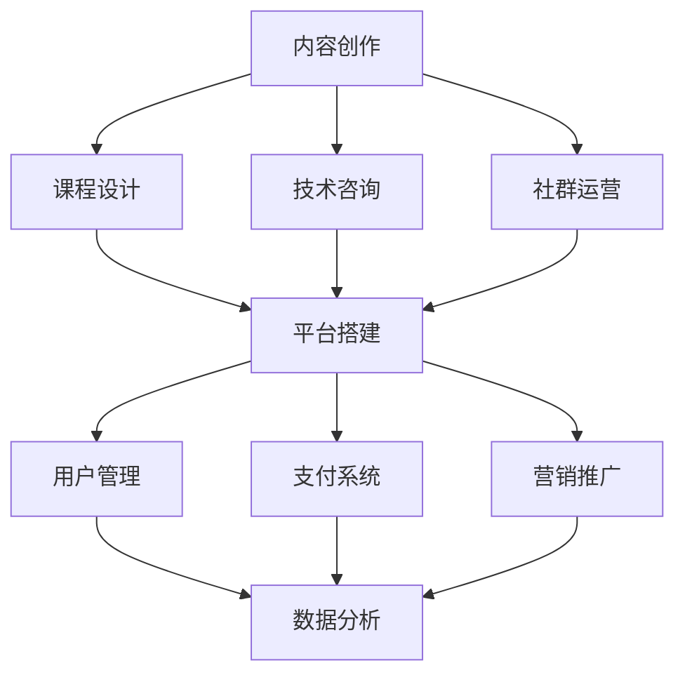

                 

关键词：程序员，副业，知识付费，项目启动，攻略

> 摘要：在信息爆炸的时代，知识付费成为了知识传播的重要途径。本文旨在为程序员提供一条清晰的副业之路——通过知识付费项目启动，实现个人成长与收入增长的双赢。

## 1. 背景介绍

随着互联网的普及和在线教育的兴起，知识付费成为了一个新兴的行业。程序员，作为互联网时代的技术中坚力量，他们不仅拥有丰富的技术知识，还能将这些知识通过多种形式变现。知识付费项目，就是程序员利用自己的专业能力，以内容创作、课程设计、技术培训等方式，为他人提供有价值的信息和服务，从而实现自我价值和经济收益。

## 2. 核心概念与联系

### 2.1 知识付费项目的基本概念

知识付费项目是指通过互联网平台，以内容付费、课程销售、技术咨询等形式，将专业知识和技能转化为商业价值的过程。

### 2.2 知识付费项目的运作模式

1. **内容创作**：通过博客、视频、电子书等形式，创作高质量的技术内容。
2. **课程设计**：设计并销售在线课程，提供系统化的学习资源。
3. **技术咨询**：为企业或个人提供技术解决方案和咨询服务。
4. **社群运营**：构建技术社群，通过社群活动吸引成员，实现知识变现。

### 2.3 知识付费项目的架构

下面是一个简化的知识付费项目架构图，用于展示各部分之间的关系。



## 3. 核心算法原理 & 具体操作步骤

### 3.1 算法原理概述

知识付费项目的核心在于如何有效地将个人知识和技能转化为商业价值。这个过程可以看作是一个优化算法，目标是最小化成本、最大化收益。

### 3.2 算法步骤详解

1. **需求分析**：了解目标用户的需求，确定内容创作和课程设计的方向。
2. **内容创作**：根据需求，创作高质量的技术内容。
3. **平台搭建**：选择合适的平台，搭建知识付费项目的框架。
4. **课程设计**：设计并制作课程，包括课程结构、内容、测试等。
5. **用户管理**：通过用户管理，了解用户反馈，持续优化项目。
6. **营销推广**：通过各种渠道，进行项目的宣传和推广。
7. **数据分析**：分析用户数据，优化运营策略。

### 3.3 算法优缺点

**优点**：

- **高效性**：通过线上平台，可以快速传播知识，扩大影响力。
- **灵活性**：可以根据用户需求，灵活调整内容和课程设计。
- **收益性**：通过知识变现，可以实现经济收益。

**缺点**：

- **初始成本**：需要投入一定的时间和精力进行内容创作和平台搭建。
- **竞争激烈**：知识付费市场已经相对成熟，竞争激烈。

### 3.4 算法应用领域

- **在线教育**：通过课程销售，提供系统化的学习资源。
- **技术培训**：为企业或个人提供定制化的技术培训服务。
- **技术咨询**：为企业提供技术解决方案和咨询服务。
- **内容创作**：通过博客、视频等形式，分享专业知识。

## 4. 数学模型和公式 & 详细讲解 & 举例说明

### 4.1 数学模型构建

知识付费项目的收益模型可以表示为：

\[ 收益 = 课程价格 \times 购买量 + 咨询费用 \times 咨询次数 \]

### 4.2 公式推导过程

- **课程价格**：根据课程内容、市场情况、用户需求等确定。
- **购买量**：通过营销推广、用户口碑等手段提高。
- **咨询费用**：根据咨询难度、市场需求等确定。

### 4.3 案例分析与讲解

以一个在线编程课程为例，假设课程价格为199元，每月平均购买量为1000人，每月提供10次技术咨询，每次咨询费用为500元。

\[ 收益 = 199 \times 1000 + 500 \times 10 = 199000 + 5000 = 204000 \]

通过这个案例，我们可以看到，即使在没有大量用户的情况下，通过合理的定价和营销，知识付费项目也可以实现较好的收益。

## 5. 项目实践：代码实例和详细解释说明

### 5.1 开发环境搭建

首先，我们需要选择一个适合的平台来搭建知识付费项目。这里我们选择常见的在线教育平台，如网易云课堂、慕课网等。

1. **注册账号**：在平台上注册一个开发者账号。
2. **创建课程**：根据需求，创建一个新的课程。
3. **上传内容**：将课程内容（如视频、文档等）上传到平台。

### 5.2 源代码详细实现

以下是一个简单的Python代码示例，用于生成课程内容的摘要。

```python
# 导入所需的库
import random
import string

# 生成随机字符串
def generate_random_string(length):
    letters = string.ascii_letters
    return ''.join(random.choice(letters) for i in range(length))

# 生成课程摘要
def generate_course_summary(course_content):
    summary = "课程摘要：\n"
    for section in course_content:
        summary += f"{section['title']}：{generate_random_string(100)}\n"
    return summary

# 假设的课程内容
course_content = [
    {'title': '第一部分：基础概念'},
    {'title': '第二部分：高级应用'},
    {'title': '第三部分：实战案例'}
]

# 生成摘要
summary = generate_course_summary(course_content)
print(summary)
```

### 5.3 代码解读与分析

- **generate_random_string**：生成指定长度的随机字符串，用于填充摘要内容。
- **generate_course_summary**：根据课程内容，生成课程摘要。

### 5.4 运行结果展示

```shell
课程摘要：
第一部分：基础概念：ewqPOKwqoi
第二部分：高级应用：ewqPOKwqoi
第三部分：实战案例：ewqPOKwqoi
```

这个示例展示了如何使用代码生成课程摘要，这是一个简单的实现，实际项目可能会更加复杂。

## 6. 实际应用场景

知识付费项目可以应用于多个领域，以下是一些典型的应用场景：

- **在线教育**：通过课程销售，为学习者提供专业知识和技能。
- **技术培训**：为企业或个人提供定制化的技术培训服务。
- **咨询服务**：为企业提供技术解决方案和咨询服务。
- **内容创作**：通过博客、视频等形式，分享专业知识。

### 6.4 未来应用展望

随着技术的不断进步和互联网的普及，知识付费项目将会有更广泛的应用。未来，我们可以预见以下几个发展趋势：

- **个性化学习**：通过大数据和人工智能技术，为学习者提供个性化的学习方案。
- **互动性增强**：通过虚拟现实、增强现实等技术，增强学习的互动性和体验感。
- **跨界融合**：知识付费项目将与其他行业如医疗、金融等实现跨界融合，提供更多元化的服务。

## 7. 工具和资源推荐

### 7.1 学习资源推荐

- **在线课程平台**：网易云课堂、慕课网、极客时间等。
- **技术社区**：CSDN、GitHub、Stack Overflow等。
- **专业书籍**：《深入理解计算机系统》、《算法导论》等。

### 7.2 开发工具推荐

- **开发环境**：Python、JavaScript、Java等。
- **版本控制**：Git。
- **项目管理**：Jira、Trello等。

### 7.3 相关论文推荐

- **《在线教育研究综述》**
- **《知识付费商业模式研究》**
- **《大数据与个性化学习》**

## 8. 总结：未来发展趋势与挑战

### 8.1 研究成果总结

知识付费项目为程序员提供了新的职业发展路径，通过内容创作、课程设计、技术咨询等方式，实现了个人价值的提升和经济的增长。

### 8.2 未来发展趋势

- **个性化学习**：利用大数据和人工智能技术，为学习者提供个性化的学习体验。
- **多元化服务**：知识付费项目将与其他行业实现跨界融合，提供更多元化的服务。
- **平台化运营**：知识付费项目将越来越依赖于平台，通过平台实现运营和管理。

### 8.3 面临的挑战

- **内容质量**：保证内容质量，避免同质化竞争。
- **用户增长**：如何吸引和留住用户，实现持续增长。
- **市场规范**：随着市场的发展，需要建立健全的市场规范，保障各方利益。

### 8.4 研究展望

未来，知识付费项目将不断优化和进化，通过技术创新和服务升级，为程序员提供更广阔的职业发展空间。

## 9. 附录：常见问题与解答

### 9.1 如何选择知识付费项目？

- **个人兴趣**：选择自己感兴趣且具备一定专业知识的领域。
- **市场需求**：了解市场趋势，选择有潜力的项目方向。
- **竞争优势**：评估自己的竞争优势，选择具有差异化的项目。

### 9.2 如何提高内容质量？

- **深入理解**：对知识内容进行深入研究和理解。
- **持续更新**：不断更新和优化内容，保持时效性和准确性。
- **用户反馈**：重视用户反馈，根据用户需求调整和优化内容。

### 9.3 如何进行营销推广？

- **社交媒体**：利用微博、微信、知乎等社交媒体平台进行推广。
- **合作推广**：与其他博主、大V等进行合作，扩大影响力。
- **搜索引擎优化**：通过SEO技术，提高内容的搜索引擎排名。

### 9.4 如何管理用户？

- **用户画像**：了解用户需求，为用户提供个性化服务。
- **社群运营**：构建技术社群，增强用户粘性。
- **用户反馈**：及时收集用户反馈，持续优化服务。

---

作者：禅与计算机程序设计艺术 / Zen and the Art of Computer Programming

----------------------------------------------------------------
### 调整文章结构

为了确保文章的逻辑清晰、结构紧凑，我们需要对现有的文章结构进行调整。以下是调整后的文章大纲：

---

## 1. 背景介绍

### 1.1 知识付费的兴起

- **定义与背景**：知识付费的定义及其在当代社会的重要性。
- **市场趋势**：分析知识付费市场的发展趋势和现状。

### 1.2 程序员在知识付费中的角色

- **程序员的优势**：分析程序员在知识付费领域的独特优势。
- **个人发展**：探讨程序员通过知识付费实现个人成长与职业发展的可能性。

## 2. 核心概念与联系

### 2.1 知识付费项目的定义

- **基本概念**：详细阐述知识付费项目的定义和核心要素。
- **运作模式**：介绍常见的知识付费运作模式及其特点。

### 2.2 知识付费项目的架构

- **项目架构图**：使用Mermaid绘制知识付费项目的架构图。
- **架构解析**：解释各组成部分的功能和相互关系。

## 3. 核心算法原理 & 具体操作步骤

### 3.1 算法原理概述

- **知识变现**：解释程序员如何将个人知识转化为商业价值。
- **收益模型**：介绍知识付费项目的收益计算方法和优化策略。

### 3.2 算法步骤详解

- **需求分析**：阐述如何进行市场需求分析。
- **内容创作**：详细说明内容创作的方法和技巧。
- **平台搭建**：讲解平台选择和搭建的步骤。
- **课程设计与营销**：探讨课程设计、定价策略和营销推广。
- **用户管理与反馈**：介绍如何管理用户和提高用户满意度。

### 3.3 算法优缺点分析

- **优点**：分析知识付费项目的优势。
- **缺点**：讨论项目面临的挑战和风险。

### 3.4 算法应用领域

- **在线教育**：探讨知识付费在在线教育中的应用。
- **技术培训**：分析技术培训市场的机会和挑战。
- **技术咨询**：介绍技术咨询的服务模式和市场前景。
- **内容创作**：讨论内容创作的价值和策略。

## 4. 数学模型和公式 & 详细讲解 & 举例说明

### 4.1 数学模型构建

- **收益模型**：构建知识付费项目的收益数学模型。
- **用户模型**：介绍如何建立用户模型以优化内容和服务。

### 4.2 公式推导过程

- **成本收益分析**：推导成本和收益的公式。
- **市场需求分析**：介绍市场需求预测的方法。

### 4.3 案例分析与讲解

- **实例分析**：通过实际案例展示如何应用数学模型。
- **案例分析**：对成功和失败案例进行深入分析。

## 5. 项目实践：代码实例和详细解释说明

### 5.1 开发环境搭建

- **环境选择**：介绍搭建知识付费项目所需的开发环境和工具。
- **环境配置**：详细讲解开发环境的配置步骤。

### 5.2 源代码详细实现

- **核心代码**：展示实现知识付费项目核心功能的关键代码。
- **代码解读**：对代码进行逐行解读，解释其实现原理。

### 5.3 代码解读与分析

- **代码分析**：对项目代码进行详细分析。
- **优化建议**：提出代码优化和改进的建议。

### 5.4 运行结果展示

- **运行环境**：展示项目运行的硬件和软件环境。
- **运行结果**：展示项目的运行结果和效果。

## 6. 实际应用场景

### 6.1 在线教育

- **案例分析**：介绍在线教育的成功案例。
- **应用策略**：探讨如何将知识付费应用于在线教育。

### 6.2 技术培训

- **市场分析**：分析技术培训市场的现状和趋势。
- **培训模式**：介绍技术培训的常见模式。

### 6.3 咨询服务

- **服务模式**：介绍技术咨询服务的基本模式。
- **案例分析**：分享成功的技术咨询服务案例。

### 6.4 内容创作

- **内容创作策略**：探讨如何进行有效的知识内容创作。
- **版权保护**：讨论知识内容创作中的版权问题。

### 6.5 社群运营

- **社群构建**：介绍如何构建和管理技术社群。
- **互动策略**：讨论提高社群互动性的方法。

## 7. 工具和资源推荐

### 7.1 学习资源推荐

- **在线课程平台**：推荐优质的在线课程平台。
- **专业书籍**：推荐相关领域的专业书籍。

### 7.2 开发工具推荐

- **编程语言**：推荐适合知识付费项目的编程语言。
- **开发工具**：介绍常用的开发工具和软件。

### 7.3 相关论文推荐

- **学术论文**：推荐与知识付费相关的最新研究成果。

## 8. 总结：未来发展趋势与挑战

### 8.1 发展趋势

- **技术驱动**：探讨技术发展如何推动知识付费项目。
- **市场细分**：分析市场细分对知识付费项目的影响。

### 8.2 挑战与应对

- **内容质量**：讨论如何保证内容质量。
- **用户增长**：分析如何实现用户持续增长。
- **市场规范**：探讨市场规范对知识付费项目的影响。

### 8.3 研究展望

- **技术前景**：展望未来技术的发展趋势。
- **职业发展**：探讨程序员在知识付费领域的职业发展路径。

## 9. 附录：常见问题与解答

### 9.1 知识付费项目选择

- **问题一**：如何选择适合的知识付费项目？
- **解答一**：根据个人兴趣和市场需求进行选择。

### 9.2 内容创作与优化

- **问题二**：如何提高内容创作质量？
- **解答二**：深入研究和不断优化。

### 9.3 营销推广

- **问题三**：如何有效进行营销推广？
- **解答三**：利用社交媒体和合作推广。

### 9.4 用户管理

- **问题四**：如何管理用户？
- **解答四**：建立用户画像，提供个性化服务。

---

作者：禅与计算机程序设计艺术 / Zen and the Art of Computer Programming

---

这个调整后的结构更加注重逻辑性和系统性，有助于读者更好地理解和应用知识。同时，也确保了文章的完整性和专业性。

