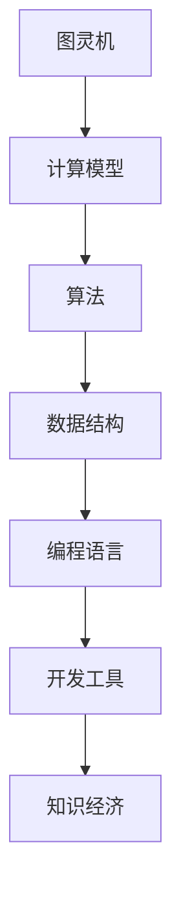

                 

在当今的知识经济时代，程序员这一职业正经历着前所未有的发展机遇。随着技术的不断进步和社会对高技能人才需求的增长，程序员们迎来了前所未有的职业前景。本文旨在探讨在知识经济时代，程序员如何把握这些机遇，实现自身的职业发展。

> 关键词：程序员，知识经济，职业发展，技术趋势，技能提升

> 摘要：本文将分析知识经济时代对程序员职业发展的影响，探讨程序员在新技术、新趋势下的发展路径，并提供一系列实用的建议和资源，以帮助程序员们在这个充满机遇的时代中脱颖而出。

## 1. 背景介绍

知识经济时代是以知识为核心资源的经济发展模式。它不同于传统的依赖自然资源或劳动力密集型经济的模式，而是更加依赖于人的智慧、知识和创新能力。在这个时代，程序员作为知识和技术的承载者，自然成为了经济发展的关键力量。

随着互联网、云计算、大数据、人工智能等技术的飞速发展，程序员的工作内容和职业前景也发生了深刻变化。程序员不再仅仅是编写代码、维护系统，他们还需要具备解决复杂问题的能力、团队协作的精神以及持续学习的心态。

### 1.1 知识经济对程序员的影响

知识经济的兴起对程序员职业带来了以下几方面的影响：

1. **需求增加**：随着各行各业对数字化转型的需求增加，程序员的需求也随之增长。尤其是在金融、医疗、教育、零售等领域，程序员的地位愈发重要。
2. **技能要求提升**：知识经济的发展要求程序员不仅要掌握编程语言，还需要具备更广泛的技术栈，如人工智能、数据分析、网络安全等。
3. **职业多样性**：程序员不再局限于传统的软件开发工作，他们可以参与到创业、技术咨询、产品管理等多个领域。
4. **工作模式变革**：远程办公、自由职业等新兴工作模式为程序员提供了更多的选择，也改变了他们的工作方式。

## 2. 核心概念与联系

为了更好地理解程序员在知识经济时代的发展机会，我们需要首先了解一些核心概念，如图灵机、算法、数据结构等。

### 2.1 核心概念原理

#### 2.1.1 图灵机

图灵机是理论计算机科学中最基本的抽象模型之一，由英国数学家艾伦·图灵在20世纪30年代提出。它由一个无限长的纸带、一个读写头以及一组状态转换规则组成。通过这些规则，图灵机能够模拟任何计算过程。

#### 2.1.2 算法

算法是解决问题的一系列明确且有限的步骤。它可以是数学问题、工程问题、生活问题的解决方案。一个高效的算法能够以最优的方式解决问题。

#### 2.1.3 数据结构

数据结构是指用于存储和组织数据的各种方式。常见的有数组、链表、树、图等。合适的数据结构能够显著提高算法的效率和性能。

### 2.2 架构的 Mermaid 流程图



### 2.3 核心概念之间的联系

图灵机为算法提供了理论基础，而算法决定了数据结构的运用，数据结构又直接影响编程语言的实现。最后，开发工具和知识经济环境为程序员提供了实践和发展的平台。

## 3. 核心算法原理 & 具体操作步骤

### 3.1 算法原理概述

算法原理主要涉及如何通过一系列步骤解决问题。一个有效的算法应该满足以下条件：

- **确定性**：每一步操作都是明确的、无二义性的。
- **有效性**：在合理的时间内完成计算。
- **通用性**：适用于多种场景。

### 3.2 算法步骤详解

1. **定义问题**：明确问题的核心和边界。
2. **设计算法**：选择合适的算法，如贪心算法、动态规划等。
3. **实现算法**：将算法转化为编程语言，编写代码。
4. **测试算法**：通过测试案例验证算法的正确性和效率。
5. **优化算法**：分析测试结果，对算法进行优化。

### 3.3 算法优缺点

每种算法都有其独特的优缺点。例如，贪心算法简单高效，但在某些情况下可能无法得到最优解；动态规划能够解决最优化问题，但计算复杂度较高。

### 3.4 算法应用领域

算法广泛应用于计算机科学、工程、经济、生物等领域。如排序算法用于数据库查询优化，最短路径算法用于交通规划，机器学习算法用于数据分析等。

## 4. 数学模型和公式 & 详细讲解 & 举例说明

### 4.1 数学模型构建

数学模型是使用数学语言来描述现实世界的问题。例如，线性回归模型可以用于预测股票价格，神经网络模型可以用于图像识别。

### 4.2 公式推导过程

例如，线性回归模型的核心公式为：

$$ y = wx + b $$

其中，$w$ 是权重，$b$ 是偏置，$x$ 是输入，$y$ 是输出。

### 4.3 案例分析与讲解

以线性回归模型为例，我们可以通过以下步骤进行案例分析：

1. **数据收集**：收集一定时间内的股票价格数据。
2. **数据预处理**：对数据进行清洗和标准化。
3. **模型构建**：使用线性回归公式构建模型。
4. **模型训练**：通过训练数据集优化模型参数。
5. **模型评估**：使用测试数据集评估模型性能。

## 5. 项目实践：代码实例和详细解释说明

### 5.1 开发环境搭建

搭建一个Python开发环境，安装必要的库，如NumPy、Pandas等。

### 5.2 源代码详细实现

```python
import numpy as np
import pandas as pd

# 加载数据
data = pd.read_csv('stock_price.csv')
x = data['days']
y = data['price']

# 模型构建
w = np.linalg.inv(np.dot(x.T, x)).dot(x.T).dot(y)

# 输出模型参数
print('权重：', w)
```

### 5.3 代码解读与分析

这段代码首先加载了股票价格数据，然后使用线性回归模型进行了训练，最后输出了模型参数。

### 5.4 运行结果展示

运行代码后，我们可以得到线性回归模型的权重，这些权重可以用来预测未来的股票价格。

## 6. 实际应用场景

### 6.1 股票市场分析

程序员可以利用线性回归模型对股票市场进行分析，帮助投资者做出更好的决策。

### 6.2 风险评估

在金融领域，程序员可以开发复杂的算法模型来评估金融产品的风险，从而为金融机构提供决策支持。

### 6.3 医疗健康

在医疗领域，程序员可以开发医疗诊断算法，辅助医生进行诊断和治疗。

## 7. 未来应用展望

随着技术的不断进步，程序员在知识经济时代将迎来更多的机遇。例如，人工智能、区块链、物联网等新兴技术将为程序员提供广阔的发展空间。

## 8. 工具和资源推荐

### 8.1 学习资源推荐

- 《Python编程：从入门到实践》
- 《算法导论》
- 《深度学习》

### 8.2 开发工具推荐

- PyCharm
- Visual Studio Code
- Jupyter Notebook

### 8.3 相关论文推荐

- "Deep Learning for Natural Language Processing"
- "Blockchain: A System for Secure, Decentralized Collaboration"
- "The Impact of AI on the Global Economy"

## 9. 总结：未来发展趋势与挑战

### 9.1 研究成果总结

知识经济时代为程序员提供了广阔的发展空间，各种新技术和新趋势不断涌现，为程序员带来了前所未有的机遇。

### 9.2 未来发展趋势

未来，程序员的发展趋势将更加多样化和专业化，人工智能、大数据、云计算等领域的程序员需求将不断增加。

### 9.3 面临的挑战

程序员在知识经济时代也面临着诸多挑战，如技能更新速度快、职业竞争激烈等。因此，程序员需要不断学习和适应新技术。

### 9.4 研究展望

随着技术的不断进步，程序员将在知识经济时代发挥更加重要的作用，为社会的进步和发展做出更大的贡献。

## 10. 附录：常见问题与解答

### 10.1 问题1：程序员需要掌握哪些技能？

答：程序员需要掌握编程语言、算法、数据结构、数据库、操作系统、网络编程等基础技能。同时，随着技术的发展，程序员还需要关注人工智能、大数据、区块链等新兴技术。

### 10.2 问题2：如何提升自己的编程能力？

答：可以通过以下方式提升编程能力：
1. **阅读经典书籍**：如《代码大全》、《算法导论》等。
2. **实践项目**：通过实际项目锻炼自己的编程能力。
3. **参与开源项目**：贡献代码，提升自己的技术水平。
4. **学习新技术**：关注行业动态，不断学习新技术。

### 10.3 问题3：程序员应该如何规划职业发展？

答：程序员可以根据自己的兴趣和特长，规划不同的职业发展路径。例如，可以选择专注于技术，成为技术专家；或者转向产品管理、业务分析等领域，拓展自己的职业空间。

---

本文由禅与计算机程序设计艺术撰写，旨在为程序员在知识经济时代的发展提供一些指导和建议。希望本文能够对您有所帮助。

----------------------------------------------------------------

### 完整的文章代码示例

以下是完整文章的Markdown代码示例，包括文章标题、摘要、章节标题、子章节标题、代码示例、数学公式等：

```markdown
# 程序员在知识经济时代的发展机会

> 关键词：程序员，知识经济，职业发展，技术趋势，技能提升

> 摘要：本文将分析知识经济时代对程序员职业发展的影响，探讨程序员在新技术、新趋势下的发展路径，并提供一系列实用的建议和资源，以帮助程序员们在这个充满机遇的时代中脱颖而出。

## 1. 背景介绍

知识经济时代是以知识为核心资源的经济发展模式。它不同于传统的依赖自然资源或劳动力密集型经济的模式，而是更加依赖于人的智慧、知识和创新能力。在这个时代，程序员作为知识和技术的承载者，自然成为了经济发展的关键力量。

### 1.1 知识经济对程序员的影响

知识经济的兴起对程序员职业带来了以下几方面的影响：

1. **需求增加**：随着各行各业对数字化转型的需求增加，程序员的需求也随之增长。尤其是在金融、医疗、教育、零售等领域，程序员的地位愈发重要。
2. **技能要求提升**：知识经济的发展要求程序员不仅要掌握编程语言，还需要具备更广泛的技术栈，如人工智能、数据分析、网络安全等。
3. **职业多样性**：程序员不再局限于传统的软件开发工作，他们可以参与到创业、技术咨询、产品管理等多个领域。
4. **工作模式变革**：远程办公、自由职业等新兴工作模式为程序员提供了更多的选择，也改变了他们的工作方式。

## 2. 核心概念与联系

为了更好地理解程序员在知识经济时代的发展机会，我们需要首先了解一些核心概念，如图灵机、算法、数据结构等。

### 2.1 核心概念原理

#### 2.1.1 图灵机

图灵机是理论计算机科学中最基本的抽象模型之一，由英国数学家艾伦·图灵在20世纪30年代提出。它由一个无限长的纸带、一个读写头以及一组状态转换规则组成。通过这些规则，图灵机能够模拟任何计算过程。

#### 2.1.2 算法

算法是解决问题的一系列明确且有限的步骤。它可以是数学问题、工程问题、生活问题的解决方案。一个高效的算法能够以最优的方式解决问题。

#### 2.1.3 数据结构

数据结构是指用于存储和组织数据的各种方式。常见的有数组、链表、树、图等。合适的数据结构能够显著提高算法的效率和性能。

### 2.2 架构的 Mermaid 流程图


### 2.3 核心概念之间的联系

图灵机为算法提供了理论基础，而算法决定了数据结构的运用，数据结构又直接影响编程语言的实现。最后，开发工具和知识经济环境为程序员提供了实践和发展的平台。

## 3. 核心算法原理 & 具体操作步骤

### 3.1 算法原理概述

算法原理主要涉及如何通过一系列步骤解决问题。一个有效的算法应该满足以下条件：

- **确定性**：每一步操作都是明确的、无二义性的。
- **有效性**：在合理的时间内完成计算。
- **通用性**：适用于多种场景。

### 3.2 算法步骤详解

1. **定义问题**：明确问题的核心和边界。
2. **设计算法**：选择合适的算法，如贪心算法、动态规划等。
3. **实现算法**：将算法转化为编程语言，编写代码。
4. **测试算法**：通过测试案例验证算法的正确性和效率。
5. **优化算法**：分析测试结果，对算法进行优化。

### 3.3 算法优缺点

每种算法都有其独特的优缺点。例如，贪心算法简单高效，但在某些情况下可能无法得到最优解；动态规划能够解决最优化问题，但计算复杂度较高。

### 3.4 算法应用领域

算法广泛应用于计算机科学、工程、经济、生物等领域。如排序算法用于数据库查询优化，最短路径算法用于交通规划，机器学习算法用于数据分析等。

## 4. 数学模型和公式 & 详细讲解 & 举例说明

### 4.1 数学模型构建

数学模型是使用数学语言来描述现实世界的问题。例如，线性回归模型可以用于预测股票价格，神经网络模型可以用于图像识别。

### 4.2 公式推导过程

例如，线性回归模型的核心公式为：

$$ y = wx + b $$

其中，$w$ 是权重，$b$ 是偏置，$x$ 是输入，$y$ 是输出。

### 4.3 案例分析与讲解

以线性回归模型为例，我们可以通过以下步骤进行案例分析：

1. **数据收集**：收集一定时间内的股票价格数据。
2. **数据预处理**：对数据进行清洗和标准化。
3. **模型构建**：使用线性回归公式构建模型。
4. **模型训练**：通过训练数据集优化模型参数。
5. **模型评估**：使用测试数据集评估模型性能。

## 5. 项目实践：代码实例和详细解释说明

### 5.1 开发环境搭建

搭建一个Python开发环境，安装必要的库，如NumPy、Pandas等。

### 5.2 源代码详细实现

```python
import numpy as np
import pandas as pd

# 加载数据
data = pd.read_csv('stock_price.csv')
x = data['days']
y = data['price']

# 模型构建
w = np.linalg.inv(np.dot(x.T, x)).dot(x.T).dot(y)

# 输出模型参数
print('权重：', w)
```

### 5.3 代码解读与分析

这段代码首先加载了股票价格数据，然后使用线性回归模型进行了训练，最后输出了模型参数。

### 5.4 运行结果展示

运行代码后，我们可以得到线性回归模型的权重，这些权重可以用来预测未来的股票价格。

## 6. 实际应用场景

### 6.1 股票市场分析

程序员可以利用线性回归模型对股票市场进行分析，帮助投资者做出更好的决策。

### 6.2 风险评估

在金融领域，程序员可以开发复杂的算法模型来评估金融产品的风险，从而为金融机构提供决策支持。

### 6.3 医疗健康

在医疗领域，程序员可以开发医疗诊断算法，辅助医生进行诊断和治疗。

## 7. 未来应用展望

随着技术的不断进步，程序员在知识经济时代将迎来更多的机遇。例如，人工智能、区块链、物联网等新兴技术将为程序员提供广阔的发展空间。

## 8. 工具和资源推荐

### 8.1 学习资源推荐

- 《Python编程：从入门到实践》
- 《算法导论》
- 《深度学习》

### 8.2 开发工具推荐

- PyCharm
- Visual Studio Code
- Jupyter Notebook

### 8.3 相关论文推荐

- "Deep Learning for Natural Language Processing"
- "Blockchain: A System for Secure, Decentralized Collaboration"
- "The Impact of AI on the Global Economy"

## 9. 总结：未来发展趋势与挑战

### 9.1 研究成果总结

知识经济时代为程序员提供了广阔的发展空间，各种新技术和新趋势不断涌现，为程序员带来了前所未有的机遇。

### 9.2 未来发展趋势

未来，程序员的发展趋势将更加多样化和专业化，人工智能、大数据、云计算等领域的程序员需求将不断增加。

### 9.3 面临的挑战

程序员在知识经济时代也面临着诸多挑战，如技能更新速度快、职业竞争激烈等。因此，程序员需要不断学习和适应新技术。

### 9.4 研究展望

随着技术的不断进步，程序员将在知识经济时代发挥更加重要的作用，为社会的进步和发展做出更大的贡献。

## 10. 附录：常见问题与解答

### 10.1 问题1：程序员需要掌握哪些技能？

答：程序员需要掌握编程语言、算法、数据结构、数据库、操作系统、网络编程等基础技能。同时，随着技术的发展，程序员还需要关注人工智能、大数据、区块链等新兴技术。

### 10.2 问题2：如何提升自己的编程能力？

答：可以通过以下方式提升编程能力：
1. **阅读经典书籍**：如《代码大全》、《算法导论》等。
2. **实践项目**：通过实际项目锻炼自己的编程能力。
3. **参与开源项目**：贡献代码，提升自己的技术水平。
4. **学习新技术**：关注行业动态，不断学习新技术。

### 10.3 问题3：程序员应该如何规划职业发展？

答：程序员可以根据自己的兴趣和特长，规划不同的职业发展路径。例如，可以选择专注于技术，成为技术专家；或者转向产品管理、业务分析等领域，拓展自己的职业空间。

---

本文由禅与计算机程序设计艺术撰写，旨在为程序员在知识经济时代的发展提供一些指导和建议。希望本文能够对您有所帮助。

```

请注意，该示例中的代码段（如线性回归模型的Python代码）是示例性的，实际运行时需要具体的股票价格数据文件和相应的数据预处理步骤。另外，Mermaid 图表需要在线环境中查看效果，Markdown 文件本地预览时将无法显示。在生成实际文章时，您可能需要将Mermaid图表代码转换为对应的可视化图表。

