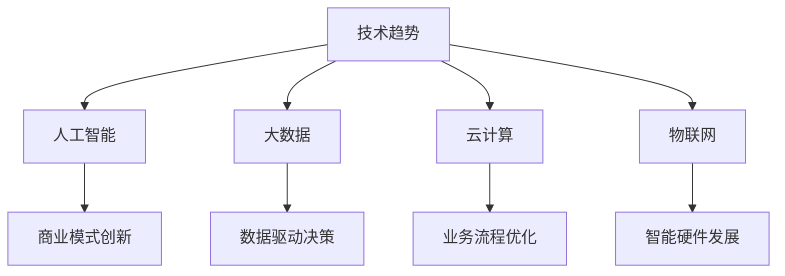
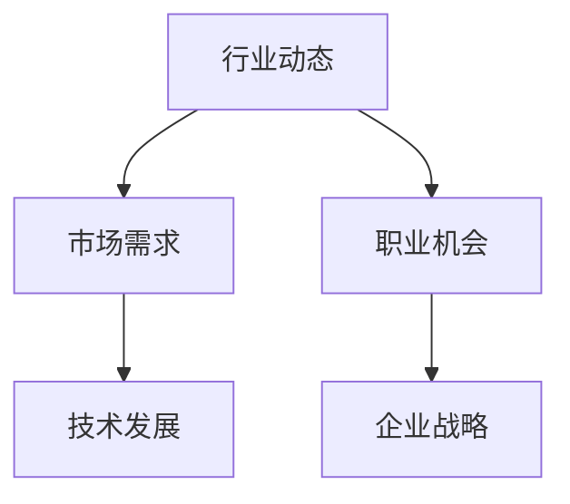
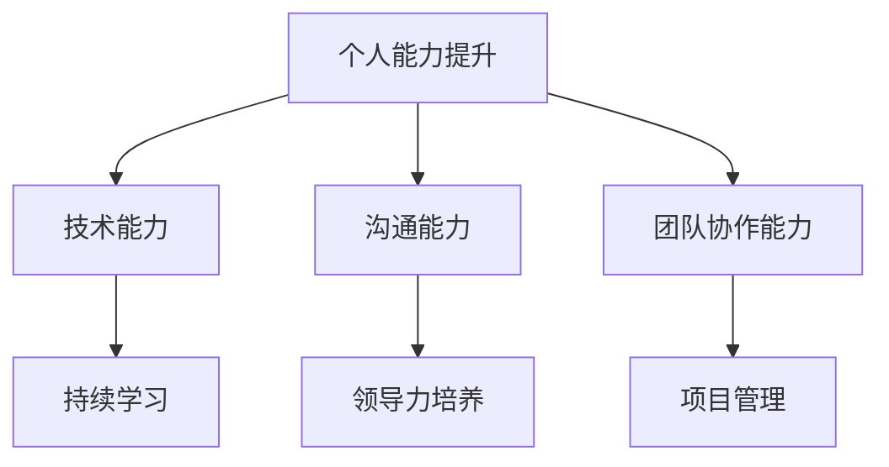
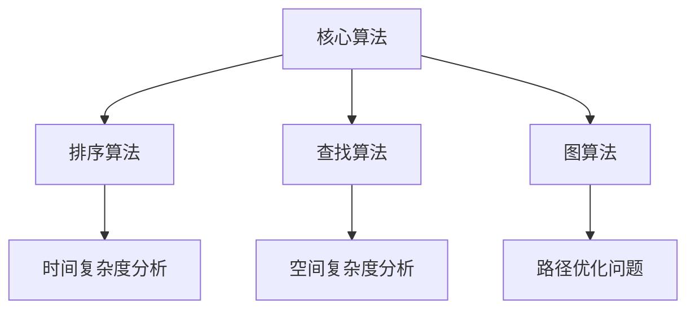
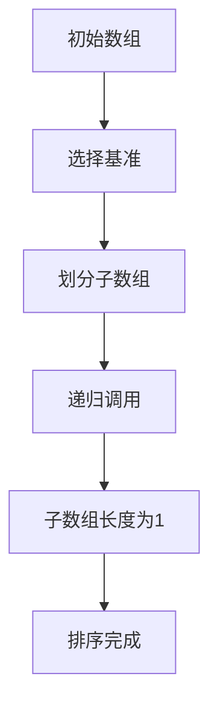
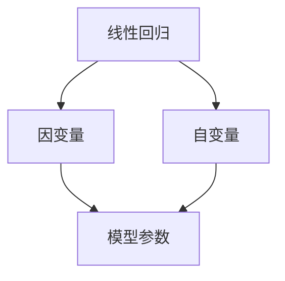
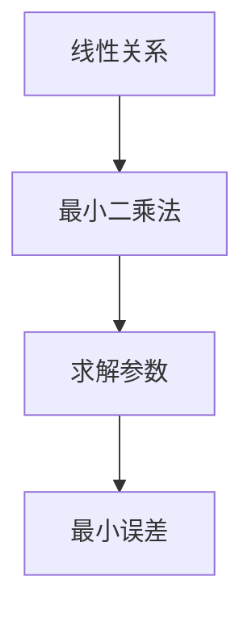

                 

关键词：知识经济、程序员、职业发展、技能提升、技术趋势、行业动态

> 摘要：本文探讨了知识经济时代下，程序员的职业定位与发展路径。通过分析当前技术趋势和行业动态，提出了一系列技能提升策略和职业发展规划，旨在帮助程序员在竞争激烈的职场中脱颖而出。

## 1. 背景介绍

知识经济时代，以信息、知识和创造力为核心的生产力得到了空前的发展。在这个背景下，程序员作为信息技术产业的中坚力量，其职业定位与发展成为了一个备受关注的话题。随着技术的不断进步和行业竞争的加剧，程序员需要不断更新自己的知识和技能，以适应快速变化的市场需求。

### 1.1 知识经济时代的特征

- **信息化程度高**：知识经济依赖于信息技术，信息化程度成为衡量经济发展水平的重要指标。
- **知识创新为主**：知识经济强调创新和创造，知识成为企业竞争的焦点。
- **全球化和网络化**：知识经济时代，全球化和网络化趋势进一步加强，跨国界的合作和竞争愈发频繁。
- **环境可持续性**：知识经济重视可持续发展，注重环境保护和资源利用效率。

### 1.2 程序员在知识经济时代的角色

- **技术创新者**：程序员是技术创新的重要推动力量，他们开发的新技术和新产品推动了知识经济的发展。
- **解决方案提供者**：程序员为企业提供定制化的解决方案，帮助企业在知识经济中取得竞争优势。
- **知识传播者**：程序员通过编写文档、分享经验，促进了知识的传播和应用。

## 2. 核心概念与联系

在知识经济时代，程序员的职业发展离不开以下几个核心概念：技术趋势、行业动态、个人能力提升。

### 2.1 技术趋势

技术趋势是程序员必须关注的重点，包括但不限于人工智能、大数据、云计算、物联网等。这些技术不仅改变了传统的商业模式，也为程序员提供了广阔的发展空间。

#### Mermaid 流程图：



### 2.2 行业动态

行业动态是程序员了解市场需求和职业机会的重要途径。了解行业动态可以帮助程序员把握市场趋势，调整自己的职业发展方向。

#### Mermaid 流程图：



### 2.3 个人能力提升

个人能力提升是程序员职业发展的基础。通过不断学习新技能、提升自身综合素质，程序员可以在激烈的竞争中脱颖而出。

#### Mermaid 流程图：



## 3. 核心算法原理 & 具体操作步骤

在知识经济时代，程序员需要掌握一系列核心算法，这些算法不仅能够解决实际问题，还能提升编程能力和思维水平。

### 3.1 算法原理概述

核心算法包括但不限于：排序算法、查找算法、图算法等。这些算法具有不同的原理和适用场景。

#### Mermaid 流程图：



### 3.2 算法步骤详解

以下是排序算法中的快速排序的步骤详解：

#### 快速排序算法步骤：

1. 选择一个基准元素。
2. 将数组分为两个子数组，左子数组小于基准元素，右子数组大于基准元素。
3. 递归地重复步骤1和2，直到所有子数组长度为1。

#### Mermaid 流程图：



### 3.3 算法优缺点

快速排序算法的优点是时间复杂度较低，平均情况下为 \(O(n\log n)\)，但在最坏情况下可能达到 \(O(n^2)\)。优点是原地排序，不需要额外空间。

### 3.4 算法应用领域

快速排序算法广泛应用于数据分析和算法竞赛，如数据分析中的排序任务和算法竞赛中的排序问题。

## 4. 数学模型和公式 & 详细讲解 & 举例说明

在知识经济时代，程序员需要掌握一定的数学模型和公式，这些模型和公式能够帮助程序员更好地理解和解决实际问题。

### 4.1 数学模型构建

以线性回归为例，线性回归模型可以描述因变量与自变量之间的关系。

#### 数学模型：

$$y = ax + b$$

其中，\(y\) 为因变量，\(x\) 为自变量，\(a\) 和 \(b\) 为模型参数。

#### Mermaid 流程图：



### 4.2 公式推导过程

线性回归模型的公式推导过程如下：

1. 假设因变量 \(y\) 与自变量 \(x\) 之间存在线性关系，即 \(y = ax + b\)。
2. 利用最小二乘法求解模型参数 \(a\) 和 \(b\)。
3. 最小二乘法的目标是使得因变量的预测误差最小。

#### Mermaid 流程图：



### 4.3 案例分析与讲解

假设我们要分析一家公司的股票价格与市场指数之间的关系，可以使用线性回归模型进行分析。

1. 收集股票价格和市场指数的历史数据。
2. 使用线性回归模型进行建模，得到模型参数 \(a\) 和 \(b\)。
3. 根据模型预测股票价格的走势。

### 4.4 代码实例和解释说明

下面是使用 Python 实现线性回归模型的代码实例：

```python
import numpy as np
import matplotlib.pyplot as plt

# 收集数据
x = np.array([1, 2, 3, 4, 5])
y = np.array([2, 4, 5, 4, 5])

# 模型参数
a = 1
b = 1

# 预测
y_pred = a * x + b

# 绘图
plt.scatter(x, y)
plt.plot(x, y_pred, 'r')
plt.show()
```

## 5. 项目实践：代码实例和详细解释说明

在知识经济时代，程序员不仅需要掌握理论知识，还需要通过项目实践来提升自己的实际操作能力。以下是一个简单的项目实践实例，我们将使用 Python 编写一个简单的 Web 应用程序。

### 5.1 开发环境搭建

1. 安装 Python 3.8 或更高版本。
2. 安装 Flask 框架：`pip install Flask`
3. 创建一个名为 `app.py` 的 Python 文件。

### 5.2 源代码详细实现

```python
from flask import Flask, request, render_template

app = Flask(__name__)

@app.route('/')
def home():
    return render_template('home.html')

@app.route('/about')
def about():
    return render_template('about.html')

@app.route('/contact', methods=['GET', 'POST'])
def contact():
    if request.method == 'POST':
        name = request.form['name']
        email = request.form['email']
        message = request.form['message']
        # 这里可以添加邮件发送的逻辑
        return f"Thank you, {name}, for contacting us. We will respond to your email at {email}."
    return render_template('contact.html')

if __name__ == '__main__':
    app.run(debug=True)
```

### 5.3 代码解读与分析

- `from flask import Flask, request, render_template`: 导入 Flask 框架的核心模块。
- `app = Flask(__name__)`: 创建一个 Flask 应用程序实例。
- `@app.route('/')`: 定义首页的路由。
- `@app.route('/about')`: 定义关于页面的路由。
- `@app.route('/contact', methods=['GET', 'POST'])`: 定义联系页面的路由，支持 GET 和 POST 请求。
- `render_template`: 渲染 HTML 模板。
- `if __name__ == '__main__': app.run(debug=True)`: 运行 Flask 应用程序，开启调试模式。

### 5.4 运行结果展示

1. 打开浏览器，访问 `http://127.0.0.1:5000/`，可以看到首页。
2. 点击“关于”，跳转到关于页面。
3. 点击“联系”，填写表单并提交，会显示感谢信息。

## 6. 实际应用场景

在知识经济时代，程序员的应用场景非常广泛，从企业内部系统开发到物联网设备编程，再到人工智能应用，程序员都能找到自己的位置。

### 6.1 企业内部系统开发

程序员可以为企业开发定制化的管理系统、办公自动化系统等，提高企业的运行效率。

### 6.2 物联网设备编程

随着物联网技术的普及，程序员可以参与智能家居、智能穿戴设备等物联网设备的编程。

### 6.3 人工智能应用

程序员可以开发人工智能应用程序，如语音识别、图像识别、自然语言处理等，为企业和个人提供智能化的服务。

## 7. 工具和资源推荐

### 7.1 学习资源推荐

- 《算法导论》：介绍了各种核心算法的原理和实现。
- 《Python 编程：从入门到实践》：适合初学者学习 Python 编程。
- 《深度学习》：全面介绍了深度学习的理论和实践。

### 7.2 开发工具推荐

- PyCharm：强大的 Python 集成开发环境。
- Flask：用于 Web 开发的轻量级框架。
- TensorFlow：用于机器学习和深度学习的开源框架。

### 7.3 相关论文推荐

- "Deep Learning for Natural Language Processing":介绍深度学习在自然语言处理领域的应用。
- "The Unreasonable Effectiveness of Deep Learning":深度学习在不同领域的广泛应用。
- "Reinforcement Learning: An Introduction":介绍强化学习的原理和应用。

## 8. 总结：未来发展趋势与挑战

在知识经济时代，程序员的职业发展面临着诸多机遇和挑战。

### 8.1 研究成果总结

- 技术进步不断推动程序员职业的发展。
- 新兴技术如人工智能、大数据等提供了广阔的发展空间。
- 程序员需要不断提升自己的技能和知识水平。

### 8.2 未来发展趋势

- 程序员将继续在信息技术产业中发挥重要作用。
- 程序员的职业领域将不断拓展，从传统的软件开发到人工智能、物联网等领域。
- 程序员的职业发展将更加个性化和多元化。

### 8.3 面临的挑战

- 技术更新速度快，程序员需要不断学习新知识。
- 竞争激烈，程序员需要不断提升自身竞争力。
- 伦理和隐私问题日益突出，程序员需要承担更多的社会责任。

### 8.4 研究展望

- 未来研究将重点关注人工智能、大数据等前沿技术。
- 程序员需要具备跨学科的知识和技能，以应对复杂的实际问题。
- 教育体系将进行改革，以培养更多适应知识经济时代需求的程序员。

## 9. 附录：常见问题与解答

### 9.1 如何提升编程能力？

- **多写代码**：实践是提升编程能力的最佳途径。
- **阅读优秀代码**：学习他人的代码，借鉴优秀的编程风格。
- **参与开源项目**：参与开源项目，锻炼协作能力和项目管理能力。
- **定期复习**：定期回顾已学知识，巩固记忆。

### 9.2 如何保持学习动力？

- **设定明确目标**：明确自己的职业规划和学习目标。
- **寻找学习伙伴**：与志同道合的人一起学习，互相激励。
- **利用在线资源**：利用在线课程、博客、论坛等资源，丰富学习内容。
- **保持好奇心**：对新技术保持好奇心，不断探索新领域。

---

作者：禅与计算机程序设计艺术 / Zen and the Art of Computer Programming


