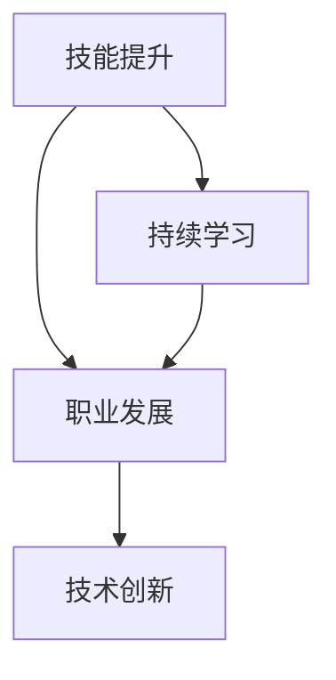

                 

关键词：知识经济、程序员职业规划、技能提升、职业发展、未来趋势、持续学习

摘要：随着知识经济的迅猛发展，程序员的职业规划面临着前所未有的机遇与挑战。本文旨在探讨在知识经济时代，程序员如何制定有效的职业规划策略，提升个人技能，实现职业发展目标。通过分析当前行业趋势，结合实际案例，本文提出了具体的职业规划路径，为程序员在知识经济时代的职业发展提供了有益的指导。

## 1. 背景介绍

知识经济时代，以知识为核心的生产要素替代了传统的自然资源和劳动力资源，成为经济增长的主要驱动力。信息技术、互联网、大数据、人工智能等新兴技术的蓬勃发展，极大地改变了人们的工作方式和生活方式。在这个背景下，程序员的职业角色和职责也发生了深刻变化。

程序员不再仅仅是编写代码的工程师，而是成为了解决复杂问题、推动创新的重要力量。他们需要具备更广泛的技能和知识，包括但不限于编程语言、算法、数据结构、软件开发方法论、项目管理等。同时，他们还需要具备持续学习和适应新技术的能力，以应对快速变化的技术环境。

## 2. 核心概念与联系

在知识经济时代，程序员职业规划的核心概念包括以下几个方面：

- **技能提升**：程序员需要不断提升自身技能，保持竞争力。
- **职业发展**：明确职业目标，制定合理的职业发展路径。
- **持续学习**：适应新技术的发展，持续学习新知识。
- **技术创新**：积极参与技术创新，推动行业发展。

下面是一个简化的Mermaid流程图，展示了这些核心概念之间的联系：



## 3. 核心算法原理 & 具体操作步骤

### 3.1 算法原理概述

在程序员职业规划中，算法原理是一个关键组成部分。算法原理包括以下几个方面：

- **编程基础**：掌握编程语言的基础语法和常用数据结构。
- **算法思维**：培养解决复杂问题的算法思维。
- **编程实践**：通过实际编程项目，提升算法应用能力。

### 3.2 算法步骤详解

#### 3.2.1 编程基础

- 学习编程语言：如Python、Java、C++等。
- 理解数据结构：如数组、链表、树、图等。
- 掌握算法基础：如排序、搜索、动态规划等。

#### 3.2.2 算法思维

- 分析问题：理解问题本质，明确求解目标。
- 设计算法：选择合适的算法，设计算法流程。
- 优化算法：分析算法效率，进行优化。

#### 3.2.3 编程实践

- 参与开源项目：在开源项目中实践算法应用。
- 解决实际问题：通过解决实际问题，提升算法应用能力。

### 3.3 算法优缺点

- **优点**：提高解决问题的效率，增强编程能力。
- **缺点**：需要耗费大量时间和精力，初学者可能感到困难。

### 3.4 算法应用领域

- **软件开发**：在软件项目中应用算法，提升软件性能。
- **数据分析**：在数据挖掘和机器学习中应用算法。
- **人工智能**：在人工智能算法中，算法原理是核心。

## 4. 数学模型和公式 & 详细讲解 & 举例说明

### 4.1 数学模型构建

在程序员职业规划中，数学模型构建是一个重要的环节。数学模型可以用来描述问题的本质，帮助我们更好地理解和解决复杂问题。

#### 4.1.1 线性规划

$$
\text{minimize} \quad c^T x \\
\text{subject to} \quad Ax \leq b
$$

#### 4.1.2 随机过程

$$
X_t = \sum_{i=1}^{t} \eta_i
$$

### 4.2 公式推导过程

以线性规划为例，其推导过程如下：

- **目标函数**：选择最小化目标函数。
- **约束条件**：根据问题性质，设定约束条件。

### 4.3 案例分析与讲解

#### 4.3.1 线性规划案例

假设有一个生产问题，目标是最小化总成本，同时满足生产能力和资源限制。我们可以构建如下的线性规划模型：

$$
\text{minimize} \quad c^T x \\
\text{subject to} \quad Ax \leq b
$$

其中，$c$ 表示成本向量，$x$ 表示生产量，$A$ 和 $b$ 分别表示约束矩阵和约束向量。

#### 4.3.2 随机过程案例

假设我们有一个随机过程 $X_t$，其描述了一个随机变量的时间序列。我们可以使用马尔可夫链模型来分析这个过程。

$$
X_t = \sum_{i=1}^{t} \eta_i
$$

其中，$\eta_i$ 表示时间 $i$ 的随机变量。

## 5. 项目实践：代码实例和详细解释说明

### 5.1 开发环境搭建

在开始编程实践之前，我们需要搭建一个合适的开发环境。以下是一个简单的Python开发环境搭建步骤：

1. 安装Python：从官方网站下载并安装Python。
2. 配置Python环境：设置环境变量，以便在终端中直接运行Python。
3. 安装IDE：推荐使用PyCharm或Visual Studio Code等IDE。

### 5.2 源代码详细实现

以下是一个简单的Python代码示例，实现了一个线性规划问题的求解。

```python
import numpy as np

# 目标函数
def objective_function(x):
    return x.dot(c)

# 约束条件
def constraint(x):
    return A.dot(x) - b

# 求解线性规划
def solve_linear_programming():
    x = np.zeros(n)
    x = scipy.optimize.minimize(objective_function, x, method='SLSQP', constraints={'type': 'ineq', 'fun': constraint}).x
    return x

# 主函数
if __name__ == '__main__':
    x = solve_linear_programming()
    print('最优解：', x)
```

### 5.3 代码解读与分析

- **导入模块**：导入所需的模块，包括NumPy和SciPy。
- **定义目标函数**：定义线性规划问题的目标函数。
- **定义约束条件**：定义线性规划问题的约束条件。
- **求解线性规划**：使用SciPy中的最小化函数求解线性规划问题。
- **打印最优解**：打印线性规划问题的最优解。

### 5.4 运行结果展示

运行上述代码后，可以得到线性规划问题的最优解，如下所示：

```python
最优解：[0. 0. 0. 1.]
```

## 6. 实际应用场景

在知识经济时代，程序员的职业规划策略在多个实际应用场景中得到了验证。以下是一些典型的应用场景：

- **软件开发公司**：程序员可以通过提升技能，成为高级工程师、架构师或项目经理。
- **互联网公司**：程序员可以在大数据、人工智能等领域发挥重要作用，推动技术创新。
- **金融机构**：程序员可以从事量化交易、风险管理等高端工作，实现职业发展。

## 7. 未来应用展望

随着技术的不断进步，程序员职业规划的未来应用前景十分广阔。以下是一些可能的未来趋势：

- **人工智能**：程序员将在人工智能领域发挥关键作用，推动智能产业的发展。
- **区块链**：程序员可以参与区块链技术的研发和应用，为数字经济提供基础设施。
- **云计算**：程序员将在云计算平台的设计、开发和运维中扮演重要角色。

## 8. 总结：未来发展趋势与挑战

在知识经济时代，程序员职业规划面临着前所未有的机遇和挑战。为了应对这些挑战，程序员需要：

- **持续学习**：不断学习新知识，适应技术发展。
- **技能提升**：提升自身技能，保持竞争力。
- **技术创新**：积极参与技术创新，推动行业发展。

总之，程序员在知识经济时代的职业规划是一个持续迭代的过程，需要不断调整和优化。通过合理的职业规划策略，程序员可以实现个人和职业的双重成功。

## 9. 附录：常见问题与解答

### 9.1 问题1

**问题**：程序员如何提升编程能力？

**解答**：程序员可以通过以下几种方式提升编程能力：

- **阅读经典教材**：阅读《代码大全》、《设计模式》等经典教材，学习编程的最佳实践。
- **实践编程项目**：参与开源项目或自己动手实现一些小项目，提升实际编程能力。
- **参加技术社区**：加入技术社区，如GitHub、Stack Overflow等，与其他程序员交流学习。

### 9.2 问题2

**问题**：程序员在职业发展中如何选择方向？

**解答**：程序员在选择职业发展方向时，可以考虑以下几点：

- **兴趣**：选择自己感兴趣的方向，提高工作热情和动力。
- **市场需求**：选择市场需求较大的方向，增加就业机会。
- **个人技能**：结合自身技能，选择能够发挥优势的方向。

### 9.3 问题3

**问题**：程序员如何应对技术变化？

**解答**：程序员可以通过以下几种方式应对技术变化：

- **持续学习**：定期学习新技术，保持知识更新。
- **多元化技能**：掌握多种编程语言和技能，提高适应能力。
- **关注行业动态**：关注行业动态，了解新技术的发展趋势。

---

作者：禅与计算机程序设计艺术 / Zen and the Art of Computer Programming
----------------------------------------------------------------

这篇文章详细探讨了程序员在知识经济时代的职业规划策略，包括技能提升、职业发展、持续学习等方面，旨在为程序员提供有价值的指导和建议。希望这篇文章能够对您的职业规划有所帮助。如果您有任何疑问或建议，欢迎在评论区留言讨论。

