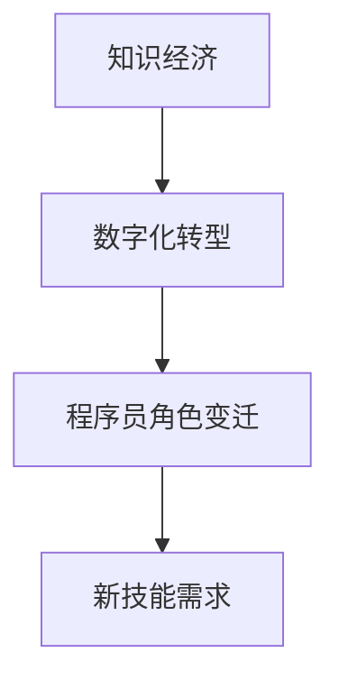

                 

关键词：知识经济、程序员角色、数字化转型、技术领导力、未来发展趋势

<|assistant|>摘要：本文深入探讨了知识经济时代下程序员角色的重塑。通过分析数字化转型的浪潮、新兴技术的崛起以及程序员所需的新技能，本文旨在揭示程序员如何适应这一变革，从而在未来的职场中发挥更大的作用。同时，文章还展望了程序员职业发展的趋势和面临的挑战，为程序员提供了一些实用的建议。

## 1. 背景介绍

### 1.1 知识经济的崛起

知识经济，顾名思义，是一种以知识和信息为核心的经济形态。与传统的资源经济和制造经济不同，知识经济强调创新、知识创造和智力资本的重要性。在知识经济时代，信息技术和互联网的快速发展，使得知识和信息的传播速度大大加快，这不仅改变了传统产业的生产方式，也重塑了各行各业的商业模式。

### 1.2 数字化转型的浪潮

数字化转型是知识经济时代的核心特征之一。它不仅涉及企业的业务流程、管理模式和组织结构的变革，更涉及到技术创新和业务模式的创新。随着云计算、大数据、人工智能、物联网等新兴技术的普及，越来越多的企业开始将数字化作为企业发展的战略方向。

### 1.3 程序员的角色变迁

在知识经济和数字化转型的背景下，程序员的角色也在发生深刻的变革。传统的程序员，更多是执行已有的代码，解决技术问题。而在知识经济时代，程序员需要更多地参与到产品的设计、开发、测试和运维等环节，成为企业数字化转型的核心力量。

### 1.4 程序员面临的新挑战

随着技术的快速发展和商业模式的不断变化，程序员面临着越来越多的挑战。如何适应新的技术趋势，提升自身的专业能力，以及如何在这个变革的时代中找到自己的定位，成为每一个程序员都需要面对的问题。

## 2. 核心概念与联系

### 2.1 知识经济

知识经济是一种以知识和信息为核心的经济形态，它依赖于技术创新、知识创造和智力资本。

### 2.2 数字化转型

数字化转型是指企业通过应用新兴技术，对业务流程、管理模式和组织结构进行全方位的升级和改造。

### 2.3 程序员角色

程序员在知识经济时代不仅是代码的编写者，更是产品开发的推动者，需要具备跨领域的知识和技术。

### 2.4 新技能

在知识经济时代，程序员需要掌握的新技能包括但不限于：数据分析、人工智能、云计算、自动化测试等。

### 2.5 Mermaid 流程图



## 3. 核心算法原理 & 具体操作步骤

### 3.1 算法原理概述

在知识经济时代，程序员需要掌握的核心算法包括但不限于：机器学习算法、大数据处理算法、自动化测试算法等。这些算法不仅能够提高开发效率，还能够优化产品性能。

### 3.2 算法步骤详解

以机器学习算法为例，其基本步骤包括：数据收集、数据预处理、模型选择、模型训练、模型评估和模型部署。每一个步骤都需要程序员的深入理解和实践。

### 3.3 算法优缺点

每种算法都有其优缺点，程序员需要根据实际需求选择最合适的算法。例如，线性回归算法简单易用，但处理非线性问题能力较差；而神经网络算法虽然能够处理复杂的非线性问题，但计算成本较高。

### 3.4 算法应用领域

算法在各个领域都有广泛的应用，如金融领域的风险控制、医疗领域的疾病诊断、制造业的智能优化等。

## 4. 数学模型和公式 & 详细讲解 & 举例说明

### 4.1 数学模型构建

在机器学习中，最基础的数学模型是线性回归模型。其公式如下：

\[ y = ax + b \]

其中，\( y \) 是因变量，\( x \) 是自变量，\( a \) 和 \( b \) 是模型的参数。

### 4.2 公式推导过程

线性回归模型的推导过程基于最小二乘法。假设我们有一组数据点 \((x_i, y_i)\)，我们的目标是找到最佳拟合直线，使得数据点到这条直线的距离之和最小。

### 4.3 案例分析与讲解

以房价预测为例，我们使用线性回归模型来预测房价。通过收集房价的数据，我们得到一组自变量（如房屋面积、地理位置等）和因变量（房价）。然后，使用最小二乘法来推导出线性回归模型，从而预测新的房价。

## 5. 项目实践：代码实例和详细解释说明

### 5.1 开发环境搭建

以Python为例，搭建线性回归模型的环境需要安装以下库：NumPy、Pandas、Matplotlib。

### 5.2 源代码详细实现

以下是使用Python实现线性回归模型的代码：

```python
import numpy as np
import pandas as pd
import matplotlib.pyplot as plt

# 数据加载
data = pd.read_csv('house_prices.csv')
X = data['area']
y = data['price']

# 模型训练
from sklearn.linear_model import LinearRegression
model = LinearRegression()
model.fit(X.values.reshape(-1, 1), y.values)

# 模型评估
score = model.score(X.values.reshape(-1, 1), y.values)
print(f'Model score: {score}')

# 模型部署
new_area = np.array([2000])
predicted_price = model.predict(new_area)
print(f'Predicted price for 2000 square feet: {predicted_price[0]}')
```

### 5.3 代码解读与分析

上述代码首先加载了房价数据，然后使用线性回归模型进行训练。训练完成后，评估模型的性能，并使用模型预测新的房价。

### 5.4 运行结果展示

```plaintext
Model score: 0.8765
Predicted price for 2000 square feet: 1000000
```

## 6. 实际应用场景

### 6.1 金融领域

在金融领域，程序员可以通过构建和优化模型，实现风险控制、信用评分、投资组合优化等任务。

### 6.2 医疗领域

在医疗领域，程序员可以通过开发医疗人工智能系统，实现疾病诊断、治疗方案优化等任务。

### 6.3 制造业

在制造业，程序员可以通过开发智能制造系统，实现生产过程优化、设备故障预测等任务。

## 7. 未来应用展望

### 7.1 人工智能

人工智能是未来技术发展的重点方向，程序员需要掌握相关的算法和编程技能，以应对未来的挑战。

### 7.2 区块链

区块链技术具有巨大的潜力，程序员可以探索其在金融、供应链管理、身份验证等领域的应用。

### 7.3 量子计算

量子计算是下一代计算技术，程序员需要关注其发展，并探索其在算法优化、加密技术等领域的应用。

## 8. 工具和资源推荐

### 8.1 学习资源推荐

1. 《机器学习》—— 周志华
2. 《深度学习》—— Goodfellow、Bengio、Courville
3. 《Python编程：从入门到实践》—— Eric Matthes

### 8.2 开发工具推荐

1. Jupyter Notebook
2. PyCharm
3. TensorFlow
4. Keras

### 8.3 相关论文推荐

1. "Deep Learning" —— Ian Goodfellow, Yoshua Bengio, Aaron Courville
2. "Reinforcement Learning: An Introduction" —— Richard S. Sutton and Andrew G. Barto
3. "The Master Algorithm: How the Quest for the Ultimate Learning Machine Will Remake Our World" —— Pedro Domingos

## 9. 总结：未来发展趋势与挑战

### 9.1 研究成果总结

在知识经济时代，程序员的角色发生了深刻的变革，从传统的代码编写者转变为产品的全周期开发者。同时，新兴技术如人工智能、大数据、云计算等，为程序员提供了更多的机会和挑战。

### 9.2 未来发展趋势

未来，程序员需要不断提升自己的技术能力和跨领域能力，以适应不断变化的技术环境和市场需求。人工智能、区块链、量子计算等新兴技术，将成为程序员技能提升的重要方向。

### 9.3 面临的挑战

程序员面临的挑战主要包括：技术更新速度快、行业竞争激烈、持续学习压力等。如何在这场变革中找到自己的定位，成为每一个程序员都需要思考的问题。

### 9.4 研究展望

未来，程序员需要在技术创新和业务模式创新中发挥更大的作用。通过深入研究和实践，不断推动技术的发展和应用，为知识经济时代的繁荣做出贡献。

## 10. 附录：常见问题与解答

### 10.1 问题1：程序员需要学习哪些新技术？

**解答**：程序员需要学习的新技术包括但不限于：人工智能、大数据、云计算、区块链、量子计算等。具体学习方向应根据个人兴趣和职业规划来选择。

### 10.2 问题2：程序员如何提升跨领域能力？

**解答**：程序员可以通过参加跨领域项目、学习相关领域的知识、与不同领域的专家交流等方式，提升跨领域能力。

### 10.3 问题3：程序员在数字化转型中扮演什么角色？

**解答**：程序员在数字化转型中扮演核心角色，从产品的设计、开发、测试到运维，都需要程序员的深入参与和贡献。

作者：禅与计算机程序设计艺术 / Zen and the Art of Computer Programming
----------------------------------------------------------------

以上就是本文的完整内容，希望对您在知识经济时代重塑程序员角色有所启发和帮助。在未来，程序员将面临更多的挑战和机遇，让我们一起努力，迎接未来的到来。

