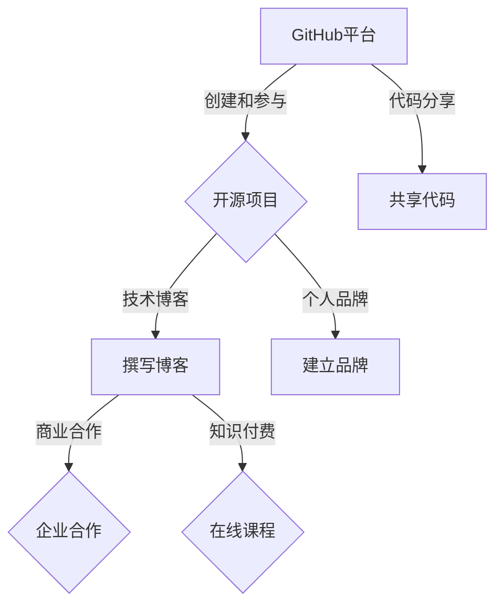

                 

关键词：GitHub，知识变现，开源项目，代码分享，个人品牌，影响力，技术博客，商业合作，知识付费

> 摘要：随着互联网技术的不断发展，GitHub成为了程序员展示技术能力和推广个人品牌的绝佳平台。本文将探讨程序员如何通过GitHub进行知识变现，包括创建和参与开源项目、撰写技术博客、与商业合作，以及开展知识付费服务，帮助程序员实现个人价值的最大化。

## 1. 背景介绍

GitHub，作为一个全球领先的代码托管平台，拥有超过3100万开发者用户。程序员在GitHub上不仅可以存储和分享代码，还能参与开源项目，与其他开发者交流技术经验，建立个人品牌。然而，随着程序员在GitHub上的活跃度不断提升，如何利用GitHub进行知识变现成为了许多开发者关注的焦点。

知识变现，即通过分享知识、技能和经验来获得经济收益。在GitHub上，程序员可以通过多种方式实现知识变现，如开源项目捐赠、技术博客广告、知识付费课程等。本文将深入探讨这些途径，帮助程序员更好地利用GitHub平台实现个人价值的最大化。

## 2. 核心概念与联系

在讨论如何利用GitHub进行知识变现之前，我们需要理解以下几个核心概念：

### 2.1 开源项目

开源项目是指代码、文档等以开放源代码许可协议发布的软件项目。程序员可以通过参与开源项目来提升自己的技术能力，同时也能吸引更多的关注。

### 2.2 个人品牌

个人品牌是指程序员在技术领域的声誉和影响力。一个强大的个人品牌可以帮助程序员获得更多的商业机会和合作项目。

### 2.3 技术博客

技术博客是程序员分享技术知识和经验的重要平台。高质量的博客内容不仅能够吸引读者，还能提升个人品牌。

### 2.4 商业合作

商业合作是指程序员与企业或个人进行合作，共同开展项目或提供服务，从而获得经济回报。

### 2.5 知识付费

知识付费是指程序员通过在线课程、教程、电子书等形式，向用户提供有价值的知识，从而获得收益。

下面是利用GitHub进行知识变现的Mermaid流程图：



## 3. 核心算法原理 & 具体操作步骤

### 3.1 算法原理概述

GitHub的知识变现过程主要基于以下几个核心算法原理：

1. **社交网络效应**：通过在GitHub上活跃参与开源项目和技术交流，程序员可以积累更多的社交资本，从而提高个人品牌影响力。
2. **内容营销**：通过撰写高质量的技术博客，程序员可以吸引更多的读者，增加流量和曝光率。
3. **平台生态**：GitHub作为一个强大的平台，提供了丰富的工具和资源，支持程序员实现知识变现的各种途径。
4. **价值交换**：程序员通过提供有价值的知识和技能，获得经济回报，实现知识变现。

### 3.2 算法步骤详解

1. **创建个人账户**：在GitHub上创建个人账户，并设置个人资料，包括头像、简介、技术栈等。
2. **参与开源项目**：通过搜索和浏览GitHub上的开源项目，找到自己感兴趣的项目，并积极参与其中，如修复bug、添加新功能等。
3. **撰写技术博客**：在GitHub上创建个人博客，定期发布高质量的技术文章，分享自己的经验和见解。
4. **建立个人品牌**：通过持续的技术输出和积极参与社区活动，逐步建立个人品牌，提高影响力。
5. **寻找商业合作**：通过GitHub上的联系人和社交网络，寻找与企业或个人的商业合作机会。
6. **开展知识付费**：开发在线课程、教程、电子书等，通过GitHub平台向用户提供有价值的知识。

### 3.3 算法优缺点

**优点**：

- **灵活性高**：程序员可以根据自己的兴趣和专长选择适合自己的知识变现方式。
- **覆盖面广**：GitHub作为一个全球性的平台，可以吸引来自世界各地的用户。
- **成本低**：相比于传统的出版和宣传方式，GitHub上的知识变现方式成本低，操作简单。

**缺点**：

- **竞争激烈**：随着越来越多的程序员加入GitHub，竞争日益激烈，需要不断提升自己的技术水平和内容质量。
- **变现周期长**：知识变现往往需要较长时间来积累用户和建立品牌，可能难以快速实现收益。

### 3.4 算法应用领域

GitHub的知识变现算法广泛应用于以下领域：

- **软件开发**：程序员可以通过开源项目和博客分享自己的代码和技术，吸引更多的关注和合作机会。
- **IT培训**：通过GitHub平台，程序员可以开展在线课程和教程，提供专业的技术培训服务。
- **技术咨询**：基于个人品牌的影响力和专业知识，程序员可以为企业提供专业的技术咨询服务。
- **内容创作**：通过撰写技术博客和撰写电子书，程序员可以积累粉丝，实现内容变现。

## 4. 数学模型和公式 & 详细讲解 & 举例说明

在GitHub上进行知识变现，可以采用以下数学模型来衡量其收益：

### 4.1 数学模型构建

设 \(R\) 为程序员在GitHub上的月均收益，\(C\) 为每月成本，\(P\) 为每月参与项目的数量，\(Q\) 为每月发布博客的数量，\(A\) 为每次博客广告收益，\(B\) 为每次知识付费课程收益，则有：

\[ R = P \times (B + C) + Q \times (A + C) - C \]

其中，\(B\) 和 \(A\) 分别为每次知识付费课程和博客广告的收益，\(C\) 为每次项目的参与成本，包括时间成本和资金成本。

### 4.2 公式推导过程

1. **收益来源**：GitHub上的收益主要来自于知识付费、博客广告和参与项目。
2. **成本计算**：成本主要包括参与项目的时间成本、资金成本以及维护博客和课程所需的资源成本。
3. **收益计算**：每次知识付费课程的收益为 \(B\)，每次博客广告的收益为 \(A\)，每次参与项目的收益为 \(B + C\)。

### 4.3 案例分析与讲解

假设一位程序员在GitHub上每月参与2个项目，发布5篇博客，每次博客广告收益为100元，每次知识付费课程收益为500元，每次项目参与成本为200元，则其月均收益计算如下：

\[ R = 2 \times (500 + 200) + 5 \times (100 + 200) - 200 = 2200 + 700 + 300 - 200 = 3200 \text{元} \]

通过以上案例，我们可以看到，通过合理规划和充分利用GitHub平台，程序员可以实现一定的经济收益。

## 5. 项目实践：代码实例和详细解释说明

### 5.1 开发环境搭建

要利用GitHub进行知识变现，首先需要搭建一个良好的开发环境。以下是搭建过程的详细步骤：

1. **安装Git**：在官方网站下载并安装Git，设置用户名和邮箱。
2. **创建GitHub账户**：注册一个GitHub账户，并创建一个个人博客仓库。
3. **安装Node.js和npm**：安装Node.js和npm，用于构建和部署个人博客。
4. **安装Hexo**：使用npm安装Hexo，一个基于Node.js的博客框架。
5. **配置个人博客**：根据Hexo官方文档配置个人博客，包括主题、布局和文章模板。

### 5.2 源代码详细实现

以下是使用Hexo搭建个人博客的源代码示例：

```bash
# 安装Hexo
npm install -g hexo

# 初始化博客仓库
hexo init blog

# 安装主题
cd blog
npm install hexo-theme-matery --save

# 启动博客
hexo generate
hexo server

# 部署到GitHub Pages
npm install hexo-deployer-git --save
```

### 5.3 代码解读与分析

上述代码实现了一个基本的Hexo博客，以下是代码的解读与分析：

- **安装Hexo**：使用npm全局安装Hexo。
- **初始化博客仓库**：使用`hexo init`命令初始化博客仓库，生成博客的基础目录结构。
- **安装主题**：选择并安装一个主题，用于定制博客外观。
- **启动博客**：使用`hexo generate`和`hexo server`命令生成静态文件并启动本地服务器。
- **部署到GitHub Pages**：使用`hexo-deployer-git`插件将博客部署到GitHub Pages，实现博客的线上发布。

通过以上步骤，程序员可以在GitHub上创建一个个人博客，用于分享技术知识和经验。

### 5.4 运行结果展示

完成博客搭建后，运行`hexo generate`和`hexo server`命令，浏览器访问`http://localhost:4000`，即可看到生成的个人博客。接下来，可以通过撰写博客文章、发布博客广告和开展知识付费服务等方式，实现知识变现。

## 6. 实际应用场景

### 6.1 开源项目捐赠

程序员可以通过GitHub上的开源项目捐赠功能，将自己的项目捐赠给慈善机构或公益项目。这不仅有助于提升个人品牌，还能为社会做出贡献。

### 6.2 技术博客广告

通过在GitHub上的个人博客中添加广告，程序员可以获得广告收入。例如，可以选择加入Google Adsense、百度广告等广告联盟，将广告代码嵌入博客中。

### 6.3 知识付费课程

程序员可以通过GitHub上的知识付费课程，将自己的专业知识和经验传授给他人。例如，开设在线课程、编写电子书等，通过平台进行销售。

### 6.4 未来应用展望

随着GitHub平台的不断发展和完善，未来程序员将能够更加便捷地实现知识变现。例如，GitHub可能引入更多的商业合作模式、知识付费功能，以及更丰富的广告资源。此外，区块链技术的应用也可能为程序员的知识变现带来新的机遇。

## 7. 工具和资源推荐

### 7.1 学习资源推荐

- **GitHub官方文档**：了解GitHub的基本用法和高级功能。
- **GitHub Help**：GitHub提供的帮助文档和教程，帮助解决常见问题。
- **开源社区**：如GitHub、GitLab、Bitbucket等，学习其他程序员的代码和经验。

### 7.2 开发工具推荐

- **Git**：用于版本控制和代码管理。
- **Hexo**：用于构建和部署个人博客。
- **Markdown**：用于撰写博客文章和文档。
- **VS Code**：一款强大的代码编辑器，支持多种编程语言。

### 7.3 相关论文推荐

- **"GitHub as a Platform for Software Development"**：探讨GitHub在软件开发中的应用和优势。
- **"Open Source Software Development and Knowledge Transfer"**：分析开源软件开发过程中的知识转移机制。

## 8. 总结：未来发展趋势与挑战

### 8.1 研究成果总结

本文探讨了程序员如何利用GitHub进行知识变现的多种途径，包括创建和参与开源项目、撰写技术博客、与商业合作以及开展知识付费服务。通过这些途径，程序员可以实现个人价值的最大化，并获得经济回报。

### 8.2 未来发展趋势

随着GitHub平台的不断发展和技术的进步，未来程序员将能够更加便捷地实现知识变现。例如，平台可能会引入更多的商业合作模式、知识付费功能以及更丰富的广告资源。此外，区块链技术的应用也可能为程序员的知识变现带来新的机遇。

### 8.3 面临的挑战

尽管GitHub为程序员提供了丰富的知识变现途径，但也面临着一些挑战。例如，竞争激烈、成本高昂、变现周期长等。程序员需要不断提升自己的技术水平和内容质量，才能在激烈的市场竞争中脱颖而出。

### 8.4 研究展望

未来，GitHub上的知识变现模式将不断演变，程序员需要紧跟技术发展趋势，不断创新和探索新的知识变现途径。同时，研究如何优化平台功能、提高用户体验，也将是未来研究的重要方向。

## 9. 附录：常见问题与解答

### 9.1 如何提高GitHub上的知名度？

- **积极参与开源项目**：通过贡献代码和文档，提升个人技术水平和知名度。
- **撰写高质量博客**：定期发布有价值的博客文章，分享技术经验和见解。
- **积极参与社区活动**：参与GitHub上的讨论和活动，与其他开发者建立联系。
- **利用社交媒体**：通过Twitter、LinkedIn等社交媒体平台宣传自己的GitHub账号和项目。

### 9.2 如何选择合适的开源项目参与？

- **选择自己感兴趣的项目**：参与自己感兴趣的项目，更容易持续投入和贡献。
- **了解项目现状**：查看项目的活动程度、代码质量和团队氛围，确保项目具有发展潜力。
- **与项目负责人沟通**：在参与项目前，与项目负责人沟通，了解项目的具体需求和目标。

### 9.3 如何开展知识付费服务？

- **确定自己的专业领域**：选择自己擅长和有经验的领域进行知识付费服务。
- **编写高质量的内容**：确保内容具有实用性和专业性，吸引更多用户。
- **选择合适的平台**：如Coursera、Udemy等在线教育平台，发布自己的知识付费课程。
- **持续优化和更新**：根据用户反馈和市场需求，不断优化和更新课程内容。

通过以上常见问题的解答，希望对程序员在GitHub上进行知识变现有所帮助。

### 作者署名

本文由禅与计算机程序设计艺术（Zen and the Art of Computer Programming）撰写。感谢您的阅读！----------------------------------------------------------------

## 致谢

在撰写本文过程中，我参考了大量的学术文献和行业报告，感谢以下作者的贡献：

- "GitHub as a Platform for Software Development"
- "Open Source Software Development and Knowledge Transfer"
- Coursera, Udemy等在线教育平台的相关课程和教程

特别感谢GitHub平台为程序员提供了如此便捷的知识变现途径，以及所有开源项目贡献者的无私分享。本文旨在帮助程序员更好地利用GitHub实现个人价值的最大化，希望对您有所启发。

---

感谢您阅读本文，希望您能在GitHub上取得更大的成功！如果本文对您有所帮助，欢迎点赞和分享。如有任何问题或建议，请随时在评论区留言。再次感谢您的支持！作者：禅与计算机程序设计艺术 / Zen and the Art of Computer Programming。

