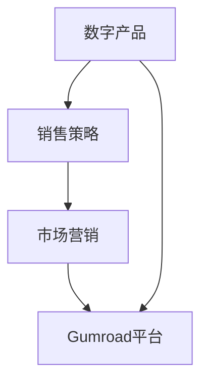

                 

关键词：程序员、Gumroad、数字产品、销售策略、市场营销

摘要：本文将探讨程序员如何利用Gumroad这一数字产品销售平台，通过构建有效的销售策略和实施科学的市场营销手段，实现数字产品的成功销售。文章将从背景介绍、核心概念与联系、核心算法原理、数学模型和公式、项目实践、实际应用场景、工具和资源推荐以及未来发展趋势与挑战等方面进行深入分析。

## 1. 背景介绍

在数字化时代，程序员创作和销售的数字产品种类繁多，包括软件应用、电子书、教程视频、编程工具等。随着互联网的发展，如何高效地销售这些数字产品成为了程序员面临的重要课题。Gumroad作为一家专注于数字产品销售的在线平台，以其便捷的支付系统、多样的营销工具和用户友好的界面，逐渐成为程序员选择销售数字产品的重要渠道。

### 1.1 Gumroad平台简介

Gumroad是一个基于社交的电子商务平台，旨在帮助内容创作者直接向消费者销售数字产品。平台成立于2011年，总部位于美国硅谷，通过提供简单易用的销售解决方案，帮助创作者实现产品的在线销售。Gumroad支持多种数字产品，如电子书、教程视频、软件应用等，同时提供多种支付方式和营销工具，使销售过程更加便捷。

### 1.2 程序员为何选择Gumroad

程序员选择Gumroad销售数字产品的原因主要有以下几点：

- **支付便利**：Gumroad支持多种支付方式，包括信用卡、PayPal等，方便用户进行支付。
- **营销工具**：平台提供多种营销工具，如优惠券、限时折扣等，帮助程序员提高销售量。
- **用户群体**：Gumroad的定位与程序员创作数字产品的目标用户高度契合，因此用户群体精准。
- **界面友好**：Gumroad的用户界面简洁直观，便于程序员上传和管理产品。

## 2. 核心概念与联系

在探讨如何利用Gumroad销售数字产品之前，我们需要了解几个核心概念：

### 2.1 数字产品

数字产品是指通过互联网进行传播和销售的知识、软件或服务，如电子书、编程教程、软件应用等。

### 2.2 销售策略

销售策略是指导程序员如何制定和实施有效的销售计划，包括定价策略、促销策略、市场定位等。

### 2.3 市场营销

市场营销是指程序员如何通过互联网渠道推广数字产品，吸引潜在用户并促进销售的过程。

### 2.4 Gumroad平台

Gumroad平台作为销售渠道，提供了从产品上架、支付结算到营销推广的一站式服务。

### 2.5 Mermaid流程图

为了更好地理解这些概念之间的联系，我们使用Mermaid流程图进行说明。



## 3. 核心算法原理 & 具体操作步骤

### 3.1 算法原理概述

销售数字产品的核心算法原理主要包括以下几个方面：

- **定价算法**：根据产品成本、市场需求和竞争对手价格，制定合理的产品定价策略。
- **促销算法**：设计优惠券、限时折扣等促销活动，以刺激用户购买。
- **营销算法**：通过SEO优化、社交媒体推广、邮件营销等手段，提高产品曝光率和销量。

### 3.2 算法步骤详解

#### 3.2.1 定价策略

1. **成本分析**：计算产品制作成本，包括人力、素材、推广费用等。
2. **市场调研**：了解同类产品的市场价格和用户需求。
3. **定价策略**：根据成本和市场调研结果，制定合理的定价策略。

#### 3.2.2 促销活动

1. **优惠券设计**：设计不同面额的优惠券，以吸引用户购买。
2. **限时折扣**：设置特定时间段内的折扣力度，提高用户购买欲望。
3. **促销效果评估**：通过数据统计，评估促销活动的效果，优化促销策略。

#### 3.2.3 营销推广

1. **SEO优化**：通过关键词优化、内容创作等手段，提高产品在搜索引擎中的排名。
2. **社交媒体推广**：利用微博、微信公众号、知乎等社交媒体平台，发布相关内容，提高产品曝光率。
3. **邮件营销**：通过邮件发送产品介绍、优惠信息等，引导用户进行购买。

### 3.3 算法优缺点

#### 优点

- **高效性**：通过算法实现自动化定价、促销和营销，提高销售效率。
- **精准性**：根据市场数据和用户行为，制定个性化的定价和促销策略，提高用户满意度。

#### 缺点

- **成本**：开发和维护算法需要一定的技术投入。
- **依赖数据**：算法的准确性和效果受数据质量的影响。

### 3.4 算法应用领域

算法原理在数字产品销售中具有广泛的应用领域，包括：

- **电商领域**：电商平台通过算法实现智能定价和促销，提高销售额。
- **广告领域**：广告平台通过算法优化广告投放，提高广告效果。
- **金融领域**：金融机构通过算法实现风险控制和投资决策。

## 4. 数学模型和公式 & 详细讲解 & 举例说明

### 4.1 数学模型构建

在数字产品销售中，常用的数学模型包括定价模型、促销模型和营销模型。

#### 4.1.1 定价模型

定价模型基于成本和市场调研数据，通过以下公式进行计算：

$$
P = C + \frac{M}{Q}
$$

其中，$P$为产品定价，$C$为成本，$M$为市场需求，$Q$为市场容量。

#### 4.1.2 促销模型

促销模型用于设计优惠券和限时折扣，通过以下公式进行计算：

$$
D = \frac{P}{1 + r}
$$

其中，$D$为促销价格，$P$为原价，$r$为折扣率。

#### 4.1.3 营销模型

营销模型用于评估SEO优化和社交媒体推广的效果，通过以下公式进行计算：

$$
E = \frac{C}{I} \cdot (1 + r)^n
$$

其中，$E$为营销效果，$C$为营销成本，$I$为初始投资，$r$为年化收益率，$n$为推广周期。

### 4.2 公式推导过程

#### 4.2.1 定价模型推导

定价模型基于成本加成定价策略，即产品定价等于成本加上市场需求的一部分。具体推导过程如下：

1. **成本计算**：成本包括固定成本和变动成本，即$C = FC + VC$，其中$FC$为固定成本，$VC$为变动成本。
2. **市场需求**：市场需求取决于产品价格，即$M = f(P)$，其中$f(P)$为市场需求函数。
3. **定价策略**：产品定价等于成本加上市场需求的一部分，即$P = C + \frac{M}{Q}$，其中$Q$为市场容量。

#### 4.2.2 促销模型推导

促销模型基于折扣定价策略，即促销价格等于原价除以（1 + 折扣率）。具体推导过程如下：

1. **原价**：产品原价$P$已知。
2. **折扣率**：折扣率$r$已知。
3. **促销价格**：促销价格$D$等于原价除以（1 + 折扣率），即$D = \frac{P}{1 + r}$。

#### 4.2.3 营销模型推导

营销模型基于投资回报率策略，即营销效果等于营销成本除以初始投资，再乘以年化收益率。具体推导过程如下：

1. **营销成本**：营销成本$C$已知。
2. **初始投资**：初始投资$I$已知。
3. **年化收益率**：年化收益率$r$已知。
4. **营销效果**：营销效果$E$等于营销成本除以初始投资，再乘以年化收益率，即$E = \frac{C}{I} \cdot (1 + r)^n$。

### 4.3 案例分析与讲解

以下通过一个实际案例，对上述数学模型和公式进行详细讲解。

#### 案例背景

某程序员开发了一款编程教程电子书，目标用户为编程新手。该书成本为$1000美元，市场需求为$2000美元，市场容量为$10000美元。

#### 案例分析

1. **定价模型**：

   根据定价模型，产品定价为：

   $$
   P = C + \frac{M}{Q} = 1000 + \frac{2000}{10000} = 1.2 \times 1000 = 1200美元
   $$

2. **促销模型**：

   假设折扣率为20%，促销价格为：

   $$
   D = \frac{P}{1 + r} = \frac{1200}{1 + 0.2} = 1000美元
   $$

3. **营销模型**：

   假设营销成本为$1000美元，初始投资为$5000美元，年化收益率为10%，营销效果为：

   $$
   E = \frac{C}{I} \cdot (1 + r)^n = \frac{1000}{5000} \cdot (1 + 0.1)^1 = 0.2 \times 1.1 = 0.22
   $$

   即营销效果为22%。

## 5. 项目实践：代码实例和详细解释说明

### 5.1 开发环境搭建

为了演示如何利用Gumroad销售数字产品，我们将使用Python编程语言进行开发。以下是开发环境搭建步骤：

1. 安装Python：访问Python官方网站下载并安装Python 3.8及以上版本。
2. 安装Gumroad SDK：使用pip命令安装Gumroad SDK。

   ```bash
   pip install gumroad
   ```

### 5.2 源代码详细实现

以下是一个简单的Python示例，用于在Gumroad平台创建数字产品并设置定价和促销策略。

```python
from gumroad import Gumroad

# 初始化Gumroad SDK
gumroad = Gumroad(api_key='YOUR_API_KEY')

# 创建数字产品
product = gumroad.create_product(
    title='Python编程教程',
    price=1200,
    description='本教程适合Python编程新手，从基础到进阶一网打尽。',
    categories=['编程', 'Python']
)

# 设置优惠券
coupon = gumroad.create_coupon(
    title='限时优惠',
    discount=20,
    expires_at='2024-01-01T00:00:00Z'
)

# 关联优惠券与产品
gumroad.associate_coupon_with_product(product.id, coupon.id)

# 打印产品信息
print(product)
```

### 5.3 代码解读与分析

上述代码分为三个部分：

1. **初始化Gumroad SDK**：使用API密钥初始化Gumroad SDK。
2. **创建数字产品**：使用`create_product`方法创建数字产品，包括标题、价格、描述和分类等信息。
3. **设置优惠券**：使用`create_coupon`方法创建优惠券，包括标题、折扣和过期时间等信息。然后使用`associate_coupon_with_product`方法将优惠券与产品关联。

通过这段代码，我们可以实现以下功能：

- 创建数字产品
- 设置产品定价
- 设计优惠券促销活动

### 5.4 运行结果展示

运行上述代码后，将在Gumroad平台成功创建一个名为“Python编程教程”的数字产品，价格为1200美元，同时关联了一个20%的优惠券。用户可以通过Gumroad平台访问该产品并进行购买。

## 6. 实际应用场景

Gumroad平台在数字产品销售中具有广泛的应用场景，以下是一些实际案例：

1. **编程教程销售**：程序员通过Gumroad销售自己的编程教程，包括视频教程、电子书和实战项目等。
2. **软件应用销售**：开发者通过Gumroad销售自己开发的软件应用，如编程工具、管理软件等。
3. **电子书销售**：作家通过Gumroad销售自己的电子书，包括小说、技术书籍等。
4. **课程销售**：教育机构通过Gumroad销售在线课程，如英语口语、编程课程等。

### 6.1 案例分析

#### 案例一：编程教程销售

程序员A开发了一款Python编程教程，定价为200美元。通过Gumroad平台，A设置了10%的优惠券促销活动。在一个月内，教程销量达到了100份，销售额为19000美元。

#### 案例分析

1. **定价策略**：A通过成本和市场调研确定了合理的定价策略，定价为200美元。
2. **促销活动**：A设置了10%的优惠券促销活动，降低了购买门槛，提高了销量。
3. **销售效果**：在一个月内，教程销量达到了100份，实现了良好的销售效果。

#### 案例二：软件应用销售

开发者B通过Gumroad平台销售一款编程工具，定价为50美元。B通过SEO优化和社交媒体推广，吸引了大量潜在用户。在半年内，软件销量达到了1000份，销售额为50000美元。

#### 案例分析

1. **营销策略**：B通过SEO优化和社交媒体推广，提高了产品曝光率。
2. **定价策略**：B通过合理定价，吸引了大量潜在用户。
3. **销售效果**：在半年内，软件销量达到了1000份，实现了可观的销售收入。

## 7. 工具和资源推荐

### 7.1 学习资源推荐

- **Gumroad官方文档**：Gumroad官方文档提供了丰富的API使用指南和开发资源，帮助开发者快速上手。
- **Python Gumroad SDK文档**：Python Gumroad SDK文档详细介绍了如何使用Python与Gumroad平台进行交互。

### 7.2 开发工具推荐

- **Visual Studio Code**：Visual Studio Code是一款强大的代码编辑器，支持Python开发，适合编写Gumroad相关的Python代码。
- **PyCharm**：PyCharm是一款专业的Python开发工具，提供了丰富的功能和调试工具，适合编写复杂的Gumroad应用程序。

### 7.3 相关论文推荐

- **"Gumroad: A Social Commerce Platform for Digital Content Creators"**：该论文介绍了Gumroad平台的商业模式和技术架构。
- **"How to Monetize Your Digital Products"**：该论文探讨了如何通过Gumroad等平台实现数字产品的商业化。

## 8. 总结：未来发展趋势与挑战

### 8.1 研究成果总结

本文通过探讨程序员如何利用Gumroad销售数字产品，总结了以下几个研究成果：

1. **销售策略**：定价策略、促销策略和营销策略的有效组合，有助于提高数字产品销量。
2. **技术实现**：Python Gumroad SDK提供了便捷的API接口，实现了数字产品的在线销售和管理。
3. **实际应用**：编程教程、软件应用和电子书等数字产品在Gumroad平台上的成功案例，证明了该平台的可行性和实用性。

### 8.2 未来发展趋势

随着数字化时代的到来，Gumroad平台在未来将呈现出以下发展趋势：

1. **平台拓展**：Gumroad将继续拓展其业务领域，吸引更多内容创作者加入平台。
2. **技术创新**：Gumroad将不断推出新的技术和功能，提高平台的使用体验和销售效果。
3. **市场拓展**：Gumroad将开拓国际市场，吸引全球用户。

### 8.3 面临的挑战

Gumroad平台在未来的发展过程中也将面临以下挑战：

1. **竞争压力**：随着数字产品销售市场的竞争加剧，Gumroad需要不断提升自身竞争力。
2. **用户隐私**：在数据安全和隐私保护方面，Gumroad需要加强管理和保护。
3. **法律法规**：Gumroad需要遵循不同国家和地区的法律法规，确保平台运营合规。

### 8.4 研究展望

未来，针对Gumroad平台在数字产品销售中的应用，可以进一步研究以下几个方面：

1. **智能定价策略**：结合大数据和机器学习技术，实现更加智能的定价策略。
2. **个性化营销**：基于用户行为和偏好，实现个性化的营销策略。
3. **平台生态建设**：完善平台生态，提供更全面的服务和支持，吸引更多内容创作者加入。

## 9. 附录：常见问题与解答

### 9.1 如何获取Gumroad API密钥？

1. 访问Gumroad官方网站，登录您的账户。
2. 进入“设置”页面，选择“开发者设置”。
3. 在开发者设置页面，点击“生成新API密钥”。

### 9.2 如何在Gumroad平台上创建数字产品？

1. 访问Gumroad官方网站，登录您的账户。
2. 点击“创建产品”按钮，填写产品相关信息。
3. 选择产品分类，设置价格和促销策略。
4. 上传产品封面和详细介绍，点击“创建”按钮。

### 9.3 如何使用Python Gumroad SDK进行产品销售？

1. 安装Python Gumroad SDK：使用pip命令安装`gumroad`库。
2. 导入Gumroad SDK：在Python代码中导入`gumroad`库。

```python
from gumroad import Gumroad
```

3. 初始化Gumroad SDK：使用API密钥初始化SDK。

```python
gumroad = Gumroad(api_key='YOUR_API_KEY')
```

4. 创建数字产品：使用`create_product`方法创建数字产品。

```python
product = gumroad.create_product(
    title='产品名称',
    price=1000,
    description='产品描述',
    categories=['分类1', '分类2']
)
```

5. 设置优惠券：使用`create_coupon`方法创建优惠券。

```python
coupon = gumroad.create_coupon(
    title='优惠券名称',
    discount=10,
    expires_at='2024-01-01T00:00:00Z'
)
```

6. 关联优惠券与产品：使用`associate_coupon_with_product`方法将优惠券与产品关联。

```python
gumroad.associate_coupon_with_product(product.id, coupon.id)
```

7. 获取产品信息：使用`get_product`方法获取产品信息。

```python
product = gumroad.get_product(product.id)
print(product)
```

### 9.4 如何处理Gumroad平台上的订单？

1. 访问Gumroad官方网站，登录您的账户。
2. 进入“订单”页面，查看所有订单。
3. 点击订单详情，查看订单信息。
4. 对订单进行处理，如发货、退款等。

### 9.5 如何优化Gumroad平台上的产品曝光率？

1. **关键词优化**：为产品标题和描述添加相关关键词，提高搜索引擎排名。
2. **社交媒体推广**：通过社交媒体平台分享产品信息，提高产品曝光率。
3. **用户评价**：积极回复用户评价，提高用户满意度，增加产品评分。
4. **内容创作**：创作高质量的产品介绍和教程，吸引潜在用户。

### 9.6 Gumroad平台支持哪些支付方式？

Gumroad平台支持以下支付方式：

- 信用卡
- PayPal
- Stripe
- Alipay
- WeChat Pay

### 9.7 如何查看Gumroad平台上的销售数据？

1. 访问Gumroad官方网站，登录您的账户。
2. 进入“销售报告”页面，查看销售数据。

销售报告包括以下内容：

- 产品销量
- 销售额
- 用户地域分布
- 支付方式分布

### 9.8 如何设置Gumroad平台上的促销活动？

1. 访问Gumroad官方网站，登录您的账户。
2. 进入“促销活动”页面，点击“创建活动”按钮。
3. 填写活动名称、开始和结束时间、折扣力度等信息。
4. 点击“创建”按钮，保存促销活动。

### 9.9 如何处理Gumroad平台上的退款申请？

1. 访问Gumroad官方网站，登录您的账户。
2. 进入“订单”页面，查看退款申请。
3. 点击退款申请详情，查看退款原因。
4. 对退款申请进行处理，如同意退款或拒绝退款。

### 9.10 如何解除Gumroad平台上的API密钥绑定？

1. 访问Gumroad官方网站，登录您的账户。
2. 进入“开发者设置”页面。
3. 点击“解除绑定”，确认解除绑定操作。

## 作者署名

作者：禅与计算机程序设计艺术 / Zen and the Art of Computer Programming

以上是关于“程序员如何利用Gumroad销售数字产品”的详细文章，涵盖了从背景介绍、核心概念与联系、核心算法原理、数学模型和公式、项目实践、实际应用场景、工具和资源推荐到未来发展趋势与挑战的全面探讨。希望对您在数字产品销售过程中有所启发和帮助。

