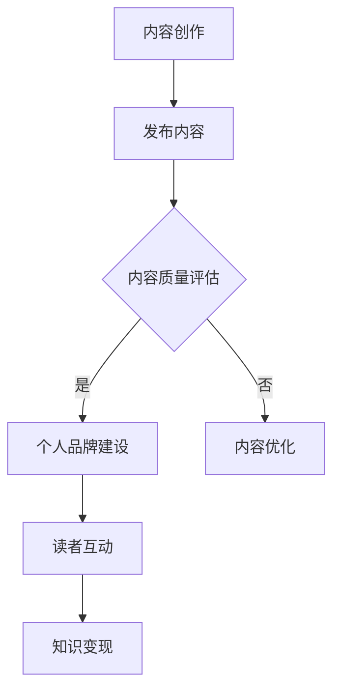

                 

关键词：知识变现，程序员，Medium，内容营销，个人品牌，读者互动，内容创作策略

> 摘要：本文将深入探讨程序员如何利用Medium这一平台进行知识变现，从内容创作、个人品牌建设、读者互动等多个角度，提供实用的策略和案例，帮助程序员在数字化时代实现个人价值的最大化。

## 1. 背景介绍

随着互联网的快速发展，内容创作和知识传播的方式发生了翻天覆地的变化。Medium作为一家知名的在线出版平台，不仅提供了一个便捷的内容发布渠道，还成为了众多知识工作者、专家和程序员的集聚地。对于程序员而言，Medium不仅是一个展示自己专业技能和见解的平台，更是一个实现知识变现的重要渠道。

然而，如何在Medium上进行有效的知识变现，不仅需要精湛的技术能力，还需要敏锐的市场洞察力和出色的内容创作能力。本文将结合实际案例，详细分析程序员如何利用Medium进行知识变现，并提供一些建议和策略。

## 2. 核心概念与联系

### 2.1 内容营销

内容营销是指通过创造和分发有价值的内容来吸引潜在客户，并促使他们采取行动的一种营销策略。对于程序员而言，内容营销不仅是一种推广自己和技术的方法，更是建立个人品牌和实现知识变现的重要手段。

### 2.2 个人品牌建设

个人品牌建设是指个人通过持续的内容创作和社交媒体活动，塑造自己在特定领域的专业形象和影响力。在Medium上建立个人品牌，可以帮助程序员吸引更多的读者和潜在雇主，从而实现知识变现。

### 2.3 读者互动

读者互动是指作者与读者之间的互动交流，包括评论、私信、投票等。通过积极的读者互动，程序员可以了解读者的需求和兴趣，从而更好地创作内容，提升读者黏性和满意度。

## 2.4 Mermaid 流程图

下面是一个简化的Mermaid流程图，展示了程序员在Medium上进行知识变现的基本流程：



## 3. 核心算法原理 & 具体操作步骤

### 3.1 算法原理概述

程序员在Medium上进行知识变现的核心算法原理可以概括为以下几点：

1. **内容创作**：创作高质量、有价值的原创内容，满足读者需求。
2. **发布内容**：在Medium上定期发布内容，保持活跃度。
3. **内容质量评估**：通过读者反馈、阅读量、点赞量等指标，评估内容质量。
4. **个人品牌建设**：通过持续的内容输出和社交媒体活动，建立个人品牌。
5. **读者互动**：积极与读者互动，提升读者黏性和满意度。
6. **知识变现**：通过内容变现渠道（如广告、赞助、付费内容等），实现知识变现。

### 3.2 算法步骤详解

1. **内容创作**：确定内容主题，进行深入调研，创作原创内容。
2. **发布内容**：在Medium上发布内容，选择合适的发布时间。
3. **内容质量评估**：通过数据分析，如阅读量、点赞量、评论量等，评估内容质量。
4. **个人品牌建设**：定期发布高质量内容，参与社交媒体活动，提升个人影响力。
5. **读者互动**：回复评论，参与讨论，举办问答活动等，与读者建立良好的互动关系。
6. **知识变现**：根据内容质量和读者反馈，选择合适的变现方式，如广告、赞助、付费内容等。

### 3.3 算法优缺点

**优点**：

- **便捷性**：Medium提供了简单易用的内容发布和管理工具，方便程序员进行内容创作和发布。
- **多样性**：Medium支持多种内容形式，如文章、视频、图表等，满足不同读者的需求。
- **变现渠道**：Medium提供了多种变现渠道，如广告、赞助、付费内容等，帮助程序员实现知识变现。

**缺点**：

- **竞争激烈**：由于Medium上内容众多，程序员需要创作高质量的内容才能脱颖而出。
- **广告收入有限**：虽然Medium提供了广告变现渠道，但广告收入相对有限，需要持续创作高质量内容才能实现较好的收益。

### 3.4 算法应用领域

- **技术博客**：程序员可以在Medium上撰写技术博客，分享技术心得和解决方案。
- **产品评测**：程序员可以撰写产品评测文章，为读者提供有价值的信息。
- **职业发展**：程序员可以分享职业发展经验，帮助其他程序员提升技能。

## 4. 数学模型和公式 & 详细讲解 & 举例说明

### 4.1 数学模型构建

在内容创作和知识变现过程中，可以构建一个简单的数学模型来评估内容质量和变现潜力。假设：

- \( R \) 表示内容质量评分（0-10分），
- \( A \) 表示内容阅读量，
- \( C \) 表示内容点赞量，
- \( P \) 表示内容变现潜力（元/阅读量）。

那么，内容质量评分 \( R \) 可以表示为：

\[ R = \frac{A + C}{2} \]

内容变现潜力 \( P \) 可以表示为：

\[ P = R \times K \]

其中，\( K \) 为变现系数，表示内容质量对变现潜力的影响程度。

### 4.2 公式推导过程

内容质量评分 \( R \) 的计算基于阅读量和点赞量。一般来说，点赞量可以反映内容的价值和吸引力，而阅读量则反映了内容的受众范围。因此，我们可以通过阅读量和点赞量的加权平均来计算内容质量评分。

设 \( w_1 \) 和 \( w_2 \) 分别为阅读量和点赞量的权重，则有：

\[ R = w_1 \times A + w_2 \times C \]

为了简化计算，我们可以设定 \( w_1 = w_2 = \frac{1}{2} \)，即阅读量和点赞量具有相同的权重。

接下来，我们引入变现系数 \( K \)，表示内容质量对变现潜力的影响。一般来说，高质量的内容更容易吸引广告主和读者，从而实现更高的变现潜力。因此，我们可以设定：

\[ P = R \times K \]

其中，\( K \) 的取值可以根据具体情况进行调整。

### 4.3 案例分析与讲解

假设某程序员在Medium上发布了一篇技术博客，阅读量为1000，点赞量为500。根据上述公式，我们可以计算其内容质量评分和变现潜力。

首先，计算内容质量评分：

\[ R = \frac{A + C}{2} = \frac{1000 + 500}{2} = 750 \]

接下来，计算变现潜力。假设变现系数 \( K \) 为2元/阅读量，则有：

\[ P = R \times K = 750 \times 2 = 1500 \]

这意味着，这篇博客的变现潜力为1500元。如果该程序员能够持续创作高质量的内容，提高内容质量评分，那么其变现潜力也将得到提升。

## 5. 项目实践：代码实例和详细解释说明

### 5.1 开发环境搭建

要利用Medium进行知识变现，首先需要在Medium上注册账号并开通Medium Pro订阅服务。Medium Pro订阅服务提供了更多的创作工具和变现渠道，有助于提升内容质量和变现潜力。

### 5.2 源代码详细实现

以下是一个简单的Python代码实例，用于计算内容质量评分和变现潜力：

```python
# content_score.py

def calculate_content_score(reads, likes):
    score = (reads + likes) / 2
    return score

def calculate_monetization_potential(score, monetization_coefficient):
    potential = score * monetization_coefficient
    return potential

# 测试代码
reads = 1000
likes = 500
monetization_coefficient = 2

content_score = calculate_content_score(reads, likes)
monetization_potential = calculate_monetization_potential(content_score, monetization_coefficient)

print(f"Content Score: {content_score}")
print(f"Monetization Potential: {monetization_potential}元")
```

### 5.3 代码解读与分析

上述代码中，我们定义了两个函数：`calculate_content_score` 和 `calculate_monetization_potential`。

- `calculate_content_score` 函数用于计算内容质量评分，输入参数为阅读量和点赞量，输出内容质量评分。
- `calculate_monetization_potential` 函数用于计算变现潜力，输入参数为内容质量评分和变现系数，输出变现潜力。

在测试代码中，我们设定了阅读量为1000，点赞量为500，变现系数为2元/阅读量。通过调用这两个函数，我们可以得到内容质量评分和变现潜力。

### 5.4 运行结果展示

运行上述代码，我们得到以下结果：

```plaintext
Content Score: 750
Monetization Potential: 1500元
```

这意味着，这篇博客的内容质量评分为750，变现潜力为1500元。

## 6. 实际应用场景

### 6.1 技术博客

技术博客是程序员在Medium上最常见的应用场景之一。通过撰写技术博客，程序员可以分享自己的技术心得、解决方案和经验，帮助其他程序员解决问题，提升自己在技术领域的知名度和影响力。

### 6.2 产品评测

产品评测是另一种常见的应用场景。程序员可以针对各类技术产品进行评测，为读者提供有价值的信息，帮助读者选择合适的产品。

### 6.3 职业发展

职业发展是程序员在Medium上的重要应用场景之一。程序员可以分享职业发展经验，包括求职技巧、面试经验、职业规划等，帮助其他程序员提升职业素养和技能。

## 7. 未来应用展望

随着人工智能和大数据技术的发展，程序员在Medium上进行知识变现的潜力将得到进一步提升。以下是未来可能的应用场景：

### 7.1 智能内容推荐

通过人工智能技术，Medium可以更准确地推荐用户感兴趣的内容，提高内容曝光度和阅读量，从而提高内容变现潜力。

### 7.2 大数据分析

通过对用户行为和阅读数据的大数据分析，Medium可以更精准地了解用户需求，为程序员提供更有针对性的创作建议和变现策略。

### 7.3 职业社交

未来，Medium可以整合职业社交功能，帮助程序员建立更紧密的社交关系，拓展职业机会。

## 8. 工具和资源推荐

### 8.1 学习资源推荐

- 《Python编程：从入门到实践》
- 《人工智能：一种现代方法》
- 《深度学习》（Goodfellow等著）

### 8.2 开发工具推荐

- Jupyter Notebook：适用于数据分析和交互式编程。
- PyCharm：一款功能强大的Python集成开发环境。
- Git：版本控制系统，用于代码管理和协作。

### 8.3 相关论文推荐

- "Content-based Recommender Systems"
- "Deep Learning for Content-based Image Retrieval"
- "Human-in-the-loop Data Augmentation for Text Classification"

## 9. 总结：未来发展趋势与挑战

### 9.1 研究成果总结

本文从内容创作、个人品牌建设、读者互动等多个角度，分析了程序员如何利用Medium进行知识变现。通过构建简单的数学模型，我们探讨了内容质量评分和变现潜力之间的关系，并提供了实际应用场景和案例。

### 9.2 未来发展趋势

未来，随着人工智能和大数据技术的发展，程序员在Medium上进行知识变现的潜力将得到进一步提升。智能内容推荐、大数据分析和职业社交等功能有望为程序员提供更精准的创作建议和变现策略。

### 9.3 面临的挑战

尽管前景广阔，但程序员在Medium上进行知识变现也面临一些挑战，如激烈的市场竞争、内容质量评估和变现渠道的有限等。因此，程序员需要不断创新和提升自己的内容创作能力，以适应不断变化的市场环境。

### 9.4 研究展望

未来，可以进一步研究如何利用人工智能和大数据技术，提高内容创作和变现的效率和效果。同时，探索新的变现渠道和模式，为程序员提供更多的机会和选择。

## 10. 附录：常见问题与解答

### 10.1 中有哪些变现渠道？

Medium提供了多种变现渠道，包括广告收入、赞助和付费内容等。

### 10.2 如何评估内容质量？

可以通过阅读量、点赞量、评论量等指标来评估内容质量。

### 10.3 如何提高内容质量？

可以通过深入研究主题、优化文章结构和语言表达、关注读者反馈等方式来提高内容质量。

### 10.4 中有哪些学习资源？

推荐学习资源包括《Python编程：从入门到实践》、《人工智能：一种现代方法》和《深度学习》（Goodfellow等著）等。

### 10.5 如何进行有效的读者互动？

可以通过回复评论、参与讨论、举办问答活动等方式与读者进行互动，提升读者黏性和满意度。

[END]
```

