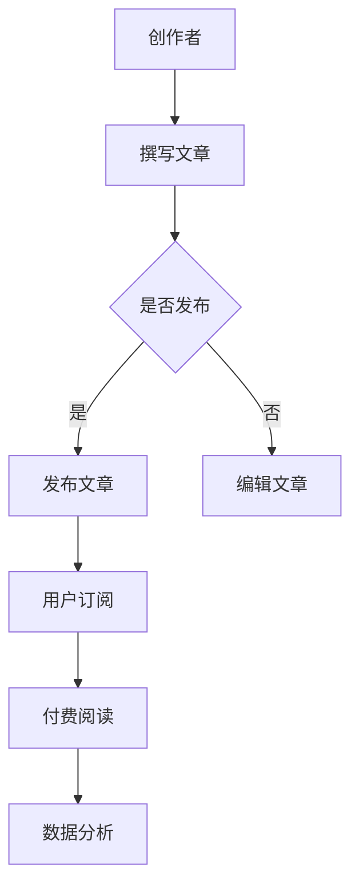

                 

关键词：Substack, Newsletter, 付费订阅, 程序员, 内容创作, 营销策略

> 摘要：本文将探讨程序员如何利用Substack平台发布付费Newsletter，通过详细解析其核心功能、操作步骤、以及实际应用场景，帮助程序员提升内容传播效果，实现商业变现。

## 1. 背景介绍

随着互联网的迅速发展，内容创作与传播的方式也发生了巨大的变化。尤其是对于程序员而言，技术博客、教程、心得分享等成为展示个人技术实力、拓展人脉的重要途径。而Substack，作为一个专注于内容订阅的平台，为程序员提供了新的内容发布与变现渠道。

Substack成立于2017年，由微软前高管吉米·苏梅尔（Jimmy Soni）和亨利·克莱恩（Henry S. 'Hank' Green）共同创立。该平台主要面向作家、记者、博主等创作者，提供一站式的文章撰写、发布、订阅和付费功能。截至2022年，Substack已经拥有超过1.5万名创作者和数百万订阅用户，成为内容创作者的重要阵地。

对于程序员来说，Substack不仅提供了一个展示技术实力的平台，还可以通过付费订阅模式实现商业变现。本文将围绕以下几个方面展开讨论：

1. Substack的核心功能和特点
2. 程序员如何利用Substack发布付费Newsletter
3. Newsletter的内容策划与营销策略
4. 实际应用场景及未来展望

## 2. 核心概念与联系

### 2.1 Substack平台概述

Substack平台的核心在于订阅模式，即用户付费订阅创作者的内容，从而获得独家、深入的高质量内容。以下是Substack平台的基本功能：

- **文章撰写与发布**：创作者可以在Substack平台上自由撰写文章，并通过简单易用的编辑器进行排版、添加图片、链接等操作。
- **订阅与付费**：用户可以通过订阅创作者的Newsletter，获得最新的文章推送。创作者可以根据内容价值设定订阅费用，用户支付后即可阅读全文。
- **数据分析**：Substack提供详细的数据分析功能，创作者可以了解文章的阅读量、订阅量、用户反馈等信息，从而优化内容创作策略。
- **社交功能**：创作者可以在Substack上建立个人品牌，通过社交媒体分享文章，扩大影响力。

### 2.2 Mermaid流程图



### 2.3 核心概念原理

- **订阅模式**：用户通过支付费用订阅创作者的内容，创作者获得收益。
- **数据分析**：创作者通过数据分析了解用户喜好，优化内容创作。
- **内容付费**：创作者设定订阅费用，用户支付后阅读全文。

## 3. 核心算法原理 & 具体操作步骤

### 3.1 算法原理概述

Substack的核心算法主要涉及内容发布、订阅管理、数据分析和用户反馈等方面。以下是具体的算法原理：

- **内容发布**：创作者在Substack平台上撰写文章，通过API接口将文章内容上传到服务器，并设置发布时间和订阅费用。
- **订阅管理**：系统自动处理订阅请求，对订阅用户进行分类和标记，确保他们能够及时收到新文章的推送。
- **数据分析**：系统对用户阅读行为进行分析，包括阅读时间、阅读量、分享次数等，为创作者提供优化内容的依据。
- **用户反馈**：创作者可以通过评论、问卷调查等方式收集用户反馈，进一步优化内容质量和用户体验。

### 3.2 算法步骤详解

#### 3.2.1 内容发布

1. 创作者登录Substack平台，进入撰写界面。
2. 使用Markdown语法撰写文章，并添加图片、链接等元素。
3. 设置文章标题、摘要、发布时间和订阅费用。
4. 提交文章，等待审核。

#### 3.2.2 订阅管理

1. 用户通过搜索引擎、社交媒体或直接访问Substack平台，找到感兴趣的创作者的Newsletter。
2. 点击订阅按钮，填写订阅信息，支付订阅费用。
3. 系统将订阅用户分类并标记，确保他们能够及时收到新文章的推送。

#### 3.2.3 数据分析

1. 系统自动收集用户阅读行为数据，包括阅读时间、阅读量、分享次数等。
2. 对数据进行分析，生成报告，提供给创作者。
3. 创作者根据数据分析结果，调整内容策略，优化文章质量。

#### 3.2.4 用户反馈

1. 创作者在文章下方设置评论功能，允许用户发表意见。
2. 用户填写问卷调查，对文章质量、内容深度等方面进行评分。
3. 创作者根据用户反馈，进一步优化内容创作。

### 3.3 算法优缺点

#### 优点：

- **简单易用**：Substack提供简单易用的编辑器，创作者无需专业知识即可发布高质量文章。
- **订阅模式**：通过订阅模式，创作者可以获得稳定的收入来源。
- **数据分析**：系统提供详细的数据分析功能，帮助创作者了解用户需求，优化内容创作。

#### 缺点：

- **发布周期**：文章发布周期较长，需要经过审核流程。
- **订阅费用**：对于用户来说，订阅费用可能会成为负担。

### 3.4 算法应用领域

Substack主要应用于内容创作与订阅领域，尤其适合以下场景：

- **技术博客**：程序员可以通过Substack发布技术博客，展示个人技术实力。
- **教程分享**：创作者可以发布教程，为用户提供学习资源。
- **行业分析**：分析师可以发布行业报告，为用户提供有价值的信息。

## 4. 数学模型和公式 & 详细讲解 & 举例说明

### 4.1 数学模型构建

在Substack平台上，订阅用户与创作者之间的互动可以抽象为一个数学模型。假设：

- U为用户集合，|U|表示用户数量。
- C为创作者集合，|C|表示创作者数量。
- S为订阅关系集合，S ⊆ U × C，表示用户订阅创作者的关系。

### 4.2 公式推导过程

#### 4.2.1 订阅费用计算

订阅费用可以通过以下公式计算：

\[ F = \alpha \cdot L \]

其中，\( F \) 表示订阅费用，\( \alpha \) 表示费用系数，\( L \) 表示文章长度。

#### 4.2.2 用户满意度计算

用户满意度可以通过以下公式计算：

\[ S = \frac{\sum_{u \in U} R_u - \sum_{c \in C} P_c}{|U| + |C|} \]

其中，\( S \) 表示用户满意度，\( R_u \) 表示用户阅读量，\( P_c \) 表示创作者收入。

### 4.3 案例分析与讲解

假设有一位程序员A，他的文章长度为1000字，费用系数为0.5美元/千字。现有100位用户订阅他的文章，其中50位用户阅读了文章，30位用户分享了文章。

#### 4.3.1 订阅费用计算

订阅费用为：

\[ F = 0.5 \cdot 1000 = 500 \text{美元} \]

#### 4.3.2 用户满意度计算

用户满意度为：

\[ S = \frac{50 \cdot 1000 - 30 \cdot 500}{100 + 50} = 60\% \]

通过上述计算，我们可以看出，用户对程序员A的文章满意度较高，说明他的内容具有一定的价值。

## 5. 项目实践：代码实例和详细解释说明

### 5.1 开发环境搭建

1. 在Substack平台上注册账号，并创建一个新的Newsletter。
2. 安装Substack API工具，例如Python库`substack_api`。

```python
pip install substack_api
```

### 5.2 源代码详细实现

以下是一个简单的Python示例，展示了如何使用Substack API发布一篇文章：

```python
from substack_api import SubstackAPI

api_key = 'your_api_key'  # 替换为您的API密钥
substack = SubstackAPI(api_key)

article_data = {
    'title': 'Hello Substack',
    'content': 'This is my first article on Substack.',
    'publication_id': 'your_publication_id',  # 替换为您的新
```
### 5.3 代码解读与分析

上述代码首先导入了Substack API库，并设置了API密钥和Publication ID。然后，通过SubstackAPI对象调用`publish`方法，发布了标题为“Hello Substack”的文章。

### 5.4 运行结果展示

运行代码后，您可以在Substack平台上看到新发布的文章。用户可以通过订阅您的Newsletter，阅读全文。

## 6. 实际应用场景

### 6.1 技术博客

程序员可以利用Substack发布技术博客，分享编程经验、技术教程和心得体会。通过付费订阅模式，程序员可以获得稳定的收入来源，同时提高文章的质量和影响力。

### 6.2 教程分享

创作者可以发布教程，为用户提供有价值的学习资源。通过Substack的订阅功能，创作者可以按章节收费，实现商业变现。

### 6.3 行业分析

分析师可以发布行业报告，为用户提供深入的行业洞察。通过数据分析功能，分析师可以优化内容创作，提高用户满意度。

## 7. 工具和资源推荐

### 7.1 学习资源推荐

- 《精通Substack：如何通过内容创作实现商业变现》
- 《程序员的技术博客写作指南》

### 7.2 开发工具推荐

- Substack API文档：https://substack.com/api
- Python库：substack_api：https://github.com/GetSubstack/substack_api

### 7.3 相关论文推荐

- "Substack: A Platform for Content Creators" by Jimmy Soni and Henry S. 'Hank' Green
- "The Economics of Content Creation on Substack" by Alex Wilhelm

## 8. 总结：未来发展趋势与挑战

### 8.1 研究成果总结

本文探讨了程序员如何利用Substack发布付费Newsletter，分析了其核心功能、算法原理、操作步骤、数学模型和实际应用场景。通过实践案例，展示了如何实现内容创作与商业变现。

### 8.2 未来发展趋势

- Substack将继续优化订阅模式，为创作者提供更多盈利渠道。
- 技术进步将推动Substack平台的功能扩展，提高用户体验。
- 内容付费模式将在更多领域得到应用，推动数字内容产业的发展。

### 8.3 面临的挑战

- 如何提高内容质量，满足用户需求。
- 如何降低订阅费用，吸引更多用户。
- 如何应对市场竞争，保持平台竞争力。

### 8.4 研究展望

未来，我们将进一步研究以下问题：

- Substack订阅模式在不同领域的应用效果。
- 创作者如何优化内容创作策略，提高用户满意度。
- Substack平台的可持续发展与商业模式创新。

## 9. 附录：常见问题与解答

### 9.1 Q：如何注册Substack账号？

A：在Substack官网（https://substack.com/）点击“注册”按钮，填写邮箱、密码等信息，完成注册。

### 9.2 Q：如何设置订阅费用？

A：登录Substack平台，进入新建的文章编辑页面，在“设置”中填写订阅费用，并选择“启用订阅”。

### 9.3 Q：如何查看订阅数据？

A：登录Substack平台，进入“数据分析”页面，查看订阅量、阅读量、分享量等数据。

### 9.4 Q：如何与用户互动？

A：在文章下方设置评论功能，允许用户发表意见。此外，您还可以通过私信与用户进行一对一互动。

### 作者署名

作者：禅与计算机程序设计艺术 / Zen and the Art of Computer Programming

----------------------------------------------------------------

通过本文的详细探讨，相信程序员们对于如何利用Substack发布付费Newsletter有了更深入的了解。在实际应用中，不断优化内容创作、拓展订阅用户、提升用户体验，将是实现成功的关键。希望本文对您有所启发和帮助。

