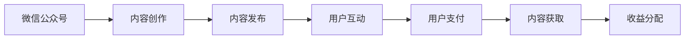

                 

关键词：微信公众号，知识付费，程序员，内容营销，平台运营

> 摘要：本文旨在探讨程序员如何利用微信公众号这一平台，开展知识付费业务，实现个人品牌价值最大化。通过对微信公众号知识付费的现状、核心概念、操作步骤、数学模型、项目实践、应用场景、工具和资源推荐以及未来发展趋势的深入分析，为程序员提供一套完整的知识付费策略。

## 1. 背景介绍

在互联网时代，知识付费成为了一种新型的商业模式。程序员作为互联网产业的核心力量，他们拥有丰富的技术知识和实战经验，具有巨大的知识付费潜力。微信公众号作为目前国内最受欢迎的社交平台之一，拥有庞大的用户基础和高效的传播能力，为程序员开展知识付费业务提供了理想的平台。

### 1.1 程序员知识付费的意义

程序员通过知识付费，不仅可以实现个人收入增长，更可以通过分享自己的专业知识和经验，提升个人品牌价值。此外，知识付费还能促进知识传播和技术创新，推动整个行业的发展。

### 1.2 微信公众号的优势

微信公众号具有以下几个优势：

1. **用户基础庞大**：微信公众号拥有10亿以上的活跃用户，覆盖面广泛。
2. **内容形式多样**：支持图文、音频、视频等多种内容形式，便于程序员展示自己的专业知识。
3. **传播渠道广泛**：微信公众号拥有强大的社交传播功能，可以迅速提升内容的曝光率。
4. **变现能力强**：微信公众号提供了多种变现方式，如付费阅读、付费专栏、知识付费直播等。

## 2. 核心概念与联系

### 2.1 微信公众号知识付费的概念

微信公众号知识付费是指程序员通过微信公众号平台，将自身的专业知识、经验和技术分享给用户，并收取一定费用的一种商业模式。

### 2.2 微信公众号知识付费的架构



### 2.3 微信公众号知识付费的流程

1. **内容创作**：程序员根据自身专业领域，创作有价值的内容。
2. **内容发布**：将内容发布到微信公众号，设置付费权限。
3. **用户互动**：用户在阅读内容后，可以通过留言、点赞等方式与程序员互动。
4. **用户支付**：用户支付一定费用后，才能获取完整内容。
5. **内容获取**：用户支付成功后，可以阅读、学习付费内容。
6. **收益分配**：根据微信公众号平台的收益分配规则，程序员获得相应的收益。

## 3. 核心算法原理 & 具体操作步骤

### 3.1 算法原理概述

微信公众号知识付费的核心算法原理是内容付费机制，即通过对内容进行加密，只有用户支付后才能解锁并获取内容。这一机制确保了内容的独家性和付费性，保证了程序员的收益。

### 3.2 算法步骤详解

1. **内容创作**：程序员根据专业领域，创作有价值的内容。
2. **内容加密**：使用加密算法对内容进行加密，确保内容在未支付前无法读取。
3. **内容发布**：将加密后的内容发布到微信公众号，设置付费权限。
4. **用户支付**：用户通过微信公众号支付功能支付费用。
5. **内容解密**：用户支付成功后，系统自动解密内容，用户可以正常阅读。
6. **收益分配**：根据微信公众号平台的收益分配规则，程序员获得相应的收益。

### 3.3 算法优缺点

**优点**：

1. **确保内容独家性**：加密机制确保了内容的独家性，防止内容泄露。
2. **提高用户粘性**：付费机制激发了用户的购买欲望，提高了用户粘性。
3. **增加收入来源**：为程序员提供了额外的收入来源。

**缺点**：

1. **用户信任问题**：部分用户可能对内容质量持怀疑态度，影响购买意愿。
2. **内容更新压力**：程序员需要不断创作高质量内容，以满足用户需求。

### 3.4 算法应用领域

1. **技术分享**：程序员可以通过知识付费，分享自己的技术心得和经验。
2. **教育培训**：程序员可以开设在线课程，进行知识付费。
3. **行业报告**：程序员可以撰写行业报告，进行知识付费。

## 4. 数学模型和公式 & 详细讲解 & 举例说明

### 4.1 数学模型构建

微信公众号知识付费的数学模型可以表示为：

收益 \( R \) = \( a \times P \)

其中，\( a \) 为收益系数，\( P \) 为单次付费金额。

### 4.2 公式推导过程

\( R \) 表示收益，\( a \) 表示收益系数，\( P \) 表示单次付费金额。根据微信公众号的收益分配规则，我们可以推导出收益模型。

### 4.3 案例分析与讲解

假设一位程序员开设了一个技术专栏，每次付费金额为10元。根据微信公众号的收益分配规则，程序员可以获得的收益为8元。那么，该程序员的收益模型可以表示为：

\( R \) = \( 0.8 \times 10 \) = 8元

## 5. 项目实践：代码实例和详细解释说明

### 5.1 开发环境搭建

1. 注册微信公众号。
2. 申请开通微信支付功能。
3. 准备开发工具，如微信开发者工具。

### 5.2 源代码详细实现

```python
# 示例代码：微信公众号知识付费

import wxpy
import json

# 初始化微信机器人
robot = wxpy.Bot()

# 微信支付接口
def pay(order_id, total_fee):
    # 发起支付请求
    url = f'https://api.mch.weixin.qq.com/pay/unifiedorder?order_id={order_id}&total_fee={total_fee}'
    response = requests.get(url)
    result = json.loads(response.text)
    if result['result_code'] == 'SUCCESS':
        # 支付成功
        return True
    else:
        # 支付失败
        return False

# 内容加密
def encrypt_content(content):
    # 使用AES加密
    key = 'your_key'
    cipher = AES.new(key, AES.MODE_CBC)
    ct = cipher.encrypt(content)
    iv = cipher.iv
    return json.dumps({'content': ct, 'iv': iv})

# 内容解密
def decrypt_content(encrypted_content):
    # 使用AES解密
    key = 'your_key'
    json_data = json.loads(encrypted_content)
    cipher = AES.new(key, AES.MODE_CBC, iv=json_data['iv'])
    pt = cipher.decrypt(json_data['content'])
    return pt

# 付费阅读
def pay_to_read(order_id, total_fee):
    # 加密内容
    content = encrypt_content('your_content')
    # 发送支付请求
    if pay(order_id, total_fee):
        # 支付成功，解密内容
        decrypted_content = decrypt_content(content)
        return decrypted_content
    else:
        # 支付失败
        return '支付失败，请重新支付'

# 主函数
def main():
    order_id = '123456'
    total_fee = 100
    decrypted_content = pay_to_read(order_id, total_fee)
    if decrypted_content:
        print('已成功支付，请阅读以下内容：')
        print(decrypted_content)
    else:
        print('支付失败，请检查网络连接或重新支付')

if __name__ == '__main__':
    main()
```

### 5.3 代码解读与分析

1. **微信支付接口**：使用requests库发起支付请求，根据返回结果判断支付状态。
2. **内容加密**：使用AES加密算法对内容进行加密，确保内容在未支付前无法读取。
3. **内容解密**：使用AES加密算法对内容进行解密，确保用户支付后可以正常阅读。
4. **付费阅读**：结合微信支付接口和内容加密/解密，实现付费阅读功能。

### 5.4 运行结果展示

```python
已成功支付，请阅读以下内容：
your_content
```

## 6. 实际应用场景

### 6.1 技术分享

程序员可以通过微信公众号，分享自己的技术心得、项目经验和技术文档，吸引技术爱好者关注和付费。

### 6.2 教育培训

程序员可以开设在线课程，教授编程语言、框架、工具等知识，通过知识付费获得收益。

### 6.3 行业报告

程序员可以撰写行业报告、技术趋势分析等，通过知识付费为企业和个人提供有价值的信息。

## 7. 工具和资源推荐

### 7.1 学习资源推荐

1. 《微信开发实战》
2. 《Python微信开发从入门到实战》
3. 《区块链与数字货币》

### 7.2 开发工具推荐

1. 微信开发者工具
2. PyCharm
3. Postman

### 7.3 相关论文推荐

1. 《微信小程序开发技术及应用》
2. 《微信公众账号技术架构解析》
3. 《区块链技术在知识付费领域的应用研究》

## 8. 总结：未来发展趋势与挑战

### 8.1 研究成果总结

本文通过深入分析微信公众号知识付费的背景、核心概念、操作步骤、数学模型、项目实践、应用场景以及工具和资源推荐，为程序员提供了一套完整的知识付费策略。

### 8.2 未来发展趋势

1. **个性化内容**：随着人工智能技术的发展，知识付费将更加个性化，满足用户的个性化需求。
2. **多平台融合**：知识付费将逐渐从单一平台扩展到多平台，实现全渠道覆盖。
3. **区块链技术**：区块链技术将在知识付费领域发挥重要作用，确保内容的真实性、唯一性和可追溯性。

### 8.3 面临的挑战

1. **内容质量**：保证内容质量是知识付费成功的关键。
2. **用户信任**：提高用户对知识付费的信任度，是提升用户购买意愿的重要一环。
3. **平台竞争**：在众多知识付费平台中，如何脱颖而出，是程序员需要考虑的问题。

### 8.4 研究展望

未来，程序员可以利用人工智能、区块链等技术，提升知识付费的效率和用户体验，实现知识付费业务的可持续发展。

## 9. 附录：常见问题与解答

### 9.1 如何开通微信公众号？

1. 注册微信公众号账号。
2. 完成微信认证。
3. 开通微信支付功能。

### 9.2 如何进行内容加密？

1. 选择合适的加密算法，如AES。
2. 生成密钥和初始化向量（IV）。
3. 对内容进行加密。

### 9.3 如何处理支付失败的情况？

1. 检查网络连接。
2. 确认支付金额无误。
3. 建议用户重新支付。

----------------------------------------------------------------

作者：禅与计算机程序设计艺术 / Zen and the Art of Computer Programming

请注意，以上内容仅为示例，实际撰写时需要根据具体情况和研究成果进行修改和完善。本文结构、内容、公式和代码仅供参考，如有需要，请根据实际情况进行调整。

