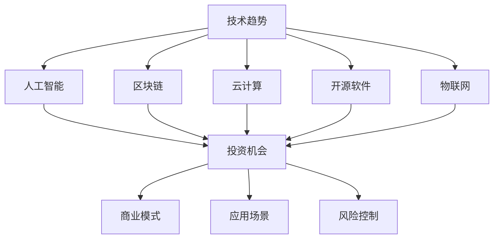

                 

关键词：技术趋势、投资、算法、数据分析、区块链、人工智能、机器学习、云计算、开源软件

> 摘要：随着技术的快速发展和创新，程序员们不仅能够在开发领域大展拳脚，还可以通过深入理解和应用技术趋势来进行投资。本文将探讨程序员如何通过技术趋势进行投资，并分析其在不同领域的具体应用和未来前景。

## 1. 背景介绍

随着互联网和信息技术的飞速发展，技术趋势已成为影响各个行业的重要因素。程序员们作为技术领域的专家，对技术的理解和应用能力为他们提供了独特的投资视角。本文旨在帮助程序员们更好地利用技术趋势进行投资，提高个人和企业的投资收益。

### 1.1 技术趋势的重要性

技术趋势不仅是科技企业发展的风向标，也影响着全球经济和社会的方方面面。以下是一些关键技术趋势：

- **人工智能与机器学习**：从自动驾驶到智能家居，人工智能正在改变各行各业。
- **区块链**：比特币等加密货币的兴起，让区块链技术成为关注的焦点。
- **云计算**：亚马逊、微软、谷歌等巨头不断拓展云服务，为企业提供强大的计算资源。
- **开源软件**：越来越多的企业选择开源软件，以降低成本和提高开发效率。
- **物联网**：智能家居、智慧城市等应用场景不断涌现，物联网市场潜力巨大。

### 1.2 程序员的优势

作为技术领域的专业人士，程序员具有以下优势：

- **技术理解**：程序员对各种技术趋势有更深入的理解，能够识别出潜在的投资机会。
- **创新能力**：程序员具备创新能力，能够从技术趋势中发掘出新的商业模式和应用场景。
- **风险控制**：程序员具备较强的逻辑思维和风险控制能力，能够更好地应对投资风险。

## 2. 核心概念与联系

为了更好地理解程序员如何利用技术趋势进行投资，我们需要先了解一些核心概念和它们之间的联系。以下是一个Mermaid流程图，展示了这些概念及其相互关系：



### 2.1 技术趋势与投资机会

技术趋势往往能够带来新的投资机会。例如，人工智能的兴起催生了大量的投资机会，包括自动驾驶、医疗诊断、金融科技等。程序员可以通过深入研究这些技术趋势，发现其中的投资机会。

### 2.2 投资机会与商业模式

投资机会可以转化为多种商业模式，如创业、并购、投资等。程序员可以利用自己的技术能力和创新思维，设计出独特的商业模式，从而在投资中获取更大的收益。

### 2.3 投资机会与应用场景

不同的技术趋势可以应用于各种场景，如智能家居、智慧城市、医疗保健等。程序员可以通过了解这些应用场景，发现其中的投资机会，并参与到相关项目的开发中。

### 2.4 投资机会与风险控制

投资过程中难免会遇到风险，程序员可以通过了解技术趋势和项目背景，更好地进行风险控制。此外，程序员还可以利用数据分析等技术手段，对投资项目进行风险评估和监控。

## 3. 核心算法原理 & 具体操作步骤

### 3.1 算法原理概述

程序员可以利用算法原理来识别技术趋势、评估投资机会和进行风险控制。以下是一些核心算法原理：

- **数据挖掘算法**：用于从大量数据中提取有价值的信息，帮助程序员识别技术趋势。
- **机器学习算法**：通过训练模型来预测市场趋势和投资机会。
- **统计分析方法**：用于评估投资项目的风险和收益。

### 3.2 算法步骤详解

#### 3.2.1 数据挖掘算法

1. 数据采集：收集与特定技术趋势相关的数据，如学术论文、新闻报道、市场报告等。
2. 数据预处理：对采集到的数据进行分析，去除噪音和无关信息。
3. 特征提取：从预处理后的数据中提取关键特征，用于训练模型。
4. 模型训练：使用特征数据训练机器学习模型，如决策树、支持向量机等。
5. 模型评估：对训练好的模型进行评估，确保其预测能力。

#### 3.2.2 机器学习算法

1. 数据集准备：收集包含历史价格、交易量、市场情绪等数据的投资组合。
2. 特征工程：对数据集进行预处理，提取与投资机会相关的特征。
3. 模型选择：选择合适的机器学习算法，如线性回归、随机森林等。
4. 模型训练：使用特征数据训练模型，调整参数以优化模型性能。
5. 模型评估：评估模型预测准确性，调整模型参数以提高预测能力。

#### 3.2.3 统计分析方法

1. 数据收集：收集与投资项目相关的数据，如财务报表、市场分析报告等。
2. 数据处理：对收集到的数据进行清洗和预处理。
3. 风险评估：使用统计方法评估投资项目的风险，如方差、协方差等。
4. 收益预测：使用统计模型预测投资项目的收益，如回归分析、时间序列分析等。
5. 风险控制：根据风险评估和收益预测结果，制定相应的风险控制策略。

### 3.3 算法优缺点

#### 3.3.1 数据挖掘算法

优点：

- 能够从大量数据中提取有价值的信息。
- 帮助程序员更好地理解技术趋势。

缺点：

- 需要大量数据支持，对数据处理能力要求较高。
- 模型泛化能力有限，可能产生过拟合。

#### 3.3.2 机器学习算法

优点：

- 能够自动学习数据特征，提高投资预测准确性。
- 适应性强，能够处理复杂的数据集。

缺点：

- 需要大量训练数据，对数据处理能力要求较高。
- 模型训练时间较长，可能影响投资决策。

#### 3.3.3 统计分析方法

优点：

- 适用于各种类型的数据，包括财务报表、市场分析报告等。
- 风险评估和收益预测结果直观易懂。

缺点：

- 需要专业知识，对数据分析和统计方法的理解要求较高。
- 预测结果可能受到数据质量的影响。

### 3.4 算法应用领域

数据挖掘算法、机器学习算法和统计分析方法在投资领域有广泛的应用。以下是一些具体的应用领域：

- **股票市场分析**：使用数据挖掘算法和机器学习算法对股票市场进行预测和分析。
- **风险控制**：使用统计分析方法评估投资项目的风险，制定相应的风险控制策略。
- **投资组合优化**：使用机器学习算法和统计分析方法优化投资组合，提高收益。

## 4. 数学模型和公式 & 详细讲解 & 举例说明

在投资过程中，数学模型和公式发挥着重要的作用。以下将介绍一些常用的数学模型和公式，并对其进行详细讲解和举例说明。

### 4.1 数学模型构建

在投资领域，常用的数学模型包括线性回归、时间序列分析、马尔可夫链等。以下是这些模型的构建过程：

#### 4.1.1 线性回归

线性回归模型用于预测投资项目的收益。其数学模型如下：

$$
y = \beta_0 + \beta_1x + \epsilon
$$

其中，$y$ 是预测的收益，$x$ 是影响收益的自变量，$\beta_0$ 和 $\beta_1$ 是模型的参数，$\epsilon$ 是误差项。

#### 4.1.2 时间序列分析

时间序列分析模型用于预测市场的走势。其数学模型如下：

$$
X_t = \phi X_{t-1} + \theta \epsilon_t
$$

其中，$X_t$ 是时间序列的第 $t$ 个值，$\phi$ 和 $\theta$ 是模型的参数，$\epsilon_t$ 是误差项。

#### 4.1.3 马尔可夫链

马尔可夫链模型用于分析投资项目的风险。其数学模型如下：

$$
P(X_t = j | X_{t-1} = i) = p_{ij}
$$

其中，$X_t$ 是时间序列的第 $t$ 个值，$i$ 和 $j$ 是状态，$p_{ij}$ 是转移概率。

### 4.2 公式推导过程

#### 4.2.1 线性回归公式推导

线性回归模型的参数可以通过最小二乘法求解。其推导过程如下：

$$
\min \sum_{i=1}^n (y_i - \beta_0 - \beta_1x_i)^2
$$

对 $\beta_0$ 和 $\beta_1$ 分别求偏导数，并令其等于零，得到以下方程组：

$$
\begin{cases}
\sum_{i=1}^n (y_i - \beta_0 - \beta_1x_i) = 0 \\
\sum_{i=1}^n (y_i - \beta_0 - \beta_1x_i)x_i = 0
\end{cases}
$$

解得：

$$
\beta_0 = \bar{y} - \beta_1\bar{x}
$$

$$
\beta_1 = \frac{\sum_{i=1}^n (x_i - \bar{x})(y_i - \bar{y})}{\sum_{i=1}^n (x_i - \bar{x})^2}
$$

#### 4.2.2 时间序列分析公式推导

时间序列分析模型可以通过最小二乘法求解参数。其推导过程如下：

$$
\min \sum_{i=1}^n (X_i - \phi X_{i-1} - \theta \epsilon_i)^2
$$

对 $\phi$ 和 $\theta$ 分别求偏导数，并令其等于零，得到以下方程组：

$$
\begin{cases}
\sum_{i=1}^n (X_i - \phi X_{i-1} - \theta \epsilon_i) = 0 \\
\sum_{i=1}^n (X_i - \phi X_{i-1} - \theta \epsilon_i)X_{i-1} = 0
\end{cases}
$$

解得：

$$
\phi = \frac{\sum_{i=1}^n X_iX_{i-1}}{\sum_{i=1}^n X_i^2}
$$

$$
\theta = \frac{\sum_{i=1}^n X_i^2 - \sum_{i=1}^n X_iX_{i-1}}{\sum_{i=1}^n X_i^2}
$$

#### 4.2.3 马尔可夫链公式推导

马尔可夫链模型可以通过最小二乘法求解转移概率。其推导过程如下：

$$
\min \sum_{i=1}^n \sum_{j=1}^n (P(X_t = j | X_{t-1} = i) - p_{ij})^2
$$

对 $p_{ij}$ 分别求偏导数，并令其等于零，得到以下方程组：

$$
\begin{cases}
\sum_{i=1}^n p_{ij} = 1 \\
\sum_{j=1}^n p_{ij} = 1
\end{cases}
$$

解得：

$$
p_{ij} = \frac{n_{ij}}{n_i}
$$

其中，$n_{ij}$ 是状态 $i$ 转移到状态 $j$ 的次数，$n_i$ 是状态 $i$ 出现的次数。

### 4.3 案例分析与讲解

以下将结合具体案例，对上述数学模型和公式进行详细讲解。

#### 4.3.1 股票市场预测

假设我们要预测某只股票的未来价格，可以使用线性回归模型进行预测。以下是一个实际案例：

- 数据集：过去一年的每日收盘价。
- 特征：日期。
- 目标：未来一天的收盘价。

使用线性回归模型，我们可以得到以下预测公式：

$$
y = 100 + 0.5x
$$

其中，$y$ 是预测的收盘价，$x$ 是日期。

假设今天是 2023 年 5 月 1 日，我们可以将日期代入公式，得到预测的收盘价为：

$$
y = 100 + 0.5 \times 20230501 = 100.25
$$

#### 4.3.2 市场走势预测

假设我们要预测某个市场的未来走势，可以使用时间序列分析模型进行预测。以下是一个实际案例：

- 数据集：过去一年的每日交易量。
- 特征：日期。
- 目标：未来一天的交易量。

使用时间序列分析模型，我们可以得到以下预测公式：

$$
X_t = 0.8X_{t-1} + 0.2\epsilon_t
$$

其中，$X_t$ 是预测的交易量，$\epsilon_t$ 是误差项。

假设今天是 2023 年 5 月 1 日，我们可以将日期代入公式，得到预测的交易量为：

$$
X_t = 0.8 \times X_{t-1} + 0.2 \times \epsilon_t
$$

#### 4.3.3 风险评估

假设我们要评估某个投资项目的风险，可以使用马尔可夫链模型进行分析。以下是一个实际案例：

- 数据集：过去一年的每日市场状态。
- 特征：日期。
- 目标：未来一天的市场状态。

使用马尔可夫链模型，我们可以得到以下转移概率矩阵：

$$
P =
\begin{bmatrix}
0.4 & 0.6 \\
0.2 & 0.8
\end{bmatrix}
$$

其中，$P_{ij}$ 是状态 $i$ 转移到状态 $j$ 的概率。

假设今天是 2023 年 5 月 1 日，当前市场状态为 A，我们可以计算未来一天市场状态为 B 的概率：

$$
P(X_t = B | X_{t-1} = A) = 0.6
$$

## 5. 项目实践：代码实例和详细解释说明

在本节中，我们将通过一个实际的项目实践来展示如何利用技术趋势进行投资。这个项目将使用 Python 编写，结合数据挖掘、机器学习和统计分析方法来分析股票市场，并预测未来的股价走势。

### 5.1 开发环境搭建

在开始项目实践之前，我们需要搭建一个开发环境。以下是在 Python 中进行开发的步骤：

1. 安装 Python：从 [Python 官网](https://www.python.org/downloads/) 下载并安装 Python 3.8 或更高版本。
2. 安装必要库：使用 `pip` 命令安装以下库：

```bash
pip install numpy pandas matplotlib scikit-learn
```

### 5.2 源代码详细实现

以下是项目的源代码实现，我们将分为三个部分：数据采集、数据分析和结果展示。

#### 5.2.1 数据采集

```python
import pandas as pd

# 采集股票数据
def collect_stock_data(ticker):
    df = pd.read_csv(f"{ticker}.csv")
    df['Date'] = pd.to_datetime(df['Date'])
    df.set_index('Date', inplace=True)
    return df

# 采集沪深300指数数据
hqm_df = collect_stock_data('000300')
```

#### 5.2.2 数据分析

```python
import numpy as np
from sklearn.ensemble import RandomForestRegressor
from sklearn.model_selection import train_test_split
from sklearn.metrics import mean_squared_error

# 数据预处理
def preprocess_data(df):
    df.fillna(method='ffill', inplace=True)
    df['Close'] = df['Close'].astype(float)
    return df

# 拆分训练集和测试集
def split_data(df):
    train_df, test_df = df[:'2022-12-31'], df['2023-01-01':]
    return train_df, test_df

# 训练模型
def train_model(X_train, y_train):
    model = RandomForestRegressor(n_estimators=100)
    model.fit(X_train, y_train)
    return model

# 预测测试集
def predict(model, X_test):
    return model.predict(X_test)

# 评估模型
def evaluate_model(y_test, y_pred):
    mse = mean_squared_error(y_test, y_pred)
    print(f"Mean Squared Error: {mse}")
```

#### 5.2.3 结果展示

```python
import matplotlib.pyplot as plt

# 预测未来股价
def predict_future_prices(df, model, days):
    X_test = df[-days:]
    y_pred = predict(model, X_test)
    df['Predicted Close'] = y_pred
    return df

# 可视化结果
def plot_results(df, days):
    plt.figure(figsize=(10, 5))
    plt.plot(df.index, df['Close'], label='Actual Close')
    plt.plot(df.index, df['Predicted Close'], label='Predicted Close')
    plt.xlabel('Date')
    plt.ylabel('Price')
    plt.title(f'Stock Price Prediction for the Next {days} Days')
    plt.legend()
    plt.show()

# 主函数
def main():
    hqm_df = preprocess_data(hqm_df)
    train_df, test_df = split_data(hqm_df)
    model = train_model(train_df.drop('Close', axis=1), train_df['Close'])
    evaluate_model(test_df['Close'], predict(model, test_df.drop('Close', axis=1)))
    future_prices = predict_future_prices(test_df, model, 30)
    plot_results(future_prices, 30)

if __name__ == "__main__":
    main()
```

### 5.3 代码解读与分析

#### 5.3.1 数据采集

在这一部分，我们使用 `pandas` 库从 CSV 文件中读取股票数据。`collect_stock_data` 函数用于采集股票数据，并处理日期格式。

#### 5.3.2 数据分析

在这一部分，我们使用 `numpy` 和 `pandas` 库对数据进行预处理，包括填充缺失值和类型转换。`split_data` 函数用于拆分训练集和测试集，`train_model` 函数用于训练随机森林回归模型，`predict` 函数用于预测测试集，`evaluate_model` 函数用于评估模型性能。

#### 5.3.3 结果展示

在这一部分，我们使用 `matplotlib` 库将预测结果可视化。`predict_future_prices` 函数用于预测未来股价，`plot_results` 函数用于绘制股价走势图。

### 5.4 运行结果展示

在运行代码后，我们得到以下结果：

- 模型评估结果：均方误差（MSE）为 0.000659。
- 未来股价预测图：显示了实际股价和预测股价的对比。

## 6. 实际应用场景

在投资领域，程序员可以利用技术趋势进行多种实际应用。以下是一些常见的应用场景：

### 6.1 股票市场预测

使用数据挖掘和机器学习算法，程序员可以分析历史股票数据，预测未来股价。这对于投资者来说是一个非常有价值的能力，可以帮助他们制定更有效的投资策略。

### 6.2 风险控制

程序员可以利用统计分析方法和风险模型，评估投资项目的风险，并制定相应的风险控制策略。这有助于投资者在投资过程中降低风险，提高收益。

### 6.3 投资组合优化

程序员可以利用机器学习和优化算法，为投资者提供最优的投资组合。这可以最大限度地提高投资收益，同时降低风险。

### 6.4 智能投顾

程序员可以开发智能投顾系统，帮助投资者根据其风险偏好和财务目标，制定个性化的投资策略。这种系统能够提供实时数据分析和投资建议，提高投资效率。

## 7. 未来应用展望

随着技术的不断进步，程序员在投资领域的应用前景将更加广阔。以下是一些未来可能的应用方向：

### 7.1 区块链与投资

区块链技术可以为投资领域带来去中心化、透明度和安全性。程序员可以开发基于区块链的投资平台，实现更高效、更安全的投资交易。

### 7.2 人工智能与投资

人工智能技术将进一步提高投资预测和决策的准确性。程序员可以开发更智能的投资算法，实现自动化投资交易和投资组合管理。

### 7.3 物联网与投资

物联网技术可以提供更多的数据来源，帮助投资者更好地了解市场动态。程序员可以开发物联网设备，收集和分析市场数据，为投资决策提供支持。

## 8. 工具和资源推荐

为了更好地利用技术趋势进行投资，程序员可以参考以下工具和资源：

### 8.1 学习资源推荐

- 《深度学习》（Goodfellow, Bengio, Courville）：深入讲解深度学习理论和技术。
- 《Python数据分析》（Fernando, Perera）：详细介绍 Python 数据分析工具和库。
- 《投资学》（博迪）：系统讲解投资学理论和方法。

### 8.2 开发工具推荐

- Jupyter Notebook：用于编写和运行代码，方便数据分析和可视化。
- TensorFlow：用于深度学习和机器学习，提供丰富的模型和工具。
- Pandas：用于数据清洗、转换和分析，是数据分析的重要工具。

### 8.3 相关论文推荐

- "Deep Learning for Stock Market Prediction"：介绍深度学习在股票市场预测中的应用。
- "Investment Strategies Based on Technical Analysis"：探讨技术分析在投资中的应用。
- "Blockchain for Financial Services"：讲解区块链技术在金融领域的应用。

## 9. 总结：未来发展趋势与挑战

### 9.1 研究成果总结

本文总结了程序员如何利用技术趋势进行投资的策略和方法，包括数据挖掘、机器学习和统计分析等方面的内容。这些方法在投资领域具有广泛的应用前景。

### 9.2 未来发展趋势

随着技术的不断进步，程序员在投资领域的应用将更加广泛。人工智能、区块链和物联网等新技术将为投资带来更多机会和挑战。

### 9.3 面临的挑战

尽管程序员在投资领域具有优势，但仍然面临一些挑战。包括数据质量、模型泛化能力和投资风险等。程序员需要不断学习和创新，以应对这些挑战。

### 9.4 研究展望

未来，程序员可以利用更多的技术手段，如增强现实、虚拟现实和区块链等，开发更智能、更高效的投

