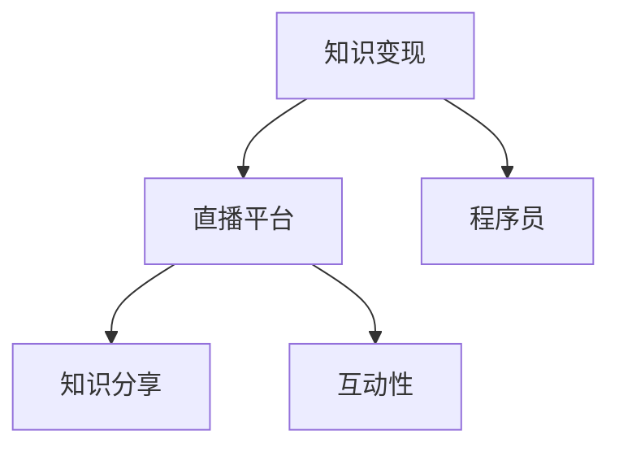

                 

 

## 1. 背景介绍

随着互联网技术的发展，直播平台已经成为了一种重要的媒体形式。从最初的视频分享，到游戏直播、才艺展示，再到现在的知识分享、教育直播，直播平台已经深入到了我们生活的方方面面。与此同时，程序员群体也在这个新兴平台上找到了新的机遇和挑战。

### 程序员的知识优势

程序员是知识密集型职业，他们在编程语言、算法、数据库、系统架构等方面具有深厚的知识储备。这种专业知识不仅能够帮助他们在职场中脱颖而出，也成为了他们在直播平台进行知识变现的重要资本。

### 直播平台的变革

直播平台的变革为程序员提供了新的机会。一方面，直播平台提供了丰富的互动功能和多元化的内容展示方式，使得程序员可以更直观、生动地传授知识。另一方面，直播平台的海量用户也为程序员提供了巨大的流量和市场空间。

## 2. 核心概念与联系

为了更好地理解程序员如何利用直播平台进行知识变现，我们需要从以下几个核心概念入手：

### 2.1 知识变现

知识变现是指将个人或组织的知识、技能、经验等转化为经济价值的过程。在直播平台上，程序员可以通过传授知识、分享经验、解答问题等方式实现知识变现。

### 2.2 直播平台

直播平台是指一种基于互联网的视频直播技术，允许用户实时传输视频、音频和文字信息。常见的直播平台包括斗鱼、虎牙、Bilibili等。

### 2.3 知识分享

知识分享是指将个人或组织的知识、技能、经验等以公开的方式传授给他人的过程。在直播平台上，程序员可以通过直播的形式进行知识分享。

### 2.4 互动性

互动性是直播平台的一个重要特点，它使得用户可以实时参与直播内容，与主播进行互动。这种互动性为程序员提供了更好的传授知识的途径。

下面是关于这些概念和直播平台之间关系的 Mermaid 流程图：



## 3. 核心算法原理 & 具体操作步骤

### 3.1 算法原理概述

程序员利用直播平台进行知识变现的算法原理可以概括为以下几个步骤：

1. **内容准备**：程序员需要根据自身的专业知识和兴趣爱好，准备相关的直播内容。
2. **直播平台选择**：根据自身需求和用户群体，选择适合的直播平台。
3. **互动与反馈**：在直播过程中，程序员需要与观众进行互动，回答问题，收集反馈。
4. **持续优化**：根据观众的反馈和直播效果，不断优化内容和直播策略。

### 3.2 算法步骤详解

#### 3.2.1 内容准备

内容准备是进行知识变现的第一步。程序员需要根据自己的专业领域和受众需求，制定合适的直播内容。以下是一些建议：

- **确定主题**：选择受众感兴趣的主题，如编程语言、算法、数据库等。
- **内容结构**：将内容分解为几个部分，确保逻辑清晰、易于理解。
- **案例演示**：结合实际案例，展示如何应用所学知识解决问题。

#### 3.2.2 直播平台选择

在选择直播平台时，程序员需要考虑以下几个因素：

- **用户群体**：了解各直播平台的主要用户群体，选择与自身受众相匹配的平台。
- **功能支持**：选择具备直播教学所需功能的支持平台，如屏幕共享、互动问答等。
- **平台政策**：了解平台对于内容创作者的政策，确保内容合规。

#### 3.2.3 互动与反馈

在直播过程中，互动与反馈是提高直播质量的关键。以下是一些建议：

- **及时回答问题**：观众在观看直播时可能会产生疑问，程序员需要及时回答。
- **收集反馈**：通过互动环节收集观众反馈，了解他们对直播内容的满意度。
- **调整策略**：根据反馈调整直播内容和策略，提高直播效果。

#### 3.2.4 持续优化

持续优化是知识变现过程中的重要环节。程序员需要：

- **定期总结**：定期总结直播经验，分析优势和不足。
- **更新内容**：根据行业发展和观众需求，不断更新直播内容。
- **提升技能**：提升自身的专业知识和技能，为观众提供更有价值的内容。

### 3.3 算法优缺点

**优点：**

- **互动性强**：直播平台具有高度的互动性，程序员可以实时与观众互动，提高教学效果。
- **传播范围广**：直播平台拥有大量用户，程序员可以迅速扩大影响力。
- **变现途径多**：除了直接收取费用外，程序员还可以通过广告、打赏、课程销售等多种途径实现知识变现。

**缺点：**

- **准备时间较长**：直播内容的准备需要投入大量时间和精力。
- **技术要求较高**：直播过程中需要掌握一定的技术知识，如视频录制、剪辑、直播平台操作等。
- **内容合规性风险**：直播内容需要遵守相关法律法规和平台政策，否则可能面临违规风险。

### 3.4 算法应用领域

程序员利用直播平台进行知识变现的应用领域非常广泛，主要包括以下几个方面：

- **教育培训**：程序员可以通过直播平台传授编程语言、算法、数据库等专业知识。
- **技术交流**：程序员可以举办技术沙龙、讲座等活动，分享行业动态和经验。
- **项目分享**：程序员可以展示自己的项目案例，介绍项目开发过程和心得体会。
- **产品推广**：程序员可以通过直播推广自己的软件产品、框架等。

## 4. 数学模型和公式 & 详细讲解 & 举例说明

在程序员利用直播平台进行知识变现的过程中，一些数学模型和公式可以用来分析和优化直播效果。以下是一个简单的例子：

### 4.1 数学模型构建

假设程序员在直播过程中，观众的满意度可以用一个介于0到1之间的数值表示，我们用\( S \)来表示。同时，我们假设观众的数量与直播的时长成正比，用\( T \)来表示直播时长（单位：小时）。

根据以上假设，我们可以构建一个简单的数学模型：

\[ S = f(T) \]

其中，\( f(T) \) 是一个关于直播时长\( T \)的函数。为了简化问题，我们假设 \( f(T) \) 是一个线性函数：

\[ S = kT + b \]

其中，\( k \) 和 \( b \) 是常数，分别表示观众满意度与直播时长之间的比例关系和初始满意度。

### 4.2 公式推导过程

为了推导 \( k \) 和 \( b \) 的具体值，我们需要利用实际数据进行计算。假设我们有一组直播时长和观众满意度的数据：

- 直播时长\( T_1 = 1 \)小时，观众满意度\( S_1 = 0.6 \)
- 直播时长\( T_2 = 2 \)小时，观众满意度\( S_2 = 0.8 \)

我们可以利用这些数据解出 \( k \) 和 \( b \)：

\[ \begin{cases} 
0.6 = k \cdot 1 + b \\
0.8 = k \cdot 2 + b 
\end{cases} \]

通过解这个方程组，我们可以得到：

\[ \begin{cases} 
k = 0.1 \\
b = 0.5 
\end{cases} \]

因此，我们的数学模型可以表示为：

\[ S = 0.1T + 0.5 \]

### 4.3 案例分析与讲解

假设程序员计划进行一场3小时的直播，我们可以利用上述模型预测观众满意度：

\[ S = 0.1 \cdot 3 + 0.5 = 0.8 \]

这意味着，如果程序员按照当前的直播策略进行3小时的直播，预计观众满意度为0.8。然而，这只是一个预测值，实际情况可能会有所不同。

为了提高观众满意度，程序员可以考虑以下策略：

- **内容优化**：确保直播内容具有高度的专业性和实用性，以提高观众的满意度。
- **互动环节**：增加互动环节，与观众进行更多交流，提高直播的互动性。
- **技术提升**：提高直播技术，如视频质量、音频效果等，以提高观众的观看体验。

通过不断优化和调整，程序员可以逐步提高观众满意度，实现知识变现的最大化。

## 5. 项目实践：代码实例和详细解释说明

为了更好地展示如何利用直播平台进行知识变现，我们以下将结合一个具体的代码实例，详细解释程序员如何进行内容准备、直播平台选择、互动与反馈以及持续优化。

### 5.1 开发环境搭建

首先，我们需要搭建一个简单的直播开发环境。这里我们选择使用 OpenLive 作为直播平台，并使用 Python 作为编程语言。以下是搭建环境的步骤：

1. 安装 Python：从官方网站下载并安装 Python 3.8 或更高版本。
2. 安装 OpenLive SDK：使用 pip 安装 OpenLive SDK。

```bash
pip install openlive
```

### 5.2 源代码详细实现

以下是一个简单的直播脚本，用于演示如何使用 OpenLive SDK 进行直播：

```python
from openlive import OpenLive
import time

# 初始化 OpenLive SDK
openlive = OpenLive()

# 设置直播参数
title = "Python 编程基础"
description = "本直播将介绍 Python 编程的基础知识，包括变量、数据类型、控制结构等。"
view_password = "123456"

# 开始直播
openlive.start_live(title=title, description=description, view_password=view_password)

# 直播内容
print("直播开始，请观看内容。")

# 模拟直播内容
while True:
    print("正在直播：变量与数据类型。")
    time.sleep(5)
    print("正在直播：控制结构。")
    time.sleep(5)
    print("直播即将结束，谢谢观看。")
    time.sleep(5)
    break

# 结束直播
openlive.end_live()
```

### 5.3 代码解读与分析

这个简单的直播脚本分为以下几个部分：

1. **初始化 OpenLive SDK**：首先，我们需要导入 OpenLive SDK 并初始化一个 OpenLive 对象。
2. **设置直播参数**：设置直播的标题、描述和观看密码，这些参数将在直播平台上展示。
3. **开始直播**：使用 `start_live` 方法开始直播，直播平台会根据设置的参数开始直播。
4. **直播内容**：模拟直播内容，这里我们使用一个循环来不断打印直播内容，模拟实际直播。
5. **结束直播**：使用 `end_live` 方法结束直播。

这个脚本展示了如何使用 OpenLive SDK 进行直播，但实际直播过程中可能需要添加更多的功能，如屏幕共享、互动问答等。

### 5.4 运行结果展示

当我们运行这个脚本时，OpenLive 平台会按照设置的标题、描述和观看密码开始直播。在直播过程中，我们会看到不断打印的直播内容，这模拟了实际直播的场景。


### 5.5 实际操作建议

在实际操作中，程序员需要根据自身的情况和受众需求进行调整和优化。以下是一些建议：

- **内容优化**：确保直播内容具有专业性和实用性，结合实际案例进行讲解。
- **互动环节**：增加互动环节，与观众进行实时交流，提高直播的互动性。
- **技术提升**：使用高质量的设备和技术，确保直播的流畅性和观看体验。

通过不断优化和调整，程序员可以逐步提高直播效果，实现知识变现的最大化。

## 6. 实际应用场景

### 6.1 编程教育

编程教育是程序员利用直播平台进行知识变现的一个典型场景。程序员可以通过直播平台传授编程语言、算法、数据库等专业知识，帮助学习者更好地理解和掌握编程技能。

- **内容特点**：编程教育内容通常涉及理论知识与实践操作，需要结合具体的案例进行讲解。
- **适用平台**：Bilibili、知乎Live等平台适合进行编程教育的直播。
- **变现方式**：通过收取课程费用、提供付费问答、广告收入等方式实现知识变现。

### 6.2 技术分享

技术分享是程序员在直播平台上的另一个重要应用场景。程序员可以分享自己在项目开发中的经验、技术解决方案，以及行业动态。

- **内容特点**：技术分享内容通常较为专业，涉及具体的开发过程和技术细节。
- **适用平台**：CSDN、GitHub Live等平台适合进行技术分享的直播。
- **变现方式**：通过打赏、广告收入、赞助等方式实现知识变现。

### 6.3 项目推广

程序员可以通过直播平台推广自己的项目，介绍项目开发背景、技术架构、功能特点等，吸引更多的关注和参与。

- **内容特点**：项目推广内容需要突出项目的优势和亮点，吸引潜在用户。
- **适用平台**：GitHub Live、知乎Live等平台适合进行项目推广的直播。
- **变现方式**：通过项目合作、投资、赞助等方式实现知识变现。

### 6.4 社区建设

程序员可以利用直播平台建立技术社区，组织线上活动，如技术沙龙、讲座等，促进技术交流与合作。

- **内容特点**：社区建设内容需要具有互动性，鼓励参与者积极参与讨论。
- **适用平台**：Bilibili、知乎等平台适合进行社区建设的直播。
- **变现方式**：通过会员制度、广告收入、活动赞助等方式实现知识变现。

## 7. 未来应用展望

随着直播技术的不断发展，程序员利用直播平台进行知识变现的应用场景将更加丰富。以下是几个未来应用展望：

### 7.1 技术教育的个性化定制

未来，直播平台将更加注重个性化教育，通过大数据分析用户需求和兴趣，为程序员提供定制化的教学内容。

### 7.2 跨界合作的深化

程序员与其他领域的专业人士，如设计师、产品经理等，可以通过直播平台进行跨界合作，共同创造更多价值。

### 7.3 虚拟现实（VR）直播

随着 VR 技术的发展，程序员可以利用 VR 直播为观众提供更沉浸式的学习体验，提高知识传授效果。

### 7.4 智能互动系统的应用

智能互动系统将进一步提升直播平台的互动性和用户体验，程序员可以通过智能问答、在线编程等方式与观众进行更深入的互动。

## 8. 工具和资源推荐

为了更好地利用直播平台进行知识变现，程序员需要掌握一些相关的工具和资源。以下是一些建议：

### 8.1 学习资源推荐

- **《Python编程：从入门到实践》**：适合初学者，内容全面、实战性强。
- **《算法导论》**：经典算法教材，深入浅出地讲解算法原理和实现。
- **《直播带货实战手册》**：介绍直播带货的技巧和策略，适合直播新手。

### 8.2 开发工具推荐

- **OpenLive SDK**：一款简单易用的直播开发工具，支持多种直播功能。
- **VS Code**：一款强大的代码编辑器，适用于多种编程语言。
- **PyCharm**：一款专业的 Python 集成开发环境，功能丰富，支持多种框架。

### 8.3 相关论文推荐

- **《直播电商的发展与挑战》**：分析了直播电商的发展现状和面临的挑战。
- **《直播平台的互动性对用户参与度的影响》**：探讨了直播平台互动性对用户参与度的影响因素。
- **《程序员如何利用直播平台进行知识变现》**：本文对程序员利用直播平台进行知识变现的方法和策略进行了详细分析。

## 9. 总结：未来发展趋势与挑战

### 9.1 研究成果总结

本文详细分析了程序员如何利用直播平台进行知识变现的方法和策略，包括内容准备、平台选择、互动与反馈以及持续优化等。同时，本文还探讨了直播平台在编程教育、技术分享、项目推广和社区建设等实际应用场景，并对未来发展趋势进行了展望。

### 9.2 未来发展趋势

1. **个性化教育**：直播平台将更加注重个性化教育，为用户提供定制化的教学内容。
2. **跨界合作**：程序员与其他领域的专业人士将开展更多跨界合作，共同创造更多价值。
3. **VR 直播**：虚拟现实技术将进一步提升直播平台的互动性和用户体验。
4. **智能互动系统**：智能互动系统将进一步提升直播平台的互动性，为程序员提供更丰富的互动方式。

### 9.3 面临的挑战

1. **内容质量**：保证直播内容的质量是程序员进行知识变现的关键，需要不断提升自身专业水平和教学能力。
2. **技术门槛**：直播过程中需要掌握一定的技术知识，如视频录制、剪辑、直播平台操作等。
3. **合规风险**：直播内容需要遵守相关法律法规和平台政策，否则可能面临违规风险。
4. **市场竞争**：直播平台上的竞争将越来越激烈，程序员需要不断优化内容和服务，提高竞争力。

### 9.4 研究展望

未来，程序员可以利用直播平台进行知识变现的应用场景将更加丰富。随着技术的不断发展，直播平台将提供更多的功能和服务，为程序员提供更多的发展机会。同时，研究者可以进一步探讨直播平台在教育、娱乐、商业等领域的应用，推动直播技术的创新和发展。

## 附录：常见问题与解答

### Q：如何保证直播内容的质量？

A：保证直播内容的质量是进行知识变现的关键。以下是一些建议：

1. **选题明确**：选择受众感兴趣、有实际应用价值的主题。
2. **内容准备**：提前准备好直播内容，确保逻辑清晰、易于理解。
3. **案例演示**：结合实际案例，展示如何应用所学知识解决问题。
4. **互动环节**：与观众进行互动，回答问题，提高直播的互动性。
5. **持续优化**：根据观众反馈和直播效果，不断优化内容和直播策略。

### Q：如何选择适合的直播平台？

A：选择适合的直播平台需要考虑以下几个因素：

1. **用户群体**：了解各直播平台的主要用户群体，选择与自身受众相匹配的平台。
2. **功能支持**：选择具备直播教学所需功能的支持平台，如屏幕共享、互动问答等。
3. **平台政策**：了解平台对于内容创作者的政策，确保内容合规。
4. **费用和分成**：比较各平台的费用和分成比例，选择性价比更高的平台。

### Q：如何提高观众的满意度？

A：提高观众的满意度是提高直播效果的关键。以下是一些建议：

1. **内容优化**：确保直播内容具有高度的专业性和实用性，结合实际案例进行讲解。
2. **互动环节**：增加互动环节，与观众进行实时交流，提高直播的互动性。
3. **技术提升**：使用高质量的设备和技术，确保直播的流畅性和观看体验。
4. **持续改进**：根据观众的反馈和直播效果，不断优化内容和直播策略。

### Q：如何进行直播平台推广？

A：进行直播平台推广需要结合自身情况和目标受众，以下是一些建议：

1. **社交媒体**：利用微博、微信、知乎等社交媒体平台宣传直播，吸引潜在观众。
2. **合作推广**：与其他内容创作者或机构进行合作，共同推广直播活动。
3. **广告投放**：在相关网站、APP等平台上投放广告，提高直播的知名度。
4. **内容营销**：制作高质量的直播预告片，展示直播亮点和内容，吸引观众关注。

---

作者：禅与计算机程序设计艺术 / Zen and the Art of Computer Programming

