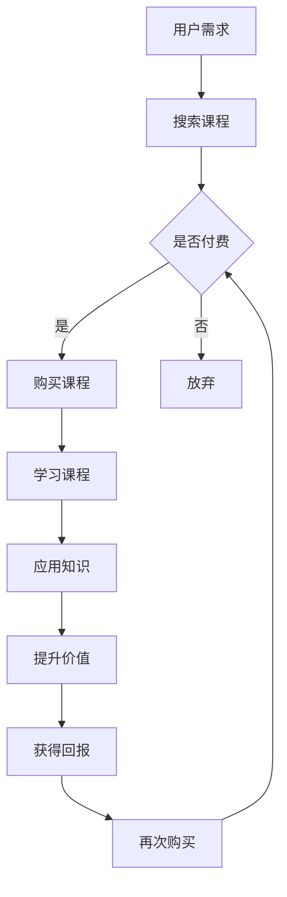

                 

  
## 1. 背景介绍

随着互联网技术的迅猛发展，知识付费逐渐成为现代社会的一个热门现象。知识付费，顾名思义，即通过购买专业知识和技能来提升自身的价值。在这个过程中，程序员作为技术领域的主要从业者，具有得天独厚的优势。据统计，全球范围内的程序员数量逐年增加，但高质量的技术人才仍然供不应求。这种供需矛盾使得程序员拥有通过知识付费实现财务自由的可能性。

知识付费的形式多种多样，包括在线课程、专业书籍、研讨会、一对一辅导等。其中，在线课程因其灵活性和便捷性，成为程序员学习新技能、提升自身价值的重要途径。此外，知识付费平台也为程序员提供了广阔的展示和交易平台，使得他们能够更好地将自身的技术能力和经验变现。

## 2. 核心概念与联系

在探讨程序员如何通过知识付费实现财务自由之前，我们需要理解几个核心概念，包括知识付费、程序员技能价值、变现渠道等。

### 2.1 知识付费

知识付费是指用户通过支付费用来获取特定领域的知识和技能。这种模式的核心在于将个人的知识、经验和技能转化为商品，通过在线平台或实体课程进行售卖。知识付费的兴起，源于人们对自我提升的需求和对专业化服务的认可。

### 2.2 程序员技能价值

程序员的技能价值在于其专业知识和技术能力。随着信息技术的发展，编程语言、框架、数据库等技能的更新速度不断加快，程序员需要不断学习和适应新技术。因此，具备一定编程经验的程序员在职场中具有较高的竞争力，他们的技能可以为企业带来实际的价值。

### 2.3 变现渠道

知识付费的变现渠道主要包括以下几个方面：

1. **在线课程**：通过在线教育平台发布课程，利用自身的专业知识和经验，以视频、文档等形式进行授课，实现知识的传递和变现。
2. **专业书籍**：编写并出版专业书籍，将自己的技术心得和实战经验分享给更多读者。
3. **研讨会**：举办线下或线上研讨会，与同行分享最新的技术动态和经验。
4. **一对一辅导**：提供一对一的编程辅导服务，针对学员的具体需求进行个性化教学。

### 2.4 Mermaid 流程图

以下是一个简化的知识付费实现财务自由的流程图：



在这个流程中，用户通过搜索课程来满足自身需求，如果决定付费，则会购买课程进行学习。学习后，用户将所学知识应用于实际工作中，提升自身价值，并最终获得回报。获得回报后，用户可能再次购买新的课程，从而形成一个良性循环。

## 3. 核心算法原理 & 具体操作步骤

### 3.1 算法原理概述

程序员通过知识付费实现财务自由的核心算法，可以概括为以下步骤：

1. **内容创作**：基于自身的专业知识和经验，创作高质量的学习内容，如在线课程、书籍、研讨会等。
2. **平台选择**：选择合适的知识付费平台，如网易云课堂、慕课网、Coursera 等，进行内容的发布和售卖。
3. **营销推广**：利用社交媒体、SEO 等手段，进行内容的营销推广，吸引潜在用户。
4. **用户反馈**：收集用户反馈，不断优化内容，提高用户满意度。
5. **变现收益**：通过付费内容实现知识变现，获得收益。

### 3.2 算法步骤详解

1. **内容创作**：

   - **选题定位**：根据市场需求和个人特长，选择适合的选题进行创作。
   - **内容规划**：制定详细的内容大纲，包括课程目标、章节安排、教学案例等。
   - **内容编写**：撰写高质量的教学文档和代码示例，确保内容的实用性和易懂性。

2. **平台选择**：

   - **平台评估**：根据平台的用户量、口碑、收益分成比例等因素进行评估。
   - **内容发布**：选择合适的平台，按照平台要求进行内容的发布和售卖。

3. **营销推广**：

   - **SEO 优化**：优化课程标题、描述等，提高搜索引擎排名。
   - **社交媒体**：利用微博、知乎、抖音等社交媒体平台，进行内容的推广和互动。
   - **合作推广**：与其他知名博主、教育机构等进行合作，扩大影响力。

4. **用户反馈**：

   - **收集反馈**：定期收集用户反馈，了解用户需求和满意度。
   - **内容优化**：根据反馈，对内容进行修改和完善，提高用户满意度。

5. **变现收益**：

   - **付费模式**：根据课程内容和用户需求，设置合理的付费模式，如一次性付费、会员制等。
   - **收益分析**：定期分析收益数据，调整营销策略和内容结构。

### 3.3 算法优缺点

**优点**：

- **高效变现**：通过知识付费，程序员能够快速将自身的技术能力和经验转化为收益。
- **灵活自由**：程序员可以根据自身时间和精力，灵活安排教学内容和发布时间。
- **持续收益**：一旦课程上线，即可持续获得收益，实现长期财务自由。

**缺点**：

- **内容创作难度**：高质量的内容创作需要耗费大量的时间和精力，对程序员的要求较高。
- **市场竞争**：随着知识付费的普及，市场竞争日益激烈，需要不断提升自身的内容质量和营销能力。
- **平台依赖**：知识付费平台对程序员具有一定的依赖性，平台政策的变动可能影响收益。

### 3.4 算法应用领域

知识付费在程序员中的应用领域广泛，包括但不限于以下几个方面：

- **编程技能培训**：针对初学者和进阶者，提供各种编程语言和框架的培训课程。
- **项目管理**：分享项目管理经验和技巧，帮助从业者提升项目管理和团队协作能力。
- **软件开发**：提供软件开发的全流程培训，包括需求分析、设计、编码、测试等。
- **人工智能与大数据**：分享人工智能和大数据领域的最新技术和应用案例。

## 4. 数学模型和公式 & 详细讲解 & 举例说明

### 4.1 数学模型构建

为了更好地理解程序员如何通过知识付费实现财务自由，我们可以构建一个简单的数学模型。假设一个程序员在知识付费平台上的月收益为 \( R \)，其收益来源主要包括课程售卖和用户打赏。我们可以用以下公式表示：

\[ R = R_c + R_d \]

其中，\( R_c \) 为课程售卖收益，\( R_d \) 为用户打赏收益。

### 4.2 公式推导过程

1. **课程售卖收益**：

   假设程序员在某门课程上的月售卖量为 \( Q \)，每门课程的售价为 \( P \)。那么，课程售卖收益可以表示为：

   \[ R_c = Q \times P \]

2. **用户打赏收益**：

   假设每月有 \( N \) 名用户对程序员的内容进行打赏，每名用户的平均打赏金额为 \( A \)。那么，用户打赏收益可以表示为：

   \[ R_d = N \times A \]

3. **总收益**：

   将课程售卖收益和用户打赏收益相加，即可得到程序员的月总收益：

   \[ R = R_c + R_d = Q \times P + N \times A \]

### 4.3 案例分析与讲解

假设一个程序员在某门编程语言课程上的月售卖量为 100 门，每门课程的售价为 100 元。同时，每月有 50 名用户对其进行打赏，每名用户的平均打赏金额为 50 元。根据上述公式，我们可以计算出该程序员的月总收益：

\[ R = (100 \times 100) + (50 \times 50) = 10,000 + 2,500 = 12,500 \text{ 元} \]

通过这个案例，我们可以看到，程序员通过知识付费平台实现财务自由的可能性。然而，实际收益会受到多种因素的影响，如课程质量、市场竞争力、用户需求等。因此，程序员需要不断优化自身的内容和营销策略，以提高收益。

## 5. 项目实践：代码实例和详细解释说明

### 5.1 开发环境搭建

在本项目中，我们将使用 Python 语言编写一个简单的在线课程售卖系统。首先，需要搭建一个 Python 开发环境。以下是具体步骤：

1. **安装 Python**：访问 [Python 官网](https://www.python.org/)，下载并安装最新版本的 Python。
2. **安装 IDE**：选择一款适合自己的 Python IDE，如 PyCharm 或 Visual Studio Code。
3. **安装依赖库**：在终端或 IDE 中执行以下命令，安装必要的依赖库：

   ```bash
   pip install flask
   pip install pymysql
   ```

### 5.2 源代码详细实现

以下是该在线课程售卖系统的源代码：

```python
# 导入所需库
from flask import Flask, request, render_template
from pymysql import connect, cursors

# 初始化 Flask 应用
app = Flask(__name__)

# 数据库连接配置
config = {
    'host': 'localhost',
    'user': 'root',
    'password': '123456',
    'database': 'course'
}

# 连接数据库
def connect_db():
    conn = connect(**config)
    return conn

# 创建数据库表
def create_tables():
    conn = connect_db()
    cursor = conn.cursor()
    cursor.execute('''
        CREATE TABLE IF NOT EXISTS courses (
            id INT AUTO_INCREMENT PRIMARY KEY,
            title VARCHAR(255) NOT NULL,
            price DECIMAL(10, 2) NOT NULL
        )
    ''')
    conn.commit()
    cursor.close()
    conn.close()

# 添加课程
@app.route('/add_course', methods=['POST'])
def add_course():
    title = request.form['title']
    price = request.form['price']
    conn = connect_db()
    cursor = conn.cursor()
    cursor.execute("INSERT INTO courses (title, price) VALUES (%s, %s)", (title, price))
    conn.commit()
    cursor.close()
    conn.close()
    return '添加成功'

# 展示课程列表
@app.route('/')
def index():
    conn = connect_db()
    cursor = conn.cursor()
    cursor.execute('SELECT * FROM courses')
    courses = cursor.fetchall()
    cursor.close()
    conn.close()
    return render_template('index.html', courses=courses)

if __name__ == '__main__':
    create_tables()
    app.run(debug=True)
```

### 5.3 代码解读与分析

该在线课程售卖系统主要包括以下几个部分：

1. **数据库连接**：使用 `pymysql` 库连接 MySQL 数据库，并创建课程表。
2. **添加课程**：通过 `/add_course` 接口接收前端提交的课程信息，并插入到数据库中。
3. **展示课程列表**：通过 `index` 函数获取数据库中的课程列表，并渲染到前端页面。

### 5.4 运行结果展示

在终端运行该程序后，访问 [http://127.0.0.1:5000/](http://127.0.0.1:5000/) ，即可看到课程列表页面。同时，可以通过前端表单添加新的课程。

## 6. 实际应用场景

知识付费在程序员中的应用场景非常广泛，以下列举几个典型的应用场景：

### 6.1 技术培训

程序员可以通过在线课程、视频教程等形式，为初学者和进阶者提供各种编程语言、框架、数据库等技术的培训。这种模式适合有丰富编程经验和教学能力的程序员。

### 6.2 项目实战

通过分享实际项目经验，程序员可以帮助他人快速掌握项目开发的技能。例如，编写项目实战教程、举办线上或线下项目沙龙等。这种模式适合有实际项目经验和良好沟通能力的程序员。

### 6.3 技术咨询

程序员可以提供一对一的技术咨询服务，针对客户的具体需求，提供定制化的解决方案。这种模式适合有深厚技术背景和丰富实战经验的程序员。

### 6.4 软件开发

程序员可以通过知识付费，将自己的软件开发经验和技术心得分享给他人。例如，编写开源项目、发布软件教程等。这种模式适合有编程能力和创新思维的程序员。

## 7. 未来应用展望

随着互联网和人工智能技术的不断发展，知识付费在程序员中的应用前景将更加广阔。以下是一些未来应用展望：

### 7.1 个性化学习

未来，知识付费平台将更加注重个性化学习，通过大数据和人工智能技术，为用户提供定制化的学习方案，提高学习效果和满意度。

### 7.2 跨界融合

程序员可以通过知识付费，将编程技术与艺术、设计等领域相结合，开发出更具创新性的产品和服务。

### 7.3 深度学习

随着深度学习技术的发展，程序员可以利用知识付费，将深度学习应用于各种实际问题，为行业带来更多变革。

### 7.4 全球化发展

知识付费平台将逐渐走向全球化，为全球范围内的程序员提供更广阔的展示和交易平台，促进知识共享和技术创新。

## 8. 总结：未来发展趋势与挑战

### 8.1 研究成果总结

本文通过分析程序员通过知识付费实现财务自由的核心概念、算法原理、数学模型以及实际应用场景，总结了知识付费在程序员领域的应用前景。

### 8.2 未来发展趋势

未来，知识付费将在程序员领域呈现出个性化、跨界融合、深度学习和全球化发展趋势。

### 8.3 面临的挑战

然而，知识付费在程序员领域也面临着内容创作难度、市场竞争和平台依赖等挑战。

### 8.4 研究展望

未来，我们需要进一步探讨如何优化程序员的知识付费模式，提高内容的实用性和竞争力，为程序员实现财务自由提供更有效的路径。

## 9. 附录：常见问题与解答

### 9.1 如何选择知识付费平台？

选择知识付费平台时，可以从用户量、口碑、收益分成比例、课程质量等方面进行评估，选择最适合自己需求的平台。

### 9.2 如何提升知识付费内容的质量？

提升知识付费内容的质量，可以从以下几个方面入手：

1. **选题定位**：选择市场需求大、有实际应用价值的课题。
2. **内容结构**：制定清晰的内容大纲，确保内容的逻辑性和系统性。
3. **实战案例**：结合实际项目经验，提供实用的案例和解决方案。
4. **用户体验**：注重用户的互动和反馈，不断优化教学内容。

### 9.3 如何应对市场竞争？

应对市场竞争，可以从以下几个方面入手：

1. **差异化竞争**：找到自己的独特优势，打造有差异化的内容。
2. **持续创新**：不断学习新技术，提升自身的技术能力和创新能力。
3. **品牌建设**：注重个人品牌的塑造，提高知名度和影响力。
4. **合作共赢**：与其他同行或机构进行合作，扩大市场份额。

作者：禅与计算机程序设计艺术 / Zen and the Art of Computer Programming  
日期：2023年9月
----------------------------------------------------------------
本文详细探讨了程序员如何利用知识付费实现财务自由的话题。从背景介绍、核心概念与联系、算法原理、数学模型、项目实践、实际应用场景、未来展望到常见问题解答，全面阐述了知识付费在程序员领域的应用和价值。

文章通过构建一个简单的数学模型，分析了程序员通过知识付费实现财务自由的核心算法，并提供了具体的代码实例和详细解释说明。此外，文章还针对实际应用场景进行了分析，展望了知识付费在程序员领域的未来发展。

然而，知识付费在程序员领域也面临着一定的挑战，如内容创作难度、市场竞争和平台依赖等。因此，未来我们需要进一步优化程序员的知识付费模式，提高内容的实用性和竞争力，为程序员实现财务自由提供更有效的路径。

最后，本文总结了研究成果，并提出了未来研究方向。希望通过本文的探讨，能够为程序员在知识付费领域的发展提供一些有益的启示和指导。

作者：禅与计算机程序设计艺术 / Zen and the Art of Computer Programming  
日期：2023年9月

