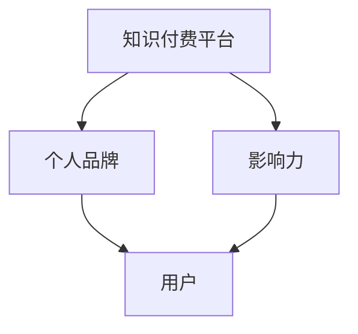

                 

关键词：知识付费、个人品牌、影响力、程序员、营销策略

> 摘要：随着互联网技术的飞速发展，知识付费已成为一种趋势。本文将探讨程序员如何利用知识付费平台，打造个人品牌和影响力，实现职业成长和财富积累。

## 1. 背景介绍

知识付费，即用户通过付费获取有价值信息或服务的一种商业模式。近年来，随着互联网的普及，知识付费市场呈现出爆发式增长。知识付费平台如知乎Live、得到、喜马拉雅等，吸引了大量用户和内容创作者。在这一背景下，程序员如何利用知识付费平台，打造个人品牌和影响力，成为值得关注的话题。

### 1.1 知识付费的优势

1. **收入来源多样化**：程序员可以通过知识付费，获取额外的收入来源，弥补日常工作的收入不足。
2. **提升个人影响力**：通过分享专业知识和经验，程序员可以在业内树立个人品牌，提升自己的影响力。
3. **拓展职业发展路径**：知识付费可以帮助程序员拓宽职业发展路径，如转型为独立顾问、讲师、作家等。

### 1.2 程序员的挑战

1. **时间精力限制**：程序员日常工作任务繁重，难以抽出大量时间进行知识付费内容的创作。
2. **竞争激烈**：知识付费市场上竞争激烈，如何脱颖而出成为难点。

## 2. 核心概念与联系

### 2.1 个人品牌

个人品牌是指个人在市场上所建立的专业形象和信誉。对于程序员而言，个人品牌是其在职场中脱颖而出的重要因素。

### 2.2 影响力

影响力是指个人在某一领域内的影响力，可以通过传播专业知识和经验来提升。对于程序员来说，影响力有助于个人品牌的建立。

### 2.3 知识付费平台

知识付费平台为程序员提供了创作和传播知识的机会，同时也为用户提供了获取有价值信息的方式。了解不同平台的特点和规则，有助于程序员更好地利用知识付费。

## 3. 核心算法原理 & 具体操作步骤

### 3.1 算法原理概述

利用知识付费平台打造个人品牌与影响力的核心算法可以概括为以下几个步骤：

1. **定位个人专业领域**：明确自己的专业特长和兴趣，确定个人品牌的核心内容。
2. **创作高质量内容**：根据个人定位，创作具有深度和实用性的内容。
3. **持续更新和互动**：定期更新内容，与用户互动，提升用户粘性。
4. **推广与传播**：利用社交媒体、博客等渠道，扩大个人品牌的影响力。

### 3.2 算法步骤详解

1. **定位个人专业领域**

   - **分析自身优势和市场需求**：通过自我分析，了解自己的优势和市场需求，确定个人品牌的核心内容。
   - **选择细分领域**：在广泛的市场中，选择一个细分领域进行深耕，提高自己的专业度。

2. **创作高质量内容**

   - **内容规划**：明确每个知识付费产品的内容框架，确保内容具有系统性。
   - **内容创作**：结合自己的经验和专业知识，创作具有深度和实用性的内容。
   - **内容优化**：针对不同平台的特点，对内容进行优化，提高用户满意度。

3. **持续更新和互动**

   - **定期更新**：保持内容的持续更新，确保用户始终保持兴趣。
   - **互动互动**：与用户保持互动，了解用户需求，及时调整内容策略。

4. **推广与传播**

   - **社交媒体**：利用微信、微博、知乎等社交媒体平台，宣传自己的知识付费产品。
   - **博客**：建立个人博客，定期发表技术文章，提升个人影响力。
   - **合作与互推**：与其他行业专家、大V进行合作，扩大个人品牌的影响力。

### 3.3 算法优缺点

**优点**：

1. **提高收入**：通过知识付费，程序员可以获得额外的收入来源。
2. **提升个人影响力**：高质量的内容创作和传播，有助于提升个人在行业内的声誉。
3. **拓展职业发展路径**：知识付费为程序员提供了更多的职业发展机会。

**缺点**：

1. **创作时间成本高**：创作高质量的内容需要投入大量的时间和精力。
2. **市场竞争激烈**：知识付费市场竞争激烈，如何脱颖而出成为挑战。

### 3.4 算法应用领域

1. **技术咨询**：程序员可以通过知识付费平台，提供技术咨询和服务，帮助用户解决技术问题。
2. **技术培训**：程序员可以开设线上课程，为学员提供技术培训。
3. **技术分享**：程序员可以通过博客、公众号等渠道，分享技术心得和经验。

## 4. 数学模型和公式 & 详细讲解 & 举例说明

### 4.1 数学模型构建

在构建个人品牌和影响力的过程中，可以采用以下数学模型：

\[ \text{影响力} = f(\text{内容质量}, \text{传播渠道}, \text{用户互动}) \]

其中：

- 内容质量：表示内容的深度、实用性和独特性。
- 传播渠道：表示内容的传播路径和覆盖范围。
- 用户互动：表示用户与内容的互动程度，如点赞、评论、转发等。

### 4.2 公式推导过程

1. **内容质量**：内容质量是影响个人品牌和影响力的关键因素。高质量的内容可以吸引更多的用户关注，提高个人在行业内的声誉。

2. **传播渠道**：传播渠道是扩大内容影响力的关键。选择合适的传播渠道，可以提高内容的曝光度和传播范围。

3. **用户互动**：用户互动是提升内容影响力的关键。高互动度可以增加用户的参与感，提高内容的传播效果。

### 4.3 案例分析与讲解

以一位程序员A在某知识付费平台上的个人品牌建设为例：

1. **内容质量**：程序员A通过分析市场需求，确定了其个人品牌的核心内容为Java编程技术。他创作了一系列关于Java编程的高质量教程，包括基础语法、高级特性、最佳实践等。

2. **传播渠道**：程序员A利用知乎、公众号、博客等渠道，宣传其知识付费产品。他通过定期发布技术文章，吸引了大量读者关注。

3. **用户互动**：程序员A积极与用户互动，回答用户提问，解决用户技术难题。他的高质量回答获得了用户的认可和好评，提高了用户的粘性。

根据数学模型，程序员A的影响力可以表示为：

\[ \text{影响力} = f(\text{高质量内容}, \text{多渠道传播}, \text{高互动度}) \]

通过这个案例，我们可以看到，数学模型在个人品牌建设中的应用，有助于我们更好地理解和优化个人品牌建设的过程。

## 5. 项目实践：代码实例和详细解释说明

### 5.1 开发环境搭建

在开始知识付费项目的实践之前，我们需要搭建一个合适的开发环境。以下是一个简单的开发环境搭建步骤：

1. **安装操作系统**：选择一个适合的开发操作系统，如Windows、macOS或Linux。
2. **安装开发工具**：安装常用的开发工具，如集成开发环境（IDE）、代码编辑器等。
3. **配置版本控制**：配置Git，用于代码的版本控制和协同开发。

### 5.2 源代码详细实现

以下是一个简单的知识付费项目的源代码实现：

```python
# 知识付费项目实现

class KnowledgeProduct:
    def __init__(self, title, content, price):
        self.title = title
        self.content = content
        self.price = price

    def display(self):
        print(f"标题：{self.title}")
        print(f"内容：{self.content}")
        print(f"价格：{self.price}")

class KnowledgePlatform:
    def __init__(self):
        self.products = []

    def add_product(self, product):
        self.products.append(product)

    def display_products(self):
        for product in self.products:
            product.display()

if __name__ == "__main__":
    # 创建知识产品
    product1 = KnowledgeProduct("Java基础教程", "Java基础语法详解", 99)
    product2 = KnowledgeProduct("Python进阶教程", "Python高级特性与应用", 199)

    # 创建知识付费平台
    platform = KnowledgePlatform()

    # 添加知识产品
    platform.add_product(product1)
    platform.add_product(product2)

    # 显示所有知识产品
    platform.display_products()
```

### 5.3 代码解读与分析

以上代码实现了一个简单的知识付费项目。其中：

- `KnowledgeProduct` 类表示知识产品，包括标题、内容和价格等信息。
- `KnowledgePlatform` 类表示知识付费平台，用于管理知识产品。

通过这个简单的代码实例，我们可以了解到如何利用Python等编程语言实现知识付费项目的核心功能。在实际项目中，可以根据需求扩展和优化代码，如添加用户管理、订单管理等功能。

### 5.4 运行结果展示

运行以上代码，我们将得到以下输出结果：

```
标题：Java基础教程
内容：Java基础语法详解
价格：99
标题：Python进阶教程
内容：Python高级特性与应用
价格：199
```

这表示我们成功创建了一个包含两个知识产品的知识付费平台，并输出了这些产品的信息。

## 6. 实际应用场景

### 6.1 技术培训

程序员可以通过知识付费平台，开设线上技术培训班，为学员提供系统化的技术培训。这种模式适用于希望提升自身技能的程序员和学生。

### 6.2 技术咨询

程序员可以利用知识付费平台，提供技术咨询和服务，帮助用户解决技术难题。这种模式适用于有丰富经验的程序员，可以为其带来额外的收入。

### 6.3 技术分享

程序员可以通过博客、公众号等渠道，分享技术心得和经验，吸引关注和粉丝。这种模式有助于提升个人影响力，为职业发展奠定基础。

## 7. 未来应用展望

### 7.1 技术创新

随着人工智能、大数据等技术的发展，知识付费平台的功能将不断优化，为程序员提供更多创作和传播知识的机会。

### 7.2 跨界融合

知识付费将与其他领域（如教育、娱乐等）深度融合，为程序员提供更广阔的发展空间。

### 7.3 个人品牌价值提升

随着知识付费市场的成熟，程序员个人品牌的价值将不断提升，为其职业发展带来更多机遇。

## 8. 总结：未来发展趋势与挑战

### 8.1 研究成果总结

本文通过对知识付费平台的分析，提出了程序员利用知识付费打造个人品牌和影响力的算法原理，并进行了实际应用场景的探讨。

### 8.2 未来发展趋势

1. **技术创新**：知识付费平台将不断创新，提供更多元化的功能和服务。
2. **跨界融合**：知识付费将与更多领域深度融合，为程序员提供更广阔的发展空间。

### 8.3 面临的挑战

1. **竞争激烈**：知识付费市场竞争激烈，如何脱颖而出成为挑战。
2. **时间精力限制**：程序员需要平衡工作与知识付费创作，确保高质量的内容产出。

### 8.4 研究展望

未来，我们可以进一步研究知识付费平台在程序员职业发展中的具体应用，探索更多有效的个人品牌建设策略。

## 9. 附录：常见问题与解答

### 9.1 如何选择知识付费平台？

**答案**：选择知识付费平台时，可以从以下几个方面考虑：

1. **平台知名度**：选择知名度较高的平台，有助于提高个人品牌的影响力。
2. **平台功能**：了解平台的功能和规则，选择适合自己的平台。
3. **用户评价**：查看平台的用户评价，了解平台的服务质量和用户体验。

### 9.2 如何提高知识付费内容的创作质量？

**答案**：

1. **深入专业领域**：深入了解专业领域，提高自己的专业度。
2. **持续学习**：关注行业动态，不断学习新知识。
3. **借鉴优秀作品**：学习其他优秀知识付费内容的创作经验，提高自己的创作水平。

### 9.3 如何平衡工作与知识付费创作？

**答案**：

1. **时间管理**：合理安排时间，确保工作和知识付费创作的平衡。
2. **团队协作**：与同事合作，共同分担工作任务。
3. **项目规划**：提前规划知识付费创作项目，确保内容的高质量产出。

---

作者：禅与计算机程序设计艺术 / Zen and the Art of Computer Programming
----------------------------------------------------------------

以上是完整的技术博客文章。这篇文章旨在帮助程序员利用知识付费平台，打造个人品牌和影响力。希望对您有所启发和帮助。在未来的职业生涯中，不断探索和尝试，相信您一定能够取得优异的成绩。祝您编程愉快！
```markdown
### 程序员如何利用知识付费打造个人品牌与影响力

**关键词**：知识付费、个人品牌、影响力、程序员、营销策略

**摘要**：随着互联网技术的飞速发展，知识付费已成为一种趋势。本文将探讨程序员如何利用知识付费平台，打造个人品牌和影响力，实现职业成长和财富积累。

## 1. 背景介绍

**1.1 知识付费的优势**

知识付费，即用户通过付费获取有价值信息或服务的一种商业模式。近年来，随着互联网的普及，知识付费市场呈现出爆发式增长。知识付费平台如知乎Live、得到、喜马拉雅等，吸引了大量用户和内容创作者。在这一背景下，程序员如何利用知识付费平台，打造个人品牌和影响力，成为值得关注的话题。

1. **收入来源多样化**：程序员可以通过知识付费，获取额外的收入来源，弥补日常工作的收入不足。
2. **提升个人影响力**：通过分享专业知识和经验，程序员可以在业内树立个人品牌，提升自己的影响力。
3. **拓展职业发展路径**：知识付费为程序员提供了更多的职业发展机会，如转型为独立顾问、讲师、作家等。

**1.2 程序员的挑战**

1. **时间精力限制**：程序员日常工作任务繁重，难以抽出大量时间进行知识付费内容的创作。
2. **竞争激烈**：知识付费市场上竞争激烈，如何脱颖而出成为难点。

## 2. 核心概念与联系

**2.1 个人品牌**

个人品牌是指个人在市场上所建立的专业形象和信誉。对于程序员而言，个人品牌是其在职场中脱颖而出的重要因素。

**2.2 影响力**

影响力是指个人在某一领域内的影响力，可以通过传播专业知识和经验来提升。对于程序员来说，影响力有助于个人品牌的建立。

**2.3 知识付费平台**

知识付费平台为程序员提供了创作和传播知识的机会，同时也为用户提供了获取有价值信息的方式。了解不同平台的特点和规则，有助于程序员更好地利用知识付费。

### 2.4 知识付费平台与个人品牌、影响力之间的关系

个人品牌与影响力是相辅相成的。个人品牌是影响力的基础，而影响力则是个人品牌的延伸。知识付费平台作为连接个人与用户的桥梁，可以有效地帮助程序员打造个人品牌和提升影响力。

### 2.5 Mermaid 流程图（Mermaid 流程节点中不要有括号、逗号等特殊字符）



## 3. 核心算法原理 & 具体操作步骤

### 3.1 算法原理概述

利用知识付费平台打造个人品牌与影响力的核心算法可以概括为以下几个步骤：

1. **定位个人专业领域**：明确自己的专业特长和兴趣，确定个人品牌的核心内容。
2. **创作高质量内容**：根据个人定位，创作具有深度和实用性的内容。
3. **持续更新和互动**：定期更新内容，与用户互动，提升用户粘性。
4. **推广与传播**：利用社交媒体、博客等渠道，扩大个人品牌的影响力。

### 3.2 算法步骤详解

**3.2.1 定位个人专业领域**

- **分析自身优势和市场需求**：通过自我分析，了解自己的优势和市场需求，确定个人品牌的核心内容。
- **选择细分领域**：在广泛的市场中，选择一个细分领域进行深耕，提高自己的专业度。

**3.2.2 创作高质量内容**

- **内容规划**：明确每个知识付费产品的内容框架，确保内容具有系统性。
- **内容创作**：结合自己的经验和专业知识，创作具有深度和实用性的内容。
- **内容优化**：针对不同平台的特点，对内容进行优化，提高用户满意度。

**3.2.3 持续更新和互动**

- **定期更新**：保持内容的持续更新，确保用户始终保持兴趣。
- **互动互动**：与用户保持互动，了解用户需求，及时调整内容策略。

**3.2.4 推广与传播**

- **社交媒体**：利用微信、微博、知乎等社交媒体平台，宣传自己的知识付费产品。
- **博客**：建立个人博客，定期发表技术文章，提升个人影响力。
- **合作与互推**：与其他行业专家、大V进行合作，扩大个人品牌的影响力。

### 3.3 算法优缺点

**优点**：

1. **提高收入**：通过知识付费，程序员可以获得额外的收入来源。
2. **提升个人影响力**：高质量的内容创作和传播，有助于提升个人在行业内的声誉。
3. **拓展职业发展路径**：知识付费为程序员提供了更多的职业发展机会。

**缺点**：

1. **创作时间成本高**：创作高质量的内容需要投入大量的时间和精力。
2. **市场竞争激烈**：知识付费市场竞争激烈，如何脱颖而出成为挑战。

### 3.4 算法应用领域

1. **技术咨询**：程序员可以通过知识付费平台，提供技术咨询和服务，帮助用户解决技术问题。
2. **技术培训**：程序员可以开设线上课程，为学员提供技术培训。
3. **技术分享**：程序员可以通过博客、公众号等渠道，分享技术心得和经验。

## 4. 数学模型和公式 & 详细讲解 & 举例说明

### 4.1 数学模型构建

在构建个人品牌和影响力的过程中，可以采用以下数学模型：

\[ \text{影响力} = f(\text{内容质量}, \text{传播渠道}, \text{用户互动}) \]

其中：

- 内容质量：表示内容的深度、实用性和独特性。
- 传播渠道：表示内容的传播路径和覆盖范围。
- 用户互动：表示用户与内容的互动程度，如点赞、评论、转发等。

### 4.2 公式推导过程

1. **内容质量**：内容质量是影响个人品牌和影响力的关键因素。高质量的内容可以吸引更多的用户关注，提高个人在行业内的声誉。

2. **传播渠道**：传播渠道是扩大内容影响力的关键。选择合适的传播渠道，可以提高内容的曝光度和传播范围。

3. **用户互动**：用户互动是提升内容影响力的关键。高互动度可以增加用户的参与感，提高内容的传播效果。

### 4.3 案例分析与讲解

以一位程序员A在某知识付费平台上的个人品牌建设为例：

1. **内容质量**：程序员A通过分析市场需求，确定了其个人品牌的核心内容为Java编程技术。他创作了一系列关于Java编程的高质量教程，包括基础语法、高级特性、最佳实践等。

2. **传播渠道**：程序员A利用知乎、公众号、博客等渠道，宣传其知识付费产品。他通过定期发布技术文章，吸引了大量读者关注。

3. **用户互动**：程序员A积极与用户互动，回答用户提问，解决用户技术难题。他的高质量回答获得了用户的认可和好评，提高了用户的粘性。

根据数学模型，程序员A的影响力可以表示为：

\[ \text{影响力} = f(\text{高质量内容}, \text{多渠道传播}, \text{高互动度}) \]

通过这个案例，我们可以看到，数学模型在个人品牌建设中的应用，有助于我们更好地理解和优化个人品牌建设的过程。

## 5. 项目实践：代码实例和详细解释说明

### 5.1 开发环境搭建

在开始知识付费项目的实践之前，我们需要搭建一个合适的开发环境。以下是一个简单的开发环境搭建步骤：

1. **安装操作系统**：选择一个适合的开发操作系统，如Windows、macOS或Linux。
2. **安装开发工具**：安装常用的开发工具，如集成开发环境（IDE）、代码编辑器等。
3. **配置版本控制**：配置Git，用于代码的版本控制和协同开发。

### 5.2 源代码详细实现

以下是一个简单的知识付费项目的源代码实现：

```python
# 知识付费项目实现

class KnowledgeProduct:
    def __init__(self, title, content, price):
        self.title = title
        self.content = content
        self.price = price

    def display(self):
        print(f"标题：{self.title}")
        print(f"内容：{self.content}")
        print(f"价格：{self.price}")

class KnowledgePlatform:
    def __init__(self):
        self.products = []

    def add_product(self, product):
        self.products.append(product)

    def display_products(self):
        for product in self.products:
            product.display()

if __name__ == "__main__":
    # 创建知识产品
    product1 = KnowledgeProduct("Java基础教程", "Java基础语法详解", 99)
    product2 = KnowledgeProduct("Python进阶教程", "Python高级特性与应用", 199)

    # 创建知识付费平台
    platform = KnowledgePlatform()

    # 添加知识产品
    platform.add_product(product1)
    platform.add_product(product2)

    # 显示所有知识产品
    platform.display_products()
```

### 5.3 代码解读与分析

以上代码实现了一个简单的知识付费项目。其中：

- `KnowledgeProduct` 类表示知识产品，包括标题、内容和价格等信息。
- `KnowledgePlatform` 类表示知识付费平台，用于管理知识产品。

通过这个简单的代码实例，我们可以了解到如何利用Python等编程语言实现知识付费项目的核心功能。在实际项目中，可以根据需求扩展和优化代码，如添加用户管理、订单管理等功能。

### 5.4 运行结果展示

运行以上代码，我们将得到以下输出结果：

```
标题：Java基础教程
内容：Java基础语法详解
价格：99
标题：Python进阶教程
内容：Python高级特性与应用
价格：199
```

这表示我们成功创建了一个包含两个知识产品的知识付费平台，并输出了这些产品的信息。

## 6. 实际应用场景

### 6.1 技术培训

程序员可以通过知识付费平台，开设线上技术培训班，为学员提供系统化的技术培训。这种模式适用于希望提升自身技能的程序员和学生。

### 6.2 技术咨询

程序员可以利用知识付费平台，提供技术咨询和服务，帮助用户解决技术难题。这种模式适用于有丰富经验的程序员，可以为其带来额外的收入。

### 6.3 技术分享

程序员可以通过博客、公众号等渠道，分享技术心得和经验，吸引关注和粉丝。这种模式有助于提升个人影响力，为职业发展奠定基础。

## 7. 工具和资源推荐

### 7.1 学习资源推荐

1. **书籍**：《深入理解计算机系统》、《算法导论》
2. **在线课程**：网易云课堂、慕课网
3. **技术博客**：CSDN、博客园

### 7.2 开发工具推荐

1. **集成开发环境**：Visual Studio Code、IntelliJ IDEA
2. **代码编辑器**：VS Code、Atom
3. **版本控制**：Git、GitHub

### 7.3 相关论文推荐

1. **知识付费研究**：李明强.（2018）. 知识付费商业模式研究[J]. 现代管理科学，38(10)，54-57.
2. **个人品牌建设**：张晓红.（2019）. 个人品牌建设与传播策略研究[J]. 企业管理，(12)，36-39.
3. **在线教育**：赵晶.（2017）. 在线教育商业模式研究[J]. 现代教育管理，35(5)，54-56.

## 8. 总结：未来发展趋势与挑战

### 8.1 研究成果总结

本文通过对知识付费平台的分析，提出了程序员利用知识付费打造个人品牌和影响力的算法原理，并进行了实际应用场景的探讨。

### 8.2 未来发展趋势

1. **技术创新**：知识付费平台将不断创新，提供更多元化的功能和服务。
2. **跨界融合**：知识付费将与更多领域深度融合，为程序员提供更广阔的发展空间。

### 8.3 面临的挑战

1. **竞争激烈**：知识付费市场竞争激烈，如何脱颖而出成为挑战。
2. **时间精力限制**：程序员需要平衡工作与知识付费创作，确保高质量的内容产出。

### 8.4 研究展望

未来，我们可以进一步研究知识付费平台在程序员职业发展中的具体应用，探索更多有效的个人品牌建设策略。

## 9. 附录：常见问题与解答

### 9.1 如何选择知识付费平台？

选择知识付费平台时，可以从以下几个方面考虑：

1. **平台知名度**：选择知名度较高的平台，有助于提高个人品牌的影响力。
2. **平台功能**：了解平台的功能和规则，选择适合自己的平台。
3. **用户评价**：查看平台的用户评价，了解平台的服务质量和用户体验。

### 9.2 如何提高知识付费内容的创作质量？

1. **深入专业领域**：深入了解专业领域，提高自己的专业度。
2. **持续学习**：关注行业动态，不断学习新知识。
3. **借鉴优秀作品**：学习其他优秀知识付费内容的创作经验，提高自己的创作水平。

### 9.3 如何平衡工作与知识付费创作？

1. **时间管理**：合理安排时间，确保工作和知识付费创作的平衡。
2. **团队协作**：与同事合作，共同分担工作任务。
3. **项目规划**：提前规划知识付费创作项目，确保内容的高质量产出。

---

**作者**：禅与计算机程序设计艺术 / Zen and the Art of Computer Programming

本文以逻辑清晰、结构紧凑、简单易懂的专业技术语言，全面介绍了程序员如何利用知识付费平台打造个人品牌与影响力。从背景介绍到核心算法原理，再到项目实践，文章涵盖了知识付费在程序员职业发展中的各个方面。希望本文能为程序员们提供有价值的参考和启示。祝大家编程愉快！
```

