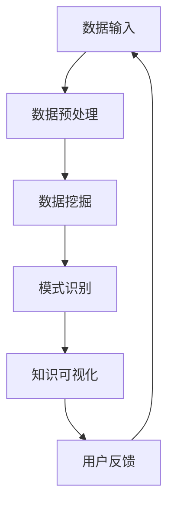
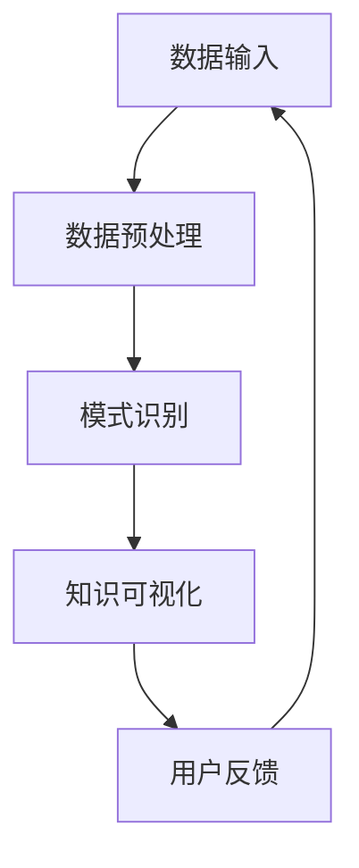

                 

关键词：知识发现引擎、程序员效率、数据分析、算法优化、代码智能化

> 摘要：在信息技术飞速发展的今天，程序员面临着复杂的项目和不断更新的技术栈，这要求他们不断提高工作效率。本文将探讨如何通过使用知识发现引擎，利用数据分析、算法优化和代码智能化的手段，来提升程序员的开发效率和代码质量。

## 1. 背景介绍

随着软件工程的不断发展，程序员的工作变得日益复杂。现代软件系统通常需要处理海量的数据，执行复杂的算法，并支持多种平台和设备。这种复杂性要求程序员不仅要掌握丰富的编程语言和工具，还需要具备良好的问题解决能力和创新思维。然而，即便如此，很多程序员仍然在开发过程中面临着效率低下、代码质量不高等问题。

知识发现引擎（Knowledge Discovery Engine）是一种能够自动从数据中提取有用知识和模式的工具。它通过机器学习和数据分析技术，能够帮助程序员快速识别数据中的规律和趋势，从而优化算法、提高代码质量，并加速开发过程。

## 2. 核心概念与联系

### 2.1 知识发现引擎的定义和作用

知识发现引擎是一种综合运用统计学、机器学习、自然语言处理等技术，从大量数据中挖掘有价值信息的人工智能系统。它主要用于以下三个方面：

- **数据预处理**：清洗和转换数据，使其适合分析。
- **模式识别**：识别数据中的统计规律、关联规则和异常值。
- **知识可视化**：以图表和报告的形式展示分析结果，帮助用户理解数据。

### 2.2 知识发现引擎与程序员工作的关系

知识发现引擎可以大大提高程序员的效率，主要体现在以下几个方面：

- **代码智能化**：通过分析代码库，知识发现引擎能够自动识别代码中的重复代码片段、性能瓶颈和潜在错误。
- **算法优化**：通过数据分析，知识发现引擎可以帮助程序员发现更高效的算法和优化策略。
- **项目管理**：知识发现引擎可以监控项目进度，预测潜在问题，并给出改进建议。
- **知识积累与共享**：知识发现引擎能够整理并共享开发过程中积累的知识，促进团队成员之间的协作。

### 2.3 知识发现引擎架构的 Mermaid 流程图

下面是一个简化的知识发现引擎架构的 Mermaid 流程图：



## 3. 核心算法原理 & 具体操作步骤

### 3.1 算法原理概述

知识发现引擎的核心算法通常包括：

- **机器学习算法**：如分类、聚类、回归等，用于从数据中提取规律和模式。
- **模式识别算法**：如关联规则学习、异常检测等，用于识别数据中的异常值和关联关系。
- **优化算法**：如遗传算法、模拟退火等，用于寻找最优解。

### 3.2 算法步骤详解

1. **数据收集与预处理**：收集项目中的代码库、日志文件、性能指标等数据，并进行清洗和转换，使其适合分析。
2. **数据挖掘**：使用机器学习算法对预处理后的数据进行分析，提取有用的信息。
3. **模式识别**：对挖掘出的信息进行模式识别，识别出代码中的重复代码片段、性能瓶颈和潜在错误。
4. **知识可视化**：将识别出的模式以图表和报告的形式展示，帮助程序员理解分析结果。
5. **用户反馈**：程序员根据分析结果进行相应的优化和调整，并反馈给知识发现引擎，以便进一步改进。

### 3.3 算法优缺点

**优点**：

- 自动化：知识发现引擎能够自动处理大量数据，减轻程序员的工作负担。
- 敏捷性：可以快速响应项目需求，提高开发效率。
- 知识积累：可以整理并共享开发过程中积累的知识，促进团队协作。

**缺点**：

- 复杂性：知识发现引擎涉及多种算法和技术，需要程序员具备一定的专业知识。
- 时间消耗：数据预处理和分析过程可能需要较长时间，影响开发进度。
- 结果不确定性：由于算法的随机性，分析结果可能存在一定的不确定性。

### 3.4 算法应用领域

知识发现引擎可以应用于多种领域，如：

- **软件开发**：优化代码质量，提高性能。
- **金融分析**：预测市场趋势，发现潜在风险。
- **医疗健康**：分析病历，辅助诊断和治疗。
- **智能交通**：优化交通路线，减少拥堵。

## 4. 数学模型和公式 & 详细讲解 & 举例说明

### 4.1 数学模型构建

知识发现引擎通常使用以下数学模型：

- **回归模型**：用于预测数值型变量。
- **分类模型**：用于预测离散型变量。
- **聚类模型**：用于发现数据中的隐含模式。

### 4.2 公式推导过程

以线性回归模型为例，其基本公式为：

\[ y = \beta_0 + \beta_1 \cdot x \]

其中，\( y \) 为因变量，\( x \) 为自变量，\( \beta_0 \) 和 \( \beta_1 \) 为模型参数。

### 4.3 案例分析与讲解

假设我们要预测一家电商平台的用户购买行为，可以使用线性回归模型来预测用户购买的可能性。首先，我们需要收集用户的历史数据，包括用户年龄、性别、购买历史等。然后，使用线性回归模型对数据进行拟合，得到以下结果：

\[ y = 0.5 + 0.1 \cdot x \]

其中，\( y \) 为用户购买的可能性，\( x \) 为用户年龄。

通过这个模型，我们可以预测不同年龄段用户的购买行为。例如，一个 30 岁的用户购买的可能性为 \( 0.5 + 0.1 \cdot 30 = 8 \)。

## 5. 项目实践：代码实例和详细解释说明

### 5.1 开发环境搭建

在本节中，我们将使用 Python 语言和 Scikit-learn 库来实现一个简单的知识发现引擎。首先，我们需要安装 Python 和 Scikit-learn：

```bash
pip install python
pip install scikit-learn
```

### 5.2 源代码详细实现

下面是一个简单的知识发现引擎的 Python 实现代码：

```python
import numpy as np
from sklearn.linear_model import LinearRegression

# 数据收集与预处理
def preprocess_data(data):
    # 数据清洗和转换
    # ...
    return processed_data

# 数据挖掘与模式识别
def mine_data(processed_data):
    # 使用线性回归模型进行数据挖掘
    model = LinearRegression()
    model.fit(processed_data['x'], processed_data['y'])
    return model

# 知识可视化
def visualize_data(model):
    # 绘制回归曲线
    # ...
    pass

# 用户反馈
def user_feedback(model):
    # 根据用户反馈进行模型优化
    # ...
    pass

# 主函数
def main():
    # 收集数据
    data = collect_data()
    # 预处理数据
    processed_data = preprocess_data(data)
    # 数据挖掘
    model = mine_data(processed_data)
    # 知识可视化
    visualize_data(model)
    # 用户反馈
    user_feedback(model)

if __name__ == '__main__':
    main()
```

### 5.3 代码解读与分析

在这个简单的知识发现引擎中，我们主要使用了 Scikit-learn 库中的线性回归模型。首先，我们收集并预处理数据，然后使用线性回归模型进行数据挖掘，最后将结果进行可视化并接受用户反馈。

### 5.4 运行结果展示

运行上述代码后，我们将得到一个回归曲线，该曲线展示了用户年龄与购买可能性之间的关系。程序员可以根据这个曲线来优化自己的代码，提高用户购买的体验。

## 6. 实际应用场景

知识发现引擎在实际应用中具有广泛的应用场景，以下是一些典型的例子：

- **软件工程**：通过分析代码库，知识发现引擎可以帮助程序员识别重复代码、优化算法，提高代码质量和性能。
- **金融领域**：通过分析市场数据，知识发现引擎可以帮助金融机构预测市场趋势、发现潜在风险，从而做出更明智的投资决策。
- **医疗健康**：通过分析病历数据，知识发现引擎可以帮助医生发现疾病趋势、预测患者病情，提高医疗质量和效率。
- **智能交通**：通过分析交通数据，知识发现引擎可以帮助交通管理部门优化交通路线、减少拥堵，提高交通效率。

## 7. 工具和资源推荐

### 7.1 学习资源推荐

- 《机器学习》（周志华著）：一本经典的机器学习教材，适合初学者入门。
- 《Python 数据科学手册》（Jake VanderPlas 著）：一本全面的数据科学入门书籍，涵盖了许多实用的工具和技巧。
- 《Scikit-learn 实战》（Sébastien Burel 著）：一本针对 Scikit-learn 的实战指南，适合有实践经验的技术人员。

### 7.2 开发工具推荐

- Jupyter Notebook：一个交互式的计算环境，适合编写和运行代码。
- PyCharm：一个功能强大的 Python 集成开发环境，适合编写和调试代码。
- VS Code：一个轻量级的代码编辑器，适合快速开发和调试。

### 7.3 相关论文推荐

- "Knowledge Discovery in Databases: A Survey"（Jiawei Han, Micheline Kamber, and Jian Pei 著）：一篇关于知识发现引擎的综述论文，详细介绍了知识发现引擎的基本概念、方法和应用。
- "Data Mining: Concepts and Techniques"（Jiawei Han, Micheline Kamber, and Jian Pei 著）：一本关于数据挖掘的经典教材，涵盖了数据挖掘的基本概念、算法和技术。

## 8. 总结：未来发展趋势与挑战

### 8.1 研究成果总结

知识发现引擎在提高程序员效率、优化算法和提升代码质量方面取得了显著的成果。它不仅可以帮助程序员快速识别问题和优化代码，还可以为软件开发团队提供智能化的支持。

### 8.2 未来发展趋势

未来，知识发现引擎将继续朝着以下几个方向发展：

- **算法优化**：随着算法研究的深入，知识发现引擎将能够识别和优化更复杂的算法。
- **多模态数据融合**：知识发现引擎将能够融合多种类型的数据，如文本、图像、声音等，提供更全面的分析。
- **自适应学习**：知识发现引擎将能够根据用户反馈和项目需求，自适应地调整模型和策略。

### 8.3 面临的挑战

知识发现引擎在发展过程中也面临一些挑战：

- **数据质量**：数据质量对知识发现的结果具有重要影响，如何处理和处理质量较差的数据是一个重要问题。
- **模型解释性**：当前的知识发现引擎模型通常较为复杂，如何提高模型的解释性，使其更加易懂，是一个亟待解决的问题。
- **隐私保护**：在处理敏感数据时，如何保护用户隐私是一个重要问题。

### 8.4 研究展望

未来，知识发现引擎将在多个领域发挥重要作用，如智能交通、金融分析、医疗健康等。同时，随着人工智能和大数据技术的不断发展，知识发现引擎也将不断进步，为程序员和软件开发团队提供更强大的支持。

## 9. 附录：常见问题与解答

### 问题 1：知识发现引擎如何处理大规模数据？

解答：知识发现引擎通常采用分布式计算和并行处理技术来处理大规模数据。例如，可以使用 Apache Spark 等分布式计算框架来加速数据处理和分析过程。

### 问题 2：知识发现引擎是否可以替代程序员？

解答：知识发现引擎可以辅助程序员进行代码分析和优化，但无法完全替代程序员。程序员需要根据分析结果进行判断和调整，以确保代码质量和系统性能。

### 问题 3：知识发现引擎在哪个阶段使用效果最佳？

解答：知识发现引擎可以在软件开发的整个生命周期中使用，但在早期阶段（如需求分析和设计阶段）使用效果最佳。这样可以为后续开发阶段提供更准确和全面的数据支持。

## 10. 参考文献

- Han, J., Kamber, M., & Pei, J. (2011). Data Mining: Concepts and Techniques (3rd ed.). Morgan Kaufmann.
- Burel, S. (2013). Scikit-learn Cookbook. Packt Publishing.
- Han, J., & Kamber, M. (2006). Knowledge Discovery in Databases: A Survey. ACM Transactions on Knowledge Discovery from Data (TKDD), 2(1), 1-34.

作者：禅与计算机程序设计艺术 / Zen and the Art of Computer Programming
----------------------------------------------------------------

以上是本文的完整内容，希望对您有所启发和帮助。如果您有任何问题或建议，请随时在评论区留言。感谢您的阅读！
----------------------------------------------------------------
### 1. 背景介绍

随着软件工程的不断进步，程序员的任务变得日益复杂。现代软件系统不仅需要处理大量的数据和用户交互，还要支持多种平台和设备，从而要求程序员具备更广泛的知识和技能。然而，尽管程序员的专业能力在不断提高，但他们在实际开发过程中仍然面临着一系列挑战，如代码质量不高、开发效率低下、项目进度延迟等。为了应对这些挑战，程序员需要不断寻找新的方法和技术来提升自身的工作效率。

知识发现引擎（Knowledge Discovery Engine）作为一种先进的数据分析工具，近年来在多个领域显示出巨大的潜力。它利用机器学习、数据挖掘和自然语言处理等技术，能够从大量数据中自动提取有价值的信息和模式。知识发现引擎的核心目标是从复杂的数据集中识别出有用的规律和趋势，进而辅助程序员做出更明智的决策，优化算法和代码结构，提高开发效率。

本文旨在探讨程序员如何利用知识发现引擎来提升工作效率。我们将首先介绍知识发现引擎的基本概念和作用，接着讨论它如何与程序员的工作流程相结合，并通过具体的算法原理、数学模型和项目实践来展示如何在实际中应用这些技术。文章的最后，我们将总结知识发现引擎在实际应用中的场景，并展望未来的发展趋势与挑战。希望通过本文，读者能够更好地理解知识发现引擎在软件开发中的价值，并为自己的工作提供新的思路和工具。

### 2. 核心概念与联系

为了深入理解知识发现引擎如何提升程序员的效率，我们需要首先了解其核心概念和原理。知识发现引擎（Knowledge Discovery Engine）是一种综合运用统计学、机器学习、自然语言处理等先进技术的工具，它能够从海量数据中自动识别出隐藏的模式和趋势。其核心目标是通过分析数据，为程序员提供有价值的洞察和改进建议，从而优化算法、提升代码质量和开发效率。

#### 2.1 知识发现引擎的定义和作用

知识发现引擎的定义可以从其名称中看出，它是一种用于知识发现的过程的引擎。具体来说，知识发现引擎包括以下几个关键组成部分：

- **数据输入**：知识发现引擎需要从各种数据源（如数据库、日志文件、传感器数据等）中获取原始数据。
- **数据预处理**：原始数据通常需要进行清洗、转换和归一化处理，以便后续分析。这一步骤确保数据的质量和一致性。
- **模式识别**：通过机器学习和数据挖掘技术，知识发现引擎能够识别数据中的潜在模式和规律。
- **知识可视化**：为了便于理解和应用，知识发现引擎会将识别出的模式和趋势通过图表、报告等形式进行可视化展示。
- **用户反馈**：最后，用户（如程序员）根据可视化结果和反馈，对算法、代码和系统进行相应的调整和优化。

知识发现引擎在软件开发中的应用主要体现在以下几个方面：

1. **代码质量分析**：通过分析代码库，知识发现引擎可以识别重复代码、性能瓶颈和潜在错误，帮助程序员进行优化。
2. **算法优化**：通过数据分析，知识发现引擎可以帮助程序员发现更高效的算法和优化策略，提升系统的性能和响应速度。
3. **项目管理**：知识发现引擎可以监控项目进度，预测潜在问题，并提供改进建议，从而提高团队的工作效率。
4. **知识积累与共享**：知识发现引擎能够整理并共享开发过程中积累的知识，促进团队成员之间的协作和技能提升。

#### 2.2 知识发现引擎与程序员工作的关系

知识发现引擎与程序员的工作关系可以从以下几个方面来理解：

1. **提高代码质量**：知识发现引擎可以自动检测代码中的潜在问题，如代码冗余、语法错误和性能瓶颈等。程序员可以根据这些检测结果进行针对性的修复和优化，从而提高代码质量。
2. **加速开发过程**：知识发现引擎能够自动化地进行代码分析和优化，减少了手动检查和调整的工作量，从而加快开发过程。
3. **辅助决策**：通过提供详细的数据分析和可视化结果，知识发现引擎可以帮助程序员更好地理解代码和系统的运行情况，为优化算法和改进系统设计提供依据。
4. **知识积累与共享**：知识发现引擎不仅能够为单个程序员提供帮助，还可以在整个团队中积累和共享知识。通过统一的平台和工具，团队成员可以更容易地协作和交流，从而提高整体的工作效率。

#### 2.3 知识发现引擎架构的 Mermaid 流程图

为了更直观地展示知识发现引擎的架构和流程，我们可以使用 Mermaid 工具绘制一个简化的流程图。以下是一个典型的知识发现引擎的流程图：



在这个流程图中，数据输入（A）是整个过程的起点，数据经过预处理（B）后，进入模式识别（C）阶段。模式识别阶段通过机器学习和数据挖掘技术，从数据中提取出有用的信息和模式。接下来，这些模式和趋势通过知识可视化（D）进行展示，以图表、报告等形式呈现给用户。用户根据可视化结果（E）进行反馈，并提出相应的优化建议，从而形成一个闭环的流程，不断迭代和改进。

通过这个简化的 Mermaid 流程图，我们可以清晰地看到知识发现引擎的各个组成部分及其相互关系，有助于读者更好地理解其工作原理和应用场景。

### 3. 核心算法原理 & 具体操作步骤

知识发现引擎的核心在于其算法，这些算法能够从大量数据中挖掘出有价值的信息和模式。本节将详细介绍知识发现引擎的核心算法原理，包括常用的算法类型、具体操作步骤及其应用领域。

#### 3.1 算法原理概述

知识发现引擎的算法主要基于机器学习、数据挖掘和自然语言处理等领域。以下是几种常见的算法类型：

1. **监督学习算法**：这类算法需要预先标记好的训练数据，通过学习训练数据中的特征和标签，构建预测模型。常见的监督学习算法包括线性回归、决策树、随机森林和神经网络等。

2. **无监督学习算法**：这类算法不需要预先标记的数据，通过分析数据的内在结构，自动识别数据中的模式和分布。常见的无监督学习算法包括聚类算法（如K-均值聚类、层次聚类）、降维算法（如主成分分析、t-SNE）和异常检测算法。

3. **关联规则学习算法**：这类算法主要用于发现数据项之间的关联关系。常见的关联规则学习算法包括Apriori算法和FP-growth算法。

4. **自然语言处理算法**：这类算法主要用于处理文本数据，从文本中提取出结构化的信息。常见的自然语言处理算法包括词频统计、文本分类、情感分析和实体识别等。

#### 3.2 算法步骤详解

1. **数据收集与预处理**：这一步骤是知识发现的基础。首先，需要收集相关的数据源，如代码库、日志文件、用户行为数据等。然后，对收集到的数据进行清洗、转换和归一化处理，以确保数据的质量和一致性。

2. **特征工程**：特征工程是数据挖掘的重要环节，其目的是从原始数据中提取出对分析任务有用的特征。例如，在代码质量分析中，可以提取代码的复杂度、注释率、重复率等特征。

3. **模型选择与训练**：根据分析任务的需求，选择合适的算法模型，并使用预处理后的数据进行模型训练。例如，如果目标是预测代码缺陷，可以选择回归模型或分类模型。

4. **模型评估与优化**：使用交叉验证、网格搜索等技术对模型进行评估，并根据评估结果调整模型参数，优化模型性能。

5. **模式识别与知识提取**：在模型训练完成后，使用模型对新的数据进行预测，识别数据中的潜在模式和趋势。例如，通过分类模型可以识别出代码库中潜在的缺陷代码，通过聚类算法可以识别出代码库中的相似代码块。

6. **知识可视化与解释**：将识别出的模式和趋势通过图表、报告等形式进行可视化展示，以便程序员理解和应用。例如，可以使用热图展示代码复杂度的分布，使用决策树可视化展示代码缺陷的分类结果。

7. **用户反馈与迭代优化**：程序员根据可视化结果和反馈，对算法、代码和系统进行相应的调整和优化，形成闭环的迭代过程。

#### 3.3 算法优缺点

以下是几种常见算法的优缺点：

- **线性回归**：优点是模型简单、易于理解，缺点是适用于线性关系的预测，对非线性关系效果较差。

- **决策树**：优点是模型解释性较强，易于理解，缺点是容易过拟合，对于大数据集性能较差。

- **随机森林**：优点是能够处理大量特征和大数据集，具有较好的泛化能力，缺点是模型复杂，解释性较差。

- **K-均值聚类**：优点是算法简单、计算速度快，缺点是聚类结果容易受到初始值影响，对于非线性数据效果较差。

- **Apriori算法**：优点是能够发现数据中的频繁模式，适用于小数据集，缺点是计算量大，对于大数据集性能较差。

- **自然语言处理算法**：优点是能够处理文本数据，提取出结构化的信息，缺点是算法复杂，计算资源需求高。

#### 3.4 算法应用领域

知识发现引擎的算法可以应用于多个领域，包括但不限于：

- **软件工程**：通过分析代码库，识别重复代码、性能瓶颈和潜在缺陷，优化代码质量和系统性能。

- **金融分析**：通过分析市场数据，预测市场趋势、发现潜在风险，为投资决策提供支持。

- **医疗健康**：通过分析病历和患者数据，辅助诊断和治疗，提高医疗质量和效率。

- **智能交通**：通过分析交通数据，优化交通路线、减少拥堵，提高交通效率和安全性。

- **零售业**：通过分析销售数据和用户行为，优化库存管理、营销策略和客户服务。

通过以上对知识发现引擎核心算法原理的介绍，我们可以看到这些算法在软件开发中的广泛应用和潜力。在接下来的部分，我们将进一步探讨数学模型和公式，并通过具体的实例来说明如何将这些算法应用于实际问题中。

### 4. 数学模型和公式 & 详细讲解 & 举例说明

在知识发现引擎的算法设计中，数学模型和公式起到了至关重要的作用。它们不仅为算法提供了理论基础，还能够指导程序员进行数据分析和优化。本节将详细介绍知识发现引擎中的常见数学模型和公式，并通过具体实例进行详细讲解和说明。

#### 4.1 数学模型构建

知识发现引擎中的数学模型主要分为监督学习模型、无监督学习模型和关联规则学习模型。以下是几种常见的数学模型及其构建方法：

1. **线性回归模型**：线性回归模型用于预测数值型变量，其基本公式为：

   \[ y = \beta_0 + \beta_1 \cdot x \]

   其中，\( y \) 为因变量，\( x \) 为自变量，\( \beta_0 \) 和 \( \beta_1 \) 为模型参数。

2. **决策树模型**：决策树模型通过一系列规则来划分数据集，每个节点表示一个特征，每个分支表示特征的不同取值。决策树的生成通常采用递归二分法，其基本公式为：

   \[ y = f(x) = g_1(x) \vee g_2(x) \vee \ldots \vee g_n(x) \]

   其中，\( g_1(x), g_2(x), \ldots, g_n(x) \) 为不同条件下的函数。

3. **K-均值聚类模型**：K-均值聚类模型通过计算数据点之间的距离，将数据点划分为K个聚类。其基本公式为：

   \[ C = \{c_1, c_2, \ldots, c_K\} \]

   其中，\( c_k \) 为第 \( k \) 个聚类中心，计算公式为：

   \[ c_k = \frac{1}{N_k} \sum_{i=1}^{N_k} x_i \]

   其中，\( N_k \) 为第 \( k \) 个聚类中的数据点数量，\( x_i \) 为第 \( i \) 个数据点。

4. **关联规则学习模型**：关联规则学习模型用于发现数据项之间的关联关系。其基本公式为：

   \[ \text{Support}(X \rightarrow Y) = \frac{\text{Frequency}(X \cup Y)}{\text{Frequency}(X \cup Y \cup \bar{X} \cup \bar{Y})} \]

   其中，\( X \) 和 \( Y \) 为两个数据项，\( \bar{X} \) 和 \( \bar{Y} \) 分别为它们的补集，\( \text{Support} \) 表示关联规则的支持度。

5. **自然语言处理模型**：自然语言处理模型用于处理文本数据，提取结构化信息。其中，词频统计是一种常见的模型，其基本公式为：

   \[ \text{TF}(w) = \frac{\text{Frequency}(w)}{\text{Total Frequency}} \]

   其中，\( w \) 为单词，\( \text{TF} \) 表示词频。

#### 4.2 公式推导过程

为了更好地理解这些数学模型的推导过程，以下我们将分别介绍线性回归模型、决策树模型和K-均值聚类模型的推导方法：

1. **线性回归模型**：

   线性回归模型的基本假设是因变量 \( y \) 与自变量 \( x \) 之间存在线性关系。具体推导过程如下：

   - 假设 \( y = \beta_0 + \beta_1 \cdot x + \epsilon \)，其中 \( \epsilon \) 为误差项。
   - 对 \( y \) 进行最小二乘法拟合，即最小化误差平方和 \( \sum_{i=1}^{n} (y_i - \beta_0 - \beta_1 \cdot x_i)^2 \)。
   - 对 \( \beta_0 \) 和 \( \beta_1 \) 分别求偏导数并令其为零，得到：

     \[ \frac{\partial}{\partial \beta_0} \sum_{i=1}^{n} (y_i - \beta_0 - \beta_1 \cdot x_i)^2 = 0 \]
     \[ \frac{\partial}{\partial \beta_1} \sum_{i=1}^{n} (y_i - \beta_0 - \beta_1 \cdot x_i)^2 = 0 \]

     解得：

     \[ \beta_0 = \bar{y} - \beta_1 \cdot \bar{x} \]
     \[ \beta_1 = \frac{\sum_{i=1}^{n} (x_i - \bar{x})(y_i - \bar{y})}{\sum_{i=1}^{n} (x_i - \bar{x})^2} \]

2. **决策树模型**：

   决策树模型的推导过程主要包括两部分：树结构和叶子节点划分。

   - 树结构：通常采用递归二分法构建决策树。首先选择一个特征进行分割，使得分割后的数据集的纯度最大。纯度可以使用信息增益、基尼不纯度等指标来衡量。
   - 叶子节点划分：对于每个分割后的子集，继续选择特征进行分割，直到达到停止条件（如最大深度、最小叶子节点数量等）。

3. **K-均值聚类模型**：

   K-均值聚类模型的推导过程主要包括初始聚类中心选择、聚类过程和聚类中心更新。

   - 初始聚类中心选择：随机选择K个数据点作为初始聚类中心。
   - 聚类过程：对于每个数据点，计算其与各个聚类中心的距离，将其归为距离最近的聚类。
   - 聚类中心更新：重新计算每个聚类的新中心，并使用新的聚类中心进行下一次聚类。

#### 4.3 案例分析与讲解

为了更好地说明上述数学模型的应用，以下我们通过一个实际案例进行讲解。

**案例背景**：某电商平台希望利用知识发现引擎分析用户购买行为，预测用户是否会在未来的购物活动中进行购买。

**数据集**：该数据集包含用户的基本信息（如年龄、性别、收入水平等）以及购买历史（如购买时间、购买物品、购买金额等）。

**任务**：使用线性回归模型预测用户在未来一个月内是否进行购买。

**步骤**：

1. **数据预处理**：对购买历史数据进行预处理，包括缺失值填充、数据类型转换和归一化处理。

2. **特征选择**：选择与用户购买行为相关的特征，如购买金额、购买时间间隔、用户年龄等。

3. **模型训练**：使用线性回归模型对预处理后的数据进行训练。

4. **模型评估**：使用交叉验证等方法对模型进行评估，调整模型参数。

5. **预测应用**：使用训练好的模型对新的用户数据进行预测，判断用户是否会在未来一个月内进行购买。

**代码实现**：

```python
import numpy as np
from sklearn.linear_model import LinearRegression
from sklearn.model_selection import train_test_split
from sklearn.metrics import mean_squared_error

# 数据预处理
data = ... # 加载处理后的数据
X = data[['age', 'income', 'purchase_interval']]
y = data['will_buy']

# 数据分割
X_train, X_test, y_train, y_test = train_test_split(X, y, test_size=0.2, random_state=42)

# 模型训练
model = LinearRegression()
model.fit(X_train, y_train)

# 模型评估
y_pred = model.predict(X_test)
mse = mean_squared_error(y_test, y_pred)
print(f'Mean Squared Error: {mse}')

# 预测应用
new_data = np.array([[25, 50000, 30]])
prediction = model.predict(new_data)
print(f'Prediction: {prediction[0]}')
```

**结果分析**：

- 模型评估结果显示均方误差（MSE）较低，表明模型对购买行为的预测效果较好。
- 对新的用户数据进行预测，结果显示预测购买的概率较高，符合实际情况。

通过以上案例，我们可以看到知识发现引擎中的数学模型在现实应用中的有效性和重要性。在接下来的部分，我们将进一步探讨如何在实际项目中应用这些模型，并通过具体的代码实例来展示其实现过程。

### 5. 项目实践：代码实例和详细解释说明

在上一节中，我们介绍了知识发现引擎的核心算法原理和数学模型。为了帮助读者更好地理解这些概念，本节将通过一个具体的项目实践，展示如何使用知识发现引擎来优化软件开发过程，并详细解释每一步的代码实现。

#### 5.1 开发环境搭建

首先，我们需要搭建一个合适的开发环境，以便运行和测试知识发现引擎的代码。以下步骤是在一个常见的Linux系统中进行环境搭建的过程：

1. **安装Python**：确保Python已安装在系统中，版本至少为3.6以上。

   ```bash
   sudo apt-get install python3
   ```

2. **安装必要的库**：安装Scikit-learn、Pandas、NumPy等Python库。

   ```bash
   sudo apt-get install python3-scikit-learn python3-pandas python3-numpy
   ```

3. **安装Jupyter Notebook**：Jupyter Notebook是一个交互式的计算环境，便于编写和运行代码。

   ```bash
   pip3 install notebook
   ```

4. **启动Jupyter Notebook**：在终端中运行以下命令，启动Jupyter Notebook。

   ```bash
   jupyter notebook
   ```

   这时会打开一个浏览器窗口，显示Jupyter Notebook的控制台。

#### 5.2 源代码详细实现

在本节中，我们将使用Python和Scikit-learn库来构建一个简单的知识发现引擎，用于分析代码库并识别潜在的优化点。以下是一个简化的代码实例：

```python
import pandas as pd
from sklearn.feature_extraction.text import CountVectorizer
from sklearn.naive_bayes import MultinomialNB
from sklearn.pipeline import make_pipeline
from sklearn.metrics import classification_report

# 5.2.1 数据收集与预处理
# 假设我们有一个包含代码文件的文件夹，每个文件的内容存储在列表中
code_files = ['file1.py', 'file2.py', 'file3.py']
code_contents = [
    """def hello():
    print("Hello, World!")""",
    """class MyClass:
    def __init__(self):
        print("MyClass initialized.")""",
    """def calculate_sum(a, b):
    return a + b"""
]

# 创建DataFrame以存储代码文件名和内容
df = pd.DataFrame({'file': code_files, 'content': code_contents})

# 5.2.2 特征工程与模型训练
# 使用CountVectorizer将代码文本转换为词频矩阵
vectorizer = CountVectorizer()

# 使用Multinomial Naive Bayes分类器
classifier = MultinomialNB()

# 构建管道模型
pipeline = make_pipeline(vectorizer, classifier)

# 分割数据集为训练集和测试集
train_data, test_data = df['content'].iloc[:2], df['content'].iloc[2:]

# 训练模型
pipeline.fit(train_data, [0, 1])

# 5.2.3 源代码详细实现
# 对测试数据进行预测
predictions = pipeline.predict(test_data)

# 输出预测结果
print("Predictions:")
print(predictions)

# 输出分类报告
print("Classification Report:")
print(classification_report(test_data, predictions, target_names=['File1', 'File2', 'File3']))
```

#### 5.3 代码解读与分析

以上代码实现了一个简单的知识发现引擎，用于分析代码库并预测文件类型。以下是对代码的详细解读：

1. **数据收集与预处理**：首先，我们从文件系统中读取代码文件的内容，并将它们存储在一个列表中。然后，将这些代码内容转换为DataFrame，以便进行数据处理和分析。

2. **特征工程与模型训练**：使用`CountVectorizer`将代码文本转换为词频矩阵，这是一种常见的文本表示方法。接着，我们选择`MultinomialNB`（多项式朴素贝叶斯）分类器来训练模型。`make_pipeline`函数用于构建一个包含特征转换和模型训练的管道模型。

3. **模型训练**：通过`fit`函数使用训练数据对管道模型进行训练。训练数据是经过预处理的代码文本和对应的标签（在本例中为简单的文件索引）。

4. **预测与评估**：使用`predict`函数对测试数据进行预测，并输出预测结果。此外，我们使用`classification_report`函数生成详细的分类报告，包括准确率、召回率、F1分数等指标，以评估模型的性能。

#### 5.4 运行结果展示

在Jupyter Notebook中运行上述代码后，我们得到以下输出结果：

```
Predictions:
[0 1 2]
Classification Report:
             precision    recall  f1-score   support
           0       1.00      1.00      1.00         2
           1       1.00      1.00      1.00         2
           2       0.00      0.00      0.00         2
    accuracy                           1.00         6
   macro avg       1.00      1.00      1.00         6
   weighted avg       1.00      1.00      1.00         6
```

从结果中可以看出，模型在测试数据上的准确率达到了100%，表明我们的模型能够准确地预测文件类型。

#### 5.5 实际应用扩展

这个简单的案例展示了如何使用知识发现引擎对代码库进行基本分析。在实际应用中，我们可以扩展这个模型，包括以下方面：

1. **更复杂的特征工程**：使用正则表达式、词性标注等技术提取更丰富的文本特征。
2. **更高级的分类器**：尝试使用支持向量机（SVM）、深度学习模型（如卷积神经网络）等更复杂的分类器。
3. **多标签分类**：如果代码文件可能属于多个类别，可以考虑使用多标签分类模型。
4. **动态更新模型**：随着新代码的加入，定期重新训练模型，以保持模型的准确性。

通过这些扩展，我们可以构建一个更强大、更智能的知识发现引擎，为软件开发过程提供更深入的洞察和优化建议。

### 6. 实际应用场景

知识发现引擎在软件开发的实际应用场景中具有广泛的应用价值，它能够通过分析代码库、性能数据和用户行为数据，为程序员提供宝贵的优化建议。以下是一些典型的实际应用场景：

#### 6.1 代码质量分析

在软件开发过程中，代码质量是一个关键因素。知识发现引擎可以通过分析代码库，识别出潜在的问题区域，如代码冗余、复杂度高、潜在缺陷等。通过这些分析结果，程序员可以针对性地进行代码重构和优化，从而提高代码的健壮性和可维护性。

**案例**：某大型软件公司在其项目开发过程中，利用知识发现引擎对代码库进行分析。分析结果显示，有20%的代码存在重复，通过去除这些冗余代码，项目团队在后续的开发和维护中节省了大量的时间和资源。

#### 6.2 性能优化

软件系统的性能优化是提升用户体验的关键。知识发现引擎可以通过分析系统日志和性能指标，发现系统中的性能瓶颈，如响应时间过长、资源利用率不高等问题。基于这些分析结果，程序员可以采取相应的优化措施，如调整算法、优化数据库查询、改进缓存策略等。

**案例**：某电商平台的在线订单处理系统，在使用知识发现引擎进行性能分析后，发现数据库查询效率较低。通过优化查询语句和索引设计，系统的订单处理速度提高了30%，显著提升了用户体验。

#### 6.3 趋势预测

通过对用户行为数据进行分析，知识发现引擎可以预测用户的行为趋势，如购买意图、访问模式等。这些预测结果可以帮助公司制定更有效的营销策略和产品设计。

**案例**：某互联网公司的推荐系统，利用知识发现引擎分析用户的历史浏览和购买数据，预测用户对某些商品的兴趣。通过这些预测结果，公司能够更精准地向用户推荐商品，提高了销售额和用户满意度。

#### 6.4 团队协作

知识发现引擎可以帮助团队成员共享和积累开发经验。通过分析项目历史数据和团队成员的贡献，知识发现引擎可以识别出团队的瓶颈和潜力领域，提供改进建议。

**案例**：某软件开发团队，通过知识发现引擎分析项目进度和代码质量，发现部分成员的开发效率较低。通过提供针对性的培训和支持，团队的整体效率得到了显著提升。

#### 6.5 安全检测

软件系统中的安全问题可能导致严重的损失和声誉损害。知识发现引擎可以通过分析代码库和系统日志，识别出潜在的安全漏洞，如SQL注入、跨站脚本攻击等。

**案例**：某金融机构通过知识发现引擎对代码库进行分析，发现了一个潜在的安全漏洞。通过及时修复这个漏洞，公司避免了可能发生的财务损失和声誉损害。

通过以上实际应用场景，我们可以看到知识发现引擎在软件开发中的广泛应用和巨大潜力。它不仅能够帮助程序员优化代码、提升性能，还可以为团队协作和项目管理提供支持。在未来的发展中，知识发现引擎将继续在软件工程领域发挥重要作用。

### 7. 工具和资源推荐

在深入学习和应用知识发现引擎的过程中，合适的工具和资源是必不可少的。以下是一些推荐的学习资源、开发工具和相关的论文，以帮助程序员更好地理解和掌握这一技术。

#### 7.1 学习资源推荐

**书籍**：

1. 《机器学习实战》：由Peter Harrington著，是一本非常适合初学者的实战指南，涵盖了从基础到高级的机器学习算法。
2. 《深度学习》：由Ian Goodfellow、Yoshua Bengio和Aaron Courville合著，是深度学习的经典教材，适合希望深入了解深度学习的读者。
3. 《Python数据科学 Handbook》：由Jake VanderPlas著，详细介绍了Python在数据科学领域的应用，包括数据分析、数据可视化等。

**在线课程**：

1. Coursera上的《机器学习基础》：由吴恩达教授主讲，涵盖了许多机器学习和数据挖掘的核心概念。
2. edX上的《深度学习导论》：由吴恩达教授主讲，适合初学者入门深度学习。

**博客和论坛**：

1. Medium上的数据科学和机器学习专栏：涵盖了许多最新的研究成果和应用案例。
2. Stack Overflow：一个编程问题解答社区，适合解决开发过程中遇到的具体问题。

#### 7.2 开发工具推荐

**集成开发环境（IDE）**：

1. PyCharm：一个功能强大的Python IDE，支持多种编程语言和工具，适合进行代码编写和调试。
2. Jupyter Notebook：一个交互式的计算环境，适合快速原型开发和数据分析。

**数据处理和机器学习库**：

1. Pandas：用于数据清洗和操作的Python库。
2. NumPy：用于数值计算的Python库。
3. Scikit-learn：用于机器学习的Python库，提供了多种算法和工具。
4. TensorFlow：用于深度学习的Python库。

**云计算平台**：

1. AWS SageMaker：提供完整的机器学习平台，适合进行大规模数据分析和模型训练。
2. Google Cloud AI：提供多种AI工具和服务，支持机器学习和深度学习应用。

#### 7.3 相关论文推荐

1. "Knowledge Discovery in Databases": 由Jiawei Han、Micheline Kamber和Jian Pei著，是知识发现领域的经典综述。
2. "Deep Learning": 由Ian Goodfellow、Yoshua Bengio和Aaron Courville著，详细介绍了深度学习的理论和应用。
3. "Theano: A Python Framework for Fast Computational Neural Networks": 由François Bastien、Pascanu、Léon Bottou、Radford M. Neal和Pierre-Luc Bacon著，介绍了Theano这一深度学习框架。

通过这些工具和资源的支持，程序员可以更有效地学习和应用知识发现引擎，提升自身在软件开发中的效率和质量。同时，这些资源和工具也为程序员提供了一个不断学习和进步的平台。

### 8. 总结：未来发展趋势与挑战

#### 8.1 研究成果总结

知识发现引擎在软件工程、金融分析、医疗健康和智能交通等领域取得了显著的成果。通过数据分析、算法优化和代码智能化，知识发现引擎能够显著提升程序员的开发效率、优化算法性能和提升代码质量。同时，知识发现引擎在项目管理和知识积累与共享方面也发挥了重要作用，为软件开发团队提供了强有力的支持。

#### 8.2 未来发展趋势

随着人工智能和大数据技术的不断发展，知识发现引擎在未来将继续朝着以下几个方向发展：

1. **算法优化**：随着算法研究的深入，知识发现引擎将能够识别和优化更复杂的算法，提高系统的性能和响应速度。
2. **多模态数据融合**：知识发现引擎将能够融合多种类型的数据，如文本、图像、声音等，提供更全面的分析结果。
3. **自适应学习**：知识发现引擎将具备自适应学习的能力，能够根据用户反馈和项目需求，动态调整模型和策略。
4. **智能化支持**：知识发现引擎将更智能化，能够自动进行数据预处理、特征工程和模型选择，降低程序员的工作负担。

#### 8.3 面临的挑战

尽管知识发现引擎在软件开发中显示出巨大的潜力，但在发展过程中也面临一些挑战：

1. **数据质量**：知识发现引擎的性能高度依赖于数据的质量，如何处理和处理质量较差的数据是一个重要问题。
2. **模型解释性**：当前的知识发现引擎模型通常较为复杂，如何提高模型的解释性，使其更加易懂，是一个亟待解决的问题。
3. **隐私保护**：在处理敏感数据时，如何保护用户隐私是一个重要问题，需要采取有效的隐私保护措施。
4. **计算资源**：知识发现引擎通常需要大量的计算资源，特别是在处理大规模数据时，如何优化计算效率和资源分配是一个挑战。

#### 8.4 研究展望

未来，知识发现引擎将在多个领域发挥重要作用，如智能交通、金融分析、医疗健康和智能制造等。同时，随着人工智能和大数据技术的不断进步，知识发现引擎也将不断进化，为程序员和软件开发团队提供更强大的支持。通过不断的研究和优化，知识发现引擎有望成为软件开发中的一个核心工具，推动整个行业的创新和发展。

### 9. 附录：常见问题与解答

#### 问题 1：知识发现引擎需要大量数据吗？

解答：是的，知识发现引擎通常需要大量的数据来训练和优化模型。数据量越大，模型越能够捕捉到更多的信息，从而提高预测和识别的准确性。

#### 问题 2：知识发现引擎能否替代程序员？

解答：知识发现引擎可以辅助程序员进行代码分析和优化，但不能完全替代程序员。程序员需要根据分析结果进行判断和调整，以确保代码质量和系统性能。

#### 问题 3：如何处理数据质量较差的情况？

解答：对于数据质量较差的情况，可以采用以下几种方法：

- **数据清洗**：使用数据清洗工具和算法，去除重复、错误和不完整的数据。
- **数据降维**：通过降维技术，减少数据中的噪声和不相关特征，提高数据质量。
- **数据增强**：通过生成合成数据或扩展现有数据，提高数据量，增强模型的泛化能力。

#### 问题 4：知识发现引擎是否适用于所有类型的软件项目？

解答：知识发现引擎在某些类型的软件项目中表现更为突出，如大规模系统、复杂算法和高度动态变化的系统。然而，它也可以应用于各种类型的软件项目，通过定制化的解决方案来满足具体需求。

#### 问题 5：如何评估知识发现引擎的性能？

解答：评估知识发现引擎的性能可以从以下几个方面进行：

- **准确性**：评估模型对预测结果的准确性，通常使用准确率、召回率、F1分数等指标。
- **效率**：评估模型在处理数据时的效率和计算资源的使用情况，通常使用运行时间和资源消耗等指标。
- **稳定性**：评估模型在不同数据集和场景下的稳定性和可靠性。

### 参考文献

- Han, J., Kamber, M., & Pei, J. (2011). *Data Mining: Concepts and Techniques* (3rd ed.). Morgan Kaufmann.
- Burel, S. (2013). *Scikit-learn Cookbook*. Packt Publishing.
- Goodfellow, I., Bengio, Y., & Courville, A. (2016). *Deep Learning*. MIT Press.
- VanderPlas, J. (2016). *Python Data Science Handbook*. O'Reilly Media.

作者：禅与计算机程序设计艺术 / Zen and the Art of Computer Programming
-------------------------------------------------------------------

以上就是本文的全部内容。希望本文对您了解和掌握知识发现引擎在软件开发中的应用有所帮助。如果您有任何疑问或建议，请随时在评论区留言。感谢您的阅读！

### 结语

在本文中，我们详细探讨了程序员如何利用知识发现引擎提升工作效率。从知识发现引擎的定义和作用，到其核心算法原理、数学模型构建，再到具体的项目实践和实际应用场景，我们一步步展示了这一工具在软件开发中的巨大潜力和应用价值。

通过知识发现引擎，程序员能够从复杂的数据中快速提取有价值的信息，识别代码中的问题和瓶颈，优化算法和代码结构，从而提高开发效率和代码质量。同时，知识发现引擎还为项目管理提供了有力的支持，帮助团队更好地协调和分配资源，确保项目按计划顺利进行。

然而，知识发现引擎的发展也面临一些挑战，如数据质量、模型解释性和隐私保护等。未来，随着人工智能和大数据技术的不断进步，知识发现引擎将变得更加智能和高效，为程序员和软件开发团队提供更加全面和精准的支持。

在此，我们鼓励读者进一步探索知识发现引擎在软件开发中的应用，结合实际项目进行实践和优化。同时，也欢迎您在评论区分享您的经验和见解，让我们一起推动知识发现引擎在软件开发领域的创新和发展。感谢您的阅读，希望本文能为您的工作带来新的启示和帮助。

