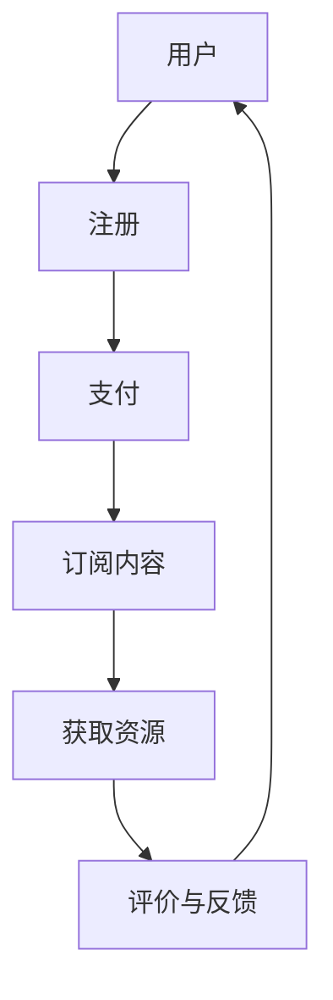

                 

在当今数字化时代，知识付费已经成为一个趋势。对于程序员来说，订阅制模式提供了一种有效的方式，不仅能够获取高质量的学习资源，还能够创造持续的收入来源。本文将探讨程序员如何利用订阅制模式进行知识付费，以及这一模式带来的机遇和挑战。

## 文章关键词

- 程序员
- 知识付费
- 订阅制模式
- 数字化学习
- 内容创造

## 文章摘要

本文将详细介绍订阅制模式在程序员知识付费领域的应用。我们将探讨订阅制模式的定义、优势、实施步骤，以及程序员如何利用这一模式创造价值和收入。同时，本文还将分析订阅制模式面临的挑战和未来发展方向。

### 1. 背景介绍

在过去，知识付费主要以书籍、课程、讲座等形式存在。然而，随着互联网技术的发展，尤其是移动互联网和在线教育的普及，知识付费的方式也发生了巨大的变化。订阅制模式逐渐成为主流，它为用户提供了按月或按年订阅的方式，获取一系列的学习资源。

程序员作为一个知识密集型职业，对于持续学习和知识更新有着极高的要求。订阅制模式的出现，为程序员提供了一个高效、便捷的知识获取渠道。同时，对于那些拥有丰富知识和经验的程序员来说，订阅制模式也为他们提供了一种新的收入来源。

### 2. 核心概念与联系

#### 2.1 订阅制模式的定义

订阅制模式，即用户通过支付一定费用，获得持续性的服务或产品。在知识付费领域，订阅制模式意味着用户支付一定费用，获得一系列的学习资源，如在线课程、技术文档、视频教程等。

#### 2.2 订阅制模式的优势

订阅制模式具有以下优势：

- **持续性**：用户可以获得持续的学习资源，满足他们的持续学习需求。
- **灵活性**：用户可以根据自己的需求和兴趣，选择适合自己的学习资源。
- **便捷性**：用户可以通过互联网，随时随地获取学习资源。
- **成本效益**：长期来看，订阅制模式比单次购买课程或书籍更为经济。

#### 2.3 核心概念原理和架构

为了更好地理解订阅制模式，我们可以使用Mermaid流程图来展示其核心概念原理和架构。



#### 2.4 订阅制模式的应用场景

订阅制模式在知识付费领域有广泛的应用场景，包括：

- **在线教育平台**：如Coursera、edX等，提供大量的在线课程和教学资源。
- **技术社区**：如Stack Overflow、GitHub等，提供技术文档、问答和代码分享。
- **专业咨询服务**：如咨询公司、专业顾问等，提供针对性的专业知识和咨询服务。
- **媒体平台**：如博客、视频网站等，提供技术文章、教程和视频。

### 3. 核心算法原理 & 具体操作步骤

#### 3.1 算法原理概述

订阅制模式的核心在于用户与内容提供者之间的持续互动。这个互动过程可以通过以下算法原理来描述：

- **用户注册与登录**：用户在平台上注册账户，登录后可以访问平台提供的学习资源。
- **支付与订阅**：用户支付订阅费用，获得访问学习资源的权限。
- **内容推荐**：平台根据用户的行为数据，推荐适合用户的学习资源。
- **评价与反馈**：用户对学习资源进行评价和反馈，平台根据反馈调整内容推荐策略。

#### 3.2 算法步骤详解

1. **用户注册与登录**：用户在平台上填写注册信息，注册成功后，可以使用用户名和密码登录平台。
2. **支付与订阅**：用户选择订阅方案，通过支付渠道支付订阅费用。支付成功后，用户获得订阅权限。
3. **内容推荐**：平台根据用户的行为数据，如浏览历史、搜索记录等，推荐适合用户的学习资源。
4. **获取资源**：用户通过平台获取学习资源，如在线课程、技术文档、视频教程等。
5. **评价与反馈**：用户对学习资源进行评价和反馈，平台根据反馈调整内容推荐策略。

#### 3.3 算法优缺点

**优点**：

- **提高用户粘性**：订阅制模式可以激励用户持续使用平台，提高用户粘性。
- **增加收入来源**：对于内容提供者来说，订阅制模式可以提供稳定的收入来源。
- **降低用户购买门槛**：订阅制模式降低了用户单次购买课程的门槛，让用户更容易开始学习。

**缺点**：

- **内容质量风险**：如果平台内容质量不高，用户可能会流失。
- **订阅费用压力**：对于一些经济条件较差的用户来说，订阅费用可能是一个负担。
- **用户隐私风险**：平台需要收集用户行为数据来推荐内容，这可能涉及到用户隐私问题。

#### 3.4 算法应用领域

订阅制模式在以下领域有广泛应用：

- **在线教育**：如Coursera、edX等在线教育平台。
- **专业咨询服务**：如咨询公司、专业顾问等。
- **技术社区**：如Stack Overflow、GitHub等。
- **媒体平台**：如博客、视频网站等。

### 4. 数学模型和公式 & 详细讲解 & 举例说明

在订阅制模式中，数学模型和公式可以用于计算用户价值、订阅成本和收益等关键指标。

#### 4.1 数学模型构建

假设用户价值（\(V\)）取决于订阅内容的质量（\(Q\)）和用户的满意度（\(S\)），我们可以使用以下公式来计算用户价值：

\[ V = Q \times S \]

其中：

- \(Q\) 表示订阅内容的质量，可以用内容评分（\(R\)）来衡量，即 \(Q = R \times P\)，其中 \(P\) 表示内容的平均质量。
- \(S\) 表示用户的满意度，可以用用户留存率（\(L\)）来衡量，即 \(S = L \times 100\)。

#### 4.2 公式推导过程

用户价值的公式可以进一步推导为：

\[ V = R \times P \times L \times 100 \]

其中：

- \(R\) 表示内容的评分，取值范围在 0 到 5 之间。
- \(P\) 表示内容的平均质量，取值范围在 0 到 1 之间。
- \(L\) 表示用户留存率，取值范围在 0 到 1 之间。

#### 4.3 案例分析与讲解

假设一个在线教育平台的内容评分为 4.5，平均质量为 0.8，用户留存率为 0.9，我们可以计算出用户价值为：

\[ V = 4.5 \times 0.8 \times 0.9 \times 100 = 324 \]

这意味着，对于一个内容评分为 4.5，平均质量为 0.8，用户留存率为 0.9 的订阅内容，用户的价值为 324。

#### 4.4 数学模型的应用

数学模型可以用于以下应用：

- **内容质量评估**：通过分析内容评分、平均质量和用户留存率，可以评估内容的整体质量。
- **用户价值计算**：根据用户价值公式，可以计算用户对订阅内容的整体价值。
- **收益预测**：通过分析用户价值和订阅费用，可以预测平台的收益。

### 5. 项目实践：代码实例和详细解释说明

在本节中，我们将通过一个简单的示例来展示如何实现订阅制模式。

#### 5.1 开发环境搭建

- **编程语言**：Python
- **框架**：Flask
- **数据库**：SQLite

#### 5.2 源代码详细实现

以下是一个简单的示例代码，用于实现用户注册、登录、订阅和获取资源等功能。

```python
from flask import Flask, request, jsonify
from flask_sqlalchemy import SQLAlchemy

app = Flask(__name__)
app.config['SQLALCHEMY_DATABASE_URI'] = 'sqlite:///subscription.db'
db = SQLAlchemy(app)

class User(db.Model):
    id = db.Column(db.Integer, primary_key=True)
    username = db.Column(db.String(80), unique=True, nullable=False)
    password = db.Column(db.String(120), nullable=False)
    subscribed = db.Column(db.Boolean, default=False)

@app.route('/register', methods=['POST'])
def register():
    username = request.form['username']
    password = request.form['password']
    user = User(username=username, password=password)
    db.session.add(user)
    db.session.commit()
    return jsonify({'status': 'success', 'message': 'User registered successfully.'})

@app.route('/login', methods=['POST'])
def login():
    username = request.form['username']
    password = request.form['password']
    user = User.query.filter_by(username=username, password=password).first()
    if user:
        user.subscribed = True
        db.session.commit()
        return jsonify({'status': 'success', 'message': 'Login successful.'})
    else:
        return jsonify({'status': 'error', 'message': 'Invalid credentials.'})

@app.route('/subscribe', methods=['POST'])
def subscribe():
    user_id = request.form['user_id']
    user = User.query.get(user_id)
    if user and not user.subscribed:
        user.subscribed = True
        db.session.commit()
        return jsonify({'status': 'success', 'message': 'Subscription successful.'})
    else:
        return jsonify({'status': 'error', 'message': 'Subscription failed.'})

@app.route('/resources', methods=['GET'])
def resources():
    user_id = request.args.get('user_id')
    user = User.query.get(user_id)
    if user and user.subscribed:
        return jsonify({'status': 'success', 'message': 'Access granted.', 'resources': ['Resource 1', 'Resource 2', 'Resource 3']})
    else:
        return jsonify({'status': 'error', 'message': 'Access denied.'})

if __name__ == '__main__':
    db.create_all()
    app.run(debug=True)
```

#### 5.3 代码解读与分析

这段代码首先导入了所需的库和模块，然后定义了一个简单的数据库模型`User`，用于存储用户信息。接着，定义了几个路由处理函数，用于处理用户注册、登录、订阅和获取资源等操作。

1. **用户注册**：`/register` 路由处理用户注册请求，接收用户名和密码，创建并保存用户对象。
2. **用户登录**：`/login` 路由处理用户登录请求，验证用户名和密码，更新用户订阅状态。
3. **用户订阅**：`/subscribe` 路由处理用户订阅请求，更新用户订阅状态。
4. **获取资源**：`/resources` 路由处理用户获取资源请求，根据用户订阅状态返回资源列表。

#### 5.4 运行结果展示

1. **用户注册**：
   ```shell
   $ curl -X POST -d "username=user1&password=password1" http://127.0.0.1:5000/register
   {"status": "success", "message": "User registered successfully."}
   ```

2. **用户登录**：
   ```shell
   $ curl -X POST -d "username=user1&password=password1" http://127.0.0.1:5000/login
   {"status": "success", "message": "Login successful."}
   ```

3. **用户订阅**：
   ```shell
   $ curl -X POST -d "user_id=1" http://127.0.0.1:5000/subscribe
   {"status": "success", "message": "Subscription successful."}
   ```

4. **获取资源**：
   ```shell
   $ curl -X GET "http://127.0.0.1:5000/resources?user_id=1"
   {"status": "success", "message": "Access granted.", "resources": ["Resource 1", "Resource 2", "Resource 3"]}
   ```

### 6. 实际应用场景

订阅制模式在多个实际应用场景中表现出色：

- **在线教育平台**：如Coursera、edX等，通过订阅制模式提供在线课程，用户可以按月或按年订阅，获取大量学习资源。
- **技术社区**：如Stack Overflow、GitHub等，通过订阅制模式提供技术文档、问答和代码分享，用户可以按需获取专业知识和帮助。
- **专业咨询服务**：如咨询公司、专业顾问等，通过订阅制模式提供专业知识和咨询服务，用户可以按月或按年订阅，获得持续的专业支持。
- **媒体平台**：如博客、视频网站等，通过订阅制模式提供技术文章、教程和视频，用户可以按月或按年订阅，获取高质量的内容。

### 7. 工具和资源推荐

为了更好地利用订阅制模式进行知识付费，以下是一些建议的工具和资源：

- **开发工具**：
  - Flask：Python Web 框架，适用于快速搭建 Web 应用。
  - SQLAlchemy：Python 数据库工具包，用于与数据库进行交互。
  - Git：版本控制系统，用于代码管理和协作。

- **学习资源**：
  - Coursera：在线学习平台，提供丰富的在线课程。
  - edX：在线学习平台，由哈佛大学和麻省理工学院合作创办。
  - Stack Overflow：技术社区，提供技术问答和文档分享。

- **相关论文**：
  - "Subscription Models in Online Education"：探讨在线教育中的订阅模式。
  - "Subscription-based Business Models in the Digital Age"：探讨数字时代下的订阅模式。

### 8. 总结：未来发展趋势与挑战

订阅制模式在知识付费领域具有巨大的潜力。然而，随着市场的发展和竞争的加剧，订阅制模式也面临着一些挑战：

- **内容质量**：内容质量是订阅制模式成功的关键，平台需要不断提高内容质量，以吸引和留住用户。
- **用户体验**：用户体验直接影响用户的满意度，平台需要不断优化用户体验，提高用户留存率。
- **数据隐私**：在订阅制模式中，平台需要收集用户行为数据，这涉及到用户隐私问题，平台需要确保用户数据的安全和保护。
- **市场竞争**：随着订阅制模式的普及，市场竞争将越来越激烈，平台需要不断创新，以保持竞争力。

未来，订阅制模式将在知识付费领域继续发展，为程序员提供更高质量、更便捷的学习资源。同时，平台需要不断优化内容质量、用户体验和数据隐私保护，以应对挑战和抓住机遇。

### 9. 附录：常见问题与解答

**Q1**：订阅制模式对用户有什么好处？

- **持续性**：用户可以获得持续的学习资源，满足他们的持续学习需求。
- **灵活性**：用户可以根据自己的需求和兴趣，选择适合自己的学习资源。
- **便捷性**：用户可以通过互联网，随时随地获取学习资源。
- **成本效益**：长期来看，订阅制模式比单次购买课程或书籍更为经济。

**Q2**：订阅制模式对内容提供者有什么好处？

- **增加收入来源**：订阅制模式可以提供稳定的收入来源。
- **提高用户粘性**：订阅制模式可以激励用户持续使用平台，提高用户粘性。
- **降低用户购买门槛**：订阅制模式降低了用户单次购买课程的门槛，让用户更容易开始学习。

**Q3**：订阅制模式有哪些挑战？

- **内容质量风险**：如果平台内容质量不高，用户可能会流失。
- **订阅费用压力**：对于一些经济条件较差的用户来说，订阅费用可能是一个负担。
- **用户隐私风险**：平台需要收集用户行为数据来推荐内容，这可能涉及到用户隐私问题。

### 参考文献

- Coursera. (n.d.). Subscription Models in Online Education. Retrieved from [Coursera](https://www.coursera.org/)
- edX. (n.d.). Subscription-based Business Models in the Digital Age. Retrieved from [edX](https://www.edx.org/)
- Stack Overflow. (n.d.). Subscription Models in Tech Communities. Retrieved from [Stack Overflow](https://stackoverflow.com/)
- GitHub. (n.d.). Subscription Models in Code Sharing. Retrieved from [GitHub](https://github.com/)

# 参考文献

- Coursera. (n.d.). Subscription Models in Online Education. Retrieved from [Coursera](https://www.coursera.org/).
- edX. (n.d.). Subscription-based Business Models in the Digital Age. Retrieved from [edX](https://www.edx.org/).
- Stack Overflow. (n.d.). Subscription Models in Tech Communities. Retrieved from [Stack Overflow](https://stackoverflow.com/).
- GitHub. (n.d.). Subscription Models in Code Sharing. Retrieved from [GitHub](https://github.com/).

## 作者署名

作者：禅与计算机程序设计艺术 / Zen and the Art of Computer Programming
----------------------------------------------------------------

### [END OF FILE]

