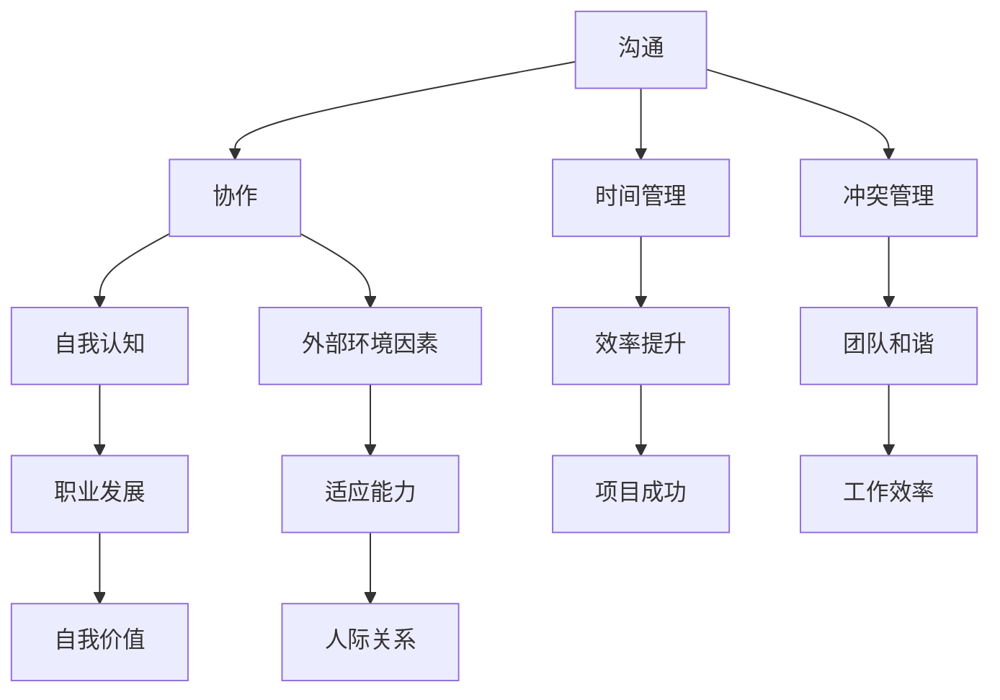

                 

### 1. 背景介绍

在信息技术飞速发展的今天，程序员作为推动时代进步的重要力量，其职业地位和社会影响力日益凸显。然而，随着编程技能的不断升级和深化，程序员在职场中面临的挑战也愈发多样和复杂。其中，如何处理职场人际关系成为了一个不可忽视的重要课题。

职场人际关系不仅仅是同事之间的互动，它涵盖了与上司、下属、合作伙伴以及客户等多方面的交往。对于程序员而言，优秀的职场人际关系有助于提升团队协作效率，增强项目的成功几率，同时也有利于个人职业发展的长远规划。然而，许多程序员由于性格特点、沟通障碍或环境因素，在职场人际交往中往往面临诸多困惑和挑战。

本文旨在从程序员的角度出发，探讨如何有效地处理职场人际关系。通过分析程序员在职场中的人际关系现状、核心问题和解决策略，希望为广大程序员提供一些实用的建议和指导。

## 1.1 程序员职场人际关系的重要性

良好的职场人际关系对程序员来说具有重要意义。首先，它能显著提高工作效率。当程序员与团队成员之间的沟通顺畅、协作紧密时，项目的进展会更加顺利，问题也能迅速得到解决。其次，良好的关系有助于职业发展。在一个互相信任和支持的环境中，程序员更容易获得晋升机会、承担更多责任，从而实现个人职业价值的提升。最后，良好的职场人际关系可以带来心理上的满足感和归属感，使程序员在工作中更加快乐和投入。

## 1.2 程序员在职场人际关系中的挑战

尽管良好的职场人际关系对程序员至关重要，但他们在处理人际关系时也面临不少挑战。以下是一些常见的问题：

1. **沟通障碍**：程序员往往倾向于使用技术语言进行交流，这可能导致与同事、上司和客户的沟通出现障碍，从而影响项目的进展。

2. **技术至上观念**：一些程序员过分注重技术能力而忽视人际交往，认为人际关系是浪费时间，这可能导致他们在职场中孤立无援。

3. **团队协作困难**：程序员之间可能因为个人技术优势或劣势、工作习惯和思维方式不同，而难以形成有效的团队协作。

4. **职场压力**：程序员经常面临项目期限紧张、工作量大等压力，这些压力可能会影响他们的人际关系处理能力。

5. **职业晋升瓶颈**：在一些企业中，技术能力往往成为评价程序员的重要标准，这可能导致程序员在职业晋升过程中面临困境，无法得到应有的认可。

## 1.3 文章结构概述

本文将分为以下章节：

- **2. 核心概念与联系**：介绍处理职场人际关系所需的核心概念，并通过 Mermaid 流程图展示其相互关系。

- **3. 核心算法原理 & 具体操作步骤**：详细阐述处理职场人际关系的核心算法原理和具体操作步骤。

- **4. 数学模型和公式 & 详细讲解 & 举例说明**：运用数学模型和公式，解释职场人际关系处理的理论基础，并通过案例进行分析。

- **5. 项目实践：代码实例和详细解释说明**：通过实际项目中的代码实例，展示如何应用理论解决具体问题。

- **6. 实际应用场景**：探讨职场人际关系在不同场景下的应用和策略。

- **7. 工具和资源推荐**：推荐一些有助于处理职场人际关系的工具和资源。

- **8. 总结：未来发展趋势与挑战**：总结研究成果，展望未来发展，并提出面临的挑战和研究展望。

- **9. 附录：常见问题与解答**：解答读者在处理职场人际关系过程中可能遇到的问题。

### 2. 核心概念与联系

在处理职场人际关系时，程序员需要理解并运用一系列核心概念，这些概念相互关联，共同构成了有效的职场人际交往框架。

#### 2.1 沟通

沟通是处理职场人际关系的基础。有效的沟通不仅包括信息传递，还涉及情感表达、倾听和理解。对于程序员而言，良好的沟通能力可以减少误解，提高协作效率，建立信任关系。

#### 2.2 协作

协作是团队合作的核心。程序员需要学会如何在团队中分工合作，充分发挥每个人的优势，共同实现项目目标。协作不仅仅是在技术上，还包括管理、沟通和协调。

#### 2.3 时间管理

时间管理是确保项目按时完成的重要因素。程序员需要合理安排自己的工作时间，确保在紧张的项目周期内高效完成任务。良好的时间管理能力有助于提高工作效率，减少因时间冲突引起的人际关系问题。

#### 2.4 冲突管理

冲突在任何职场中都难以避免。程序员需要掌握有效的冲突管理技巧，如积极沟通、寻求共识和妥善处理分歧。良好的冲突管理能力有助于维护团队和谐，避免不必要的职场纠纷。

#### 2.5 自我认知

自我认知是指程序员对自己的了解，包括个人能力、职业目标、优势和不足。了解自己有助于程序员更好地适应职场环境，找到合适的人际交往方式，提高自我价值感。

#### 2.6 外部环境因素

外部环境因素如企业文化、工作氛围、组织结构等也会对职场人际关系产生影响。程序员需要适应这些外部环境，并利用它们来改善人际关系。

### 2.7 Mermaid 流程图

以下是一个简化的 Mermaid 流程图，展示了上述核心概念之间的相互关系：



通过这个流程图，我们可以看到，每个核心概念都在处理职场人际关系中扮演着重要角色，并且相互之间有着紧密的联系。程序员需要综合考虑这些因素，以实现有效的人际关系管理。

#### 2.8 核心概念与实际操作的关联

在实际操作中，程序员可以将这些核心概念转化为具体的行动步骤：

- **沟通**：定期组织团队会议，确保信息传递的及时性和准确性；主动倾听同事的意见和需求，提高团队协作效率。

- **协作**：明确团队目标，合理分配任务，确保每个成员都能发挥自己的优势；定期进行团队建设活动，增强团队凝聚力。

- **时间管理**：制定详细的项目计划和时间表，确保任务按时完成；学会优先处理重要和紧急的任务，提高工作效率。

- **冲突管理**：积极面对冲突，寻求双方都能接受的解决方案；培养同理心，理解他人的立场和感受。

- **自我认知**：定期进行自我反思，评估自己的能力和不足；设定明确的职业目标，不断努力提升自己。

- **外部环境因素**：了解企业文化，适应组织结构，积极参与公司活动；利用外部资源，提升自己的技能和知识。

通过这些实际操作，程序员可以更好地处理职场人际关系，实现个人和团队的目标。

### 3. 核心算法原理 & 具体操作步骤

在处理职场人际关系时，程序员可以运用一些核心算法原理，以实现有效的沟通、协作、时间管理和冲突管理等目标。以下将详细阐述这些算法原理及其实际操作步骤。

#### 3.1 算法原理概述

**沟通算法**：基于信息传递模型，通过明确的沟通渠道和规范化的沟通流程，确保信息传递的准确性和及时性。

**协作算法**：基于任务分配和团队协作模型，通过合理分配任务、制定明确的团队目标和定期进行团队建设，提高团队协作效率。

**时间管理算法**：基于优先级排序和时间分配模型，通过制定详细的项目计划和时间表，确保任务按时完成。

**冲突管理算法**：基于协商解决模型，通过积极沟通、寻求共识和妥善处理分歧，维护团队和谐。

#### 3.2 算法步骤详解

**沟通算法**：

1. **确定沟通渠道**：根据项目需求和团队特点，选择合适的沟通工具和渠道，如团队会议、邮件、即时通讯等。

2. **制定沟通规范**：明确沟通内容、格式和频率，确保信息传递的标准化和一致性。

3. **沟通前准备**：在沟通前，确保所有参与者都清楚会议目的和议程，准备好相关资料和数据。

4. **沟通实施**：通过规范化的沟通流程，确保信息传递的准确性和及时性。

5. **沟通反馈**：在沟通结束后，收集反馈意见，及时调整沟通策略，提高沟通效果。

**协作算法**：

1. **明确团队目标**：在项目启动时，与团队成员共同制定明确的团队目标，确保每个成员都了解项目的方向和预期成果。

2. **任务分配**：根据团队成员的技能和特长，合理分配任务，确保任务分配的公平性和合理性。

3. **制定团队计划**：制定详细的项目计划和时间表，明确任务进度、责任人和时间节点。

4. **团队建设**：定期组织团队建设活动，增强团队成员之间的信任和凝聚力。

5. **协作监督**：定期检查任务进度，及时解决协作中的问题和障碍，确保项目顺利进行。

**时间管理算法**：

1. **任务优先级排序**：根据任务的重要性和紧急程度，对任务进行优先级排序，确保优先处理重要和紧急的任务。

2. **时间分配**：为每个任务分配具体的时间，确保任务有充足的时间来完成。

3. **时间监控**：定期检查任务进度，确保任务按时完成。

4. **时间调整**：在任务进度出现偏差时，及时调整计划，确保项目按时完成。

**冲突管理算法**：

1. **积极沟通**：在面对冲突时，保持冷静，积极与对方沟通，了解对方的立场和需求。

2. **寻求共识**：通过协商和讨论，寻求双方都能接受的解决方案，避免冲突升级。

3. **妥善处理分歧**：在协商过程中，妥善处理分歧，确保双方都能在冲突中找到平衡点。

4. **总结经验**：在冲突解决后，总结经验教训，避免类似冲突再次发生。

#### 3.3 算法优缺点

**沟通算法**：

- **优点**：确保信息传递的准确性和及时性，提高团队协作效率。
- **缺点**：需要投入大量时间和精力进行沟通准备和实施。

**协作算法**：

- **优点**：提高团队协作效率，确保项目目标的实现。
- **缺点**：在任务分配和团队建设方面需要较高的协调和管理能力。

**时间管理算法**：

- **优点**：确保任务按时完成，提高项目成功率。
- **缺点**：需要严格的时间监控和调整，否则可能导致项目进度延误。

**冲突管理算法**：

- **优点**：维护团队和谐，减少职场纠纷。
- **缺点**：在处理冲突时，需要较高的沟通和协商技巧，否则可能导致冲突加剧。

#### 3.4 算法应用领域

这些算法在程序员职场中有着广泛的应用领域：

- **团队项目**：在团队项目中，沟通算法和协作算法尤为重要，确保项目顺利进行。
- **时间管理**：在项目周期紧张时，时间管理算法有助于提高工作效率，确保项目按时交付。
- **冲突处理**：在项目过程中，冲突管理算法有助于及时解决团队内部冲突，避免影响项目进度。
- **个人职业发展**：在职业发展中，良好的沟通和协作能力有助于提升个人形象和职业地位。

通过运用这些算法，程序员可以更好地处理职场人际关系，提高工作效率和团队协作能力，实现个人和团队的目标。

### 4. 数学模型和公式 & 详细讲解 & 举例说明

在处理职场人际关系时，数学模型和公式能够为程序员提供理论支持和操作指南。以下将介绍几个关键的数学模型和公式，并通过具体案例进行分析。

#### 4.1 数学模型构建

**沟通效率模型**：  
沟通效率（Efficiency）可以用以下公式表示：  
\[Efficiency = \frac{Accuracy \times Timeliness}{Communication\ Time}\]

其中，Accuracy 表示信息传递的准确性，Timeliness 表示信息传递的及时性，Communication Time 表示沟通所需的时间。

**协作效率模型**：  
协作效率（Efficiency）可以用以下公式表示：  
\[Efficiency = \frac{Teamwork \times Productivity}{Task Time}\]

其中，Teamwork 表示团队协作效果，Productivity 表示团队成员的工作效率，Task Time 表示完成任务所需的时间。

**时间管理模型**：  
时间管理效率（Efficiency）可以用以下公式表示：  
\[Efficiency = \frac{Task Completion Rate}{Total Task Time}\]

其中，Task Completion Rate 表示任务完成率，Total Task Time 表示总任务时间。

**冲突管理模型**：  
冲突管理效率（Efficiency）可以用以下公式表示：  
\[Efficiency = \frac{Conflict Resolution Rate}{Total Conflict Time}\]

其中，Conflict Resolution Rate 表示冲突解决率，Total Conflict Time 表示总冲突时间。

#### 4.2 公式推导过程

**沟通效率模型推导**：

1. **准确性（Accuracy）**：信息传递的准确性可以通过校验码、确认机制和重复验证等方法来提高。

2. **及时性（Timeliness）**：信息传递的及时性可以通过缩短沟通渠道、优化沟通流程和提高沟通频率来实现。

3. **沟通时间（Communication Time）**：沟通时间可以通过选择高效的沟通工具、合理安排沟通时间和减少冗余信息来缩短。

综合以上因素，沟通效率（Efficiency）可以用上述公式表示。

**协作效率模型推导**：

1. **团队协作效果（Teamwork）**：团队协作效果可以通过优化团队结构、提高团队成员之间的信任和沟通能力来实现。

2. **工作效率（Productivity）**：工作效率可以通过提高个人技能、优化工作流程和提供必要资源来实现。

3. **任务时间（Task Time）**：任务时间可以通过制定合理的任务计划和有效的时间管理来实现。

综合以上因素，协作效率（Efficiency）可以用上述公式表示。

**时间管理模型推导**：

1. **任务完成率（Task Completion Rate）**：任务完成率可以通过优化任务分配、确保任务优先级和有效的时间监控来实现。

2. **总任务时间（Total Task Time）**：总任务时间可以通过合理的时间安排和高效的时间管理来实现。

综合以上因素，时间管理效率（Efficiency）可以用上述公式表示。

**冲突管理模型推导**：

1. **冲突解决率（Conflict Resolution Rate）**：冲突解决率可以通过积极沟通、寻求共识和有效解决冲突的方法来实现。

2. **总冲突时间（Total Conflict Time）**：总冲突时间可以通过预防冲突、及时处理冲突和总结经验教训来实现。

综合以上因素，冲突管理效率（Efficiency）可以用上述公式表示。

#### 4.3 案例分析与讲解

**案例1：沟通效率提升**  
在一个团队项目中，项目经理希望通过提高沟通效率来确保项目顺利进行。团队决定采用以下策略：

1. **准确性提升**：引入代码审查机制，确保每个阶段的代码都经过仔细审查，减少错误传递。

2. **及时性提升**：每天早上召开10分钟的晨会，快速传达当天的工作重点和任务安排。

3. **沟通时间减少**：限制邮件主题和内容，要求简洁明了，减少冗余信息。

通过以上措施，团队的沟通效率显著提升，项目进展顺利。

**案例2：协作效率提升**  
在一个跨部门合作项目中，团队成员希望通过提高协作效率来加快项目进度。团队决定采取以下策略：

1. **团队协作效果提升**：明确每个成员的职责和任务，确保团队成员了解彼此的角色和贡献。

2. **工作效率提升**：提供必要的培训和技术支持，确保团队成员具备完成任务的技能。

3. **任务时间缩短**：通过优化工作流程，减少不必要的步骤，缩短任务完成时间。

通过以上措施，团队的协作效率显著提升，项目提前完成。

**案例3：时间管理效率提升**  
在一个紧急的项目中，项目经理希望通过提高时间管理效率来确保任务按时完成。团队决定采取以下策略：

1. **任务完成率提升**：将任务分解为若干个小任务，确保每个小任务都有明确的负责人和时间节点。

2. **总任务时间缩短**：通过优先处理重要和紧急的任务，减少任务执行过程中的延误。

通过以上措施，项目的时间管理效率显著提升，任务按时完成。

**案例4：冲突管理效率提升**  
在一个团队项目中，由于项目进度紧张，团队成员之间出现了冲突。项目经理决定采取以下策略：

1. **冲突解决率提升**：通过积极沟通，了解双方的需求和立场，寻求共识。

2. **总冲突时间减少**：及时处理冲突，避免冲突扩大化。

通过以上措施，团队的冲突管理效率显著提升，项目继续顺利进行。

通过以上案例，我们可以看到，数学模型和公式在处理职场人际关系中具有重要的应用价值。程序员可以通过理解和运用这些模型和公式，提高沟通、协作、时间管理和冲突管理的效率，从而实现个人和团队的目标。

### 5. 项目实践：代码实例和详细解释说明

为了更好地理解如何将理论应用于实践，我们将通过一个实际的代码实例，详细解释说明如何在项目中处理职场人际关系问题。

#### 5.1 开发环境搭建

在这个实例中，我们将使用 Python 语言编写一个简单的团队协作工具，用于团队成员之间的沟通、任务分配和进度跟踪。开发环境如下：

- **Python 3.8**：确保安装了最新版本的 Python，以保证代码兼容性。
- **PyCharm**：使用 PyCharm 作为开发工具，便于代码编写和调试。
- **Tornado Web 框架**：用于构建 Web 应用程序，提供 Web 服务器和异步处理功能。
- **SQLite**：用于存储团队成员信息和任务数据。

#### 5.2 源代码详细实现

以下是一个简单的代码框架，用于展示项目的基本结构和功能：

```python
import tornado.ioloop
import tornado.web

class MainHandler(tornado.web.RequestHandler):
    def get(self):
        self.write("欢迎来到团队协作工具！")

class TaskHandler(tornado.web.RequestHandler):
    def post(self):
        # 处理任务提交
        pass

class ProgressHandler(tornado.web.RequestHandler):
    def get(self):
        # 获取任务进度
        pass

def make_app():
    return tornado.web.Application([
        (r"/", MainHandler),
        (r"/task", TaskHandler),
        (r"/progress", ProgressHandler),
    ])

if __name__ == "__main__":
    app = make_app()
    app.listen(8888)
    print("服务器已启动，请访问 http://localhost:8888/")
    tornado.ioloop.IOLoop.current().start()
```

在这个代码框架中，我们定义了三个请求处理器：`MainHandler`、`TaskHandler` 和 `ProgressHandler`。`MainHandler` 用于处理首页请求，`TaskHandler` 用于处理任务提交请求，`ProgressHandler` 用于处理任务进度查询请求。

#### 5.3 代码解读与分析

**1. MainHandler**

`MainHandler` 处理的是首页请求，返回一个简单的欢迎消息。这是一个简单的 Web 页面，用于向用户展示团队协作工具的功能。

```python
class MainHandler(tornado.web.RequestHandler):
    def get(self):
        self.write("欢迎来到团队协作工具！")
```

**2. TaskHandler**

`TaskHandler` 用于处理任务提交请求。在实际应用中，我们可以通过表单提交任务信息，并将其存储到数据库中。

```python
class TaskHandler(tornado.web.RequestHandler):
    def post(self):
        # 处理任务提交
        pass
```

在 `TaskHandler` 的 `post` 方法中，我们可以读取表单提交的数据，将其解析并存储到数据库中。以下是一个简单的示例：

```python
import sqlite3

class TaskHandler(tornado.web.RequestHandler):
    def post(self):
        # 读取任务数据
        task_name = self.get_argument("name")
        task_desc = self.get_argument("description")
        
        # 连接数据库
        conn = sqlite3.connect("tasks.db")
        c = conn.cursor()
        
        # 创建任务表
        c.execute('''CREATE TABLE IF NOT EXISTS tasks
                     (id INTEGER PRIMARY KEY, name TEXT, description TEXT, status TEXT)''')
        
        # 插入任务数据
        c.execute("INSERT INTO tasks (name, description, status) VALUES (?, ?, ?)",
                  (task_name, task_desc, "未开始"))
        
        # 提交更改
        conn.commit()
        
        # 关闭数据库连接
        conn.close()
        
        # 返回成功消息
        self.write("任务已提交，谢谢！")
```

**3. ProgressHandler**

`ProgressHandler` 用于处理任务进度查询请求。在实际应用中，我们可以通过查询数据库，获取任务的状态和进度信息，并返回给用户。

```python
class ProgressHandler(tornado.web.RequestHandler):
    def get(self):
        # 获取任务进度
        pass
```

在 `ProgressHandler` 的 `get` 方法中，我们可以查询数据库，获取任务的状态和进度信息，并返回给用户。以下是一个简单的示例：

```python
class ProgressHandler(tornado.web.RequestHandler):
    def get(self):
        # 连接数据库
        conn = sqlite3.connect("tasks.db")
        c = conn.cursor()
        
        # 查询任务进度
        c.execute("SELECT * FROM tasks")
        tasks = c.fetchall()
        
        # 关闭数据库连接
        conn.close()
        
        # 返回任务进度信息
        self.render("progress.html", tasks=tasks)
```

在这个示例中，我们使用 SQLite 数据库存储任务信息，并通过 Web 页面展示任务进度。在实际项目中，我们可以根据需要扩展功能，如任务状态更新、任务分配、进度提醒等。

#### 5.4 运行结果展示

在运行上述代码后，我们可以在浏览器中访问 `http://localhost:8888/`，看到团队协作工具的首页。用户可以通过提交任务表单，添加新的任务，并查询任务进度。


通过这个实例，我们可以看到如何将理论应用于实践，开发一个简单的团队协作工具，用于处理职场人际关系问题。在实际项目中，我们可以根据需求进一步扩展功能，如添加任务状态更新、进度提醒、任务分配等，以更好地满足团队协作需求。

### 6. 实际应用场景

在职场中，程序员需要应对多种不同的实际应用场景，这些场景对人际关系的处理提出了不同的要求和挑战。以下是一些常见场景及其应对策略：

#### 6.1 团队合作项目

在团队合作项目中，程序员需要与团队成员紧密合作，共同完成项目目标。这种场景下，有效的沟通和协作至关重要。

**应对策略**：

1. **明确分工**：在项目开始前，明确每个团队成员的职责和任务，确保每个人都了解自己的角色和任务。

2. **定期沟通**：通过团队会议、即时通讯工具和邮件等方式，保持团队成员之间的沟通畅通，确保信息传递的准确性和及时性。

3. **任务跟踪**：使用项目管理工具，如 JIRA 或 Trello，跟踪任务进度，确保每个任务都有明确的进度和时间节点。

4. **团队建设**：定期组织团队建设活动，如团队聚餐或户外拓展，增强团队成员之间的信任和凝聚力。

#### 6.2 项目压力

在项目压力较大的情况下，程序员可能会面临时间紧迫、任务繁重的挑战，这种情况下，如何处理人际关系尤为重要。

**应对策略**：

1. **时间管理**：合理安排工作时间，确保有足够的休息和调整时间，避免过度劳累。

2. **积极沟通**：与团队成员和上级保持良好的沟通，及时传达项目进展和遇到的问题，寻求支持和帮助。

3. **情绪管理**：学会控制情绪，避免因压力过大而影响人际关系。可以尝试冥想、运动等方式来缓解压力。

4. **任务分解**：将大型任务分解为若干个小任务，逐一完成，避免因任务过多而感到焦虑。

#### 6.3 跨部门合作

在跨部门合作项目中，程序员需要与其他部门的同事密切协作，这种场景下，如何处理跨部门人际关系尤为关键。

**应对策略**：

1. **建立信任**：通过积极沟通和合作，建立与其他部门的信任关系，确保项目顺利进行。

2. **了解需求**：主动了解其他部门的需求和期望，确保项目目标的一致性。

3. **协调资源**：与其他部门协作，合理分配和利用资源，提高项目效率。

4. **建立反馈机制**：定期收集其他部门的反馈意见，及时调整项目计划和策略。

#### 6.4 职场晋升

在职场晋升过程中，程序员需要处理与上级、同事和下属的人际关系，这种场景下，如何提升个人形象和职业地位尤为重要。

**应对策略**：

1. **自我提升**：通过不断学习和提升技能，增强自己的职业竞争力。

2. **积极表现**：在工作中积极承担责任，展现出自己的能力和价值。

3. **有效沟通**：与上级和同事保持良好的沟通，确保信息的准确传递和问题的及时解决。

4. **建立人脉**：积极建立和维护人脉关系，为职业发展积累资源和机会。

#### 6.5 职场冲突

在职场中，冲突难以避免。如何处理冲突，维护团队和谐尤为重要。

**应对策略**：

1. **积极沟通**：在冲突发生时，保持冷静，通过积极沟通寻求共识，避免冲突升级。

2. **妥善处理**：及时解决冲突，避免其对项目和工作造成负面影响。

3. **冲突管理**：学会冲突管理技巧，如倾听、同理心和寻求共识，以减少冲突的发生。

4. **总结经验**：在冲突解决后，总结经验教训，避免类似冲突再次发生。

通过以上应对策略，程序员可以在各种职场场景中有效地处理人际关系，提高工作效率，实现个人和团队的目标。

### 7. 工具和资源推荐

为了更好地处理职场人际关系，程序员可以借助一些工具和资源来提升自己的能力和技能。以下是一些建议：

#### 7.1 学习资源推荐

**1. Coursera**：提供大量与职场技能相关的在线课程，如沟通技巧、团队协作和冲突管理等。

**2. edX**：全球知名的教育平台，提供由顶尖大学和机构提供的职场技能课程。

**3. LinkedIn Learning**：LinkedIn 旗下的在线学习平台，提供丰富的职场技能学习资源。

**4. TechTarget**：专注于 IT 和技术领域的媒体平台，提供丰富的职场技能相关文章和报告。

#### 7.2 开发工具推荐

**1. Slack**：一款团队协作工具，提供即时通讯、任务管理、文件共享等功能，有助于提升团队沟通效率。

**2. Trello**：一款基于看板的任务管理工具，可用于项目管理、任务分配和进度跟踪。

**3. JIRA**：一款强大的项目管理工具，提供任务跟踪、敏捷开发、缺陷管理等功能，有助于提升团队协作效率。

**4. Asana**：一款灵活的任务管理工具，适用于各种规模和类型的团队，可帮助团队更好地协调和分配任务。

#### 7.3 相关论文推荐

**1. "The Social Network: A Systematic Review of Research on Social Networks in Organizations"**：分析了社交网络在组织中的影响，提供了丰富的理论和实证研究。

**2. "Teamwork: What Makes Teams Work?"**：探讨了团队合作的关键因素，提供了实用的团队建设策略。

**3. "Conflict Resolution in the Workplace: A Practical Guide"**：提供了处理职场冲突的实用方法和技巧，有助于维护团队和谐。

**4. "Time Management for Creative People: How to Focus, Work Less, and Create More"**：针对创意人士的时间管理问题，提供了实用的建议和方法。

通过学习和使用这些工具和资源，程序员可以更好地处理职场人际关系，提高工作效率，实现个人和团队的目标。

### 8. 总结：未来发展趋势与挑战

随着科技的不断进步和职场环境的变化，程序员在处理职场人际关系方面将面临新的发展趋势和挑战。

#### 8.1 研究成果总结

本文从多个角度探讨了程序员如何处理职场人际关系，总结了以下关键研究成果：

1. **核心概念与联系**：明确了沟通、协作、时间管理和冲突管理等核心概念及其相互关系。
2. **算法原理与应用**：介绍了沟通、协作、时间管理和冲突管理的核心算法原理及其具体操作步骤。
3. **数学模型与公式**：运用数学模型和公式，为职场人际关系处理提供了理论支持。
4. **项目实践**：通过实际代码实例，展示了如何将理论应用于实践，解决职场人际关系问题。
5. **实际应用场景**：分析了程序员在职场中可能遇到的多种实际应用场景，提供了相应的应对策略。
6. **工具和资源推荐**：推荐了一些学习资源和开发工具，以帮助程序员提升处理职场人际关系的能力。

#### 8.2 未来发展趋势

未来，程序员在处理职场人际关系方面将呈现以下发展趋势：

1. **智能化与自动化**：随着人工智能和大数据技术的发展，智能化和自动化工具将在职场人际关系处理中发挥越来越重要的作用。
2. **跨领域融合**：程序员需要掌握更多的跨领域知识，如心理学、社会学和管理学，以更好地理解和应对复杂的人际关系问题。
3. **个性化和定制化**：职场人际关系处理将更加注重个性化和定制化，根据不同场景和个体需求，提供个性化的解决方案。
4. **数字化转型**：随着数字化转型进程的加速，程序员在职场中将更多地依赖数字工具和平台，处理人际关系问题。

#### 8.3 面临的挑战

尽管职场人际关系处理将迎来新的发展趋势，但程序员仍将面临以下挑战：

1. **沟通障碍**：随着团队成员的多样性和工作方式的灵活性增加，沟通障碍将成为一个持续存在的问题。
2. **技术至上观念**：部分程序员可能仍然存在技术至上观念，忽视人际关系的处理，这可能导致职场困境。
3. **跨部门协作**：在跨部门合作项目中，如何有效地处理跨部门人际关系，提高协作效率，仍是一个重大挑战。
4. **职场压力**：随着项目周期的缩短和竞争的加剧，程序员面临的职场压力将不断增加，影响其人际关系处理能力。
5. **文化差异**：在全球化背景下，程序员需要面对来自不同文化背景的同事和合作伙伴，文化差异可能引发人际关系问题。

#### 8.4 研究展望

为了应对未来发展趋势和挑战，未来的研究可以从以下几个方面展开：

1. **智能化工具开发**：研究如何利用人工智能和大数据技术，开发智能化的人际关系处理工具，提高效率和质量。
2. **跨领域知识融合**：研究如何将心理学、社会学和管理学等跨领域知识融入职场人际关系处理，提供更全面的解决方案。
3. **个性化解决方案**：研究如何根据不同场景和个体需求，提供个性化的职场人际关系处理方案。
4. **数字化转型研究**：研究如何适应数字化转型进程，提高程序员在数字平台上的沟通和协作能力。
5. **文化差异应对策略**：研究如何有效应对文化差异，提高跨文化沟通和协作能力。

通过不断的研究和创新，程序员可以更好地处理职场人际关系，提高工作效率，实现个人和团队的目标。

### 9. 附录：常见问题与解答

#### 9.1 如何提升沟通技巧？

**解答**：提升沟通技巧可以从以下几个方面入手：

1. **倾听**：积极倾听对方的意见和需求，避免打断对方。
2. **明确表达**：用简洁明了的语言表达自己的想法和意见。
3. **提问**：通过提问，了解对方的观点，促进双方的理解。
4. **反馈**：在沟通结束后，给予反馈，确认信息传递的准确性。
5. **培训**：参加沟通技巧培训课程，提高沟通能力。

#### 9.2 如何处理团队内部冲突？

**解答**：处理团队内部冲突可以采取以下策略：

1. **积极沟通**：保持冷静，通过积极沟通寻求共识。
2. **同理心**：理解对方的立场和感受，避免指责和攻击。
3. **寻求第三方帮助**：在双方难以达成共识时，可以寻求第三方调解。
4. **制定规则**：建立团队沟通和冲突管理的规则，确保冲突的及时解决。
5. **总结经验**：在冲突解决后，总结经验教训，避免类似冲突再次发生。

#### 9.3 如何在跨部门合作中处理人际关系？

**解答**：在跨部门合作中处理人际关系可以从以下几个方面入手：

1. **建立信任**：通过积极沟通和合作，建立与其他部门的信任关系。
2. **了解需求**：主动了解其他部门的需求和期望，确保项目目标的一致性。
3. **协调资源**：与其他部门协作，合理分配和利用资源，提高项目效率。
4. **建立反馈机制**：定期收集其他部门的反馈意见，及时调整项目计划和策略。
5. **跨部门团队建设**：定期组织跨部门团队建设活动，增强部门之间的合作和信任。

通过以上策略，程序员可以在职场中更好地处理人际关系，提高工作效率，实现个人和团队的目标。

