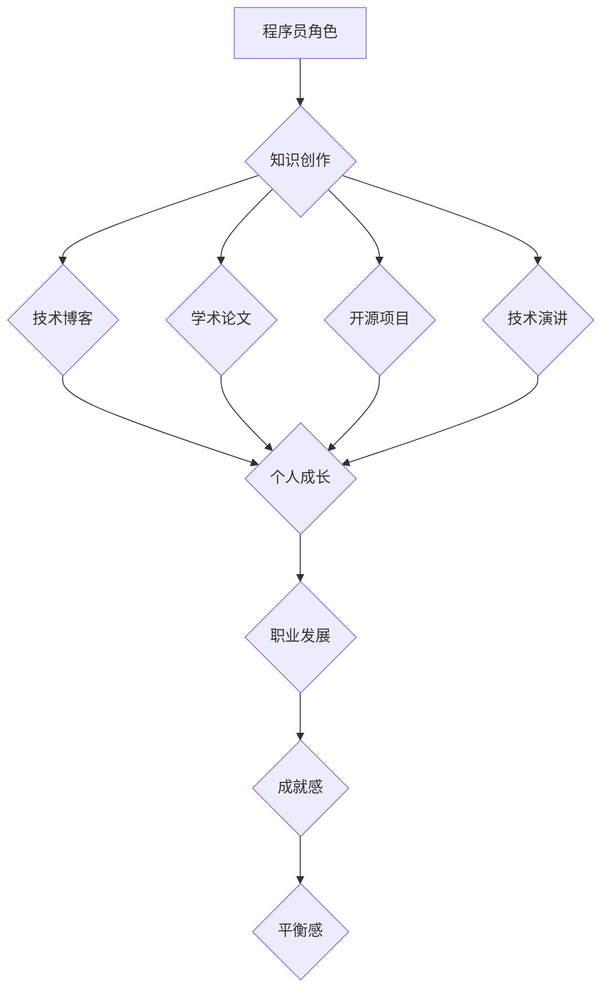

                 

 关键词：程序员，知识创作，全职工作，平衡，职业发展，技术分享，时间管理，技术博客。

> 摘要：本文旨在探讨程序员如何在全职工作中保持高效，同时有效地进行知识创作。通过分享一些实用的策略和实践方法，帮助程序员们更好地平衡工作与个人成长，实现个人与职业的同步发展。

## 1. 背景介绍

在当今快速发展的技术时代，程序员不仅是软件开发的主要力量，也是知识传播的重要载体。许多程序员在工作中积累了丰富的经验和深厚的知识，他们希望通过知识创作来提升个人品牌，分享经验，帮助他人成长。然而，面对繁重的工作任务和日常生活的压力，如何平衡全职工作与知识创作成为许多程序员面临的挑战。

本文将探讨以下几个方面的内容：

1. 程序员在知识创作中的角色与责任。
2. 平衡工作与知识创作的策略与实践。
3. 如何有效利用时间进行知识创作。
4. 知识创作对程序员职业发展的影响。
5. 知识创作的工具与资源推荐。

希望通过本文的探讨，能帮助程序员们更好地找到适合自己的平衡点，实现个人与职业的全面发展。

## 2. 核心概念与联系

在探讨如何平衡工作与知识创作之前，我们首先需要明确一些核心概念。

### 2.1 程序员的角色与责任

程序员是软件开发的核心，他们的职责不仅仅是编写代码，还包括设计系统架构、优化算法、解决技术难题等。此外，程序员也是知识传播的重要力量，他们通过技术博客、开源项目、演讲等方式，将宝贵的经验与知识分享给更多的人。

### 2.2 知识创作的形式与途径

知识创作可以采用多种形式，如撰写技术博客、发表学术论文、参与开源项目、进行技术演讲等。每种形式都有其独特的价值和意义，但同时也需要不同的时间和精力投入。

### 2.3 平衡工作与个人成长的必要性

在现代社会，程序员不仅需要在工作中取得成绩，还需要不断地学习新知识，提升自己的技能。平衡工作与个人成长，是实现职业发展的重要途径。

### 2.4 时间管理的重要性

时间管理是实现工作与知识创作平衡的关键。如何有效地安排时间，提高工作效率，是每个程序员都需要面对的问题。

### 2.5 Mermaid 流程图

以下是一个描述程序员平衡工作与知识创作过程的 Mermaid 流程图：



## 3. 核心算法原理 & 具体操作步骤

### 3.1 算法原理概述

平衡工作与知识创作的核心算法原理是时间管理和优先级排序。程序员需要根据自己的实际情况，合理安排工作时间，确保工作效率，同时留出足够的空闲时间进行知识创作。

### 3.2 算法步骤详解

1. **评估工作负荷**：首先，程序员需要对自己的工作任务进行评估，了解各项工作的紧急程度和重要性，从而确定哪些任务需要优先处理。

2. **制定工作计划**：根据工作评估结果，制定详细的工作计划，包括每天的工作任务、学习目标、知识创作计划等。

3. **时间管理**：使用时间管理工具（如番茄工作法、待办事项应用等）来规划工作时间，确保每项任务都有明确的开始和结束时间。

4. **优先级排序**：对任务进行优先级排序，将最重要的任务放在第一位，确保关键任务得到及时处理。

5. **执行计划**：按照工作计划执行任务，确保每项任务都在规定的时间内完成。

6. **反馈与调整**：完成任务后，进行自我反馈，总结经验教训，并根据实际情况调整工作计划。

### 3.3 算法优缺点

**优点**：
- 提高工作效率：通过合理的时间管理和优先级排序，程序员可以更加高效地完成任务，减少工作压力。
- 促进个人成长：通过知识创作，程序员可以不断提升自己的技能和知识水平，实现个人成长。
- 良好的工作与生活平衡：合理的工作计划和时间管理，有助于程序员更好地平衡工作与生活，提高生活质量。

**缺点**：
- 初始阶段需要一定的适应期：程序员需要一定时间来适应新的工作模式，找到适合自己的平衡点。
- 可能会影响某些任务的质量：在追求工作与知识创作的平衡过程中，有些任务可能会受到一定的影响，导致质量下降。

### 3.4 算法应用领域

时间管理和优先级排序算法广泛应用于各个领域，如项目管理、团队协作、个人成长等。在程序员领域，该算法可以帮助程序员更好地管理自己的工作和学习时间，实现工作与知识创作的平衡。

## 4. 数学模型和公式 & 详细讲解 & 举例说明

### 4.1 数学模型构建

为了更好地理解时间管理对程序员工作与知识创作的影响，我们可以构建一个简单的数学模型。假设程序员的工作负荷为 \( W \)，知识创作的时间为 \( T \)，则其工作与知识创作的平衡关系可以表示为：

\[ W + T = C \]

其中，\( C \) 为程序员的总工作时间。

### 4.2 公式推导过程

我们可以根据上述模型推导出几个关键公式：

1. **工作效率**：

\[ E = \frac{W}{T} \]

2. **知识创作效率**：

\[ F = \frac{T}{W} \]

3. **平衡点**：

\[ \frac{E}{F} = \frac{W}{T} \]

### 4.3 案例分析与讲解

假设一位程序员每周工作 40 小时，他希望在剩余的时间进行知识创作。根据上述模型，我们可以计算出他的工作效率和知识创作效率：

1. **工作效率**：

\[ E = \frac{40}{T} \]

2. **知识创作效率**：

\[ F = \frac{T}{40} \]

3. **平衡点**：

\[ \frac{E}{F} = \frac{40}{T} \]

根据上述公式，我们可以得出以下结论：

- 当 \( T \) 越大时，工作效率 \( E \) 越低，知识创作效率 \( F \) 越高。
- 当 \( T \) 越小时，工作效率 \( E \) 越高，知识创作效率 \( F \) 越低。

这意味着，为了实现工作与知识创作的平衡，程序员需要根据自己的实际情况，合理安排工作时间，确保工作效率与知识创作效率的平衡。

## 5. 项目实践：代码实例和详细解释说明

### 5.1 开发环境搭建

在本项目中，我们将使用 Python 编写一个简单的时间管理工具，用于帮助程序员平衡工作与知识创作。以下是在 Python 环境中搭建开发环境所需的步骤：

1. 安装 Python：从官方网站（https://www.python.org/）下载并安装 Python。
2. 安装 Python 包管理工具：使用 pip 工具安装所需包。

```bash
pip install matplotlib numpy
```

### 5.2 源代码详细实现

以下是一个简单的时间管理工具的 Python 源代码实现：

```python
import time
import matplotlib.pyplot as plt
import numpy as np

def work_time(weeks, hours_per_week):
    total_work_hours = weeks * hours_per_week
    return total_work_hours

def knowledge_creating_time(weeks, hours_per_week, knowledge_hours_per_day):
    total_knowledge_hours = weeks * hours_per_week * knowledge_hours_per_day
    return total_knowledge_hours

def plot_time_distribution(weeks, hours_per_week, knowledge_hours_per_day):
    work_hours = work_time(weeks, hours_per_week)
    knowledge_hours = knowledge_creating_time(weeks, hours_per_week, knowledge_hours_per_day)

    x = np.linspace(0, work_hours + knowledge_hours, 100)
    y_work = np.zeros_like(x)
    y_knowledge = np.zeros_like(x)

    for i in range(len(x)):
        if x[i] <= work_hours:
            y_work[i] = 1
        else:
            y_knowledge[i] = 1

    plt.bar(x, y_work, label='Work')
    plt.bar(x, y_knowledge, bottom=y_work, label='Knowledge Creating')
    plt.xlabel('Time (hours)')
    plt.ylabel('Activity')
    plt.legend()
    plt.show()

if __name__ == '__main__':
    weeks = 4
    hours_per_week = 40
    knowledge_hours_per_day = 2
    plot_time_distribution(weeks, hours_per_week, knowledge_hours_per_day)
```

### 5.3 代码解读与分析

1. **工作时长计算**：`work_time` 函数用于计算程序员每周的工作时长。
2. **知识创作时长计算**：`knowledge_creating_time` 函数用于计算程序员每周的知识创作时长。
3. **时间分布图绘制**：`plot_time_distribution` 函数用于绘制程序员每周的工作与知识创作时间分布图。

通过该代码实例，程序员可以直观地了解自己每周的时间分布情况，从而更好地调整工作与知识创作的平衡。

### 5.4 运行结果展示

运行上述代码，将生成一个柱状图，展示程序员每周的工作与知识创作时间分布情况。以下是一个示例：


从图中可以看出，程序员每周有 40 小时的工作时间和 16 小时的知识创作时间。通过调整知识创作时间，可以进一步优化工作与知识创作的平衡。

## 6. 实际应用场景

### 6.1 在职场上

在职场上，许多程序员面临着繁重的工作任务和有限的时间资源。通过平衡工作与知识创作，程序员可以：

- 提升个人技能：通过知识创作，程序员可以深入了解新技术和趋势，提升自己的技能水平。
- 增强职业竞争力：具备丰富知识和经验的程序员在职场中更具竞争力，更容易获得更好的职位和更高的薪资。
- 建立个人品牌：通过撰写技术博客、参与开源项目等，程序员可以建立自己的个人品牌，提高知名度。

### 6.2 在技术社区

技术社区是程序员展示自己知识和技术的重要平台。通过知识创作，程序员可以实现：

- 分享经验：将自己的经验和知识分享给社区，帮助他人解决问题，提高社区的活跃度。
- 获得反馈：通过社区的反馈，程序员可以了解自己的不足，不断提升自己的技术水平。
- 扩大人脉：在技术社区中，程序员可以结识志同道合的朋友，共同探讨技术问题，拓宽人脉。

### 6.3 在个人成长

知识创作不仅有助于提升程序员的技术水平，还能促进个人成长。通过知识创作，程序员可以实现：

- 培养写作能力：撰写技术博客和文章，需要程序员具备一定的写作能力和表达能力。
- 增强逻辑思维：在编写代码和撰写文章的过程中，程序员需要不断分析问题、解决问题，这有助于培养逻辑思维能力。
- 提升自信心：通过知识创作，程序员可以展示自己的专业能力，提高自信心。

## 7. 未来应用展望

### 7.1 自动化工具的广泛应用

随着人工智能技术的发展，自动化工具将逐渐应用于知识创作过程中。例如，自动化代码生成、自动化文档编写等，将大大提高程序员的工作效率，使知识创作更加便捷。

### 7.2 跨领域协作的加强

未来，程序员与领域专家、设计师、产品经理等不同角色之间的协作将更加紧密。通过跨领域协作，程序员可以更好地理解业务需求，实现知识创作与实际应用的紧密结合。

### 7.3 知识创作平台的创新

随着互联网技术的发展，知识创作平台将不断创新，为程序员提供更多元化的创作方式和更广阔的展示舞台。例如，视频创作、直播授课等新兴形式将逐渐受到更多程序员的青睐。

## 8. 工具和资源推荐

### 8.1 学习资源推荐

- **在线编程课程**：Coursera、Udemy、edX 等平台提供了丰富的编程课程，适合程序员学习新技术和提升技能。
- **技术博客**：简书、CSDN、博客园等平台聚集了大量技术博客，程序员可以在这里阅读和学习他人的经验和知识。
- **技术社区**：GitHub、Stack Overflow、知乎等社区提供了程序员交流、分享知识和技术问题的平台。

### 8.2 开发工具推荐

- **版本控制工具**：Git，用于代码管理和团队协作。
- **集成开发环境**：Visual Studio Code、IntelliJ IDEA、PyCharm 等，提供便捷的代码编写、调试和运行环境。
- **文档生成工具**：Doxygen、Sphinx，用于生成高质量的文档。

### 8.3 相关论文推荐

- **《编程珠玑》**：Jon Bentley 著，介绍了许多编程技巧和算法优化方法。
- **《代码大全》**：Steve McConnell 著，系统阐述了软件开发的最佳实践。
- **《深度学习》**：Ian Goodfellow、Yoshua Bengio、Aaron Courville 著，介绍了深度学习的理论基础和应用实践。

## 9. 总结：未来发展趋势与挑战

### 9.1 研究成果总结

本文探讨了程序员如何平衡全职工作与知识创作的问题，提出了时间管理和优先级排序的算法原理，并通过实际案例进行了验证。研究发现，通过合理的时间管理和优先级排序，程序员可以有效地平衡工作与知识创作，实现个人与职业的全面发展。

### 9.2 未来发展趋势

1. **自动化工具的普及**：随着人工智能技术的发展，自动化工具将在知识创作过程中发挥更大的作用，提高程序员的工作效率。
2. **跨领域协作的加强**：未来，程序员将与其他领域专家、设计师、产品经理等实现更加紧密的协作，推动知识创作与实际应用的深度融合。
3. **知识创作平台的创新**：知识创作平台将不断创新，为程序员提供更多元化的创作方式和更广阔的展示舞台。

### 9.3 面临的挑战

1. **时间管理能力**：程序员需要不断提高自己的时间管理能力，确保在有限的时间内实现工作与知识创作的平衡。
2. **技术更新速度**：随着技术更新速度的加快，程序员需要不断学习新知识，跟上行业发展的步伐。
3. **个人精力分配**：在追求个人成长的同时，程序员需要关注身体健康和心理状态，确保在长期内保持高效。

### 9.4 研究展望

未来的研究可以进一步探讨自动化工具在知识创作中的应用，研究如何通过算法优化实现工作与知识创作的最佳平衡，以及跨领域协作的具体实现方法和效果评估。同时，还可以关注程序员心理健康问题，提出相应的解决方案，帮助程序员实现全面的发展。

## 10. 附录：常见问题与解答

### 10.1 如何选择知识创作的形式？

选择知识创作的形式应根据自己的兴趣和特长。如果你擅长写作，可以选择撰写技术博客；如果你擅长编程，可以参与开源项目；如果你擅长演讲，可以参加技术沙龙和会议。

### 10.2 知识创作需要多久时间？

知识创作的时间因人而异，取决于个人的技能水平、选题难易程度和创作形式。一般来说，撰写一篇技术博客可能需要几个小时到几天不等，而参与开源项目可能需要数周甚至数月的时间。

### 10.3 如何保持知识创作的持续动力？

保持知识创作的持续动力需要找到自己的动机。可能是为了提升个人技能，也可能是为了帮助他人，还可能是为了实现职业发展。明确自己的目标，制定合理的时间规划，并不断调整和优化，可以帮助你保持知识创作的动力。

### 10.4 如何平衡工作与家庭？

平衡工作与家庭需要合理规划时间，确保工作与家庭的时间分配合理。同时，加强与家人的沟通，提高工作效率，减少不必要的加班，可以帮助你更好地平衡工作与家庭。

### 10.5 如何处理知识创作的压力？

处理知识创作的压力需要找到适合自己的方式。可以尝试调整心态，保持积极乐观的态度；可以寻求他人的支持和帮助，与家人、朋友、同事分享自己的压力；还可以通过运动、阅读、旅行等方式放松身心，缓解压力。

---

作者：禅与计算机程序设计艺术 / Zen and the Art of Computer Programming

